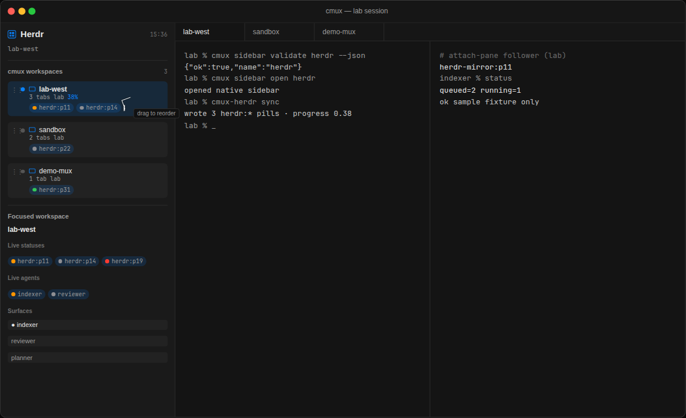
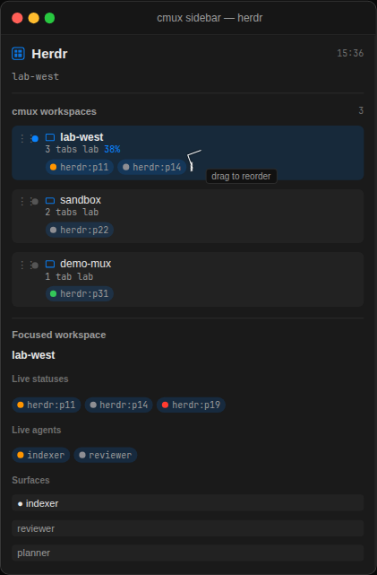
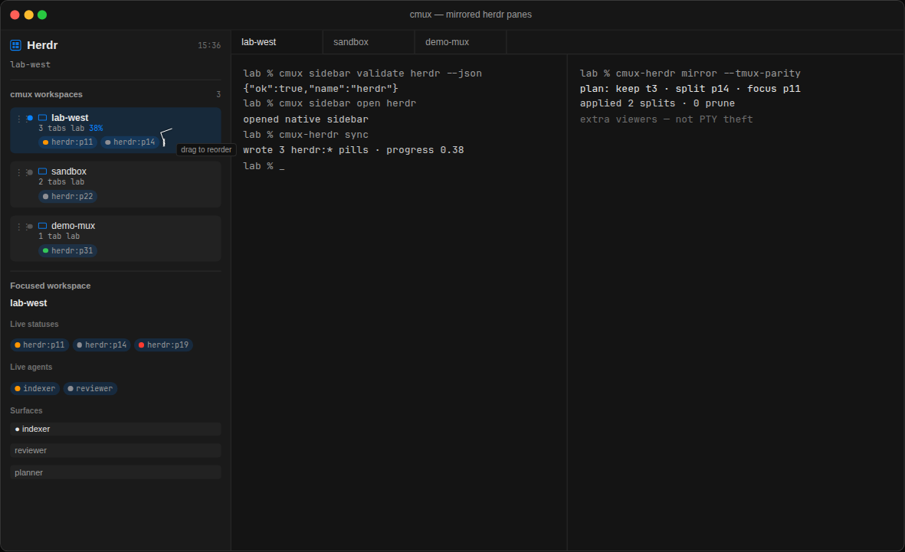

<h1 align="center">cmux-herdr</h1>
<p align="center"><strong>A cmux plugin for Herdr</strong></p>
<p align="center">
  Live status pills in the cmux sidebar, Herdr tab and pane
  mirroring, and a CLI that treats nested Herdr agents as
  first-class cmux surfaces.
</p>

<p align="center">
  
</p>

<p align="center">
  <a href="https://github.com/RaviTharuma/cmux-herdr/actions/workflows/ci.yml"></a>
  <a href="https://github.com/RaviTharuma/cmux-herdr/releases/latest"></a>
  <a href="LICENSE"></a>
  <a href="https://www.python.org/downloads/"></a>
  <a href="https://github.com/topics/plugin"></a>
</p>

<p align="center">
  English ·
  <a href="docs/de/README.md">Deutsch</a>
  ·
  <a href="https://github.com/manaflow-ai/cmux">cmux</a>
  ·
  <a href="https://github.com/herdrdev/herdr">Herdr</a>
  ·
  <a href="CHANGELOG.md">changelog</a>
</p>

**cmux-herdr** is the plugin you install when [Herdr](https://github.com/herdrdev/herdr)
runs *inside* [cmux](https://github.com/manaflow-ai/cmux). cmux is the outer
macOS terminal. Herdr is the inner agent mux. Without this plugin, every agent
collapses into one cmux tab titled roughly `herdr`. With it, each pane gets a
status pill in the cmux sidebar, each tab can become a real cmux surface, and you
drive both layers from one CLI: `cmux-herdr`.

This is a released plugin (**v0.5.0**), not a patch to `cmux.app`. Python 3.10+,
standard library only — no `pip`, no `npm`, no Cargo binary.

## Install

The in-app UI is the interpreted Swift sidebar `herdr` — mouse, drag-and-drop,
and `Reorderable` over **live cmux workspaces**. It is not a keyboard TUI and
it does not invent a team.

From a clone (or the plugin-manager checkout):

```bash
mkdir -p ~/.config/cmux/sidebars
cp sidebars/herdr.swift ~/.config/cmux/sidebars/herdr.swift
cmux sidebar reload
cmux sidebar validate herdr --json
cmux sidebar open herdr
```

Enable custom sidebars in cmux Settings → Beta features if `open` is refused.

### CLI (official plugin manager)

The `cmux-herdr` CLI and optional plugin-manager checkout:

```bash
cmux sidebar plugin install https://github.com/RaviTharuma/cmux-herdr.git
cmux sidebar plugin use cmux-herdr
cmux sidebar plugin update cmux-herdr
cmux sidebar plugin remove cmux-herdr
```

That clones into `$XDG_DATA_HOME/cmux/mux-plugins/cmux-herdr` (or
`~/.local/share/cmux/mux-plugins/cmux-herdr`). Copy `sidebars/herdr.swift`
from there if you did not already. `cmux-plugin.toml` is honest Python
(`[build]` is chmod +x, not Cargo). Plugin-manager `use` may host a PTY
fallback; the product sidebar remains `herdr.swift`.

Contributor symlink of the CLI (not the user UI path): [CONTRIBUTING.md](CONTRIBUTING.md).
Release notes: [RELEASE.md](RELEASE.md).

## Features

| | |
|---|---|
| **Status pills** | Every Herdr agent becomes a `herdr:<pane_id>` pill in the cmux sidebar — working, idle, done, blocked — plus a progress bar for the session. |
| **Tab and pane mirror** | `cmux-herdr mirror --tmux-parity` projects Herdr tabs into real cmux tabs and splits, with layout, focus, order, and prune. Same contract cmux gives tmux over SSH. |
| **Live watch** | `cmux-herdr watch --tmux-parity` keeps pills and surfaces in sync. Prefers Herdr `events.subscribe`; otherwise polls. Optional LaunchAgent so it survives closing the pane. |
| **One CLI** | Topology (`tree`, `agents`), control (`new-tab`, `send`, `agent-prompt`), attach/detach/restore, and the published Herdr socket API — never `server.stop`. |
| **Native sidebar** | Interpreted Swift `herdr` with mouse, drag-and-drop, and `Reorderable` live workspaces. Status pills, agents, and surfaces bind host cmux context. Ghostty/cmux theme tokens — no custom green skin. |
| **Agent skill** | Ships a `cmux-herdr` skill so coding agents learn the dual hierarchy instead of pretending Herdr is tmux. |
| **Safe handoff** | Plugin and native cmux share one writer lease. If native nested topology is live, this plugin yields. If native dies, watch can resume. |

<p align="center">
  
</p>

<p align="center">
  
</p>

## Quick start

Run these **inside a Herdr pane nested in cmux** so both sockets are in the
environment:

```bash
cmux-herdr doctor              # install, fingerprint, LaunchAgent, dry sync
cmux-herdr status              # dual cmux + Herdr context
cmux-herdr tree                # workspaces → tabs → panes → agents
cmux-herdr sync                # one-shot status pills
cmux-herdr watch --tmux-parity # live pills + tabs/splits
```

Open the native sidebar after the copy step:

```bash
cmux sidebar validate herdr --json
cmux sidebar open herdr
```

Then `cmux-herdr sync` or `watch` so `herdr:*` pills show up on those rows.

## Commands

| Command | What it does |
|---|---|
| `doctor` | Diagnose plugin install, host fingerprint, sidebar, LaunchAgent |
| `status` | Show nested cmux + Herdr context |
| `tree` / `agents` | Inner topology, compact agent list |
| `sync` / `watch` | Write status pills (watch loops; `--tmux-parity` also mirrors surfaces) |
| `mirror` | Project Herdr tabs/panes into cmux tabs/splits (`--all`, `--prune`, `--dry-run`) |
| `attach-pane` | Follow one Herdr pane in this terminal |
| `attach` / `detach` / `restore` | Live apply host; detach leaves Herdr running; restore never replays a stale tree |
| `associations` | Read the pane → status-key cache |
| `lock-title` / `unlock-title` | Pin a pill display name |
| `lease` | Inspect the plugin ↔ native writer lease |
| `clear` | Remove `herdr:*` pills; leave other cmux status alone |
| `focus-workspace` / `focus-tab` / `focus-pane` / `focus-agent` | Jump in the inner mux |
| `read-pane` / `read-agent` | Read terminal output |
| `send` / `send-key` / `agent-prompt` | Type, key chords, wait-until-done prompts |
| `new-tab` / `close-pane` / `split` / `zoom-pane` / `resize-pane` | Inner layout |
| `layout` / `set-ratio` / `move-pane` / `focus-dir` / `move-tab` / `rename-pane` | Tab geometry |
| `start-agent` / `agent-explain` / `agent-view` / `process-info` | Agent extras |
| `worktree` / `manifests` / `notify` / `window-title` | Herdr-only surface |
| `api` | Allowlisted Herdr RPC (`--list`; never `server.stop`) |
| `observe` | Subscribe to a Herdr method (for example `pane_surfaces`) |
| `json-dump` | Full snapshot for debugging (redact personal paths before sharing) |

`cmux-herdr --help` lists flags for every subcommand. Herdr-only verbs with no
tmux analogue: [docs/upstream/HERDR_BEYOND_TMUX.md](docs/upstream/HERDR_BEYOND_TMUX.md).

## Requirements

- macOS with `cmux` and `herdr` on `PATH`
- A cmux build that includes `cmux sidebar plugin`
- Python 3.10+ (stdlib only; **not** on PyPI)
- A working Herdr socket (usual when `HERDR_ENV=1`)
- Herdr **0.8+** (agent name may live under `agent_session.agent`)
- `sync` / `watch` / `mirror` from a nested pane so both contexts exist; `tree` and `agents` still work without cmux

## How it works

```text
cmux.app  (outer windows, workspaces, tabs)
   └── terminal running herdr
          └── Herdr tabs / panes / agents
                 └── cmux-herdr
                       herdr CLI + Unix socket  →  snapshot
                       cmux CLI                 →  pills, tabs, splits
                       CMUX_TUI_SOCKET          →  sidebar TUI workspaces
```

`sync` and `watch` keep a user-owned cache under `$XDG_STATE_HOME/cmux-herdr/`
(default `~/.local/state/cmux-herdr/`):

| File | Role |
|---|---|
| `parent-<fingerprint>.json` | Locked outer cmux workspace for this host |
| `associations-<fingerprint>.json` | Live `pane_id → status_key / agent_session / status`, plus mirrors and title locks |
| `writer-<fingerprint>.json` | Single-writer lease (`owner`, `pid`, `heartbeat_ms`) |
| `restore-<endpointHash>.json` | Last attach (`mode: reattach` only) |

**Host fingerprint** (selects which files to read/write):

| Piece | Source | Required for auto-resolve |
|---|---|---|
| Outer surface | `CMUX_SURFACE_ID` | yes |
| Herdr socket | `HERDR_SOCKET_PATH` | yes |
| Herdr server pid | `HERDR_SERVER_PID` or a pid file beside the socket | optional |
| Inner workspace | `HERDR_WORKSPACE_ID` | scopes associations (defaults to `default`) |

Missing fingerprint pieces fail closed with a clear error — the plugin will not
guess a host and write pills onto a random workspace. `--workspace` still
overrides. This cache is not authoritative restore state for cmux.

**Single writer.** If native nested topology holds the lease, plugin `sync` /
`watch` / `mirror` / `attach` / `observe` / `restore` yield. A dead pid or
expired heartbeat is stale and the other path may resume. `CMUX_HERDR_NATIVE_LIVE=1`
is an explicit native claim. `CMUX_HERDR_FORCE_PLUGIN=1` forces the plugin.
`CMUX_HERDR_LOCK_TITLES=1` locks each display name after the first successful
write. This is a handoff, not Ghostty PTY theft.

Full design: [docs/PLUGIN_DESIGN.md](docs/PLUGIN_DESIGN.md) ·
[docs/ARCHITECTURE.md](docs/ARCHITECTURE.md) ·
[mapping/concept-map.md](mapping/concept-map.md).

## Status mapping

| Herdr status | Pill color | Icon |
|---|---|---|
| working | orange `#ff9500` | `hammer` |
| idle | gray | `pause.circle` |
| done | green | `checkmark.circle` |
| blocked | red | `exclamationmark.triangle` |
| unknown | gray | `questionmark.circle` |

Every sync removes stale `herdr:*` keys and leaves unrelated cmux status alone.
Progress is the fraction of agents still working.

## Deep mirror

`cmux-herdr mirror` is the plugin analogue of cmux `ssh-tmux`. `--tmux-parity`
turns on the full reconcile contract (all tabs, prune, layout tree, ratios, tab
order, focus). Matrix: [docs/upstream/TMUX_PARITY.md](docs/upstream/TMUX_PARITY.md).

| Herdr | cmux projection |
|---|---|
| Tab | cmux tab (first pane is the tab root); order follows Herdr tab numbers |
| Extra panes | cmux splits from the layout tree (`horizontal` → right, `vertical` → down) |
| Split ratios | `cmux set-ratio` from layout cell rects |
| Focused pane | matching cmux surface (`--focus` / `--tmux-parity`) |
| Pane contents | `cmux-herdr attach-pane` follower (`herdr pane read` + `pane send-text`) |

Reconcile is idempotent: each pane is keyed `herdr-mirror:<pane_id>`. A second
`mirror` keeps existing surfaces and only creates, renames, or prunes diffs.

```bash
cmux-herdr mirror                 # current $HERDR_TAB_ID only (safe default)
cmux-herdr mirror --all           # full Herdr session
cmux-herdr mirror --tmux-parity
cmux-herdr mirror --dry-run       # plan only
cmux-herdr watch --tmux-parity    # live tabs/splits + pills + event wait
cmux-herdr mirror --prune         # close cmux surfaces whose Herdr panes are gone
```

This cannot steal Herdr PTYs into Ghostty. It creates **extra cmux viewers** of
the live Herdr session — the same idea as attaching a second tmux client.

## Limitations

- Extra viewers, not PTY theft. Native window mirror is the cmux `RemoteHerdrWindowMirror` track.
- Nested shells can carry stale outer cmux IDs. The plugin re-resolves the live containing workspace before writing status.
- Multi-parent hosts need a complete fingerprint (`CMUX_SURFACE_ID` + `HERDR_SOCKET_PATH`).
- The plugin does not inject a fake `tmux` binary; see [shims/README.md](shims/README.md).
- Titles and renames are owned by Herdr title tracks, not this plugin.

Inventory and open checklist: **[OPEN.md](OPEN.md)**.

## FAQ

**Is this shipped inside cmux.app?**
No. It is a user-installed sidebar plugin. You keep it when you upgrade cmux.

**How is this different from `herdr-plugin-cmux`?**
[lachieh/herdr-plugin-cmux](https://github.com/lachieh/herdr-plugin-cmux) is a
*Herdr* plugin (`herdr plugin install …`) that adds sidebar rows from the Herdr
side. **cmux-herdr** is the *cmux* plugin: official `cmux sidebar plugin`
install, `cmux-herdr` CLI, `mirror` / `watch --tmux-parity`, and agent skill.
You can use one or both; they share the idea, not the install.

**Will native cmux nested topology replace this?**
That work lives on [cmux#8737](https://github.com/manaflow-ai/cmux/issues/8737)
and related PRs. This plugin is the supported path today and stays the
compatibility fallback. Plugin and native share a writer lease so they do not
fight.

**Does it need a cmux PR to work?**
No. Install it with the plugin manager and run it.

## Native cmux track

Not required to use the plugin. Design notes live in
[docs/upstream/](docs/upstream/README.md).

| Track | Link |
|---|---|
| Community poll | [Discussion #10106](https://github.com/manaflow-ai/cmux/discussions/10106) |
| Compat dispatcher | [PR #8736](https://github.com/manaflow-ai/cmux/pull/8736) |
| Nested topology sidebar | [PR #10045](https://github.com/manaflow-ai/cmux/pull/10045) |
| Window-mirror engine | [RaviTharuma/cmux#8](https://github.com/RaviTharuma/cmux/pull/8) |
| Full design issue | [Issue #8737](https://github.com/manaflow-ai/cmux/issues/8737) |

## Development

**Tests are stdlib `unittest` only — no pytest.** Prefer the wrapper:

```bash
./scripts/test.sh
./bin/cmux-herdr --version
./bin/cmux-herdr --help
./bin/cmux-herdr doctor
./bin/cmux-herdr-sidebar --help
```

There is no compile step. `python3 -m py_compile` inside `scripts/test.sh` only
checks that the Python sources parse. Layout of the repo:
[docs/ARCHITECTURE.md](docs/ARCHITECTURE.md). Index:
[docs/README.md](docs/README.md).

## Contributing

Bug reports and PRs are welcome. Please read [CONTRIBUTING.md](CONTRIBUTING.md)
and the [Code of Conduct](CODE_OF_CONDUCT.md). Security issues go through
[SECURITY.md](SECURITY.md) (private advisory), not a public issue.

Maintainer notes: [docs/MAINTAINING.md](docs/MAINTAINING.md) (English) and
[docs/de/GITHUB.md](docs/de/GITHUB.md) (Deutsch).

## License

[MIT](LICENSE) © 2026 Ravi Tharuma.
