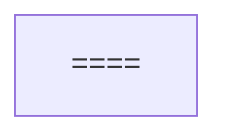

]
17:T2c7f,
# Overview

<details>
<summary>Relevant source files</summary>

The following files were used as context for generating this wiki page:

- [.github/swift-file-length-budget.tsv](.github/swift-file-length-budget.tsv)
- [CLI/cmux.swift](CLI/cmux.swift)
- [README.md](README.md)
- [README.vi.md](README.vi.md)
- [Resources/Localizable.xcstrings](Resources/Localizable.xcstrings)
- [Sources/AppDelegate.swift](Sources/AppDelegate.swift)
- [Sources/ContentView.swift](Sources/ContentView.swift)
- [Sources/GhosttyTerminalView.swift](Sources/GhosttyTerminalView.swift)
- [Sources/TabManager.swift](Sources/TabManager.swift)
- [Sources/TerminalController.swift](Sources/TerminalController.swift)
- [Sources/TerminalSSHSessionDetector.swift](Sources/TerminalSSHSessionDetector.swift)
- [Sources/Workspace.swift](Sources/Workspace.swift)
- [Sources/cmuxApp.swift](Sources/cmuxApp.swift)
- [cmux.xcodeproj/project.pbxproj](cmux.xcodeproj/project.pbxproj)
- [cmuxTests/GhosttyConfigTests.swift](cmuxTests/GhosttyConfigTests.swift)
- [cmuxTests/TerminalAndGhosttyTests.swift](cmuxTests/TerminalAndGhosttyTests.swift)
- [cmuxTests/WorkspaceRemoteConnectionTests.swift](cmuxTests/WorkspaceRemoteConnectionTests.swift)

</details>


## Purpose and Scope

cmux is a native macOS terminal application built on `libghostty` featuring vertical tabs, workspaces, and an integrated AI agent notification system. It is designed for developers who manage multiple concurrent coding sessions, particularly those involving AI agents (like Claude Code or OpenCode) that require periodic human intervention. The application provides GPU-accelerated terminal rendering, an embedded scriptable browser for web development workflows, and a comprehensive automation API via Unix sockets and a CLI.

This document serves as a high-level introduction to cmux's architecture, core concepts, and technology stack. For detailed information about specific subsystems, refer to the child pages:
- [System Architecture](#1.1) — Explains the high-level architecture including the SwiftUI + AppKit hybrid approach and core components.
- [Key Concepts and Terminology](#1.2) — Defines core terminology like workspaces, surfaces, and panels.
- [Repository Structure](#1.3) — Documents the organization of the repository and source directories.

---

## Core Capabilities

cmux provides several primitives for orchestrating development environments:

| Capability | Description | Primary Components |
|------------|-------------|-------------------|
| **Vertical Workspaces** | Sidebar-based management with git branch, PR status, directory tracking, and listening ports. | `TabManager`, `SidebarState`, `Workspace` |
| **AI Notifications** | Blue ring indicators and notification aggregation for OSC sequences (9/99/777). | `TerminalNotificationStore`, `TerminalNotification` |
| **Bonsplit Layouts** | Advanced multi-panel layouts supporting horizontal and vertical splits. | `BonsplitController`, `WorkspaceContentView` |
| **GPU Terminal** | High-performance terminal rendering powered by libghostty. | `GhosttyTerminalView`, `TerminalPanel` |
| **Embedded Browser** | WKWebView-based browser with an automation API for agent-driven web interaction. | `CmuxWebView`, `BrowserPanel` |
| **Session Persistence** | Automatic snapshots and restoration of window, workspace, and panel state. | `SessionPersistenceStore`, `AppSessionSnapshot` |
| **Remote Support** | SSH workspace bootstrapping with image upload and browser proxying. | `WorkspaceRemoteSessionController`, `cmuxd-remote` |
| **Agent Vault** | Persistent session index for resuming agent workflows (Claude, Gemini, Rovo). | `SessionIndexStore`, `FeedPanelView` |
| **Remote Tmux** | Mirroring over SSH using `-CC` control mode. | `RemoteTmuxController`, `RemoteTmuxControlConnection` |

**Sources:** [Sources/TabManager.swift:194-195](), [Sources/Workspace.swift:52-144](), [Sources/cmuxApp.swift:54-57](), [Sources/TerminalController.swift:3-13]()

---

## High-Level System Architecture

The following diagram maps natural language system concepts to their corresponding code entities:

```mermaid
graph TB
    subgraph 

====

]
    end
    
    CmuxMain --> cmuxApp
    cmuxApp --> AppDelegate
    cmuxApp --> TabManager
    cmuxApp --> NotificationStore
    
    TabManager --> WorkspacesModel
    
    ContentView --> WorkspaceView
    WorkspaceView --> TerminalPanel
    WorkspaceView --> BrowserPanel
    
    AppDelegate -.manages.-> TerminalController
    TerminalController -.controls.-> TabManager
```

**Architecture Overview**

cmux utilizes a SwiftUI + AppKit hybrid architecture to balance modern UI development with the high-performance requirements of terminal and web rendering:

1.  **Entry Point**: `CmuxMain` handles process-level routing (e.g., render workers vs. main app) [Sources/cmuxApp.swift:29-40](). `cmuxApp` is the SwiftUI `@main` struct that initializes global state and bridges to `AppDelegate` [Sources/cmuxApp.swift:42-67]().
2.  **State Management**: Core application state is held in `TabManager` [Sources/TabManager.swift:178-185](), which delegates workspace collection management to `WorkspacesModel` [Sources/TabManager.swift:194-195]().
3.  **UI Coordination**: `ContentView` acts as the primary layout coordinator, managing the relationship between the sidebar and the active workspace content via `WindowCommandPaletteOverlayController` [Sources/ContentView.swift:125-162]().
4.  **Panel System**: Content is divided into 

====

 hosted within the `Bonsplit` layout engine. This allows terminals [Sources/GhosttyTerminalView.swift:1-12](), browsers, and file previews to coexist.
5.  **External Automation**: `TerminalController` listens on a Unix socket, allowing external tools and the `cmux` CLI to programmatically manipulate the app [Sources/TerminalController.swift:113-117]().

For details, see [System Architecture](#1.1).

---

## Repository Structure

The repository is organized to manage the Swift frontend, vendored C/Zig dependencies, and various helper binaries.

| Directory | Purpose | Key Entities |
| :--- | :--- | :--- |
| `Sources/` | Core Swift source code | `cmuxApp.swift`, `AppDelegate.swift`, `TabManager.swift`, `Workspace.swift` |
| `Resources/` | Assets, localizations, and UI strings | `Localizable.xcstrings` |
| `CLI/` | Command line interface source | `cmux.swift` |
| `cmuxTests/` | Swift unit and integration tests | `WorkspaceRemoteConnectionTests.swift`, `SessionPersistenceTests.swift` |
| `Packages/` | Internal Swift Packages | `CmuxTerminalCore`, `CmuxCommandPalette`, `CmuxSidebar` |

**Sources:** [.github/swift-file-length-budget.tsv:4-20](), [Sources/cmuxApp.swift:1-18](), [CLI/cmux.swift:1-14]()

For details, see [Repository Structure](#1.3).

---

## Core Data Models

The following diagram illustrates the relationship between the primary data entities in the system:

```mermaid
erDiagram
    TabManager ||--|| WorkspacesModel : 

====


    
    Workspace {
        UUID id
        string customTitle
        string currentDirectory
        BonsplitController bonsplitController
        LayoutMode layoutMode
    }
    
    Panel {
        UUID id
        PanelType type
    }
    
    TerminalNotificationStore ||--o{ TerminalNotification : 

====


```

**Data Model Overview**

*   **Workspace**: The fundamental unit of organization. A `Workspace` (aliased from `Tab` [Sources/TabManager.swift:24-24]()) contains a `BonsplitController` which manages the tree of split panels [Sources/Workspace.swift:57-57]().
*   **Panels**: Abstract representations of content. `TerminalPanel` hosts a `GhosttyTerminalView` [Sources/GhosttyTerminalView.swift:1-12](), while `BrowserPanel` hosts a `CmuxWebView`.
*   **Notifications**: `TerminalNotification` objects are generated by OSC sequences or CLI commands and are stored in the `TerminalNotificationStore` [Sources/cmuxApp.swift:54-54]().
*   **Persistence**: State is captured in `SessionWorkspaceSnapshot` structures, allowing the system to restore the exact layout, metadata (like git branch), and content across restarts [Sources/Workspace.swift:52-144]().

For details, see [Key Concepts and Terminology](#1.2).

---

## Development Workflow

Development of cmux is optimized for parallel testing and isolation:

*   **Security Migration**: The app automatically migrates socket passwords to secure, non-protected directories to avoid macOS Sequoia privacy prompts [Sources/cmuxApp.swift:80-97]().
*   **Secret Management**: Secrets are stored in 0600 files via `SecretFileStore` [Sources/cmuxApp.swift:94-94]().
*   **Localization**: UI strings are managed in `Localizable.xcstrings`, supporting extensive localizations including Arabic, German, Spanish, Japanese, and more [Resources/Localizable.xcstrings:1-121]().

**Sources:** [Sources/cmuxApp.swift:74-121](), [Resources/Localizable.xcstrings:1-240]()

---

## External Control and Automation

cmux provides several interfaces for external interaction:

*   **CLI Tool**: The `cmux` binary (located in `CLI/cmux.swift`) provides a robust interface for interacting with the running application, including session recording for AI agents like Claude [CLI/cmux.swift:129-172]().
*   **Socket API**: A Unix socket protocol implemented in `TerminalController` allows deep integration for AI agents to control the terminal and browser [Sources/TerminalController.swift:113-117]().
*   **Agent Integration**: The system handles specialized OSC sequences and provides an `AgentChatTranscriptService` for mobile companion app synchronization [Sources/TerminalController.swift:127-127]().

**Sources:** [CLI/cmux.swift:129-172](), [Sources/TerminalController.swift:113-145]()
18:T26cf,
# System Architecture

<details>
<summary>Relevant source files</summary>

The following files were used as context for generating this wiki page:

- [.github/swift-file-length-budget.tsv](.github/swift-file-length-budget.tsv)
- [CLI/cmux.swift](CLI/cmux.swift)
- [Packages/macOS/CmuxAppKitSupportUI/Tests/CmuxAppKitSupportUITests/WindowChrome/Appearance/WindowAppearanceResolverTests.swift](Packages/macOS/CmuxAppKitSupportUI/Tests/CmuxAppKitSupportUITests/WindowChrome/Appearance/WindowAppearanceResolverTests.swift)
- [Resources/Localizable.xcstrings](Resources/Localizable.xcstrings)
- [Sources/AppDelegate.swift](Sources/AppDelegate.swift)
- [Sources/ContentView.swift](Sources/ContentView.swift)
- [Sources/GhosttyKeyModifiers.swift](Sources/GhosttyKeyModifiers.swift)
- [Sources/GhosttyTerminalView.swift](Sources/GhosttyTerminalView.swift)
- [Sources/GhosttyTerminalViewSupport.swift](Sources/GhosttyTerminalViewSupport.swift)
- [Sources/TabManager.swift](Sources/TabManager.swift)
- [Sources/TerminalController.swift](Sources/TerminalController.swift)
- [Sources/TerminalSSHSessionDetector.swift](Sources/TerminalSSHSessionDetector.swift)
- [Sources/Workspace.swift](Sources/Workspace.swift)
- [Sources/cmuxApp.swift](Sources/cmuxApp.swift)
- [cmux.xcodeproj/project.pbxproj](cmux.xcodeproj/project.pbxproj)
- [cmuxTests/GhosttyConfigTests.swift](cmuxTests/GhosttyConfigTests.swift)
- [cmuxTests/GhosttyOptionAsAltModsTests.swift](cmuxTests/GhosttyOptionAsAltModsTests.swift)
- [cmuxTests/TerminalAndGhosttyTests.swift](cmuxTests/TerminalAndGhosttyTests.swift)
- [cmuxTests/WorkspaceRemoteConnectionTests.swift](cmuxTests/WorkspaceRemoteConnectionTests.swift)
- [docs/ghostty-fork.md](docs/ghostty-fork.md)
- [scripts/ghosttykit-checksums.txt](scripts/ghosttykit-checksums.txt)

</details>


## Purpose and Scope

This document describes the high-level system architecture of **cmux**, a Ghostty-based macOS terminal emulator featuring vertical tabs, integrated AI agent notifications, and a hybrid UI architecture. It details the interaction between the SwiftUI-driven application layer, the AppKit-based windowing system, and the core terminal engine provided by `libghostty`.

For implementation details on specific subsystems, see:
- UI Layer and View Hierarchy: [Sources/WorkspaceContentView.swift:1-50]()
- Terminal and Browser Panels: [Sources/Panels/TerminalPanel.swift:1-100]()
- State Management and Persistence: [Sources/TabManager.swift:1-50]()

---

## High-Level Overview

cmux is built as a macOS-native application that bridges modern SwiftUI state management with the performance and low-level control of AppKit and the Ghostty terminal engine.

| Layer | Primary Components | Purpose |
|-------|-------------------|---------|
| **App Lifecycle** | `cmuxApp`, `AppDelegate` | Application entry point, window management, and system-level event routing. |
| **State Layer** | `TabManager`, `TerminalNotificationStore` | Centralized reactive state for workspaces, panels, and notifications. |
| **Layout Engine** | `BonsplitController`, `Workspace` | Manages complex split layouts and panel hierarchies. |
| **Terminal Engine** | `libghostty` (via `GhosttyKit`) | Core terminal emulation, rendering, and PTY management. |
| **UI Layer** | `ContentView`, `WorkspaceContentView` | SwiftUI views for sidebar, titlebar, and workspace organization. |

### Application Entity Map
This diagram bridges high-level system concepts to their specific implementation classes and files.

```mermaid
graph TB
    subgraph 

====

]
    end
    
    App --> Delegate
    Delegate --> TManager
    TManager --> WS
    WS --> Bonsplit
    Bonsplit --> Panel
    Panel --> GView
    GView --> GKit
    GKit --> LibG
```

**Sources:**
- [Sources/cmuxApp.swift:28-67]()
- [Sources/AppDelegate.swift:1-15]()
- [Sources/TabManager.swift:178-202]()
- [Sources/Workspace.swift:1-26]()
- [Sources/GhosttyTerminalView.swift:1-25]()

---

## Core Components

### AppDelegate and Window Management
The `AppDelegate` acts as the primary coordinator for the macOS application lifecycle. It handles window creation, state restoration, and global shortcut routing. cmux uses a hybrid approach where the window content is hosted in a SwiftUI-driven interface while retaining AppKit's control over window chrome and safe areas.

**Key Responsibilities:**
- Managing the main window lifecycle and coordination with `TabManager` [Sources/TabManager.swift:179-181]().
- Routing keyboard shortcuts and managing terminal-specific typing latency via `CmuxTypingTiming` [Sources/AppDelegate.swift:157-195]().
- Handling asynchronous workspace creation through `ConfiguredGroupActionAsyncWorkspaceObserver` [Sources/AppDelegate.swift:51-155]().
- Configuring the application environment and initializing the `SettingsRuntime` [Sources/cmuxApp.swift:74-123]().

### TabManager and Workspace System
The `TabManager` is an `ObservableObject` that serves as the source of truth for all open workspaces (formerly referred to as Tabs).

| Entity | Code Entity | Description |
|--------|-------------|-------------|
| **Workspace** | `Workspace` | A top-level container (tab) containing a split-view layout of panels [Sources/Workspace.swift:51-144](). |
| **Panel** | `Panel` | An abstract unit of UI (Terminal, Browser, or Markdown) defined by the `Panel` protocol [Sources/WorkspaceContentView.swift:16-34](). |
| **Split Layout** | `BonsplitController` | The engine that manages recursive binary splits (panes) within a workspace [Sources/Workspace.swift:57-58](). |

**Sources:**
- [Sources/TabManager.swift:178-202]()
- [Sources/Workspace.swift:51-144]()
- [Sources/cmuxApp.swift:54-57]()

---

## Ghostty Integration

cmux integrates the Ghostty terminal engine via a vendored `GhosttyKit.xcframework`. The integration is primarily handled by the `GhosttyTerminalView`, which wraps the low-level Ghostty C API into a macOS-native `NSView`.

### Data Flow: Terminal Input and Rendering
1. **Input**: Key events are captured and passed to `libghostty`. `GhosttyTerminalView` handles specific modifier logic and C-API callbacks like `cmuxRuntimeReadClipboardCallback` [Sources/GhosttyTerminalView.swift:174-180]().
2. **Processing**: `libghostty` handles PTY communication and terminal state updates.
3. **Rendering**: cmux uses a 

====

 approach (`TerminalWindowPortal`) to bridge SwiftUI's layout with Ghostty's Metal-based rendering. This ensures that the terminal surface is drawn directly by the engine for maximum performance.

```mermaid
graph LR
    subgraph 

====

 ---> PTY
    LibG --> Surface
```

**Sources:**
- [Sources/GhosttyTerminalView.swift:1-13]()
- [Sources/TerminalWindowPortal.swift:1-20]()
- [Sources/cmuxApp.swift:18-20]()

---

## Hybrid UI Architecture (SwiftUI + AppKit)

cmux utilizes a sophisticated hybrid approach to overcome SwiftUI's limitations in high-performance terminal rendering and complex window decorations.

### The Portal System
Because SwiftUI views can sometimes lag or struggle with the rapid redraw requirements of a terminal, cmux uses 

====

 (`TerminalWindowPortal.swift` and `BrowserWindowPortal.swift`). These components allow SwiftUI to define *where* a panel should be, while an underlying `NSView` (the actual terminal or browser) is managed directly in the AppKit layer.

### Overlay Management
The application manages complex overlays like the command palette using specialized controller logic that bridges AppKit views into the window hierarchy.

| Component | Implementation | Purpose |
|-----------|---------------|---------|
| `WindowCommandPaletteOverlayController` | [Sources/ContentView.swift:114-150]() | Manages the command palette overlay positioning and visibility within an `NSWindow`. |
| `CommandPaletteOverlayContainerView` | [Sources/ContentView.swift:36-46]() | An `NSView` subclass that selectively captures mouse events for overlays. |

**Sources:**
- [Sources/ContentView.swift:31-57]()
- [Sources/WorkspaceContentView.swift:105-175]()
- [Sources/AppDelegate.swift:1-29]()

---

## State and Persistence

The system state is reactive, driven by `@StateObject` instances in the root `cmuxApp`.

1. **Reactive UI**: Changes to `TabManager`, `TerminalNotificationStore`, or `SidebarState` automatically trigger SwiftUI view updates [Sources/cmuxApp.swift:54-57]().
2. **Persistence**: The application persists session data via snapshots. The `Workspace` model supports creation of session snapshots including layout, panel state, and terminal scrollback [Sources/Workspace.swift:51-144]().
3. **External Control**: `TerminalController` provides a Unix socket-based interface for programmatic control, allowing external tools to interact with the application state [Sources/TerminalController.swift:113-145]().

**Sources:**
- [Sources/cmuxApp.swift:54-67]()
- [Sources/Workspace.swift:147-175]()
- [Sources/TerminalController.swift:113-145]()
19:T2ce6,
# Key Concepts and Terminology

<details>
<summary>Relevant source files</summary>

The following files were used as context for generating this wiki page:

- [.github/swift-file-length-budget.tsv](.github/swift-file-length-budget.tsv)
- [CLI/cmux.swift](CLI/cmux.swift)
- [Resources/Localizable.xcstrings](Resources/Localizable.xcstrings)
- [Sources/AppDelegate.swift](Sources/AppDelegate.swift)
- [Sources/ContentView.swift](Sources/ContentView.swift)
- [Sources/GhosttyTerminalView.swift](Sources/GhosttyTerminalView.swift)
- [Sources/TabManager.swift](Sources/TabManager.swift)
- [Sources/TerminalController.swift](Sources/TerminalController.swift)
- [Sources/TerminalSSHSessionDetector.swift](Sources/TerminalSSHSessionDetector.swift)
- [Sources/Workspace.swift](Sources/Workspace.swift)
- [Sources/cmuxApp.swift](Sources/cmuxApp.swift)
- [cmux-tui/README.md](cmux-tui/README.md)
- [cmux-tui/crates/cmux-tui-cdp/src/chrome.rs](cmux-tui/crates/cmux-tui-cdp/src/chrome.rs)
- [cmux-tui/crates/cmux-tui-cdp/src/client.rs](cmux-tui/crates/cmux-tui-cdp/src/client.rs)
- [cmux-tui/crates/cmux-tui-cdp/src/lib.rs](cmux-tui/crates/cmux-tui-cdp/src/lib.rs)
- [cmux-tui/crates/cmux-tui-core/src/browser.rs](cmux-tui/crates/cmux-tui-core/src/browser.rs)
- [cmux-tui/crates/cmux-tui-core/src/lib.rs](cmux-tui/crates/cmux-tui-core/src/lib.rs)
- [cmux-tui/crates/cmux-tui-core/src/mux.rs](cmux-tui/crates/cmux-tui-core/src/mux.rs)
- [cmux-tui/crates/cmux-tui-core/src/surface.rs](cmux-tui/crates/cmux-tui-core/src/surface.rs)
- [cmux-tui/crates/cmux-tui-core/tests/browser_runtime.rs](cmux-tui/crates/cmux-tui-core/tests/browser_runtime.rs)
- [cmux-tui/crates/cmux-tui/src/app.rs](cmux-tui/crates/cmux-tui/src/app.rs)
- [cmux-tui/crates/cmux-tui/src/browser_input.rs](cmux-tui/crates/cmux-tui/src/browser_input.rs)
- [cmux-tui/crates/cmux-tui/src/config.rs](cmux-tui/crates/cmux-tui/src/config.rs)
- [cmux-tui/docs/configuration.md](cmux-tui/docs/configuration.md)
- [cmux-tui/docs/mouse.md](cmux-tui/docs/mouse.md)
- [cmux-tui/scripts/smoke-tui.py](cmux-tui/scripts/smoke-tui.py)
- [cmux.xcodeproj/project.pbxproj](cmux.xcodeproj/project.pbxproj)
- [cmuxTests/GhosttyConfigTests.swift](cmuxTests/GhosttyConfigTests.swift)
- [cmuxTests/TerminalAndGhosttyTests.swift](cmuxTests/TerminalAndGhosttyTests.swift)
- [cmuxTests/WorkspaceRemoteConnectionTests.swift](cmuxTests/WorkspaceRemoteConnectionTests.swift)

</details>


## Purpose and Scope

This document defines the core terminology and concepts used throughout the cmux application. cmux is a native macOS terminal built with SwiftUI and AppKit that integrates the Ghostty rendering engine (`libghostty`). It introduces a hierarchical layout system designed for high-density workflows involving AI coding agents.

This page covers the data models, layout primitives, and specialized terminology used in the codebase to manage windows, workspaces, and split panes, including distinctions between the macOS application and auxiliary tools like `cmux-tui`.

---

## Layout Hierarchy

cmux organizes the user interface into a strict hierarchy. At the top level is the application, which manages multiple windows. Each window contains a sidebar and a content area where workspaces are displayed.

### Workspace
A **Workspace** (often referred to as a 

====

 in the sidebar UI) is the primary unit of organization. A workspace represents a collection of panels and their specific layout state. In the codebase, `Tab` is used as a type alias for `Workspace` for backward compatibility [Sources/TabManager.swift:23-24]().

**Key Properties:**
- `id`: A unique `UUID` used to identify the workspace [Sources/Workspace.swift:123]().
- `bonsplitController`: Manages the internal split tree [Sources/Workspace.swift:57]().
- `panels`: A dictionary mapping `UUID` to `Panel` instances [Sources/Workspace.swift:68]().
- `layoutMode`: Supports standard grid layouts or a freeform `canvas` mode [Sources/Workspace.swift:138]().

**Sources:** [Sources/Workspace.swift:51-144](), [Sources/TabManager.swift:23-25]()

### Surface
A **Surface** is the abstract representation of a single content instance. While a Workspace is a collection of panes, a Surface is the content that lives *inside* those panes. The socket API uses `surface` handles to address these entities via the `surfaceId` [CLI/cmux.swift:41](). In the terminal context, this maps to a `GhosttySurface` which handles the actual TTY and rendering state [Sources/GhosttyTerminalView.swift:179-181]().

**Key Properties:**
- `id`: Unique identifier (UUID).
- `surfaceId`: The handle used in CLI and socket communications [CLI/cmux.swift:41]().

**Sources:** [CLI/cmux.swift:38-45](), [Sources/TerminalController.swift:27-28](), [Sources/GhosttyTerminalView.swift:179-181]()

### Panel
A **Panel** is the concrete implementation of a Surface's content. It defines how data is rendered and how the user interacts with it. cmux supports several primary panel types:

1.  **TerminalPanel**: A GPU-accelerated terminal powered by `GhosttyKit`. It uses `GhosttyTerminalView` as the SwiftUI wrapper [Sources/GhosttyTerminalView.swift:1-10]().
2.  **BrowserPanel**: A scriptable web browser based on `WKWebView` [Sources/AppDelegate.swift:4-24]().
3.  **MarkdownPanel**: A live-updating Markdown viewer with file-watching capabilities [Sources/cmuxApp.swift:1-10]().
4.  **FilePreviewPanel**: For viewing PDFs and images [Sources/.github/swift-file-length-budget.tsv:25]().

**Sources:** [Sources/GhosttyTerminalView.swift:1-25](), [Sources/AppDelegate.swift:4-24](), [Sources/cmuxApp.swift:1-10](), [Sources/.github/swift-file-length-budget.tsv:25]()

---

## Split Layout Engine (Bonsplit)

cmux uses a specialized layout engine called **Bonsplit** to manage complex window partitions.

### Pane
A **Pane** is a visual container within a Workspace that can be split horizontally or vertically. A pane can hold multiple **Surfaces**. The layout is persisted via `SessionPaneLayoutSnapshot` [Sources/Workspace.swift:46-49]().

### Split
A **Split** is the act of dividing a Pane into two. 
- **Vertical Split**: Divides a pane into left and right sections.
- **Horizontal Split**: Divides a pane into top and bottom sections.

### BonsplitController
The `BonsplitController` is the core logic coordinator for the layout. It handles the tree structure of panes, resizing via dividers, and manages the `treeSnapshot()` used for session persistence [Sources/Workspace.swift:57]().

**Sources:** [Sources/Workspace.swift:57-62](), [Sources/ContentView.swift:10]()

### Layout Hierarchy Diagram

```mermaid
graph TD
    subgraph 

====

]
    end
```

**Sources:** [Sources/cmuxApp.swift:42-67](), [Sources/Workspace.swift:51-144](), [Sources/TabManager.swift:178-200](), [Sources/AppDelegate.swift:1-30]()

---

## Code Entity Mapping

This diagram associates conceptual names with the specific Swift classes and files that implement them.

```mermaid
graph LR
    subgraph 

====

]
    end

    WS_Concept --- WS_Code
    Pane_Concept --- BS_Code
    Term_Concept --- GTV_Code
    API_Concept --- TC_Code
```

**Sources:** [Sources/Workspace.swift:51](), [Sources/TerminalController.swift:116](), [Sources/GhosttyTerminalView.swift:1](), [Sources/TabManager.swift:178]()

---

## Specialized Terminology

### Window Overlay / Portal
Because cmux mixes SwiftUI (for the sidebar and chrome) with AppKit/Metal (for Ghostty rendering), it uses an overlay system. Portals ensure that native AppKit views are positioned correctly over SwiftUI layouts. Hit-testing is managed via `hitTest(_:)` in `CommandPaletteOverlayContainerView` to allow events to pass through or be captured [Sources/ContentView.swift:36-46]().

**Sources:** [Sources/ContentView.swift:36-46](), [Sources/cmuxApp.swift:1-13]()

### Notification Store
The `TerminalNotificationStore` manages the state of notifications triggered by terminal escape sequences (OSC 9/99). These notifications drive the 

====

 indicators in the UI and Dock badge updates [Sources/cmuxApp.swift:54]().

**Sources:** [Sources/cmuxApp.swift:54](), [Sources/.github/swift-file-length-budget.tsv:45]()

### Handle (CLI/Socket)
In the context of the **TerminalController** (Socket API), a **Handle** is a temporary identifier used by external scripts or the `cmux` CLI to reference specific UI elements like windows, workspaces, or surfaces [CLI/cmux.swift:30-48]().

**Sources:** [CLI/cmux.swift:30-48](), [Sources/TerminalController.swift:116-150]()

### GhosttyKit
The vendored XCFramework that provides the core terminal emulation and rendering. cmux interacts with it through `GhosttyTerminalView` and the `ghostty_surface_t` C-interop layer [Sources/GhosttyTerminalView.swift:179-180]().

**Sources:** [Sources/GhosttyTerminalView.swift:1-25](), [Sources/cmuxApp.swift:18-20]()

### cmux-tui vs macOS App
`cmux-tui` is a Rust-based multiplexer that provides a TUI interface. While the macOS app uses `Bonsplit` and `SwiftUI`, `cmux-tui` implements its own session and workspace tree model [cmux-tui/README.md](). It communicates via a JSON-lines Unix-socket protocol, distinct from the macOS `TerminalController` V2 protocol [cmux-tui/crates/cmux-tui-core/src/mux.rs]().

**Sources:** [cmux-tui/README.md](), [cmux-tui/crates/cmux-tui-core/src/mux.rs]()

---

## Terminology Summary Table

| Term | Code Symbol | Description |
| :--- | :--- | :--- |
| **Workspace** | `Workspace` | A collection of panes and panels, formerly called `Tab` [Sources/TabManager.swift:24](). |
| **Panel** | `Panel` (Protocol) | The interface for terminal, browser, or markdown content [Sources/.github/swift-file-length-budget.tsv:108](). |
| **Surface** | `surfaceId` | A single instance of a panel identified by the CLI/Socket [CLI/cmux.swift:41](). |
| **Bonsplit** | `Bonsplit` (Module) | The layout engine managing split-view trees [Sources/Workspace.swift:13](). |
| **Socket API** | `TerminalController` | The Unix socket server for programmatic control [Sources/TerminalController.swift:116](). |
| **CLI** | `cmux` (Binary) | The command-line tool for interacting with the socket [CLI/cmux.swift:1](). |
| **TabManager** | `TabManager` | The top-level store managing all workspaces [Sources/TabManager.swift:178](). |

**Sources:** [Sources/Workspace.swift:51](), [Sources/TerminalController.swift:116](), [CLI/cmux.swift:1](), [Sources/TabManager.swift:24](), [Sources/cmuxApp.swift:53]()
1a:T21c7,
# Repository Structure

<details>
<summary>Relevant source files</summary>

The following files were used as context for generating this wiki page:

- [.claude/commands/release-local.md](.claude/commands/release-local.md)
- [.claude/commands/release-nightly.md](.claude/commands/release-nightly.md)
- [.claude/commands/release.md](.claude/commands/release.md)
- [.github/workflows/claude.yml](.github/workflows/claude.yml)
- [.github/workflows/cloud-vm-migrate.yml](.github/workflows/cloud-vm-migrate.yml)
- [.github/workflows/cloud-vm-smoke.yml](.github/workflows/cloud-vm-smoke.yml)
- [.github/workflows/presence.yml](.github/workflows/presence.yml)
- [.github/workflows/update-homebrew.yml](.github/workflows/update-homebrew.yml)
- [.gitignore](.gitignore)
- [.gitmodules](.gitmodules)
- [PROJECTS.md](PROJECTS.md)
- [README.md](README.md)
- [README.vi.md](README.vi.md)
- [scripts/build-sign-upload.sh](scripts/build-sign-upload.sh)
- [scripts/bump-version.sh](scripts/bump-version.sh)
- [scripts/release-pretag-guard.sh](scripts/release-pretag-guard.sh)

</details>


This document describes the physical organization of the cmux repository, including source directories, test directories, resources, scripts, vendored dependencies, and build outputs. For the high-level application architecture and how components interact at runtime, see [System Architecture](#1.1).

---

## Top-Level Directory Layout

The repository follows a standard macOS and iOS application structure with clear separation between source code, tests, resources, automation scripts, and vendored dependencies:

```
cmux/
├── cmux.xcodeproj/                 # Main macOS Xcode project
├── ios/                            # iOS companion app source
│   ├── cmux-ios.xcodeproj/         # iOS Xcode project
│   └── cmuxPackage/                # iOS composition-root Swift package
├── Sources/                        # macOS application source code
├── CLI/                            # CLI binary source code
├── Resources/                      # Assets, terminfo, shell integration, and Info.plist
├── cmuxTests/                      # Unit tests (macOS)
├── cmuxUITests/                    # UI automation tests
├── tests_v2/                       # Python socket API tests
├── scripts/                        # Build, reload, release automation
├── ghostty/                        # Git submodule (manaflow-ai/ghostty fork)
├── Packages/                       # Internal Swift packages (Shared, macOS, iOS)
│   ├── Shared/                     # Packages used by both macOS and iOS
│   ├── macOS/                      # macOS-specific logic (e.g., CmuxCanvasUI)
│   └── iOS/                        # iOS-specific logic (e.g., CmuxMobileShell)
├── vendor/                         # Local/Vendored Swift packages
├── web/                            # Next.js site, Cloud VM backend, and billing
├── vault/                          # Go-based cmux-vault CLI source
├── cmux-tui/                       # Rust TUI multiplexer and control socket
├── workers/                        # Cloudflare Workers (e.g., presence service)
├── CHANGELOG.md                    # Release history
├── CLAUDE.md                       # Agent development notes
└── README.md                       # User-facing documentation
```

**Sources:** [.gitmodules:1-11](), [README.md:1-140](), [.gitignore:43-58](), [ios/cmuxPackage/Package.swift:5-42]()

---

## Subprojects and Auxiliary Components

The repository hosts several major subprojects that extend the core macOS application:

*   **iOS Companion App (`ios/`)**: A modularized SwiftUI app using a composition-root pattern to assemble features like mobile terminal rendering and agent chat. [ios/cmuxPackage/Package.swift:5-10]()
*   **Web Site (`web/`)**: A Next.js project containing the public documentation, billing flows, and the Cloud VM backend for provisioning remote dev environments. [.gitignore:43-46](), [web/services/vms/]()
*   **Workers (`workers/`)**: Serverless components, notably the `presence` worker for real-time device status and sync. [.github/workflows/presence.yml:1-5]()
*   **Remote Daemon (`cmuxd-remote`)**: A Go binary for SSH workspace bootstrapping and RPC relay. [README.md:69-75]()
*   **Vault (`vault/`)**: The `cmux-vault` CLI for managing agent session transcripts and cloud sync. [.gitignore:56-59]()
*   **cmux-tui (`cmux-tui/`)**: A Rust-based multiplexer that implements a JSON-lines socket protocol for terminal and browser control. [.gitignore:52-54]()
*   **Webviews (`webviews/`)**: React-based applications bundled into the macOS app for rich content rendering like diff viewers. [README.md:129-131]()

**Sources:** [README.md:28-85](), [.gitmodules:1-11](), [.gitignore:52-54]()

---

## Source to Architecture Mapping

This diagram associates high-level system names with specific code entities to bridge the gap between natural language concepts and the implementation.

```mermaid
graph TB
    subgraph 

====

]
    end
    
    cmuxApp --> AppDelegate
    cmuxAppIOS --> CompRoot
    CompRoot --> MobileCore
    CompRoot --> Canvas
    CLI --> Socket
```

**Sources:** [Sources/App/RosettaNativeRelaunch.swift:19-41](), [ios/cmuxPackage/Package.swift:43-70](), [.gitignore:22-23](), [scripts/build-sign-upload.sh:185-186]()

---

## Build System and Release Data Flow

The release process involves building the Ghostty dependency, compiling the Swift app, and automating distribution via GitHub and Homebrew.

```mermaid
graph LR
    subgraph 

====

 --> Brew
```

**Sources:** [scripts/build-sign-upload.sh:62-125](), [.github/workflows/update-homebrew.yml:1-8](), [.claude/commands/release.md:5-75]()

---

## Directory: Resources/

The `Resources/` directory contains critical metadata, localized strings, and security entitlements.

- **`Info.plist`**: Defines the application bundle, document types (Folder, Shell Script), and URL schemes (http, https, ssh). [scripts/build-sign-upload.sh:85-91]()
- **`cmux.entitlements`**: Security configuration, including Sandbox exceptions for JIT, camera, and Apple Events. [scripts/build-sign-upload.sh:50-51]()
- **`appcast.xml`**: Generated by `sparkle_generate_appcast.sh` to facilitate Sparkle auto-updates. [scripts/build-sign-upload.sh:124-125]()

**Sources:** [scripts/build-sign-upload.sh:50-125](), [.gitignore:26-30]()

---

## Internal Packages

CMUX is divided into focused Swift packages located in the `Packages/` directory to isolate specific domains:

| Category | Key Packages | Purpose |
|----------|--------------|---------|
| **Shared** | `CMUXAuthCore`, `CmuxSyncStore` | Logic shared between macOS and iOS. [ios/cmuxPackage/Package.swift:23-42]() |
| **macOS** | `CmuxCanvasUI`, `CmuxSidebar` | Desktop-specific spatial layout and vertical tab UI. [.gitignore:69-72]() |
| **iOS** | `CmuxMobileShell`, `CmuxAgentChatUI` | Mobile UI and agent interaction logic. [.gitignore:71-72]() |
| **Automation** | `CMUXAgentLaunch`, `CmuxControlSocket` | Sanitizing agent launches and socket API implementation. [ios/cmuxPackage/Package.swift:30-35]() |

**Sources:** [.gitignore:67-73](), [ios/cmuxPackage/Package.swift:11-99]()
1b:T22d2,
# Development Setup

<details>
<summary>Relevant source files</summary>

The following files were used as context for generating this wiki page:

- [.xcode-version](.xcode-version)
- [CLAUDE.md](CLAUDE.md)
- [scripts/check-pbxproj.sh](scripts/check-pbxproj.sh)
- [scripts/git-hooks/pre-commit](scripts/git-hooks/pre-commit)
- [scripts/install-git-hooks.sh](scripts/install-git-hooks.sh)
- [scripts/normalize-pbxproj.py](scripts/normalize-pbxproj.py)
- [scripts/reload.sh](scripts/reload.sh)
- [scripts/reload2.sh](scripts/reload2.sh)
- [scripts/reloadp.sh](scripts/reloadp.sh)
- [scripts/setup.sh](scripts/setup.sh)

</details>


This document explains how to configure a local development environment for cmux, including required tools, build scripts, and debugging facilities. It covers the initial setup, the tag-based build system for running isolated instances, and the debug logging infrastructure.

For information about the CI/CD pipeline and automated testing, see [CI/CD Pipelines](#10). For release procedures, see [Release Process](#11).

---

## Prerequisites and Required Tools

cmux development requires the following tools installed on your macOS system:

| Tool | Purpose | Installation |
|------|---------|--------------|
| **Xcode 16+** | Swift 6.0 compiler, macOS SDK | Mac App Store or [developer.apple.com](https://developer.apple.com) |
| **zig** | Ghostty and cmuxd build system | `brew install zig` |
| **create-dmg** | DMG packaging for releases | `npm install --global create-dmg@8.0.0` |
| **git** | Version control, submodule management | Included with Xcode Command Line Tools |

The project requires **macOS 13.0 (Ventura)** or later as the deployment target. The repository pins the Xcode version in `.xcode-version` [/.xcode-version:1-1](), and `scripts/check-pbxproj.sh` enforces the corresponding `objectVersion` (currently `60` for Xcode 16) [scripts/check-pbxproj.sh:13-21]().

Sources: [scripts/setup.sh:12-17](), [CLAUDE.md:80-90](), [scripts/reload.sh:22-30](), [/.xcode-version:1-1](), [scripts/check-pbxproj.sh:13-21]()

---

## Initial Setup: Dependencies and Submodules

### Setup Script

The `setup.sh` script initializes the repository by cloning Git submodules and building or fetching the `GhosttyKit.xcframework` dependency:

```bash
./scripts/setup.sh
```

This script performs the following operations:

1. **Git submodule initialization**: Recursively clones the `ghostty` submodule [scripts/setup.sh:9-10]().
2. **GhosttyKit Build/Cache**: Invokes `ensure-ghosttykit.sh` to manage the Ghostty framework [scripts/setup.sh:19-19]().
3. **Local zig build**: If no valid cache exists or a dirty state is detected, it builds the framework using `zig build -Demit-xcframework=true -Dxcframework-target=universal -Doptimize=ReleaseFast` [CLAUDE.md:80-82]().
4. **Git Hooks**: Installs pre-commit hooks that normalize `cmux.xcodeproj/project.pbxproj` to prevent nondeterministic reordering churn [scripts/setup.sh:21-21](), [scripts/git-hooks/pre-commit:1-14](), [scripts/normalize-pbxproj.py:1-23]().

For more details, see [Prerequisites and Initial Setup](#2.1).

Sources: [scripts/setup.sh:1-25](), [CLAUDE.md:3-9](), [scripts/git-hooks/pre-commit:1-35](), [scripts/normalize-pbxproj.py:1-50]()

---

## Diagram: Development Setup Flow

```mermaid
graph TB
    Developer[

====

]
    end
    
    Developer --> SetupScript
    SetupScript --> GitSubmodules
    GitSubmodules --> GhosttySub
    
    SetupScript --> EnsureScript
    EnsureScript --> ZigBuild
    ZigBuild --> XCFramework
    XCFramework -->|

====

| Project
    
    SetupScript --> PBXHook
    PBXHook --> NormalizePy
    Developer --> Project
    Project --> DerivedData
```

Sources: [scripts/setup.sh:1-25](), [CLAUDE.md:77-78](), [scripts/git-hooks/pre-commit:1-35](), [scripts/normalize-pbxproj.py:1-50]()

---

## Building and Running Locally

### The reload.sh Script System

cmux uses a family of reload scripts to build and launch isolated debug instances. The primary script is `reload.sh`, which requires a `--tag` argument to create an isolated build:

```bash
./scripts/reload.sh --tag <your-tag-name> --launch
```

**Why Tags Are Required**:
Untagged debug builds share the same Bundle ID (`com.cmuxterm.app.debug`) and socket path. This causes conflicts when multiple developers or agents work on the same machine. Tags solve this by creating fully isolated instances [CLAUDE.md:65-70]().

**Tag-Based Isolation Mechanism**:
When you run `./scripts/reload.sh --tag fix-ui`, the script:
1. **Bundle ID**: Appends the tag (e.g., `com.cmuxterm.app.debug.fix-ui`) [scripts/reload.sh:9-16]().
2. **App Name**: Changes the display name (e.g., `cmux DEV fix-ui.app`) [scripts/reload.sh:8-10]().
3. **Derived Data**: Uses a dedicated path in `~/Library/Developer/Xcode/DerivedData/cmux-fix-ui` [CLAUDE.md:121-122]().
4. **CLI Shim**: Writes a dev CLI shim to `~/.local/bin/cmux-dev` and `/tmp/cmux-cli` that follows the last reloaded build [scripts/reload.sh:50-110](), [scripts/reload.sh:170-182]().
5. **Socket Marker**: Writes the socket path to `~/.local/state/cmux/dev-last-socket-path` [scripts/reload.sh:184-210]().

For more details, see [Building and Running Locally](#2.2).

Sources: [scripts/reload.sh:1-220](), [CLAUDE.md:53-72]()

---

### Reload Script Variants

| Script | Purpose | Configuration |
|--------|---------|---------------|
| `reload.sh --tag <tag>` | Debug build, tagged, isolated | `com.cmuxterm.app.debug.<tag>` |
| `reloadp.sh` | Release build, untagged | `com.cmuxterm.app` |
| `reloads.sh` | Staging build, isolated | `com.cmuxterm.app.staging` |
| `reload2.sh --tag <tag>` | Dual build: Debug + Release | Runs both side-by-side [scripts/reload2.sh:9-10]() |

Sources: [scripts/reloadp.sh:1-13](), [CLAUDE.md:92-115](), [scripts/reload2.sh:1-11]()

---

## Diagram: Tag-Based Build Isolation

```mermaid
graph TB
    subgraph 

====

]
    end
    
    Tag --> Identity Generation
    Identity Generation --> XCB
    XCB --> Binary
    Binary --> Socket
    Binary --> LogFile
    Binary --> LastCLI
    LastCLI --> Shim
```

Sources: [scripts/reload.sh:50-182](), [CLAUDE.md:53-72]()

---

## Debug Logging and Tooling

cmux provides specialized logging stores to capture internal state transitions and tail logs during development.

### Debug Event Log
The debug build captures events such as terminal notifications, workspace updates, and socket commands. The log file for a tagged instance is typically located at `/tmp/cmux-debug-<tag>.log`.

### Dogfooding with CLI
To interact with a specific tagged build from the terminal, use the `cmux-debug-cli.sh` helper. This script ensures the CLI targets the correct socket (`CMUX_SOCKET_PATH`) and bundle ID (`CMUX_BUNDLE_ID`) for the tag [CLAUDE.md:59-64]().

```bash
CMUX_TAG=my-feature scripts/cmux-debug-cli.sh list-workspaces
```

For more details, see [Debug Logging and Tooling](#2.3).

Sources: [CLAUDE.md:56-64](), [scripts/reload.sh:170-182]()

---

## Local Development Best Practices

- **Never Run Untagged Debug**: Running `xcodebuild` without a tag or opening the default `cmux DEV.app` will cause socket conflicts [CLAUDE.md:65-70]().
- **Regression Tests**: When fixing a bug, use a two-commit structure (failing test first, then fix) to verify the test is effective [CLAUDE.md:129-134]().
- **GhosttyKit Rebuilds**: When rebuilding `GhosttyKit.xcframework` manually, always use `ReleaseFast` optimization [CLAUDE.md:80-82]().
- **Xcode Project Health**: Ensure `scripts/check-pbxproj.sh` passes before committing to maintain the project file normalization [scripts/check-pbxproj.sh:1-32]().

Sources: [CLAUDE.md:1-135](), [scripts/check-pbxproj.sh:1-32]()
1c:T1df5,
# Prerequisites and Initial Setup

<details>
<summary>Relevant source files</summary>

The following files were used as context for generating this wiki page:

- [.xcode-version](.xcode-version)
- [Packages/macOS/CmuxAppKitSupportUI/Tests/CmuxAppKitSupportUITests/WindowChrome/Appearance/WindowAppearanceResolverTests.swift](Packages/macOS/CmuxAppKitSupportUI/Tests/CmuxAppKitSupportUITests/WindowChrome/Appearance/WindowAppearanceResolverTests.swift)
- [Sources/GhosttyKeyModifiers.swift](Sources/GhosttyKeyModifiers.swift)
- [Sources/GhosttyTerminalViewSupport.swift](Sources/GhosttyTerminalViewSupport.swift)
- [cmuxTests/GhosttyOptionAsAltModsTests.swift](cmuxTests/GhosttyOptionAsAltModsTests.swift)
- [docs/ghostty-fork.md](docs/ghostty-fork.md)
- [scripts/check-pbxproj.sh](scripts/check-pbxproj.sh)
- [scripts/ghosttykit-checksums.txt](scripts/ghosttykit-checksums.txt)
- [scripts/git-hooks/pre-commit](scripts/git-hooks/pre-commit)
- [scripts/install-git-hooks.sh](scripts/install-git-hooks.sh)
- [scripts/normalize-pbxproj.py](scripts/normalize-pbxproj.py)
- [scripts/reload2.sh](scripts/reload2.sh)
- [scripts/reloadp.sh](scripts/reloadp.sh)
- [scripts/setup.sh](scripts/setup.sh)

</details>


This page covers the software prerequisites and initial repository configuration required to build or run **cmux** locally. It documents the automated `setup.sh` workflow, the acquisition of the critical `GhosttyKit.xcframework` dependency, and the toolchain requirements for both the Swift application and its Zig-based terminal engine.

---

## Prerequisites

cmux requires a specific set of tools to compile the SwiftUI/AppKit hybrid application and its underlying terminal engine.

| Tool | Required? | Purpose |
|---|---|---|
| **Xcode 16.0+** | Yes | Compiles the Swift app; requires Swift tools 6.0. Pinned version is tracked in `.xcode-version` [[.xcode-version:1]](). |
| **Zig 0.15.2** | Yes | Compiles the `ghostty` engine, `cmuxd`, and CLI helpers [[scripts/setup.sh:12-17]](), [[docs/ghostty-fork.md:106]](). |
| **Git** | Yes | Manages recursive submodules for `ghostty` and `bonsplit` [[scripts/setup.sh:9-10]](). |
| **Python 3** | Yes | Used for project file normalization and regression testing [[scripts/git-hooks/pre-commit:27]](), [[scripts/check-pbxproj.sh:31]](). |
| **create-dmg** | Optional | Required only for generating distributable disk images. |

### Toolchain Validation
The project strictly pins certain tool versions to ensure ABI compatibility between the Zig-compiled terminal engine and the Swift wrapper.
- **Xcode Versioning:** The `scripts/check-pbxproj.sh` script validates that the `objectVersion` in `cmux.xcodeproj/project.pbxproj` matches the expected version for the Xcode major defined in `.xcode-version` [[scripts/check-pbxproj.sh:13-29]]().
- **Zig:** Local setup checks for the presence of `zig` in the path [[scripts/setup.sh:12-17]](). The terminal engine is verified against Zig 0.15.2 [[docs/ghostty-fork.md:106]]().

Sources: [[scripts/setup.sh:12-17]](), [[.xcode-version:1]](), [[scripts/check-pbxproj.sh:1-32]](), [[docs/ghostty-fork.md:106]]()

---

## Initial Repository Setup

The `scripts/setup.sh` script is the primary entry point for a fresh clone. It automates submodule initialization and triggers the GhosttyKit acquisition process.

### 1. Submodule Initialization
cmux relies on internal and vendored submodules:
- `ghostty/`: The core terminal emulator engine (forked from Ghostty).
- `vendor/bonsplit/`: The library providing the split-pane and workspace layout logic.

The setup script runs `git submodule update --init --recursive` to ensure these are populated [[scripts/setup.sh:9-10]]().

### 2. GhosttyKit.xcframework Management
The `GhosttyKit.xcframework` is the binary bridge between the Zig terminal engine and the Swift UI. It is managed by `scripts/ensure-ghosttykit.sh` (called by `setup.sh`), which implements a multi-tier acquisition strategy.

**Diagram: GhosttyKit Acquisition Logic (ensure-ghosttykit.sh)**


#### Key Management and Verification
- **Prebuilt Artifacts:** The script attempts to download a prebuilt `.tar.gz` from GitHub Releases based on the current submodule SHA. This download is strictly validated against pinned checksums in `scripts/ghosttykit-checksums.txt` [[scripts/ghosttykit-checksums.txt:1-64]]().
- **Fork Specifics:** The `GhosttyKit` used by cmux contains specific patches for macOS display link stability, resize stale-frame mitigation, and OSC 99 notification parsing [[docs/ghostty-fork.md:1-113]]().
- **Git Hooks:** `setup.sh` installs git hooks via `scripts/install-git-hooks.sh` [[scripts/setup.sh:21]](). This includes a `pre-commit` hook that uses `scripts/normalize-pbxproj.py` to ensure the Xcode project file remains deterministic [[scripts/git-hooks/pre-commit:1-35]]().

Sources: [[scripts/setup.sh:1-27]](), [[scripts/ghosttykit-checksums.txt:1-64]](), [[docs/ghostty-fork.md:1-113]](), [[scripts/git-hooks/pre-commit:1-35]]()

---

## Development Environment Configuration

After the initial setup, developers use `reload.sh` or `reloadp.sh` to manage local builds. These scripts handle compilation and application lifecycle management.

### Tagged Builds and Isolation
To prevent conflicts between different development branches, `reload.sh` supports a `--tag` parameter. This creates an isolated app instance with its own bundle ID and environment.

**Diagram: Development Entity Mapping**
```mermaid
flowchart LR
    subgraph 

====

 --> DD_PATH
```

### Release Build Management
The `scripts/reloadp.sh` script builds the application in `Release` configuration. It locates the resulting `.app` bundle within Xcode's `DerivedData` and launches it while stripping environment variables like `GIT_PAGER` that might interfere with terminal behavior [[scripts/reloadp.sh:4-24]]().

Sources: [[scripts/reloadp.sh:1-41]](), [[scripts/reload2.sh:1-11]](), [[scripts/setup.sh:26]]()

---

## Summary of Initial Build Commands

| Command | Purpose |
|---|---|
| `./scripts/setup.sh` | One-time initialization of submodules, hooks, and GhosttyKit [[scripts/setup.sh:1-27]](). |
| `./scripts/reload.sh --tag <name>` | Build and run a tagged Debug version of the app [[scripts/setup.sh:26]](). |
| `./scripts/reloadp.sh` | Build and launch the standard Release version [[scripts/reloadp.sh:1-4]](). |
| `./scripts/reload2.sh --tag <name>` | Build both Debug and Release versions sequentially [[scripts/reload2.sh:1-11]](). |

Sources: [[scripts/setup.sh:1-27]](), [[scripts/reloadp.sh:1-13]](), [[scripts/reload2.sh:1-11]]()
1d:T1e1f,
# Building and Running Locally

<details>
<summary>Relevant source files</summary>

The following files were used as context for generating this wiki page:

- [.xcode-version](.xcode-version)
- [CLAUDE.md](CLAUDE.md)
- [scripts/check-pbxproj.sh](scripts/check-pbxproj.sh)
- [scripts/git-hooks/pre-commit](scripts/git-hooks/pre-commit)
- [scripts/install-git-hooks.sh](scripts/install-git-hooks.sh)
- [scripts/normalize-pbxproj.py](scripts/normalize-pbxproj.py)
- [scripts/reload.sh](scripts/reload.sh)
- [scripts/reload2.sh](scripts/reload2.sh)
- [scripts/reloadp.sh](scripts/reloadp.sh)
- [scripts/setup.sh](scripts/setup.sh)

</details>


This page covers the development lifecycle of `cmux`, focusing on the `scripts/` automation used to build, isolate, and run the application. The system relies on a 

====

 isolation strategy that allows multiple versions of the app to run side-by-side without conflicting preferences, sockets, or build artifacts.

---

## Initial Setup

Before running the build scripts, the environment must be initialized. The `scripts/setup.sh` script handles submodule recursion and the verification/compilation of the `GhosttyKit.xcframework` dependency.

1.  **Submodule Initialization**: Ensures the `ghostty` fork and other dependencies are present [scripts/setup.sh:9-10]().
2.  **Zig Requirement**: The build system requires `zig` to be installed for compiling `cmuxd` and `GhosttyKit` [scripts/setup.sh:12-17]().
3.  **GhosttyKit Provisioning**: The script `scripts/ensure-ghosttykit.sh` checks for the required framework [scripts/setup.sh:19]().
4.  **Local Compilation**: When rebuilding manually for development, `ReleaseFast` optimization is recommended for `GhosttyKit` and `cmuxd` to ensure performance parity with production [CLAUDE.md:78-89]().
    - GhosttyKit: `cd ghostty && zig build -Demit-xcframework=true -Dxcframework-target=universal -Doptimize=ReleaseFast` [CLAUDE.md:81]().
    - cmuxd: `cd cmuxd && zig build -Doptimize=ReleaseFast` [CLAUDE.md:87]().
5.  **Git Hooks**: The setup script installs a pre-commit hook that normalizes `cmux.xcodeproj/project.pbxproj` using `scripts/normalize-pbxproj.py` to prevent non-deterministic reordering by Xcode from causing merge conflicts [scripts/setup.sh:21](), [scripts/git-hooks/pre-commit:1-35]().

Sources: [scripts/setup.sh:1-25](), [CLAUDE.md:3-9](), [CLAUDE.md:78-89](), [scripts/git-hooks/pre-commit:1-35](), [scripts/normalize-pbxproj.py:1-23]()

---

## The Reload Script System

`cmux` uses a family of scripts to manage the build-kill-launch cycle. These scripts automate `xcodebuild` and handle the complexity of macOS app bundle identities and socket path markers.

### Script Variants

| Script | Purpose | Configuration | Bundle ID Strategy |
| :--- | :--- | :--- | :--- |
| `reload.sh` | Primary dev script. Requires `--tag` for isolation [CLAUDE.md:13-17](). | `Debug` | `com.cmuxterm.app.debug.[tag]` [scripts/reload.sh:205]() |
| `reloadp.sh` | Runs the production-equivalent Release build [scripts/reloadp.sh:4-5](). | `Release` | `com.cmuxterm.app` [scripts/reload.sh:191-192]() |
| `reloads.sh` | 

====

 build. Release config but isolated identity [CLAUDE.md:103-107](). | `Release` | `com.cmuxterm.app.staging.[tag]` [scripts/reload.sh:210-214]() |
| `reload2.sh` | Convenience wrapper to run both `reload.sh` and `reloadp.sh` [scripts/reload2.sh:9-10](). | Both | Both |

### Data Flow: From Script to Running Process

The following diagram illustrates how `reload.sh` transforms a command-line tag into a running, isolated environment.

**Diagram: reload.sh Execution Flow**

```mermaid
graph TD
  

====

 of the developer's main terminal environment while testing new features. **Never run a bare `xcodebuild` or open an untagged `cmux DEV.app`** as it causes socket conflicts and focus stealing [CLAUDE.md:66-70]().

### Implementation Details
When a `--tag <name>` is provided:
1.  **Bundle ID**: The `BUNDLE_ID` is modified (e.g., `com.cmuxterm.app.debug.feature-x`). This ensures that `UserDefaults` and window states are unique [scripts/reload.sh:205]().
2.  **Derived Data**: Build artifacts are stored in a tagged path (`~/Library/Developer/Xcode/DerivedData/cmux-<tag>`) to prevent incremental build corruption [CLAUDE.md:75](), [scripts/reload.sh:230]().
3.  **App Name**: The app is renamed to `cmux DEV <tag>` so the Dock indicates which tagged instance is active [scripts/reload.sh:180-187]().

### Socket Path Configuration
`cmux` instances communicate via Unix Domain Sockets. Isolation requires unique paths:
- **Debug Sockets**: Typically located at `/tmp/cmux-debug-[tag].sock` [CLAUDE.md:64]().
- **Last Socket Tracker**: Scripts update marker files in `~/.local/state/cmux` (resolved via `getpwuid`) so the CLI can target the correct instance [scripts/reload.sh:32-33](), [scripts/reload.sh:184-215]().

**Diagram: Socket Resolution Logic**

```mermaid
flowchart TD
    

====


```

Sources: [scripts/reload.sh:20-215](), [CLAUDE.md:53-68]()

---

## CLI Dev Shim and Automation

To facilitate testing the `cmux` command-line interface against tagged builds, `reload.sh` manages a 

====

 via `write_dev_cli_shim` [scripts/reload.sh:50-110]().

The shim is installed by searching the `PATH` for a writable directory (e.g., `/opt/homebrew/bin` or `~/.local/bin`) [scripts/reload.sh:112-160](). It prioritizes `CMUX_BUNDLED_CLI_PATH` and then falls back to the path stored in `/tmp/cmux-last-cli-path` [scripts/reload.sh:59-100]().

### Tagged Automation
For manual CLI use against a tag, use `scripts/cmux-debug-cli.sh` with `CMUX_TAG` set. This helper performs the following:
- **Environment Scrubbing**: It removes ambient terminal context (like `CMUX_SOCKET`, `CMUX_SOCKET_PASSWORD`) to prevent command leakage between instances [CLAUDE.md:64]().
- **Targeting**: It sets `CMUX_SOCKET_PATH` to `/tmp/cmux-debug-<tag>.sock` and points `CMUX_BUNDLED_CLI_PATH` to the binary inside the tagged DerivedData folder [CLAUDE.md:64]().

Sources: [scripts/reload.sh:50-182](), [CLAUDE.md:56-64]()

---

## Cleanup and Maintenance

Tagged builds consume disk space via `DerivedData` and `/tmp`. 

To manually clean up a tag (e.g., `fix-zsh`):
1. **Quit the App**: Close the running instance associated with the tag.
2. **Remove Artifacts**: Delete the associated `/tmp` socket and the `DerivedData` path [CLAUDE.md:123]().

The `reload.sh` script automatically terminates any running app with the same tag before starting a new build to ensure the freshly-built binary is the one that launches [CLAUDE.md:19]().

Sources: [CLAUDE.md:19](), [CLAUDE.md:123]()
1e:T2530,
# Debug Logging and Tooling

<details>
<summary>Relevant source files</summary>

The following files were used as context for generating this wiki page:

- [.github/swift-file-length-budget.tsv](.github/swift-file-length-budget.tsv)
- [CLI/cmux.swift](CLI/cmux.swift)
- [Resources/Localizable.xcstrings](Resources/Localizable.xcstrings)
- [Sources/AppDelegate.swift](Sources/AppDelegate.swift)
- [Sources/ContentView.swift](Sources/ContentView.swift)
- [Sources/GhosttyTerminalView.swift](Sources/GhosttyTerminalView.swift)
- [Sources/TabManager.swift](Sources/TabManager.swift)
- [Sources/TerminalController.swift](Sources/TerminalController.swift)
- [Sources/TerminalSSHSessionDetector.swift](Sources/TerminalSSHSessionDetector.swift)
- [Sources/Workspace.swift](Sources/Workspace.swift)
- [Sources/cmuxApp.swift](Sources/cmuxApp.swift)
- [cmux.xcodeproj/project.pbxproj](cmux.xcodeproj/project.pbxproj)
- [cmuxTests/GhosttyConfigTests.swift](cmuxTests/GhosttyConfigTests.swift)
- [cmuxTests/TerminalAndGhosttyTests.swift](cmuxTests/TerminalAndGhosttyTests.swift)
- [cmuxTests/WorkspaceRemoteConnectionTests.swift](cmuxTests/WorkspaceRemoteConnectionTests.swift)

</details>


This page documents the logging infrastructure used during cmux development, including `DebugEventLog`, `UpdateLogStore`, and `FocusLogStore`. It also covers specialized debug utilities for terminal rendering, command palette introspection, and how to tail logs during development.

For information about the reload scripts that set up tagged app instances, see [2.2. Building and Running Locally](). For information about socket control modes and authentication, see [6.1. Socket Control Architecture]().

---

## Logging Subsystems Overview

cmux maintains several logging subsystems with different scopes and persistence strategies. These systems allow developers to monitor background processes like the Sparkle update engine or high-frequency UI events like focus shifts and terminal input latency.

| Log System | Scope | Persistence | Max Entries | Purpose |
|---|---|---|---|---|
| `DebugEventLog` | `DEBUG` builds only | Ring buffer + file | 500 | General application event tracing. |
| `UpdateLogStore` | All builds | Ring buffer + file | 200 | Sparkle update engine lifecycle events. |
| `FocusLogStore` | `DEBUG` builds only | Ring buffer + file | 400 | UI focus transitions and responder changes. |
| `CmuxTypingTiming`| `DEBUG` + Env Flag | Console (cmuxDebugLog) | N/A | Latency profiling for terminal key events. |

**Diagram: Logging Subsystems Architecture**

```mermaid
flowchart TD
    subgraph 

====

| DLOG
```

Sources: [Sources/Update/UpdateLogStore.swift:4-128](), [Sources/AppDelegate.swift:159-175]()

---

## DebugEventLog and Global Logging

All debug-time instrumentation routes through `DebugEventLog.shared`, implemented in the `bonsplit` vendor package. The entry point for general application code is often the `dlog()` or `cmuxDebugLog()` free functions.

### Ring Buffer Mechanics
`DebugEventLog.shared` maintains a fixed-capacity ring buffer of **500 entries**. When the buffer is full, the oldest entry is evicted to make room for the newest. To flush the current buffer contents to the log file, the system calls `DebugEventLog.shared.dump()`.

### Debug Log File Paths
The debug log file path depends on whether the app was launched with a `--tag` argument via `reload.sh`. This ensures that multiple instances of cmux do not overwrite each other's logs.

| Launch method | DebugEventLog path | Last-path pointer |
|---|---|---|
| Untagged debug app | `/tmp/cmux-debug.log` | `/tmp/cmux-last-debug-log-path` |
| Tagged debug app | `/tmp/cmux-debug-TAG.log` | `/tmp/cmux-last-debug-log-path` |

Sources: [Sources/AppDelegate.swift:190-200](), [CLI/cmux.swift:73-85]()

---

## Latency and Performance Tooling

### CmuxTypingTiming
In `DEBUG` builds, cmux includes a latency probe system to measure the delay between a macOS `NSEvent` and its processing in the terminal. This is activated via the `CMUX_TYPING_TIMING_LOGS` or `CMUX_KEY_LATENCY_PROBE` environment variables [Sources/AppDelegate.swift:159-167]().

- **Event Delay:** Measures `systemUptime - event.timestamp`. Logs if delay exceeds 6ms [Sources/AppDelegate.swift:175-191]().
- **Processing Duration:** Measures the execution time of key event handling. Logs if duration exceeds 1ms [Sources/AppDelegate.swift:176-200]().

### Socket Command Profiling
The `TerminalController` includes a `SocketCommandMainHopAccumulator` to track time spent in `v2MainSync` hops (worker thread to main actor transitions) [Sources/TerminalController.swift:42-53](). This helps identify bottlenecks in the socket control API where excessive main-thread synchronization occurs.

Sources: [Sources/AppDelegate.swift:159-210](), [Sources/TerminalController.swift:42-54]()

---

## UI and Workspace Introspection

### Command Palette Debugging
The `WindowCommandPaletteOverlayController` includes extensive debug helpers to inspect the state of the macOS responder chain and key event modifiers during palette interaction [Sources/ContentView.swift:48-111]().

- `debugCommandPaletteResponderSummary`: Inspects `NSTextView` or `NSTextField` properties (editable, selectable, hidden) [Sources/ContentView.swift:92-110]().
- `debugCommandPaletteKeyEventSummary`: Decodes raw key codes and normalized modifier flags [Sources/ContentView.swift:71-77]().

### Workspace and Agent State
`Workspace.swift` provides `debugWorkspaceDescriptionPreview` to safely escape and truncate workspace metadata for logging [Sources/Workspace.swift:27-40](). For AI agents, the `agentHookDebugLog` system in the CLI allows tracing the communication between the `cmux` binary and the app's socket listener, writing to `/tmp/cmux-debug.log` by default [CLI/cmux.swift:67-108]().

**Diagram: Debug Tooling Entity Mapping**

```mermaid
flowchart LR
    subgraph 

====

 --> S_PERSIST
```

Sources: [Sources/ContentView.swift:114-149](), [Sources/AppDelegate.swift:159-165](), [Sources/GhosttyTerminalView.swift:26-62](), [Sources/Workspace.swift:167-172]()

---

## Terminal Rendering Debugging

### Startup Appearance Preview
To debug how cmux resolves themes and colors during the 

====

 of a terminal surface, `GhosttyTerminalView` supports `GhosttyStartupAppearancePreviewProfile`. This allows developers to force the terminal into specific configuration states without modifying their actual `ghostty.config` [Sources/GhosttyTerminalView.swift:26-31]().

| Profile | Behavior |
|---|---|
| `.freshInstall` | Simulates no user theme; applies cmux defaults [Sources/GhosttyTerminalView.swift:42-46](). |
| `.userThemePair` | Simulates a light/dark theme pair (e.g., Catppuccin) [Sources/GhosttyTerminalView.swift:47-51](). |
| `.userExplicitColors` | Simulates direct hex color overrides in config [Sources/GhosttyTerminalView.swift:57-61](). |

### Vsync IOSurface Timeline
For debugging rendering regressions (like blank flashes or scaling artifacts), `TabManager.swift` contains `VsyncIOSurfaceTimelineState`. This utility samples the `IOSurface`-backed terminal layer at the display's vsync cadence using `CVDisplayLink` [Sources/TabManager.swift:37-61](). It tracks:
- `firstBlank`: The first frame where the terminal appears empty after a UI mutation [Sources/TabManager.swift:139-141]().
- `firstSizeMismatch`: Frames where the `IOSurface` dimensions differ from the view's expected bounds, risking 

====

 text [Sources/TabManager.swift:143-153]().

Sources: [Sources/GhosttyTerminalView.swift:26-140](), [Sources/TabManager.swift:37-172]()

---

## Tailing Logs

Developers can tail the primary debug log using the pointer file created by `reload.sh`:

```bash
# Tail the most recently launched cmux instance log
tail -f 

====


```

For agent-specific hooks (OSC 9/99 sequences), logs are typically found in:
- `/tmp/cmux-debug.log` (default) [CLI/cmux.swift:107]()
- `/tmp/cmux-debug-TAG.log` (if a tag is active) [CLI/cmux.swift:95]()

Sources: [CLI/cmux.swift:87-108](), [Sources/AppDelegate.swift:190-200]()
1f:T2a3b,
# Core Application Architecture

<details>
<summary>Relevant source files</summary>

The following files were used as context for generating this wiki page:

- [.github/swift-file-length-budget.tsv](.github/swift-file-length-budget.tsv)
- [CLI/cmux.swift](CLI/cmux.swift)
- [Resources/Localizable.xcstrings](Resources/Localizable.xcstrings)
- [Sources/AppDelegate.swift](Sources/AppDelegate.swift)
- [Sources/ContentView.swift](Sources/ContentView.swift)
- [Sources/GhosttyTerminalView.swift](Sources/GhosttyTerminalView.swift)
- [Sources/TabManager.swift](Sources/TabManager.swift)
- [Sources/TerminalController.swift](Sources/TerminalController.swift)
- [Sources/TerminalSSHSessionDetector.swift](Sources/TerminalSSHSessionDetector.swift)
- [Sources/Workspace.swift](Sources/Workspace.swift)
- [Sources/cmuxApp.swift](Sources/cmuxApp.swift)
- [cmux.xcodeproj/project.pbxproj](cmux.xcodeproj/project.pbxproj)
- [cmuxTests/GhosttyConfigTests.swift](cmuxTests/GhosttyConfigTests.swift)
- [cmuxTests/TerminalAndGhosttyTests.swift](cmuxTests/TerminalAndGhosttyTests.swift)
- [cmuxTests/WorkspaceRemoteConnectionTests.swift](cmuxTests/WorkspaceRemoteConnectionTests.swift)

</details>


This document describes the foundational components of cmux's application architecture, including the entry point, lifecycle management, state management layer, workspace system, and UI layer. For panel-specific implementations (terminal, browser, markdown), see [Panel System](#4). For external control mechanisms (socket API, CLI, shell integration), see [6. External Control and Automation]. For session persistence and state recovery, see [8. Session Management].

---

## Application Entry Point

cmux uses a SwiftUI `App` structure as its entry point with an `NSApplicationDelegateAdaptor` for AppKit lifecycle management.

### cmuxApp Structure

The `@main` entry point is defined in `CmuxMain` [Sources/cmuxApp.swift:28-40](), which determines if the process should run as the main app or a specialized sidebar worker (Interpreter or Renderer).

**Initialization responsibilities:**

1. **Settings Runtime**: Constructs the `SettingsRuntime` and `SettingCatalog` for reactive configuration [Sources/cmuxApp.swift:47-78]().
2. **Secret Migration**: Migrates plaintext socket passwords from legacy locations to secure storage via `SocketControlPasswordStore` and `PlaintextSecretMigration` [Sources/cmuxApp.swift:86-118]().
3. **Auth Composition**: Initializes `MacAuthComposition` for de-singletonized authentication management [Sources/cmuxApp.swift:119-121]().
4. **State Object Creation**: Initializes `TabManager`, `TerminalNotificationStore`, and `SidebarState` [Sources/cmuxApp.swift:53-56]().
5. **CLI Relay**: Detects if the GUI was invoked with CLI arguments and execs the bundled CLI binary if necessary [Sources/cmuxApp.swift:122-134]().

**Diagram: Application Initialization Flow**


Sources: [Sources/cmuxApp.swift:28-134]()

---

### AppDelegate Lifecycle Management

`AppDelegate` is accessed via `@NSApplicationDelegateAdaptor` [Sources/cmuxApp.swift:66]() and handles AppKit-specific lifecycle events and service orchestration.

**Key responsibilities:**

| Responsibility | Implementation | File Reference |
|---|---|---|
| Window management | Manages `NSWindow` instances and titlebar accessories | [Sources/AppDelegate.swift:1-29]() |
| Socket controller | Manages `TerminalController.shared` for programmatic control | [Sources/TerminalController.swift:116-118]() |
| Agent Integration | Handles `CMUXAgentLaunch` and agent session scanning | [Sources/AppDelegate.swift:19-21]() |
| Async Observers | Tracks async workspace creation via `ConfiguredGroupActionAsyncWorkspaceObserver` | [Sources/AppDelegate.swift:52-156]() |

**Diagram: AppDelegate Component Ownership**


Sources: [Sources/AppDelegate.swift:52-156](), [Sources/TerminalController.swift:116-140](), [Sources/cmuxApp.swift:66]()

---

## State Management Layer

cmux uses SwiftUI's `ObservableObject` and the newer `Observation` framework for reactive state management.

### TabManager

**Purpose**: Per-window composition point that owns the `WorkspacesModel`, tracks the selected workspace, and manages groupings.

**Key properties:**

```swift
class TabManager: ObservableObject {
    let workspaces: WorkspacesModel<Workspace>
    var tabs: [Workspace] // Forwarded to workspaces.tabs
    var workspaceGroups: [WorkspaceGroup] // Forwarded to workspaces.groups
}
```

**Core operations:**

- **Workspace Access**: Uses `workspacesById` for O(1) lookups [Sources/TabManager.swift:195]().
- **Window Association**: Tracks the owning `NSWindow` and `windowId` [Sources/TabManager.swift:179-184]().
- **Legacy Support**: Provides `typealias Tab = Workspace` for backward compatibility [Sources/TabManager.swift:23-24]().

Sources: [Sources/TabManager.swift:178-202]()

---

### TerminalNotificationStore

**Purpose**: Central store for terminal-triggered notifications, routing Kitty OSC 99 sequences and agent alerts.

**Key features:**

- **Shared Instance**: Accessible via `TerminalNotificationStore.shared` [Sources/cmuxApp.swift:54]().
- **Multi-window Coordination**: Synchronizes notification read state across multiple window instances.

Sources: [Sources/cmuxApp.swift:54](), [Sources/AppDelegate.swift:9]()

---

## Workspace System

A `Workspace` is the container for a `Bonsplit` layout tree and associated metadata.

### Workspace Model

**Key properties:**

| Property | Type | Purpose |
|---|---|---|
| `id` | `UUID` | Unique workspace identifier |
| `bonsplitController` | `BonsplitController` | Layout tree manager for tiled panels |
| `panels` | `[UUID: Panel]` | Dictionary of active panels (Terminal, Browser, etc.) |
| `layoutMode` | `WorkspaceLayoutMode` | Tiled (Bonsplit) vs Freeform (Canvas) |
| `remoteConfiguration` | `WorkspaceRemoteConfiguration?` | SSH/Remote daemon settings |

**Session Persistence**: The `Workspace` class implements `sessionSnapshot()` to capture the entire state, including scrollback, layout, and agent metadata [Sources/Workspace.swift:52-150]().

**Diagram: Workspace → Panel → Layout Relationship**

```mermaid
graph TB
    Workspace[

====

| B1
```

Sources: [Sources/Workspace.swift:51-150](), [Sources/Workspace.swift:17-20]()

---

## UI Layer Architecture

The UI layer uses `ContentView` as the main window shell and `WorkspaceContentView` to bridge workspace state to the screen.

### UI Composition

**Purpose**: Coordinates the rendering of tiled panels via `Bonsplit` or freeform panes via `CmuxCanvasUI`.

**Key responsibilities:**

- **Appearance Resolution**: Resolves Ghostty appearance configs (themes, glass effects) for the entire workspace [Sources/GhosttyTerminalView.swift:167-172]().
- **Focus Management**: Coordinates focus between the main workspace panels and overlays like the command palette [Sources/ContentView.swift:114-126]().
- **SwiftUI-to-AppKit Bridge**: Uses specialized views like `GhosttyTerminalView` to host high-performance Metal-based terminal rendering [Sources/GhosttyTerminalView.swift:1-25]().

**Diagram: UI Component Hierarchy**


Sources: [Sources/ContentView.swift:114-149](), [Sources/GhosttyTerminalView.swift:1-25]()

---

## Summary

The core application architecture follows a layered design:

1. **Entry & Lifecycle**: `CmuxMain` determines execution mode, initializing the `cmuxApp` and `AppDelegate`.
2. **State Management**: `TabManager` and `WorkspacesModel` coordinate window-level state, while specialized stores like `TerminalNotificationStore` handle cross-cutting concerns.
3. **Workspace System**: `Workspace` acts as the aggregate root for panels, remote sessions, and layout state.
4. **UI Layer**: A hybrid SwiftUI/AppKit hierarchy using portals for high-performance terminal rendering.

For details, see:
- [Application Lifecycle](#3.1) — Explain cmuxApp (@main entry point), AppDelegate lifecycle management, window management, and state restoration on launch.
- [State Management](#3.2) — Document TabManager, NotificationStore, SidebarState as ObservableObject instances and how they drive reactive UI updates.
- [Workspace and Tab System](#3.3) — Explain Workspace model, tab management, BonsplitController for split layouts, and how workspaces coordinate multiple panels.
- [UI Layer](#3.4) — Document ContentView, WorkspaceContentView, appearance configuration resolution, the SwiftUI-to-AppKit bridge via portals, and window decorations (traffic lights, glass effects).
- [Canvas Layout Mode](#3.5) — Document the freeform Canvas layout mode where panes are positioned spatially rather than in a strict grid.
20:T2583,
# Application Lifecycle

<details>
<summary>Relevant source files</summary>

The following files were used as context for generating this wiki page:

- [.github/swift-file-length-budget.tsv](.github/swift-file-length-budget.tsv)
- [CLI/cmux.swift](CLI/cmux.swift)
- [Resources/Localizable.xcstrings](Resources/Localizable.xcstrings)
- [Sources/AppDelegate.swift](Sources/AppDelegate.swift)
- [Sources/ContentView.swift](Sources/ContentView.swift)
- [Sources/GhosttyTerminalView.swift](Sources/GhosttyTerminalView.swift)
- [Sources/TabManager.swift](Sources/TabManager.swift)
- [Sources/TerminalController.swift](Sources/TerminalController.swift)
- [Sources/TerminalSSHSessionDetector.swift](Sources/TerminalSSHSessionDetector.swift)
- [Sources/Workspace.swift](Sources/Workspace.swift)
- [Sources/cmuxApp.swift](Sources/cmuxApp.swift)
- [cmux.xcodeproj/project.pbxproj](cmux.xcodeproj/project.pbxproj)
- [cmuxTests/GhosttyConfigTests.swift](cmuxTests/GhosttyConfigTests.swift)
- [cmuxTests/TerminalAndGhosttyTests.swift](cmuxTests/TerminalAndGhosttyTests.swift)
- [cmuxTests/WorkspaceRemoteConnectionTests.swift](cmuxTests/WorkspaceRemoteConnectionTests.swift)

</details>


This page documents the lifecycle of the cmux application from launch to termination, including the initialization sequence, state management, session restoration, and window management.

---

## Launch Sequence

The cmux application follows a multi-stage initialization process coordinated between the SwiftUI `@main` entry point, `AppDelegate`, and core state management objects. It includes a specialized entry path for worker processes used in sidebar rendering and interpretation.

### Initialization Order

The following diagram illustrates the boot sequence from the process start to the UI being ready for interaction.

Title: cmux Boot Sequence
```mermaid
sequenceDiagram
    participant Process as 

====


    Process->>cmuxApp: init()
    
    Note over cmuxApp: Environment & Settings Setup
    cmuxApp->>cmuxApp: SocketControlPasswordStore.migrate()
    cmuxApp->>cmuxApp: PlaintextSecretMigration.scrub()
    
    Note over cmuxApp: State Object Creation
    cmuxApp->>TabManager: init()
    
    cmuxApp->>AppDelegate: @NSApplicationDelegateAdaptor
    
    Note over cmuxApp: App Launch Wiring
    cmuxApp->>AppDelegate: configure(tabManager:notificationStore:sidebarState:)
    
    AppDelegate->>AppDelegate: applicationDidFinishLaunching()
    
    Note over AppDelegate: State Restoration
    AppDelegate->>Persistence: loadSnapshot()
    Persistence->>TabManager: restore(from:)
```

**Sources:**
- [Sources/cmuxApp.swift:28-67]()
- [Sources/AppDelegate.swift:1-20]()

---

## Application Entry Point

The `CmuxMain` enum serves as the static entry point, handling both the main GUI application and specialized worker modes [Sources/cmuxApp.swift:28-40]().

### Core Initialization Steps

| Phase | Actions | Purpose |
|-------|---------|---------|
| **Worker Dispatch** | `runSidebarRenderWorker()` / `runSidebarInterpreterWorker()` | Handles out-of-process sidebar execution to isolate crashes [Sources/cmuxApp.swift:31-37](). |
| **Secret Migration** | `SocketControlPasswordStore.migrateLegacy...` | Moves security credentials to non-protected state directories to avoid macOS Sequoia permission prompts [Sources/cmuxApp.swift:80-89](). |
| **Credential Scrubbing**| `PlaintextSecretMigration.scrub()` | Lifts plaintext passwords from `cmux.json` into secure storage before the managed-config layer loads [Sources/cmuxApp.swift:115-121](). |
| **Auth Composition** | `MacAuthComposition()` | Instantiates the de-singletonized auth graph and hosted-browser sign-in flows [Sources/cmuxApp.swift:122-123](). |
| **CLI Forwarding** | `exec` bundled CLI | If launched with CLI arguments (e.g., `hooks setup`), the GUI binary re-execs the bundled CLI tool [Sources/cmuxApp.swift:125-135](). |

### Environment Configuration
The app explicitly configures the process environment to ensure `libghostty` functions correctly. It manages terminal identification (`TERM`, `COLORTERM`) and ensures the binary architecture matches the system (handling Rosetta native relaunch if necessary) [Sources/cmuxApp.swift:132-140]().

**Sources:**
- [Sources/cmuxApp.swift:28-140]()
- [Sources/AppDelegate.swift:102-115]()

---

## AppDelegate and Window Management

`AppDelegate` handles low-level AppKit lifecycle events and manages the visibility and focus of application windows.

### Key Responsibilities

Title: Lifecycle Logic Associations
```mermaid
graph LR
    subgraph 

====

]
    end

    AD --> CAC
    CAC --> WND
    AD --> VIS
    AD --> TCS
    TCS --> SOC
```

### Window Management and Overlays
The application manages complex window hierarchies through `WindowCommandPaletteOverlayController`. This controller installs a `CommandPaletteOverlayContainerView` into the window's content target [Sources/ContentView.swift:125-150](). It uses `NSHostingView` to bridge SwiftUI views into the AppKit window layer, managing alpha transitions and mouse event capture [Sources/ContentView.swift:151-162]().

### Responder Tracking and Focus
The application implements specific logic to determine if a responder is valid for input. For example, `CommandPaletteOverlayContainerView` explicitly defines `acceptsFirstResponder` and handles `hitTest` logic to selectively capture or pass through mouse events [Sources/ContentView.swift:38-57]().

### Appearance and Theming
The lifecycle coordinates theme reloading via `CmuxThemeNotifications.reloadConfig` [Sources/AppDelegate.swift:30-32](). It also manages specialized startup profiles for terminal appearance, allowing the app to simulate different user configurations (e.g., fresh install vs. explicit colors) for debugging [Sources/GhosttyTerminalView.swift:26-62]().

**Sources:**
- [Sources/AppDelegate.swift:30-102]()
- [Sources/GhosttyTerminalView.swift:26-92]()
- [Sources/ContentView.swift:125-162]()

---

## State Management and Persistence

The application state is centralized in `ObservableObject` and `Observation`-tracked instances that drive the SwiftUI UI and are persisted across launches.

### Core State Components

| Object | Class | Role |
|--------|-------|------|
| `tabManager` | `TabManager` | The primary coordinator for `Workspace` objects (aliased as `Tab`) [Sources/TabManager.swift:23-26](). |
| `workspaces` | `WorkspacesModel` | Decomposed sub-model owned by `TabManager` that handles the list and grouping logic [Sources/TabManager.swift:194-195](). |
| `notificationStore` | `TerminalNotificationStore` | Manages terminal-triggered notifications and Dock badges [Sources/cmuxApp.swift:55](). |

### Session Restoration
On launch, the `Workspace` model reconstructs its hierarchy using `restoreSessionSnapshot` [Sources/Workspace.swift:152-160](). This process includes:
- **Terminal Scrollback**: Replaying stored scrollback buffers into new terminal panels [Sources/Workspace.swift:166-170]().
- **Agent Sessions**: Restoring AI agent state and fingerprints [Sources/Workspace.swift:171-172]().
- **Identity Preservation**: Re-adopting stable IDs for workspaces to ensure consistent reference across reloads [Sources/Workspace.swift:161-164]().

Title: Application State Data Flow
```mermaid
graph TD
    subgraph 

====

 --> WS
```

**Sources:**
- [Sources/cmuxApp.swift:54-67]()
- [Sources/TabManager.swift:178-201]()
- [Sources/Workspace.swift:52-144]()
- [Sources/Workspace.swift:152-172]()

---

## External Control and Automation Lifecycle

The application lifecycle includes a socket-based control system managed by `TerminalController`.

### Socket Listener Lifecycle
`TerminalController` acts as the hub for programmatic control [Sources/TerminalController.swift:113-117]().
1. **Start**: The `socketServer` is initialized with the transport layer [Sources/TerminalController.swift:139-142]().
2. **Accept Loop**: A `Task` manages the `socketConnectionsTask` to consume incoming socket requests [Sources/TerminalController.swift:144]().
3. **Fast Path Telemetry**: High-frequency telemetry is deduplicated via `socketFastPathState` to prevent UI lag [Sources/TerminalController.swift:145-150]().
4. **Auth Integration**: The listener integrates with `authCoordinator` and `passwordStore` to gate external commands [Sources/TerminalController.swift:125-129]().

**Sources:**
- [Sources/TerminalController.swift:113-150]()
- [Sources/AppDelegate.swift:102-110]()
21:T2699,
# State Management

<details>
<summary>Relevant source files</summary>

The following files were used as context for generating this wiki page:

- [.github/swift-file-length-budget.tsv](.github/swift-file-length-budget.tsv)
- [CLI/cmux.swift](CLI/cmux.swift)
- [Resources/Localizable.xcstrings](Resources/Localizable.xcstrings)
- [Sources/AppDelegate.swift](Sources/AppDelegate.swift)
- [Sources/ContentView.swift](Sources/ContentView.swift)
- [Sources/GhosttyTerminalView.swift](Sources/GhosttyTerminalView.swift)
- [Sources/ShortcutHintPill.swift](Sources/ShortcutHintPill.swift)
- [Sources/Sidebar/InternalTabDragConfiguration.swift](Sources/Sidebar/InternalTabDragConfiguration.swift)
- [Sources/Sidebar/SidebarState.swift](Sources/Sidebar/SidebarState.swift)
- [Sources/Sidebar/SidebarWorkspaceSnapshotRefreshPolicy.swift](Sources/Sidebar/SidebarWorkspaceSnapshotRefreshPolicy.swift)
- [Sources/SidebarMetadataMarkdownRenderer.swift](Sources/SidebarMetadataMarkdownRenderer.swift)
- [Sources/SidebarWorkspaceSnapshotBuilder.swift](Sources/SidebarWorkspaceSnapshotBuilder.swift)
- [Sources/SidebarWorkspaceStatusPopover.swift](Sources/SidebarWorkspaceStatusPopover.swift)
- [Sources/SidebarWorkspaceTaskStatusGlyph.swift](Sources/SidebarWorkspaceTaskStatusGlyph.swift)
- [Sources/TabItemView+WorkspaceTodo.swift](Sources/TabItemView+WorkspaceTodo.swift)
- [Sources/TabManager.swift](Sources/TabManager.swift)
- [Sources/TerminalController.swift](Sources/TerminalController.swift)
- [Sources/TerminalSSHSessionDetector.swift](Sources/TerminalSSHSessionDetector.swift)
- [Sources/WindowChromeMetrics.swift](Sources/WindowChromeMetrics.swift)
- [Sources/Workspace.swift](Sources/Workspace.swift)
- [Sources/WorkspaceTodoFeature.swift](Sources/WorkspaceTodoFeature.swift)
- [Sources/cmuxApp.swift](Sources/cmuxApp.swift)
- [cmux.xcodeproj/project.pbxproj](cmux.xcodeproj/project.pbxproj)
- [cmuxTests/GhosttyConfigTests.swift](cmuxTests/GhosttyConfigTests.swift)
- [cmuxTests/SidebarWorkspaceRowStatusGlyphRemovalTests.swift](cmuxTests/SidebarWorkspaceRowStatusGlyphRemovalTests.swift)
- [cmuxTests/SidebarWorkspaceScrollLayoutTests.swift](cmuxTests/SidebarWorkspaceScrollLayoutTests.swift)
- [cmuxTests/SidebarWorkspaceSnapshotRefreshPolicyTests.swift](cmuxTests/SidebarWorkspaceSnapshotRefreshPolicyTests.swift)
- [cmuxTests/TerminalAndGhosttyTests.swift](cmuxTests/TerminalAndGhosttyTests.swift)
- [cmuxTests/WorkspaceRemoteConnectionTests.swift](cmuxTests/WorkspaceRemoteConnectionTests.swift)
- [cmuxUITests/WorkspaceSidebarScrollUITests.swift](cmuxUITests/WorkspaceSidebarScrollUITests.swift)

</details>


## Purpose and Scope

This document explains cmux's state management architecture, focusing on the `ObservableObject` instances that drive reactive UI updates across the application. It covers the primary state management classes (`TabManager`, `TerminalNotificationStore`, `SidebarState`), their roles in the data flow, and how they integrate with SwiftUI's reactive framework to maintain a consistent interface across multiple windows and workspaces.

---

## Core State Management Architecture

cmux utilizes SwiftUI's `ObservableObject` and `Observation` patterns to manage application-wide and window-specific state. Three primary state objects coordinate the application's behavior, instantiated in the main entry point `cmuxApp` [Sources/cmuxApp.swift:53-56]().

| State Object | Scope | Primary Responsibilities |
|--------------|-------|-------------------------|
| `TabManager` | Window-specific | Workspace collection, tab selection, and window management [Sources/TabManager.swift:178-185](). |
| `TerminalNotificationStore` | Global (Singleton) | Notification aggregation, unread counts, and cross-workspace routing [Sources/cmuxApp.swift:54](). |
| `SidebarState` | Global | Sidebar visibility, width persistence, and resize handling [Sources/cmuxApp.swift:56](). |

**Diagram: State Management Object Hierarchy**

```mermaid
graph TB
    subgraph [

====

| WN

    CV --> WCV
    CV --> SB
```
Sources: [Sources/cmuxApp.swift:53-66](), [Sources/TabManager.swift:178-195](), [Sources/ContentView.swift:128-149]()

---

## TabManager: Workspace Collection and Navigation

`TabManager` is the central coordinator for workspace management within a window. It replaces the legacy 

====

 terminology with `Workspace` [Sources/TabManager.swift:23-24]().

### Key Responsibilities

1.  **Workspace Lifecycle**: Manages the creation and removal of workspaces. It coordinates with `AppDelegate` for async workspace creation via `ConfiguredGroupActionAsyncWorkspaceObserver` [Sources/AppDelegate.swift:52-87]().
2.  **Selection Tracking**: Maintains the active workspace selection through the `WorkspacesModel` [Sources/TabManager.swift:194-195]().
3.  **Window Integration**: Holds a weak reference to its owning `NSWindow` to apply title updates and manage window-specific context [Sources/TabManager.swift:179-181]().
4.  **Group Management**: Manages `workspaceGroups`, which are collapsible sections in the sidebar that organize workspaces [Sources/TabManager.swift:201-203]().

### Remote Session Coordination
`TabManager` handles the state transition for remote workspaces, including connecting to remote daemons and managing the lifecycle of `RemoteSessionCoordinator` instances [Sources/TerminalController.swift:56-63]().

Sources: [Sources/TabManager.swift:178-203](), [Sources/AppDelegate.swift:52-87](), [Sources/TerminalController.swift:116-121]()

---

## TerminalNotificationStore: Cross-Workspace Notifications

`TerminalNotificationStore` aggregates notifications from all terminal panels across all windows. It is observed by the UI to show unread indicators, blue rings, and Dock badges.

### Notification Flow
Notifications are received via the `TerminalController` through the socket API or parsed from terminal OSC sequences in `GhosttyTerminalView` [Sources/TerminalController.swift:26-33](). These are routed to the `TerminalNotificationStore` which updates the reactive state.

**Diagram: Notification Data Flow (Natural Language to Code)**

```mermaid
graph LR
    subgraph [

====

| APP
```
Sources: [Sources/cmuxApp.swift:54](), [Sources/TerminalController.swift:26-33](), [CLI/cmux.swift:38-48]()

---

## SidebarState: UI Layout Management

`SidebarState` manages the reactive state of the vertical workspace sidebar, including its width and visibility [Sources/cmuxApp.swift:56]().

### Implementation and Settings
The sidebar's appearance is driven by user configuration resolved through the `SettingsRuntime` [Sources/cmuxApp.swift:47](). Key layout drivers include:
*   **Workspace Groups**: Managed by `TabManager`, these drive the sectional layout of the sidebar [Sources/TabManager.swift:201-203]().
*   **Status Entries**: Workspaces maintain `statusEntries` (git branches, ports, etc.) that the sidebar observes to render auxiliary details [Sources/Workspace.swift:88-98]().

Sources: [Sources/cmuxApp.swift:56](), [Sources/TabManager.swift:201-203](), [Sources/Workspace.swift:88-98]()

---

## Reactivity and Environment Injection

cmux leverages SwiftUI's `@StateObject` and the `@MainActor` attribute to ensure that state changes trigger UI refreshes efficiently and safely.

### View Observation

**Diagram: Reactive Update Sequence (Natural Language to Code)**

```mermaid
sequenceDiagram
    participant User
    participant TM as 

====


    Note over CV: Sidebar updates with new row
```
Sources: [Sources/cmuxApp.swift:53](), [Sources/TabManager.swift:194-199]()

---

## State Persistence

State objects provide the data required for session restoration across application launches.

*   **Workspace Snapshots**: The `Workspace` class implements `sessionSnapshot()` to capture its entire state, including `bonsplitController` layouts, panels, and metadata [Sources/Workspace.swift:52-144]().
*   **Panel Persistence**: Each panel within a workspace generates a snapshot (e.g., terminal scrollback, browser URL) that is bundled into the workspace snapshot [Sources/Workspace.swift:71-83]().
*   **Restoration**: Upon launch, `restoreSessionSnapshot(_:)` reconstructs the workspace hierarchy and panel state [Sources/Workspace.swift:153-172]().

Sources: [Sources/Workspace.swift:52-172](), [Sources/TabManager.swift:194-200]()
22:T2d9c,
# Workspace and Tab System

<details>
<summary>Relevant source files</summary>

The following files were used as context for generating this wiki page:

- [.github/swift-file-length-budget.tsv](.github/swift-file-length-budget.tsv)
- [CLI/cmux.swift](CLI/cmux.swift)
- [Packages/macOS/CmuxWorkspaces/Sources/CmuxWorkspaces/Coordinators/WorkspaceGroupCoordinator+DeletionConfirmation.swift](Packages/macOS/CmuxWorkspaces/Sources/CmuxWorkspaces/Coordinators/WorkspaceGroupCoordinator+DeletionConfirmation.swift)
- [Packages/macOS/CmuxWorkspaces/Sources/CmuxWorkspaces/Coordinators/WorkspaceGroupCoordinator.swift](Packages/macOS/CmuxWorkspaces/Sources/CmuxWorkspaces/Coordinators/WorkspaceGroupCoordinator.swift)
- [Packages/macOS/CmuxWorkspaces/Sources/CmuxWorkspaces/Coordinators/WorkspaceGroupHosting.swift](Packages/macOS/CmuxWorkspaces/Sources/CmuxWorkspaces/Coordinators/WorkspaceGroupHosting.swift)
- [Packages/macOS/CmuxWorkspaces/Sources/CmuxWorkspaces/Values/WorkspaceGroupDeletionConfirmation.swift](Packages/macOS/CmuxWorkspaces/Sources/CmuxWorkspaces/Values/WorkspaceGroupDeletionConfirmation.swift)
- [Packages/macOS/CmuxWorkspaces/Tests/CmuxWorkspacesTests/WorkspaceCoordinatorTests.swift](Packages/macOS/CmuxWorkspaces/Tests/CmuxWorkspacesTests/WorkspaceCoordinatorTests.swift)
- [Packages/macOS/CmuxWorkspaces/Tests/CmuxWorkspacesTests/WorkspaceGroupDeletionConfirmationTests.swift](Packages/macOS/CmuxWorkspaces/Tests/CmuxWorkspacesTests/WorkspaceGroupDeletionConfirmationTests.swift)
- [Resources/Localizable.xcstrings](Resources/Localizable.xcstrings)
- [Sources/AppDelegate+MoveTabToNewWorkspace.swift](Sources/AppDelegate+MoveTabToNewWorkspace.swift)
- [Sources/AppDelegate.swift](Sources/AppDelegate.swift)
- [Sources/CmuxModalAlertPresentation.swift](Sources/CmuxModalAlertPresentation.swift)
- [Sources/ContentView+MoveTabToNewWorkspace.swift](Sources/ContentView+MoveTabToNewWorkspace.swift)
- [Sources/ContentView.swift](Sources/ContentView.swift)
- [Sources/GhosttyNSView+MoveTabToNewWorkspace.swift](Sources/GhosttyNSView+MoveTabToNewWorkspace.swift)
- [Sources/GhosttyTerminalView.swift](Sources/GhosttyTerminalView.swift)
- [Sources/Sidebar/SidebarBonsplitTabWorkspaceDropOverlay.swift](Sources/Sidebar/SidebarBonsplitTabWorkspaceDropOverlay.swift)
- [Sources/SidebarWorkspaceGroupDialogs.swift](Sources/SidebarWorkspaceGroupDialogs.swift)
- [Sources/SidebarWorkspaceGroupHeaderMetrics.swift](Sources/SidebarWorkspaceGroupHeaderMetrics.swift)
- [Sources/SidebarWorkspaceGroupHeaderView.swift](Sources/SidebarWorkspaceGroupHeaderView.swift)
- [Sources/SidebarWorkspaceRenderItem.swift](Sources/SidebarWorkspaceRenderItem.swift)
- [Sources/TabManager.swift](Sources/TabManager.swift)
- [Sources/TerminalController.swift](Sources/TerminalController.swift)
- [Sources/TerminalSSHSessionDetector.swift](Sources/TerminalSSHSessionDetector.swift)
- [Sources/VerticalTabsSidebar+WorkspaceGroups.swift](Sources/VerticalTabsSidebar+WorkspaceGroups.swift)
- [Sources/Workspace.swift](Sources/Workspace.swift)
- [Sources/cmuxApp.swift](Sources/cmuxApp.swift)
- [cmux.xcodeproj/project.pbxproj](cmux.xcodeproj/project.pbxproj)
- [cmuxTests/AppDelegateMoveTabToNewWorkspaceTests.swift](cmuxTests/AppDelegateMoveTabToNewWorkspaceTests.swift)
- [cmuxTests/GhosttyConfigTests.swift](cmuxTests/GhosttyConfigTests.swift)
- [cmuxTests/SidebarWorkspaceDropPlannerTests.swift](cmuxTests/SidebarWorkspaceDropPlannerTests.swift)
- [cmuxTests/SidebarWorkspaceGroupHeaderMetricsTests.swift](cmuxTests/SidebarWorkspaceGroupHeaderMetricsTests.swift)
- [cmuxTests/TerminalAndGhosttyTests.swift](cmuxTests/TerminalAndGhosttyTests.swift)
- [cmuxTests/WorkspaceGroupTests.swift](cmuxTests/WorkspaceGroupTests.swift)
- [cmuxTests/WorkspaceRemoteConnectionTests.swift](cmuxTests/WorkspaceRemoteConnectionTests.swift)
- [docs/workspace-groups.md](docs/workspace-groups.md)

</details>


This document explains the workspace and tab management system in cmux, including the `TabManager` state container, the `Workspace` model, and the integration with Bonsplit for split layouts.

## Overview

The workspace system organizes cmux's application state into discrete workspaces, each containing a split layout tree managed by Bonsplit. The `TabManager` owns the collection of workspaces and tracks the currently selected workspace, while each `Workspace` instance coordinates the panels within its split tree and maintains workspace-specific metadata (title, directory, git branch, listening ports, etc.).

**Legacy naming:** The codebase uses 

====


Sources: [Sources/TabManager.swift:22-26](), [Sources/Workspace.swift:51-144]()

## Architecture Overview

The following diagram bridges the high-level application structure to the specific code entities responsible for workspace and layout management.

### Workspace System Entity Map
```mermaid
graph TB
    cmuxApp[

====

| Panel2
```
Sources: [Sources/cmuxApp.swift:42-67](), [Sources/TabManager.swift:178-195](), [Sources/Workspace.swift:51-144]()

## TabManager: Workspace Collection State

`TabManager` is the top-level `ObservableObject` that coordinates workspace-level operations. In recent architectural updates, the underlying data storage for the workspace list and groupings has been moved to a `WorkspacesModel` (from the `CmuxWorkspaces` package), which `TabManager` owns [Sources/TabManager.swift:194-194]().

### Core Properties

| Property | Type | Purpose |
|----------|------|---------|
| `workspaces` | `WorkspacesModel<Workspace>` | The de-singletonized model holding the actual workspace list and groups [Sources/TabManager.swift:194-194](). |
| `tabs` | `[Workspace]` | Proxy property for accessing the list of workspaces [Sources/TabManager.swift:197-200](). |
| `window` | `NSWindow?` | Weak reference to the macOS window owning this manager [Sources/TabManager.swift:181-181](). |
| `workspaceGroups` | `[WorkspaceGroup]` | Groupings of workspaces shown as collapsible sections in the sidebar [Sources/TabManager.swift:201-205](). |

Sources: [Sources/TabManager.swift:178-205]()

### Async Workspace Observation
The system includes a `ConfiguredGroupActionAsyncWorkspaceObserver` to handle workspaces created asynchronously (e.g., via Cloud VM launches). It subscribes to the `tabManager.tabsPublisher` to catch new workspaces and join them to a specific group [Sources/AppDelegate.swift:51-86](). This observer is self-clearing on first match or process completion [Sources/AppDelegate.swift:47-50]().

Sources: [Sources/AppDelegate.swift:51-155]()

## Workspace Model

Each `Workspace` instance represents a single tab. It coordinates the split layout tree via `BonsplitController` and maintains workspace-specific state like remote configurations and git status.

### Workspace Structure and State

| Property | Type | Purpose |
|----------|------|---------|
| `bonsplitController` | `BonsplitController` | Manages the grid/split tree logic [Sources/Workspace.swift:57-57](). |
| `panels` | `[UUID: Panel]` | Dictionary of active panels (Terminal, Browser, etc.) [Sources/Workspace.swift:68-68](). |
| `layoutMode` | `WorkspaceLayoutMode` | Determines if the workspace is in `grid` or `canvas` mode [Sources/Workspace.swift:134-134](). |
| `remoteConfiguration` | `RemoteWorkspaceConfiguration?` | Settings for SSH/Remote workspaces [Sources/Workspace.swift:141-141](). |

Sources: [Sources/Workspace.swift:51-144]()

### Session Snapshots and Restoration

Workspaces support deep state persistence via `SessionWorkspaceSnapshot`. The `sessionSnapshot` function captures:
1. **Layout Tree:** A recursive snapshot of the Bonsplit tree [Sources/Workspace.swift:57-58]().
2. **Panels:** Snapshots of individual panels, including scrollback and agent states [Sources/Workspace.swift:71-83]().
3. **Metadata:** Process titles, custom colors, pinned status, and current directory [Sources/Workspace.swift:120-131]().
4. **Environment:** Workspace-specific environment variables [Sources/Workspace.swift:142-142]().

Restoration is handled by `restoreSessionSnapshot(_:)`, which reconstructs the layout and re-establishes remote connections if necessary [Sources/Workspace.swift:147-170]().

Sources: [Sources/Workspace.swift:51-170]()

## Bonsplit and Layout Coordination

Each workspace uses a `BonsplitController` to manage its internal layout. This includes managing vertical/horizontal splits and pane transfers.

### Overlay and Window Hierarchy

Because cmux uses nested `NSHostingController` layers, standard AppKit drag routing and overlay management require specialized containers. `ContentView.swift` defines several overlay views to handle this:

- **CommandPaletteOverlayContainerView:** Captures mouse events for the command palette [Sources/ContentView.swift:38-48]().
- **WindowCommandPaletteOverlayController:** Manages the lifecycle and visibility of the palette overlay for a specific `NSWindow` [Sources/ContentView.swift:125-162]().

```mermaid
sequenceDiagram
    participant Window as NSWindow
    participant Controller as WindowCommandPaletteOverlayController
    participant Container as CommandPaletteOverlayContainerView
    participant UI as SwiftUI Palette
    
    Window->>Controller: init(window:)
    Controller->>Container: identifier = commandPaletteOverlayContainerIdentifier
    Controller->>UI: NSHostingView(rootView: ...)
    Container->>Window: addSubview(containerView)
```
Sources: [Sources/ContentView.swift:38-48](), [Sources/ContentView.swift:125-162]()

## Code Entity Reference

### Key Classes and Files

| Entity | Location | Purpose |
|--------|----------|---------|
| `TabManager` | [Sources/TabManager.swift:178]() | Root state container for all workspaces in a window. |
| `Workspace` | [Sources/Workspace.swift:51]() | Model representing a tab/workspace and its layout. |
| `WorkspacesModel` | `CmuxWorkspaces` package | Underlying data store for the workspace list. |
| `ConfiguredGroupActionAsyncWorkspaceObserver` | [Sources/AppDelegate.swift:51]() | Watches for async workspace creation to assign groups. |
| `WindowCommandPaletteOverlayController` | [Sources/ContentView.swift:125]() | Manages window-level overlays for command input. |

Sources: [Sources/TabManager.swift:178-205](), [Sources/Workspace.swift:51-170](), [Sources/AppDelegate.swift:51-155](), [Sources/ContentView.swift:125-162]()
23:T30bd,
# UI Layer

<details>
<summary>Relevant source files</summary>

The following files were used as context for generating this wiki page:

- [.github/swift-file-length-budget.tsv](.github/swift-file-length-budget.tsv)
- [CLI/cmux.swift](CLI/cmux.swift)
- [Resources/Localizable.xcstrings](Resources/Localizable.xcstrings)
- [Sources/App/ShortcutRoutingSupport.swift](Sources/App/ShortcutRoutingSupport.swift)
- [Sources/AppDelegate.swift](Sources/AppDelegate.swift)
- [Sources/ContentView+RightSidebarCommandPalette.swift](Sources/ContentView+RightSidebarCommandPalette.swift)
- [Sources/ContentView.swift](Sources/ContentView.swift)
- [Sources/GhosttyTerminalView.swift](Sources/GhosttyTerminalView.swift)
- [Sources/MainWindowFocusController.swift](Sources/MainWindowFocusController.swift)
- [Sources/NotificationsPage.swift](Sources/NotificationsPage.swift)
- [Sources/RenderableSystemSymbol.swift](Sources/RenderableSystemSymbol.swift)
- [Sources/RightSidebarChromeStyle.swift](Sources/RightSidebarChromeStyle.swift)
- [Sources/RightSidebarMode+Availability.swift](Sources/RightSidebarMode+Availability.swift)
- [Sources/RightSidebarPanelView.swift](Sources/RightSidebarPanelView.swift)
- [Sources/TabManager.swift](Sources/TabManager.swift)
- [Sources/TerminalController.swift](Sources/TerminalController.swift)
- [Sources/TerminalSSHSessionDetector.swift](Sources/TerminalSSHSessionDetector.swift)
- [Sources/Update/MinimalModeSidebarControls.swift](Sources/Update/MinimalModeSidebarControls.swift)
- [Sources/Update/UpdateTitlebarAccessory.swift](Sources/Update/UpdateTitlebarAccessory.swift)
- [Sources/WindowDecorationsController.swift](Sources/WindowDecorationsController.swift)
- [Sources/WindowDragHandleView.swift](Sources/WindowDragHandleView.swift)
- [Sources/Workspace.swift](Sources/Workspace.swift)
- [Sources/cmuxApp.swift](Sources/cmuxApp.swift)
- [cmux.xcodeproj/project.pbxproj](cmux.xcodeproj/project.pbxproj)
- [cmuxTests/BrowserArrowKeyForwardingTests.swift](cmuxTests/BrowserArrowKeyForwardingTests.swift)
- [cmuxTests/FileExplorerStateModePersistenceTests.swift](cmuxTests/FileExplorerStateModePersistenceTests.swift)
- [cmuxTests/GhosttyConfigTests.swift](cmuxTests/GhosttyConfigTests.swift)
- [cmuxTests/RenderableSystemSymbolTests.swift](cmuxTests/RenderableSystemSymbolTests.swift)
- [cmuxTests/RightSidebarCommandPaletteTests.swift](cmuxTests/RightSidebarCommandPaletteTests.swift)
- [cmuxTests/TerminalAndGhosttyTests.swift](cmuxTests/TerminalAndGhosttyTests.swift)
- [cmuxTests/UpdatePillReleaseVisibilityTests.swift](cmuxTests/UpdatePillReleaseVisibilityTests.swift)
- [cmuxTests/WindowAndDragTests.swift](cmuxTests/WindowAndDragTests.swift)
- [cmuxTests/WorkspaceRemoteConnectionTests.swift](cmuxTests/WorkspaceRemoteConnectionTests.swift)

</details>


The UI Layer implements cmux's main window structure, workspace rendering, and visual appearance system. It bridges SwiftUI's declarative UI framework with AppKit's imperative components via portal views, enabling GPU-accelerated terminal rendering and full WebKit capabilities while maintaining reactive state management.

## Main View Hierarchy

The UI layer follows a three-level structure: `cmuxApp` provides the application entry point and environment [Sources/cmuxApp.swift:42-42](), `ContentView` structures the main window layout [Sources/ContentView.swift:1650-1650](), and `WorkspaceContentView` renders individual workspace content [Sources/WorkspaceContentView.swift:105-105]().

**View Hierarchy Diagram**

```mermaid
graph TB
    cmuxApp[

====

| TerminalPortal
```

Sources: [Sources/cmuxApp.swift:42-230](), [Sources/ContentView.swift:1650-1850](), [Sources/WorkspaceContentView.swift:153-210](), [Sources/TerminalWindowPortal.swift:12-45]()

### WorkspaceContentView Layout

`WorkspaceContentView` is the primary container for a workspace's visual state. It coordinates appearance configuration, full-screen transitions, and the `Bonsplit` layout engine.

| Property | Type | Purpose |
|-------------------|------|---------|
| `workspace` | `Workspace` | The model driving the view [Sources/WorkspaceContentView.swift:115-115]() |
| `config` | `GhosttyAppearanceConfig` | Resolved appearance (colors, opacity) [Sources/WorkspaceContentView.swift:133-133]() |
| `isSplit` | `Bool` | Determines if multiple panes are active [Sources/WorkspaceContentView.swift:158-159]() |

The view uses `resolveGhosttyAppearanceConfig` to determine background colors and opacity from the underlying Ghostty configuration [Sources/WorkspaceContentView.swift:133-133](). It also manages 

====

 logic via `rightSidebarOwnsInputFocus` to dim the main pane when the right sidebar (Dock/Files) is active [Sources/WorkspaceContentView.swift:123-123]().

Sources: [Sources/WorkspaceContentView.swift:105-175]()

## Appearance Configuration Resolution

The appearance system resolves visual styling from Ghostty configuration and applies it to SwiftUI and AppKit views.

### Background Theme Resolution

The `GhosttyBackgroundTheme` enum provides helper methods to resolve colors and opacity from notifications or application defaults.

- **Clamping**: `clampedOpacity(_:)` ensures opacity stays within valid bounds defined by `WindowAppearanceSnapshot` [Sources/Panels/BrowserPanel.swift:66-68]().
- **Composition**: `color(backgroundColor:opacity:)` composites the final `NSColor` [Sources/Panels/BrowserPanel.swift:70-75]().
- **Notification Integration**: `color(from:)` extracts background color and opacity from `GhosttyNotificationKey` userInfo dictionaries [Sources/Panels/BrowserPanel.swift:77-105]().

Sources: [Sources/Panels/BrowserPanel.swift:65-113](), [Sources/cmuxTests/GhosttyConfigTests.swift:167-170]()

### Browser Theme Modes

The browser panel supports specific theme modes independent of the system appearance.

| Mode | `BrowserThemeMode` | Behavior |
|------|-------------------|----------|
| System | `.system` | Follows macOS system appearance [Sources/Panels/BrowserPanel.swift:124-125]() |
| Light | `.light` | Forces `NSAppearance.Name.aqua` [Sources/Panels/BrowserPanel.swift:177-178]() |
| Dark | `.dark` | Forces `NSAppearance.Name.darkAqua` [Sources/Panels/BrowserPanel.swift:179-180]() |

Sources: [Sources/Panels/BrowserPanel.swift:115-183]()

## SwiftUI-to-AppKit Bridge (Portals)

Because terminal rendering (via Metal) and WebKit require low-level AppKit integration, cmux uses 

====

 to bridge these into SwiftUI.

### Terminal Portals

`WindowTerminalHostView` is an AppKit `NSView` that coordinates hit-testing and cursor management for terminal surfaces [Sources/TerminalWindowPortal.swift:12-40]().

- **Split Divider Interaction**: It overrides `resetCursorRects` to identify regions where the cursor should change to a resize indicator (`resizeLeftRight` or `resizeUpDown`) based on `PortalSplitDividerRegion` data [Sources/TerminalWindowPortal.swift:84-100]().
- **Hit-Testing**: The `hitTest(_:)` method (and `performHitTest`) routes pointer events. It allows events to 

====

 to the titlebar or sidebar resizer while intercepting them for split divider dragging [Sources/TerminalWindowPortal.swift:136-162]().
- **Drag Routing**: It uses `DragOverlayRoutingPolicy` to determine if pointer events should pass through the portal to underlying SwiftUI views (like `TerminalPaneDropTargetView`) during drag operations [Sources/TerminalWindowPortal.swift:176-183]().

Sources: [Sources/TerminalWindowPortal.swift:12-190]()

### Browser Portals

Browser panels utilize a similar portal mechanism to manage `WKWebView` rendering state.

- **Rendering State Reattach**: WebViews require manual reattachment to the rendering tree when visibility changes to avoid blank frames. `cmuxBrowserPanelApplyRenderingStateRefresh` triggers private WebKit selectors like `viewDidUnhide` and `_enterInWindow` [Sources/Panels/BrowserPanelView.swift:59-81]().
- **Inspector Docking**: `HostedInspectorDockSide` resolves where the WebKit developer tools inspector is docked (leading or trailing) and manages the interactive divider [Sources/BrowserWindowPortal.swift:150-166]().
- **Muting**: `cmuxSetPageAudioMuted(_:)` uses the private `_setPageMuted:` selector to control media playback audio [Sources/Panels/CmuxWebView.swift:8-28]().

Sources: [Sources/Panels/BrowserPanelView.swift:35-139](), [Sources/BrowserWindowPortal.swift:78-210](), [Sources/Panels/CmuxWebView.swift:7-46]()

## Window Decorations and Overlays

cmux implements custom window decorations, including traffic lights and glass effects, through specialized controllers and overlays.

### Command Palette Overlay
The `WindowCommandPaletteOverlayController` manages a window-level overlay for the command palette [Sources/ContentView.swift:114-114](). It uses an `NSHostingView` to embed SwiftUI content into the AppKit window hierarchy [Sources/ContentView.swift:117-117]().

- **Hit Testing**: The `CommandPaletteOverlayContainerView` implements custom hit testing to conditionally capture mouse events only when the palette is active [Sources/ContentView.swift:36-46]().
- **Installation**: `ensureInstalled()` resolves the target container and reference views via `AppWindowChromeComposition` to correctly position the overlay relative to the window content [Sources/ContentView.swift:152-167]().

### Traffic Lights and Glass Effects
Window appearance is managed by `WindowBackgroundComposition` and `CompositorBlurController` [Sources/GhosttyTerminalView.swift:167-172](). 

- **Glass Effects**: The `cmuxShouldApplyWindowGlass` policy determines if the window should use the native macOS glass (vibrancy) effect [Sources/GhosttyTerminalView.swift:167-168]().
- **Traffic Lights**: The app uses `AppWindowChromeComposition` to coordinate the placement of standard macOS window controls (traffic lights) within the custom titlebar structure [Sources/ContentView.swift:154-156]().

Sources: [Sources/ContentView.swift:36-167](), [Sources/GhosttyTerminalView.swift:167-172]()

## Right Sidebar Layout

The right sidebar hosts utility panels like Files, Find, Vault (Sessions), Feed, and Dock [Sources/RightSidebarPanelView.swift:16-32]().

- **Mode Management**: `RightSidebarMode` defines the available tools and their associated keyboard shortcuts [Sources/RightSidebarPanelView.swift:46-55]().
- **Focus Management**: The sidebar dims when not active and uses `WindowScopedShortcutHintModifierMonitor` to display shortcut hints when modifier keys are held [Sources/RightSidebarPanelView.swift:121-134]().
- **Content Mounting**: `RightSidebarContentMountPolicy` determines if content should remain mounted in the background to preserve state [Sources/RightSidebarPanelView.swift:66-70]().

Sources: [Sources/RightSidebarPanelView.swift:10-179]()

## Input Handling and Pasteboard

cmux implements specialized pasteboard handling to bridge between macOS and terminal/web environments.

- **Terminal Pasteboard**: `GhosttyApp.terminalPasteboard` handles extracting plain text from rich payloads (HTML/RTF). It prioritizes UTF-8 over legacy MacRoman types to avoid character mangling [Sources/cmuxTests/TerminalAndGhosttyTests.swift:110-127]().
- **Browser Pasteboard**: `BrowserImageCopyPasteboardBuilder` constructs pasteboard items for images copied from the web, including PNG/TIFF data and the source URL [Sources/Panels/CmuxWebView.swift:60-75]().
- **Input Redirection**: `CmuxWebView` includes a 

====

 helper script to intercept paste events and sanitize content before it reaches the web element [Sources/Panels/CmuxWebView.swift:149-195]().

Sources: [Sources/cmuxTests/TerminalAndGhosttyTests.swift:44-164](), [Sources/Panels/CmuxWebView.swift:48-131](), [Sources/Panels/CmuxWebView.swift:138-195]()
24:T1e05,
# Canvas Layout Mode

<details>
<summary>Relevant source files</summary>

The following files were used as context for generating this wiki page:

- [.github/swift-file-length-budget.tsv](.github/swift-file-length-budget.tsv)
- [CLI/cmux.swift](CLI/cmux.swift)
- [Resources/Localizable.xcstrings](Resources/Localizable.xcstrings)
- [Sources/AppDelegate.swift](Sources/AppDelegate.swift)
- [Sources/ContentView.swift](Sources/ContentView.swift)
- [Sources/GhosttyTerminalView.swift](Sources/GhosttyTerminalView.swift)
- [Sources/TabManager.swift](Sources/TabManager.swift)
- [Sources/TerminalController.swift](Sources/TerminalController.swift)
- [Sources/TerminalSSHSessionDetector.swift](Sources/TerminalSSHSessionDetector.swift)
- [Sources/Workspace.swift](Sources/Workspace.swift)
- [Sources/cmuxApp.swift](Sources/cmuxApp.swift)
- [cmux.xcodeproj/project.pbxproj](cmux.xcodeproj/project.pbxproj)
- [cmuxTests/GhosttyConfigTests.swift](cmuxTests/GhosttyConfigTests.swift)
- [cmuxTests/TerminalAndGhosttyTests.swift](cmuxTests/TerminalAndGhosttyTests.swift)
- [cmuxTests/WorkspaceRemoteConnectionTests.swift](cmuxTests/WorkspaceRemoteConnectionTests.swift)

</details>


The Canvas layout mode provides a freeform, spatial alternative to the traditional grid-based tiling system. In this mode, panes (terminals, browsers, etc.) are positioned as independent entities on an infinite two-dimensional plane. This system is implemented primarily within the `CmuxCanvasUI` package, bridging SwiftUI state management with an optimized AppKit rendering layer.

## Canvas Architecture

The Canvas system follows a unidirectional data flow where the host application (cmux) feeds state snapshots to a high-performance AppKit view hierarchy. The workspace model tracks the `layoutMode` to determine whether to render the `Bonsplit` grid or the `CmuxCanvasUI` [Sources/Workspace.swift:138-139]().

### CanvasRootView
`CanvasRootView` is the primary AppKit component that manages the spatial environment. It owns the scroll view, the document view where panes reside, and handles complex interactions like drag-and-resize sessions. It serves as the primary viewport for the underlying `CanvasModel`.

### Viewport Management
The canvas supports infinite panning and zooming. Because terminal panes often consume scroll events for their own scrollback, cmux implements a 

====

 interceptor. Holding the `Command` key allows the user to pan the canvas even when the cursor is over a terminal that would otherwise capture the scroll.

### Pane Lifecycle
To maintain performance with many open terminals, the canvas implementation monitors the visible viewport bounds. Panes outside the visible area (plus a margin) can be unmounted or have their rendering paused to save resources, while their spatial state is preserved in the workspace's `canvasPanes` snapshots [Sources/Workspace.swift:139-139]().

### Code Entity Mapping: Canvas Core
| System Concept | Code Entity | Role |
|:---|:---|:---|
| **Spatial Root** | `CanvasRootView` | Manages AppKit hierarchy and viewport |
| **Workspace State** | `Workspace` | Persists `canvasPanes` descriptors [Sources/Workspace.swift:139-139]() |
| **Pane Container** | `CanvasPaneView` | Provides chrome, titlebars, and resizing handles |
| **Layout Mode** | `WorkspaceLayoutMode` | Enum defining `grid` vs `canvas` [Sources/Workspace.swift:138-138]() |

**Sources:** [Sources/Workspace.swift:130-150](), [Sources/TabManager.swift:194-200]()

## Interaction and Gestures

### Pane Focus and Gestures
Focus in the canvas is spatial. Clicking a pane's title bar or body brings it to the front of the Z-order and makes it the active surface. The system manages `DragSession` instances to track movements and resizing via hit regions.

### Minimap and Navigation
A minimap provides a high-level overview of the entire canvas.
*   **Minimap Interaction**: Users can click and drag on the minimap view to quickly jump to different areas of the canvas.
*   **Auto-hide**: The minimap typically uses an auto-hide scheduler to fade out during inactivity and reappear during viewport changes or explicit interaction.

### Canvas Navigation Flow
```mermaid
graph TD
    subgraph 

====

]

    style PANE stroke-dasharray: 5 5
```
**Sources:** [Sources/GhosttyTerminalView.swift:1-10](), [Sources/Workspace.swift:135-145]()

## Keyboard Actions

The Canvas mode introduces several specific keyboard actions defined in the shortcut system [Sources/KeyboardShortcutSettings.swift:135-150](). These actions allow for precise management of the spatial layout without manual dragging.

### Layout Actions
*   `canvasTidy`: Automatically organizes panes into a clean arrangement, often a grid-like distribution on the infinite plane [Sources/KeyboardShortcutSettings.swift:141-141]().
*   `canvasRevealFocusedPane`: Centers the viewport on the currently focused pane [Sources/KeyboardShortcutSettings.swift:136-136]().
*   `canvasOverview`: Zooms out to show all panes currently on the canvas, providing a bird's-eye view [Sources/KeyboardShortcutSettings.swift:137-137]().

### Alignment and Distribution
The system supports standard layout operations to align or distribute panes:
*   **Alignment**: `canvasAlignLeft`, `canvasAlignRight`, `canvasAlignTop`, `canvasAlignBottom` [Sources/KeyboardShortcutSettings.swift:142-145]().
*   **Sizing**: `canvasEqualizeWidths`, `canvasEqualizeHeights` [Sources/KeyboardShortcutSettings.swift:146-147]().
*   **Distribution**: `canvasDistributeHorizontally`, `canvasDistributeVertically` [Sources/KeyboardShortcutSettings.swift:148-149]().

### Shortcut Definitions
| Action | Description |
|:---|:---|
| `toggleCanvasLayout` | Switches between tiling and canvas mode |
| `canvasZoomIn` | Increases canvas magnification |
| `canvasZoomOut` | Decreases canvas magnification |
| `canvasZoomReset` | Resets zoom to 100% |

**Sources:** [Sources/KeyboardShortcutSettings.swift:135-150](), [Sources/KeyboardShortcutSettingsFileStore.swift:1-50]()

## Configuration and Persistence

Canvas state is fully integrated into the cmux session persistence system. When a workspace is saved, the spatial coordinates and dimensions of every pane are captured.

### Session Snapshots
The `Workspace.sessionSnapshot()` function captures `canvasPanes` which contains the array of spatial descriptors [Sources/Workspace.swift:139-139](). This ensures that upon app restart, the freeform layout is restored exactly as it was left.

### Code Entity Mapping: Configuration
```mermaid
classDiagram
    class KeyboardShortcutSettings {
        <<enumeration>>
        Action
        toggleCanvasLayout
        canvasTidy
        canvasOverview
    }
    class SessionWorkspaceSnapshot {
        layoutMode
        canvasPanes
        focusedPanelId
    }
    class Workspace {
        layoutMode
        bonsplitController
        sessionSnapshot()
    }

    Workspace --> SessionWorkspaceSnapshot : Generates
    SessionWorkspaceSnapshot --> Workspace : Restores
    KeyboardShortcutSettings --> Workspace : Triggers Actions
```

**Sources:** [Sources/Workspace.swift:52-150](), [Sources/KeyboardShortcutSettings.swift:135-150](), [Sources/cmuxApp.swift:47-50]()
25:T2665,
# Panel System

<details>
<summary>Relevant source files</summary>

The following files were used as context for generating this wiki page:

- [Resources/Info.plist](Resources/Info.plist)
- [Resources/InfoPlist.xcstrings](Resources/InfoPlist.xcstrings)
- [Sources/App/RosettaNativeRelaunch.swift](Sources/App/RosettaNativeRelaunch.swift)
- [Sources/App/TextBoxSubmitActionSettings.swift](Sources/App/TextBoxSubmitActionSettings.swift)
- [Sources/App/WindowKeyDownReplayGuard.swift](Sources/App/WindowKeyDownReplayGuard.swift)
- [Sources/App/WorkspaceRuntimeSettings.swift](Sources/App/WorkspaceRuntimeSettings.swift)
- [Sources/BrowserWindowPortal.swift](Sources/BrowserWindowPortal.swift)
- [Sources/Panels/BrowserPanel.swift](Sources/Panels/BrowserPanel.swift)
- [Sources/Panels/BrowserPanelView.swift](Sources/Panels/BrowserPanelView.swift)
- [Sources/Panels/BrowserPopupWindowController.swift](Sources/Panels/BrowserPopupWindowController.swift)
- [Sources/Panels/BrowserWebKitKeyDownDispatch.swift](Sources/Panels/BrowserWebKitKeyDownDispatch.swift)
- [Sources/Panels/CmuxWebView.swift](Sources/Panels/CmuxWebView.swift)
- [Sources/Panels/Panel.swift](Sources/Panels/Panel.swift)
- [Sources/Panels/PanelContentView.swift](Sources/Panels/PanelContentView.swift)
- [Sources/Panels/TerminalPanel.swift](Sources/Panels/TerminalPanel.swift)
- [Sources/Panels/TerminalPanelTextBoxState.swift](Sources/Panels/TerminalPanelTextBoxState.swift)
- [Sources/Panels/TerminalPanelView.swift](Sources/Panels/TerminalPanelView.swift)
- [Sources/TerminalWindowPortal.swift](Sources/TerminalWindowPortal.swift)
- [Sources/TextBoxInput.swift](Sources/TextBoxInput.swift)
- [Sources/TextBoxSubmitActionCycling.swift](Sources/TextBoxSubmitActionCycling.swift)
- [Sources/TextBoxSubmitActions.swift](Sources/TextBoxSubmitActions.swift)
- [Sources/WorkspaceContentView.swift](Sources/WorkspaceContentView.swift)
- [cmux.entitlements](cmux.entitlements)
- [cmuxTests/BrowserConfigTests.swift](cmuxTests/BrowserConfigTests.swift)
- [cmuxTests/CmuxWebViewKeyDownReentryTests.swift](cmuxTests/CmuxWebViewKeyDownReentryTests.swift)
- [cmuxTests/RosettaNativeRelaunchTests.swift](cmuxTests/RosettaNativeRelaunchTests.swift)
- [cmuxTests/TextBoxSubmitActionMemoryTests.swift](cmuxTests/TextBoxSubmitActionMemoryTests.swift)
- [cmuxTests/WindowKeyDownReplayGuardTests.swift](cmuxTests/WindowKeyDownReplayGuardTests.swift)

</details>


The Panel System provides a protocol-based abstraction layer that enables different content types (terminals, browsers, markdown viewers, and file previews) to coexist in the Bonsplit layout system. This document explains the panel architecture, lifecycle, and how panels integrate with the workspace and layout systems.

For information about the workspace management layer that coordinates panels, see [Workspace and Tab System](#3.3). For details on the Bonsplit layout integration, see [UI Layer](#3.4).

---

## Panel Protocol Architecture

The panel system is built around the `Panel` protocol, which defines a common interface for all embeddable content types. Each panel type implements this protocol and provides type-specific functionality through concrete classes.

### Code Entity Space: Panel Hierarchy
Title: Panel Abstraction and Concrete Types
```mermaid
graph TB
    subgraph 

====

]
    end
    
    PanelProtocol --> PanelType
    TerminalPanel -.implements.-> PanelProtocol
    BrowserPanel -.implements.-> PanelProtocol
    MarkdownPanel -.implements.-> PanelProtocol
    FilePreviewPanel -.implements.-> PanelProtocol
    
    TerminalPanel --> GhosttySurfaceScrollView
    BrowserPanel --> CmuxWebView
```

**Sources:** [Sources/Panels/Panel.swift:6-50](), [Sources/Panels/TerminalPanel.swift:37-129](), [Sources/Panels/PanelContentView.swift:9-147]()

The `PanelContentView` serves as the primary router, rendering the appropriate SwiftUI view based on the `PanelType` [Sources/Panels/PanelContentView.swift:42-147]().

---

## Terminal Panels

`TerminalPanel` wraps a `TerminalSurface` (the core Ghostty terminal abstraction) and makes it compatible with the Bonsplit layout system. It handles terminal-specific state including shell activity and the AI-integrated 

====

]
    end
    
    TerminalPanel --> TerminalSurface
    TerminalSurface --> GhosttySurfaceScrollView
    
    TerminalPanelView --> GhosttyTerminalView
    TerminalPanelView --> TextBoxInputContainer
    GhosttyTerminalView --> GhosttySurfaceScrollView
```

**Sources:** [Sources/Panels/TerminalPanel.swift:37-75](), [Sources/Panels/TerminalPanelView.swift:11-149](), [Sources/TextBoxInput.swift:12-49]()

### Terminal Panel Features
- **TextBox Input**: An overlay for multi-line command input with file attachments and AI context [Sources/Panels/TerminalPanelView.swift:98-143](), [Sources/TextBoxInput.swift:215-230]().
- **Agent Hibernation**: Supports pausing and resuming agent-driven terminal sessions [Sources/Panels/TerminalPanel.swift:9-32](), [Sources/Panels/TerminalPanelView.swift:40-61]().
- **View Reattachment**: Uses a `viewReattachToken` to force SwiftUI to re-anchor the hosted AppKit view during complex layout changes [Sources/Panels/TerminalPanel.swift:115-116]().

For details, see [Terminal Panels](#4.2).

---

## Browser Panels

`BrowserPanel` provides a full-featured web browser using WebKit. Each browser panel owns a `CmuxWebView` (a `WKWebView subclass`) with custom keyboard handling and focus management [Sources/Panels/CmuxWebView.swift:12-16]().

- **Popup Management**: Handles scripted `window.open()` requests via `BrowserPopupWindowController`, which manages standalone `NSPanel` instances for popups [Sources/Panels/BrowserPopupWindowController.swift:10-25]().
- **Theme Integration**: Browser panels synchronize their appearance (Light/Dark/System) with the application theme and can force specific modes on web content [Sources/Panels/BrowserPanel.swift:135-173]().
- **Omnibar and UI**: Features a native address bar (

====

) with inline completions and search engine integration [Sources/Panels/BrowserPanelView.swift:158-182]().

For details, see [Browser Panels](#4.3).

---

## Focus and Lifecycle Management

Panels follow a managed lifecycle coordinated by the workspace and the window portal system. Input routing is handled by specialized host views that bridge SwiftUI and native AppKit components.

- **Portal System**: `TerminalWindowPortal` and `BrowserWindowPortal` manage native view hosting, ensuring that pointer events and drag-and-drop operations are correctly routed to the active panel [Sources/TerminalWindowPortal.swift:12-28](), [Sources/BrowserWindowPortal.swift:191-200]().
- **Focus Intent**: The system distinguishes between focusing the main panel content (e.g., terminal PTY) versus UI overlays (e.g., search fields or the terminal TextBox) [Sources/Panels/TerminalPanel.swift:38-42]().
- **Lifecycle**: Panels manage their own teardown, including closing underlying PTY sessions or cleaning up web view data stores [Sources/Panels/TerminalPanel.swift:84-85]().

For details, see [Focus and Lifecycle Management](#4.4).

---

## Markdown and File Preview Panels

These panels handle non-terminal document viewing within the workspace.

- **Markdown**: Renders markdown files with live-watching capabilities.
- **File Preview**: Handles PDFs, images, and media playback using system frameworks.
- **Diff Viewer**: A specialized panel for viewing git diffs and code changes, often hosted within an embedded webview [Sources/Panels/CmuxWebView.swift:27-28]().

For details, see [Markdown and File Preview Panels](#4.5) and [Diff Viewer and Embedded Webviews](#4.6).
26:T2639,
# Panel Architecture

<details>
<summary>Relevant source files</summary>

The following files were used as context for generating this wiki page:

- [Sources/App/TextBoxSubmitActionSettings.swift](Sources/App/TextBoxSubmitActionSettings.swift)
- [Sources/App/WorkspaceRuntimeSettings.swift](Sources/App/WorkspaceRuntimeSettings.swift)
- [Sources/Panels/Panel.swift](Sources/Panels/Panel.swift)
- [Sources/Panels/PanelContentView.swift](Sources/Panels/PanelContentView.swift)
- [Sources/Panels/TerminalPanel.swift](Sources/Panels/TerminalPanel.swift)
- [Sources/Panels/TerminalPanelTextBoxState.swift](Sources/Panels/TerminalPanelTextBoxState.swift)
- [Sources/Panels/TerminalPanelView.swift](Sources/Panels/TerminalPanelView.swift)
- [Sources/TextBoxInput.swift](Sources/TextBoxInput.swift)
- [Sources/TextBoxSubmitActionCycling.swift](Sources/TextBoxSubmitActionCycling.swift)
- [Sources/TextBoxSubmitActions.swift](Sources/TextBoxSubmitActions.swift)
- [cmuxTests/TextBoxSubmitActionMemoryTests.swift](cmuxTests/TextBoxSubmitActionMemoryTests.swift)

</details>


This document explains the Panel architecture that enables cmux to embed multiple content types (terminals, browsers, markdown viewers, and file previews) within the Bonsplit layout system. Panels provide a uniform protocol-based interface for lifecycle management, focus handling, and UI integration, regardless of the underlying rendering technology.

## Purpose and Design Goals

The Panel architecture solves a fundamental challenge: cmux needs to combine GPU-accelerated terminal rendering (via libghostty's Metal surfaces), web browser views (via WKWebView), and markdown rendering within a single split-pane layout system. Each rendering technology has different AppKit integration requirements, focus semantics, and lifecycle constraints.

The Panel protocol provides:
- **Type erasure**: Bonsplit operates on `Panel` instances without knowing their concrete types.
- **Uniform lifecycle**: Creation, focus, unfocus, and close operations work identically across panel types.
- **Focus intent abstraction**: Each panel type can capture and restore its internal focus state (e.g., terminal responder vs. AI text box) using `PanelFocusIntent` [Sources/Panels/Panel.swift:89-95]().
- **Attention System**: A unified way to trigger visual 

====

 or notifications across different content types, such as `WorkspaceAttentionFlashReason` [Sources/Panels/Panel.swift:97-103]().

**Sources**: [Sources/Panels/Panel.swift:1-110](), [Sources/Panels/PanelContentView.swift:9-148]()

## Panel Protocol and Types

```mermaid
graph TB
    subgraph 

====

]
        
        Panel --> TerminalPanel
        Panel --> BrowserPanel
        Panel --> MarkdownPanel
        Panel --> FilePreviewPanel
        Panel --> RightSidebarToolPanel
        
        TerminalPanel -.-> PanelTypeTerminal[

====

]
        
        PanelTypeTerminal --> PanelType
        PanelTypeBrowser --> PanelType
        PanelTypeMarkdown --> PanelType
        PanelTypeFile --> PanelType
        PanelTypeRS --> PanelType
    end

    PanelProtoL --- Panel
    TerminalPanelL --- TerminalPanel
    BrowserPanelL --- BrowserPanel
    MarkdownPanelL --- MarkdownPanel
    FilePreviewL --- FilePreviewPanel
    RightSidebarL --- RightSidebarToolPanel
```

**Sources**: [Sources/Panels/Panel.swift:6-17](), [Sources/Panels/PanelContentView.swift:42-161]()

### Core Implementation Requirements

Every panel must conform to the `Panel` protocol (and usually `ObservableObject`). The `PanelType` enum acts as the discriminator for persistence and UI routing [Sources/Panels/Panel.swift:6-54]().

| Property/Method | Type | Purpose |
|-----------------|------|---------|
| `id` | `UUID` | Unique panel identifier. |
| `panelType` | `PanelType` | Discriminator for rendering logic (e.g., `.terminal`, `.browser`, `.markdown`, `.filePreview`) [Sources/Panels/Panel.swift:6-17](). |
| `displayTitle` | `String` | The title shown in the tab bar or window title [Sources/Panels/TerminalPanel.swift:125-127](). |
| `displayIcon` | `String?` | SF Symbol name for the tab icon [Sources/Panels/TerminalPanel.swift:129-131](). |

**Sources**: [Sources/Panels/Panel.swift:1-60](), [Sources/Panels/TerminalPanel.swift:37-132]()

## UI Integration and Rendering

Panels are rendered via `PanelContentView`, which acts as a router to specific view wrappers.

### PanelContentView Routing
This view takes an `any Panel` and casts it to the concrete type to provide the specific View implementation [Sources/Panels/PanelContentView.swift:41-162]().

```mermaid
graph TD
    PCV[

====

 (`TextBoxInputContainer`) [Sources/Panels/TerminalPanelView.swift:97-146]().
- **Agent Hibernation**: Supports a specialized view state for hibernated AI agents, allowing for auto-resume when the panel becomes visible [Sources/Panels/TerminalPanelView.swift:39-61]().
- **Focus Orchestration**: Manages the focus transition between the terminal surface and the text box input [Sources/Panels/TerminalPanel.swift:38-42]().
- **AI Text Box State**: `TerminalPanelTextBoxState` tracks the selected submit action and pending command launches [Sources/Panels/TerminalPanelTextBoxState.swift:7-20]().

#### AI Text Box (TextBoxInput)
The `TextBoxInputContainer` provides a sophisticated input field for interacting with AI agents directly from the terminal panel [Sources/Panels/TerminalPanelView.swift:98-145]().
- **Submit Actions**: Users can cycle through different submit actions (e.g., standard text entry, Codex, or custom command templates) [Sources/TextBoxSubmitActionCycling.swift:4-20]().
- **Persistence**: The last used submit action is remembered across sessions via `TerminalTextBoxInputSettings` [Sources/App/WorkspaceRuntimeSettings.swift:121-125]().
- **Attachments**: Supports file attachments and path chips within the input field [Sources/TextBoxInput.swift:215-225]().

**Sources**: [Sources/Panels/TerminalPanelView.swift:31-152](), [Sources/Panels/TerminalPanelTextBoxState.swift:7-50](), [Sources/TextBoxInput.swift:12-49](), [Sources/TextBoxSubmitActionCycling.swift:4-35]()

## Lifecycle and Focus Management

### Focus Intent
The system uses `PanelFocusIntent` to precisely target sub-components of a panel for keyboard focus [Sources/Panels/Panel.swift:89-95]().

*   **Terminal**: Can target the `.surface`, `.findField`, or `.textBoxInput` [Sources/Panels/Panel.swift:62-66]().
*   **Browser**: Can target the `.webView`, `.addressBar`, or `.findField` [Sources/Panels/Panel.swift:68-72]().
*   **File Preview**: Can target the `.textEditor`, `.pdfCanvas`, or `.imageCanvas` [Sources/Panels/Panel.swift:74-82]().

### Attention and Flashing
The system includes a `WorkspaceAttentionFlashReason` to trigger visual cues when events occur (e.g., navigation or notification arrival) [Sources/Panels/Panel.swift:97-103]().

*   **Decision Logic**: `WorkspaceAttentionCoordinator` decides if a flash is allowed based on competing indicators [Sources/Panels/Panel.swift:166-184]().
*   **Visual Style**: Uses `FocusFlashPattern` to define the animation curves and opacity transitions for the focus ring [Sources/Panels/Panel.swift:231-240]().

**Sources**: [Sources/Panels/Panel.swift:62-245](), [Sources/Panels/TerminalPanelView.swift:11-30]()

## Integration with Bonsplit
Panels integrate with the `Bonsplit` layout system by acting as the content for `Pane` objects.

1.  **Layout Synchronization**: `TerminalPanelView` uses the `.id(panel.id)` modifier to keep the `NSViewRepresentable` identity stable across Bonsplit structural updates, preventing transient teardowns [Sources/Panels/TerminalPanelView.swift:87-91]().
2.  **View Reattachment**: `TerminalPanel` includes a `viewReattachToken` to force SwiftUI to re-attach hosted views after layout close/reparent operations [Sources/Panels/TerminalPanel.swift:111-116]().
3.  **Drop Targets**: `PanelContentView` installs a `PaneDropTargetRepresentable` for specific panel types to handle drag-and-drop operations [Sources/Panels/PanelContentView.swift:165-173]().

**Sources**: [Sources/Panels/TerminalPanel.swift:111-116](), [Sources/Panels/TerminalPanelView.swift:87-91](), [Sources/Panels/PanelContentView.swift:165-180]()
27:T236a,
# Terminal Panels

<details>
<summary>Relevant source files</summary>

The following files were used as context for generating this wiki page:

- [Packages/macOS/CmuxAppKitSupportUI/Tests/CmuxAppKitSupportUITests/WindowChrome/Appearance/WindowAppearanceResolverTests.swift](Packages/macOS/CmuxAppKitSupportUI/Tests/CmuxAppKitSupportUITests/WindowChrome/Appearance/WindowAppearanceResolverTests.swift)
- [Sources/App/TextBoxSubmitActionSettings.swift](Sources/App/TextBoxSubmitActionSettings.swift)
- [Sources/App/WorkspaceRuntimeSettings.swift](Sources/App/WorkspaceRuntimeSettings.swift)
- [Sources/GhosttyKeyModifiers.swift](Sources/GhosttyKeyModifiers.swift)
- [Sources/GhosttyTerminalViewSupport.swift](Sources/GhosttyTerminalViewSupport.swift)
- [Sources/Panels/Panel.swift](Sources/Panels/Panel.swift)
- [Sources/Panels/PanelContentView.swift](Sources/Panels/PanelContentView.swift)
- [Sources/Panels/TerminalPanel.swift](Sources/Panels/TerminalPanel.swift)
- [Sources/Panels/TerminalPanelTextBoxState.swift](Sources/Panels/TerminalPanelTextBoxState.swift)
- [Sources/Panels/TerminalPanelView.swift](Sources/Panels/TerminalPanelView.swift)
- [Sources/TextBoxInput.swift](Sources/TextBoxInput.swift)
- [Sources/TextBoxSubmitActionCycling.swift](Sources/TextBoxSubmitActionCycling.swift)
- [Sources/TextBoxSubmitActions.swift](Sources/TextBoxSubmitActions.swift)
- [cmuxTests/GhosttyOptionAsAltModsTests.swift](cmuxTests/GhosttyOptionAsAltModsTests.swift)
- [cmuxTests/TextBoxSubmitActionMemoryTests.swift](cmuxTests/TextBoxSubmitActionMemoryTests.swift)
- [docs/ghostty-fork.md](docs/ghostty-fork.md)
- [scripts/ghosttykit-checksums.txt](scripts/ghosttykit-checksums.txt)

</details>


Terminal Panels are the concrete implementation of the `Panel` protocol for hosting GPU-accelerated terminal emulator instances within cmux's Bonsplit layout system. Each terminal panel wraps a `TerminalSurface`, which in turn interfaces with `libghostty` for rendering and terminal state management.

---

## Architecture Overview

### Component Hierarchy

The terminal system uses a layered approach to bridge the low-level Ghostty C API with cmux's SwiftUI-based workspace management.

```mermaid
graph TB
    Panel[

====

]
    
    Panel -->|conforms to| TerminalPanel
    TerminalPanel -->|wraps| TerminalSurface
    TerminalSurface -->|owns| GhosttySurfaceScrollView
    GhosttySurfaceScrollView -->|contains| GhosttyNSView
    GhosttyNSView -->|wraps| LibGhostty
    TerminalPanel -->|used by| GhosttyTerminalView
    GhosttyTerminalView -->|bridges to SwiftUI| GhosttySurfaceScrollView
    PortalRegistry -->|positions| GhosttySurfaceScrollView
```

**Sources:**
- [Sources/Panels/TerminalPanel.swift:34-37]()
- [Sources/Panels/TerminalPanel.swift:164-168]()
- [Sources/Panels/TerminalPanelView.swift:69-86]()

### Data Flow and Responsibilities

Terminal panels act as the lifecycle coordinators for terminal sessions, delegating rendering to Ghostty and layout to Bonsplit.

```mermaid
graph LR
    Workspace[

====

]
    
    Workspace -->|creates/closes| TerminalPanel
    BonsplitController -->|routes to| TerminalPanel
    TerminalPanel -->|delegates to| TerminalSurface
    TerminalSurface -->|calls C API| LibGhostty
```

**Sources:**
- [Sources/Panels/TerminalPanel.swift:172-185]()
- [Sources/Panels/TerminalPanel.swift:188-210]()
- [Sources/Panels/PanelContentView.swift:44-61]()

---

## TerminalPanel Class

`TerminalPanel` is the adapter that makes `TerminalSurface` conform to the `Panel` protocol [Sources/Panels/TerminalPanel.swift:37](). It is a thin wrapper that exposes panel-specific APIs while delegating terminal operations to the underlying surface.

### Core Properties

| Property | Type | Purpose |
|----------|------|---------|
| `id` | `UUID` | Unique panel identifier (same as surface ID) [Sources/Panels/TerminalPanel.swift:44]() |
| `panelType` | `PanelType` | Always `.terminal` [Sources/Panels/TerminalPanel.swift:46]() |
| `surface` | `TerminalSurface` | The wrapped terminal surface [Sources/Panels/TerminalPanel.swift:49]() |
| `workspaceId` | `UUID` | Parent workspace identifier [Sources/Panels/TerminalPanel.swift:52]() |
| `title` | `@Published String` | Process title from shell [Sources/Panels/TerminalPanel.swift:66]() |
| `directory` | `@Published String` | Current working directory [Sources/Panels/TerminalPanel.swift:69]() |
| `searchState` | `@Published TerminalSurface.SearchState?` | Find-in-page state [Sources/Panels/TerminalPanel.swift:105-109]() |
| `viewReattachToken` | `@Published UInt64` | SwiftUI view refresh trigger for reparenting [Sources/Panels/TerminalPanel.swift:116]() |

### Initialization

The convenience initializer creates a fresh `TerminalSurface` with configuration options [Sources/Panels/TerminalPanel.swift:188-210]():

- **`context`**: Determines if the surface is a window, tab, or split (default `GHOSTTY_SURFACE_CONTEXT_SPLIT`) [Sources/Panels/TerminalPanel.swift:192]().
- **`configTemplate`**: Inherited configuration from a source surface [Sources/Panels/TerminalPanel.swift:193]().
- **`workingDirectory`**: Initial directory for shell spawn [Sources/Panels/TerminalPanel.swift:194]().
- **`initialCommand`**: Optional command to run on launch [Sources/Panels/TerminalPanel.swift:196]().

---

## Terminal Features

### Text Box Input
The Terminal Panel includes a 

====

 feature (`TerminalPanelTextBoxState`) for multi-line input composition and AI agent interaction [Sources/Panels/TerminalPanel.swift:71-74](). 

- **State Management**: `TerminalPanelTextBoxState` tracks content, attachments, and the selected submit action [Sources/Panels/TerminalPanel.swift:71-76]().
- **Attachments**: Supports `TextBoxAttachment` for file and image transfer [Sources/TextBoxInput.swift:215-220]().
- **UI Container**: `TextBoxInputContainer` renders the glass-pill background and input controls in SwiftUI [Sources/Panels/TerminalPanelView.swift:98-146]().
- **Action Cycling**: Users can cycle through submit actions (e.g., text entry vs. agent command) using `cycleSubmitAction()` [Sources/TextBoxSubmitActionCycling.swift:4-20]().

### Keyboard and Input Handling

Cmux implements specific logic to handle macOS-specific keyboard behaviors and Ghostty configuration.

- **Option-as-Alt**: To support `macos-option-as-alt = left|right`, cmux maps physical Option keys to specific side bits (`GHOSTTY_MODS_ALT_RIGHT`) so libghostty can distinguish them for character composition [cmuxTests/GhosttyOptionAsAltModsTests.swift:26-34]().
- **Link Hover**: `GhosttySurfaceScrollView` handles OSC 8 hyper-links by displaying a hover indicator [Sources/GhosttyTerminalViewSupport.swift:70-83]().
- **Copy on Select**: Integration with `TerminalCopyOnSelectSettings` allows cmux to dynamically update Ghostty's `copy-on-select` behavior [Sources/App/WorkspaceRuntimeSettings.swift:154-187]().

### Image Transfer and Scrollback
Cmux uses a fork of Ghostty that includes several enhancements for terminal state management:
- **Notification Replay**: OSC PWD actions carry terminal scrollbar snapshots and row-space revisions to ensure accurate scrollback replay for notifications [docs/ghostty-fork.md:32-43]().
- **Compression**: Cold scrollback pages are compressed to reduce memory usage by 70-90% [docs/ghostty-fork.md:47-50]().
- **VT Export**: `ghostty_surface_read_screen_tail_vt` allows cmux to preserve terminal history when replacing surfaces [docs/ghostty-fork.md:97-104]().

### Agent Hibernation
Terminal panels support a hibernation state for AI agents, allowing sessions to be suspended and resumed [Sources/Panels/TerminalPanel.swift:9-32]().
- **Placeholder**: `AgentHibernationPlaceholderView` is shown when a panel is hibernated [Sources/Panels/TerminalPanelView.swift:49-53]().
- **Auto-Resume**: Panels can automatically resume hibernation when they become visible in the UI [Sources/Panels/TerminalPanelView.swift:45-47]().

**Sources:**
- [Sources/Panels/TerminalPanel.swift:71-74]()
- [Sources/Panels/TerminalPanelView.swift:98-146]()
- [Sources/TextBoxInput.swift:215-220]()
- [cmuxTests/GhosttyOptionAsAltModsTests.swift:26-34]()
- [docs/ghostty-fork.md:32-50]()
- [Sources/App/WorkspaceRuntimeSettings.swift:154-187]()
- [Sources/Panels/TerminalPanel.swift:9-32]()
28:T371f,
# Browser Panels

<details>
<summary>Relevant source files</summary>

The following files were used as context for generating this wiki page:

- [Resources/Info.plist](Resources/Info.plist)
- [Resources/InfoPlist.xcstrings](Resources/InfoPlist.xcstrings)
- [Sources/App/RosettaNativeRelaunch.swift](Sources/App/RosettaNativeRelaunch.swift)
- [Sources/App/WindowKeyDownReplayGuard.swift](Sources/App/WindowKeyDownReplayGuard.swift)
- [Sources/BrowserWindowPortal.swift](Sources/BrowserWindowPortal.swift)
- [Sources/Panels/BrowserDiscardRestoreHeal.swift](Sources/Panels/BrowserDiscardRestoreHeal.swift)
- [Sources/Panels/BrowserHiddenWebViewDiscardManager.swift](Sources/Panels/BrowserHiddenWebViewDiscardManager.swift)
- [Sources/Panels/BrowserNavigationDelegate.swift](Sources/Panels/BrowserNavigationDelegate.swift)
- [Sources/Panels/BrowserPanel.swift](Sources/Panels/BrowserPanel.swift)
- [Sources/Panels/BrowserPanelView.swift](Sources/Panels/BrowserPanelView.swift)
- [Sources/Panels/BrowserPopupWindowController.swift](Sources/Panels/BrowserPopupWindowController.swift)
- [Sources/Panels/BrowserWebKitKeyDownDispatch.swift](Sources/Panels/BrowserWebKitKeyDownDispatch.swift)
- [Sources/Panels/CmuxWebView.swift](Sources/Panels/CmuxWebView.swift)
- [Sources/Panels/ReactGrab.swift](Sources/Panels/ReactGrab.swift)
- [Sources/TerminalWindowPortal.swift](Sources/TerminalWindowPortal.swift)
- [Sources/WorkspaceContentView.swift](Sources/WorkspaceContentView.swift)
- [cmux.entitlements](cmux.entitlements)
- [cmuxTests/BrowserConfigTests.swift](cmuxTests/BrowserConfigTests.swift)
- [cmuxTests/BrowserDiscardRestoreHealPredicateTests.swift](cmuxTests/BrowserDiscardRestoreHealPredicateTests.swift)
- [cmuxTests/BrowserDiscardedWebViewRestoreRetryTests.swift](cmuxTests/BrowserDiscardedWebViewRestoreRetryTests.swift)
- [cmuxTests/BrowserInsecureHTTPAlertTestSupport.swift](cmuxTests/BrowserInsecureHTTPAlertTestSupport.swift)
- [cmuxTests/BrowserPanelTests.swift](cmuxTests/BrowserPanelTests.swift)
- [cmuxTests/CmuxWebViewKeyDownReentryTests.swift](cmuxTests/CmuxWebViewKeyDownReentryTests.swift)
- [cmuxTests/OmnibarAndToolsTests.swift](cmuxTests/OmnibarAndToolsTests.swift)
- [cmuxTests/RosettaNativeRelaunchTests.swift](cmuxTests/RosettaNativeRelaunchTests.swift)
- [cmuxTests/WindowKeyDownReplayGuardTests.swift](cmuxTests/WindowKeyDownReplayGuardTests.swift)

</details>


Browser panels provide embedded web browsing capabilities within cmux workspaces, enabling users to view documentation, web-based tools, and other web content alongside terminal sessions. Browser panels use WebKit's `WKWebView` for rendering and implement a custom chrome layer with an omnibar, navigation controls, and developer tools integration.

For information about the general panel abstraction and lifecycle, see [Panel Architecture](4.1). For focus management across all panel types, see [Focus and Lifecycle Management](4.4).

## Architecture Overview

Browser panels consist of three primary layers: the `BrowserPanel` state object, the `BrowserPanelView` SwiftUI chrome, and the `CmuxWebView` WebKit rendering engine. These layers are connected through the browser portal system, which bridges SwiftUI declarative UI with AppKit's imperative `WKWebView` hosting.

### System Component Mapping
The following diagram bridges the Natural Language concepts to the specific Code Entities used in the implementation.

```mermaid
graph TB
    subgraph 

====

]
    end
    
    BrowserPanelView --> BrowserPanel
    WorkspaceContentView --> BrowserPanelView
    BrowserPanel --> CmuxWebView
    
    WindowBrowserPortalRegistry --> WindowBrowserHostView
    WindowBrowserHostView --> WindowBrowserSlotView
    WindowBrowserSlotView --> CmuxWebView
    
    CmuxWebView --> BrowserNavigationDelegate
    CmuxWebView --> BrowserPopupWindowController
```

**Sources:** [Sources/Panels/BrowserPanel.swift:1-103](), [Sources/Panels/BrowserPanelView.swift:1-52](), [Sources/Panels/CmuxWebView.swift:1-12](), [Sources/BrowserWindowPortal.swift:1-63](), [Sources/WorkspaceContentView.swift:111-159]()

## BrowserPanel State Management

The `BrowserPanel` class extends the base `Panel` protocol and serves as an `ObservableObject` that coordinates browser state. It owns the `CmuxWebView` instance and manages navigation history, developer tools visibility, and settings subscriptions.

### Key State Properties
| Property | Type | Purpose |
|----------|------|---------|
| `webView` | `CmuxWebView` | `WKWebView` instance that renders web content [Sources/Panels/BrowserPanel.swift:253]() |
| `shouldRenderWebView` | `Bool` | Controls portal visibility (false hides without destroying state) [Sources/Panels/BrowserPanel.swift:255]() |
| `omnibarTextFieldFocusRequest` | `UUID?` | Trigger for focusing the omnibar [Sources/Panels/BrowserPanel.swift:270]() |
| `addressBarFocusFlashRequest` | `UUID?` | Visual feedback for focus-but-already-focused state [Sources/Panels/BrowserPanel.swift:273]() |
| `childPopups` | `[BrowserPopupWindowController]` | Popups created by this panel via `window.open()` [Sources/Panels/BrowserPanel.swift:302]() |

### Profile and History Isolation
`BrowserPanel` maintains strict isolation between browser profiles. When switching profiles, the panel ensures that stale completion callbacks from the previous profile's `WKWebView` do not record visits into the new profile's history store.

**Sources:** [Sources/Panels/BrowserPanel.swift:253-350]()

## BrowserPanelView UI Layer

`BrowserPanelView` is a SwiftUI view that renders the browser chrome: omnibar, navigation buttons, developer tools toggle, and theme integration. It uses `NSViewRepresentable` anchors to communicate with the portal system.

### Theme Integration
The browser supports system, light, and dark modes via `BrowserThemeMode` [Sources/Panels/BrowserPanel.swift:105-121](). Themes are applied to the `WKWebView` by modifying its `NSAppearance` [Sources/Panels/BrowserPanel.swift:163-172](). Background colors are resolved based on the current theme using `GhosttyBackgroundTheme` [Sources/Panels/BrowserPanel.swift:55-103]().

### Omnibar and Completion
The omnibar supports inline completions via `OmnibarInlineCompletion` [Sources/Panels/BrowserPanelView.swift:158-168](). It calculates the suffix range for display based on the typed text and the suggested result.

**Sources:** [Sources/Panels/BrowserPanelView.swift:10-156](), [Sources/Panels/BrowserPanel.swift:105-172](), [Sources/Panels/BrowserPanel.swift:55-103]()

## CmuxWebView Custom Behavior

`CmuxWebView` is a `WKWebView` subclass that customizes key event routing, focus acquisition, and context menus.

### Key Routing and Reentry Guard
WebKit tends to consume Command-key equivalents, preventing the application menu from receiving them. `CmuxWebView` works with `WindowKeyDownReplayGuard` to prevent infinite key-routing loops [Sources/App/WindowKeyDownReplayGuard.swift:15-44]().
- `cmuxForceDispatchKeyDownOnce`: A single chokepoint for `keyDown(with:)` dispatches to prevent stack overflows [Sources/App/WindowKeyDownReplayGuard.swift:121-146]().
- `cmuxRouteUndoRedoCommandEquivalentAwayFromAppKit`: Specifically handles Undo/Redo commands to avoid stale `NSUndoManager` states [Sources/App/WindowKeyDownReplayGuard.swift:47-98]().

### Paste as Plain Text
`CmuxWebView` implements specialized handling for 

====

. It injects a helper script `__cmuxPasteAsPlainTextHelpers` into the web page to identify the deepest active element (even inside Shadow DOM or IFrames) and determine if it is a plain-text control [Sources/Panels/CmuxWebView.swift:28-135]().

### Middle-Click Intent
`CmuxWebView` tracks 

====

 to recover user intent when WebKit reports button numbers inconsistently (e.g., reporting button 4 instead of 2). `lastMiddleClickIntent` [Sources/Panels/CmuxWebView.swift:21]() is used to track clicks within a 0.8s window [Sources/Panels/CmuxWebView.swift:22]().

**Sources:** [Sources/Panels/CmuxWebView.swift:7-22](), [Sources/Panels/CmuxWebView.swift:28-135](), [Sources/App/WindowKeyDownReplayGuard.swift:47-146]()

## Popup Management

When a web page calls `window.open()`, cmux intercepts the request to create a `BrowserPopupWindowController`.

### Lifecycle and Sizing
Popups are hosted in a standalone `NSPanel` (specifically `BrowserPopupPanel`). The sizing logic is handled by `browserPopupContentRect`, which clamps requested dimensions to the screen's visible frame [Sources/Panels/BrowserPopupWindowController.swift:83-96]().
- **Nesting:** cmux enforces a `maxNestingDepth` of 3 for popups [Sources/Panels/BrowserPopupWindowController.swift:21]().
- **Phishing Protection:** Popups include a `urlLabel` to display the source URL for security [Sources/Panels/BrowserPopupWindowController.swift:120-122]().
- **Lifecycle:** The controller self-retains via `objc_setAssociatedObject` on its panel and is released when the window closes [Sources/Panels/BrowserPopupWindowController.swift:13-17]().

**Sources:** [Sources/Panels/BrowserPopupWindowController.swift:10-118](), [Sources/Panels/BrowserPopupWindowController.swift:120-160]()

## Developer Tools and Inspector

Browser panels integrate the WebKit Web Inspector. The UI for the toggle is configurable via `BrowserDevToolsIconOption` [Sources/Panels/BrowserPanelView.swift:12-52]() and `BrowserDevToolsIconColorOption` [Sources/Panels/BrowserPanelView.swift:54-85]().

### Inspector Docking and Resizing
When the inspector is docked, the portal system calculates the layout using `HostedInspectorDockSide` [Sources/BrowserWindowPortal.swift:65-90]().
- **Side Resolution:** `resolve(pageFrame:inspectorFrame:)` determines if the inspector is on the `.leading` or `.trailing` side [Sources/BrowserWindowPortal.swift:69-81]().
- **Interactive Drag:** The system tracks `browserPortalHasInteractiveSplitDividerDrag` on the window to manage resizing the inspector via mouse interaction [Sources/BrowserWindowPortal.swift:36-62]().
- **Frame Calculation:** `resizedFrames` calculates the next `pageFrame` and `inspectorFrame` based on the divider position [Sources/BrowserWindowPortal.swift:133-189]().

**Sources:** [Sources/BrowserWindowPortal.swift:36-189](), [Sources/Panels/BrowserPanelView.swift:12-85]()

## Memory and Discard Management

To manage memory, cmux implements a discard policy for hidden browser panes using `BrowserHiddenWebViewDiscardManager`.

### Discard Blockers
Hidden panes are exempted from discard if they are actively performing critical tasks. The `BlockerSnapshot` checks for specific conditions [Sources/cmuxTests/BrowserPanelTests.swift:102-128]():
- **Media Playback:** If a pane is actively playing audio or video (e.g., background music), it is blocked from discard to prevent stopping playback [Sources/cmuxTests/BrowserPanelTests.swift:153-167]().
- **Media Capture:** If the camera or microphone is active [Sources/cmuxTests/BrowserPanelTests.swift:125-126]().
- **Visual Automation:** If an AI agent is capturing the screen [Sources/cmuxTests/BrowserPanelTests.swift:123]().
- **Provisional Navigation:** If the main frame is currently navigating [Sources/cmuxTests/BrowserPanelTests.swift:116]().

**Sources:** [Sources/cmuxTests/BrowserPanelTests.swift:102-187](), [Sources/Panels/BrowserHiddenWebViewDiscardManager.swift:1-100]()

## Portal Rendering and Hit Testing

The portal system ensures that the AppKit `WKWebView` remains synchronized with the SwiftUI window hierarchy while maintaining correct event routing.

### Input Routing
`WindowBrowserHostView` handles complex hit testing to decide when to pass events to the titlebar, sidebar, or hosted browser content [Sources/BrowserWindowPortal.swift:191-200]().
- **Divider Hit Testing:** The portal detects if a click lands on a split divider to initiate a drag [Sources/BrowserWindowPortal.swift:194-200]().
- **Portal Identity:** `browserPortalDebugToken` and `browserPortalDebugFrame` are used for diagnostic logging of the portal state [Sources/BrowserWindowPortal.swift:14-23]().

### Event Flow Diagram
The following diagram illustrates the flow of a mouse event through the portal system to the browser.

```mermaid
sequenceDiagram
    participant OS as macOS NSEvent
    participant Host as WindowBrowserHostView
    participant Router as WindowInputRoutingContext
    participant WebView as CmuxWebView
    
    OS->>Host: hitTest(point)
    Host->>Router: init(event)
    Router-->>Host: allowsPortalPointerHitTesting
    
    alt Is over Chrome (Titlebar/Sidebar)
        Host-->>OS: nil (Pass through)
    else Is over Divider
        Host->>Host: assertDividerCursor
        Host-->>OS: nil (Intercept for Drag)
    else Is over Browser
        Host->>WebView: hitTest(point)
        WebView-->>Host: NSView
        Host-->>OS: NSView
    end
```

**Sources:** [Sources/BrowserWindowPortal.swift:14-63](), [Sources/BrowserWindowPortal.swift:191-200](), [Sources/TerminalWindowPortal.swift:125-170]()
29:T2c99,
# Focus and Lifecycle Management

<details>
<summary>Relevant source files</summary>

The following files were used as context for generating this wiki page:

- [Sources/App/ShortcutRoutingSupport.swift](Sources/App/ShortcutRoutingSupport.swift)
- [Sources/ContentView+RightSidebarCommandPalette.swift](Sources/ContentView+RightSidebarCommandPalette.swift)
- [Sources/GhosttyNSView+IMEComposition.swift](Sources/GhosttyNSView+IMEComposition.swift)
- [Sources/GhosttyTextInputSupport.swift](Sources/GhosttyTextInputSupport.swift)
- [Sources/MainWindowFocusController.swift](Sources/MainWindowFocusController.swift)
- [Sources/NotificationsPage.swift](Sources/NotificationsPage.swift)
- [Sources/RenderableSystemSymbol.swift](Sources/RenderableSystemSymbol.swift)
- [Sources/RightSidebarChromeStyle.swift](Sources/RightSidebarChromeStyle.swift)
- [Sources/RightSidebarMode+Availability.swift](Sources/RightSidebarMode+Availability.swift)
- [Sources/RightSidebarPanelView.swift](Sources/RightSidebarPanelView.swift)
- [Sources/Update/MinimalModeSidebarControls.swift](Sources/Update/MinimalModeSidebarControls.swift)
- [Sources/Update/UpdateTitlebarAccessory.swift](Sources/Update/UpdateTitlebarAccessory.swift)
- [Sources/WindowDecorationsController.swift](Sources/WindowDecorationsController.swift)
- [Sources/WindowDragHandleView.swift](Sources/WindowDragHandleView.swift)
- [cmuxTests/BrowserArrowKeyForwardingTests.swift](cmuxTests/BrowserArrowKeyForwardingTests.swift)
- [cmuxTests/CJKIMEInputTests.swift](cmuxTests/CJKIMEInputTests.swift)
- [cmuxTests/CJKIMEMarkedSelectionTests.swift](cmuxTests/CJKIMEMarkedSelectionTests.swift)
- [cmuxTests/FileExplorerStateModePersistenceTests.swift](cmuxTests/FileExplorerStateModePersistenceTests.swift)
- [cmuxTests/RenderableSystemSymbolTests.swift](cmuxTests/RenderableSystemSymbolTests.swift)
- [cmuxTests/RightSidebarCommandPaletteTests.swift](cmuxTests/RightSidebarCommandPaletteTests.swift)
- [cmuxTests/TraditionalChineseIMENumpadRegressionTests.swift](cmuxTests/TraditionalChineseIMENumpadRegressionTests.swift)
- [cmuxTests/UpdatePillReleaseVisibilityTests.swift](cmuxTests/UpdatePillReleaseVisibilityTests.swift)
- [cmuxTests/WindowAndDragTests.swift](cmuxTests/WindowAndDragTests.swift)

</details>


This document explains how cmux manages keyboard focus and panel lifecycle across terminal, browser, and markdown panels. It covers the focus intent system that enables focus state capture and restoration, the distinct focus management requirements for browser panels, the complete panel lifecycle from creation through activation, and the specific handling of CJK IME input.

---

## Panel Focus Intent System

cmux implements a typed focus intent system to capture, restore, and transfer keyboard focus across panel types. Each panel type defines its own focus granularity while conforming to a common protocol.

### Focus Intent Protocol

All panels implement these methods from the `Panel` protocol to manage focus granularity:

| Method | Purpose |
|--------|---------|
| `captureFocusIntent(in:)` | Captures current focus state within the panel. |
| `preferredFocusIntentForActivation()` | Determines default focus when activating a panel. |
| `prepareFocusIntentForActivation(_:)` | Prepares panel internals before receiving focus. |
| `restoreFocusIntent(_:)` | Applies a previously captured focus state. |
| `ownedFocusIntent(for:in:)` | Checks if a responder belongs to this panel. |

**Sources:** [Sources/Panels/Panel.swift:52-85](), [Sources/Panels/TerminalPanel.swift:213-249]()

### Focus Intent Types

The system uses `PanelFocusIntent` to encapsulate specific targets like the terminal surface, browser address bar, or file preview components.

Title: Focus Intent Entity Mapping
```mermaid
graph TB
    PanelFocusIntent[

====

]
    
    Terminal --> TerminalIntents
    Browser --> BrowserIntents
    FilePreview --> FileIntents
```

**Sources:** [Sources/Panels/Panel.swift:52-85](), [Sources/Panels/TerminalPanel.swift:213-249]()

---

## Exclusive Focus and Interaction

The `MainWindowFocusController` manages the high-level focus relationship between the main workspace panels and the right sidebar (Dock/Files/Find).

### Focus Ownership Flow

cmux enforces mutual exclusivity between main pane focus and sidebar focus. When the right sidebar owns focus, the main workspace dims its focus ring. The `RightSidebarMode` defines specific available modes such as `.files`, `.find`, `.sessions` (Vault), `.feed`, and `.dock`.

Title: Main Window Focus Coordination
```mermaid
sequenceDiagram
    participant TM as 

====


    Note over WV: Main panel dims focus indicators
```

**Sources:** [Sources/MainWindowFocusController.swift:61-75](), [Sources/MainWindowFocusController.swift:147-155](), [Sources/WorkspaceContentView.swift:116-123](), [Sources/RightSidebarPanelView.swift:16-32]()

### Implementation of Focus Exclusivity

The `intent` property in `MainWindowFocusController` tracks whether focus is in a `mainPanel` (workspace/panel ID) or `rightSidebar` (mode). This state is mirrored into `FileExplorerState` via `publishRightSidebarOwnsInputFocus()` to drive SwiftUI visual states. The `RightSidebarPanelView` uses `WindowScopedShortcutHintModifierMonitor` to display keyboard shortcut hints when the sidebar is active.

**Sources:** [Sources/MainWindowFocusController.swift:61-75](), [Sources/MainWindowFocusController.swift:175-185](), [Sources/RightSidebarPanelView.swift:121-124]()

---

## CJK IME Input Handling

For terminal panels, cmux ensures correct behavior for Chinese, Japanese, and Korean (CJK) Input Method Editors (IME). This is handled via the `NSTextInputClient` protocol implementation in `GhosttyNSView`.

### Composition and Marked Text

When a user types in a CJK language, the IME creates 

====

 (pre-edit text) that is not yet committed to the terminal. cmux provides specific swizzling and hooks for testing these interactions.

| Step | Action | Behavior |
|------|--------|----------|
| **Composition** | `setMarkedText(_:selectedRange:...)` | Updates the temporary visual representation in the terminal. |
| **Commitment** | `insertText(_:...)` | Clears marked text and sends the final character(s) to the shell. |
| **Selection** | `selectedRange()` | Tracks the caret position within the pre-edit buffer. |

**Sources:** [cmuxTests/CJKIMEInputTests.swift:156-174](), [cmuxTests/CJKIMEMarkedSelectionTests.swift:86-100](), [cmuxTests/CJKIMEInputTests.swift:20-36]()

### Input Source Specific Logic

The system includes specialized handling for different input sources:
- **Korean 2-Set:** Implements `shouldForwardKoreanMarkedSelectionArrowToTerminal` to allow arrow keys to flow to the terminal even during composition.
- **Traditional Chinese (Zhuyin):** Specific logic in `shouldSuppressGhosttyKeyForwardingAfterIMEHandling` ensures terminal forwarding is suppressed when composition starts.
- **Dead Keys:** `textInputInterpretationEvent` preserves original Option key events for dead-key composition (e.g., `Option+n` then `a` -> `ã`).

**Sources:** [Sources/GhosttyNSView+IMEComposition.swift:7-9](), [Sources/GhosttyNSView+IMEComposition.swift:76-90](), [Sources/GhosttyNSView+IMEComposition.swift:147-152](), [cmuxTests/CJKIMEMarkedSelectionTests.swift:153-165]()

---

## Panel Lifecycle and Workspace Coordination

Panels transition through states managed by the `Workspace` and `BonsplitController`.

### Agent Hibernation Lifecycle

Panels can enter a hibernation state where their underlying processes are suspended. The `Workspace` tracks PIDs and lifecycle states to manage these transitions.

Title: Agent Runtime Lifecycle Tracking
```mermaid
graph LR
    WS[

====

 --> States
```

**Sources:** [Sources/Workspace+PanelLifecycle.swift:13-36](), [Sources/Workspace+PanelLifecycle.swift:127-143]()

### Close Lifecycle and Detachment

The close sequence ensures clean detachment from portal hosting and proper surface cleanup. The `PanelContentView` switches between concrete implementations like `TerminalPanelView` or `BrowserPanelView`, which must handle their own teardown when removed from the UI.

**Sources:** [Sources/Panels/PanelContentView.swift:41-148](), [Sources/Panels/TerminalPanelView.swift:133-141]()

### Focus Flash and Attention

When a workspace requires attention (e.g., a notification arrival), the system triggers a 

====

 animation. This is coordinated by `WorkspaceAttentionCoordinator`, which decides if a flash is allowed based on `WorkspaceAttentionPersistentState`.

**Sources:** [Sources/Panels/Panel.swift:136-175](), [Sources/WorkspaceContentView.swift:59-102]()

---

## Command Palette and Shortcut Routing

The focus system integrates with the command palette and specialized routing logic to ensure keys are delivered to the correct responder (terminal, browser, or address bar).

### Shortcut Mapping

The `ContentView` extension maps command IDs from the palette to `KeyboardShortcutSettings.Action` types.

| Command ID | Action |
|------------|--------|
| `palette.terminalFocusTextBoxInput` | `.focusTextBoxInput` |
| `palette.showRightSidebarFiles` | `.switchRightSidebarToFiles` |
| `palette.nextWorkspace` | `.nextSidebarTab` |
| `palette.openVaultPane` | `.openVaultPane` |

**Sources:** [Sources/ContentView+RightSidebarCommandPalette.swift:7-98](), [Sources/ContentView+RightSidebarCommandPalette.swift:131-146](), [Sources/ContentView+RightSidebarCommandPalette.swift:160-171]()

### Address Bar Focus Tracking

The system uses `shouldPreserveBrowserAddressBarTrackingDuringWebViewFocus` to decide if the omnibar should remain 

====

, titlebar interactions are managed by `WindowDecorationsController`, which handles traffic light visibility and mouse hover states for revealed controls. It uses `WindowMouseMovedEventsCoordinator` to track window-level event requirements.

**Sources:** [Sources/WindowDecorationsController.swift:4-14](), [Sources/WindowDecorationsController.swift:39-49](), [Sources/WindowDragHandleView.swift:6-15]()
2a:T2d11,
# Markdown and File Preview Panels

<details>
<summary>Relevant source files</summary>

The following files were used as context for generating this wiki page:

- [CLI/CMUXCLI+DiffViewerBundledAssets.swift](CLI/CMUXCLI+DiffViewerBundledAssets.swift)
- [Resources/markdown-viewer/shell.html](Resources/markdown-viewer/shell.html)
- [Sources/Panels/FilePreviewImageSession.swift](Sources/Panels/FilePreviewImageSession.swift)
- [Sources/Panels/FilePreviewMediaSession.swift](Sources/Panels/FilePreviewMediaSession.swift)
- [Sources/Panels/FilePreviewNativeViewSessions.swift](Sources/Panels/FilePreviewNativeViewSessions.swift)
- [Sources/Panels/FilePreviewPDFSession.swift](Sources/Panels/FilePreviewPDFSession.swift)
- [Sources/Panels/FilePreviewPanel.swift](Sources/Panels/FilePreviewPanel.swift)
- [Sources/Panels/FilePreviewQuickLookContainerView.swift](Sources/Panels/FilePreviewQuickLookContainerView.swift)
- [Sources/Panels/FilePreviewQuickLookSession.swift](Sources/Panels/FilePreviewQuickLookSession.swift)
- [Sources/Panels/FilePreviewTextEditor.swift](Sources/Panels/FilePreviewTextEditor.swift)
- [Sources/Panels/MarkdownPanel.swift](Sources/Panels/MarkdownPanel.swift)
- [Sources/Panels/MarkdownPanelView.swift](Sources/Panels/MarkdownPanelView.swift)
- [Sources/Panels/MarkdownRemoteImageLoader.swift](Sources/Panels/MarkdownRemoteImageLoader.swift)
- [Sources/Panels/MarkdownViewerAssets.swift](Sources/Panels/MarkdownViewerAssets.swift)
- [Sources/Panels/MarkdownWebRenderer.swift](Sources/Panels/MarkdownWebRenderer.swift)
- [Sources/Panels/MarkdownWebSupport.swift](Sources/Panels/MarkdownWebSupport.swift)
- [Sources/Panels/PanelOwnedNativeViewSession.swift](Sources/Panels/PanelOwnedNativeViewSession.swift)
- [Sources/Panels/TrackedQLPreviewView.swift](Sources/Panels/TrackedQLPreviewView.swift)
- [THIRD_PARTY_LICENSES.md](THIRD_PARTY_LICENSES.md)
- [cmuxTests/DeflatedAssetTestSupport.swift](cmuxTests/DeflatedAssetTestSupport.swift)
- [cmuxTests/FilePreviewKindResolverTests.swift](cmuxTests/FilePreviewKindResolverTests.swift)
- [cmuxTests/FilePreviewReviewFeedbackTests.swift](cmuxTests/FilePreviewReviewFeedbackTests.swift)
- [cmuxTests/MarkdownLinkBoundaryRegressionTests.swift](cmuxTests/MarkdownLinkBoundaryRegressionTests.swift)
- [cmuxTests/MarkdownPanelTests.swift](cmuxTests/MarkdownPanelTests.swift)
- [cmuxTests/PanelOwnedNativeViewSessionTests.swift](cmuxTests/PanelOwnedNativeViewSessionTests.swift)
- [scripts/compress-markdown-viewer-assets.sh](scripts/compress-markdown-viewer-assets.sh)

</details>


Markdown and File Preview Panels provide specialized viewing surfaces within the cmux workspace for documentation and media. While Terminal and Browser panels are interactive environments, these panels focus on high-performance rendering of local files, featuring live-reloading for Markdown and native system previews for other file types.

## Markdown Panels

The Markdown system is designed for persistent reference, such as project READMEs or agent-generated documentation. It consists of `MarkdownPanel` (the data model and file watcher) and `MarkdownPanelView` (the SwiftUI rendering layer).

### Implementation Details
- **MarkdownPanel (Model)**: Manages the lifecycle of a file on disk and its rendering state. It conforms to the `Panel` protocol [Sources/Panels/MarkdownPanel.swift:16-19](). It uses a `FileWatcher` to monitor the file system for changes [Sources/Panels/MarkdownPanel.swift:78-79]().
- **Hybrid Rendering**: cmux renders Markdown via a `WKWebView` in `MarkdownWebRenderer` [Sources/Panels/MarkdownPanelView.swift:8-16](). This allows for native browser text selection across the entire document and accurate GitHub-style CSS rendering [Sources/Panels/MarkdownPanelView.swift:10-18]().
- **Dual Display Modes**: Users can toggle between `preview` (rendered HTML) and `text` (raw source editor) modes [Sources/Panels/MarkdownPanel.swift:6-11](). In `.text` mode, the panel uses `FilePreviewTextEditor` which provides a full `NSTextView` for editing and saving changes back to disk [Sources/Panels/MarkdownPanelView.swift:100-110]().
- **Asset Management**: The renderer uses `MarkdownViewerAssets` to load bundled copies of `marked.js`, `highlight.js`, and `github-markdown-css` [Sources/Panels/MarkdownViewerAssets.swift:3-16](). This ensures the viewer works offline and has no runtime CDN dependencies [Sources/Panels/MarkdownViewerAssets.swift:4-5](). Assets are often stored in a compressed `.deflate` format and expanded at runtime [Sources/Panels/MarkdownViewerAssets.swift:56-70]().
- **Typography Controls**: Markdown panels support custom font sizes, font families, and maximum content widths, which can be persisted as defaults [Sources/Panels/MarkdownPanel.swift:53-70]().

### File Watching and Reattachment Logic
Markdown panels monitor the `filePath` via `CmuxFileWatch`. When the file changes on disk, `loadFileContent()` is triggered to refresh the `content` and `textContent` properties [Sources/Panels/MarkdownPanel.swift:116-117](). The panel also observes typography defaults via `NotificationCenter` to adopt global changes if the user hasn't customized the specific panel [Sources/Panels/MarkdownPanel.swift:125-135]().

**Markdown Rendering Data Flow**
```mermaid
sequenceDiagram
    participant FS as 

====


```

**Sources:**
- [Sources/Panels/MarkdownPanel.swift:6-135]()
- [Sources/Panels/MarkdownPanelView.swift:6-110]()
- [Sources/Panels/MarkdownWebRenderer.swift:5-107]()
- [Sources/Panels/MarkdownViewerAssets.swift:3-70]()

---

## File Preview Panels

`FilePreviewPanel` provides a native viewing experience for non-text assets such as PDFs, images, and media. It uses `FilePreviewKindResolver` to determine the best preview mode (QuickLook, Text, Media, PDF, or Image) [cmuxTests/FilePreviewKindResolverTests.swift:12-53]().

### Native View Sessions
To maintain stability across SwiftUI view updates, `FilePreviewPanel` uses specialized session objects that persist AppKit views:
- **QuickLook**: `FilePreviewQuickLookSession` manages `QLPreviewView` within a container [Sources/Panels/FilePreviewQuickLookSession.swift:24-48]().
- **PDF**: `FilePreviewPDFSession` handles `PDFView` for document navigation.
- **Media**: `FilePreviewMediaSession` uses `AVPlayerView` for video and audio playback.
- **Text**: `FilePreviewTextEditor` provides a high-performance `NSTextView` stack using TextKit 1 for large files [Sources/Panels/FilePreviewTextEditor.swift:126-140]().

### Large File Handling and Sniffing
The text editor is specifically optimized for files up to 16 MB. It uses an explicit TextKit 1 stack (`NSLayoutManager` + `NSTextStorage`) with `allowsNonContiguousLayout` enabled to ensure the main thread remains responsive during hit-testing and selection in documents with hundreds of thousands of lines [Sources/Panels/FilePreviewTextEditor.swift:126-144](). 

The system performs 

====

 to identify text files even without extensions, such as extensionless UTF-16 files with a BOM [cmuxTests/FilePreviewReviewFeedbackTests.swift:61-69](). Conversely, it identifies binary transport streams (like `.ts` video files) to avoid opening them in the text editor [cmuxTests/FilePreviewReviewFeedbackTests.swift:141-160]().

### Interaction and External Opening
- **Zoom Logic**: `FilePreviewInteraction` calculates zoom factors for scroll events using an `Option` or `Command` modifier [Sources/Panels/FilePreviewPanel.swift:12-26]().
- **External Opening**: `FileExternalOpenApplicationResolver` identifies compatible macOS applications. It filters out cmux itself (checking for `dev.cmux.` or `com.cmuxterm.` prefixes) to prevent recursive opening loops [Sources/Panels/FilePreviewPanel.swift:88-97]().
- **Context Menu**: `FileExternalOpenMenuFactory` builds standard 

====

 menus [Sources/Panels/FilePreviewPanel.swift:150-178]().

**Sources:**
- [Sources/Panels/FilePreviewPanel.swift:12-178]()
- [Sources/Panels/FilePreviewTextEditor.swift:120-166]()
- [cmuxTests/FilePreviewReviewFeedbackTests.swift:61-160]()
- [cmuxTests/FilePreviewKindResolverTests.swift:12-53]()

---

## Workspace Layout and Interaction

Both Markdown and File Preview panels are integrated into the `Bonsplit` layout system and hosted within `PanelContentView`.

### Focus and Lifecycle
- **Pointer Observation**: `MarkdownWebView` captures pointer events to request panel focus via `onRequestPanelFocus` [Sources/Panels/MarkdownWebRenderer.swift:34-40]().
- **Focus Flashing**: `MarkdownPanelView` observes `panel.focusFlashToken` to trigger a `WorkspaceAttentionFlashRingView` overlay when the panel is focused programmatically [Sources/Panels/MarkdownPanelView.swift:58-64]().
- **Word Wrap**: Text-based previews respect a global `fileEditor.wordWrap` setting, applied live to the `NSTextContainer` [Sources/Panels/FilePreviewTextEditor.swift:25-48]().

### Code Entity Mapping

**Panel Rendering Architecture**
```mermaid
classDiagram
    class Panel {
        <<interface>>
        +UUID id
        +PanelType panelType
        +focus()
    }

    class MarkdownPanel {
        +MarkdownRendererSession rendererSession
        +loadFileContent()
        +saveTextContent()
    }

    class FilePreviewPanel {
        +FilePreviewMode previewMode
        +FilePreviewTextEditingPanel textEditor
    }

    class FilePreviewTextEditor {
        +updateNSView()
        +makeNSView()
    }

    class SavingTextView {
        +makeFilePreviewTextView()
        +applyFilePreviewWordWrap()
    }

    Panel <|.. MarkdownPanel
    Panel <|.. FilePreviewPanel
    FilePreviewPanel o-- FilePreviewTextEditor : 

====


```

**Sources:**
- [Sources/Panels/MarkdownPanel.swift:16-74]()
- [Sources/Panels/MarkdownPanelView.swift:20-65]()
- [Sources/Panels/FilePreviewTextEditor.swift:17-48]()
- [Sources/Panels/FilePreviewTextEditor.swift:120-153]()

---

## Technical Constants

| Category | Constant / Logic | Source |
| :--- | :--- | :--- |
| **Markdown Rendering** | Max width 980px, body font size 15px | [Resources/markdown-viewer/shell.html:34-38]() |
| **Text Editor Insets** | Width: 12, Height: 10 | [Sources/Panels/FilePreviewTextEditor.swift:116]() |
| **Zoom Step (Files)** | 1.25x per step | [Sources/Panels/FilePreviewPanel.swift:13]() |
| **Zoom Limits (Files)** | Min: 0.2, Max: 5.0 | [Sources/Panels/FilePreviewPanel.swift:25]() |
| **Markdown Fonts** | Default 15pt, Step 1pt | [cmuxTests/MarkdownPanelTests.swift:51-144]() |
| **Selection Color** | `rgba(56, 139, 253, 0.4)` | [Resources/markdown-viewer/shell.html:229]() |
| **Markdown Max Width**| Default 980px, Min 200px, Max 4000px | [cmuxTests/MarkdownPanelTests.swift:95-98]() |

**Sources:**
- [Sources/Panels/FilePreviewPanel.swift:13-25]()
- [Sources/Panels/FilePreviewTextEditor.swift:116]()
- [Resources/markdown-viewer/shell.html:34-229]()
- [cmuxTests/MarkdownPanelTests.swift:51-144]()
2b:T275a,
# Diff Viewer and Embedded Webviews

<details>
<summary>Relevant source files</summary>

The following files were used as context for generating this wiki page:

- [CLI/CMUXCLI+DiffViewerBundledAssets.swift](CLI/CMUXCLI+DiffViewerBundledAssets.swift)
- [CLI/cmux_open.swift](CLI/cmux_open.swift)
- [Resources/markdown-viewer/shell.html](Resources/markdown-viewer/shell.html)
- [Resources/markdown-viewer/webviews-app/chunks/agentSessionSurface.mjs](Resources/markdown-viewer/webviews-app/chunks/agentSessionSurface.mjs)
- [Resources/markdown-viewer/webviews-app/chunks/diffSurface.mjs](Resources/markdown-viewer/webviews-app/chunks/diffSurface.mjs)
- [Resources/markdown-viewer/webviews-app/chunks/installWebviewStyles.mjs](Resources/markdown-viewer/webviews-app/chunks/installWebviewStyles.mjs)
- [Sources/DiffCommentStore.swift](Sources/DiffCommentStore.swift)
- [Sources/DiffCommentSubmissionPool.swift](Sources/DiffCommentSubmissionPool.swift)
- [Sources/Panels/DiffCommentsBridge.swift](Sources/Panels/DiffCommentsBridge.swift)
- [Sources/Panels/MarkdownPanel.swift](Sources/Panels/MarkdownPanel.swift)
- [Sources/Panels/MarkdownPanelView.swift](Sources/Panels/MarkdownPanelView.swift)
- [Sources/Panels/MarkdownRemoteImageLoader.swift](Sources/Panels/MarkdownRemoteImageLoader.swift)
- [Sources/Panels/MarkdownViewerAssets.swift](Sources/Panels/MarkdownViewerAssets.swift)
- [Sources/Panels/MarkdownWebRenderer.swift](Sources/Panels/MarkdownWebRenderer.swift)
- [Sources/Panels/MarkdownWebSupport.swift](Sources/Panels/MarkdownWebSupport.swift)
- [THIRD_PARTY_LICENSES.md](THIRD_PARTY_LICENSES.md)
- [cmuxTests/CMUXOpenCommandTests.swift](cmuxTests/CMUXOpenCommandTests.swift)
- [cmuxTests/DeflatedAssetTestSupport.swift](cmuxTests/DeflatedAssetTestSupport.swift)
- [cmuxTests/DiffCommentStoreTests.swift](cmuxTests/DiffCommentStoreTests.swift)
- [cmuxTests/MarkdownLinkBoundaryRegressionTests.swift](cmuxTests/MarkdownLinkBoundaryRegressionTests.swift)
- [cmuxTests/MarkdownPanelTests.swift](cmuxTests/MarkdownPanelTests.swift)
- [scripts/compress-markdown-viewer-assets.sh](scripts/compress-markdown-viewer-assets.sh)
- [webviews/src/App.tsx](webviews/src/App.tsx)
- [webviews/src/comments/CommentComposer.tsx](webviews/src/comments/CommentComposer.tsx)
- [webviews/src/comments/CommentsSection.tsx](webviews/src/comments/CommentsSection.tsx)
- [webviews/src/comments/anchor.ts](webviews/src/comments/anchor.ts)
- [webviews/src/comments/annotations.ts](webviews/src/comments/annotations.ts)
- [webviews/src/comments/bridge.ts](webviews/src/comments/bridge.ts)
- [webviews/src/comments/format.ts](webviews/src/comments/format.ts)
- [webviews/src/comments/labels.ts](webviews/src/comments/labels.ts)
- [webviews/src/comments/types.ts](webviews/src/comments/types.ts)
- [webviews/src/styles.css](webviews/src/styles.css)
- [webviews/test/comments.test.ts](webviews/test/comments.test.ts)

</details>


This page documents the architecture and implementation of embedded React-based webviews within cmux, primarily focusing on the `cmux diff` viewer and the Markdown rendering system. These components bridge the gap between high-performance native Swift code and flexible, rich web-based interfaces.

## Overview

cmux uses embedded webviews to provide specialized UI for content that requires complex rendering (Markdown) or rich interactivity (Diff Viewer). These webviews are hosted in `WKWebView` instances inside `BrowserPanel` or `MarkdownPanel` objects. To ensure security and performance, assets are bundled directly into the application and served via custom URL schemes or local HTTP bridges.

### Key Components
- **`cmux diff` Viewer**: A React-based application located in `webviews/` that is built and bundled into `Resources/markdown-viewer/webviews-app`.
- **Markdown Renderer**: A lightweight shell (`shell.html`) using `marked.js` and `highlight.js` to render Markdown files with live-reloading.
- **Comment Bridge**: A native-to-JS bridge (`DiffCommentsBridge`) that allows the React diff viewer to persist review comments to the macOS filesystem.

---

## The Diff Viewer System

The diff viewer is a sophisticated React application that renders git patches, provides file navigation, and supports inline review comments.

### Data Flow and Lifecycle

The diff viewer is typically launched via the CLI using `cmux diff`.

1.  **CLI Invocation**: `cmux diff` processes inputs and generates a `DiffViewerWriteResult` [CLI/cmux_open.swift:191-199]().
2.  **Session Registration**: The CLI registers a session with a unique token [CLI/cmux_open.swift:201-213]().
3.  **Panel Hosting**: A `BrowserPanel` loads the diff viewer URL (e.g., `cmux-diff-viewer://[token]/index.html`).
4.  **State Initialization**: The React app [webviews/src/App.tsx]() boots and fetches the diff data from the local bridge.

### Diff Viewer Architecture

The diff viewer utilizes a specialized 

====

]
```
Sources: [CLI/cmux_open.swift:154-199](), [Sources/Panels/DiffCommentsBridge.swift:13-15](), [Resources/markdown-viewer/webviews-app/chunks/diffSurface.mjs:1]()

---

## Markdown Rendering Engine

The `MarkdownPanel` provides a live-reloading preview of Markdown files. Unlike standard SwiftUI text rendering, cmux uses a `WKWebView` to ensure that complex elements like tables, task lists, and code blocks match GitHub's styling exactly [Sources/Panels/MarkdownPanelView.swift:9-17]().

### Asset Management and Compression

To minimize the app bundle size while keeping the viewer fast, assets are compressed using `zlib` (deflate) during the build process [scripts/compress-markdown-viewer-assets.sh]().

- **`MarkdownViewerAssets`**: Manages the loading and decompression of `marked.js`, `highlight.js`, and GitHub CSS [Sources/Panels/MarkdownViewerAssets.swift:8-31]().
- **Lazy Loading**: Heavy libraries like Mermaid (for diagrams) or Vega-Lite (for charts) are only injected into the webview when the Markdown content actually contains those blocks [Sources/Panels/MarkdownViewerAssets.swift:46-54]().

### Markdown Web Bridge

The bridge between Swift and the Markdown webview handles typography updates and image loading.

| Feature | Implementation |
| :--- | :--- |
| **Typography** | `setFontSize`, `setFontFamily`, and `setMaxContentWidth` are called via `evaluateJavaScript` [Sources/Panels/MarkdownWebRenderer.swift:89-92](). |
| **Images** | Custom schemes `cmux-local-image` and `cmux-remote-image` handle secure asset loading [Sources/Panels/MarkdownWebRenderer.swift:6-7](). |
| **Diagrams** | The JS shell posts to the `cmuxLib` message handler to request diagram libraries [Sources/Panels/MarkdownWebRenderer.swift:53-56](). |

Sources: [Sources/Panels/MarkdownWebRenderer.swift:5-23](), [Sources/Panels/MarkdownViewerAssets.swift:33-43](), [Resources/markdown-viewer/shell.html:242-251]()

---

## Review Comments and Persistence

The `DiffCommentsBridge` enables the React-based diff viewer to interact with native storage for review comments. This allows comments to persist across app restarts even if the webview state is lost.

### Comment Bridge Implementation

The bridge implements `WKScriptMessageHandlerWithReply` to provide a synchronous-feeling API to the Javascript environment [Sources/Panels/DiffCommentsBridge.swift:13-15]().

**Comment Flow Diagram**

```mermaid
sequenceDiagram
    participant JS as React (diffSurface.mjs)
    participant Bridge as DiffCommentsBridge (Swift)
    participant Store as DiffCommentStore (SQLite/JSON)
    participant Pool as DiffCommentSubmissionPool

    JS->>Bridge: 

====

 (repoRoot, commentBody)
    Bridge->>Store: upsert(comment, repoRoot)
    Bridge->>Pool: registerPending(comment, workspaceId)
    Bridge-->>JS: { ok: true, value: savedComment }
```

### Security and Trust
The bridge only accepts messages from 

====

 frames. Trust is established if the URL is a registered diff viewer session URL or the custom `cmux-diff-viewer://` scheme [Sources/Panels/DiffCommentsBridge.swift:114-121]().

Sources: [Sources/Panels/DiffCommentsBridge.swift:158-176](), [Sources/DiffCommentStore.swift:1](), [Sources/DiffCommentSubmissionPool.swift:1]()

---

## Technical Details: Build and Bundle

The webview assets are managed in the `webviews/` directory and integrated into the main macOS app bundle.

1.  **Build**: The React app is compiled into optimized JS chunks.
2.  **Bundling**: Assets are placed in `Resources/markdown-viewer/webviews-app/` [Resources/markdown-viewer/webviews-app/chunks/diffSurface.mjs:1]().
3.  **Injection**: The `MarkdownWebRenderer` coordinator loads the `shell.html` and replaces placeholders (e.g., `{{markedJS}}`) with the actual library code [Sources/Panels/MarkdownViewerAssets.swift:33-43]().

### File-Watching and Live Reload
`MarkdownPanel` uses `FileWatcher` to monitor the source `.md` file. When a change is detected, `loadFileContent()` is triggered, which updates the `@Published content` property, eventually causing `MarkdownWebRenderer.updateNSView` to push the new markdown string into the webview [Sources/Panels/MarkdownPanel.swift:117-118](), [Sources/Panels/MarkdownWebRenderer.swift:96-107]().

Sources: [Sources/Panels/MarkdownPanel.swift:15-40](), [Sources/Panels/MarkdownWebRenderer.swift:96-107](), [Resources/markdown-viewer/shell.html:252-260]()
2c:T2268,
# Configuration System

<details>
<summary>Relevant source files</summary>

The following files were used as context for generating this wiki page:

- [Sources/App/GhosttySurfaceConfigurationRefresh.swift](Sources/App/GhosttySurfaceConfigurationRefresh.swift)
- [Sources/AppDelegate+WorkspaceActionSave.swift](Sources/AppDelegate+WorkspaceActionSave.swift)
- [Sources/AppearanceSettings.swift](Sources/AppearanceSettings.swift)
- [Sources/CmuxConfig.swift](Sources/CmuxConfig.swift)
- [Sources/CmuxConfigActionSaver.swift](Sources/CmuxConfigActionSaver.swift)
- [Sources/CmuxConfigExecutor+WorkspaceLaunch.swift](Sources/CmuxConfigExecutor+WorkspaceLaunch.swift)
- [Sources/CmuxConfigExecutor.swift](Sources/CmuxConfigExecutor.swift)
- [Sources/EffectiveAppearanceObservation.swift](Sources/EffectiveAppearanceObservation.swift)
- [Sources/GhosttyApp+SurfaceConfigurationReload.swift](Sources/GhosttyApp+SurfaceConfigurationReload.swift)
- [Sources/GhosttyConfig+AppearanceSync.swift](Sources/GhosttyConfig+AppearanceSync.swift)
- [Sources/GhosttyConfig.swift](Sources/GhosttyConfig.swift)
- [Sources/JSONCObjectEditor+Remove.swift](Sources/JSONCObjectEditor+Remove.swift)
- [Sources/JSONCObjectEditor+Set.swift](Sources/JSONCObjectEditor+Set.swift)
- [Sources/SystemAppearanceObserver.swift](Sources/SystemAppearanceObserver.swift)
- [Sources/SystemAppearanceObserverEnvironment.swift](Sources/SystemAppearanceObserverEnvironment.swift)
- [Sources/TerminalForegroundCommandCapture.swift](Sources/TerminalForegroundCommandCapture.swift)
- [Sources/WorkspaceConfigActionCapture.swift](Sources/WorkspaceConfigActionCapture.swift)
- [cmuxTests/AppearanceSettingsTests.swift](cmuxTests/AppearanceSettingsTests.swift)
- [cmuxTests/CmuxConfigActionSaverTests.swift](cmuxTests/CmuxConfigActionSaverTests.swift)
- [cmuxTests/CmuxConfigTests.swift](cmuxTests/CmuxConfigTests.swift)
- [cmuxTests/CmuxConfigWorkspaceActionTests.swift](cmuxTests/CmuxConfigWorkspaceActionTests.swift)

</details>


The Configuration System manages how cmux loads and applies settings from multiple sources: the primary `cmux.json` file, Ghostty configuration files, `UserDefaults` for application preferences, and environment variables for runtime overrides. This system controls terminal appearance, application behavior, and custom workspace actions.

## Configuration Architecture

cmux's configuration system operates on several layers with distinct precedence rules. While terminal-specific settings leverage Ghostty's format, application-level settings and custom actions are managed through a unified JSON schema.

**Configuration Sources (ordered by precedence)**

```mermaid
graph TB
    subgraph 

====

 --> CmuxJson
    
    CmuxConfigExecutor --> TabManager
    AppDelegate --> CmuxConfigActionSaver
```

**Sources**: [Sources/CmuxConfig.swift:12-25](), [Sources/CmuxConfigStore.swift:1-50](), [Sources/GhosttyConfig.swift:1-7](), [Sources/CmuxConfigActionSaver.swift:5-10]()

---

## Ghostty Configuration

The `GhosttyConfig` struct (an alias for `CmuxTerminalCore.GhosttyConfig`) loads terminal appearance settings from Ghostty-compatible configuration files [Sources/GhosttyConfig.swift:3-7](). 

### Configuration Reloading
The system supports both 

====

 configuration reloads for terminal surfaces [Sources/GhosttyApp+SurfaceConfigurationReload.swift:11-16]().
- **Soft Reload**: Updates the surface with an existing configuration object [Sources/GhosttyApp+SurfaceConfigurationReload.swift:17-21]().
- **Full Reload**: Re-reads configuration files from disk, resolving color schemes based on the current application appearance [Sources/GhosttyApp+SurfaceConfigurationReload.swift:23-36]().

For details on parsing and resolution logic, see [Ghostty Configuration](#5.1).

**Sources**: [Sources/GhosttyConfig.swift:3-7](), [Sources/GhosttyApp+SurfaceConfigurationReload.swift:11-36]()

---

## Theme System

The theme system resolves terminal colors and integrates with macOS system appearance (Light/Dark mode). 

### Appearance Synchronization
`GhosttySurfaceConfigurationRefresh` ensures that terminal surfaces are updated before redrawing when the application configuration or system appearance changes [cmuxTests/AppearanceSettingsTests.swift:104-133](). It handles color scheme application and host background refreshes to maintain visual consistency [cmuxTests/AppearanceSettingsTests.swift:116-124]().

### Preview and Final States
The system distinguishes between 

====

 reloads when a theme is selected [cmuxTests/AppearanceSettingsTests.swift:191-196]().

For details on theme loading and dual-mode support, see [Theme System](#5.2).

**Sources**: [Sources/App/GhosttySurfaceConfigurationRefresh.swift:1-20](), [cmuxTests/AppearanceSettingsTests.swift:104-133](), [cmuxTests/AppearanceSettingsTests.swift:191-196]()

---

## Workspace Action Management

A core part of the configuration system is the ability to save, delete, and execute custom workspace layouts.

### Action Persistence
`CmuxConfigActionSaver` manages the `cmux.json` file, using `JSONCObjectEditor` to modify the file while preserving user comments and formatting [Sources/CmuxConfigActionSaver.swift:3-5](). It handles:
- **Saving**: Uniquifies action IDs based on titles and persists `CmuxWorkspaceDefinition` objects [Sources/CmuxConfigActionSaver.swift:48-80]().
- **Deletion**: Removes actions from the global config and cleans up associated default settings [Sources/CmuxConfigActionSaver.swift:95-128]().

### Action Execution and Trust
`CmuxConfigExecutor` is responsible for running actions. Before execution, it performs a **Shell Disclosure**, showing the user exactly what commands, environment variables, and working directories will be used [Sources/CmuxConfigExecutor+WorkspaceLaunch.swift:8-36](). This prevents 

====

 commands from running without explicit user authorization [Sources/WorkspaceConfigActionCapture.swift:12-17]().

For details on workspace layout resolution, see [Ghostty Configuration](#5.1).

**Sources**: [Sources/CmuxConfigActionSaver.swift:3-128](), [Sources/CmuxConfigExecutor.swift:8-45](), [Sources/CmuxConfigExecutor+WorkspaceLaunch.swift:8-36](), [Sources/WorkspaceConfigActionCapture.swift:12-17]()

---

## Configuration Schema

The `CmuxConfigFile` struct defines the root structure of the cmux configuration [Sources/CmuxConfig.swift:12-22]().

| Key | Type | Description |
|-----|------|-------------|
| `actions` | `[String: CmuxConfigActionDefinition]` | Custom commands and workspace layouts [Sources/CmuxConfig.swift:13](). |
| `ui` | `CmuxConfigUIDefinition` | UI-specific settings like tab bar buttons [Sources/CmuxConfig.swift:14](). |
| `notifications` | `CmuxNotificationConfigDefinition` | Agent notification settings [Sources/CmuxConfig.swift:15](). |
| `workspaceGroups` | `CmuxConfigWorkspaceGroupsDefinition` | CWD-based sidebar grouping and icons [Sources/CmuxConfig.swift:21](). |

**Sources**: [Sources/CmuxConfig.swift:12-25](), [Sources/CmuxConfig.swift:159-168]()

---

## Child Pages
- [Ghostty Configuration](#5.1) — GhosttyConfig.load(), config file resolution, and parsing.
- [Theme System](#5.2) — Theme loading, dual-mode support, and appearance sync.
- [Socket Control Settings](#5.3) — Socket path resolution and security policies.
- [Keyboard Shortcuts and AppleScript](#5.4) — Configurable key bindings and AppleScript interface.
2d:T261a,
# Ghostty Configuration

<details>
<summary>Relevant source files</summary>

The following files were used as context for generating this wiki page:

- [Packages/macOS/CmuxAppKitSupportUI/Tests/CmuxAppKitSupportUITests/WindowChrome/Appearance/WindowAppearanceResolverTests.swift](Packages/macOS/CmuxAppKitSupportUI/Tests/CmuxAppKitSupportUITests/WindowChrome/Appearance/WindowAppearanceResolverTests.swift)
- [Sources/App/GhosttySurfaceConfigurationRefresh.swift](Sources/App/GhosttySurfaceConfigurationRefresh.swift)
- [Sources/AppearanceSettings.swift](Sources/AppearanceSettings.swift)
- [Sources/EffectiveAppearanceObservation.swift](Sources/EffectiveAppearanceObservation.swift)
- [Sources/GhosttyApp+SurfaceConfigurationReload.swift](Sources/GhosttyApp+SurfaceConfigurationReload.swift)
- [Sources/GhosttyConfig+AppearanceSync.swift](Sources/GhosttyConfig+AppearanceSync.swift)
- [Sources/GhosttyConfig.swift](Sources/GhosttyConfig.swift)
- [Sources/GhosttyKeyModifiers.swift](Sources/GhosttyKeyModifiers.swift)
- [Sources/GhosttyTerminalViewSupport.swift](Sources/GhosttyTerminalViewSupport.swift)
- [Sources/SystemAppearanceObserver.swift](Sources/SystemAppearanceObserver.swift)
- [Sources/SystemAppearanceObserverEnvironment.swift](Sources/SystemAppearanceObserverEnvironment.swift)
- [cmuxTests/AppearanceSettingsTests.swift](cmuxTests/AppearanceSettingsTests.swift)
- [cmuxTests/GhosttyOptionAsAltModsTests.swift](cmuxTests/GhosttyOptionAsAltModsTests.swift)
- [docs/ghostty-fork.md](docs/ghostty-fork.md)
- [scripts/ghosttykit-checksums.txt](scripts/ghosttykit-checksums.txt)

</details>


This document explains how cmux loads, parses, and applies configuration from Ghostty config files. The configuration system enables cmux to inherit theming, fonts, and terminal appearance settings from the user's existing Ghostty setup while supporting cmux-specific extensions for vertical tabs, AI agent notifications, and sidebar appearance.

---

## Overview

The `GhosttyConfig` struct [[Sources/GhosttyConfig.swift:7]]() (defined in `CmuxTerminalCore`) provides a Swift representation of Ghostty's configuration format. It parses key-value config files and theme files, resolving theme names, color schemes, and appearance settings. 

The configuration system is deeply integrated with the `GhosttyApp` lifecycle, which manages the underlying `ghostty_config_t` C-structs for terminal surfaces [[Sources/GhosttyApp+SurfaceConfigurationReload.swift:23-35]]().

### Code Entity Space Bridge: Loading Flow

The following diagram maps the high-level configuration loading process to specific code entities and their relationships.

```mermaid
graph TB
    subgraph 

====

]
    end
    
    UserConfig --> LoadFunc
    AppSupportConfig --> LoadFunc
    CmuxConfig --> LoadFunc
    
    LoadFunc --> AppearanceSync
    AppearanceSync --> ReloadFunc
    ReloadFunc --> ConfigNew
    ReloadFunc --> ResolveThemeName
    ResolveThemeName --> ThemeAliases
    ThemeAliases --> ThemeSearch
    ThemeSearch --> ThemeFiles
```

**Sources**: [[Sources/GhosttyConfig.swift:7]](), [[Sources/GhosttyApp+SurfaceConfigurationReload.swift:11-36]](), [[Sources/GhosttyConfig+AppearanceSync.swift:19-27]]()

---

## Configuration File Search Order

The system searches multiple paths for config files, with later paths taking precedence. This enables cmux to inherit standard Ghostty settings while applying its own overrides.

### Surface Configuration Reloading
When the application appearance changes (e.g., switching from Light to Dark mode), `GhosttyApp` triggers a `reloadSurfaceConfiguration` [[Sources/GhosttyApp+SurfaceConfigurationReload.swift:11-16]](). This process:
1. Allocates a new Ghostty configuration object via `ghostty_config_new()` [[Sources/GhosttyApp+SurfaceConfigurationReload.swift:23]]().
2. Loads default config files with a legacy fallback mechanism [[Sources/GhosttyApp+SurfaceConfigurationReload.swift:26-30]]().
3. Updates the live terminal surface via `ghostty_surface_update_config` [[Sources/GhosttyApp+SurfaceConfigurationReload.swift:33]]().
4. Invalidates the internal load cache to ensure fresh state on subsequent lookups [[Sources/GhosttyApp+SurfaceConfigurationReload.swift:42]]().

**Sources**: [[Sources/GhosttyApp+SurfaceConfigurationReload.swift:11-47]]()

---

## Configuration Parsing and Appearance Sync

`GhosttyConfig` implementation relies on `AppearanceSettings` to resolve the current system state.

### Color Scheme Resolution
The system determines the `ColorSchemePreference` (.light or .dark) by evaluating:
- **Explicit User Preference**: Stored in `UserDefaults` under `appearanceMode` [[Sources/AppearanceSettings.swift:84-93]]().
- **Live Appearance Cascade**: Reads `NSApp.effectiveAppearance` on the main thread to stay fresh during scripted OS appearance changes [[Sources/GhosttyConfig+AppearanceSync.swift:23-26]]().
- **Passed Appearance**: Allows AppKit views to pass their `effectiveAppearance` during the sync pass [[Sources/GhosttyConfig+AppearanceSync.swift:31-36]]().

### Code Entity Space Bridge: Appearance Resolution

```mermaid
graph LR
    subgraph 

====

]
    end

    OS_Change --> ModeResolver
    User_Pref --> ModeResolver
    ModeResolver --> SyncPref
    SyncPref --> TerminalPref
    TerminalPref --> FinalPref
```

**Sources**: [[Sources/AppearanceSettings.swift:107-130]](), [[Sources/GhosttyConfig+AppearanceSync.swift:19-47]]()

---

## Theme System

Themes provide pre-configured color palettes. The system supports dual-mode themes and aliasing for compatibility with builtin Ghostty themes.

### Dual-Mode Theme Resolution
Theme values can specify separate light and dark variants using the `light:X,dark:Y` syntax. This is handled by `TerminalColorSchemePreference.resolve`, which forwards the app's normalized appearance mode to ensure both the terminal and the app chrome share one source of truth [[Sources/AppearanceSettings.swift:121-130]]().

### Theme Reloading and Debouncing
During active theme development or previewing, cmux uses a debounced reload mechanism:
- **Preview Source**: `distributed.cmux.themes.preview` [[Sources/App/GhosttySurfaceConfigurationRefresh.swift:5]]().
- **Debounce Interval**: 180ms to prevent UI stuttering during rapid selection changes [[Sources/App/GhosttySurfaceConfigurationRefresh.swift:7]]().
- **Final Source**: `distributed.cmux.themes.final` used when the selection is committed [[Sources/App/GhosttySurfaceConfigurationRefresh.swift:6]]().

**Sources**: [[Sources/App/GhosttySurfaceConfigurationRefresh.swift:1-37]](), [[Sources/AppearanceSettings.swift:121-130]]()

---

## Window Appearance and UI Integration

Ghostty configuration values drive the rendering of the macOS window chrome via the `WindowAppearanceResolver`.

### Window Chrome Configuration
The `WindowAppearanceResolver` builds a snapshot of the window's visual state by combining Ghostty configuration with user settings [[Packages/macOS/CmuxAppKitSupportUI/Tests/CmuxAppKitSupportUITests/WindowChrome/Appearance/WindowAppearanceResolverTests.swift:10-26]]().

| Feature | Configuration Influence |
| :--- | :--- |
| **Terminal Rendering Mode** | Driven by `usesHostLayerBackground` and opacity [[Packages/macOS/CmuxAppKitSupportUI/Tests/CmuxAppKitSupportUITests/WindowChrome/Appearance/WindowAppearanceResolverTests.swift:28]]() |
| **Glass Style** | `.macosGlassClear` forces the window root to be clear and applies tinted glass [[Packages/macOS/CmuxAppKitSupportUI/Tests/CmuxAppKitSupportUITests/WindowChrome/Appearance/WindowAppearanceResolverTests.swift:48-56]]() |
| **Sidebar Policy** | Resolves blending modes (e.g., `behindWindow`) and tint colors based on the terminal theme [[Packages/macOS/CmuxAppKitSupportUI/Tests/CmuxAppKitSupportUITests/WindowChrome/Appearance/WindowAppearanceResolverTests.swift:32-37]]() |

### Modifier Key Configuration
Cmux integrates with Ghostty's `macos-option-as-alt` setting by correctly mapping `NSEvent` modifier flags to libghostty side bits (Left/Right) [[cmuxTests/GhosttyOptionAsAltModsTests.swift:22-34]](). This ensures that character composition (e.g., Option+L for `@` on German layouts) works correctly while still allowing Option to function as a Meta key in CLI tools [[cmuxTests/GhosttyOptionAsAltModsTests.swift:110-131]]().

**Sources**: [[Packages/macOS/CmuxAppKitSupportUI/Tests/CmuxAppKitSupportUITests/WindowChrome/Appearance/WindowAppearanceResolverTests.swift:9-76]](), [[cmuxTests/GhosttyOptionAsAltModsTests.swift:11-62]]()
2e:T1f87,
# Theme System

<details>
<summary>Relevant source files</summary>

The following files were used as context for generating this wiki page:

- [CLI/CLISocketPathResolver.swift](CLI/CLISocketPathResolver.swift)
- [CLI/CMUXCLI+ThemeSupport.swift](CLI/CMUXCLI+ThemeSupport.swift)
- [CLI/CMUXCLI+Themes.swift](CLI/CMUXCLI+Themes.swift)
- [Packages/macOS/CmuxAppKitSupportUI/Tests/CmuxAppKitSupportUITests/WindowChrome/Appearance/WindowAppearanceResolverTests.swift](Packages/macOS/CmuxAppKitSupportUI/Tests/CmuxAppKitSupportUITests/WindowChrome/Appearance/WindowAppearanceResolverTests.swift)
- [Sources/GhosttyKeyModifiers.swift](Sources/GhosttyKeyModifiers.swift)
- [Sources/GhosttyTerminalViewSupport.swift](Sources/GhosttyTerminalViewSupport.swift)
- [cmux.xcodeproj/xcshareddata/xcschemes/cmux-ci.xcscheme](cmux.xcodeproj/xcshareddata/xcschemes/cmux-ci.xcscheme)
- [cmux.xcodeproj/xcshareddata/xcschemes/cmux-unit.xcscheme](cmux.xcodeproj/xcshareddata/xcschemes/cmux-unit.xcscheme)
- [cmux.xcodeproj/xcshareddata/xcschemes/cmux.xcscheme](cmux.xcodeproj/xcshareddata/xcschemes/cmux.xcscheme)
- [cmuxTests/CMUXCLIErrorOutputRegressionTests.swift](cmuxTests/CMUXCLIErrorOutputRegressionTests.swift)
- [cmuxTests/GhosttyOptionAsAltModsTests.swift](cmuxTests/GhosttyOptionAsAltModsTests.swift)
- [docs/ghostty-fork.md](docs/ghostty-fork.md)
- [scripts/ghosttykit-checksums.txt](scripts/ghosttykit-checksums.txt)
- [scripts/reloads.sh](scripts/reloads.sh)

</details>


The theme system manages Ghostty terminal theme loading, dual-mode (light/dark) theme support, runtime theme switching, and integration with the Ghostty theme picker for live preview. It resolves theme files from multiple search paths, handles compatibility aliases for legacy theme names, and coordinates theme changes across the application via notifications and configuration overrides.

---

## Theme Loading Architecture

cmux loads terminal themes from Ghostty-compatible configuration files. The loading logic is distributed between the `GhosttyConfig` core (for parsing) and the `CMUXCLI` (for discovery and interactive selection).

**Theme Loading Flow**

```mermaid
flowchart TB
    Load[

====

]
    
    Load --> Cache
    Cache -->|Cache miss| Disk
    Cache -->|Cache hit| Done
    Disk --> ConfigPaths
    ConfigPaths --> Parse
    Parse --> ThemeDirective
    ThemeDirective --> LoadTheme
    LoadTheme --> Resolve
    Resolve --> SearchPaths
    SearchPaths --> FileRead
    FileRead --> ParseTheme
    ParseTheme --> Done
```

The system uses an `NSLock` to protect the `cachedConfigsByColorScheme` dictionary, ensuring thread-safe access during concurrent configuration requests [Sources/GhosttyConfig.swift:7]().

Sources: [Sources/GhosttyConfig.swift:1-8](), [CLI/CMUXCLI+ThemeSupport.swift:34-47]()

---

## Dual-Mode Theme Resolution

The theme system supports paired light/dark themes via the `light:...,dark:...` syntax. The `CMUXCLI.ThemeSelection` struct captures these variants to allow the UI to toggle between them based on system appearance [CLI/CMUXCLI+Themes.swift:11-16]().

| Color Scheme | Example Input | Resolved Output |
|--------------|---------------|-----------------|
| `.light` | `

====

` |

The application determines the current scheme by checking `AppleInterfaceStyle` in `UserDefaults.standard` [CLI/CMUXCLI+Themes.swift:88-92]().

**Theme Name Validation**
When a theme is requested via CLI, the `validatedThemeName` function performs a case-insensitive search against available themes to ensure the name exists on disk before applying it [CLI/CMUXCLI+ThemeSupport.swift:117-129]().

Sources: [CLI/CMUXCLI+Themes.swift:11-16](), [CLI/CMUXCLI+Themes.swift:88-92](), [CLI/CMUXCLI+ThemeSupport.swift:117-129]()

---

## Theme Search Path Resolution

Themes are discovered from multiple directories in priority order, ranging from user-specific configurations to bundled application resources.

**Theme Search Path Hierarchy**

```mermaid
flowchart TB
    Search[

====

]
    
    Search --> Env
    Search --> Bundle
    Search --> XDG
    Search --> GhosttyApp
    Search --> UserConfig
    Search --> AppSupport
```

The `themeDirectoryURLs()` function standardizes these paths and filters for existing directories [CLI/CMUXCLI+ThemeSupport.swift:34-115](). It specifically includes compatibility for the official Ghostty application paths to allow users to share themes between both apps [CLI/CMUXCLI+ThemeSupport.swift:101-113]().

Sources: [CLI/CMUXCLI+ThemeSupport.swift:34-115](), [CLI/CMUXCLI+ThemeSupport.swift:101-113]()

---

## Theme Picker Integration

cmux integrates with Ghostty's built-in theme picker helper. The `CMUXCLI` launches the bundled `ghostty` binary with the `+list-themes` argument, which provides an interactive terminal UI for browsing and previewing themes.

**Theme Picker Live Preview Flow**

```mermaid
flowchart TB
    CLI[

====

]
    
    CLI --> Helper
    Helper --> EnvVar
    EnvVar --> WriteFile
    WriteFile --> ReloadNotif
```

The interactive picker uses a dedicated block in the configuration file marked by `# cmux themes start` and `# cmux themes end` [CLI/CMUXCLI+Themes.swift:7-8](). To ensure the helper runs correctly, the CLI manages process groups via `tcgetpgrp` and `setpgid` to give the child process control of the terminal [CLI/CMUXCLI+Themes.swift:145-164]().

Sources: [CLI/CMUXCLI+Themes.swift:7-9](), [CLI/CMUXCLI+Themes.swift:39-77](), [CLI/CMUXCLI+Themes.swift:145-164]()

---

## UI Appearance and Glass Effects

Theme colors from Ghostty configurations are resolved into `WindowTerminalAppearanceSnapshot` objects, which drive the visual styling of the macOS window chrome, including sidebars and glass effects.

**Appearance Resolution Logic**
The `WindowAppearanceResolver` combines terminal colors with user settings to determine the `BackdropPlan` [Packages/macOS/CmuxAppKitSupportUI/Tests/CmuxAppKitSupportUITests/WindowChrome/Appearance/WindowAppearanceResolverTests.swift:11-26]().

*   **Glass Style**: If Ghostty configuration specifies `macos-glass-clear`, the resolver forces a clear window root and applies the terminal background color as a tint to the window glass [Packages/macOS/CmuxAppKitSupportUI/Tests/CmuxAppKitSupportUITests/WindowChrome/Appearance/WindowAppearanceResolverTests.swift:48-76]().
*   **Sidebar Blending**: The system supports multiple blending modes (`behindWindow`, `withinWindow`) which are resolved based on the active theme's opacity and tint [Packages/macOS/CmuxAppKitSupportUI/Tests/CmuxAppKitSupportUITests/WindowChrome/Appearance/WindowAppearanceResolverTests.swift:20-38]().

Sources: [Packages/macOS/CmuxAppKitSupportUI/Tests/CmuxAppKitSupportUITests/WindowChrome/Appearance/WindowAppearanceResolverTests.swift:11-46](), [Packages/macOS/CmuxAppKitSupportUI/Tests/CmuxAppKitSupportUITests/WindowChrome/Appearance/WindowAppearanceResolverTests.swift:48-76]()
2f:T2498,
# Socket Control Settings

<details>
<summary>Relevant source files</summary>

The following files were used as context for generating this wiki page:

- [.github/swift-file-length-budget.tsv](.github/swift-file-length-budget.tsv)
- [CLI/cmux.swift](CLI/cmux.swift)
- [Resources/Localizable.xcstrings](Resources/Localizable.xcstrings)
- [Sources/AppDelegate.swift](Sources/AppDelegate.swift)
- [Sources/ContentView.swift](Sources/ContentView.swift)
- [Sources/GhosttyTerminalView.swift](Sources/GhosttyTerminalView.swift)
- [Sources/TabManager.swift](Sources/TabManager.swift)
- [Sources/TerminalController.swift](Sources/TerminalController.swift)
- [Sources/TerminalSSHSessionDetector.swift](Sources/TerminalSSHSessionDetector.swift)
- [Sources/Workspace.swift](Sources/Workspace.swift)
- [Sources/cmuxApp.swift](Sources/cmuxApp.swift)
- [cmux.xcodeproj/project.pbxproj](cmux.xcodeproj/project.pbxproj)
- [cmuxTests/GhosttyConfigTests.swift](cmuxTests/GhosttyConfigTests.swift)
- [cmuxTests/TerminalAndGhosttyTests.swift](cmuxTests/TerminalAndGhosttyTests.swift)
- [cmuxTests/TerminalControllerSocketSecurityTests.swift](cmuxTests/TerminalControllerSocketSecurityTests.swift)
- [cmuxTests/WorkspaceRemoteConnectionTests.swift](cmuxTests/WorkspaceRemoteConnectionTests.swift)

</details>


**Socket Control Settings** defines the security model, socket path resolution, and access control policies for cmux's Unix domain socket API. This system enables external control of cmux via the `cmux` CLI binary, shell integration scripts, and AI agents while enforcing security boundaries through process ancestry checking, password authentication, and configurable access modes.

For information about the socket listener lifecycle and command dispatching, see [6.1 Socket Control Architecture](). For CLI client implementation details, see [6.2 CLI Interface]().

---

## Socket Control Modes

cmux supports five access modes that control which processes can connect to the control socket. The mode determines socket file permissions, authentication requirements, and process ancestry enforcement.

**Socket Control Mode Hierarchy**

```mermaid
graph TB
    [

====

]
```

Sources: `SocketControlSettings` usage in [Sources/cmuxApp.swift:62-62](), mode definitions in [Sources/TerminalController.swift:129-143]().

### Mode Definitions

| Mode | Display Name | Ancestry Check | Password Auth | Socket Permissions | Description |
|------|--------------|----------------|---------------|-------------------|-------------|
| `off` | 

====

 | ✗ | ✗ | `0o666` | Any local process and user, no auth |

**Default Mode**: `cmuxOnly` - balances automation capabilities with security by allowing shell integration and CLI usage from within cmux terminals while blocking external processes.

Sources: [Sources/cmuxApp.swift:62-62](), [Sources/TerminalController.swift:129-143](), [cmuxTests/TerminalControllerSocketSecurityTests.swift:28-50]().

---

## Socket Path Resolution

Socket paths are resolved through a multi-tier system that supports stable per-user paths, tagged debug builds, and fallback discovery mechanisms. This logic is shared between the main app and the CLI.

**Socket Path Resolution Flow**

```mermaid
graph TB
    Start[

====

]
```

Sources: [CLI/cmux.swift:70-100](), [Sources/cmuxApp.swift:86-93]().

### Socket Path Components

**Stable Socket Directory**

The stable socket directory is derived from the macOS Application Support directory or the custom `CmuxStateDirectory`. The CLI and the app both utilize `SocketControlPasswordStore` to locate security credentials relative to this directory [Sources/cmuxApp.swift:86-94]().

**Tagged Socket Path Generation**

Tagged builds (e.g., via `CMUX_TAG` environment variable) generate isolated socket paths to enable parallel instances. The tag is used to construct a path like `/tmp/cmux-debug-{tag}.sock`. The CLI handles this by checking for `cmux-debug-` prefixes in `/tmp` [CLI/cmux.swift:92-100]().

---

## Configuration and Management

Socket control settings are integrated into the global `cmux.json` configuration file. The application performs critical migrations at startup to move sensitive data out of the main configuration file.

### Secret Migration and Security

To prevent sensitive credentials from leaking in plain text within `cmux.json`, the application performs a scrub on launch.

**Plaintext Secret Migration**
- **Trigger**: Occurs in `cmuxApp.init()` [Sources/cmuxApp.swift:112-118]().
- **Action**: Lifts `automation.socketPassword` from the JSON config into a secure file managed by `SocketControlPasswordStore`.
- **Target File**: `socket-control-password` with restricted `0o600` permissions [Sources/cmuxApp.swift:86-91]().

Sources: [Sources/cmuxApp.swift:86-118](), [Sources/TerminalController.swift:129-131]().

### Password Storage and Authentication

The `password` socket control mode requires clients to authenticate.

**Password Source Resolution**
1. **Secure File Storage**: The primary source is the dedicated password file in the cmux state directory [Sources/cmuxApp.swift:86-94]().
2. **Legacy Migration**: The app automatically migrates passwords from legacy Application Support locations to the new state directory to avoid macOS Sequoia permission prompts [Sources/cmuxApp.swift:77-86]().

Sources: [Sources/cmuxApp.swift:77-118](), [Sources/TerminalController.swift:125-131]().

---

## Security Policies and Enforcement

### Ancestry and UID Validation

Security is enforced at the listener level within `TerminalController`. The `socketClientCapabilityAuthority` and `socketClientPreauthorizationLimiter` work together to validate incoming connections based on the active `SocketControlMode` [Sources/TerminalController.swift:130-131]().

### Focus Steal Prevention

The `TerminalController` implements policies to prevent unauthorized focus changes. Commands that attempt to change the active workspace or pane (e.g., via `v2MainSync` calls in the socket worker) are gated by security checks to ensure the requesting process has the necessary authority [Sources/TerminalController.swift:45-54]().

### Command Dispatching and Context

When a command arrives via the socket, the `TerminalController` resolves the target context (window, workspace, or pane). 

**Context Resolution Logic**
- **Remote PTYs**: Handled via `RemotePTYSocketTarget` which maps socket requests to specific `RemoteSessionCoordinator` instances [Sources/TerminalController.swift:56-63]().
- **Local Panels**: Commands are dispatched to the `TabManager` or specific `Workspace` instances [Sources/TerminalController.swift:115-121]().

Sources: [Sources/TerminalController.swift:56-63](), [Sources/TerminalController.swift:115-121]().

---

## Data Flow: Socket Command to UI

```mermaid
graph LR
    subgraph 

====

 --> TM
    TM --> WS
    WS --> BS
```

Sources: [Sources/TerminalController.swift:115-143](), [Sources/TabManager.swift:178-185](), [Sources/Workspace.swift:51-57]().
30:T25aa,
# Keyboard Shortcuts and AppleScript

<details>
<summary>Relevant source files</summary>

The following files were used as context for generating this wiki page:

- [Packages/macOS/CmuxSettings/Sources/CmuxSettings/Values/ShortcutAction+Defaults.swift](Packages/macOS/CmuxSettings/Sources/CmuxSettings/Values/ShortcutAction+Defaults.swift)
- [Packages/macOS/CmuxSettings/Sources/CmuxSettings/Values/ShortcutAction.swift](Packages/macOS/CmuxSettings/Sources/CmuxSettings/Values/ShortcutAction.swift)
- [Sources/CmuxSettingsJSONPathSupport.swift](Sources/CmuxSettingsJSONPathSupport.swift)
- [Sources/KeyboardShortcutContext.swift](Sources/KeyboardShortcutContext.swift)
- [Sources/KeyboardShortcutSettings.swift](Sources/KeyboardShortcutSettings.swift)
- [Sources/KeyboardShortcutSettingsFileStore+Template.swift](Sources/KeyboardShortcutSettingsFileStore+Template.swift)
- [Sources/KeyboardShortcutSettingsFileStore.swift](Sources/KeyboardShortcutSettingsFileStore.swift)
- [Sources/SettingsNavigation.swift](Sources/SettingsNavigation.swift)
- [Sources/SettingsSearchAliases.swift](Sources/SettingsSearchAliases.swift)
- [cmuxTests/AppDelegateShortcutRoutingTests.swift](cmuxTests/AppDelegateShortcutRoutingTests.swift)
- [cmuxTests/KeyboardShortcutContextTests.swift](cmuxTests/KeyboardShortcutContextTests.swift)
- [cmuxTests/KeyboardShortcutSettingsFileStoreStartupTests.swift](cmuxTests/KeyboardShortcutSettingsFileStoreStartupTests.swift)
- [cmuxTests/WorkspaceUnitTests.swift](cmuxTests/WorkspaceUnitTests.swift)
- [web/data/cmux-shortcuts.ts](web/data/cmux-shortcuts.ts)
- [web/data/cmux.schema.json](web/data/cmux.schema.json)

</details>


This page documents the keyboard shortcut configuration system and the AppleScript scripting interface in cmux. These systems provide both user-level customization of key bindings and external automation capabilities for window, workspace, and terminal management.

## Keyboard Shortcut System

The keyboard shortcut system in cmux is built around a centralized registry of actions that can be bound to specific key combinations. It supports persistence via `UserDefaults` and a specialized JSON configuration file (`cmux.json`), with dynamic routing through the application's responder chain.

### KeyboardShortcutSettings

The `KeyboardShortcutSettings` enum serves as the central authority for shortcut definitions [Sources/KeyboardShortcutSettings.swift:9](). It defines a comprehensive list of actions in the `Action` enum, covering UI toggles, navigation, pane management, and panel-specific commands [Sources/KeyboardShortcutSettings.swift:64-193]().

Each `Action` is associated with:
- **Label**: A localized string for display in settings UI [Sources/KeyboardShortcutSettings.swift:196-204]().
- **Defaults Key**: A unique string used for persisting the shortcut in `UserDefaults` [Sources/KeyboardShortcutSettings.swift:278-394]().
- **Default Shortcut**: A hardcoded fallback shortcut used if no user override exists [Sources/KeyboardShortcutSettings.swift:396-512]().

### Configuration and Persistence

Shortcuts are managed through a multi-layered persistence strategy. While `UserDefaults` handles standard overrides, `CmuxSettingsFileStore` allows users to manage bindings via a JSON configuration file located at `~/.config/cmux/cmux.json` [Sources/KeyboardShortcutSettingsFileStore.swift:35-38]().

| Store Component | Role |
| :--- | :--- |
| `CmuxSettingsFileStore` | Monitors `cmux.json` for changes and provides overrides for actions and managed settings [Sources/KeyboardShortcutSettingsFileStore.swift:24-79](). |
| `FileWatcher` | Uses `DispatchSourceFileSystemObject` to detect file system changes and trigger reloads [Sources/KeyboardShortcutSettingsFileStore.swift:110-119](). |
| `KeyboardShortcutSettingsObserver` | An `ObservableObject` that publishes a `revision` counter whenever shortcuts or recorder activity changes, driving SwiftUI updates [Sources/KeyboardShortcutSettingsFileStore.swift:10-22](). |

**Configuration Schema Mapping**
```mermaid
graph LR
    subgraph 

====

 --> C_Shortcut
```
Sources: [Sources/KeyboardShortcutSettingsFileStore.swift:71-79](), [Sources/KeyboardShortcutSettings.swift:64-186](), [cmuxTests/KeyboardShortcutSettingsFileStoreStartupTests.swift:42-61](), [web/data/cmux.schema.json:1-41]()

### Shortcut Context and Routing

Cmux employs a context-aware routing system that allows the same key combination to perform different actions depending on what is focused (e.g., `Cmd+R` for Browser Reload vs. Tab Rename) [cmuxTests/KeyboardShortcutContextTests.swift:21-48]().

The `ShortcutEventFocusContext` captures the runtime state, including which panel types are active and whether the sidebar is focused [Sources/KeyboardShortcutContext.swift:5-23](). This state is evaluated against `ShortcutWhenClause` logic defined in the configuration.

Key routing behaviors include:
- **Focus History**: `Cmd+[` and `Cmd+]` are used for focus history by default but can be unbound to allow browser/terminal navigation [web/data/cmux-shortcuts.ts:104-120]().
- **Event-Based Resolution**: `AppDelegate` resolves the target window and `TabManager` from the `NSEvent` before dispatching actions [Sources/KeyboardShortcutContext.swift:58-87]().
- **Contextual Availability**: Actions like `switchRightSidebarToFiles` are restricted to the `.rightSidebarFocus` context [cmuxTests/KeyboardShortcutContextTests.swift:145-150]().

**Shortcut Routing Logic**
```mermaid
graph TD
    subgraph 

====

]
    end
```
Sources: [Sources/KeyboardShortcutContext.swift:35-114](), [Sources/KeyboardShortcutSettings.swift:64-186](), [cmuxTests/KeyboardShortcutContextTests.swift:21-48]()

### Default Template Generation
When the configuration file is missing, `CmuxSettingsFileStore` generates a default template using `defaultTemplate()` [Sources/KeyboardShortcutSettingsFileStore+Template.swift:5-29](). This template includes commented-out default values for all public actions, including `app`, `terminal`, `notifications`, and `sidebar` sections [Sources/KeyboardShortcutSettingsFileStore+Template.swift:57-135]().

Sources: [Sources/KeyboardShortcutSettings.swift:9-186](), [Sources/KeyboardShortcutSettingsFileStore.swift:24-125](), [Sources/KeyboardShortcutSettingsFileStore+Template.swift:5-135]()

---

## AppleScript Interface

cmux provides a robust AppleScript interface defined in `cmux.sdef`. This allows external scripts to query application state and perform complex terminal operations.

### Scripting Dictionary (cmux.sdef)

The scripting dictionary exposes the core hierarchical model of cmux.

| Class | Description | Elements/Properties |
| :--- | :--- | :--- |
| `application` | The top-level cmux app. | `windows`, `terminals`, `front window` |
| `window` | A cmux window. | `tabs`, `terminals`, `selected tab` |
| `tab` | A workspace (collection of panels). | `terminals`, `focused terminal`, `index` |
| `terminal` | An individual terminal panel. | `id`, `title`, `working directory` |

### Implementation and Mapping

The scripting interface is implemented via extensions on `NSApplication` and custom scriptable object classes that wrap core application entities.

**Scriptable Object Mapping**
```mermaid
graph LR
    subgraph 

====

]
```
Sources: [Sources/KeyboardShortcutSettings.swift:64-186](), [Sources/KeyboardShortcutContext.swift:93-114](), [cmuxTests/WorkspaceUnitTests.swift:117-150]()

### Core Scripting Commands

The interface supports several specialized commands for automation:

1.  **`perform action`**: Executes a raw Ghostty action string on a target terminal.
2.  **`new window` / `new tab`**: Programmatically creates new UI containers.
3.  **`split`**: Splits a terminal panel in a specified direction (`right`, `left`, `up`, `down`).
4.  **`focus`**: Brings a specific terminal panel and its parent window to the front.

Sources: [Sources/KeyboardShortcutSettings.swift:9-186](), [Sources/KeyboardShortcutSettingsFileStore.swift:24-125](), [Sources/KeyboardShortcutContext.swift:5-114](), [cmuxTests/AppDelegateShortcutRoutingTests.swift:101-132]()
31:T2814,
# External Control and Automation

<details>
<summary>Relevant source files</summary>

The following files were used as context for generating this wiki page:

- [.github/swift-file-length-budget.tsv](.github/swift-file-length-budget.tsv)
- [CLI/CMUXCLI+Config.swift](CLI/CMUXCLI+Config.swift)
- [CLI/CMUXCLI+DocsSettings.swift](CLI/CMUXCLI+DocsSettings.swift)
- [CLI/cmux.swift](CLI/cmux.swift)
- [Resources/Localizable.xcstrings](Resources/Localizable.xcstrings)
- [Sources/AppDelegate.swift](Sources/AppDelegate.swift)
- [Sources/ContentView.swift](Sources/ContentView.swift)
- [Sources/GhosttyTerminalView.swift](Sources/GhosttyTerminalView.swift)
- [Sources/TabManager.swift](Sources/TabManager.swift)
- [Sources/TerminalController.swift](Sources/TerminalController.swift)
- [Sources/TerminalSSHSessionDetector.swift](Sources/TerminalSSHSessionDetector.swift)
- [Sources/Workspace.swift](Sources/Workspace.swift)
- [Sources/cmuxApp.swift](Sources/cmuxApp.swift)
- [cmux.xcodeproj/project.pbxproj](cmux.xcodeproj/project.pbxproj)
- [cmuxTests/CLINotifyProcessIntegrationRegressionTests.swift](cmuxTests/CLINotifyProcessIntegrationRegressionTests.swift)
- [cmuxTests/GhosttyConfigTests.swift](cmuxTests/GhosttyConfigTests.swift)
- [cmuxTests/TerminalAndGhosttyTests.swift](cmuxTests/TerminalAndGhosttyTests.swift)
- [cmuxTests/WorkspaceRemoteConnectionTests.swift](cmuxTests/WorkspaceRemoteConnectionTests.swift)
- [docs/cli-contract.md](docs/cli-contract.md)
- [docs/internal/skills-customization-ideas.md](docs/internal/skills-customization-ideas.md)
- [scripts/build-ghostty-cli-helper.sh](scripts/build-ghostty-cli-helper.sh)
- [scripts/install-zig-ci.sh](scripts/install-zig-ci.sh)
- [skills.sh](skills.sh)
- [skills/cmux-customization/SKILL.md](skills/cmux-customization/SKILL.md)
- [skills/cmux-customization/agents/openai.yaml](skills/cmux-customization/agents/openai.yaml)
- [skills/cmux-customization/references/examples.md](skills/cmux-customization/references/examples.md)
- [skills/cmux-diagnostics/SKILL.md](skills/cmux-diagnostics/SKILL.md)
- [skills/cmux-diagnostics/agents/openai.yaml](skills/cmux-diagnostics/agents/openai.yaml)
- [skills/cmux-diagnostics/scripts/cmux-diagnostics](skills/cmux-diagnostics/scripts/cmux-diagnostics)
- [skills/cmux/SKILL.md](skills/cmux/SKILL.md)
- [tests/test_cli_config_doctor.py](tests/test_cli_config_doctor.py)
- [tests/test_install_zig_ci_no_sudo.sh](tests/test_install_zig_ci_no_sudo.sh)

</details>


This page documents the mechanisms for programmatic control of cmux from external processes, including the Unix socket API, CLI binary, shell integration scripts, and AI agent integration points. For configuration of socket access modes and security policies, see [Configuration System](#5).

## Overview

Cmux provides multiple pathways for external control and automation:

1.  **Unix Socket API** - A local socket-based protocol (V1 line-oriented and V2 JSON-RPC) managed by `TerminalController` [Sources/TerminalController.swift:113-116]().
2.  **CLI Binary** - The `cmux` command-line tool [CLI/cmux.swift:1-25]() for scripting, workspace management, and agent hooks.
3.  **Shell Integration** - Zsh and Bash hooks that automatically report terminal context (working directory, git branch, listening ports).
4.  **AI Agent APIs** - Specialized wrappers and notification classifications for AI coding agents like Claude Code [CLI/cmux.swift:129-172]().
5.  **Remote SSH Daemon** - A Go-based daemon (`cmuxd-remote`) for controlling remote cmux workspaces over SSH, supported by shell relay logic [Sources/Workspace.swift:99-101]().
6.  **cmux-tui (Rust)** - A standalone TUI multiplexer with its own JSON-lines Unix-socket protocol for session and pane management.

These systems work together to enable both human automation workflows and AI-assisted development.

**Sources:** [Sources/TerminalController.swift:113-116](), [CLI/cmux.swift:15-25](), [Sources/Workspace.swift:99-101]()

---

## Socket Control Architecture

The `TerminalController` class manages a Unix domain socket listener that accepts commands from external processes. The listener is implemented via `SocketControlServer` [Sources/TerminalController.swift:142]() and dispatches commands on the `@MainActor`.

**Socket Control Architecture**

```mermaid
graph TB
    subgraph 

====

| FastPath
    TabManager --> Workspace
```

For deep technical details on the socket implementation, including the protocol support and focus-steal prevention system, see [Socket Control Architecture](#6.1).

**Sources:** [Sources/TerminalController.swift:113-150](), [Sources/TerminalController.swift:142-144]()

---

## CLI Interface

The `cmux` command-line tool provides a user-friendly interface to the socket API. It handles socket path resolution and implements specific logic for agent hooks, workspace management, and notification delivery [CLI/cmux.swift:1-28]().

### Handle Model
The CLI and Socket API use a handle-based addressing model to target specific UI elements:
*   **Window**: Targets a specific application window [CLI/cmux.swift:30-36]().
*   **Workspace**: Targets a vertical tab/workspace [Sources/TabManager.swift:23-24]().
*   **Pane**: Targets a specific split within a workspace [Sources/Workspace.swift:46-49]().
*   **Surface**: Targets the underlying terminal or browser content [CLI/cmux.swift:38-48]().

**CLI and Handle Resolution**

```mermaid
graph LR
    subgraph 

====

| NotificationInfo
    SocketServer --> AuthCoord
    SocketServer --> AgentChatSvc
```

For details on the CLI binary, socket path resolution logic, and the Python client used for integration testing, see [CLI Interface](#6.2).

**Sources:** [CLI/cmux.swift:30-58](), [Sources/TabManager.swift:23-24](), [Sources/Workspace.swift:46-49](), [Sources/TerminalController.swift:125-127]()

---

## Shell Integration

Cmux injects shell integration scripts into spawned terminals to bridge the shell state with the macOS UI.

Key features include:
*   **Context Reporting**: Reports terminal state (CWD, status entries) back to the app via the socket [Sources/TerminalController.swift:145-150]().
*   **Git Tracking**: Integration with `CmuxGit` and `CmuxSidebarGit` to show branch status in the sidebar [Sources/TabManager.swift:8-13]().
*   **Port Scanning**: A coalescing system (`PortScanner`) detects local listeners and updates the sidebar.

For details on hook implementation and performance optimizations, see [Shell Integration](#6.3).

**Sources:** [Sources/TerminalController.swift:145-150](), [Sources/TabManager.swift:8-13]()

---

## AI Agent Integration

Cmux provides specialized support for AI coding agents, specifically optimized for **Claude Code**.

*   **Agent Hook Classification**: Notifications from agents are classified (e.g., `running`, `idle`, `needsInput`) to gate delivery based on user settings [CLI/cmux.swift:60-66]().
*   **Session Vault**: The `SessionIndexStore` (Vault) tracks agent sessions, allowing for session resumption and metadata persistence [Sources/Workspace.swift:54-55]().
*   **Transcript Tracking**: `AgentChatTranscriptService` tails agent logs to provide real-time status in the cmux UI [Sources/TerminalController.swift:127]().
*   **Auto-Naming**: The system can automatically name agent sessions based on transcript content [CLI/cmux.swift:153-163]().

For details on agent skill files and notification sequences, see [AI Agent Integration](#6.4).

**Sources:** [CLI/cmux.swift:60-66](), [CLI/cmux.swift:153-163](), [Sources/TerminalController.swift:127](), [Sources/Workspace.swift:54-55]()

---

## Remote SSH Daemon

The `cmuxd-remote` binary allows cmux to extend its automation capabilities to remote servers over SSH.

*   **Remote PTY Management**: `TerminalController` manages remote PTY sessions, providing user-facing error handling for daemon connectivity issues [Sources/TerminalController.swift:56-111]().
*   **Workspace Sync**: Remote configurations are persisted in session snapshots, allowing remote workspaces to reconnect on app restart [Sources/Workspace.swift:145-146]().
*   **Proxy Broker**: A process-wide `remoteProxyBroker` manages shared tunnels per remote transport [Sources/TerminalController.swift:136]().

For details on the remote daemon architecture and session management, see [Remote SSH Daemon](#6.5).

**Sources:** [Sources/TerminalController.swift:56-111](), [Sources/TerminalController.swift:136](), [Sources/Workspace.swift:145-146]()

---

## cmux-tui (Rust) Multiplexer

The Rust-based `cmux-tui` serves as a standalone terminal multiplexer. It maintains its own tree model of sessions, workspaces, and panes.

*   **JSON-Lines Protocol**: Communicates via a Unix-socket using a JSON-lines protocol.
*   **Browser Integration**: Supports browser panes via CDP (Chrome DevTools Protocol).
*   **Language Bindings**: Provides generated language bindings for programmatic control of the TUI environment.

For details on the Rust multiplexer architecture and its interop with the macOS app, see [cmux-tui (Rust) Multiplexer and Control Socket](#6.6).
32:T2233,
# Socket Control Architecture

<details>
<summary>Relevant source files</summary>

The following files were used as context for generating this wiki page:

- [.github/swift-file-length-budget.tsv](.github/swift-file-length-budget.tsv)
- [CLI/cmux.swift](CLI/cmux.swift)
- [Resources/Localizable.xcstrings](Resources/Localizable.xcstrings)
- [Sources/AppDelegate.swift](Sources/AppDelegate.swift)
- [Sources/ContentView.swift](Sources/ContentView.swift)
- [Sources/GhosttyTerminalView.swift](Sources/GhosttyTerminalView.swift)
- [Sources/TabManager.swift](Sources/TabManager.swift)
- [Sources/TerminalController.swift](Sources/TerminalController.swift)
- [Sources/TerminalSSHSessionDetector.swift](Sources/TerminalSSHSessionDetector.swift)
- [Sources/Workspace.swift](Sources/Workspace.swift)
- [Sources/cmuxApp.swift](Sources/cmuxApp.swift)
- [cmux.xcodeproj/project.pbxproj](cmux.xcodeproj/project.pbxproj)
- [cmuxTests/GhosttyConfigTests.swift](cmuxTests/GhosttyConfigTests.swift)
- [cmuxTests/TerminalAndGhosttyTests.swift](cmuxTests/TerminalAndGhosttyTests.swift)
- [cmuxTests/WorkspaceRemoteConnectionTests.swift](cmuxTests/WorkspaceRemoteConnectionTests.swift)

</details>


## Purpose and Scope

The socket control architecture enables programmatic control of cmux via a Unix domain socket. This system allows external clients (CLI tools, shell integrations, AI agents, test suites) to send commands to running cmux instances, enabling automation and integration workflows. The architecture implements both legacy V1 (line-based) and modern V2 (JSON-RPC) protocols, with security policies to control access and focus-steal prevention. [Sources/TerminalController.swift:113-116]()

For configuration of socket paths and access modes, see [Socket Control Settings](#5.3). For shell integration that uses the socket API, see [Shell Integration](#6.3). For AI agent integration patterns, see [AI Agent Integration](#6.4).

---

## Architecture Overview

The socket control system consists of a server-side listener running in the main application process and multiple client implementations that connect via Unix domain sockets.

### Component Diagram

```mermaid
graph TB
    subgraph 

====

| SocketServer
```

**Sources:** [Sources/TerminalController.swift:116-145](), [Sources/cmuxApp.swift:104-121](), [CLI/cmux.swift:1-15]()

---

## Socket Listener Lifecycle

The `TerminalController` manages the socket lifecycle through an instance of `SocketControlServer`. The server handles binding, listening, and connection acceptance in the background. [Sources/TerminalController.swift:142-144]()

### Listener State Machine

```mermaid
stateDiagram-v2
    [*] --> Stopped
    Stopped --> Starting: app launch / settings change
    Starting --> Running: bind + listen succeed
    Starting --> Stopped: bind fail (port in use)
    Running --> Running: handleConnection()
    Running --> FailureBackoff: socket error
    FailureBackoff --> Running: auto-recovery
    Running --> Stopped: app termination
```

**Sources:** [Sources/TerminalController.swift:142-144](), [Sources/cmuxApp.swift:62-62]()

### Connection Handling

Connections are processed within a long-running asynchronous task, `socketConnectionsTask`, which consumes connections from the `SocketControlServer`. [Sources/TerminalController.swift:144-144]() Each line received on a connection is processed as either a V1 or V2 command.

---

## Protocol Support

The socket controller implements two protocols for backward compatibility and extensibility.

### Protocol Comparison

| Feature | V1 (Line-Based) | V2 (JSON-RPC) |
|---------|-----------------|---------------|
| Message Format | `command arg1 arg2\n` | `{

====

}}` |

**Sources:** [Sources/TerminalController.swift:35-38](), [CLI/cmux.swift:30-48]()

---

## V2 Handle Management

Modern V2 commands use opaque handle references to decouple external clients from internal UUIDs. This allows the server to reuse short identifiers (e.g., `window:1` becomes `w1`) and invalidate handles independently.

### Handle Resolution Flow

The `TerminalController` maintains mapping dictionaries to translate between client-facing refs and internal identifiers.

```mermaid
graph LR
    subgraph 

====

]
```

**Sources:** [Sources/TerminalController.swift:116-126](), [CLI/cmux.swift:30-36]()

---

## Security and Access Control

The socket controller implements security layers to prevent unauthorized access, particularly from AI agents or malicious local processes.

### Password Management

Cmux uses a dedicated password store for socket authentication. During app initialization, any legacy plaintext passwords found in the configuration file are migrated to a secure file with restricted permissions (0600). [Sources/cmuxApp.swift:86-118]()

*   **Migration:** `SocketControlPasswordStore.migrateLegacyApplicationSupportPasswordFileIfNeeded` moves passwords to a non-protected state directory to avoid macOS 

====

 prompts. [Sources/cmuxApp.swift:86-93]()
*   **Scrubbing:** `PlaintextSecretMigration.scrub` removes passwords from the `cmux.json` config file after successful migration. [Sources/cmuxApp.swift:112-118]()

**Sources:** [Sources/cmuxApp.swift:86-118](), [Sources/TerminalController.swift:129-130]()

---

## Focus-Steal Prevention (socketCommandPolicy)

To prevent external scripts from disrupting the user's workflow, cmux implements a focus-steal prevention system. Commands that would change the active window or workspace are gated.

### Focus Allowance Stack

The system tracks whether the current execution context is permitted to perform focus-changing operations. [Sources/TerminalController.swift:145-151]()

| Policy Level | Behavior |
|--------------|----------|
| **Allowed** | Commands like `window.focus` or `workspace.select` succeed. |
| **Gated** | Commands execute but UI focus remains unchanged unless the app is already active. |

**Sources:** [Sources/TerminalController.swift:145-151](), [Sources/TerminalController.swift:26-33]()

---

## Client Implementation

### Swift CLI Client (`cmux`)

The `cmux` CLI serves as the primary interface for users and scripts. It handles socket path resolution and formats commands for the controller. [CLI/cmux.swift:1-28]()

### Socket Path Resolution Logic

The CLI resolves the socket path using the following priority:
1.  **Environment Variables:** `CMUX_DEBUG_LOG` (in debug builds) or explicit socket paths. [CLI/cmux.swift:88-91]()
2.  **Default Path:** A stable path within the cmux state directory. [Sources/cmuxApp.swift:91-94]()

**Sources:** [CLI/cmux.swift:87-108](), [Sources/cmuxApp.swift:91-94]()
33:T2bd8,
# CLI Interface

<details>
<summary>Relevant source files</summary>

The following files were used as context for generating this wiki page:

- [CLI/CLISocketPathResolver.swift](CLI/CLISocketPathResolver.swift)
- [CLI/CMUXCLI+Config.swift](CLI/CMUXCLI+Config.swift)
- [CLI/CMUXCLI+DocsSettings.swift](CLI/CMUXCLI+DocsSettings.swift)
- [CLI/CMUXCLI+ThemeSupport.swift](CLI/CMUXCLI+ThemeSupport.swift)
- [CLI/CMUXCLI+Themes.swift](CLI/CMUXCLI+Themes.swift)
- [cmux.xcodeproj/xcshareddata/xcschemes/cmux-ci.xcscheme](cmux.xcodeproj/xcshareddata/xcschemes/cmux-ci.xcscheme)
- [cmux.xcodeproj/xcshareddata/xcschemes/cmux-unit.xcscheme](cmux.xcodeproj/xcshareddata/xcschemes/cmux-unit.xcscheme)
- [cmux.xcodeproj/xcshareddata/xcschemes/cmux.xcscheme](cmux.xcodeproj/xcshareddata/xcschemes/cmux.xcscheme)
- [cmuxTests/CLINotifyProcessIntegrationRegressionTests.swift](cmuxTests/CLINotifyProcessIntegrationRegressionTests.swift)
- [cmuxTests/CMUXCLIErrorOutputRegressionTests.swift](cmuxTests/CMUXCLIErrorOutputRegressionTests.swift)
- [docs/cli-contract.md](docs/cli-contract.md)
- [docs/internal/skills-customization-ideas.md](docs/internal/skills-customization-ideas.md)
- [scripts/build-ghostty-cli-helper.sh](scripts/build-ghostty-cli-helper.sh)
- [scripts/install-zig-ci.sh](scripts/install-zig-ci.sh)
- [scripts/reloads.sh](scripts/reloads.sh)
- [skills.sh](skills.sh)
- [skills/cmux-customization/SKILL.md](skills/cmux-customization/SKILL.md)
- [skills/cmux-customization/agents/openai.yaml](skills/cmux-customization/agents/openai.yaml)
- [skills/cmux-customization/references/examples.md](skills/cmux-customization/references/examples.md)
- [skills/cmux-diagnostics/SKILL.md](skills/cmux-diagnostics/SKILL.md)
- [skills/cmux-diagnostics/agents/openai.yaml](skills/cmux-diagnostics/agents/openai.yaml)
- [skills/cmux-diagnostics/scripts/cmux-diagnostics](skills/cmux-diagnostics/scripts/cmux-diagnostics)
- [skills/cmux/SKILL.md](skills/cmux/SKILL.md)
- [tests/test_cli_config_doctor.py](tests/test_cli_config_doctor.py)
- [tests/test_install_zig_ci_no_sudo.sh](tests/test_install_zig_ci_no_sudo.sh)

</details>


The CLI interface provides programmatic control of cmux through a Unix socket-based command protocol. This page documents the `cmux` CLI binary, socket path resolution, authentication modes, the handle model (window:N, workspace:N, pane:N, surface:N), and the Python client libraries that wrap the socket protocol.

For socket architecture and command dispatching, see [6.1 Socket Control Architecture](). For shell integration that uses this CLI, see [6.3 Shell Integration](). For AI agent workflows that leverage the CLI, see [6.4 AI Agent Integration]().

---

## CLI Binary Overview

The `cmux` CLI binary is a standalone Swift executable that connects to the cmux application via Unix socket and issues commands using a custom protocol. It handles socket discovery, authentication, and telemetry reporting. It also includes built-in documentation and configuration validation subcommands that do not require a running application.

**Architecture**

```mermaid
graph TB
    subgraph 

====

]
    end
    
    main --> PathResolver
    main --> PasswordResolver
    main --> DocsCmd
    main --> ConfigCmd
    main --> ThemesCmd
    main --> SocketClient
    
    SocketClient --> UnixSocket
    UnixSocket --> TerminalController
    
    PathResolver -.discovers.-> UnixSocket
    PasswordResolver -.authenticates.-> TerminalController
```

**Sources:** [CLI/CMUXCLI+DocsSettings.swift:134-161](), [CLI/CMUXCLI+Config.swift:5-60](), [CLI/CMUXCLI+Themes.swift:39-77](), [CLI/CLISocketPathResolver.swift:139-182]()

---

## Socket Path Resolution

The CLI uses a multi-tiered discovery strategy to locate the cmux control socket, supporting tagged builds (for isolated development), environment overrides, and fallback to stable paths. To avoid macOS TCC prompts, the socket and 

====

]
    
    Start --> ExplicitFlag
    ExplicitFlag -->|Yes| UsePath
    ExplicitFlag -->|No| EnvVar
    
    EnvVar -->|Yes| ConnectTest
    EnvVar -->|No| TagEnv
    
    TagEnv -->|Yes| TaggedPaths
    TagEnv -->|No| LastPath
    
    TaggedPaths --> ConnectTest
    ConnectTest -->|Yes| UsePath
    ConnectTest -->|No| LastPath
    
    LastPath --> ConnectTest
    ConnectTest -->|Yes| UsePath
    ConnectTest -->|No| StablePaths
    
    StablePaths --> ConnectTest
```

**Sources:** [CLI/CLISocketPathResolver.swift:96-109](), [CLI/CLISocketPathResolver.swift:139-182](), [scripts/reloads.sh:23-34](), [CMUXCLIErrorOutputRegressionTests.swift:55-95]()

**Key Implementation Details**

| Component | Path/Symbol | Purpose |
|-----------|---------------|---------|
| `stableSocketFileName` | [CLI/CLISocketPathResolver.swift:90]() | The canonical filename `cmux.sock`. |
| `LAST_SOCKET_PATH_DIR` | [scripts/reloads.sh:21]() | `~/.local/state/cmux` (non-TCC state directory). |
| `staging-last-socket-path` | [scripts/reloads.sh:25]() | Marker file containing the path of the most recently used socket for staging. |
| `CMUX_TAG` | [scripts/reloads.sh:128]() | Environment variable used to derive tagged bundle IDs and socket paths. |

**Sources:** [CLI/CLISocketPathResolver.swift:90-95](), [scripts/reloads.sh:20-34](), [CMUXCLIErrorOutputRegressionTests.swift:55-95]()

---

## Handle Model and V2 Protocol

The CLI and `TerminalController` use a hierarchical handle model to identify UI elements. Handles can be canonical UUIDs (used internally) or stable ordinal references (used by humans/scripts).

**Handle Hierarchy**

```mermaid
graph TD
    Window[

====

]

    Window --> Workspace
    Workspace --> Pane
    Pane --> Surface
```

**Sources:** [docs/cli-contract.md:20-21](), [skills/cmux/SKILL.md:12-15](), [docs/cli-contract.md:59-102]()

**Reference Resolution**

The CLI accepts handles in multiple formats: UUIDs, refs (e.g., `workspace:2`), or indexes. These are used to route commands to specific UI components.

*   **Global Options:** `--window <id|ref|index>` routes commands through a specific window [docs/cli-contract.md:44]().
*   **Context Variables:** The CLI respects `CMUX_WORKSPACE_ID`, `CMUX_SURFACE_ID`, and `CMUX_TAB_ID` for implicit context inside cmux terminals [docs/cli-contract.md:53-56]().

---

## Command-Line Interface

**Basic Usage**

The CLI binary allows direct interaction with the terminal state. It supports global options that can appear before or after subcommands.

```bash
# Connect to default socket
cmux <command> [args]

# Connect to specific socket
cmux --socket /tmp/cmux-custom.sock <command>

# Authenticate with password
cmux --password hunter2 <command>

# Open a path directly (no socket required)
cmux /path/to/project
```

**Sources:** [docs/cli-contract.md:30-44](), [CMUXCLIErrorOutputRegressionTests.swift:19-29]()

**Common Commands**

| Category | Command | Description |
|----------|---------|-------------|
| Workspace | `workspace create` | Create a workspace with optional cwd, command, and env [docs/cli-contract.md:102](). |
| Theme | `themes` | List, set, or interactively pick Ghostty themes [docs/cli-contract.md:74](). |
| Configuration | `config doctor` | Validate JSONC syntax for cmux config files [CLI/CMUXCLI+Config.swift:64-69](). |
| Documentation | `docs api` | Print CLI/socket API, handle model, and surface references [CLI/CMUXCLI+DocsSettings.swift:58-70](). |
| Hooks | `hooks` | Install/uninstall agent integrations (Claude, Codex, etc.) [docs/cli-contract.md:80](). |
| Remote | `remote` | Manage remote Macs in the team device registry [docs/cli-contract.md:87](). |

**Sources:** [docs/cli-contract.md:59-133](), [CLI/CMUXCLI+Config.swift:108-140](), [CLI/CMUXCLI+DocsSettings.swift:25-132]()

---

## Configuration and Themes

The CLI provides deep integration with cmux configuration and Ghostty themes.

**Theme Management**
The `cmux themes` command can trigger an interactive theme picker using a bundled Ghostty helper binary [CLI/CMUXCLI+Themes.swift:44-77](). It searches for themes in multiple locations, including `~/.config/ghostty/themes` and application resources [CLI/CMUXCLI+ThemeSupport.swift:34-115]().

**Config Validation (`config doctor`)**
This subcommand validates `cmux.json` syntax. It checks the primary path (`~/.config/cmux/cmux.json`) as well as legacy and fallback locations [CLI/CMUXCLI+Config.swift:123-126]().

**Sources:** [CLI/CMUXCLI+Themes.swift:39-77](), [CLI/CMUXCLI+ThemeSupport.swift:34-115](), [CLI/CMUXCLI+Config.swift:108-140]()

---

## Error Handling and Regression

The CLI is designed to be resilient and provide stable output for scripting.

*   **Stderr Handling:** The CLI is tested to ensure it does not crash if `stderr` is closed during error reporting [CMUXCLIErrorOutputRegressionTests.swift:19-29]().
*   **Socket Timeouts:** Environment variables like `CMUXTERM_CLI_RESPONSE_TIMEOUT_SEC` allow tuning the responsiveness of socket commands [CMUXCLIErrorOutputRegressionTests.swift:124]().
*   **Tagged Isolation:** Debug builds using `--tag` (via `reloads.sh`) use isolated socket paths to prevent interference with production instances [scripts/reloads.sh:23-34](), [CMUXCLIErrorOutputRegressionTests.swift:55-95]().
*   **Agent Hooks:** CLI integration for AI agents (e.g., Claude) handles session starts, tool-use notifications, and transcript tailing [cmuxTests/CLINotifyProcessIntegrationRegressionTests.swift:10-34](), [cmuxTests/CLINotifyProcessIntegrationRegressionTests.swift:76-113]().

**Sources:** [CMUXCLIErrorOutputRegressionTests.swift:19-29](), [CMUXCLIErrorOutputRegressionTests.swift:55-95](), [scripts/reloads.sh:23-34](), [cmuxTests/CLINotifyProcessIntegrationRegressionTests.swift:9-113]()
34:T2871,
# Shell Integration

<details>
<summary>Relevant source files</summary>

The following files were used as context for generating this wiki page:

- [CLI/CMUXCLI+AutoNaming.swift](CLI/CMUXCLI+AutoNaming.swift)
- [CLI/CMUXCLI+ExecutableResolution.swift](CLI/CMUXCLI+ExecutableResolution.swift)
- [Packages/macOS/CMUXAgentLaunch/Sources/CMUXAgentLaunch/ClaudeSessionEnvironmentPolicy+Generated.swift](Packages/macOS/CMUXAgentLaunch/Sources/CMUXAgentLaunch/ClaudeSessionEnvironmentPolicy+Generated.swift)
- [Packages/macOS/CMUXAgentLaunch/Sources/CMUXAgentLaunch/ClaudeSessionEnvironmentPolicy.swift](Packages/macOS/CMUXAgentLaunch/Sources/CMUXAgentLaunch/ClaudeSessionEnvironmentPolicy.swift)
- [Resources/bin/cmux-claude-wrapper](Resources/bin/cmux-claude-wrapper)
- [Resources/shell-integration/.zlogin](Resources/shell-integration/.zlogin)
- [Resources/shell-integration/.zprofile](Resources/shell-integration/.zprofile)
- [Resources/shell-integration/.zshenv](Resources/shell-integration/.zshenv)
- [Resources/shell-integration/.zshrc](Resources/shell-integration/.zshrc)
- [Resources/shell-integration/cmux-bash-integration.bash](Resources/shell-integration/cmux-bash-integration.bash)
- [Resources/shell-integration/cmux-zsh-integration.zsh](Resources/shell-integration/cmux-zsh-integration.zsh)
- [Resources/terminfo-overlay/README.md](Resources/terminfo-overlay/README.md)
- [Sources/RemoteInteractiveShellBootstrapBuilder.swift](Sources/RemoteInteractiveShellBootstrapBuilder.swift)
- [agent-chat/adapters/claude-environment-policy.generated.ts](agent-chat/adapters/claude-environment-policy.generated.ts)
- [agent-chat/test/claude-environment.test.ts](agent-chat/test/claude-environment.test.ts)
- [cmuxTests/AutoNamingEngineTests.swift](cmuxTests/AutoNamingEngineTests.swift)
- [cmuxTests/ClaudeWrapperResumeEnvironmentTests.swift](cmuxTests/ClaudeWrapperResumeEnvironmentTests.swift)
- [cmuxTests/ShellStartupMatrixTests.swift](cmuxTests/ShellStartupMatrixTests.swift)
- [cmuxTests/ShellStartupMissingBundleTests.swift](cmuxTests/ShellStartupMissingBundleTests.swift)
- [tests/test_claude_wrapper_hooks.py](tests/test_claude_wrapper_hooks.py)
- [tests/test_cli_claude_teams_env.py](tests/test_cli_claude_teams_env.py)
- [tests/test_issue_1138_sidebar_pr_polling.py](tests/test_issue_1138_sidebar_pr_polling.py)
- [tests/test_issue_2448_shell_claude_wrapper_dispatch.py](tests/test_issue_2448_shell_claude_wrapper_dispatch.py)
- [tests/test_shell_histfile_ghostty_zdotdir_regression.py](tests/test_shell_histfile_ghostty_zdotdir_regression.py)
- [tests/test_shell_zdotdir_user_override.py](tests/test_shell_zdotdir_user_override.py)
- [tests/test_shell_zdotdir_wrapper.py](tests/test_shell_zdotdir_wrapper.py)

</details>


Shell integration provides automatic context reporting from terminal sessions to the cmux application. The integration scripts run inside each terminal panel, tracking working directory, git branch, GitHub PR status, and shell activity state, then sending updates to the app via Unix socket. This enables the sidebar to display real-time metadata without user intervention.

For socket protocol details, see [Socket Control Architecture](). For CLI commands that use the same socket, see [CLI Interface]().

**Sources**: [Resources/shell-integration/cmux-zsh-integration.zsh:1-3](), [Resources/shell-integration/cmux-bash-integration.bash:1-2]()

---

## Architecture Overview

The integration operates via shell hooks that trigger background probes and socket communication.

```mermaid
graph TB
    subgraph 

====

| Sidebar
```

**Sources**: [Resources/shell-integration/cmux-zsh-integration.zsh:78-87](), [Resources/shell-integration/cmux-bash-integration.bash:39-49](), [Resources/shell-integration/cmux-zsh-integration.zsh:123-131]()

---

## Injection and Lifecycle

### ZDOTDIR Bootstrap (Zsh)

For Zsh, cmux uses a `.zshenv` bootstrap to restore the user's real `ZDOTDIR` immediately after injection. This ensures that history files and user configs load from the correct locations rather than the cmux integration directory.

```mermaid
graph TD
    Init[

====

]

    Init --> Env
    Env --> Restore
    Restore --> UserEnv
    UserEnv --> GhosttyInteg
    GhosttyInteg --> CmuxInteg
```

The bootstrap handles terminal identity management, temporarily setting `TERM=xterm-ghostty` during initialization before restoring the original identity [Resources/shell-integration/.zshenv:40-47](). If the bundled integration directory is missing, the shell environment is left untouched to allow vanilla startup [cmuxTests/ShellStartupMissingBundleTests.swift:11-16]().

**Sources**: [Resources/shell-integration/.zshenv:16-66](), [cmuxTests/ShellStartupMatrixTests.swift:22-45]()

### Scrollback Restoration

On session restore, the integration script replays scrollback from a temporary file specified by `CMUX_RESTORE_SCROLLBACK_FILE`, then deletes it. This uses a specialized `CurrentDir` escape sequence to wrap the replay [Resources/shell-integration/cmux-bash-integration.bash:188-198]().

**Sources**: [Resources/shell-integration/cmux-zsh-integration.zsh:184-194](), [Resources/shell-integration/cmux-bash-integration.bash:182-200]()

---

## Socket Communication

The integration uses direct Unix socket writes or CLI-based RPC relays for remote (SSH) sessions.

### Transport Selection

| Method | Implementation | Use Case |
|--------|----------------|----------|
| **Local Socket** | `/usr/bin/nc -U` | Local Zsh/Bash. Prefers system `nc` to avoid GNU netcat incompatibilities [Resources/shell-integration/cmux-zsh-integration.zsh:36-42](). |
| **CLI Relay** | `cmux rpc` | Remote SSH sessions via reverse tunnel [Resources/shell-integration/cmux-zsh-integration.zsh:101-106](). |

**Sources**: [Resources/shell-integration/cmux-zsh-integration.zsh:43-65](), [Resources/shell-integration/cmux-bash-integration.bash:16-33]()

### Job Table Safety (Zsh)
Zsh integration monitors `jobstates` to prevent saturating the shell's job table (default limit 900). If the table is saturated, background reports are dropped to maintain shell responsiveness [Resources/shell-integration/cmux-zsh-integration.zsh:19-30]().

**Sources**: [Resources/shell-integration/cmux-zsh-integration.zsh:14-30]()

---

## Context Reporting Functions

### Git Branch and PR Tracking
Git tracking identifies the `.git/HEAD` path and monitors it. PR metadata is fetched using `gh pr view`. The integration clears stale badges when the checked-out branch changes [tests/test_issue_1138_sidebar_pr_polling.py:9-10]().

**Sources**: [tests/test_issue_1138_sidebar_pr_polling.py:145-153]()

### Ports Kick
The `ports_kick` command notifies the app to refresh active listening ports, typically triggered after command execution [Resources/shell-integration/cmux-zsh-integration.zsh:171-182]().

**Sources**: [Resources/shell-integration/cmux-zsh-integration.zsh:171-182](), [Resources/shell-integration/cmux-bash-integration.bash:169-180]()

---

## AI Agent & Claude Integration

The integration injects a `claude` wrapper to ensure the AI agent is launched with correct context and hooks.

### Claude Wrapper Dispatch
The `cmux-claude-wrapper` script intercepts `claude` calls to inject `--session-id` and `--settings`. It includes an infinite-loop guard to prevent shim recursion [Resources/bin/cmux-claude-wrapper:36-60]().

```mermaid
graph TD
    Call[

====

]

    Call --> Wrapper
    Wrapper --> Guard
    Guard --> Detect
    Detect --> Inject
    Inject --> Exec
```

**Sources**: [Resources/bin/cmux-claude-wrapper:1-34](), [Resources/bin/cmux-claude-wrapper:151-182](), [CLI/CMUXCLI+ExecutableResolution.swift:25-30]()

### Remote Bootstrap
`RemoteInteractiveShellBootstrapBuilder` generates shell-specific initialization scripts for SSH sessions, ensuring `cmux-zsh-integration.zsh` or `cmux-bash-integration.bash` are written to the remote `$HOME/.cmux/relay` directory and sourced [Sources/RemoteInteractiveShellBootstrapBuilder.swift:30-56]().

**Sources**: [Sources/RemoteInteractiveShellBootstrapBuilder.swift:4-11](), [Sources/RemoteInteractiveShellBootstrapBuilder.swift:131-153]()
35:T3143,
# AI Agent Integration

<details>
<summary>Relevant source files</summary>

The following files were used as context for generating this wiki page:

- [CLI/CMUXCLI+AgentHookDefinitions.swift](CLI/CMUXCLI+AgentHookDefinitions.swift)
- [CLI/CMUXCLI+AutoNaming.swift](CLI/CMUXCLI+AutoNaming.swift)
- [CLI/CMUXCLI+ExecutableResolution.swift](CLI/CMUXCLI+ExecutableResolution.swift)
- [CLI/CodexTeamsApprovalBridge.swift](CLI/CodexTeamsApprovalBridge.swift)
- [Packages/macOS/CMUXAgentLaunch/Sources/CMUXAgentLaunch/ClaudeSessionEnvironmentPolicy+Generated.swift](Packages/macOS/CMUXAgentLaunch/Sources/CMUXAgentLaunch/ClaudeSessionEnvironmentPolicy+Generated.swift)
- [Packages/macOS/CMUXAgentLaunch/Sources/CMUXAgentLaunch/ClaudeSessionEnvironmentPolicy.swift](Packages/macOS/CMUXAgentLaunch/Sources/CMUXAgentLaunch/ClaudeSessionEnvironmentPolicy.swift)
- [Packages/macOS/CmuxSettingsUI/Sources/CmuxSettingsUI/Sections/AppSection+NotificationSoundTypes.swift](Packages/macOS/CmuxSettingsUI/Sources/CmuxSettingsUI/Sections/AppSection+NotificationSoundTypes.swift)
- [Packages/macOS/CmuxSettingsUI/Tests/CmuxSettingsUITests/AppSectionNotificationSoundTests.swift](Packages/macOS/CmuxSettingsUI/Tests/CmuxSettingsUITests/AppSectionNotificationSoundTests.swift)
- [Resources/bin/cmux-claude-wrapper](Resources/bin/cmux-claude-wrapper)
- [Resources/feed-tui/index.ts](Resources/feed-tui/index.ts)
- [Resources/shell-integration/cmux-bash-integration.bash](Resources/shell-integration/cmux-bash-integration.bash)
- [Resources/shell-integration/cmux-zsh-integration.zsh](Resources/shell-integration/cmux-zsh-integration.zsh)
- [Sources/AgentPIDProcessIdentity.swift](Sources/AgentPIDProcessIdentity.swift)
- [Sources/Feed/FeedCoordinator.swift](Sources/Feed/FeedCoordinator.swift)
- [Sources/Feed/FeedPanelView.swift](Sources/Feed/FeedPanelView.swift)
- [Sources/Feed/FeedPermissionActionPolicy.swift](Sources/Feed/FeedPermissionActionPolicy.swift)
- [Sources/GhosttyNSView+ForkConversationContextMenu.swift](Sources/GhosttyNSView+ForkConversationContextMenu.swift)
- [Sources/ProcessDetectedResumeIndexes.swift](Sources/ProcessDetectedResumeIndexes.swift)
- [Sources/SharedLiveAgentIndex.swift](Sources/SharedLiveAgentIndex.swift)
- [Sources/SharedLiveAgentIndexLoader.swift](Sources/SharedLiveAgentIndexLoader.swift)
- [Sources/SurfaceResumeBindingIndex.swift](Sources/SurfaceResumeBindingIndex.swift)
- [Sources/TerminalNotificationCallerResolver.swift](Sources/TerminalNotificationCallerResolver.swift)
- [Sources/TerminalNotificationQueue.swift](Sources/TerminalNotificationQueue.swift)
- [Sources/Workspace+ForkAgentConversationAvailability.swift](Sources/Workspace+ForkAgentConversationAvailability.swift)
- [Sources/Workspace+ForkConversationContextMenu.swift](Sources/Workspace+ForkConversationContextMenu.swift)
- [Sources/WorkspaceForkAgentConversationAvailability.swift](Sources/WorkspaceForkAgentConversationAvailability.swift)
- [agent-chat/adapters/claude-environment-policy.generated.ts](agent-chat/adapters/claude-environment-policy.generated.ts)
- [agent-chat/test/claude-environment.test.ts](agent-chat/test/claude-environment.test.ts)
- [cmuxTests/AutoNamingEngineTests.swift](cmuxTests/AutoNamingEngineTests.swift)
- [cmuxTests/CLICodexHookTimeoutRegressionTestSupport.swift](cmuxTests/CLICodexHookTimeoutRegressionTestSupport.swift)
- [cmuxTests/CLICodexHookTimeoutRegressionTests.swift](cmuxTests/CLICodexHookTimeoutRegressionTests.swift)
- [cmuxTests/CLIGenericHookPersistenceTests.swift](cmuxTests/CLIGenericHookPersistenceTests.swift)
- [cmuxTests/ClaudeWrapperResumeEnvironmentTests.swift](cmuxTests/ClaudeWrapperResumeEnvironmentTests.swift)
- [cmuxTests/FeedCoordinatorTests.swift](cmuxTests/FeedCoordinatorTests.swift)
- [cmuxTests/NotificationSoundSettingsTests.swift](cmuxTests/NotificationSoundSettingsTests.swift)
- [cmuxTests/SharedLiveAgentIndexAgentLivenessTests.swift](cmuxTests/SharedLiveAgentIndexAgentLivenessTests.swift)
- [cmuxTests/WorkspaceForkConversationContextMenuTests.swift](cmuxTests/WorkspaceForkConversationContextMenuTests.swift)
- [docs/agent-hooks.md](docs/agent-hooks.md)
- [docs/feed.md](docs/feed.md)
- [tests/test_claude_wrapper_hooks.py](tests/test_claude_wrapper_hooks.py)
- [tests/test_cli_claude_teams_env.py](tests/test_cli_claude_teams_env.py)
- [tests/test_codex_feed_hooks.py](tests/test_codex_feed_hooks.py)
- [tests/test_issue_1138_sidebar_pr_polling.py](tests/test_issue_1138_sidebar_pr_polling.py)
- [tests/test_issue_2448_shell_claude_wrapper_dispatch.py](tests/test_issue_2448_shell_claude_wrapper_dispatch.py)

</details>


## Purpose and Scope

This page documents how AI coding agents (e.g., Claude Code, OpenCode, Codex, Rovo Dev) interact with cmux through notification sequences, remote execution shims, browser automation, and specialized agent skill files. cmux serves as a specialized terminal environment that provides the infrastructure needed for agents to operate autonomously while maintaining human-in-the-loop oversight through the Feed and Dock systems.

Sources: [Resources/shell-integration/cmux-zsh-integration.zsh:1-12](), [CLI/CMUXCLI+AgentHookDefinitions.swift:7-47](), [Sources/Feed/FeedPanelView.swift:46-53]()

## Notification and Feed System

### Overview

The notification system enables AI agents to signal when they need user attention. Agents can communicate via:
- **OSC sequences** (9, 99, 777) emitted to terminal output, including kitty-style notifications via OSC 99.
- **`cmux notify` CLI command** for external scripts and agent hooks.
- **Feed Bridge**: A Vibe Island-style approval system for inline permission, plan, and question approvals.
- **Agent Hooks**: Specialized lifecycle and notification hooks registered via the `AgentHookDef` system [CLI/CMUXCLI+AgentHookDefinitions.swift:7-53]().

### Feed Coordinator and Workstream

The `FeedCoordinator` manages the lifecycle of agent requests that require blocking user input. It mediates between the socket thread (processing `feed.*` V2 commands) and the `WorkstreamStore`.

**Key Mechanisms:**
- **Blocking Hook Semantics**: When an agent calls `feed.push`, the coordinator parks the socket worker on a `DispatchSemaphore` until the user resolves the item or a timeout (default 120s) occurs.
- **PID Watching**: It installs kqueue-backed `DispatchSourceProcess` watchers to expire pending items immediately if the agent process (PPID) terminates.
- **Attention System**: Surfaces blocking decisions via 

====

 items, using SF Symbols and compact rows to match the cmux visual language [Sources/Feed/FeedPanelView.swift:54-89]().

Sources: [Sources/Feed/FeedPanelView.swift:54-89](), [CLI/CMUXCLI+AgentHookDefinitions.swift:42-47](), [tests/test_codex_feed_hooks.py:22-60]()

### Claude Code Wrapper (`Resources/bin/cmux-claude-wrapper`)

cmux includes a bash wrapper for the `claude` binary that automatically injects hooks and session tracking when running inside a cmux terminal (detected via `CMUX_SURFACE_ID`) [Resources/bin/cmux-claude-wrapper:4-7]().

**Key Features:**
- **Session Injection**: Intercepts `claude` invocations to inject `--session-id` and `--settings` flags so hooks fire back into the cmux socket [Resources/bin/cmux-claude-wrapper:4-6]().
- **Re-exec Guard**: Implements a loop prevention mechanism (`cmux_claude_wrapper_reexec_guard_limit=16`) to stop infinite shim recursion caused by conflicting tools on `PATH` [Resources/bin/cmux-claude-wrapper:36-60]().
- **Path Resolution**: Honors `CMUX_CUSTOM_CLAUDE_PATH` from Settings while ensuring the target is a real binary and not another shim [Resources/bin/cmux-claude-wrapper:188-195]().
- **Environment Policy**: Uses `ClaudeSessionEnvironmentPolicy` to sanitize and manage environment variables passed to the agent [Packages/macOS/CMUXAgentLaunch/Sources/CMUXAgentLaunch/ClaudeSessionEnvironmentPolicy.swift:1-20]().

Sources: [Resources/bin/cmux-claude-wrapper:1-195](), [tests/test_claude_wrapper_hooks.py:42-200](), [Packages/macOS/CMUXAgentLaunch/Sources/CMUXAgentLaunch/ClaudeSessionEnvironmentPolicy.swift:1-20]()

### Notification Data Flow

```mermaid
graph TB
    subgraph 

====

]
    end
    
    Agent --> Wrapper
    Agent --> HookCLI
    Wrapper --> Socket
    HookCLI --> FeedPush
    FeedPush --> Socket
    
    Socket --> Coord
    Coord --> Store
    Coord -.-> Semaphore
    
    Store --> FeedUI
    Store --> TUI
```

Sources: [Sources/Feed/FeedPanelView.swift:78-89](), [CLI/CMUXCLI+AgentHookDefinitions.swift:42-47](), [Resources/shell-integration/cmux-zsh-integration.zsh:43-65]()

---

## Agent Hook Integrations

cmux supports a wide array of agents through a generic hook system defined in `CMUXCLI+AgentHookDefinitions.swift`. This system allows for session restoration and Feed bridge support across different CLI tools [CLI/CMUXCLI+AgentHookDefinitions.swift:3-12]().

### Support Matrix
| Agent | Binary | Config Path | Feed Event |
|-------|--------|-------------|------------|
| **Claude Code** | `claude` | Wrapper-injected | `PermissionRequest` |
| **Codex** | `codex` | `~/.codex/hooks.json` | `PreToolUse` |
| **Grok** | `grok` | `~/.grok/hooks/cmux-session.json` | `PreToolUse` |
| **Gemini** | `gemini` | `~/.gemini/settings.json` | `PreToolUse` |
| **Kiro** | `kiro-cli` | `~/.kiro/agents/cmux.json` | `preToolUse` |
| **Rovo Dev** | `rovo` | YAML-based | `SubagentStart` |

Sources: [CLI/CMUXCLI+AgentHookDefinitions.swift:54-62](), [CLI/CMUXCLI+AgentHookDefinitions.swift:101-114](), [tests/test_codex_feed_hooks.py:22-60]()

### Session Restore and Forking
Session hooks record metadata to `~/.cmuxterm/<agent>-hook-sessions.json`. The `SharedLiveAgentIndex` provides a process-wide cache of restorable agent sessions by scanning hook stores and active process fingerprints [Sources/SharedLiveAgentIndex.swift:6-18]().

**Key Features:**
- **Forking**: The `Workspace` can fork an existing agent conversation into a new tab or pane using `forkAgentConversationFromContextMenu` [cmuxTests/WorkspaceForkConversationContextMenuTests.swift:23-28]().
- **Liveness Probes**: Before enabling a fork action, cmux performs a 

====

 to ensure the agent process is still responsive [Sources/SharedLiveAgentIndex.swift:86-110]().
- **Sanitization**: The `CMUXAgentLaunch` package sanitizes launch commands for session restore, dropping one-off prompts while preserving model and sandbox flags [cmuxTests/CLIGenericHookPersistenceTests.swift:16-45]().

Sources: [Sources/SharedLiveAgentIndex.swift:6-110](), [cmuxTests/WorkspaceForkConversationContextMenuTests.swift:14-38](), [Sources/Workspace+ForkAgentConversationAvailability.swift:3-22]()

---

## Agent Skill Files

cmux provides 

====

—structured documentation and scripts—that teach AI agents how to control the terminal environment.

### Core Skills
- **Topology control**: Instructions for managing windows, panes, and focus via the CLI.
- **Browser automation**: Skills for interacting with `BrowserPanel` surfaces using snapshots and CDP-based actions.
- **Shell Integration**: Skills for using `cmux-zsh-integration.zsh` features like PR polling and port tracking [Resources/shell-integration/cmux-zsh-integration.zsh:1-12]().

### Integration Mapping

```mermaid
graph LR
    subgraph 

====

]
    end

    UserIntent --> ForkCtx
    ForkCtx --> LiveIndex
    AgentAction --> HookDef
    HookDef --> FeedCoord
```

Sources: [Sources/SharedLiveAgentIndex.swift:6-18](), [Sources/Workspace+ForkConversationContextMenu.swift:1-10](), [CLI/CMUXCLI+AgentHookDefinitions.swift:7-24]()
36:T26a7,
# Remote SSH Daemon

<details>
<summary>Relevant source files</summary>

The following files were used as context for generating this wiki page:

- [TODO.md](TODO.md)
- [daemon/remote/README.md](daemon/remote/README.md)
- [daemon/remote/cmd/cmuxd-remote/cli.go](daemon/remote/cmd/cmuxd-remote/cli.go)
- [daemon/remote/cmd/cmuxd-remote/cli_test.go](daemon/remote/cmd/cmuxd-remote/cli_test.go)
- [daemon/remote/cmd/cmuxd-remote/main.go](daemon/remote/cmd/cmuxd-remote/main.go)
- [daemon/remote/cmd/cmuxd-remote/main_test.go](daemon/remote/cmd/cmuxd-remote/main_test.go)
- [docs/remote-daemon-spec.md](docs/remote-daemon-spec.md)
- [tests/fixtures/ssh-remote/run.sh](tests/fixtures/ssh-remote/run.sh)
- [tests_v2/test_pane_resize_preserves_ls_scrollback.py](tests_v2/test_pane_resize_preserves_ls_scrollback.py)
- [tests_v2/test_pane_resize_preserves_visible_content.py](tests_v2/test_pane_resize_preserves_visible_content.py)
- [tests_v2/test_ssh_remote_browser_move_rebinds_proxy.py](tests_v2/test_ssh_remote_browser_move_rebinds_proxy.py)
- [tests_v2/test_ssh_remote_cli_metadata.py](tests_v2/test_ssh_remote_cli_metadata.py)
- [tests_v2/test_ssh_remote_cli_relay.py](tests_v2/test_ssh_remote_cli_relay.py)
- [tests_v2/test_ssh_remote_docker_forwarding.py](tests_v2/test_ssh_remote_docker_forwarding.py)
- [tests_v2/test_ssh_remote_docker_reconnect.py](tests_v2/test_ssh_remote_docker_reconnect.py)
- [tests_v2/test_ssh_remote_second_session_mux_regression.py](tests_v2/test_ssh_remote_second_session_mux_regression.py)
- [tests_v2/test_ssh_remote_shell_integration.py](tests_v2/test_ssh_remote_shell_integration.py)

</details>


The `cmuxd-remote` Go binary is a lightweight, cross-platform daemon that facilitates advanced terminal and browser features over SSH connections. It provides durable remote sessions, SOCKS5/HTTP CONNECT proxying for remote-egress browser traffic, and a CLI relay for controlling the local macOS application from a remote shell [daemon/remote/README.md:1-11]().

## System Architecture

The remote system follows a bootstrap-and-delegate model. When a user initiates `cmux ssh`, the local macOS application probes the remote platform, verifies a release-pinned `cmuxd-remote` artifact by embedded manifest SHA-256, and uploads it to the remote host if missing [docs/remote-daemon-spec.md:32-34](). The daemon is then executed in `serve --stdio` mode over an SSH exec channel [daemon/remote/README.md:13-15]().

### Component Interaction

The following diagram illustrates the relationship between the local `cmux` app and the remote `cmuxd-remote` process, specifically highlighting the dual-path communication for RPC and CLI relaying.

**Remote Daemon Communication Flow**
```mermaid
graph TD
    subgraph 

====

 --> [AppDelegate]
```
Sources: [daemon/remote/README.md:1-11](), [docs/remote-daemon-spec.md:32-54](), [daemon/remote/cmd/cmuxd-remote/main.go:131-136]()

## The `cmuxd-remote` Binary

The daemon is written in Go and serves three primary roles based on its invocation:
1.  **Server Mode (`serve --stdio`)**: Communicates with the local app via newline-delimited JSON over standard input/output [daemon/remote/cmd/cmuxd-remote/main.go:233-240]().
2.  **CLI Relay Mode (`cli`)**: Relays commands from the remote shell to the local app via a reverse SSH tunnel [daemon/remote/cmd/cmuxd-remote/cli.go:118-120]().
3.  **Busybox Dispatch**: When symlinked or renamed to `cmux`, it automatically invokes the `cli` subcommand via `shouldRunCLIForInvocation` [daemon/remote/cmd/cmuxd-remote/main.go:132-142]().
4.  **WebSocket Mode (`serve --ws`)**: An explicit opt-in mode for cloud VM images that serves a terminal PTY transport over WebSocket [daemon/remote/cmd/cmuxd-remote/main.go:212-232]().

### RPC Protocol
The daemon implements a JSON-RPC-like protocol for capability negotiation, proxy stream management, and session coordination.

| Method | Description |
| :--- | :--- |
| `hello` | Handshake and capability negotiation (e.g., `pty.session.persistent_daemon`) [daemon/remote/README.md:25-44]() |
| `proxy.open` | Opens a TCP connection from the remote host to a target [daemon/remote/README.md:27-27]() |
| `proxy.stream.subscribe` | Subscribes to async stream events [daemon/remote/README.md:30-30]() |
| `session.open` / `session.attach` | Manages remote session lifecycle and client attachments [daemon/remote/README.md:32-34]() |
| `session.resize` | Coordinates PTY size across multiple attached clients [daemon/remote/README.md:35-35]() |

Sources: [daemon/remote/cmd/cmuxd-remote/main.go:33-85](), [daemon/remote/README.md:23-44]()

## CLI Relay and Reverse SSH Forwarding

To allow commands like `cmux notify` or `cmux browser open` to work from a remote SSH session, `cmux` establishes a reverse SSH tunnel (`-R`) from the remote host back to a dedicated authenticated local relay server [docs/remote-daemon-spec.md:49-50]().

### Authentication and Security (HMAC)
Because the reverse forward uses a TCP port (to bypass `AllowStreamLocalForwarding` restrictions), an HMAC-SHA256 challenge-response mechanism is used to secure the local socket [docs/remote-daemon-spec.md:56-56]().

1.  **Relay Startup**: The local app generates a unique `relay_id` and `relay_token` for the workspace [daemon/remote/cmd/cmuxd-remote/cli.go:21-24]().
2.  **Auth Metadata**: These are written to `~/.cmux/relay/<port>.auth` on the remote [docs/remote-daemon-spec.md:56-56]().
3.  **Challenge**: When the remote `cmux` CLI connects, the local relay sends a JSON challenge containing a `nonce` [daemon/remote/cmd/cmuxd-remote/cli_test.go:253-260]().
4.  **Response**: The CLI computes the HMAC of the `relay_id`, `nonce`, and `version` using the `relay_token` and sends it back in a `mac` field [daemon/remote/cmd/cmuxd-remote/cli_test.go:279-282]().

### Socket Discovery Order
The remote CLI binary (`cmuxd-remote cli`) resolves the local app's relay address in this order:
1.  `--socket <path>` flag [daemon/remote/cmd/cmuxd-remote/cli.go:125-132]()
2.  `CMUX_SOCKET_PATH` environment variable [daemon/remote/cmd/cmuxd-remote/cli.go:119-119]()
3.  `~/.cmux/socket_addr` file [daemon/remote/cmd/cmuxd-remote/cli.go:159-162]()

Sources: [daemon/remote/cmd/cmuxd-remote/cli.go:5-25](), [daemon/remote/README.md:142-153](), [docs/remote-daemon-spec.md:49-57]()

## Multi-Platform Distribution

The `cmuxd-remote` binary is cross-compiled for multiple architectures and distributed via GitHub Releases to ensure compatibility across various remote environments.

### Supported Platforms
*   `darwin/arm64` & `darwin/amd64` [daemon/remote/README.md:116-117]()
*   `linux/arm64` & `linux/amd64` [daemon/remote/README.md:118-119]()

### Artifact Trust and Manifest
The macOS application contains a `CMUXRemoteDaemonManifestJSON` in its `Info.plist` [docs/remote-daemon-spec.md:64-64](). This manifest includes:
*   Pinned **SHA-256** digests for every supported binary [daemon/remote/README.md:123-123]().
*   Direct download URLs for the specific release assets [daemon/remote/README.md:122-122]().

The app verifies the local cache against these hashes before uploading to a remote host [daemon/remote/README.md:126-126]().

**Distribution Build Pipeline**
```mermaid
graph LR
    subgraph 

====

 PTY resize semantics. It tracks multiple active attachments in a `sessionState` map [daemon/remote/cmd/cmuxd-remote/main.go:121-127]().

*   **Attachment Tracking**: For each attachment, the daemon records dimensions in `sessionAttachment` [daemon/remote/cmd/cmuxd-remote/main.go:115-119]().
*   **Effective Size Calculation**: The effective PTY size is calculated as the minimum columns and rows across all active attachments [docs/remote-daemon-spec.md:22-22]().

### Browser Command Mapping
The remote CLI includes a `browserCommands` map that translates high-level commands (e.g., `click`, `type`, `snapshot`) into JSON-RPC calls to the local app [daemon/remote/cmd/cmuxd-remote/cli.go:62-90](). It handles positional arguments for URLs, scripts, and selectors, and automatically injects context from the environment [daemon/remote/cmd/cmuxd-remote/cli.go:58-60]().

**Key Code Entities:**
*   `rpcServer`: Manages the lifecycle of streams and sessions [daemon/remote/cmd/cmuxd-remote/main.go:102-113]().
*   `sessionState`: Tracks active attachments and effective dimensions for a session [daemon/remote/cmd/cmuxd-remote/main.go:121-127]().
*   `commandSpec`: Describes the mapping of CLI arguments to v1/v2 protocol messages [daemon/remote/cmd/cmuxd-remote/cli.go:27-48]().

Sources: [daemon/remote/cmd/cmuxd-remote/main.go:33-127](), [docs/remote-daemon-spec.md:19-22](), [daemon/remote/cmd/cmuxd-remote/cli.go:27-90]()
37:T2465,
# cmux-tui (Rust) Multiplexer and Control Socket

<details>
<summary>Relevant source files</summary>

The following files were used as context for generating this wiki page:

- [Packages/macOS/CmuxAppKitSupportUI/Tests/CmuxAppKitSupportUITests/WindowChrome/Appearance/WindowAppearanceResolverTests.swift](Packages/macOS/CmuxAppKitSupportUI/Tests/CmuxAppKitSupportUITests/WindowChrome/Appearance/WindowAppearanceResolverTests.swift)
- [Sources/GhosttyKeyModifiers.swift](Sources/GhosttyKeyModifiers.swift)
- [Sources/GhosttyTerminalViewSupport.swift](Sources/GhosttyTerminalViewSupport.swift)
- [cmux-tui/README.md](cmux-tui/README.md)
- [cmux-tui/crates/cmux-tui-cdp/src/chrome.rs](cmux-tui/crates/cmux-tui-cdp/src/chrome.rs)
- [cmux-tui/crates/cmux-tui-cdp/src/client.rs](cmux-tui/crates/cmux-tui-cdp/src/client.rs)
- [cmux-tui/crates/cmux-tui-cdp/src/lib.rs](cmux-tui/crates/cmux-tui-cdp/src/lib.rs)
- [cmux-tui/crates/cmux-tui-core/src/browser.rs](cmux-tui/crates/cmux-tui-core/src/browser.rs)
- [cmux-tui/crates/cmux-tui-core/src/lib.rs](cmux-tui/crates/cmux-tui-core/src/lib.rs)
- [cmux-tui/crates/cmux-tui-core/src/mux.rs](cmux-tui/crates/cmux-tui-core/src/mux.rs)
- [cmux-tui/crates/cmux-tui-core/src/surface.rs](cmux-tui/crates/cmux-tui-core/src/surface.rs)
- [cmux-tui/crates/cmux-tui-core/tests/browser_runtime.rs](cmux-tui/crates/cmux-tui-core/tests/browser_runtime.rs)
- [cmux-tui/crates/cmux-tui/src/app.rs](cmux-tui/crates/cmux-tui/src/app.rs)
- [cmux-tui/crates/cmux-tui/src/browser_input.rs](cmux-tui/crates/cmux-tui/src/browser_input.rs)
- [cmux-tui/crates/cmux-tui/src/config.rs](cmux-tui/crates/cmux-tui/src/config.rs)
- [cmux-tui/docs/configuration.md](cmux-tui/docs/configuration.md)
- [cmux-tui/docs/mouse.md](cmux-tui/docs/mouse.md)
- [cmux-tui/scripts/smoke-tui.py](cmux-tui/scripts/smoke-tui.py)
- [cmuxTests/GhosttyOptionAsAltModsTests.swift](cmuxTests/GhosttyOptionAsAltModsTests.swift)
- [docs/ghostty-fork.md](docs/ghostty-fork.md)
- [scripts/ghosttykit-checksums.txt](scripts/ghosttykit-checksums.txt)

</details>


The `cmux-tui` project is a high-performance terminal multiplexer written in Rust. It serves as both a standalone Terminal User Interface (TUI) and a headless multiplexing engine. It employs a tree-based session model (Workspace → Screen → Pane → Tab) and integrates the Ghostty VT engine for terminal emulation. Beyond standard PTY management, it supports browser panes via the Chrome DevTools Protocol (CDP) and exposes a JSON-lines Unix-socket API for external automation and remote attachment.

## System Architecture and Data Flow

The `cmux-tui` architecture is divided into a core multiplexer logic crate (`cmux-tui-core`) and a presentation layer (`cmux-tui`). The core maintains the authoritative state of all terminals and browser sessions, while the frontend handles rendering via `ratatui` and input processing via `crossterm`.

### Core Entity Space

The system follows a hierarchical ownership model defined in `cmux-tui-core`:

*   **Mux**: The root coordinator managing multiple workspaces [cmux-tui/crates/cmux-tui-core/src/mux.rs:27-31]().
*   **Workspace**: A top-level container for screens, often representing a project or context [cmux-tui/crates/cmux-tui-core/src/lib.rs:26-26]().
*   **Screen**: A specific layout instance within a workspace, containing a binary split tree (Bonsplit) of panes [cmux-tui/crates/cmux-tui-core/src/lib.rs:26-26]().
*   **Pane**: A rectangular region on a screen that hosts one or more Tabs [cmux-tui/crates/cmux-tui-core/src/lib.rs:26-26]().
*   **Tab / Surface**: The leaf node representing an actual PTY (Terminal) or CDP (Browser) instance [cmux-tui/crates/cmux-tui-core/src/surface.rs:33-36]().

### Data Flow Diagram: Natural Language to Code Entities


====

 --> F
```
Sources: [cmux-tui/crates/cmux-tui/src/app.rs:44-47](), [cmux-tui/crates/cmux-tui-core/src/mux.rs:27-31](), [cmux-tui/crates/cmux-tui-core/src/surface.rs:33-36]()

## Terminal Multiplexing and Ghostty VT

`cmux-tui` utilizes the `ghostty-vt` Rust bindings to provide terminal emulation. Each PTY tab maintains a `ghostty_vt::Screen` instance which handles escape sequence parsing and scrollback management [cmux-tui/crates/cmux-tui-core/src/lib.rs:3-9]().

### Key Features
*   **Reflow Support**: When panes are resized, `cmux-tui` invokes Ghostty's reflow logic to wrap text appropriately.
*   **Absolute Row Identity**: The fork of Ghostty used by cmux allows for stable selection even as new data arrives, by tracking absolute row indices [docs/ghostty-fork.md:32-39]().
*   **OSC Extensions**: Supports OSC 99 for notifications and OSC 52 for clipboard integration [docs/ghostty-fork.md:41-41](), [cmux-tui/docs/mouse.md:39-41]().

Sources: [cmux-tui/crates/cmux-tui-core/src/lib.rs:3-9](), [docs/ghostty-fork.md:32-39]()

## Browser Panes via CDP

A unique feature of `cmux-tui` is the ability to host interactive browser sessions within the TUI. This is implemented in the `cmux-tui-cdp` crate, which communicates with Chromium-based browsers via the Chrome DevTools Protocol.

### Implementation Details
*   **Headless/Headful**: Supports launching Chrome in `--headless=new` mode or attaching to an existing `headful` instance [cmux-tui/crates/cmux-tui/src/config.rs:38-40]().
*   **Frame Streaming**: Browser frames are captured as PNG/JPEG via `Page.captureScreenshot` or `Page.startScreencast` and rendered in the TUI using block characters or specialized terminal graphics protocols (e.g., Kitty/Sixel) if supported [cmux-tui/crates/cmux-tui-core/src/browser.rs:33-39]().
*   **Input Injection**: Mouse clicks and key presses in the TUI are translated into CDP `Input.dispatchMouseEvent` and `Input.dispatchKeyEvent` calls [cmux-tui/crates/cmux-tui-core/src/browser.rs:120-152]().


====

 --> A
```
Sources: [cmux-tui/crates/cmux-tui-core/src/browser.rs:175-182](), [cmux-tui/crates/cmux-tui-core/src/browser.rs:120-152](), [cmux-tui/crates/cmux-tui-cdp/src/lib.rs:8-11]()

## Control Socket and JSON-Lines Protocol

The `cmux-tui` server listens on a Unix Domain Socket (or optionally a WebSocket) to allow external control. The protocol uses JSON-lines where each line is a discrete command or event [cmux-tui/crates/cmux-tui/src/config.rs:52-55]().

### Protocol Commands
The socket supports various operations, including:
*   `list-workspaces`: Returns the full tree of workspaces, screens, and panes [cmux-tui/scripts/smoke-tui.py:93-94]().
*   `read-screen`: Exports the text content and VT sequences of a specific surface [cmux-tui/scripts/smoke-tui.py:204-204]().
*   `send-keys`: Injects input into a target pane.
*   `new-tab`: Creates a new terminal or browser tab.

### Interoperability with macOS cmux
While `cmux-tui` shares the `cmux` name and some protocol concepts (like handle IDs), it is a distinct implementation from the Swift-based macOS application. 
*   **Shared Protocol**: Both use a similar JSON-based control logic, but the TUI's Rust implementation is designed for cross-platform (Linux/macOS) headless environments.
*   **Remote SSH Daemon**: The `cmuxd-remote` Go binary often acts as a bridge, allowing the macOS app to attach to a `cmux-tui` session running on a remote Linux server.

Sources: [cmux-tui/crates/cmux-tui/src/config.rs:52-55](), [cmux-tui/scripts/smoke-tui.py:80-91](), [cmux-tui/crates/cmux-tui-core/src/server.rs:19-19]()

## Configuration and Theming

Configuration is managed via `cmux-tui.json`, typically located in `~/.config/cmux/`.

| Section | Purpose | Key Symbols |
| :--- | :--- | :--- |
| `theme` | UI colors, borders, and notifications | `border_active`, `notification_error` |
| `keys` | Keybindings and prefix (`ctrl+b`) | `new-tab`, `split-right`, `prefix` |
| `sidebar` | File browser or workspace list settings | `view: 

====

`, `plugin` |
| `browser` | CDP endpoint and Chrome binary paths | `cdp_url`, `chrome_binary` |

The TUI attempts to seed its colors from the user's Ghostty configuration if available, ensuring visual consistency across different terminal environments [cmux-tui/crates/cmux-tui/src/config.rs:1-5](), [cmux-tui/docs/configuration.md:9-10]().

Sources: [cmux-tui/crates/cmux-tui/src/config.rs:125-145](), [cmux-tui/docs/configuration.md:11-24](), [cmux-tui/docs/configuration.md:77-87]()
38:T2dad,
# Notifications and UI Components

<details>
<summary>Relevant source files</summary>

The following files were used as context for generating this wiki page:

- [Sources/App/MenuBarExtraController.swift](Sources/App/MenuBarExtraController.swift)
- [Sources/App/ShortcutRoutingSupport.swift](Sources/App/ShortcutRoutingSupport.swift)
- [Sources/AppDelegate+CrashSessionSnapshotRemoval.swift](Sources/AppDelegate+CrashSessionSnapshotRemoval.swift)
- [Sources/ContentView+RightSidebarCommandPalette.swift](Sources/ContentView+RightSidebarCommandPalette.swift)
- [Sources/GhosttyCrashBreadcrumb.swift](Sources/GhosttyCrashBreadcrumb.swift)
- [Sources/GhosttyCrashReportMetadata.swift](Sources/GhosttyCrashReportMetadata.swift)
- [Sources/MainWindowFocusController.swift](Sources/MainWindowFocusController.swift)
- [Sources/NotificationsPage.swift](Sources/NotificationsPage.swift)
- [Sources/RenderableSystemSymbol.swift](Sources/RenderableSystemSymbol.swift)
- [Sources/RightSidebarChromeStyle.swift](Sources/RightSidebarChromeStyle.swift)
- [Sources/RightSidebarMode+Availability.swift](Sources/RightSidebarMode+Availability.swift)
- [Sources/RightSidebarPanelView.swift](Sources/RightSidebarPanelView.swift)
- [Sources/SessionPersistencePolicy+CrashStorage.swift](Sources/SessionPersistencePolicy+CrashStorage.swift)
- [Sources/TerminalNotificationStore.swift](Sources/TerminalNotificationStore.swift)
- [Sources/Update/MinimalModeSidebarControls.swift](Sources/Update/MinimalModeSidebarControls.swift)
- [Sources/Update/UpdateTitlebarAccessory.swift](Sources/Update/UpdateTitlebarAccessory.swift)
- [Sources/WindowDecorationsController.swift](Sources/WindowDecorationsController.swift)
- [Sources/WindowDragHandleView.swift](Sources/WindowDragHandleView.swift)
- [cmuxTests/BrowserArrowKeyForwardingTests.swift](cmuxTests/BrowserArrowKeyForwardingTests.swift)
- [cmuxTests/CrashDiagnosticSessionPolicyTests.swift](cmuxTests/CrashDiagnosticSessionPolicyTests.swift)
- [cmuxTests/FileExplorerStateModePersistenceTests.swift](cmuxTests/FileExplorerStateModePersistenceTests.swift)
- [cmuxTests/NotificationAndMenuBarTests.swift](cmuxTests/NotificationAndMenuBarTests.swift)
- [cmuxTests/RenderableSystemSymbolTests.swift](cmuxTests/RenderableSystemSymbolTests.swift)
- [cmuxTests/RightSidebarCommandPaletteTests.swift](cmuxTests/RightSidebarCommandPaletteTests.swift)
- [cmuxTests/UpdatePillReleaseVisibilityTests.swift](cmuxTests/UpdatePillReleaseVisibilityTests.swift)
- [cmuxTests/WindowAndDragTests.swift](cmuxTests/WindowAndDragTests.swift)

</details>


This page documents the notification system that aggregates events from terminals and AI agents, and the key UI components including titlebar accessories, the sidebar, and the Feed/Dock system. For information about the panel system and focus management, see [Panel System](#4). For workspace and tab management details, see [Workspace and Tab System](#3.3).

## Notification System

The notification system aggregates events from multiple sources (OSC sequences, CLI commands, AI agents) across all workspaces, displaying them through visual indicators and a centralized interface. Notifications are stored in a shared singleton that coordinates state across all windows.

### Architecture Overview

```mermaid
graph TB
    subgraph 

====

| NotifPage
```
Sources: [Sources/TerminalNotificationStore.swift:191-202](), [Sources/NotificationsPage.swift:5-14](), [Sources/GhosttyCrashBreadcrumb.swift:9-11](), [Sources/App/MenuBarExtraController.swift:7-20]()

### TerminalNotificationStore

The `TerminalNotificationStore` is a shared singleton that manages all notification state. It handles the lifecycle of notifications, including creation, removal, and sound playback.

| Feature | Implementation | Source |
| :--- | :--- | :--- |
| **Persistence** | Dispatches removal to `removalQueue` to avoid UI freezes. | [Sources/TerminalNotificationStore.swift:19-38]() |
| **Dock Badge** | Controlled via `notificationDockBadgeEnabled` user default. | [Sources/TerminalNotificationStore.swift:40-50]() |
| **App Focus** | Suppresses notifications if `isAppFocused()` (main terminal window is key). | [Sources/TerminalNotificationStore.swift:88-111]() |
| **Crash Alerts** | Generates notifications for Ghostty crashes via `.ghosttycrash` files. | [Sources/GhosttyCrashBreadcrumb.swift:72-96]() |
| **Syncing** | Emits `notification.dismissed` events for mobile pairing. | [Sources/TerminalNotificationStore.swift:202-210]() |

**Key Methods**:
- `removeDeliveredNotificationsOffMain(withIdentifiers:)`: Offloads synchronous XPC to `usernoted` to a background utility queue. [Sources/TerminalNotificationStore.swift:25-30]()
- `isAppFocused()`: Returns true only when a main terminal window (identifier `cmux.main`) is the key window. [Sources/TerminalNotificationStore.swift:98-111]()

For details, see [Notification System](#7.1).

## Titlebar Accessories

The titlebar hosts custom controls implemented as SwiftUI views wrapped in an `NSViewController` and positioned in the window's titlebar accessory area.

### Titlebar Controls Style

The system supports multiple visual presets defined in `TitlebarControlsStyle`. [Sources/Update/UpdateTitlebarAccessory.swift:10-127]()

| Style | Description | Config Reference |
| :--- | :--- | :--- |
| `.classic` | Standard spacing (6pt) and `HeaderChromeControlMetrics` icon size. | [Sources/Update/UpdateTitlebarAccessory.swift:60-72]() |
| `.compact` | Tight spacing (5pt) and smaller icons (11pt) for dense layouts. | [Sources/Update/UpdateTitlebarAccessory.swift:73-85]() |
| `.roomy` | Larger spacing (7pt) and icons (13pt). | [Sources/Update/UpdateTitlebarAccessory.swift:86-98]() |
| `.pillGroup` | Hover-based backgrounds with specific group padding. | [Sources/Update/UpdateTitlebarAccessory.swift:99-111]() |
| `.softButtons` | Individual button backgrounds with 6pt corner radius. | [Sources/Update/UpdateTitlebarAccessory.swift:112-124]() |

### Notifications Popover Coordination

The `NotificationsPopoverVisibilityState` (referenced in `WindowDecorationsController`) manages the visibility of the notification popover across multiple windows. It ensures that only one popover is active at a time and handles anchor registration via `NotificationsAnchorRegistry`. [Sources/Update/UpdateTitlebarAccessory.swift:163-190](), [Sources/WindowDecorationsController.swift:121-122]()

For details, see [Titlebar Accessories](#7.2).

## Sidebar

The sidebar provides the primary navigation interface for workspaces and notifications.

### Navigation and Feedback
The sidebar includes access to notifications via `NotificationsPage`.
- **Notifications View**: Lists all active notifications. It uses `AppDelegate.shared?.tabTitlesByTabId()` to efficiently index tab titles for display. [Sources/NotificationsPage.swift:43-46]()
- **Performance**: Row rendering uses `.equatable()` to skip body re-evaluation for unchanged notifications during store updates. [Sources/NotificationsPage.swift:66-71]()
- **Phone Forwarding**: Includes controls for `PhonePushSettings`, allowing notification relay to the iOS companion app when the Mac is 

====

 (screen locked or inactive). [Sources/NotificationsPage.swift:112-152]()

### Right Sidebar Panel
The right sidebar (`RightSidebarPanelView`) hosts various modes including Files, Find, Sessions (Vault), Feed, and Dock. [Sources/RightSidebarPanelView.swift:16-32]()
- **Mode Switching**: Handled via `RightSidebarMode` shortcuts or the command palette. [Sources/RightSidebarPanelView.swift:84-104](), [Sources/ContentView+RightSidebarCommandPalette.swift:107-116]()
- **Shortcut Hints**: Dynamically displays keyboard shortcut hints when modifier keys are held. [Sources/RightSidebarPanelView.swift:121-134]()

For details, see [Sidebar](#7.3).

## Feed and Dock

The Feed system is cmux's inline surface for AI agent decisions, such as permission requests or exit plans.

### Feed Architecture

```mermaid
graph LR
    subgraph 

====

]
    end
    
    Claude --> Hook
    Codex --> Hook
    Hook --> V2
    V2 --> Coord
    Coord --> WSStore
    WSStore --> UI
```

- **`FeedPanelView`**: The right-sidebar view for managing AI agent requests.
- **`FeedCoordinator`**: Manages the interaction between the application and the `WorkstreamStore`. [Sources/RightSidebarPanelView.swift:143-145]()
- **`Dock`**: A feature for pinning terminal controls in the right sidebar, enabled via `RightSidebarBetaFeatureSettings`. [Sources/RightSidebarPanelView.swift:137-138]()

For details, see [Feed and Dock](#7.5).

## Find and Search Overlays

Cmux implements specialized search overlays for different panel types, ensuring focus restoration and proper keyboard handling.

- **`SurfaceSearchOverlay`**: Terminal-specific search.
- **`BrowserSearchOverlay`**: Web-content search.
- **Command Palette Integration**: The command palette provides shortcuts for finding in directories and terminal-specific find actions. [Sources/ContentView+RightSidebarCommandPalette.swift:71-80]()

For details, see [Find and Search Overlays](#7.4).

## Window Decorations and Glass Effects

Cmux manages native macOS window decorations, including traffic lights and glass vibrancy effects.

- **`WindowGlassEffect`**: Applies `NSGlassEffectView` (where available) to windows, managing a `portalInstallationTarget` and preserving the original content hierarchy. [cmuxTests/WindowAndDragTests.swift:43-78]()
- **`WindowDecorationsController`**: Manages the visibility of standard window buttons and implements a custom hover monitor for 

====

 sidebar chrome. [Sources/WindowDecorationsController.swift:4-49]()
- **Double-Click Action**: Resolves `AppleActionOnDoubleClick` system preferences to perform `zoom` or `miniaturize` on titlebar double-clicks. [Sources/WindowDragHandleView.swift:171-213]()

For details, see [Titlebar Accessories](#7.2).

Sources: [Sources/TerminalNotificationStore.swift:19-210](), [Sources/Update/UpdateTitlebarAccessory.swift:10-220](), [Sources/NotificationsPage.swift:38-152](), [Sources/WindowDecorationsController.swift:4-143](), [Sources/WindowDragHandleView.swift:171-213](), [cmuxTests/WindowAndDragTests.swift:43-78](), [Sources/RightSidebarPanelView.swift:16-145](), [Sources/ContentView+RightSidebarCommandPalette.swift:7-132]()
39:T23f3,
# Notification System

<details>
<summary>Relevant source files</summary>

The following files were used as context for generating this wiki page:

- [Sources/App/MenuBarExtraController.swift](Sources/App/MenuBarExtraController.swift)
- [Sources/AppDelegate+CrashSessionSnapshotRemoval.swift](Sources/AppDelegate+CrashSessionSnapshotRemoval.swift)
- [Sources/GhosttyCrashBreadcrumb.swift](Sources/GhosttyCrashBreadcrumb.swift)
- [Sources/GhosttyCrashReportMetadata.swift](Sources/GhosttyCrashReportMetadata.swift)
- [Sources/SessionPersistencePolicy+CrashStorage.swift](Sources/SessionPersistencePolicy+CrashStorage.swift)
- [Sources/TerminalNotificationStore.swift](Sources/TerminalNotificationStore.swift)
- [cmuxTests/CrashDiagnosticSessionPolicyTests.swift](cmuxTests/CrashDiagnosticSessionPolicyTests.swift)
- [cmuxTests/NotificationAndMenuBarTests.swift](cmuxTests/NotificationAndMenuBarTests.swift)

</details>


The notification system aggregates events from terminal surfaces and browser panels, displays visual indicators (blue rings, titlebar badges), and enables quick navigation to the source of each notification. This system is designed for AI agent workflows where background processes emit notifications via OSC sequences or the `cmux notify` CLI command.

---

## Architecture Overview

The notification system operates as a centralized, observable store that coordinates across multiple windows and workspaces. Notifications originate from terminal surfaces (via OSC sequences) or the CLI, are routed through a policy engine for filtering, and trigger UI updates in multiple locations simultaneously.

### Natural Language to Code Entity Mapping

| System Concept | Code Entity | File Path |
|:---|:---|:---|
| **Notification Store** | `TerminalNotificationStore` | [Sources/TerminalNotificationStore.swift:177-177]() |
| **Notification Model** | `TerminalNotification` | [Sources/TerminalNotificationStore.swift:233-233]() |
| **Menu Bar Controller** | `MenuBarExtraController` | [Sources/App/MenuBarExtraController.swift:7-7]() |
| **Crash Detection** | `GhosttyCrashBreadcrumb` | [Sources/GhosttyCrashBreadcrumb.swift:3-3]() |
| **App Focus State** | `AppFocusState` | [Sources/TerminalNotificationStore.swift:88-88]() |
| **Policy Engine** | `TerminalNotificationPolicyEngine` | [cmuxTests/NotificationAndMenuBarTests.swift:37-37]() |

### Notification Data Flow

```mermaid
graph TB
    subgraph 

====

]
    end
    
    OSC99 --> Store
    OSC777 --> Store
    CLI --> Store
    Crash --> Store
    
    Store --> Policy
    Store --> Focus
    Store --> Auth
    
    Store -->|Publish| Titlebar
    Store -->|Update Icons| Menu
    Store -->|Set Badge| Dock
    Store -->|Trigger| Rings
```

**Sources:**
- [Sources/TerminalNotificationStore.swift:177-230]()
- [Sources/App/MenuBarExtraController.swift:7-20]()
- [Sources/GhosttyCrashBreadcrumb.swift:3-11]()
- [cmuxTests/NotificationAndMenuBarTests.swift:37-46]()

---

## TerminalNotificationStore

`TerminalNotificationStore` is the central coordinator for all application notifications. It is a thread-safe `@MainActor` class that manages the lifecycle of notifications, including creation, status tracking, and cleanup.

### Key Implementation Details
- **Safe Removal**: The store extends `UNUserNotificationCenter` with `removeDeliveredNotificationsOffMain` and `removePendingNotificationRequestsOffMain`. These use a dedicated `removalQueue` (label: `com.cmuxterm.notification-removal`) with `.utility` QoS to prevent blocking the main thread during synchronous XPC calls to `usernoted` [Sources/TerminalNotificationStore.swift:19-38]().
- **Focus Suppression**: `AppFocusState` determines if notifications should be suppressed based on whether the main terminal window (`cmux.main`) is currently the key window [Sources/TerminalNotificationStore.swift:88-111]().
- **Authorization Tracking**: `NotificationAuthorizationState` tracks the system-level permission status (Authorized, Denied, Provisional, etc.) and provides labels for the UI [Sources/TerminalNotificationStore.swift:113-144]().
- **Mobile Sync**: The store defines event topics like `notification.dismissed` to synchronize unread counts and dismissals with attached mobile devices [Sources/TerminalNotificationStore.swift:202-212]().

**Sources:**
- [Sources/TerminalNotificationStore.swift:19-38]()
- [Sources/TerminalNotificationStore.swift:88-111]()
- [Sources/TerminalNotificationStore.swift:113-144]()
- [Sources/TerminalNotificationStore.swift:177-212]()

---

## UI Components and Indicators

The system uses several visual cues to alert users of background activity without interrupting the primary workflow.

### Blue Ring and Pane Indicators
- **Pane Flash**: Notifications can trigger a 

====

 effect, controlled by `NotificationPaneFlashSettings` [Sources/TerminalNotificationStore.swift:57-67]().
- **Unread State**: The system tracks unread counts per tab and surface using internal indexes like `unreadCountByTabId` [Sources/TerminalNotificationStore.swift:183-189]().

### Menu Bar and Dock
- **MenuBarExtraController**: Manages the `NSStatusItem` in the macOS menu bar. It observes `TerminalNotificationStore.$notificationMenuSnapshot` and updates the menu bar icon using `MenuBarIconRenderer` to reflect the unread count [Sources/App/MenuBarExtraController.swift:7-93]().
- **Dock Badge Management**: `NotificationBadgeSettings` controls whether the application's Dock icon displays a numeric badge for unread notifications [Sources/TerminalNotificationStore.swift:40-50]().
- **Tagged Run Badges**: For development or isolated runs, the system supports a 

====

 (via `CMUX_TAG` environment variable) which can be displayed in the badge [Sources/TerminalNotificationStore.swift:69-86]().

**Sources:**
- [Sources/TerminalNotificationStore.swift:40-67]()
- [Sources/TerminalNotificationStore.swift:69-86]()
- [Sources/App/MenuBarExtraController.swift:7-93]()

---

## Policy Engine and Custom Hooks

The notification system allows for external transformation of notifications via a policy engine, allowing users to filter or modify alerts via shell commands.

- **Evaluation**: `TerminalNotificationPolicyEngine` evaluates requests against a set of `CmuxResolvedNotificationHook` objects. Hooks are external commands (like `sed` or `jq`) that can modify the notification payload [cmuxTests/NotificationAndMenuBarTests.swift:37-71]().
- **Effect Control**: Hooks can suppress specific effects, such as disabling the desktop banner while still recording the notification in the unread list [cmuxTests/NotificationAndMenuBarTests.swift:73-111]().
- **Partial Patches**: The engine supports partial JSON envelopes, allowing hooks to only change specific fields (e.g., changing just the title) while preserving the rest of the notification context [cmuxTests/NotificationAndMenuBarTests.swift:113-185]().

**Sources:**
- [cmuxTests/NotificationAndMenuBarTests.swift:37-185]()

---

## Crash Breadcrumbs and Diagnostic Cleanup

CMux includes a specialized notification path for terminal backend crashes and logic to prevent these diagnostic windows from cluttering persistent sessions.

- **Detection**: `GhosttyCrashBreadcrumb` monitors the application support directory (or `XDG_STATE_HOME`) for `.ghosttycrash` files [Sources/GhosttyCrashBreadcrumb.swift:72-96](), [Sources/SessionPersistencePolicy+CrashStorage.swift:14-32]().
- **Persistence Policy**: It compares file modification dates against `lastCleanExitAt` and `lastShownCrashAt` stored in `UserDefaults` to avoid duplicate notifications [Sources/GhosttyCrashBreadcrumb.swift:9-10](), [Sources/GhosttyCrashBreadcrumb.swift:60-70]().
- **Session Pruning**: To prevent crash diagnostic windows from being restored indefinitely, `SessionPersistencePolicy.pruningCmuxCrashDiagnosticWindows` removes windows or workspaces that only contain crash reports and have no user-generated state (like scrollback or drafts) [Sources/SessionPersistencePolicy+CrashStorage.swift:64-96](), [Sources/SessionPersistencePolicy+CrashStorage.swift:158-172]().
- **Manual Restore Sync**: The `AppDelegate` uses `syncManualRestoreSnapshotCachePruningCrashDiagnostics` to ensure that manual restore snapshots are also cleaned of crash-only windows [Sources/AppDelegate+CrashSessionSnapshotRemoval.swift:4-25]().

**Sources:**
- [Sources/GhosttyCrashBreadcrumb.swift:3-112]()
- [Sources/SessionPersistencePolicy+CrashStorage.swift:14-172]()
- [Sources/AppDelegate+CrashSessionSnapshotRemoval.swift:4-48]()
- [cmuxTests/CrashDiagnosticSessionPolicyTests.swift:50-88]()
3a:T2b45,
# Titlebar Accessories

<details>
<summary>Relevant source files</summary>

The following files were used as context for generating this wiki page:

- [Sources/App/ShortcutRoutingSupport.swift](Sources/App/ShortcutRoutingSupport.swift)
- [Sources/ContentView+RightSidebarCommandPalette.swift](Sources/ContentView+RightSidebarCommandPalette.swift)
- [Sources/MainWindowFocusController.swift](Sources/MainWindowFocusController.swift)
- [Sources/NotificationsPage.swift](Sources/NotificationsPage.swift)
- [Sources/RenderableSystemSymbol.swift](Sources/RenderableSystemSymbol.swift)
- [Sources/RightSidebarChromeStyle.swift](Sources/RightSidebarChromeStyle.swift)
- [Sources/RightSidebarMode+Availability.swift](Sources/RightSidebarMode+Availability.swift)
- [Sources/RightSidebarPanelView.swift](Sources/RightSidebarPanelView.swift)
- [Sources/Update/MinimalModeSidebarControls.swift](Sources/Update/MinimalModeSidebarControls.swift)
- [Sources/Update/UpdateTitlebarAccessory.swift](Sources/Update/UpdateTitlebarAccessory.swift)
- [Sources/WindowDecorationsController.swift](Sources/WindowDecorationsController.swift)
- [Sources/WindowDragHandleView.swift](Sources/WindowDragHandleView.swift)
- [cmuxTests/BrowserArrowKeyForwardingTests.swift](cmuxTests/BrowserArrowKeyForwardingTests.swift)
- [cmuxTests/FileExplorerStateModePersistenceTests.swift](cmuxTests/FileExplorerStateModePersistenceTests.swift)
- [cmuxTests/RenderableSystemSymbolTests.swift](cmuxTests/RenderableSystemSymbolTests.swift)
- [cmuxTests/RightSidebarCommandPaletteTests.swift](cmuxTests/RightSidebarCommandPaletteTests.swift)
- [cmuxTests/UpdatePillReleaseVisibilityTests.swift](cmuxTests/UpdatePillReleaseVisibilityTests.swift)
- [cmuxTests/WindowAndDragTests.swift](cmuxTests/WindowAndDragTests.swift)

</details>


This document covers the titlebar accessory system, which provides window-level controls for sidebar toggling, notifications, and workspace creation. The accessories are implemented as `NSTitlebarAccessoryViewController` instances attached to main terminal windows, hosting SwiftUI views via `NSHostingView`. Additionally, this page covers the specialized minimal mode titlebar handling and focus management for titlebar-adjacent components.

---

## Purpose and Architecture

The titlebar accessory system provides three primary controls in the window titlebar:
1. **Sidebar toggle button** (left)
2. **Notifications bell** with unread badge (center)
3. **New workspace button** (right)

These controls are positioned on the left side of the titlebar via `NSTitlebarAccessoryViewController.layoutAttribute = .left`. The system supports multiple visual styles configurable via `UserDefaults` and displays keyboard shortcut hints when modifier keys are held.

### Accessory Component Map

```mermaid
graph TB
    subgraph 

====

| Popover
    Popover --> PopoverView
    
    SwiftUIView --> NotifStore
    SwiftUIView --> ViewModel
```

**Sources:** [Sources/Update/UpdateTitlebarAccessory.swift:1-220](), [Sources/NotificationsPage.swift:5-15]()

---

## Window Attachment Strategy

`UpdateTitlebarAccessoryController` manages attaching titlebar accessories to terminal windows. The controller observes `NSWindow.didBecomeMainNotification` and `NSWindow.didBecomeKeyNotification` to trigger attachment logic.

### Attachment Logic

The system runs periodic scans at startup to ensure accessories are attached even if SwiftUI window identifiers are assigned late.

```mermaid
graph TB
    Start[

====

]
    
    Start --> CheckAttached
    CheckAttached -->|Yes| End
    CheckAttached -->|No| CheckSettings
    CheckSettings -->|Yes| End
    CheckSettings -->|No| CheckTerminal
    CheckTerminal -->|No| Retry
    Retry -->|Not yet| ScheduleRetry[

====

]
    ScheduleRetry --> End
    Retry -->|Exhausted| End
    CheckTerminal -->|Yes| CreateAccessory
    CreateAccessory --> TrackWindow
    TrackWindow --> End
```

**Sources:** [Sources/Update/UpdateTitlebarAccessory.swift:1138-1220]()

---

## Visual Styles

The `TitlebarControlsStyle` enum defines five preset visual configurations [Sources/Update/UpdateTitlebarAccessory.swift:10-32](). Each style configures spacing, icon size, button size, and background rendering via `TitlebarControlsStyleConfig` [Sources/Update/UpdateTitlebarAccessory.swift:129-140]().

| Style | Spacing | Icon Size | Button Size | Badge Size | Group Background | Button Background | Hover Background |
|-------|---------|-----------|-------------|------------|------------------|-------------------|------------------|
| classic | 6 | 12 | 22 | 12 | No | No | No |
| compact | 5 | 11 | 18 | 11 | No | No | No |
| roomy | 7 | 13 | 22 | 13 | No | No | No |
| pillGroup | 5 | 12 | 20 | 12 | No | No | Yes |
| softButtons | 6 | 12 | 21 | 12 | No | Yes | No |

**Sources:** [Sources/Update/UpdateTitlebarAccessory.swift:58-126]()

---

## Keyboard Shortcut Hints

Shortcut hints display when the Command key is held. The system uses `WindowScopedShortcutHintModifierMonitor` to track modifier key state and window focus for various UI components, including the right sidebar [Sources/RightSidebarPanelView.swift:121-126]().

### Hint Visibility Logic
Hint visibility is determined by the `titlebarShortcutHintShouldShow` function, which checks if a shortcut is bound and if the user is holding the appropriate modifier or if hints are globally forced on via debug settings [Sources/RightSidebarChromeStyle.swift:6-12]().

**Sources:** [Sources/RightSidebarChromeStyle.swift:6-12](), [Sources/RightSidebarPanelView.swift:121-134]()

---

## Notifications Popover

The notifications popover is implemented as an `NSPopover` displaying the `NotificationsPage` SwiftUI view [Sources/NotificationsPage.swift:5-36]().

### Popover Positioning and Registry
The `NotificationsAnchorRegistry` manages a collection of weak references to views that can serve as anchors for the notifications popover [Sources/Update/UpdateTitlebarAccessory.swift:163-190](). It can calculate the `closestAnchor` in a window to a specific point [Sources/Update/UpdateTitlebarAccessory.swift:175-189]().

The visibility state is globally tracked via `NotificationsPopoverVisibilityState`, which publishes `isShown` status and associated window numbers to coordinate UI state across multiple windows [Sources/Update/UpdateTitlebarAccessory.swift:214-222]().

**Sources:** [Sources/Update/UpdateTitlebarAccessory.swift:163-190](), [Sources/Update/UpdateTitlebarAccessory.swift:214-222]()

---

## Minimal Mode Handling

In 

====

 mode, standard window decorations are suppressed, and custom hover-sensitive controls are used.

### Window Decorations Controller
`WindowDecorationsController` handles hiding traffic lights and applying minimal mode click targets [Sources/WindowDecorationsController.swift:4-49](). It uses `WindowMouseMovedEventsCoordinator` to enable mouse tracking for specific windows to support hover-to-reveal behavior [Sources/WindowDecorationsController.swift:40-44]().

### Mouse Event Coordination
The `WindowMouseMovedEventsCoordinator` ensures that `acceptsMouseMovedEvents` is enabled on the `NSWindow` only as long as there are active 

====

 (like the decorations controller) requesting it [Sources/WindowDragHandleView.swift:6-66]().

### Standard Double-Click Actions
The system provides a mechanism to emulate standard macOS titlebar double-click behaviors (zoom or miniaturize) for custom titlebar implementations [Sources/WindowDragHandleView.swift:148-213]().

**Sources:** [Sources/WindowDecorationsController.swift:4-49](), [Sources/WindowDragHandleView.swift:6-66](), [Sources/WindowDragHandleView.swift:197-213]()

---

## Right Sidebar Focus and Command Palette

The titlebar accessories often trigger or interact with the right sidebar. The `MainWindowFocusController` manages the exclusive keyboard focus between the main panel and the right sidebar modes (Files, Find, Vault, Feed, Dock) [Sources/MainWindowFocusController.swift:6-48]().

### Command Palette Integration
Right sidebar modes are exposed to the Command Palette, allowing users to switch sidebar content via keyboard commands [Sources/ContentView+RightSidebarCommandPalette.swift:107-116]().

```mermaid
graph LR
    subgraph 

====

]
    end

    FocusCtrl --> Intent
    Intent --> Files
    Intent --> Find
    Intent --> Vault
    Intent --> Feed
    Intent --> Dock
```

**Sources:** [Sources/MainWindowFocusController.swift:6-83](), [Sources/ContentView+RightSidebarCommandPalette.swift:107-148]()

---

## Window Glass Effects

For windows using custom titlebars or minimal mode, cmux provides `WindowGlassEffect` to apply native macOS glass (vibrancy) effects to the background while maintaining a clear content area [cmuxTests/WindowAndDragTests.swift:43-78]().

**Sources:** [cmuxTests/WindowAndDragTests.swift:43-78]()
3b:T3097,
# Sidebar

<details>
<summary>Relevant source files</summary>

The following files were used as context for generating this wiki page:

- [Packages/macOS/CmuxWorkspaces/Sources/CmuxWorkspaces/Coordinators/WorkspaceGroupCoordinator+DeletionConfirmation.swift](Packages/macOS/CmuxWorkspaces/Sources/CmuxWorkspaces/Coordinators/WorkspaceGroupCoordinator+DeletionConfirmation.swift)
- [Packages/macOS/CmuxWorkspaces/Sources/CmuxWorkspaces/Coordinators/WorkspaceGroupCoordinator.swift](Packages/macOS/CmuxWorkspaces/Sources/CmuxWorkspaces/Coordinators/WorkspaceGroupCoordinator.swift)
- [Packages/macOS/CmuxWorkspaces/Sources/CmuxWorkspaces/Coordinators/WorkspaceGroupHosting.swift](Packages/macOS/CmuxWorkspaces/Sources/CmuxWorkspaces/Coordinators/WorkspaceGroupHosting.swift)
- [Packages/macOS/CmuxWorkspaces/Sources/CmuxWorkspaces/Values/WorkspaceGroupDeletionConfirmation.swift](Packages/macOS/CmuxWorkspaces/Sources/CmuxWorkspaces/Values/WorkspaceGroupDeletionConfirmation.swift)
- [Packages/macOS/CmuxWorkspaces/Tests/CmuxWorkspacesTests/WorkspaceCoordinatorTests.swift](Packages/macOS/CmuxWorkspaces/Tests/CmuxWorkspacesTests/WorkspaceCoordinatorTests.swift)
- [Packages/macOS/CmuxWorkspaces/Tests/CmuxWorkspacesTests/WorkspaceGroupDeletionConfirmationTests.swift](Packages/macOS/CmuxWorkspaces/Tests/CmuxWorkspacesTests/WorkspaceGroupDeletionConfirmationTests.swift)
- [Resources/bin/grok](Resources/bin/grok)
- [Sources/AgentForkSupport.swift](Sources/AgentForkSupport.swift)
- [Sources/AppDelegate+MoveTabToNewWorkspace.swift](Sources/AppDelegate+MoveTabToNewWorkspace.swift)
- [Sources/CmuxModalAlertPresentation.swift](Sources/CmuxModalAlertPresentation.swift)
- [Sources/ContentView+MoveTabToNewWorkspace.swift](Sources/ContentView+MoveTabToNewWorkspace.swift)
- [Sources/FileExplorerSearchController.swift](Sources/FileExplorerSearchController.swift)
- [Sources/FileExplorerStore.swift](Sources/FileExplorerStore.swift)
- [Sources/FileExplorerTerminalPathInsertion.swift](Sources/FileExplorerTerminalPathInsertion.swift)
- [Sources/FileExplorerView.swift](Sources/FileExplorerView.swift)
- [Sources/GhosttyNSView+MoveTabToNewWorkspace.swift](Sources/GhosttyNSView+MoveTabToNewWorkspace.swift)
- [Sources/SessionIndexModels.swift](Sources/SessionIndexModels.swift)
- [Sources/SessionIndexRegisteredAgents.swift](Sources/SessionIndexRegisteredAgents.swift)
- [Sources/SessionIndexStore.swift](Sources/SessionIndexStore.swift)
- [Sources/SessionIndexView.swift](Sources/SessionIndexView.swift)
- [Sources/ShortcutHintPill.swift](Sources/ShortcutHintPill.swift)
- [Sources/Sidebar/InternalTabDragConfiguration.swift](Sources/Sidebar/InternalTabDragConfiguration.swift)
- [Sources/Sidebar/SidebarBonsplitTabWorkspaceDropOverlay.swift](Sources/Sidebar/SidebarBonsplitTabWorkspaceDropOverlay.swift)
- [Sources/Sidebar/SidebarState.swift](Sources/Sidebar/SidebarState.swift)
- [Sources/Sidebar/SidebarWorkspaceSnapshotRefreshPolicy.swift](Sources/Sidebar/SidebarWorkspaceSnapshotRefreshPolicy.swift)
- [Sources/SidebarMetadataMarkdownRenderer.swift](Sources/SidebarMetadataMarkdownRenderer.swift)
- [Sources/SidebarWorkspaceGroupDialogs.swift](Sources/SidebarWorkspaceGroupDialogs.swift)
- [Sources/SidebarWorkspaceGroupHeaderMetrics.swift](Sources/SidebarWorkspaceGroupHeaderMetrics.swift)
- [Sources/SidebarWorkspaceGroupHeaderView.swift](Sources/SidebarWorkspaceGroupHeaderView.swift)
- [Sources/SidebarWorkspaceRenderItem.swift](Sources/SidebarWorkspaceRenderItem.swift)
- [Sources/SidebarWorkspaceSnapshotBuilder.swift](Sources/SidebarWorkspaceSnapshotBuilder.swift)
- [Sources/SidebarWorkspaceStatusPopover.swift](Sources/SidebarWorkspaceStatusPopover.swift)
- [Sources/SidebarWorkspaceTaskStatusGlyph.swift](Sources/SidebarWorkspaceTaskStatusGlyph.swift)
- [Sources/TabItemView+WorkspaceTodo.swift](Sources/TabItemView+WorkspaceTodo.swift)
- [Sources/VaultAgentRegistry.swift](Sources/VaultAgentRegistry.swift)
- [Sources/VerticalTabsSidebar+WorkspaceGroups.swift](Sources/VerticalTabsSidebar+WorkspaceGroups.swift)
- [Sources/WindowChromeMetrics.swift](Sources/WindowChromeMetrics.swift)
- [Sources/WorkspaceTodoFeature.swift](Sources/WorkspaceTodoFeature.swift)
- [cmuxTests/AppDelegateMoveTabToNewWorkspaceTests.swift](cmuxTests/AppDelegateMoveTabToNewWorkspaceTests.swift)
- [cmuxTests/ClaudeConfigDirectoryPathTests.swift](cmuxTests/ClaudeConfigDirectoryPathTests.swift)
- [cmuxTests/FileExplorerStoreTests.swift](cmuxTests/FileExplorerStoreTests.swift)
- [cmuxTests/FileSearchRipgrepParserTests.swift](cmuxTests/FileSearchRipgrepParserTests.swift)
- [cmuxTests/PiVaultAgentPersistenceTests.swift](cmuxTests/PiVaultAgentPersistenceTests.swift)
- [cmuxTests/SessionIndexViewTests.swift](cmuxTests/SessionIndexViewTests.swift)
- [cmuxTests/SidebarWorkspaceDropPlannerTests.swift](cmuxTests/SidebarWorkspaceDropPlannerTests.swift)
- [cmuxTests/SidebarWorkspaceGroupHeaderMetricsTests.swift](cmuxTests/SidebarWorkspaceGroupHeaderMetricsTests.swift)
- [cmuxTests/SidebarWorkspaceRowStatusGlyphRemovalTests.swift](cmuxTests/SidebarWorkspaceRowStatusGlyphRemovalTests.swift)
- [cmuxTests/SidebarWorkspaceScrollLayoutTests.swift](cmuxTests/SidebarWorkspaceScrollLayoutTests.swift)
- [cmuxTests/SidebarWorkspaceSnapshotRefreshPolicyTests.swift](cmuxTests/SidebarWorkspaceSnapshotRefreshPolicyTests.swift)
- [cmuxTests/WorkspaceGroupTests.swift](cmuxTests/WorkspaceGroupTests.swift)
- [cmuxUITests/WorkspaceSidebarScrollUITests.swift](cmuxUITests/WorkspaceSidebarScrollUITests.swift)
- [docs/workspace-groups.md](docs/workspace-groups.md)

</details>


The sidebar is cmux's vertical navigation and status hub. It manages the lifecycle and display of workspaces, groups, and terminal metadata. It provides real-time visibility into environment state including working directories, git branches, pull requests, listening ports, and AI agent history via the Vault.

---

## Overview

The sidebar implementation coordinates between the SwiftUI UI layer, the `TabManager` state, and specialized scanning systems. It serves three primary functions:

1.  **Workspace & Group Navigation**: Displays workspaces in a vertical list, supporting nesting via Workspace Groups [docs/workspace-groups.md:1-26]().
2.  **Contextual Metadata**: Shows real-time status (git, ports, PRs) derived from shell integration and background scanners [Sources/SidebarWorkspaceSnapshotBuilder.swift:3-78]().
3.  **Session History (Vault)**: Integrates the `SessionIndexView` for resuming AI agent sessions from Claude, Codex, and other tools [Sources/SessionIndexView.swift:51-89]().

Sources: [Sources/PortScanner.swift:3-15](), [Sources/WindowChromeMetrics.swift:59-78]()

---

## Layout and Interaction

### Metrics and Constraints
The sidebar layout is defined by `SidebarWorkspaceListMetrics`. It enforces a minimum width and a maximum cap to preserve terminal canvas space [cmuxTests/SidebarWidthPolicyTests.swift:17-40]().

*   **Row Spacing**: Defined by `rowVerticalPadding` (8pt) and `rowOuterHorizontalPadding` (6pt) [Sources/WindowChromeMetrics.swift:61-62]().
*   **Scroll Insets**: `SidebarWorkspaceScrollInsets` handles top and bottom scrims to ensure content isn't obscured by window controls [Sources/WindowChromeMetrics.swift:80-92]().
*   **Clipping**: `SidebarWorkspaceScrollLayout` floors available height to whole points to prevent 

====

 scrollbars on Retina displays [Sources/WindowChromeMetrics.swift:94-112]().

### Workspace Groups
Workspaces can be nested into collapsible sections.
*   **Anchor Workspace**: Every group is owned by an 

====

 The group header in the sidebar *is* the anchor's representation [docs/workspace-groups.md:7-14]().
*   **Group UI**: `SidebarWorkspaceGroupHeaderView` renders the group name, icon (SF Symbol), and unread counts aggregated from all members [Sources/VerticalTabsSidebar+WorkspaceGroups.swift:72-101]().
*   **Management**: Users can rename, pin, or ungroup via context menus handled by `SidebarWorkspaceGroupContextMenuRunner` [Sources/VerticalTabsSidebar+WorkspaceGroups.swift:122-129]().

Sources: [Sources/WindowChromeMetrics.swift:59-112](), [docs/workspace-groups.md:1-50](), [Sources/VerticalTabsSidebar+WorkspaceGroups.swift:7-135]()

---

## Session Index (The Vault)

The sidebar hosts the `SessionIndexView`, which provides a searchable interface for AI agent session history.

### Implementation and Data Flow
The `SessionIndexStore` performs background scans for session transcripts (e.g., `.jsonl` files) using `ripgrep` [Sources/SessionIndexStore.swift:18-58]().

*   **Grouping**: Sessions can be grouped by `directory` or `agent` [Sources/SessionIndexStore.swift:125-144]().
*   **Resumption**: `SessionEntryResumeCoordinator` handles the logic for reopening a session. If the session's CWD matches the current workspace, it spawns a new terminal pane; otherwise, it creates a new workspace [Sources/SessionIndexView.swift:11-49]().
*   **Caching**: `ClaudeMetadataCache` prevents redundant disk I/O by caching parsed JSONL metadata [Sources/SessionIndexStore.swift:66-93]().

```mermaid
graph TD
    subgraph 

====

]
```

Sources: [Sources/SessionIndexView.swift:11-142](), [Sources/SessionIndexStore.swift:1-205](), [Sources/SessionIndexRegisteredAgents.swift:32-140]()

---

## PortScanner and Refresh Policies

### PortScanner Coalescing
The `PortScanner` is a throttled system that groups requests from multiple terminal panels to minimize CPU impact from `lsof` and `ps` calls.

*   **Coalescing**: Grouping logic uses a 200ms timer [Sources/PortScanner.swift:100-110]().
*   **Burst Sequence**: When a 

====

 is received, the scanner runs a sequence of 6 scans over 10 seconds to capture ports as processes bind to them [Sources/PortScanner.swift:53-53]().

### UI Refresh Policy
To prevent visual flickering while interacting with a workspace, the `SidebarWorkspaceSnapshotRefreshPolicy` manages how snapshots are applied.

*   **Immediate Fields**: Pin status, titles, and media activity (audio icons) update instantly [Sources/Sidebar/SidebarWorkspaceSnapshotRefreshPolicy.swift:3-34]().
*   **Deferred Fields**: Noisy telemetry like listening ports or git status are frozen while a context menu is visible, then flushed upon menu closure [Sources/Sidebar/SidebarWorkspaceSnapshotRefreshPolicy.swift:82-113]().

Sources: [Sources/PortScanner.swift:1-182](), [Sources/Sidebar/SidebarWorkspaceSnapshotRefreshPolicy.swift:1-113](), [cmuxTests/SidebarWorkspaceSnapshotRefreshPolicyTests.swift:13-120]()

---

## Drag and Drop Integration

The sidebar supports moving terminal panels between workspaces via `SidebarBonsplitTabWorkspaceDropOverlay`.

*   **Target Identification**: `SidebarDropPlanner` determines if a drag target is an existing workspace or a gap between workspaces (spawning a new one) [Sources/Sidebar/SidebarBonsplitTabWorkspaceDropOverlay.swift:66-76]().
*   **Execution**: Moves are performed via `performExistingWorkspaceMove` or `performNewWorkspaceMove`, which update the `TabManager` and `selectedTabIds` [Sources/Sidebar/SidebarBonsplitTabWorkspaceDropOverlay.swift:82-93]().

```mermaid
sequenceDiagram
    participant User as 

====


    User->>Overlay: Drag terminal tab over sidebar
    Overlay->>Planner: Calculate targetIndex(point)
    Planner-->>Overlay: WorkspaceID or InsertionIndex
    User->>Overlay: Drop
    Overlay->>Manager: canMoveBonsplitTab(...)
    Manager-->>Overlay: OK
    Overlay->>Manager: moveToExistingWorkspace / moveToNewWorkspace
    Manager->>Manager: Reorganize Bonsplit Tree
```

Sources: [Sources/Sidebar/SidebarBonsplitTabWorkspaceDropOverlay.swift:6-130](), [cmuxTests/SidebarWorkspaceDropPlannerTests.swift:1-50]()
3c:T2417,
# Find and Search Overlays

<details>
<summary>Relevant source files</summary>

The following files were used as context for generating this wiki page:

- [Sources/ContentView+ForkAgentConversation.swift](Sources/ContentView+ForkAgentConversation.swift)
- [cmuxTests/CommandPaletteSearchEngineTests.swift](cmuxTests/CommandPaletteSearchEngineTests.swift)
- [cmuxUITests/SidebarHelpMenuUITests.swift](cmuxUITests/SidebarHelpMenuUITests.swift)

</details>


The Find and Search system in cmux provides a floating, draggable interface for searching content within Terminal and Browser panels. It is implemented using SwiftUI overlays that bridge to underlying AppKit text fields to ensure high-performance input handling and compatibility with macOS Input Method Editors (IME).

## Overview

cmux implements two primary search overlays:
1. **`SurfaceSearchOverlay`**: Handles searching within Ghostty terminal scrollback buffers [Sources/Find/SurfaceSearchOverlay.swift:20-22]().
2. **`BrowserSearchOverlay`**: Handles searching within `WKWebView` content [Sources/Find/BrowserSearchOverlay.swift:6-8]().

Both overlays share a common design language, including a draggable 

====

).

### Search System Architecture

The following diagram illustrates the relationship between the SwiftUI overlay components and the underlying search logic.

**Search Overlay Entity Mapping**
```mermaid
graph TD
    subgraph 

====

]
    end

    SSO --> STFR
    STFR --> SNTF
    SNTF --> TS
    
    BSO --> BSTFR
    BSTFR --> BNTF
    BNTF --> BSS
    BSS -.-> BFJS
```
Sources: [Sources/Find/SurfaceSearchOverlay.swift:20-57](), [Sources/Find/BrowserSearchOverlay.swift:6-41](), [Sources/Find/BrowserSearchOverlay.swift:185-190]()

## SurfaceSearchOverlay (Terminal)

The `SurfaceSearchOverlay` is used for terminal panels. It observes a `TerminalSurface.SearchState` object which tracks the current search 

====

 (query string), the total number of matches, and the currently selected match index [Sources/Find/SurfaceSearchOverlay.swift:20-23]().

### Focus and Escape Handling
The terminal search field uses specific focus restoration logic to improve user workflow:
- **Focus Activation**: On appearance, the overlay sets `isSearchFieldFocused` to true [Sources/Find/SurfaceSearchOverlay.swift:123-124]().
- **Escape Handling**: The `onEscape` closure is triggered when the user cancels search. In the debug environment, this logs the surface ID and whether the needle was empty [Sources/Find/SurfaceSearchOverlay.swift:45-50]().
- **Focus Restoration**: The `onFieldDidFocus` callback notifies the parent panel that the search field has gained focus, allowing the terminal to yield keyboard control [Sources/Find/SurfaceSearchOverlay.swift:44]().

### Navigation Actions
The overlay provides buttons and keyboard shortcuts for navigating results:
- **Next Match**: Triggered by `Return` or the `chevron.up` button. It dispatches the `navigate_search:next` action [Sources/Find/SurfaceSearchOverlay.swift:51-56, 82-87]().
- **Previous Match**: Triggered by `Shift+Return` or the `chevron.down` button. It dispatches the `navigate_search:previous` action [Sources/Find/SurfaceSearchOverlay.swift:51-56, 93-98]().

Sources: [Sources/Find/SurfaceSearchOverlay.swift:20-114]()

## BrowserSearchOverlay (Web)

The `BrowserSearchOverlay` provides search capabilities for `BrowserPanel` instances. It coordinates with the `WKWebView` find-in-page system via the `BrowserSearchState` [Sources/Find/BrowserSearchOverlay.swift:6-14]().

### Focus Request Generation
To prevent race conditions during rapid panel switching or asynchronous loading, the browser search uses a `focusRequestGeneration` (`UInt64`) system [Sources/Find/BrowserSearchOverlay.swift:9](). The `canApplyFocusRequest` closure ensures that focus is only granted to the search field if the request matches the current state generation of the panel [Sources/Find/BrowserSearchOverlay.swift:10, 31]().

### JavaScript Find-in-Page Logic
Because `WKWebView`'s native find interaction is limited in programmatic control, cmux uses `BrowserFindJavaScript` to inject search logic directly into the page DOM.
- **`searchScript(query:)`**: Scans the document, filters out invisible tags, and wraps matches in `<mark>` elements.
- **`nextScript()` / `previousScript()`**: Iterates through the matches and uses `scrollIntoView` to bring the match into focus.
- **`clearScript()`**: Removes all injected `<mark>` elements and restores the original text nodes.

### String Escaping
To safely inject user queries into JavaScript, `BrowserFindJavaScript` handles backslashes, quotes, and special characters like line separators and paragraph separators. This is verified by comprehensive search engine tests [cmuxTests/CommandPaletteSearchEngineTests.swift:10-24]().

Sources: [Sources/Find/BrowserSearchOverlay.swift:6-41](), [Sources/Find/BrowserSearchOverlay.swift:185-190](), [cmuxTests/CommandPaletteSearchEngineTests.swift:10-24]()

## Implementation Details

### IME-Aware Escape Handling
Standard SwiftUI `TextField` components often struggle with complex escape key handling, especially when an IME (Input Method Editor) is active. cmux solves this by wrapping a native `NSTextField` subclass, such as `BrowserSearchNativeTextField` [Sources/Find/BrowserSearchOverlay.swift:185-190]().

The native text field logic ensures that:
1. `Escape` keys are intercepted to close the overlay [Sources/Find/BrowserSearchOverlay.swift:33]().
2. `Return` and `Shift+Return` are captured for result navigation [Sources/Find/BrowserSearchOverlay.swift:34-40]().
3. IME composition events are handled by the system's text input pipeline before the overlay sees the keys, preventing premature search execution while a user is still composing characters.

### Draggable Corner Snapping
Both overlays implement a draggable interface using `DragGesture` [Sources/Find/SurfaceSearchOverlay.swift:135-152](). When a drag ends, the overlay calculates the closest corner of the container and snaps to it using an animation [Sources/Find/SurfaceSearchOverlay.swift:140-151]().

**Corner Snapping Logic**
```mermaid
sequenceDiagram
    participant U as User
    participant G as DragGesture
    participant O as Overlay
    participant C as CornerCalculation

    U->>G: Drag Find Bar
    G->>O: Update dragOffset
    U->>G: Release Drag
    G->>C: closestCorner(to: newCenter)
    Note over C: topLeft, topRight, bottomLeft, bottomRight
    C-->>O: Return New Corner
    O->>O: withAnimation { corner = newCorner; dragOffset = .zero }
```
Sources: [Sources/Find/SurfaceSearchOverlay.swift:135-152](), [Sources/Find/BrowserSearchOverlay.swift:117-134]()

### The ghosttySearchFocus System
When a search overlay is activated (typically via `Cmd+F`), the system triggers a focus event. For terminal surfaces, this involves coordinating with the Ghostty core to ensure the terminal stops capturing keyboard input so the search field can receive it. This is managed through the `onFieldDidFocus` callback [Sources/Find/SurfaceSearchOverlay.swift:26, 44]().

In the browser context, the search overlay activation ensures that the `WKWebView` find-in-page session is correctly initialized and that the UI does not intercept search-related shortcuts.

Sources: [Sources/Find/SurfaceSearchOverlay.swift:20-44](), [Sources/Find/BrowserSearchOverlay.swift:6-14]()

## Search Performance and Indexing

The search capabilities extend beyond the overlays into the `CommandPalette` system, which uses a specialized search engine for finding commands, workspaces, and tabs.

### Search Engine Testing
The `CommandPaletteSearchEngineTests` validates the performance and accuracy of search results across large datasets.
- **Fixture Generation**: Tests use `makeCommandEntries`, `makeSwitcherEntries`, and `makeLargeWorkspaceSwitcherEntries` to simulate complex real-world state [cmuxTests/CommandPaletteSearchEngineTests.swift:26-74, 76-95, 97-136]().
- **Ranking and Scoring**: The engine calculates scores based on title matches and keyword relevance, returning `FixtureResult` objects that include match indices for UI highlighting [cmuxTests/CommandPaletteSearchEngineTests.swift:18-24, 184-192]().

**Search Indexing Flow**
```mermaid
graph LR
    subgraph 

====

]
```
Sources: [cmuxTests/CommandPaletteSearchEngineTests.swift:79-87, 102-128, 184-192]()
3d:T2b49,
# Feed and Dock

<details>
<summary>Relevant source files</summary>

The following files were used as context for generating this wiki page:

- [CLI/CMUXCLI+AgentHookDefinitions.swift](CLI/CMUXCLI+AgentHookDefinitions.swift)
- [CLI/CodexTeamsApprovalBridge.swift](CLI/CodexTeamsApprovalBridge.swift)
- [Packages/macOS/CmuxSettingsUI/Sources/CmuxSettingsUI/Sections/AppSection+NotificationSoundTypes.swift](Packages/macOS/CmuxSettingsUI/Sources/CmuxSettingsUI/Sections/AppSection+NotificationSoundTypes.swift)
- [Packages/macOS/CmuxSettingsUI/Tests/CmuxSettingsUITests/AppSectionNotificationSoundTests.swift](Packages/macOS/CmuxSettingsUI/Tests/CmuxSettingsUITests/AppSectionNotificationSoundTests.swift)
- [Resources/feed-tui/index.ts](Resources/feed-tui/index.ts)
- [Sources/AppDelegate+DockSurfaceMove.swift](Sources/AppDelegate+DockSurfaceMove.swift)
- [Sources/BrowserFileDropNavigationGuard.swift](Sources/BrowserFileDropNavigationGuard.swift)
- [Sources/BrowserPaneDropTargetView.swift](Sources/BrowserPaneDropTargetView.swift)
- [Sources/BrowserPaneFileDropRouting.swift](Sources/BrowserPaneFileDropRouting.swift)
- [Sources/DockSplitStore+PaneFocus.swift](Sources/DockSplitStore+PaneFocus.swift)
- [Sources/DockSplitStore+PortalDrop.swift](Sources/DockSplitStore+PortalDrop.swift)
- [Sources/DockSplitStore+PortalReconcile.swift](Sources/DockSplitStore+PortalReconcile.swift)
- [Sources/DockSplitStore+SurfaceTransfer.swift](Sources/DockSplitStore+SurfaceTransfer.swift)
- [Sources/DockSplitStore.swift](Sources/DockSplitStore.swift)
- [Sources/Feed/FeedCoordinator.swift](Sources/Feed/FeedCoordinator.swift)
- [Sources/Feed/FeedPanelView.swift](Sources/Feed/FeedPanelView.swift)
- [Sources/Feed/FeedPermissionActionPolicy.swift](Sources/Feed/FeedPermissionActionPolicy.swift)
- [Sources/FileDropOverlayView.swift](Sources/FileDropOverlayView.swift)
- [Sources/FileDropOverlayViewHitTesting.swift](Sources/FileDropOverlayViewHitTesting.swift)
- [Sources/Panels/BrowserPanel+InteractiveModalHostWindow.swift](Sources/Panels/BrowserPanel+InteractiveModalHostWindow.swift)
- [Sources/Panels/WKWebView+CmuxPrintOperation.swift](Sources/Panels/WKWebView+CmuxPrintOperation.swift)
- [Sources/TerminalNotificationCallerResolver.swift](Sources/TerminalNotificationCallerResolver.swift)
- [Sources/TerminalNotificationQueue.swift](Sources/TerminalNotificationQueue.swift)
- [Sources/Workspace+DetachedSurfaceTransfer.swift](Sources/Workspace+DetachedSurfaceTransfer.swift)
- [cmuxTests/BrowserPaneFileDropUploadRegressionTests.swift](cmuxTests/BrowserPaneFileDropUploadRegressionTests.swift)
- [cmuxTests/CLICodexHookTimeoutRegressionTestSupport.swift](cmuxTests/CLICodexHookTimeoutRegressionTestSupport.swift)
- [cmuxTests/CLICodexHookTimeoutRegressionTests.swift](cmuxTests/CLICodexHookTimeoutRegressionTests.swift)
- [cmuxTests/CLIGenericHookPersistenceTests.swift](cmuxTests/CLIGenericHookPersistenceTests.swift)
- [cmuxTests/DockPortalReconcileTests.swift](cmuxTests/DockPortalReconcileTests.swift)
- [cmuxTests/DockSocketLifecycleTests.swift](cmuxTests/DockSocketLifecycleTests.swift)
- [cmuxTests/DockTerminalReattachTests.swift](cmuxTests/DockTerminalReattachTests.swift)
- [cmuxTests/FeedCoordinatorTests.swift](cmuxTests/FeedCoordinatorTests.swift)
- [cmuxTests/NotificationSoundSettingsTests.swift](cmuxTests/NotificationSoundSettingsTests.swift)
- [cmuxTests/WindowDockLifecycleTests.swift](cmuxTests/WindowDockLifecycleTests.swift)
- [docs/agent-hooks.md](docs/agent-hooks.md)
- [docs/feed.md](docs/feed.md)
- [tests/test_codex_feed_hooks.py](tests/test_codex_feed_hooks.py)

</details>


The Feed system provides a dedicated UI surface for interacting with AI agent decision-making processes, such as permission requests, plan approvals, and multi-choice questions. The Dock feature extends this by allowing users to pin terminal-based controls, including the Feed TUI, into a persistent right-sidebar panel. These systems are backed by the `CMUXWorkstream` package, which implements a high-performance ring-buffer event store for agent activity.

## Feed System Architecture

The Feed system bridges external AI agents (Claude, Codex, OpenCode, etc.) to the cmux UI via a socket-based protocol. Agents emit events that are captured by hooks and forwarded to cmux as `feed.push` requests [docs/feed.md:16-32]().

### Data Flow and Coordination

The `FeedCoordinator` manages the lifecycle of a request. When a `PermissionRequest` or `AskUserQuestion` is pushed, the coordinator parks the calling hook on a `DispatchSemaphore` keyed by `request_id` for the duration of the `waitTimeout` [Sources/Feed/FeedCoordinator.swift:13-16](). The request is then stored in the `WorkstreamStore` and displayed in the UI. 

If the application is not focused, the coordinator posts a native macOS notification with inline action buttons to allow the user to respond without switching contexts [Sources/Feed/FeedCoordinator.swift:135-143]().

### Process Lifecycle Monitoring
To prevent 

====

 permission cards when an agent process is killed, the `FeedCoordinator` uses a kqueue-backed `DispatchSourceProcess` to monitor agent PIDs [Sources/Feed/FeedCoordinator.swift:32-38](). The moment a monitored process exits, all associated pending items are marked as `.expired` in the store [Sources/Feed/FeedCoordinator.swift:67-70]().

### Natural Language to Code Entity Space: Feed

| System Concept | Code Entity | File Path |
|:---|:---|:---|
| **Event Store** | `WorkstreamStore` | [Sources/Feed/FeedCoordinator.swift:24-24]() |
| **V2 Socket Verb** | `feed.push` | [docs/feed.md:27-28]() |
| **Sidebar View** | `FeedPanelView` | [Sources/Feed/FeedPanelView.swift:54-56]() |
| **Decision Reply** | `feed.permission.reply` | [docs/feed.md:48-49]() |
| **Audit Log** | `workstream.jsonl` | [docs/feed.md:50-51]() |
| **PID Watcher** | `armPidWatcher(ppid:)` | [Sources/Feed/FeedCoordinator.swift:73-74]() |

Sources: [docs/feed.md:13-51](), [Sources/Feed/FeedCoordinator.swift:9-90]()

### Implementation Diagram: Feed Request Lifecycle

The following diagram illustrates how an agent's request traverses the system until it reaches the user for approval.

```mermaid
sequenceDiagram
    participant Agent as 

====


    Agent->>Hook: Pipe Event (JSON)
    Hook->>Coord: feed.push(event, waitTimeout)
    Coord->>Store: ingest(event)
    Store-->>UI: @Published update
    Note over Coord: Thread parked on DispatchSemaphore<br/>(requestId)
    UI->>User: Display Row
    User->>UI: Click 

====

: {...}}
```
Sources: [docs/feed.md:16-48](), [Sources/Feed/FeedCoordinator.swift:95-154](), [Sources/Feed/FeedPanelView.swift:54-89]()

## The Dock Feature

The Dock is a specialized right-sidebar mode that hosts terminal-based management tools. It is commonly used to run `cmux feed tui`, a keyboard-first interface for the Feed system built using the `OpenTUI` framework [docs/feed.md:3-11]().

### Per-Window vs. Per-Workspace Docks
The system supports two scopes for Docks:
- **Global Dock**: A per-window Dock store created lazily for each main window, seeded from `~/.config/cmux/dock.json` [Sources/DockSplitStore.swift:17-18]().
- **Workspace Dock**: A Dock local to a specific workspace, seeded from `.cmux/dock.json` [Sources/DockSplitStore.swift:16-17]().

`DockSplitStore` manages the `BonsplitController` for these sidebar panels, keeping them independent of the main workspace pane tree [Sources/DockSplitStore.swift:12-14]().

### Surface Transfer and Lifecycle
The Dock supports moving live panels (terminals or browsers) between the main workspace and the sidebar. This is managed by `DockSplitStore`, which mirrors `Workspace` surface transfer logic [Sources/DockSplitStore+SurfaceTransfer.swift:10-15](). 

When a terminal is detached from the Dock, the system attempts to rescue the current working directory from the live foreground process to prevent stale data, as the Dock does not receive active shell updates [Sources/DockSplitStore+SurfaceTransfer.swift:83-90]().

### Natural Language to Code Entity Space: Dock

| System Concept | Code Entity | File Path |
|:---|:---|:---|
| **TUI Entry Point** | `cmux feed tui` | [docs/feed.md:11-12]() |
| **Dock Store** | `DockSplitStore` | [Sources/DockSplitStore.swift:12-12]() |
| **Surface Transfer** | `detachSurface(panelId:)` | [Sources/DockSplitStore+SurfaceTransfer.swift:70-71]() |
| **Resume Binding** | `dockResumeBinding` | [Sources/DockSplitStore+SurfaceTransfer.swift:36-41]() |
| **Cross-Container Move** | `moveSurfaceIntoDock` | [Sources/AppDelegate+DockSurfaceMove.swift:101-105]() |

Sources: [docs/feed.md:3-12](), [Sources/DockSplitStore+SurfaceTransfer.swift:8-135](), [Sources/DockSplitStore.swift:10-25](), [Sources/AppDelegate+DockSurfaceMove.swift:15-105]()

## Agent Session Restore and Hibernation

cmux uses agent hooks to track session state and restore them after a relaunch.

### Session Persistence
Hooks write to `~/.cmuxterm/<agent>-hook-sessions.json`, recording agent session IDs, workspace IDs, and sanitized launch commands [docs/agent-hooks.md:44-46](). The sanitizer drops sensitive prompts or credentials while preserving model and sandbox flags [docs/agent-hooks.md:47-49]().

### Hibernation Logic
Agent Hibernation kills idle background processes to reclaim resources. A terminal hibernates if it is idle, in the background, and the number of live terminals exceeds `maxLiveTerminals` [docs/agent-hooks.md:62-68]().
- **SIGTERM**: Sent to the agent's process group [docs/agent-hooks.md:78-79]().
- **Resume**: cmux runs the native resume command (e.g., `claude --resume <id>`) when the user returns to the tab [docs/agent-hooks.md:78-80]().

Sources: [docs/agent-hooks.md:44-80](), [CLI/CMUXCLI+AgentHookDefinitions.swift:25-41]()

## Testing the Feed and Dock

The Feed system is verified via end-to-end UI tests and python-based regression tests for hooks.

- **WindowDockLifecycleTests**: Validates that each window maintains an independent `DockSplitStore` and that stores are correctly torn down when windows close [cmuxTests/WindowDockLifecycleTests.swift:74-108]().
- **test_codex_feed_hooks.py**: Validates Codex Feed hook wiring, ensuring that `Stop` events correctly reap transcript monitors and that decisions are correctly returned through a fake socket [tests/test_codex_feed_hooks.py:2-4]().
- **CLIGenericHookPersistenceTests**: Ensures that sanitized launch commands are correctly persisted for session restoration across various agents like Cursor, Gemini, and Grok [cmuxTests/CLIGenericHookPersistenceTests.swift:16-162]().

Sources: [cmuxTests/WindowDockLifecycleTests.swift:1-181](), [tests/test_codex_feed_hooks.py:2-215](), [cmuxTests/CLIGenericHookPersistenceTests.swift:16-182]()
3e:T21a5,
# Extension Kit and Custom Sidebars

<details>
<summary>Relevant source files</summary>

The following files were used as context for generating this wiki page:

- [Sources/App/ShortcutRoutingSupport.swift](Sources/App/ShortcutRoutingSupport.swift)
- [Sources/ContentView+RightSidebarCommandPalette.swift](Sources/ContentView+RightSidebarCommandPalette.swift)
- [Sources/MainWindowFocusController.swift](Sources/MainWindowFocusController.swift)
- [Sources/NotificationsPage.swift](Sources/NotificationsPage.swift)
- [Sources/RenderableSystemSymbol.swift](Sources/RenderableSystemSymbol.swift)
- [Sources/RightSidebarChromeStyle.swift](Sources/RightSidebarChromeStyle.swift)
- [Sources/RightSidebarMode+Availability.swift](Sources/RightSidebarMode+Availability.swift)
- [Sources/RightSidebarPanelView.swift](Sources/RightSidebarPanelView.swift)
- [Sources/Update/MinimalModeSidebarControls.swift](Sources/Update/MinimalModeSidebarControls.swift)
- [Sources/Update/UpdateTitlebarAccessory.swift](Sources/Update/UpdateTitlebarAccessory.swift)
- [Sources/WindowDecorationsController.swift](Sources/WindowDecorationsController.swift)
- [Sources/WindowDragHandleView.swift](Sources/WindowDragHandleView.swift)
- [cmuxTests/BrowserArrowKeyForwardingTests.swift](cmuxTests/BrowserArrowKeyForwardingTests.swift)
- [cmuxTests/FileExplorerStateModePersistenceTests.swift](cmuxTests/FileExplorerStateModePersistenceTests.swift)
- [cmuxTests/RenderableSystemSymbolTests.swift](cmuxTests/RenderableSystemSymbolTests.swift)
- [cmuxTests/RightSidebarCommandPaletteTests.swift](cmuxTests/RightSidebarCommandPaletteTests.swift)
- [cmuxTests/UpdatePillReleaseVisibilityTests.swift](cmuxTests/UpdatePillReleaseVisibilityTests.swift)
- [cmuxTests/WindowAndDragTests.swift](cmuxTests/WindowAndDragTests.swift)

</details>


The Cmux Extension Kit provides a framework for extending the cmux interface with custom, interactive sidebar content. It allows developers to build sidebar extensions using a public SDK (`CmuxExtensionKit`) that integrates directly into the right-sidebar system. These extensions can be bundled with the app or loaded dynamically, supporting rapid prototyping via a live-reload Swift interpreter.

## Extension Architecture

Custom sidebars are integrated into the `RightSidebarPanelView` as a distinct mode, represented by the `.customSidebar` case in `RightSidebarMode` [Sources/RightSidebarPanelView.swift:22](). The system uses an app extension point (`com.cmuxterm.app.cmux.sidebar`) to discover and load external sidebar providers.

### Key Components

| Component | Description |
| :--- | :--- |
| `CmuxSidebarExtension` | The core protocol that an extension must implement to provide sidebar content. |
| `CmuxSidebarSnapshot` | An immutable representation of the sidebar state, including sections, items, and metadata. |
| `RightSidebarPanelView` | The root SwiftUI view for the right sidebar that hosts the custom sidebar content [Sources/RightSidebarPanelView.swift:108](). |
| `MainWindowFocusController` | Manages keyboard focus transitions between the main panels and the right sidebar [Sources/MainWindowFocusController.swift:6-11](). |
| `Vibe` Interpreter | A codable Swift interpreter that enables live-reloading of sidebar UI for rapid prototyping. |

### Data Flow and Lifecycle

The lifecycle of a custom sidebar is managed by the `TabManager` and `MainWindowFocusController`. When a user switches to the `.customSidebar` mode in the right sidebar, the `RightSidebarPanelView` mounts the content [Sources/RightSidebarPanelView.swift:179](). To optimize performance, content mounting is controlled by `RightSidebarContentMountPolicy`, which ensures content is only active if the sidebar is visible or has been previously initialized [Sources/RightSidebarPanelView.swift:66-70]().

The following diagram illustrates the relationship between the UI components and the underlying extension entities:

**Sidebar Extension Entity Mapping**
```mermaid
graph TD
    subgraph 

====

]
    end

    A --> A1
    B --> B1
    B1 --> C1
    C1 --> A1
    A1 --> D1
    D1 --> E1
```
*Sources: [Sources/RightSidebarPanelView.swift:16-22](), [Sources/RightSidebarPanelView.swift:108](), [Sources/MainWindowFocusController.swift:6-11]()*

## Extension Kit SDK

The SDK defines the contract between cmux and the extension. It uses snapshots to communicate state and actions to handle user interactions.

### CmuxSidebarSnapshot
The snapshot represents the state of the sidebar. It includes:
- **Title and Icon**: Displayed in the sidebar mode bar using `symbolName` [Sources/RightSidebarPanelView.swift:35-44]().
- **Sections**: Groups of items or controls.
- **Action Scopes**: Definitions of where specific actions (like clicks or keyboard shortcuts) are valid.

### Action Scopes and Routing
Extensions can define actions that are scoped to specific parts of the terminal or workspace. The `MainWindowFocusController` tracks whether the right sidebar currently 

====

 the input focus [Sources/MainWindowFocusController.swift:70-75](). This allows a sidebar to respond to the current terminal context or provide global shortcuts.

**Extension Action Routing**
```mermaid
graph LR
    subgraph 

====

 --> B
```
*Sources: [Sources/MainWindowFocusController.swift:116-121](), [Sources/MainWindowFocusController.swift:147-155]()*

## Custom Sidebar Implementation

Custom sidebars are rendered within `RightSidebarPanelView`. The system uses `RightSidebarMode` to determine which view to display. When the mode is `.customSidebar`, the app resolves the extension content.

### Focus Management
Focus is handled via `MainWindowFocusController`. It maintains a `RightSidebarFocusState` which can be `.inactive`, `.requested`, or `.focused` [Sources/MainWindowFocusController.swift:26-30](). 
- **Registration**: Sidebars register their host views via `registerRightSidebarHost` [Sources/MainWindowFocusController.swift:116]().
- **Interaction**: When a user interacts with the sidebar, `noteRightSidebarInteraction(mode:)` is called to update the focus intent [Sources/MainWindowFocusController.swift:147-155]().

### UI Integration
Custom sidebars participate in the standard right sidebar chrome, including:
- **Mode Picker**: Shown in the `modeBar` at the top of the sidebar [Sources/RightSidebarPanelView.swift:177]().
- **Shortcut Hints**: Support for modifier-hold hints to show keyboard shortcuts [Sources/RightSidebarPanelView.swift:121-134]().
- **Command Palette**: Extensions are integrated into the cmux Command Palette [Sources/ContentView+RightSidebarCommandPalette.swift:102-115]().

## Rapid Prototyping with Vibe

Cmux includes a live-reload Swift interpreter called **Vibe**. This allows developers to write sidebar UI code in Swift and see changes reflected immediately in cmux without recompiling the main application.

- **Vibe-codable**: The UI definitions are serialized and passed across process boundaries.
- **Live Reload**: cmux watches for changes in the extension source files and re-interprets the UI on the fly.
- **Examples**: Reference implementations are provided in the `Examples/` directory of the repository, including the `SampleSidebarExtensionApp`.

## Navigation and Commands

Custom sidebars are fully integrated into the cmux command system:
- **Command Palette**: Users can switch to a custom sidebar using the palette command `palette.showRightSidebarCustomSidebar` [Sources/ContentView+RightSidebarCommandPalette.swift:146]().
- **Keyboard Shortcuts**: Actions defined by extensions can be mapped to keyboard shortcuts via the `KeyboardShortcutSettings` system.

Sources:
- [Sources/RightSidebarPanelView.swift:16-155]()
- [Sources/MainWindowFocusController.swift:6-155]()
- [Sources/ContentView+RightSidebarCommandPalette.swift:102-146]()
- [Sources/RightSidebarMode+Availability.swift:1-20]()
3f:T2d57,
# Session Management

<details>
<summary>Relevant source files</summary>

The following files were used as context for generating this wiki page:

- [Sources/AppDelegate+ClosedItemHistory.swift](Sources/AppDelegate+ClosedItemHistory.swift)
- [Sources/CachedAgentProcessIdentityValidator.swift](Sources/CachedAgentProcessIdentityValidator.swift)
- [Sources/ClosedItemHistory.swift](Sources/ClosedItemHistory.swift)
- [Sources/CmuxNavigationResolution.swift](Sources/CmuxNavigationResolution.swift)
- [Sources/CmuxNavigationSurfaceDescriptor.swift](Sources/CmuxNavigationSurfaceDescriptor.swift)
- [Sources/CmuxNavigationTargetResolver.swift](Sources/CmuxNavigationTargetResolver.swift)
- [Sources/CmuxNavigationWorkspaceDescriptor.swift](Sources/CmuxNavigationWorkspaceDescriptor.swift)
- [Sources/RestorableAgentSession.swift](Sources/RestorableAgentSession.swift)
- [Sources/SessionPersistence.swift](Sources/SessionPersistence.swift)
- [Sources/VaultAgentProcessScanner+CodexSessionCwd.swift](Sources/VaultAgentProcessScanner+CodexSessionCwd.swift)
- [Sources/VaultAgentProcessScanner+ForkMarkers.swift](Sources/VaultAgentProcessScanner+ForkMarkers.swift)
- [Sources/VaultAgentProcessScanner+ForkParentFallback.swift](Sources/VaultAgentProcessScanner+ForkParentFallback.swift)
- [Sources/VaultAgentProcessScanner+ForkParentFallbackWrappers.swift](Sources/VaultAgentProcessScanner+ForkParentFallbackWrappers.swift)
- [Sources/VaultAgentProcessScanner.swift](Sources/VaultAgentProcessScanner.swift)
- [cmuxTests/AgentHibernationTests.swift](cmuxTests/AgentHibernationTests.swift)
- [cmuxTests/AgentSessionAutoResumeSettingsTests.swift](cmuxTests/AgentSessionAutoResumeSettingsTests.swift)
- [cmuxTests/RestorableAgentHookProviderHermesTests.swift](cmuxTests/RestorableAgentHookProviderHermesTests.swift)
- [cmuxTests/RestorableAgentSessionIndexTests.swift](cmuxTests/RestorableAgentSessionIndexTests.swift)
- [cmuxTests/RovoDevSessionIndexTests.swift](cmuxTests/RovoDevSessionIndexTests.swift)
- [cmuxTests/SessionPersistenceTests.swift](cmuxTests/SessionPersistenceTests.swift)
- [cmuxTests/TabManagerSessionSnapshotTests.swift](cmuxTests/TabManagerSessionSnapshotTests.swift)

</details>


Session management in cmux enables automatic persistence and restoration of application state across launches, including window positions, workspace layouts, terminal scrollback, and browser navigation state. This system allows users to close and reopen cmux without losing their work context.

For configuration of session persistence policies, see [Configuration System](#5). For workspace-level state management during runtime, see [Workspace and Tab System](#3.3).

---

## Overview

Session management operates on three primary flows:

1.  **Autosave**: Periodic capture of application state to JSON snapshots stored in `~/Library/Application Support/cmux/session-{bundleId}.json`.
2.  **Restore**: On-launch reconstruction of windows, workspaces, panels, and terminal scrollback from the saved snapshot.
3.  **Agent Session Vault**: Tracking and resuming specific AI agent sessions (Claude, Codex, OpenCode, Rovo Dev) through the `SessionIndexStore`.

The system implements a schema-versioned snapshot format defined in `SessionSnapshotSchema` [Sources/SessionPersistence.swift:13-15](), which rejects incompatible snapshots, uses policy-driven persistence intervals, and applies selective scrollback truncation to manage performance and storage [Sources/SessionPersistence.swift:30-35]().

For details, see [Session Persistence](#8.1) and [Agent Session Vault](#8.3).

**Sources:** [Sources/SessionPersistence.swift:1-124](), [cmuxTests/SessionPersistenceTests.swift:15-70]()

---

## Snapshot Data Model

The session snapshot is a hierarchical JSON structure that mirrors the runtime object graph of the application.

**Entity Mapping: Natural Language to Code**

```mermaid
graph TB
    AppSnapshot[

====

]
```

**Sources:** [Sources/SessionPersistence.swift:177-220](), [cmuxTests/SessionPersistenceTests.swift:16-19](), [cmuxTests/SessionPersistenceTests.swift:59-69]()

---

## Persistence Lifecycle

The application orchestrates session persistence through autosave timers and application lifecycle hooks. `TabManager` and `Workspace` provide the `sessionSnapshot()` methods to generate the current state [cmuxTests/TabManagerSessionSnapshotTests.swift:52-55]().

**Process Mapping: Code Entity Interaction**

```mermaid
sequenceDiagram
    participant App as 

====


    
    Note over App,Disk: Autosave Flow (8.0s interval)
    App->>TabMgr: sessionSnapshot()
    TabMgr->>WS: sessionSnapshot()
    WS->>Panel: sessionSnapshot()
    Panel-->>WS: SessionPanelSnapshot
    WS-->>TabMgr: SessionWorkspaceSnapshot
    TabMgr-->>App: AppSessionSnapshot
    App->>Store: save(snapshot)
    Store->>Disk: Atomic Write
    
    Note over App,Disk: Termination Flow
    App->>WS: sessionSnapshot(includeScrollback: true)
    WS->>WS: truncatedScrollback()
    WS-->>App: AppSessionSnapshot
    App->>Store: save(snapshot)
```

**Key Policy Decisions (`SessionPersistencePolicy`):**

| Policy Item | Value / Behavior | Source |
| :--- | :--- | :--- |
| Autosave Interval | 8.0 seconds | [Sources/SessionPersistence.swift:29]() |
| Max Scrollback | 4,000 lines / 400,000 chars | [Sources/SessionPersistence.swift:33-34]() |
| ANSI Safety | Skips partial CSI sequences during truncation | [Sources/SessionPersistence.swift:77-102]() |
| Max Windows | 12 windows per snapshot | [Sources/SessionPersistence.swift:30]() |

For details, see [Session Persistence](#8.1).

**Sources:** [Sources/SessionPersistence.swift:17-124](), [cmuxTests/TabManagerSessionSnapshotTests.swift:39-63]()

---

## Agent Session Vault

Beyond application state, cmux maintains a 

====

 of AI agent sessions (Claude, Codex, OpenCode, Rovo Dev) via the `SessionIndexStore`. This allows users to browse and resume previous agent interactions.

**Agent Integration Features:**
- **Process Detection**: Scans system processes to identify active agents and capture their `sessionId` and `workingDirectory` [Sources/VaultAgentProcessScanner.swift:32-44]().
- **Resume Commands**: Dynamically builds shell commands to resume sessions, such as `acli rovodev run --restore` for Rovo Dev [cmuxTests/RovoDevSessionIndexTests.swift:125-128]().
- **Hibernation Management**: Monitors agent lifecycle (idle, running, needsInput) to optimize system resources by hibernating background agents [cmuxTests/AgentHibernationTests.swift:15-27]().
- **Shell Quoting**: Ensures working directories and session IDs are safely escaped for shell execution across `zsh`, `bash`, and `fish` [Sources/RestorableAgentSession.swift:7-32]().
- **Auto-Resume Settings**: Users can toggle whether agents automatically restart on session restoration via `terminal.autoResumeAgentSessions` [cmuxTests/AgentSessionAutoResumeSettingsTests.swift:17-21]().

**Entity Mapping: Agent Session Management**

```mermaid
graph LR
    Vault[

====

]
```

For details, see [Agent Session Vault](#8.3).

**Sources:** [Sources/RestorableAgentSession.swift:7-111](), [cmuxTests/AgentSessionAutoResumeSettingsTests.swift:11-55](), [cmuxTests/AgentHibernationTests.swift:136-152](), [Sources/VaultAgentProcessScanner.swift:32-121]()

---

## State Recovery

On launch, `SessionRestorePolicy` determines whether to attempt restore based on environment variables and launch arguments.

**Restore Logic:**
- **Skip Conditions**: Restore is disabled if `CMUX_DISABLE_SESSION_RESTORE` is set to 

====

 [Sources/SessionPersistence.swift:159-161](), or if running under automated tests like XCTest [Sources/SessionPersistence.swift:125-153]().
- **Reconstruction**: `Workspace.restoreSessionSnapshot(_:)` rebuilds the layout and re-instantiates panels [cmuxTests/SessionPersistenceTests.swift:61-69]().
- **Notification Recovery**: Restores unread notification states into the `TerminalNotificationStore` so users don't miss agent events that occurred before the app closed [cmuxTests/SessionPersistenceTests.swift:98-148]().
- **Recently Closed History**: The `ClosedItemHistoryStore` allows users to 

====

 for panels, workspaces, or windows, persisting this history across sessions [Sources/ClosedItemHistory.swift:128-190]().

For details, see [State Recovery](#8.2).

**Sources:** [Sources/SessionPersistence.swift:124-173](), [Sources/ClosedItemHistory.swift:11-81](), [cmuxTests/SessionPersistenceTests.swift:98-148]()

---

## Sub-Pages

### [Session Persistence](#8.1)
Documents the `AppSessionSnapshot` structure, the `SessionSnapshotRepository` for disk I/O, the 8-second autosave mechanism, and snapshot schema versioning.

### [State Recovery](#8.2)
Explains the `SessionRestorePolicy` logic, window/workspace/panel reconstruction from snapshots, scrollback replay for terminals, and browser state restoration.

### [Agent Session Vault](#8.3)
Documents `SessionIndexStore` (the Vault), agent session scanning for Claude/Codex/OpenCode/Rovo Dev, `SessionEntry` resume commands, the hibernation planner, and `CMUXAgentLaunch` argument sanitization.

### [cmux-vault CLI and Cloud Transcript Sync](#8.4)
Document the standalone `cmux-vault` Go CLI and its relationship to the in-app Vault, covering transcript discovery and cloud synchronization.

---

## Related Documentation

- For workspace-level state management during runtime, see [Workspace and Tab System](#3.3).
- For Ghostty config integration, see [Ghostty Configuration](#5.1).
- For shell integration context reporting (git branch, working directory), see [Shell Integration](#6.3).
40:T2e0f,
# Session Persistence

<details>
<summary>Relevant source files</summary>

The following files were used as context for generating this wiki page:

- [Sources/CachedAgentProcessIdentityValidator.swift](Sources/CachedAgentProcessIdentityValidator.swift)
- [Sources/RestorableAgentSession.swift](Sources/RestorableAgentSession.swift)
- [Sources/SessionPersistence.swift](Sources/SessionPersistence.swift)
- [Sources/VaultAgentProcessScanner+CodexSessionCwd.swift](Sources/VaultAgentProcessScanner+CodexSessionCwd.swift)
- [Sources/VaultAgentProcessScanner+ForkMarkers.swift](Sources/VaultAgentProcessScanner+ForkMarkers.swift)
- [Sources/VaultAgentProcessScanner+ForkParentFallback.swift](Sources/VaultAgentProcessScanner+ForkParentFallback.swift)
- [Sources/VaultAgentProcessScanner+ForkParentFallbackWrappers.swift](Sources/VaultAgentProcessScanner+ForkParentFallbackWrappers.swift)
- [Sources/VaultAgentProcessScanner.swift](Sources/VaultAgentProcessScanner.swift)
- [cmuxTests/AgentHibernationTests.swift](cmuxTests/AgentHibernationTests.swift)
- [cmuxTests/AgentSessionAutoResumeSettingsTests.swift](cmuxTests/AgentSessionAutoResumeSettingsTests.swift)
- [cmuxTests/RestorableAgentHookProviderHermesTests.swift](cmuxTests/RestorableAgentHookProviderHermesTests.swift)
- [cmuxTests/RestorableAgentSessionIndexTests.swift](cmuxTests/RestorableAgentSessionIndexTests.swift)
- [cmuxTests/RovoDevSessionIndexTests.swift](cmuxTests/RovoDevSessionIndexTests.swift)
- [cmuxTests/SessionPersistenceTests.swift](cmuxTests/SessionPersistenceTests.swift)

</details>


Session persistence enables cmux to capture and restore application state across launches, preserving window geometry, workspace layouts, panel configurations, and terminal scrollback. This system operates on an autosave timer and implements policies to ensure safe restoration without interfering with automated tests or explicit launch arguments.

## Snapshot Data Model

The session persistence system uses a hierarchical, JSON-serializable data structure rooted at `AppSessionSnapshot`. This model captures the complete state of all windows, workspaces, panels, and their layouts.

**Sources:** [Sources/SessionPersistence.swift:356-360]()

### Snapshot Hierarchy

```mermaid
graph TB
    AppSessionSnapshot[

====

]
    SessionTabManagerSnapshot --> SessionWorkspaceSnapshot
    SessionWorkspaceSnapshot --> SessionWorkspaceLayoutSnapshot
    SessionWorkspaceSnapshot --> SessionPanelSnapshot
    SessionWorkspaceLayoutSnapshot --> SessionPaneLayoutSnapshot
    SessionWorkspaceLayoutSnapshot --> SessionSplitLayoutSnapshot
    SessionSplitLayoutSnapshot --> SessionWorkspaceLayoutSnapshot
    SessionPanelSnapshot --> SessionTerminalPanelSnapshot
    SessionPanelSnapshot --> SessionBrowserPanelSnapshot
    SessionPanelSnapshot --> SessionMarkdownPanelSnapshot
```

The layout system is recursive: `SessionWorkspaceLayoutSnapshot` is an enum that can contain either a `SessionPaneLayoutSnapshot` (leaf node with panel IDs) or a `SessionSplitLayoutSnapshot` (branch node with two child layouts). This mirrors the `Bonsplit` layout system used at runtime.

**Sources:** [Sources/SessionPersistence.swift:139-360](), [Sources/SessionPersistence.swift:281-327]()

### Geometric and Display Metadata

Window and display geometry is captured in coordinate-system-agnostic structures:

| Snapshot Type | Properties | Purpose |
|---------------|------------|---------|
| `SessionRectSnapshot` | `x`, `y`, `width`, `height` | Window frames and display bounds |
| `SessionDisplaySnapshot` | `displayID`, `frame`, `visibleFrame` | Display identity and geometry for multi-monitor restoration |

**Sources:** [Sources/SessionPersistence.swift:175-201]()

The `SessionDisplaySnapshot` stores the display ID alongside its frame geometry. During restoration, the system first attempts to place windows on the same physical display (matched by ID), then falls back to geometric heuristics if the display configuration has changed.

**Sources:** [Sources/SessionPersistence.swift:203-210]()

### Panel-Specific State

Each panel type captures type-specific metadata:

- **Terminal Panels**: `workingDirectory` reported from shell integration, `scrollback` text, and `agent` session metadata for AI tools. [Sources/SessionPersistence.swift:224-227]()
- **Browser Panels**: Current `urlString`, `pageZoom`, `developerToolsVisible` state, and navigation history stacks. [Sources/SessionPersistence.swift:229-236]()
- **Markdown Panels**: The `filePath` to the rendered document. [Sources/SessionPersistence.swift:238-240]()

## Persistence Policy

`SessionPersistencePolicy` defines limits and sanitization rules to prevent unbounded snapshot growth and ensure safe restoration.

**Sources:** [Sources/SessionPersistence.swift:17-122]()

### Policy Constants

| Constant | Value |
|----------|-------|
| `autosaveInterval` | 8.0 seconds |
| `maxWindowsPerSnapshot` | 12 |
| `maxWorkspacesPerWindow` | 128 |
| `maxPanelsPerWorkspace` | 512 |
| `maxScrollbackCharactersPerTerminal` | 400,000 |

**Sources:** [Sources/SessionPersistence.swift:29-34]()

### Scrollback Truncation

The `truncatedScrollback(_:)` method enforces the character limit while avoiding partial ANSI escape sequences. If truncation would occur inside a CSI sequence (starting with `ESC[`), the logic advances to the first printable character after the sequence terminator (final byte `0x40-0x7E`).

**Sources:** [Sources/SessionPersistence.swift:65-121]()

## SessionPersistenceStore and History

`SessionSnapshotRepository` provides methods for saving and loading snapshots. It uses `SessionSnapshotSchema.currentVersion` (currently `1`) to manage schema transitions.

**Sources:** [Sources/SessionPersistence.swift:13-15](), [cmuxTests/SessionPersistenceTests.swift:26-35]()

## SessionRestorePolicy

`SessionRestorePolicy` determines whether session restoration should occur at launch.

**Sources:** [Sources/SessionPersistence.swift:124-173]()

### Restore Decision Logic

Restoration is skipped if:
1. `CMUX_DISABLE_SESSION_RESTORE` is set to `1`. [Sources/SessionPersistence.swift:159-161]()
2. The app is running under automated tests (detected via `XCTest` environment variables or `CMUX_UI_TEST_MODE`). [Sources/SessionPersistence.swift:125-153]()
3. Explicit launch arguments are provided (excluding the macOS `-psn_` process serial number). [Sources/SessionPersistence.swift:166-172]()

## Workspace State Capture

The `Workspace` class provides the logic to generate its own snapshot, including the `Bonsplit` tree and panel data.

**Sources:** [cmuxTests/SessionPersistenceTests.swift:47-59]()

### Data Flow: Workspace to Snapshot

```mermaid
graph LR
    subgraph 

====

 --> Snapshot
```

**Sources:** [cmuxTests/SessionPersistenceTests.swift:98-128]()

### Snapshot Content Extraction

- **Layout**: Captured via `bonsplitController`. [cmuxTests/SessionPersistenceTests.swift:48-59]()
- **Panels**: Iterates through panels, including specialized types like `MarkdownPanel`. [cmuxTests/SessionPersistenceTests.swift:38-69]()
- **Notifications**: `TerminalNotification` objects are serialized into the panel snapshots to preserve unread badges and history across restarts. [cmuxTests/SessionPersistenceTests.swift:112-128]()

## Agent Session Integration

Cmux integrates with AI agent CLI sessions (Claude, Codex, Rovo Dev, etc.) via the 

====

 and `RestorableAgentSessionIndex`.

**Sources:** [Sources/RestorableAgentSession.swift:7-32](), [cmuxTests/RestorableAgentSessionIndexTests.swift:107-137]()

### Resume Command Generation
The system reconstructs the command required to resume an agent by stripping original startup flags and injecting session-specific selectors. This involves complex shell quoting logic in `TerminalStartupShellQuoting` and directory prefixing in `TerminalStartupWorkingDirectoryPrefix`.

**Sources:** [Sources/RestorableAgentSession.swift:7-32](), [Sources/RestorableAgentSession.swift:38-55]()

### Process Scanning and Identity Validation
The `VaultAgentProcessScanner` uses `CmuxTopProcessSnapshot` to detect running agents and associate them with existing panels. Identity is verified via `CachedAgentProcessIdentityValidator`, which checks process names, executable paths, and environment variables like `CMUX_AGENT_LAUNCH_KIND`.

**Sources:** [Sources/VaultAgentProcessScanner.swift:32-54](), [Sources/CachedAgentProcessIdentityValidator.swift:4-17]()

### Auto-Resume Settings
Users can toggle `terminal.autoResumeAgentSessions` via `AgentSessionAutoResumeSettings`. If enabled, cmux automatically injects the resume command into the shell on restore. If disabled, the session ID is preserved but the shell starts at a fresh prompt.

**Sources:** [cmuxTests/AgentSessionAutoResumeSettingsTests.swift:12-55](), [cmuxTests/AgentSessionAutoResumeSettingsTests.swift:58-116]()

```mermaid
graph TD
    subgraph 

====

]
    end
```

**Sources:** [cmuxTests/AgentSessionAutoResumeSettingsTests.swift:80-116]()
41:T3011,
# State Recovery

<details>
<summary>Relevant source files</summary>

The following files were used as context for generating this wiki page:

- [Packages/macOS/CmuxWindowing/Sources/CmuxWindowing/Geometry/MainWindowVisibleFrameFitCore.swift](Packages/macOS/CmuxWindowing/Sources/CmuxWindowing/Geometry/MainWindowVisibleFrameFitCore.swift)
- [Packages/macOS/CmuxWindowing/Sources/CmuxWindowing/Geometry/MainWindowVisibleFrameTopologySignatureEntry.swift](Packages/macOS/CmuxWindowing/Sources/CmuxWindowing/Geometry/MainWindowVisibleFrameTopologySignatureEntry.swift)
- [Packages/macOS/CmuxWindowing/Sources/CmuxWindowing/Summaries/DisplayConfigurationSignature.swift](Packages/macOS/CmuxWindowing/Sources/CmuxWindowing/Summaries/DisplayConfigurationSignature.swift)
- [Packages/macOS/CmuxWindowing/Sources/CmuxWindowing/Summaries/SessionDisplayGeometry.swift](Packages/macOS/CmuxWindowing/Sources/CmuxWindowing/Summaries/SessionDisplayGeometry.swift)
- [Packages/macOS/CmuxWindowing/Tests/CmuxWindowingTests/DisplayConfigurationSignatureTests.swift](Packages/macOS/CmuxWindowing/Tests/CmuxWindowingTests/DisplayConfigurationSignatureTests.swift)
- [Sources/App/MainWindowVisibleFrameFitRescue.swift](Sources/App/MainWindowVisibleFrameFitRescue.swift)
- [Sources/App/ScreenIdentity.swift](Sources/App/ScreenIdentity.swift)
- [Sources/AppDelegate+MonitorMemory.swift](Sources/AppDelegate+MonitorMemory.swift)
- [Sources/CachedAgentProcessIdentityValidator.swift](Sources/CachedAgentProcessIdentityValidator.swift)
- [Sources/RestorableAgentSession.swift](Sources/RestorableAgentSession.swift)
- [Sources/SessionConfigFrameEntry.swift](Sources/SessionConfigFrameEntry.swift)
- [Sources/SessionConfigFrameRing.swift](Sources/SessionConfigFrameRing.swift)
- [Sources/SessionDisplaySnapshot.swift](Sources/SessionDisplaySnapshot.swift)
- [Sources/SessionPersistence.swift](Sources/SessionPersistence.swift)
- [Sources/SessionPersistencePolicy+ConfigFrames.swift](Sources/SessionPersistencePolicy+ConfigFrames.swift)
- [Sources/VaultAgentProcessScanner+CodexSessionCwd.swift](Sources/VaultAgentProcessScanner+CodexSessionCwd.swift)
- [Sources/VaultAgentProcessScanner+ForkMarkers.swift](Sources/VaultAgentProcessScanner+ForkMarkers.swift)
- [Sources/VaultAgentProcessScanner+ForkParentFallback.swift](Sources/VaultAgentProcessScanner+ForkParentFallback.swift)
- [Sources/VaultAgentProcessScanner+ForkParentFallbackWrappers.swift](Sources/VaultAgentProcessScanner+ForkParentFallbackWrappers.swift)
- [Sources/VaultAgentProcessScanner.swift](Sources/VaultAgentProcessScanner.swift)
- [cmuxTests/AgentHibernationTests.swift](cmuxTests/AgentHibernationTests.swift)
- [cmuxTests/AgentSessionAutoResumeSettingsTests.swift](cmuxTests/AgentSessionAutoResumeSettingsTests.swift)
- [cmuxTests/AppDelegateDisplayConfigRestoreTests.swift](cmuxTests/AppDelegateDisplayConfigRestoreTests.swift)
- [cmuxTests/MainWindowVisibleFrameFitCoreTests.swift](cmuxTests/MainWindowVisibleFrameFitCoreTests.swift)
- [cmuxTests/RestorableAgentHookProviderHermesTests.swift](cmuxTests/RestorableAgentHookProviderHermesTests.swift)
- [cmuxTests/RestorableAgentSessionIndexTests.swift](cmuxTests/RestorableAgentSessionIndexTests.swift)
- [cmuxTests/RovoDevSessionIndexTests.swift](cmuxTests/RovoDevSessionIndexTests.swift)
- [cmuxTests/SessionPersistenceTests.swift](cmuxTests/SessionPersistenceTests.swift)

</details>


This page documents how cmux restores application state from saved session snapshots. State recovery reconstructs windows, workspaces, panel layouts, terminal scrollback, browser navigation history, and focus state from the JSON snapshot created by the persistence system. It also covers the reconstruction of agent sessions and the policies governing automated resume.

For information about how session snapshots are created and saved, see **8.1 Session Persistence**.

---

## Restore Policy

The `SessionRestorePolicy` determines whether cmux should attempt to restore a saved session at launch. Restoration is **skipped** in the following scenarios:

1.  **Explicit launch arguments**: Any command-line argument (except Finder-style `-psn_*` process serial numbers) indicates an explicit open intent that supersedes restoration [[Sources/SessionPersistence.swift:166-172]]().
2.  **Automated test environments**: Detection of XCTest environment variables or `CMUX_UI_TEST_MODE` variables [[Sources/SessionPersistence.swift:125-152]]().
3.  **Explicit disable flag**: `CMUX_DISABLE_SESSION_RESTORE` environment variable set to 

====

| Skip
    
    ResolveGeometry --> Reconstruct
```
Sources: [[Sources/SessionPersistence.swift:124-173]]()

---

## Window Geometry Recovery

Window frame restoration accounts for display configuration changes between snapshot and restore. The system uses a multi-stage fallback strategy to position windows correctly even when displays are disconnected or reassigned.

| Scenario | Strategy |
| :--- | :--- |
| **Minimum Bounds** | Windows are clamped to `minimumWindowWidth` (300) and `minimumWindowHeight` (200) [[Sources/SessionPersistence.swift:27-28]](). |
| **Sidebar Constraints** | Sidebar width is sanitized against `sidebarMinimumWidthRange` (120...260) [[Sources/SessionPersistence.swift:25]](). |
| **Snapshot Limits** | Restoration is capped at `maxWindowsPerSnapshot` (12) to prevent resource exhaustion [[Sources/SessionPersistence.swift:30]](). |
| **Monitor Memory** | Windows remember their frames per display configuration signature [[Sources/AppDelegate+MonitorMemory.swift:27-30]](). |

### Display Configuration Signature
To prevent windows from 

====

 or being lost when moving between docked and undocked states (issue #2135), cmux keys window geometry to a `displayConfigurationSignature` [[Sources/AppDelegate+MonitorMemory.swift:27-30]](). This signature is order-independent and accounts for resolutions and physical display identities [[Packages/macOS/CmuxWindowing/Tests/CmuxWindowingTests/DisplayConfigurationSignatureTests.swift:27-56]]().

Sources: [[Sources/SessionPersistence.swift:25-33]](), [[Sources/AppDelegate+MonitorMemory.swift:22-120]](), [[cmuxTests/AppDelegateDisplayConfigRestoreTests.swift:78-138]]()

---

## Workspace Layout Reconstruction

Workspaces are reconstructed by rebuilding the `TabManager` and `Workspace` state from snapshots. This process includes restoring custom titles and re-establishing panel hierarchies.

### Layout Snapshot Reconstruction
The reconstruction process maps snapshot data back to live objects:
*   **Markdown Panels**: Re-instantiates `MarkdownPanel` using the saved `filePath` and restores custom panel titles [[cmuxTests/SessionPersistenceTests.swift:38-69]]().
*   **Split Layouts**: Rebuilds the `Bonsplit` hierarchy to place panels in their original relative positions.
*   **Notifications**: Restores `TerminalNotification` records into the `TerminalNotificationStore` to preserve unread badges [[cmuxTests/SessionPersistenceTests.swift:98-148]]().

### Diagram: Layout Tree Reconstruction
```mermaid
graph TB
    subgraph 

====

| BSC
```
Sources: [[cmuxTests/SessionPersistenceTests.swift:38-69]](), [[cmuxTests/SessionPersistenceTests.swift:98-148]]()

---

## Terminal Scrollback Replay

Terminal scrollback is restored by replaying truncated history into the new terminal instance.

### ANSI Sequence Preservation
The replay mechanism ensures safety at truncation boundaries to avoid malformed control codes:
1.  **CSI Detection**: `ansiSafeTruncationStart` identifies if a truncation point falls inside a `\u{001B}[` (CSI) sequence [[Sources/SessionPersistence.swift:77-102]]().
2.  **Safe Skip**: If a sequence is interrupted, the pointer advances to the first printable character after the sequence terminator (scalar 0x40-0x7E) [[Sources/SessionPersistence.swift:104-121]]().
3.  **Limits**: Scrollback is truncated to `maxScrollbackCharactersPerTerminal` (400,000) or `maxScrollbackLinesPerTerminal` (4,000) [[Sources/SessionPersistence.swift:33-34]]().

Sources: [[Sources/SessionPersistence.swift:33-122]]()

---

## Agent Session Restoration

cmux automatically resumes AI agent sessions by re-executing specialized resume commands.

### Resume Command Construction
The system constructs shell commands that restore the working directory and environment before launching the agent:
*   **Working Directory**: Prepends `cd -- 'path' || [ ! -d 'path' ] && ...` to ensure compatibility with shells like `fish` [[Sources/RestorableAgentSession.swift:39-48]]().
*   **Shell Quoting**: Uses `singleQuoted` escaping or `printf` octal substitutions for non-ASCII characters [[Sources/RestorableAgentSession.swift:8-31]]().
*   **Agent-Specific Logic**:
    *   **Claude**: Requires a transcript file to be restorable [[cmuxTests/RestorableAgentSessionIndexTests.swift:12-137]]().
    *   **Rovo Dev**: Uses `acli rovodev run --restore 'session_id'` [[cmuxTests/RovoDevSessionIndexTests.swift:92-129]]().

### Auto-Resume Policy
Automatic resume is governed by `AgentSessionAutoResumeSettings`:
*   **Opt-out**: Users can disable auto-resume via the `terminal.autoResumeAgentSessions` key [[cmuxTests/AgentSessionAutoResumeSettingsTests.swift:12-21]]().
*   **State Awareness**: If an agent was already exited (shell at `promptIdle`) at snapshot time, the resume command is **not** injected during restoration [[cmuxTests/AgentSessionAutoResumeSettingsTests.swift:122-154]]().

### Diagram: Agent Session Resume Flow
```mermaid
graph TD
    subgraph 

====

 live terminals that are hosting AI agents.

*   **Planner**: `AgentHibernationPlanner` selects idle, unprotected agents for hibernation when exceeding `maxLiveTerminals` (default 12) [[cmuxTests/AgentHibernationTests.swift:136-151]]().
*   **Lifecycle States**: Agents report their state (e.g., `idle`, `needsInput`, `running`) via the socket API `set_agent_lifecycle` [[cmuxTests/AgentHibernationTests.swift:15-27]](), [[cmuxTests/AgentHibernationTests.swift:74-81]]().
*   **Confirmation**: Hibernation respects a `confirmationSeconds` window before deactivating a surface [[cmuxTests/AgentHibernationTests.swift:118-123]]().

Sources: [[cmuxTests/AgentHibernationTests.swift:12-151]]()
42:T31eb,
# Agent Session Vault

<details>
<summary>Relevant source files</summary>

The following files were used as context for generating this wiki page:

- [Packages/macOS/CMUXAgentLaunch/Sources/CMUXAgentLaunch/AgentForkArgv.swift](Packages/macOS/CMUXAgentLaunch/Sources/CMUXAgentLaunch/AgentForkArgv.swift)
- [Packages/macOS/CMUXAgentLaunch/Sources/CMUXAgentLaunch/AgentLaunchSanitizer.swift](Packages/macOS/CMUXAgentLaunch/Sources/CMUXAgentLaunch/AgentLaunchSanitizer.swift)
- [Packages/macOS/CMUXAgentLaunch/Sources/CMUXAgentLaunch/AgentLaunchSanitizerCodexLaunch.swift](Packages/macOS/CMUXAgentLaunch/Sources/CMUXAgentLaunch/AgentLaunchSanitizerCodexLaunch.swift)
- [Packages/macOS/CMUXAgentLaunch/Sources/CMUXAgentLaunch/AgentResumeArgv.swift](Packages/macOS/CMUXAgentLaunch/Sources/CMUXAgentLaunch/AgentResumeArgv.swift)
- [Packages/macOS/CMUXAgentLaunch/Sources/CMUXAgentLaunch/ClaudeLaunchArgumentsPreserver.swift](Packages/macOS/CMUXAgentLaunch/Sources/CMUXAgentLaunch/ClaudeLaunchArgumentsPreserver.swift)
- [Packages/macOS/CMUXAgentLaunch/Sources/CMUXAgentLaunch/JavaScriptRuntimeAgentLaunchUnwrapper.swift](Packages/macOS/CMUXAgentLaunch/Sources/CMUXAgentLaunch/JavaScriptRuntimeAgentLaunchUnwrapper.swift)
- [Packages/macOS/CMUXAgentLaunch/Tests/CMUXAgentLaunchTests/AgentResumeArgvTests.swift](Packages/macOS/CMUXAgentLaunch/Tests/CMUXAgentLaunchTests/AgentResumeArgvTests.swift)
- [Packages/macOS/CMUXAgentLaunch/Tests/CMUXAgentLaunchTests/CodexForkSanitizerTests.swift](Packages/macOS/CMUXAgentLaunch/Tests/CMUXAgentLaunchTests/CodexForkSanitizerTests.swift)
- [Packages/macOS/CMUXAgentLaunch/Tests/CMUXAgentLaunchTests/CodexHookInjectionStrippingTests.swift](Packages/macOS/CMUXAgentLaunch/Tests/CMUXAgentLaunchTests/CodexHookInjectionStrippingTests.swift)
- [Resources/bin/grok](Resources/bin/grok)
- [Sources/AgentForkSupport.swift](Sources/AgentForkSupport.swift)
- [Sources/AgentPIDProcessIdentity.swift](Sources/AgentPIDProcessIdentity.swift)
- [Sources/FileExplorerSearchController.swift](Sources/FileExplorerSearchController.swift)
- [Sources/FileExplorerStore.swift](Sources/FileExplorerStore.swift)
- [Sources/FileExplorerTerminalPathInsertion.swift](Sources/FileExplorerTerminalPathInsertion.swift)
- [Sources/FileExplorerView.swift](Sources/FileExplorerView.swift)
- [Sources/GhosttyNSView+ForkConversationContextMenu.swift](Sources/GhosttyNSView+ForkConversationContextMenu.swift)
- [Sources/ProcessDetectedResumeIndexes.swift](Sources/ProcessDetectedResumeIndexes.swift)
- [Sources/SessionIndexModels.swift](Sources/SessionIndexModels.swift)
- [Sources/SessionIndexRegisteredAgents.swift](Sources/SessionIndexRegisteredAgents.swift)
- [Sources/SessionIndexStore.swift](Sources/SessionIndexStore.swift)
- [Sources/SessionIndexView.swift](Sources/SessionIndexView.swift)
- [Sources/SharedLiveAgentIndex.swift](Sources/SharedLiveAgentIndex.swift)
- [Sources/SharedLiveAgentIndexLoader.swift](Sources/SharedLiveAgentIndexLoader.swift)
- [Sources/SurfaceResumeBindingIndex.swift](Sources/SurfaceResumeBindingIndex.swift)
- [Sources/SurfaceResumeCommandCanonicalizer+CodexUpdateCheck.swift](Sources/SurfaceResumeCommandCanonicalizer+CodexUpdateCheck.swift)
- [Sources/SurfaceResumeCommandCanonicalizer+PortableAgentExecutable.swift](Sources/SurfaceResumeCommandCanonicalizer+PortableAgentExecutable.swift)
- [Sources/VaultAgentRegistry.swift](Sources/VaultAgentRegistry.swift)
- [Sources/Workspace+ForkAgentConversationAvailability.swift](Sources/Workspace+ForkAgentConversationAvailability.swift)
- [Sources/Workspace+ForkConversationContextMenu.swift](Sources/Workspace+ForkConversationContextMenu.swift)
- [Sources/WorkspaceActionSaveDialogAccessory.swift](Sources/WorkspaceActionSaveDialogAccessory.swift)
- [Sources/WorkspaceForkAgentConversationAvailability.swift](Sources/WorkspaceForkAgentConversationAvailability.swift)
- [cmuxTests/ClaudeConfigDirectoryPathTests.swift](cmuxTests/ClaudeConfigDirectoryPathTests.swift)
- [cmuxTests/FileExplorerStoreTests.swift](cmuxTests/FileExplorerStoreTests.swift)
- [cmuxTests/FileSearchRipgrepParserTests.swift](cmuxTests/FileSearchRipgrepParserTests.swift)
- [cmuxTests/PiVaultAgentPersistenceTests.swift](cmuxTests/PiVaultAgentPersistenceTests.swift)
- [cmuxTests/SessionIndexViewTests.swift](cmuxTests/SessionIndexViewTests.swift)
- [cmuxTests/SessionPersistenceResumeBindingTests.swift](cmuxTests/SessionPersistenceResumeBindingTests.swift)
- [cmuxTests/SharedLiveAgentIndexAgentLivenessTests.swift](cmuxTests/SharedLiveAgentIndexAgentLivenessTests.swift)
- [cmuxTests/WorkspaceForkConversationContextMenuTests.swift](cmuxTests/WorkspaceForkConversationContextMenuTests.swift)

</details>


The **Agent Session Vault** (managed by `SessionIndexStore`) is a centralized discovery system for AI agent sessions. It allows users to browse, search, and resume historical interactions with CLI agents like **Claude Code**, **Codex**, **OpenCode**, and **Rovo Dev**. The Vault bridges the gap between the agent's external state (stored in SQLite databases or JSONL files) and the CMUX terminal environment.

## SessionIndexStore (The Vault)

`SessionIndexStore` is the core `ObservableObject` responsible for scanning the local filesystem and agent-specific databases to index historical sessions. It populates the 

====

 tab in the Right Sidebar [Sources/SessionIndexView.swift:52-89]().

### Key Components
- **Scanning Logic**: The store triggers scans for supported agents (`SessionAgent`) [Sources/SessionIndexStore.swift:143-150](). It utilizes `ripgrep` for fast searching of JSONL transcripts, managed by `SessionIndexRipgrepCancellation` to handle process signals [Sources/SessionIndexStore.swift:18-58]().
- **Grouping**: Supports grouping sessions by `directory` (using the agent's working directory) or `agent` (by agent type) [Sources/SessionIndexStore.swift:125-144]().
- **Filtering**: Allows scoping results to the current terminal's working directory via `scopeToCurrentDirectory` [Sources/SessionIndexView.swift:115-127]().
- **Metadata Caching**: Uses `ClaudeMetadataCache` to store parsed JSONL metadata, using file modification times (`mtime`) for cache invalidation to improve performance [Sources/SessionIndexStore.swift:66-93]().
- **Drag Registry**: `SessionDragRegistry` pairs a synthetic drag UUID with a `SessionEntry` to facilitate external tab drops [Sources/SessionIndexStore.swift:102-121]().

### Data Flow: Session Discovery
The following diagram illustrates how `SessionIndexStore` aggregates data from disparate agent sources into a unified `SessionEntry` list.

**Agent Discovery and Indexing Architecture**
```mermaid
graph TD
    subgraph 

====

]
    end

    CL -->|Ripgrep Scan| SIS
    CDX -->|SQL Query| SIS
    OCD -->|SQL Snapshot| SIS
    GHK -->|Hook Scan| SIS

    REG -->|Agent Definitions| SIS
    SIS -->|Populates| SE
    SE -->|Rendered in| SIV
    SE -->|Registered in| SDR
```
*Sources: [Sources/SessionIndexStore.swift:143-162](), [Sources/SessionIndexStore.swift:66-93](), [Sources/SessionIndexView.swift:79-89](), [Sources/SessionIndexModels.swift:37-75](), [Sources/SessionIndexRegisteredAgents.swift:142-168]()*

## Supported Agents and Scanning Mechanisms

Each agent requires a specific extraction strategy implemented within the indexing logic:

| Agent | Source Type | Implementation Detail |
| :--- | :--- | :--- |
| **Claude** | JSONL | Scans directory for `.jsonl` session files. Cleans up markup like `<local-command-caveat>` in `displayTitle` [cmuxTests/SessionIndexViewTests.swift:16-25](). |
| **OpenCode** | SQLite | Interrogates `opencode.db`. To prevent database locks, it creates a temporary snapshot of the database including `-wal` and `-shm` sidecar files [Sources/SessionIndexModels.swift:137-187](). |
| **Grok** | JSONL/Hook | Scans `.grok/sessions` and utilizes observed hook metadata to locate sessions across different `GROK_HOME` environments [Sources/SessionIndexRegisteredAgents.swift:32-103](). |
| **Antigravity** | JSONL | Scans `history.jsonl` for conversation IDs and workspace metadata [cmuxTests/PiVaultAgentPersistenceTests.swift:81-111](). |

*Sources: [Sources/SessionIndexStore.swift:66-93](), [Sources/SessionIndexModels.swift:137-187](), [Sources/SessionIndexRegisteredAgents.swift:142-168]()*

## SessionEntry and Resume Commands

A `SessionEntry` represents a single restorable point. Its most critical property is `resumeCommand`, which constructs a shell string capable of re-initializing the agent with its previous context.

### Command Construction
The construction logic handles shell quoting and directory navigation:
- **Directory Prefixing**: Injects `cd -- 'path' || ... &&` to ensure the agent launches in the correct working directory [Sources/SessionIndexView.swift:12-49]().
- **Claude**: Injects `CLAUDE_CONFIG_DIR` and preserves auth selection keys. It routes through the `CMUX_CLAUDE_WRAPPER_SHIM` if available [cmuxTests/SessionIndexViewTests.swift:60-88]().
- **Grok**: Preserves `GROK_HOME` and specific model/permission flags [cmuxTests/SessionIndexViewTests.swift:122-139]().
- **Codex**: Reproduces the bypass flag for disabled sandboxes to prevent invalid CLI argument combinations [cmuxTests/SessionIndexViewTests.swift:148-166]().

### Sanitization with CMUXAgentLaunch
CMUX uses the `CMUXAgentLaunch` package to sanitize arguments when rebuilding a session. 
- **AgentLaunchSanitizer**: Filters out transient flags (like `--resume` or initial prompts) to prevent infinite recursion [Packages/macOS/CMUXAgentLaunch/Sources/CMUXAgentLaunch/AgentLaunchSanitizer.swift:1-15]().
- **ClaudeLaunchArgumentsPreserver**: Specifically manages environment variables like `CLAUDE_CONFIG_DIR` to ensure auth context is maintained [Packages/macOS/CMUXAgentLaunch/Sources/CMUXAgentLaunch/ClaudeLaunchArgumentsPreserver.swift:1-20]().

*Sources: [Sources/SessionIndexView.swift:12-49](), [cmuxTests/SessionIndexViewTests.swift:60-139](), [Packages/macOS/CMUXAgentLaunch/Sources/CMUXAgentLaunch/AgentLaunchSanitizer.swift:1-15]()*

## SharedLiveAgentIndex (The Live Vault)

While `SessionIndexStore` looks at history, `SharedLiveAgentIndex` tracks currently running agent processes to enable 

====

 features.

### Liveness and Forking
- **Process Fingerprinting**: Tracks active agent PIDs and their associated workspace/panel IDs [Sources/SharedLiveAgentIndex.swift:11-18]().
- **Stale Hook Handling**: If a hook binding is stale, it uses process detection (via `CmuxTopProcessSnapshot`) to identify which agent is running in which pane [cmuxTests/WorkspaceForkConversationContextMenuTests.swift:41-133]().
- **Availability Probes**: `prepareForkAvailabilityProbe` checks if a specific panel has a restorable agent state before enabling the 

====

]
```
*Sources: [Sources/SharedLiveAgentIndex.swift:60-84](), [Sources/SharedLiveAgentIndexLoader.swift:1-50](), [cmuxTests/WorkspaceForkConversationContextMenuTests.swift:41-133](), [Sources/Workspace+ForkAgentConversationAvailability.swift:4-22]()*

## File Explorer Integration

The Vault system integrates with the `FileExplorerView` to provide context-aware session discovery.
- **Path-Based Filtering**: The `FileExplorerStore` provides the current root path, which `SessionIndexStore` uses to filter sessions by directory [Sources/FileExplorerView.swift:38-42]().
- **Terminal Path Insertion**: Users can drag sessions from the Vault into the `FileExplorerView` or use the `FileExplorerTerminalPathInsertion` logic to open terminal sessions at specific paths discovered in the agent's history [Sources/FileExplorerTerminalPathInsertion.swift:1-10]().

*Sources: [Sources/FileExplorerView.swift:37-78](), [Sources/FileExplorerStore.swift:176-180](), [Sources/SessionIndexView.swift:115-127]()*
43:T20aa,
# cmux-vault CLI and Cloud Transcript Sync

<details>
<summary>Relevant source files</summary>

The following files were used as context for generating this wiki page:

- [Resources/bin/grok](Resources/bin/grok)
- [Sources/AgentForkSupport.swift](Sources/AgentForkSupport.swift)
- [Sources/FileExplorerSearchController.swift](Sources/FileExplorerSearchController.swift)
- [Sources/FileExplorerStore.swift](Sources/FileExplorerStore.swift)
- [Sources/FileExplorerTerminalPathInsertion.swift](Sources/FileExplorerTerminalPathInsertion.swift)
- [Sources/FileExplorerView.swift](Sources/FileExplorerView.swift)
- [Sources/SessionIndexModels.swift](Sources/SessionIndexModels.swift)
- [Sources/SessionIndexRegisteredAgents.swift](Sources/SessionIndexRegisteredAgents.swift)
- [Sources/SessionIndexStore.swift](Sources/SessionIndexStore.swift)
- [Sources/SessionIndexView.swift](Sources/SessionIndexView.swift)
- [Sources/VaultAgentRegistry.swift](Sources/VaultAgentRegistry.swift)
- [cmuxTests/ClaudeConfigDirectoryPathTests.swift](cmuxTests/ClaudeConfigDirectoryPathTests.swift)
- [cmuxTests/FileExplorerStoreTests.swift](cmuxTests/FileExplorerStoreTests.swift)
- [cmuxTests/FileSearchRipgrepParserTests.swift](cmuxTests/FileSearchRipgrepParserTests.swift)
- [cmuxTests/PiVaultAgentPersistenceTests.swift](cmuxTests/PiVaultAgentPersistenceTests.swift)
- [cmuxTests/SessionIndexViewTests.swift](cmuxTests/SessionIndexViewTests.swift)
- [skills/cmux-billing/SKILL.md](skills/cmux-billing/SKILL.md)
- [web/app/env.ts](web/app/env.ts)
- [web/app/handler/[...stack]/page.tsx](web/app/handler/[...stack]/page.tsx)
- [web/app/handler/after-sign-in/handler.ts](web/app/handler/after-sign-in/handler.ts)
- [web/app/handler/layout.tsx](web/app/handler/layout.tsx)
- [web/app/handler/native-handoff-cookie.ts](web/app/handler/native-handoff-cookie.ts)
- [web/app/handler/native-sign-in/route.ts](web/app/handler/native-sign-in/route.ts)
- [web/app/handler/sign-out-and-sign-in/route.ts](web/app/handler/sign-out-and-sign-in/route.ts)
- [web/app/lib/stack.ts](web/app/lib/stack.ts)
- [web/scripts/load-dev-env.sh](web/scripts/load-dev-env.sh)
- [web/scripts/stripe/dev-reset.sh](web/scripts/stripe/dev-reset.sh)
- [web/tests/after-sign-in-route.test.ts](web/tests/after-sign-in-route.test.ts)
- [web/tests/client-config-env.test.ts](web/tests/client-config-env.test.ts)

</details>


The **cmux-vault** system provides a mechanism for discovering, indexing, and synchronizing AI agent session transcripts across local environments and the cmux Cloud. It bridges the gap between local agent CLI usage (e.g., Claude Code, Codex, Grok) and the cmux macOS application's sidebar Vault.

## System Overview

The vault architecture consists of three primary components:
1.  **Agent Discovery Engine**: A Swift-based scanner within the macOS app that locates local agent history files (`.jsonl`, `.db`) and parses them into `SessionEntry` models [Sources/SessionIndexStore.swift:62-93]().
2.  **cmux-vault CLI**: A Go-based utility (distributed via the `vault/` directory) that handles device-code authentication and secure transcript synchronization to the cmux Cloud.
3.  **Web Dashboard**: Surfaces synced transcripts via a Next.js frontend, allowing users to view agent history across devices [web/app/handler/after-sign-in/handler.ts:1-21]().

## Data Flow: Transcript Discovery and Resume

The `SessionIndexStore` is responsible for populating the Vault UI. It performs asynchronous scans for known agent footprints, such as Claude's `projects/` directory or Grok's `.grok/sessions` [Sources/SessionIndexRegisteredAgents.swift:33-37]().

### Resume Mechanism
When a user selects a session in the Vault, the `SessionEntryResumeCoordinator` executes a tailored shell command to restore the agent's context [Sources/SessionIndexView.swift:11-49]().

| Agent | Discovery Path | Resume Strategy |
| :--- | :--- | :--- |
| **Claude** | `~/.claude/projects/**/*.jsonl` | Sets `CLAUDE_CONFIG_DIR` and calls the `claude` shim with `--resume <id>` [cmuxTests/SessionIndexViewTests.swift:60-88](). |
| **Grok** | `~/.grok/sessions/` | Sets `GROK_HOME` and passes `-r <id>` plus original sandbox flags [cmuxTests/SessionIndexViewTests.swift:122-139](). |
| **OpenCode** | `~/.local/share/opencode/opencode.db` | Creates a temporary SQLite snapshot to avoid locking the live database during indexing [Sources/SessionIndexModels.swift:152-187](). |

### Sequence: Session Resumption
The following diagram illustrates the flow from selecting a vault entry to terminal execution.

**Vault Session Resume Flow**
```mermaid
sequenceDiagram
    participant UI as SessionIndexView
    participant Coord as SessionEntryResumeCoordinator
    participant Store as SessionIndexStore
    participant Term as TabManager
    
    UI->>Store: reload()
    Store->>Store: scanAll() (Ripgrep/Glob)
    Store-->>UI: List of SessionEntry
    UI->>Coord: resume(entry)
    Coord->>Coord: Generate resumeCommandWithCwd
    alt PWD Matches Current Tab
        Coord->>Term: newTerminalSurface(initialInput: cmd)
    else New Workspace Needed
        Coord->>Term: addWorkspace(initialInput: cmd)
    end
```
*Sources: [Sources/SessionIndexView.swift:11-49](), [Sources/SessionIndexStore.swift:204-220]()*

## Cloud Sync and Authentication

The `cmux-vault` CLI enables cloud synchronization using a device-code login flow. This flow bridges the local terminal environment to the cmux web backend.

### Device-Code Login Flow
Authentication is handled via the `/handler/native-sign-in` and `/handler/after-sign-in` routes on the cmux web platform [web/app/handler/after-sign-in/handler.ts:1-12]().

1.  **Initiation**: The CLI generates a `handoff_nonce` and opens the browser to the cmux login page [web/tests/after-sign-in-route.test.ts:81-90]().
2.  **Verification**: After the user signs in via Stack Auth, the backend verifies the `cmux_auth_handoff` cookie against the query parameter [web/app/handler/after-sign-in/handler.ts:133-142]().
3.  **Handoff**: Upon success, the browser redirects to a custom scheme `cmux://auth-callback`, passing `stack_refresh` and `stack_access` tokens back to the local environment [web/app/handler/after-sign-in/handler.ts:108-123]().

### Data Persistence
Local state for the vault CLI is stored in `~/.config/cmux/`. The sync process uses presigned S3 URLs for uploading encrypted transcript chunks, ensuring the cmux backend does not have access to raw transcript content unless explicitly shared.

**Code Entity Map: Authentication Handoff**
```mermaid
graph TD
    subgraph 

====

| F
```
*Sources: [web/app/handler/after-sign-in/handler.ts:9-12](), [web/tests/after-sign-in-route.test.ts:120-143](), [Sources/SessionIndexStore.swift:124-144]()*

## Implementation Details

### Metadata Caching
To prevent redundant I/O during sidebar rendering, `ClaudeMetadataCache` maintains an in-memory LRU cache of parsed JSONL headers, keyed by file URL and `mtime` [Sources/SessionIndexStore.swift:66-93]().

### Agent Registration
Third-party agents can be registered via `CmuxVaultAgentRegistration`. This allows the vault to support new agents without core logic changes, provided they follow standard logging patterns (e.g., JSONL or SQLite) [Sources/SessionIndexModels.swift:6-35]().

### File Citations
- **Session Indexing**: [Sources/SessionIndexStore.swift:204-250]()
- **Resume Logic**: [Sources/SessionIndexView.swift:11-49]()
- **Agent Models**: [Sources/SessionIndexModels.swift:1-204]()
- **Auth Handoff**: [web/app/handler/after-sign-in/handler.ts:56-123]()
- **Auth Testing**: [web/tests/after-sign-in-route.test.ts:81-118]()
- **Agent Metadata Cache**: [Sources/SessionIndexStore.swift:66-93]()

Sources: [Sources/SessionIndexView.swift](), [Sources/SessionIndexStore.swift](), [Sources/SessionIndexModels.swift](), [web/app/handler/after-sign-in/handler.ts](), [web/tests/after-sign-in-route.test.ts]()
44:T1bbf,
# Ghostty Fork Management

<details>
<summary>Relevant source files</summary>

The following files were used as context for generating this wiki page:

- [Packages/macOS/CmuxAppKitSupportUI/Tests/CmuxAppKitSupportUITests/WindowChrome/Appearance/WindowAppearanceResolverTests.swift](Packages/macOS/CmuxAppKitSupportUI/Tests/CmuxAppKitSupportUITests/WindowChrome/Appearance/WindowAppearanceResolverTests.swift)
- [Sources/GhosttyKeyModifiers.swift](Sources/GhosttyKeyModifiers.swift)
- [Sources/GhosttyTerminalViewSupport.swift](Sources/GhosttyTerminalViewSupport.swift)
- [cmuxTests/GhosttyOptionAsAltModsTests.swift](cmuxTests/GhosttyOptionAsAltModsTests.swift)
- [docs/ghostty-fork.md](docs/ghostty-fork.md)
- [scripts/ghosttykit-checksums.txt](scripts/ghosttykit-checksums.txt)

</details>


This page documents the `manaflow-ai/ghostty` fork, which is maintained as a submodule in the `ghostty/` directory. cmux uses this fork to implement local patches, protocol extensions, and macOS/iOS-specific rendering fixes that are not yet available in the upstream Ghostty repository.

The project uses a pinned `GhosttyKit.xcframework` which is built from this fork and cached based on the submodule's git SHA [scripts/ghosttykit-checksums.txt:1-65]().

---

## Fork Strategy and Maintenance

The `manaflow-ai/ghostty` fork is periodically rebased onto the upstream Ghostty `main` branch. The current pinned head is `eb500e9f4`, which advances through the bounded-scrollback merge and adds terminal-owned scrollbar snapshots, absolute row-space identity, and compare-and-set absolute-row restoration [docs/ghostty-fork.md:15-20]().

### Maintenance Workflow
When modifying the fork, developers must follow a specific sequence to ensure the parent repository and the submodule stay in sync:
1. Apply changes within the `ghostty/` directory [docs/ghostty-fork.md:8]().
2. Commit and push to the `manaflow-ai/ghostty` remote [docs/ghostty-fork.md:9]().
3. Update the change summary and conflict notes in `docs/ghostty-fork.md:10]().
4. In the parent cmux repo, run `git add ghostty` and commit the new submodule SHA [docs/ghostty-fork.md:11]().
5. Update `scripts/ghosttykit-checksums.txt` with the new ghostty SHA and its corresponding framework hash to ensure CI consistency [scripts/ghosttykit-checksums.txt:1-4]().

### Integration Architecture
The following diagram illustrates how the Ghostty fork interacts with the cmux build system and shell environment:

**Ghostty Fork Integration Map:**

```mermaid
graph TD
    subgraph 

====

| TERM_VIEW
```

Sources: [docs/ghostty-fork.md:15-111](), [scripts/ghosttykit-checksums.txt:1-65]()

For details on the rebase procedures and the full update checklist, see [Fork Overview and Maintenance](#9.1).

---

## OSC Protocol Extensions

cmux extends standard terminal protocols to support advanced features like AI agent notifications and improved shell state tracking.

### Notification Replay Viewport Authority
The fork implements a compare-and-set row restoration system. `OSC PWD` actions carry terminal scrollbar snapshots and row-space revisions from the exact byte position where the replay boundary was parsed [docs/ghostty-fork.md:32-33]().
- **Safety:** `ghostty_surface_scroll_to_row_if_revision` validates row-space identity under a terminal lock, preventing stale requests from scrolling to the wrong rows after a reset or reflow [docs/ghostty-fork.md:37-39]().

### Shell Integration and Keyboard Side-Bits
cmux ensures that macOS modifier side-bits (left vs right Option/Shift) are preserved when communicating with libghostty to support `macos-option-as-alt` settings [Sources/GhosttyKeyModifiers.swift:14-21](). This prevents issues where character composition (e.g., `Option-Semicolon` for `…`) fails due to side-bit erasure [cmuxTests/GhosttyOptionAsAltModsTests.swift:145-151]().

For details on protocol implementation and shell hook logic, see [OSC Protocol Extensions](#9.2).

---

## Rendering and Integration Enhancements

Several patches address macOS-specific edge cases and provide deeper integration for the cmux UI and mobile companion.

### Memory and Performance
- **Scrollback Compression**: Idle renderer work now compresses cold scrollback pages, reducing resident memory by 70-90% [docs/ghostty-fork.md:47-50]().
- **Lock-Free Selection**: Selection changes advance an atomic activity epoch, allowing accessibility callbacks to read selection state without acquiring the terminal mutex or deadlocking [docs/ghostty-fork.md:84-89]().

### macOS Integration
- **Appearance Resolution**: `WindowAppearanceResolver` bridges Ghostty's terminal appearance (background color, opacity, blur) into cmux's SwiftUI/AppKit hybrid chrome, supporting 

====

 styles [Packages/macOS/CmuxAppKitSupportUI/Tests/CmuxAppKitSupportUITests/WindowChrome/Appearance/WindowAppearanceResolverTests.swift:11-18](), [Packages/macOS/CmuxAppKitSupportUI/Tests/CmuxAppKitSupportUITests/WindowChrome/Appearance/WindowAppearanceResolverTests.swift:48-55]().
- **Link Hovering**: The fork provides `ghostty_action_mouse_over_link_s` which is decoded by `GhosttySurfaceScrollView` to display URL tooltips in the terminal [Sources/GhosttyTerminalViewSupport.swift:70-74](), [cmuxTests/GhosttyOptionAsAltModsTests.swift:96-106]().

**Entity Relationship: UI to Renderer**

```mermaid
graph LR
    subgraph 

====

]
    end

    RESOLVE --> S_CAPI
    HOVER --> A_TAG
    MODS --> S_CAPI
    E_APP --> T_COMP
```

Sources: [docs/ghostty-fork.md:15-111](), [Sources/GhosttyKeyModifiers.swift:6-24](), [Sources/GhosttyTerminalViewSupport.swift:13-21](), [Packages/macOS/CmuxAppKitSupportUI/Tests/CmuxAppKitSupportUITests/WindowChrome/Appearance/WindowAppearanceResolverTests.swift:48-55]()

For details on the rendering pipeline and C API extensions, see [Rendering and Integration Enhancements](#9.3).
45:T20db,
# Fork Overview and Maintenance

<details>
<summary>Relevant source files</summary>

The following files were used as context for generating this wiki page:

- [Packages/macOS/CmuxAppKitSupportUI/Tests/CmuxAppKitSupportUITests/WindowChrome/Appearance/WindowAppearanceResolverTests.swift](Packages/macOS/CmuxAppKitSupportUI/Tests/CmuxAppKitSupportUITests/WindowChrome/Appearance/WindowAppearanceResolverTests.swift)
- [Sources/GhosttyKeyModifiers.swift](Sources/GhosttyKeyModifiers.swift)
- [Sources/GhosttyTerminalViewSupport.swift](Sources/GhosttyTerminalViewSupport.swift)
- [cmuxTests/GhosttyOptionAsAltModsTests.swift](cmuxTests/GhosttyOptionAsAltModsTests.swift)
- [docs/ghostty-fork.md](docs/ghostty-fork.md)
- [scripts/ghosttykit-checksums.txt](scripts/ghosttykit-checksums.txt)

</details>


cmux maintains a fork of the Ghostty terminal emulator at `manaflow-ai/ghostty`. This fork allows the project to integrate specialized macOS rendering fixes, OSC protocol extensions for AI agents, and custom C APIs required by the Swift application that are not yet available in the upstream Ghostty repository [docs/ghostty-fork.md:1-4]().

## Why cmux Maintains a Ghostty Fork

The fork serves as a staging ground for features critical to the cmux user experience, particularly around multi-panel layouts, high-performance macOS window resizing, and shell integration for AI workflows.

### Key Fork Enhancements

| Feature Area | Description | Key Files |
| :--- | :--- | :--- |
| **Notification Replay** | OSC PWD actions carry terminal scrollbar snapshots and row-space revisions for exact replay boundaries [docs/ghostty-fork.md:30-43](). | `src/apprt/action.zig`, `include/ghostty.h` |
| **Memory Compression** | Idle renderer work compresses cold scrollback pages (70-90% reduction) while preserving ownership during decode [docs/ghostty-fork.md:45-53](). | `src/renderer/Thread.zig`, `src/apprt/embedded.zig` |
| **Bounded VT Export** | `ghostty_surface_read_screen_tail_vt` allows preserving terminal history while replacing surfaces [docs/ghostty-fork.md:97-104](). | `src/apprt/embedded.zig`, `include/ghostty.h` |
| **Lock-free Selection** | Selection changes advance a terminal-wide atomic activity epoch, allowing accessibility reads without deadlocks [docs/ghostty-fork.md:84-89](). | `src/Surface.zig` |
| **Sided Modifiers** | Maps physical Option/Shift/Ctrl keys to specific side bits (e.g., `GHOSTTY_MODS_ALT_RIGHT`) to support `macos-option-as-alt` [Sources/GhosttyKeyModifiers.swift:14-21](). | `Sources/GhosttyKeyModifiers.swift` |
| **Link Hover Indicators** | Decodes `ghostty_action_mouse_over_link_s` to show URL overlays in the UI [Sources/GhosttyTerminalViewSupport.swift:70-83](). | `Sources/GhosttyTerminalViewSupport.swift` |

### Architecture: From Zig Fork to Swift UI

The following diagram shows how the Zig source in the fork is transformed into the `GhosttyKit.xcframework` consumed by the macOS app. The build process is orchestrated by `CLAUDE.md` and `reload.sh` instructions, which manage a local build cache keyed by the submodule's git state.

**Data Flow: Ghostty Fork to cmux App**

```mermaid
flowchart TD
    subgraph 

====

]
    end

    ZIG_SRC --> ZIG_BUILD
    ACTION_ZIG --> ZIG_BUILD
    C_API --> ZIG_BUILD
    ZIG_BUILD --> XCF
    XCF --> SWIFT_MODS
    XCF --> TERM_VIEW
```

Sources: [docs/ghostty-fork.md:1-67](), [Sources/GhosttyKeyModifiers.swift:1-24](), [Sources/GhosttyTerminalViewSupport.swift:70-83]()

---

## Fork Maintenance Procedures

Maintaining the fork requires strict discipline to ensure that local patches do not drift or become unmergeable with upstream Ghostty updates. cmux uses a pinned checksum system to ensure developers use the correct version of the pre-built framework [scripts/ghosttykit-checksums.txt:1-4]().

### Fork Update Checklist

When modifying the Ghostty engine, developers must follow this sequence to maintain repository integrity [docs/ghostty-fork.md:6-12]():

1.  **Modify Source**: Make changes directly within the `ghostty/` submodule directory.
2.  **Commit and Push**: Commit changes and push to the `manaflow-ai/ghostty` remote.
3.  **Update Documentation**: Update the 

====

 section in `docs/ghostty-fork.md` with the new commit hash and a summary [docs/ghostty-fork.md:10]().
4.  **Update Parent**: In the cmux root, run `git add ghostty` and commit the new submodule pointer.
5.  **Checksum Update**: Update `scripts/ghosttykit-checksums.txt` with the new submodule SHA and the corresponding framework SHA256 [scripts/ghosttykit-checksums.txt:4-5]().

### Prebuilt Framework Automation

The repository includes automation to build and distribute the `GhosttyKit.xcframework`.

*   **Checksum Verification**: The `scripts/ghosttykit-checksums.txt` file acts as the source of truth for framework integrity across development environments [scripts/ghosttykit-checksums.txt:1-65]().
*   **ABI Stability**: Maintenance requires keeping action fields (like PWD snapshots) ABI-stable in `src/apprt/action.zig` to prevent crashes during version mismatches [docs/ghostty-fork.md:40-43]().

**Code Entity Relationship: Keyboard Input Translation**

This diagram illustrates how cmux translates macOS `NSEvent` flags into the fork's specific `ghostty_input_mods_e` to support advanced keyboard features.

```mermaid
flowchart LR
    subgraph 

====

]
    end

    NSEVENT --> MOD_FUNC
    NX_MASK --> MOD_FUNC
    MOD_FUNC --> G_MODS
    G_MODS --> G_ALT_R
    G_MODS --> TRANS_FUNC
    TRANS_FUNC --> NSEVENT
```

Sources: [Sources/GhosttyKeyModifiers.swift:6-24](), [Sources/GhosttyKeyModifiers.swift:48-74](), [cmuxTests/GhosttyOptionAsAltModsTests.swift:26-34]()

---

## Regression Testing

The fork maintenance includes Swift-based regression tests to ensure that input handling and character composition remain functional after rebases.

### Keyboard Modifier Composition
Tests verify that `macos-option-as-alt` settings correctly distinguish between left and right Option keys, allowing character composition (e.g., `…` on US layout) to work when configured [cmuxTests/GhosttyOptionAsAltModsTests.swift:11-21]().
*   **Logic**: `cmuxGhosttyModsFromFlags` must set `GHOSTTY_MODS_ALT_RIGHT` when `NX_DEVICERALTKEYMASK` is present [Sources/GhosttyKeyModifiers.swift:18-21]().
*   **Verification**: `GhosttyOptionAsAltModsTests` simulates `NSEvent` flags and checks the resulting `ghostty_input_mods_e` bitfield [cmuxTests/GhosttyOptionAsAltModsTests.swift:26-41]().

### Character Translation
The system ensures that if Ghostty strips the Alt modifier (for terminal shortcuts), the corresponding AppKit event also has the Option flag removed to prevent accidental character composition [cmuxTests/GhosttyOptionAsAltModsTests.swift:110-118]().
*   **Validation**: `cmuxTranslationModifierFlags` is tested against various keyboard layouts (US, German) to ensure specific characters like `@` or `~` are produced correctly [cmuxTests/GhosttyOptionAsAltModsTests.swift:145-156]().

### Link Detection
The fork's link detection is validated by `mouseOverLinkActionDecodesURLAndClearsEmptyHover`, which ensures that raw byte buffers from the Ghostty engine are correctly converted into Swift `String` URLs [cmuxTests/GhosttyOptionAsAltModsTests.swift:96-106]().

Sources: [cmuxTests/GhosttyOptionAsAltModsTests.swift:1-156](), [Sources/GhosttyKeyModifiers.swift:1-74](), [Sources/GhosttyTerminalViewSupport.swift:70-83]()
46:T257c,
# OSC Protocol Extensions

<details>
<summary>Relevant source files</summary>

The following files were used as context for generating this wiki page:

- [CLI/CMUXCLI+AutoNaming.swift](CLI/CMUXCLI+AutoNaming.swift)
- [CLI/CMUXCLI+ExecutableResolution.swift](CLI/CMUXCLI+ExecutableResolution.swift)
- [Packages/macOS/CMUXAgentLaunch/Sources/CMUXAgentLaunch/ClaudeSessionEnvironmentPolicy+Generated.swift](Packages/macOS/CMUXAgentLaunch/Sources/CMUXAgentLaunch/ClaudeSessionEnvironmentPolicy+Generated.swift)
- [Packages/macOS/CMUXAgentLaunch/Sources/CMUXAgentLaunch/ClaudeSessionEnvironmentPolicy.swift](Packages/macOS/CMUXAgentLaunch/Sources/CMUXAgentLaunch/ClaudeSessionEnvironmentPolicy.swift)
- [Packages/macOS/CmuxAppKitSupportUI/Tests/CmuxAppKitSupportUITests/WindowChrome/Appearance/WindowAppearanceResolverTests.swift](Packages/macOS/CmuxAppKitSupportUI/Tests/CmuxAppKitSupportUITests/WindowChrome/Appearance/WindowAppearanceResolverTests.swift)
- [Resources/bin/cmux-claude-wrapper](Resources/bin/cmux-claude-wrapper)
- [Resources/shell-integration/cmux-bash-integration.bash](Resources/shell-integration/cmux-bash-integration.bash)
- [Resources/shell-integration/cmux-zsh-integration.zsh](Resources/shell-integration/cmux-zsh-integration.zsh)
- [Sources/GhosttyKeyModifiers.swift](Sources/GhosttyKeyModifiers.swift)
- [Sources/GhosttyTerminalViewSupport.swift](Sources/GhosttyTerminalViewSupport.swift)
- [agent-chat/adapters/claude-environment-policy.generated.ts](agent-chat/adapters/claude-environment-policy.generated.ts)
- [agent-chat/test/claude-environment.test.ts](agent-chat/test/claude-environment.test.ts)
- [cmuxTests/AutoNamingEngineTests.swift](cmuxTests/AutoNamingEngineTests.swift)
- [cmuxTests/ClaudeWrapperResumeEnvironmentTests.swift](cmuxTests/ClaudeWrapperResumeEnvironmentTests.swift)
- [cmuxTests/GhosttyOptionAsAltModsTests.swift](cmuxTests/GhosttyOptionAsAltModsTests.swift)
- [docs/ghostty-fork.md](docs/ghostty-fork.md)
- [scripts/ghosttykit-checksums.txt](scripts/ghosttykit-checksums.txt)
- [tests/test_claude_wrapper_hooks.py](tests/test_claude_wrapper_hooks.py)
- [tests/test_cli_claude_teams_env.py](tests/test_cli_claude_teams_env.py)
- [tests/test_issue_1138_sidebar_pr_polling.py](tests/test_issue_1138_sidebar_pr_polling.py)
- [tests/test_issue_2448_shell_claude_wrapper_dispatch.py](tests/test_issue_2448_shell_claude_wrapper_dispatch.py)

</details>


This page documents the custom and extended Operating System Command (OSC) sequences implemented in the cmux Ghostty fork and supported by the cmux shell integration. These extensions enable advanced features like AI agent notifications, robust Zsh prompt marking for asynchronous themes, and terminal state reporting.

## Overview of Extensions

cmux maintains a fork of Ghostty for local patches that aren't upstream yet. The primary extensions include:

1.  **OSC 99 (Kitty Notifications):** A parser and dispatcher for the Kitty desktop notification protocol, allowing CLI tools and AI agents to send structured alerts to the cmux UI. [docs/ghostty-fork.md:133-134]()
2.  **OSC 133 A/P (Shell Integration):** Enhanced semantic prompt markers that distinguish between a 

====

 prompt, preventing UI glitches in complex Zsh themes. [docs/ghostty-fork.md:15-20]()
3.  **DSR 997 (Color Scheme Reporting):** Immediate reporting of the terminal's light/dark mode status to the shell. [docs/ghostty-fork.md:54-56]()
4.  **APC (Kitty Graphics):** Support for Kitty graphics execution and APC OK/error replies in the non-termio stream path. [docs/ghostty-fork.md:73-75]()
5.  **Render-Grid Span Preservation:** A custom enhancement to the render-grid JSON protocol that splits nontrivial cells (wide characters or grapheme-backed) into their own spans to preserve exact column positioning for mobile replay. [docs/ghostty-fork.md:131-134]()

Sources: [docs/ghostty-fork.md:1-134]()

---

## OSC 99: Kitty Notifications

cmux implements a subset of the Kitty notification protocol (OSC 99). This allows the terminal to intercept notification payloads and route them to the `TerminalNotificationStore` for display in the cmux sidebar and macOS system notifications.

### Implementation Detail

The implementation resides within the Ghostty terminal emulator core. A dedicated parser handles the OSC 99 sequence and wires it into the terminal's command dispatcher.

**OSC 99 Data Flow**

```mermaid
sequenceDiagram
    participant Process as 

====


```

Sources: [docs/ghostty-fork.md:133-145]()

---

## OSC 133: Shell Integration Markers

cmux uses semantic terminal markers (OSC 133) to help the terminal understand the structure of the shell's command line. The fork specifically enhances how Zsh handles prompt redraws.

### OSC 133;A vs OSC 133;P

In standard shell integration, `OSC 133;A` marks the start of a prompt. cmux introduces a distinction to handle asynchronous prompt redraws (e.g., git status updates):
- **`OSC 133;A`**: Used only for a **fresh** prompt line after a command finishes.
- **`OSC 133;P`**: Used for **prompt redraws**. This tells the terminal to update the current prompt area without creating a new semantic block.

**Zsh Prompt Redraw Logic**

```mermaid
flowchart TD
    A[

====

| D
    C --> E
    D --> E
```

Sources: [docs/ghostty-fork.md:15-20]()

### Shell Integration Implementation
The shell integration scripts manage these markers and other terminal interactions. They use `_cmux_send` to transmit payloads to the `CMUX_SOCKET_PATH`.

- **Zsh Integration**: `Resources/shell-integration/cmux-zsh-integration.zsh` [Resources/shell-integration/cmux-zsh-integration.zsh:1-12]()
- **Bash Integration**: `Resources/shell-integration/cmux-bash-integration.bash` [Resources/shell-integration/cmux-bash-integration.bash:1-12]()

The integration also handles specialized redraw cases like the 

====

 prompt. cmux ensures these hidden carriage returns do not trigger explicit continuation markers, which would cause prompt duplication.

---

## Render-Grid Span Column Preservation

A significant enhancement in the `manaflow-ai/ghostty` fork is the split of nontrivial cells into their own spans within the render-grid protocol.

### Implementation Detail
In `src/apprt/embedded.zig`, the render-grid JSON encoder forces wide cells (e.g., CJK characters) and cells with attached grapheme data to close the active span before and after emission. [docs/ghostty-fork.md:76-81]()

This preservation allows the iOS companion app to receive the producer's exact start column and `cell_width` instead of inferring columns from an aggregate span. [docs/ghostty-fork.md:131-134]()

**Render Grid Data Flow**

```mermaid
sequenceDiagram
    participant Terminal as 

====


```

Sources: [docs/ghostty-fork.md:76-81](), [docs/ghostty-fork.md:131-134]()

---

## AI Agent Integration: Claude Wrapper

Shell integration includes a mechanism to inject a bundled `claude` wrapper script. This ensures that even if the user's `PATH` changes, the `claude` command is dispatched through cmux's specialized wrapper to enable terminal-aware agent skills. [Resources/shell-integration/cmux-zsh-integration.zsh:200-201]()

The wrapper intercepts `claude` invocations to inject `--session-id` and `--settings` flags so that Claude Code hooks fire back into cmux for notifications/status. [Resources/bin/cmux-claude-wrapper:4-6]()

**Claude Wrapper Resolution**

```mermaid
graph TD
    A[

====

]
```

Sources: [Resources/shell-integration/cmux-zsh-integration.zsh:200-201](), [Resources/bin/cmux-claude-wrapper:1-182](), [tests/test_claude_wrapper_hooks.py:21-22]()

---

## Maintenance and Rebasing

Because these changes touch core terminal files, they are prone to conflicts during rebases.

**Key Conflict Areas:**
- `src/apprt/embedded.zig`: Render-grid JSON snapshots now decode compressed nodes through `pagePreservingState`. [docs/ghostty-fork.md:76-81]()
- `src/renderer/Thread.zig`: Combines cmux's iOS external-drain ownership with upstream visibility refresh. [docs/ghostty-fork.md:69-72]()
- `src/terminal/stream_terminal.zig`: Used upstream's color-query response implementation while retaining terminal-stream APC handling. [docs/ghostty-fork.md:73-75]()

Sources: [docs/ghostty-fork.md:1-160]()
47:T2629,
# Rendering and Integration Enhancements

<details>
<summary>Relevant source files</summary>

The following files were used as context for generating this wiki page:

- [Packages/macOS/CmuxAppKitSupportUI/Tests/CmuxAppKitSupportUITests/WindowChrome/Appearance/WindowAppearanceResolverTests.swift](Packages/macOS/CmuxAppKitSupportUI/Tests/CmuxAppKitSupportUITests/WindowChrome/Appearance/WindowAppearanceResolverTests.swift)
- [Sources/App/ShortcutRoutingSupport.swift](Sources/App/ShortcutRoutingSupport.swift)
- [Sources/ContentView+RightSidebarCommandPalette.swift](Sources/ContentView+RightSidebarCommandPalette.swift)
- [Sources/GhosttyKeyModifiers.swift](Sources/GhosttyKeyModifiers.swift)
- [Sources/GhosttyTerminalViewSupport.swift](Sources/GhosttyTerminalViewSupport.swift)
- [Sources/MainWindowFocusController.swift](Sources/MainWindowFocusController.swift)
- [Sources/NotificationsPage.swift](Sources/NotificationsPage.swift)
- [Sources/RenderableSystemSymbol.swift](Sources/RenderableSystemSymbol.swift)
- [Sources/RightSidebarChromeStyle.swift](Sources/RightSidebarChromeStyle.swift)
- [Sources/RightSidebarMode+Availability.swift](Sources/RightSidebarMode+Availability.swift)
- [Sources/RightSidebarPanelView.swift](Sources/RightSidebarPanelView.swift)
- [Sources/Update/MinimalModeSidebarControls.swift](Sources/Update/MinimalModeSidebarControls.swift)
- [Sources/Update/UpdateTitlebarAccessory.swift](Sources/Update/UpdateTitlebarAccessory.swift)
- [Sources/WindowDecorationsController.swift](Sources/WindowDecorationsController.swift)
- [Sources/WindowDragHandleView.swift](Sources/WindowDragHandleView.swift)
- [cmuxTests/BrowserArrowKeyForwardingTests.swift](cmuxTests/BrowserArrowKeyForwardingTests.swift)
- [cmuxTests/FileExplorerStateModePersistenceTests.swift](cmuxTests/FileExplorerStateModePersistenceTests.swift)
- [cmuxTests/GhosttyOptionAsAltModsTests.swift](cmuxTests/GhosttyOptionAsAltModsTests.swift)
- [cmuxTests/RenderableSystemSymbolTests.swift](cmuxTests/RenderableSystemSymbolTests.swift)
- [cmuxTests/RightSidebarCommandPaletteTests.swift](cmuxTests/RightSidebarCommandPaletteTests.swift)
- [cmuxTests/UpdatePillReleaseVisibilityTests.swift](cmuxTests/UpdatePillReleaseVisibilityTests.swift)
- [cmuxTests/WindowAndDragTests.swift](cmuxTests/WindowAndDragTests.swift)
- [docs/ghostty-fork.md](docs/ghostty-fork.md)
- [scripts/ghosttykit-checksums.txt](scripts/ghosttykit-checksums.txt)

</details>


This page documents the technical implementation of rendering optimizations and integration features maintained within the cmux Ghostty fork (`manaflow-ai/ghostty`). These enhancements focus on macOS-specific display stability, terminal state interaction via C APIs, and deep integration with the cmux theme and window management systems.

## macOS Display and Rendering Optimizations

cmux implements several mitigations for common macOS rendering artifacts, specifically targeting display configuration changes, window resizing, and frame consistency.

### CVDisplayLink Restart Logic
To prevent a rare state where the vertical sync (vsync) timer stops receiving callbacks after a display ID change (e.g., moving a window between monitors or plugging in an external display), the fork explicitly restarts the `CVDisplayLink`.

*   **Implementation**: When `setMacOSDisplayID` updates the current `CGDisplay`, the `CVDisplayLink` is stopped and re-initialized [docs/ghostty-fork.md:60-61]().
*   **Key Function**: `setMacOSDisplayID` in `src/renderer/generic.zig` [docs/ghostty-fork.md:60-61]().
*   **Benefit**: Prevents 

====

 surfaces that otherwise only recover after focus or occlusion changes [docs/ghostty-fork.md:60-61]().

### Resize Stale-Frame Mitigation
During interactive window resizing, macOS applications can often show transient blank or incorrectly scaled frames while the terminal emulator recalculates its grid and the GPU re-renders.

*   **Mechanism**: The renderer replays the last successfully rendered frame during the resize transition [docs/ghostty-fork.md:60-62]().
*   **Gravity**: It maintains 

====

 gravity for the stale-frame replay to ensure the text remains anchored correctly relative to the window decorations [docs/ghostty-fork.md:60-62]().
*   **Key Files**: `pkg/macos/animation.zig`, `src/Surface.zig`, `src/apprt/embedded.zig`, `src/renderer/Metal.zig`, `src/renderer/generic.zig`, and `src/renderer/metal/IOSurfaceLayer.zig` [docs/ghostty-fork.md:60-62]().

**Diagram: Frame Lifecycle during macOS Resize**

```mermaid
sequenceDiagram
    participant 

====


```

Sources: `[docs/ghostty-fork.md:60-62]()`

---

## Keyboard Copy Mode C API

cmux utilizes a specialized keyboard-driven selection mode. To support this while staying compatible with upstream Ghostty's evolving internal architecture, the fork maintains stable C API hooks for programmatic selection and scrollback access.

*   **`ghostty_surface_select_cursor_cell`**: Programmatically sets the selection anchor to the current cursor position [docs/ghostty-fork.md:65-68]().
*   **`ghostty_surface_clear_selection`**: Clears any active visual selection [docs/ghostty-fork.md:65-68]().
*   **`ghostty_surface_read_screen_tail_vt`**: Preserves terminal history while replacing a completed remote-command surface by formatting the newest physical-row suffix into a fixed buffer [docs/ghostty-fork.md:97-101]().
*   **`ghostty_surface_scroll_to_row_if_revision`**: Validates row-space identity and scrolls under one terminal lock to prevent stale requests from scrolling the wrong rows during reflows [docs/ghostty-fork.md:34-39]().

**Diagram: Keyboard Selection and Replay C API Bridge**

```mermaid
graph LR
    subgraph 

====

]
    end

    A --> C
    B --> D
    A --> G
    C --> E
    D --> F
    G --> H
```

Sources: `[docs/ghostty-fork.md:32-43]()`, `[docs/ghostty-fork.md:65-68]()`, `[docs/ghostty-fork.md:97-105]()`

---

## Integration and UI Enhancements

### Theme and Appearance Coordination
The cmux application integrates deeply with Ghostty's theme system but manages appearance through a unified `WindowAppearanceSnapshot`.

*   **Theme Picker Hooks**: The fork adds hooks to allow the theme picker to function within the cmux environment, supporting `Ctrl-N` and `Ctrl-P` navigation [docs/ghostty-fork.md:45-56]().
*   **Window Decorations**: The `WindowDecorationsController` manages traffic lights and minimal-mode sidebar chrome [Sources/WindowDecorationsController.swift:4-14](). It uses `WindowMouseMovedEventsCoordinator` to track hover states for revealing controls in minimal mode [Sources/WindowDecorationsController.swift:40-44]().
*   **Glass Effects**: `WindowGlassEffect` allows applying native macOS glass/blur effects to terminal windows, with tinting that responds to window key state [cmuxTests/WindowAndDragTests.swift:56-63]().

### Keyboard and Input Handling
*   **Shortcut Routing**: `ShortcutRoutingSupport.swift` defines complex logic for when to bypass app-level shortcuts in favor of the terminal or browser (e.g., during IME composition or for printable Option-key text) [Sources/App/ShortcutRoutingSupport.swift:50-69]().
*   **Ghostty Option as Alt**: The fork includes specific handling for mapping the Option key to Alt/Meta in terminal sessions [cmuxTests/GhosttyOptionAsAltModsTests.swift:1-5]().

### Render-Grid and Memory Optimizations
*   **Compressed Scrollback**: Idle renderer work now compresses cold scrollback pages, reducing resident memory by 70-90% [docs/ghostty-fork.md:47-50]().
*   **Span Preservation**: Render-grid snapshots decode compressed nodes through `pagePreservingState`, preventing iOS snapshot streaming from undoing desktop memory savings [docs/ghostty-fork.md:76-81]().
*   **Wide/Grapheme Cells**: The fork forces wide cells and grapheme-backed cells into their own spans to ensure iOS clients receive exact column and width data [docs/ghostty-fork.md:131-133]().

**Diagram: Rendering and State Data Flow**

```mermaid
graph TD
    subgraph 

====

]
    end
```

Sources: `[docs/ghostty-fork.md:47-56]()`, `[docs/ghostty-fork.md:76-81]()`, `[Sources/WindowDecorationsController.swift:4-14]()`, `[Sources/App/ShortcutRoutingSupport.swift:88-103]()`, `[cmuxTests/WindowAndDragTests.swift:56-63]()`
48:T32b6,
# CI/CD Pipelines

<details>
<summary>Relevant source files</summary>

The following files were used as context for generating this wiki page:

- [.github/actionlint.yaml](.github/actionlint.yaml)
- [.github/workflows/build-ghosttykit.yml](.github/workflows/build-ghosttykit.yml)
- [.github/workflows/ci-macos-compat.yml](.github/workflows/ci-macos-compat.yml)
- [.github/workflows/ci.yml](.github/workflows/ci.yml)
- [.github/workflows/nightly.yml](.github/workflows/nightly.yml)
- [.github/workflows/perf-activation.yml](.github/workflows/perf-activation.yml)
- [.github/workflows/release.yml](.github/workflows/release.yml)
- [.github/workflows/test-depot.yml](.github/workflows/test-depot.yml)
- [.github/workflows/test-e2e.yml](.github/workflows/test-e2e.yml)
- [.github/workflows/tmux-corpus.yml](.github/workflows/tmux-corpus.yml)
- [cmuxUITests/DisplayResolutionRegressionUITests.swift](cmuxUITests/DisplayResolutionRegressionUITests.swift)
- [scripts/build_remote_daemon_release_assets.sh](scripts/build_remote_daemon_release_assets.sh)
- [scripts/ci/detect_ci_change_areas.py](scripts/ci/detect_ci_change_areas.py)
- [scripts/create-virtual-display.m](scripts/create-virtual-display.m)
- [scripts/generate_remote_daemon_release_manifest.py](scripts/generate_remote_daemon_release_manifest.py)
- [scripts/release_asset_guard.js](scripts/release_asset_guard.js)
- [scripts/release_asset_guard.test.js](scripts/release_asset_guard.test.js)
- [scripts/select-nightly-xcodes.sh](scripts/select-nightly-xcodes.sh)
- [tests/test_ci_change_areas.py](tests/test_ci_change_areas.py)
- [tests/test_ci_nightly_xcode_selection.sh](tests/test_ci_nightly_xcode_selection.sh)
- [tests/test_ci_release_sdk_lane.sh](tests/test_ci_release_sdk_lane.sh)
- [tests/test_ci_self_hosted_guard.sh](tests/test_ci_self_hosted_guard.sh)
- [tests/test_nightly_universal_build.sh](tests/test_nightly_universal_build.sh)
- [tests/test_remote_daemon_release_assets.sh](tests/test_remote_daemon_release_assets.sh)

</details>


This document covers the continuous integration, testing, build, and deployment infrastructure for cmux. It explains the GitHub Actions workflows, testing strategies, build processes, and release automation.

For information about the release process from a contributor perspective, see [Release Process](#11). For details on the web documentation site build, see [Web Documentation Site](#13).

---

## Workflow Architecture

The cmux CI/CD system consists of several GitHub Actions workflows that handle testing, compatibility verification, nightly builds, and releases.

### CI/CD Workflow Overview
```mermaid
graph TB
    subgraph 

====

]
    end
    
    PushMain --> CI
    PushMain --> Nightly
    PullRequest --> CI
    PullRequest --> Perf
    TagPush --> Release
    WorkflowDispatch --> TestDepot
    WorkflowDispatch --> TestE2E
    WorkflowDispatch --> Nightly
    
    CI -.runs on.-> BlacksmithRunners[

====

]
    Release -.runs on.-> BlacksmithRunners
```

**Workflow Triggers and Responsibilities**

| Workflow | Triggers | Primary Purpose |
|----------|----------|----------------|
| `ci.yml` | `push: main`, `pull_request` | Unit tests, regression guards, and change area detection [.github/workflows/ci.yml:1-9]() |
| `ci-macos-compat.yml` | `workflow_dispatch` | Matrix testing across macOS 15 and 26 [.github/workflows/ci-macos-compat.yml:1-5]() |
| `test-depot.yml` | `workflow_dispatch` | Manual test runs with specific filters and timeouts [.github/workflows/test-depot.yml:1-28]() |
| `test-e2e.yml` | `workflow_dispatch` | E2E testing with virtual display and video recording [.github/workflows/test-e2e.yml:1-40]() |
| `nightly.yml` | `push: main`, `workflow_dispatch` | Automated nightly builds with 

====

 HEAD guards [.github/workflows/nightly.yml:1-13]() |
| `release.yml` | `push: tags/v*`, `workflow_dispatch` | Production builds, signing, and notarization [.github/workflows/release.yml:1-8]() |
| `perf-activation.yml` | `pull_request`, `workflow_dispatch` | Benchmarking session activation performance [.github/workflows/perf-activation.yml:1-6]() |

Sources: [.github/workflows/ci.yml:1-9](), [.github/workflows/ci-macos-compat.yml:1-5](), [.github/workflows/test-depot.yml:1-28](), [.github/workflows/test-e2e.yml:1-40](), [.github/workflows/nightly.yml:1-13](), [.github/workflows/release.yml:1-8](), [.github/workflows/perf-activation.yml:1-6]()

---

## Continuous Integration (ci.yml)

The main CI workflow implements a multi-job structure with change detection, extensive workflow guards, and sharded unit tests.

### CI Execution Flow
```mermaid
graph TB
    subgraph 

====

]
    end

    Changes --> workflow-guard-tests
    Changes --> tests
```

**Workflow Guard Tests**

The `workflow-guard-tests` job validates the CI configuration and project integrity:

- **Runner Guards**: Ensures performance-sensitive jobs use paid runners (Blacksmith/Depot/Warp) rather than standard GitHub runners [.github/workflows/ci.yml:92-93](), [tests/test_ci_self_hosted_guard.sh:19-32]().
- **Test Sharding**: Validates the logic for splitting `cmuxTests` across parallel runners using `cmux_unit_test_shard.py` [.github/workflows/ci.yml:157-161]().
- **GhosttyKit Integrity**: Verifies checksums for the pre-built `GhosttyKit.xcframework` via `test_ci_ghosttykit_checksum_verification.sh` [.github/workflows/ci.yml:162-163]().
- **Release Asset Guard**: Validates the logic that prevents overwriting immutable release artifacts [.github/workflows/ci.yml:183-184](), [scripts/release_asset_guard.js:1-100]().
- **Xcode Selection**: Ensures the fast-path Xcode selection scripts function correctly [.github/workflows/ci.yml:177-178]().

**Change Detection**

The `changes` job uses `detect_ci_change_areas.py` to optimize CI by identifying if a PR affects macOS code, web code, or Go code [.github/workflows/ci.yml:19-83](). It includes a fail-open guard for router/workflow edits to ensure CI runs if the detector itself is modified [.github/workflows/ci.yml:67-71]().

Sources: [.github/workflows/ci.yml:19-200](), [tests/test_ci_self_hosted_guard.sh:1-32](), [tests/test_ci_change_areas.py:1-160]()

---

## Testing Infrastructure

cmux utilizes specialized infrastructure for UI and performance testing, particularly for simulating user interactions and display changes.

### Testing Infrastructure Components
```mermaid
graph TD
    subgraph 

====

]
    end

    Runner --> VirtualDisplay
    VirtualDisplay --> DisplayHarness
    DisplayHarness --> NonInteractive
```

**Virtual Display and UI Testing**

For headless UI testing, cmux creates a virtual display using `scripts/create-virtual-display.m` [.github/workflows/test-depot.yml:93-107](). This is essential for `DisplayResolutionRegressionUITests.swift`, which simulates rapid resolution changes to ensure terminal responsiveness and render liveness [cmuxUITests/DisplayResolutionRegressionUITests.swift:50-133]().

**Depot and Tart Runner Identity**

The infrastructure includes strict identity guards to ensure jobs requesting specialized runners (like Depot or Tart-isolated VMs) land on the correct hardware [.github/workflows/test-e2e.yml:55-92](). This prevents misrouting to standard runners that lack necessary permissions or hardware capabilities [tests/test_ci_self_hosted_guard.sh:33-52]().

**Swift Package Caching**

Workflows utilize a custom caching strategy for Swift packages, combined with `sanitize-xcode-source-packages-cache.py` to prevent cache corruption between runs [.github/workflows/ci-macos-compat.yml:92-101]().

Sources: [.github/workflows/test-depot.yml:93-107](), [cmuxUITests/DisplayResolutionRegressionUITests.swift:50-133](), [tests/test_ci_self_hosted_guard.sh:33-52](), [.github/workflows/test-e2e.yml:55-92]()

---

## Build System

The cmux build system manages a complex set of dependencies, including a Ghostty fork and a custom CLI helper.

**GhosttyKit Integration**

The application depends on `GhosttyKit.xcframework`. CI workflows download pre-built versions of this framework from the `manaflow-ai/ghostty` repository to avoid long Zig compilation times during standard CI runs [.github/workflows/test-depot.yml:57-84]().

**Universal CLI Helper and SDK Handoff**

Release builds use a multi-stage handoff. The real Ghostty CLI helper is built on macOS 15 because Zig cannot currently link it on macOS 26 [.github/workflows/release.yml:18-55](). This artifact is then downloaded and injected into the main app build on macOS 26, which is required for Tahoe-specific features like 

====

 [.github/workflows/release.yml:63-70](), [tests/test_ci_release_sdk_lane.sh:32-43]().

**Zig and Rust Installation**

CI runners are bootstrapped with specific versions of Zig and Rust using `install-zig-ci.sh` and `install-rust-ci.sh` to ensure build reproducibility [.github/workflows/ci-macos-compat.yml:77-85]().

Sources: [.github/workflows/release.yml:18-70](), [.github/workflows/test-depot.yml:57-84](), [tests/test_ci_release_sdk_lane.sh:1-146]()

---

## Nightly and Release Workflows

cmux uses automated workflows for both nightly development builds and production releases.

**Nightly Decision Logic**

The `nightly.yml` workflow uses a `decide` job to determine if a build is needed by comparing the `nightly` tag SHA with the current `main` HEAD [.github/workflows/nightly.yml:28-98](). It also generates nightly icons and manages tag updates.

**Release Integrity and Asset Guards**

The `release.yml` workflow includes several safety checks:
- **Monotonic Build Numbers**: Validates that Sparkle build numbers are monotonic via `test_ci_sparkle_build_monotonic.sh` [.github/workflows/release.yml:92-93]().
- **Immutable Asset Guard**: Uses `release_asset_guard.js` to evaluate if a release already contains immutable assets, preventing accidental overwrites of signed artifacts [.github/workflows/release.yml:95-154]().
- **HEAD Consistency**: Nightly builds verify the commit is still the current HEAD before building to prevent racing with new pushes to `main` [.github/workflows/nightly.yml:132-151]().

Sources: [.github/workflows/nightly.yml:28-98](), [.github/workflows/nightly.yml:132-151](), [.github/workflows/release.yml:92-154](), [scripts/release_asset_guard.js:1-100]()

---

## Related Pages
- [Continuous Integration](#10.1) — Details on `ci.yml` and unit tests.
- [Testing Infrastructure](#10.2) — Details on virtual displays and E2E recording.
- [Build System](#10.3) — Xcode project and dependency management.
- [Nightly Builds](#10.4) — Automated nightly distribution.
- [Release Workflow](#10.5) — Production signing and notarization.
- [Homebrew Cask Automation](#10.6) — Cask update automation.
49:T2cf5,
# Continuous Integration

<details>
<summary>Relevant source files</summary>

The following files were used as context for generating this wiki page:

- [.github/actionlint.yaml](.github/actionlint.yaml)
- [.github/workflows/build-ghosttykit.yml](.github/workflows/build-ghosttykit.yml)
- [.github/workflows/ci-macos-compat.yml](.github/workflows/ci-macos-compat.yml)
- [.github/workflows/ci.yml](.github/workflows/ci.yml)
- [.github/workflows/nightly.yml](.github/workflows/nightly.yml)
- [.github/workflows/perf-activation.yml](.github/workflows/perf-activation.yml)
- [.github/workflows/release.yml](.github/workflows/release.yml)
- [.github/workflows/test-depot.yml](.github/workflows/test-depot.yml)
- [.github/workflows/test-e2e.yml](.github/workflows/test-e2e.yml)
- [.github/workflows/tmux-corpus.yml](.github/workflows/tmux-corpus.yml)
- [cmuxUITests/DisplayResolutionRegressionUITests.swift](cmuxUITests/DisplayResolutionRegressionUITests.swift)
- [scripts/create-virtual-display.m](scripts/create-virtual-display.m)
- [tests/test_ci_self_hosted_guard.sh](tests/test_ci_self_hosted_guard.sh)

</details>


The continuous integration system validates every code change through automated testing before merging to main. This page documents the main CI workflow, change area detection, test execution strategies, failure handling, and cross-version compatibility testing.

---

## CI Workflow Overview

The main CI workflow runs on every push to `main`, pull requests, and manual triggers. It executes a comprehensive suite including workflow integrity checks, change detection, and macOS unit tests.

**Workflow: Main CI Pipeline**

```mermaid
graph TB
    Trigger[

====

]
    
    Trigger --> Changes
    Trigger --> WorkflowGuard
    Trigger --> Tests
    
    Changes --> ChangeDetection
    WorkflowGuard --> GuardScripts
    Tests --> UnitTests
```

Sources: [.github/workflows/ci.yml:1-25](), [.github/workflows/ci.yml:84-143]()

The workflow consists of three primary parallel tracks:

| Job | Runner | Purpose | Key Steps |
|-----|--------|---------|-----------|
| `changes` | `blacksmith-4vcpu-ubuntu-2404` | Detect impacted code areas | Runs `detect_ci_change_areas.py` to output flags for downstream jobs [.github/workflows/ci.yml:19-83]() |
| `workflow-guard-tests` | `blacksmith-4vcpu-ubuntu-2404` | Validate workflow integrity | Run shell-based guard scripts and budget checks [.github/workflows/ci.yml:84-200]() |
| `tests` | `blacksmith-6vcpu-macos-15` | macOS tests | Unit tests + environment setup [.github/workflows/ci.yml:211-300]() |

---

## Change Area Detection

To optimize CI runtime, `ci.yml` uses a change detection job that identifies which parts of the codebase were modified.

**Logic: Change Detection Guard**
- **Self-Correction**: If the CI router itself (`ci.yml`), detection scripts (`scripts/ci/detect_ci_change_areas.py`), or detection tests (`tests/test_ci_change_areas.py`) are modified, the job 

====

 and marks all areas as changed to ensure the new logic is tested [.github/workflows/ci.yml:64-71]().
- **Granular Detection**: Modified files are passed to `scripts/ci/detect_ci_change_areas.py` to set outputs for `macos`, `web`, `go`, and `agent_session_web` [.github/workflows/ci.yml:73-82]().

Sources: [.github/workflows/ci.yml:33-82]()

---

## Workflow Guard Tests

Workflow guard tests ensure CI configuration correctness and maintain code hygiene by validating workflow files and source code against known budgets.

**System: Workflow Guard Validation**

```mermaid
graph LR
    WorkflowFiles[

====

]
    
    WorkflowFiles --> GuardJob
    GuardJob --> SelfHostedGuard
    GuardJob --> SpmRetryGuard
    GuardJob --> SchemeGuard
    GuardJob --> ChecksumVerify
    GuardJob --> AssetGuard
    GuardJob --> ShardingGuard
    GuardJob --> XcodeSelection
```

Sources: [.github/workflows/ci.yml:84-200](), [tests/test_ci_self_hosted_guard.sh:1-31]()

Each guard test is a validation script targeting a specific CI invariant:

- **Paid Runner Guards**: `test_ci_self_hosted_guard.sh` ensures that resource-intensive jobs never run on free GitHub-hosted runners, verifying routing to `vars.MACOS_RUNNER_*` or specific `blacksmith`/`depot` labels [tests/test_ci_self_hosted_guard.sh:18-31]().
- **GhosttyKit Integrity**: Validates checksum verification code via `test_ci_ghosttykit_checksum_verification.sh` to ensure the pre-built binary framework hasn't been tampered with [.github/workflows/ci.yml:162-164]().
- **Release Asset Guard**: Validates the logic used to prevent overwriting immutable release assets via `scripts/release_asset_guard.test.js` [.github/workflows/ci.yml:183-184](), [.github/workflows/release.yml:95-154]().
- **Sharding Logic**: Validates `scripts/ci/cmux_unit_test_shard.py` to ensure unit tests are correctly distributed across parallel runners [.github/workflows/ci.yml:157-161]().
- **Xcode Versioning**: `test_ci_nightly_xcode_selection.sh` and `test_ci_xcode_selection_fast_path.sh` ensure the build system correctly identifies and selects the appropriate Xcode/SDK version (e.g., macOS 15 vs macOS 26 SDKs) [.github/workflows/ci.yml:174-179]().

---

## Unit Test Execution

Unit tests run on macOS runners using the `cmux-unit` scheme. The execution strategy includes environment setup, Swift package resolution with retry logic, and PTY-based crash handling.

**Pipeline: Unit Test Execution Flow**

```mermaid
sequenceDiagram
    participant Runner as 

====


    
    Note over Runner,PTY: Setup Phase
    Runner->>Runner: Select Xcode (select-ci-xcode.sh)
    Runner->>Runner: Download GhosttyKit.xcframework
    
    Note over Runner,PTY: Package Resolution Phase
    Runner->>SwiftPM: Restore package cache
    Runner->>Xcode: xcodebuild -resolvePackageDependencies
    alt Resolution fails
        Xcode->>Runner: Retry up to 3 times
    end
    
    Note over Runner,PTY: Test Execution Phase
    Runner->>PTY: Run xcodebuild test
    PTY->>Xcode: Execute under PTY
    alt Swift Crash Prompt Appears
        Xcode->>PTY: 

====


        Runner->>Runner: PASS
    else Unexpected failures
        Runner->>Runner: FAIL
    end
```

Sources: [.github/workflows/test-depot.yml:112-174](), [.github/workflows/ci-macos-compat.yml:128-135]()

The unit test execution uses a multi-layered retry and stability strategy:

1. **Package Resolution Retry**: Attempts package resolution up to 3 times with backoff in `ci-macos-compat.yml` and `test-depot.yml` [.github/workflows/ci-macos-compat.yml:108-120](), [.github/workflows/test-depot.yml:119-131]().
2. **Transient Failure Recovery**: If tests fail with 

====

, the workflow clears `~/Library/Caches/org.swift.swiftpm` and `DerivedData`, then retries once [.github/workflows/ci-macos-compat.yml:143-155](), [.github/workflows/test-depot.yml:151-162]().
3. **PTY Wrapper**: `scripts/ci/xcodebuild_noninteractive.py` runs `xcodebuild` under a PTY to intercept Swift crash prompts that would otherwise hang the CI job. It automatically sends 'q' to choose the non-interactive quit path [.github/workflows/ci-macos-compat.yml:129-134](), [.github/workflows/test-depot.yml:139-143]().

---

## UI and Display Regression Tests

UI tests require a graphical environment, which is provided via a virtual display on headless CI runners.

**System: UI Test Environment Setup**

```mermaid
graph TB
    Runner[

====

]
    
    Runner --> VirtualDisplay
    VirtualDisplay --> DisplayProcess
    DisplayProcess --> XcodeBuild
    XcodeBuild --> DisplayRegression
```

Sources: [.github/workflows/test-depot.yml:93-107](), [cmuxUITests/DisplayResolutionRegressionUITests.swift:4-50]()

The virtual display process:
1. **Binary Compilation**: `scripts/create-virtual-display.m` is compiled using `clang` with `Foundation` and `CoreGraphics` [.github/workflows/test-depot.yml:99-101](), [.github/workflows/ci-macos-compat.yml:174-176]().
2. **Process Execution**: The compiled binary runs in the background to simulate a display for UI tests [.github/workflows/test-depot.yml:101-102]().
3. **Regression Testing**: `DisplayResolutionRegressionUITests` simulates rapid resolution changes and verifies that terminal `presentCount` continues to advance by checking diagnostics, ensuring the UI remains responsive during hardware churn [cmuxUITests/DisplayResolutionRegressionUITests.swift:110-163]().

---

## Nightly and Release Pipelines

Beyond standard CI, the system manages automated nightly builds and release artifacts.

**Workflow: Release Asset Guard**
The `release.yml` workflow includes a `guard_release_assets` step using `scripts/release_asset_guard.js`. It checks if a release tag already contains immutable assets (like the DMG or remote daemon binaries). If assets exist, it skips the build to preserve existing signed artifacts and prevent accidental overwrites [.github/workflows/release.yml:95-154]().

**Workflow: Nightly Build Decision**
The `nightly.yml` workflow decides whether to build based on whether `main` has new commits since the last `nightly` tag. It uses a `decide` job to compare the current `head_sha` against the `nightly` tag's target SHA [.github/workflows/nightly.yml:28-98]().

Sources: [.github/workflows/release.yml:1-154](), [.github/workflows/nightly.yml:1-98](), [.github/workflows/ci.yml:1-200]()
4a:T2c9f,
# Testing Infrastructure

<details>
<summary>Relevant source files</summary>

The following files were used as context for generating this wiki page:

- [.github/actionlint.yaml](.github/actionlint.yaml)
- [.github/workflows/build-ghosttykit.yml](.github/workflows/build-ghosttykit.yml)
- [.github/workflows/ci-macos-compat.yml](.github/workflows/ci-macos-compat.yml)
- [.github/workflows/ci.yml](.github/workflows/ci.yml)
- [.github/workflows/nightly.yml](.github/workflows/nightly.yml)
- [.github/workflows/perf-activation.yml](.github/workflows/perf-activation.yml)
- [.github/workflows/release.yml](.github/workflows/release.yml)
- [.github/workflows/test-depot.yml](.github/workflows/test-depot.yml)
- [.github/workflows/test-e2e.yml](.github/workflows/test-e2e.yml)
- [.github/workflows/tmux-corpus.yml](.github/workflows/tmux-corpus.yml)
- [cmuxTests/CLISSHSessionAttachAnchorTests.swift](cmuxTests/CLISSHSessionAttachAnchorTests.swift)
- [cmuxUITests/DisplayResolutionRegressionUITests.swift](cmuxUITests/DisplayResolutionRegressionUITests.swift)
- [scripts/ci/app_host_test_lock.py](scripts/ci/app_host_test_lock.py)
- [scripts/ci/cmux-unit-test-timings.json](scripts/ci/cmux-unit-test-timings.json)
- [scripts/ci/cmux_unit_test_shard.py](scripts/ci/cmux_unit_test_shard.py)
- [scripts/ci/generate_test_timings.py](scripts/ci/generate_test_timings.py)
- [scripts/ci/run-app-host-xcodebuild.sh](scripts/ci/run-app-host-xcodebuild.sh)
- [scripts/ci/run-in-console-session.sh](scripts/ci/run-in-console-session.sh)
- [scripts/ci/xcodebuild_noninteractive.py](scripts/ci/xcodebuild_noninteractive.py)
- [scripts/create-virtual-display.m](scripts/create-virtual-display.m)
- [tests/test_ci_app_host_xcodebuild_attempts.sh](tests/test_ci_app_host_xcodebuild_attempts.sh)
- [tests/test_ci_app_host_xcodebuild_retry.sh](tests/test_ci_app_host_xcodebuild_retry.sh)
- [tests/test_ci_cmux_unit_test_shard.py](tests/test_ci_cmux_unit_test_shard.py)
- [tests/test_ci_release_build_timeout.sh](tests/test_ci_release_build_timeout.sh)
- [tests/test_ci_self_hosted_guard.sh](tests/test_ci_self_hosted_guard.sh)
- [tests/test_ci_unit_test_spm_retry.sh](tests/test_ci_unit_test_spm_retry.sh)
- [tests/test_ci_xcodebuild_noninteractive_helper.py](tests/test_ci_xcodebuild_noninteractive_helper.py)

</details>


This document describes cmux's testing infrastructure, including test types, CI/CD pipelines, virtual display setup for headless UI testing, video recording capabilities, Swift package caching strategies, and the Python-based socket control test suites (`tests/` and `tests_v2/`).

---

## Test Types and Targets

cmux uses XCTest for both unit and UI testing, supplemented by shell-based workflow guards and Python-based E2E tests.

### Unit Test Target
The `cmux-unit` scheme runs unit tests that verify isolated functionality without launching the full application. These tests cover configuration parsing, session persistence, socket control, and other core components. 
**Sources:** [.github/workflows/ci-macos-compat.yml:108-112](), [.github/workflows/test-depot.yml:138-144]()

### UI Test Target
The `cmux` scheme with `cmuxUITests` runs UI tests that launch the application and interact with it programmatically through XCTest's UI testing framework. These tests require a graphical environment and often run on a virtual display in CI.
**Sources:** [.github/workflows/test-depot.yml:191-195](), [cmuxUITests/DisplayResolutionRegressionUITests.swift:4-50]()

### Workflow Guard Tests
Shell-based regression tests that validate CI/CD workflow configuration and prevent accidental misconfigurations:
- `test_ci_self_hosted_guard.sh`: Verifies paid CI jobs use WarpBuild/Depot/Blacksmith runners [.github/workflows/ci.yml:93](), [tests/test_ci_self_hosted_guard.sh:19-32]().
- `test_ci_create_dmg_pinned.sh`: Ensures `create-dmg` version is pinned [.github/workflows/ci.yml:124-125]().
- `test_ci_unit_test_spm_retry.sh`: Validates SwiftPM retry logic exists [.github/workflows/ci.yml:127-128]().
- `test_ci_scheme_testaction_debug.sh`: Checks test scheme configuration [.github/workflows/ci.yml:154-155]().
- `test_ci_ghosttykit_checksum_verification.sh`: Verifies GhosttyKit checksum validation [.github/workflows/ci.yml:162-163]().
- `test_ci_sparkle_build_monotonic.sh`: Ensures build numbers increase [.github/workflows/release.yml:93]().
- `test_ci_virtual_display_lock.sh`: Validates virtual display resource locking [.github/workflows/ci.yml:168-169]().
**Sources:** [.github/workflows/ci.yml:84-200](), [tests/test_ci_self_hosted_guard.sh:1-66]()

---

## CI Workflow Architecture

```mermaid
graph TB
    subgraph 

====

]
    end
    
    PushMain --> CIMain
    PushMain --> CIDepot
    PushMain --> CompatTests
    PR --> CIMain
    PR --> CIDepot
    PR --> CompatTests
    WorkflowDispatch --> CIDepot
    WorkflowDispatch --> TestE2E
    
    CIMain --> SwiftPM
    CIDepot --> VirtualDisplay
    CIDepot --> SwiftPM
    TestE2E --> VirtualDisplay
    TestE2E --> VideoRecording
    
    SwiftPM --> XcodeBuild
    VirtualDisplay --> XcodeBuild
```

### Depot and Blacksmith Runners
The CI system uses high-performance macOS runners (e.g., `blacksmith-6vcpu-macos-15`, `depot-macos-latest`) for faster builds and UI test execution. A strict guard implemented in `test_ci_self_hosted_guard.sh` ensures that resource-intensive jobs are correctly assigned to these runners by checking repo variables like `MACOS_RUNNER_15`.
**Sources:** [.github/workflows/ci.yml:20](), [.github/workflows/release.yml:19](), [tests/test_ci_self_hosted_guard.sh:18-31]()

---

## Virtual Display Infrastructure

UI tests on headless CI runners require a virtual display. cmux uses the private `CGVirtualDisplay` API to create a programmatic display.

### Implementation: create-virtual-display.m
This Objective-C program uses CoreGraphics classes to instantiate a virtual monitor. It supports a `--ready-path` and `--display-id-path` to signal to the CI runner when the display is active and what its ID is.
**Sources:** [scripts/create-virtual-display.m](), [.github/workflows/test-depot.yml:99-106]()

```mermaid
sequenceDiagram
    participant CI as 

====

]
    end
    
    HostScript -->|requests lock| Lock
    Lock -->|exec| HostScript
    HostScript -->|verifies| Socket
```

### Performance Benchmarking
The `perf-activation.yml` workflow uses `tests/test_perf_activation_scrollback_sizing.py` to validate that the application remains responsive under heavy scrollback loads.
**Sources:** [.github/workflows/ci.yml:121-122](), [.github/workflows/perf-activation.yml:1-40]()

**Sources:** [.github/workflows/ci.yml:1-200](), [.github/workflows/test-e2e.yml:1-176](), [.github/workflows/test-depot.yml:1-200](), [cmuxUITests/DisplayResolutionRegressionUITests.swift:1-140](), [scripts/ci/run-app-host-xcodebuild.sh:1-112](), [tests/test_ci_self_hosted_guard.sh:1-66]()
4b:T253d,
# Build System

<details>
<summary>Relevant source files</summary>

The following files were used as context for generating this wiki page:

- [.github/actionlint.yaml](.github/actionlint.yaml)
- [.github/workflows/build-ghosttykit.yml](.github/workflows/build-ghosttykit.yml)
- [.github/workflows/ci-macos-compat.yml](.github/workflows/ci-macos-compat.yml)
- [.github/workflows/ci.yml](.github/workflows/ci.yml)
- [.github/workflows/nightly.yml](.github/workflows/nightly.yml)
- [.github/workflows/perf-activation.yml](.github/workflows/perf-activation.yml)
- [.github/workflows/release.yml](.github/workflows/release.yml)
- [.github/workflows/test-depot.yml](.github/workflows/test-depot.yml)
- [.github/workflows/test-e2e.yml](.github/workflows/test-e2e.yml)
- [.github/workflows/tmux-corpus.yml](.github/workflows/tmux-corpus.yml)
- [Packages/macOS/CmuxAppKitSupportUI/Tests/CmuxAppKitSupportUITests/WindowChrome/Appearance/WindowAppearanceResolverTests.swift](Packages/macOS/CmuxAppKitSupportUI/Tests/CmuxAppKitSupportUITests/WindowChrome/Appearance/WindowAppearanceResolverTests.swift)
- [Sources/GhosttyKeyModifiers.swift](Sources/GhosttyKeyModifiers.swift)
- [Sources/GhosttyTerminalViewSupport.swift](Sources/GhosttyTerminalViewSupport.swift)
- [cmuxTests/GhosttyOptionAsAltModsTests.swift](cmuxTests/GhosttyOptionAsAltModsTests.swift)
- [cmuxUITests/DisplayResolutionRegressionUITests.swift](cmuxUITests/DisplayResolutionRegressionUITests.swift)
- [docs/ghostty-fork.md](docs/ghostty-fork.md)
- [scripts/create-virtual-display.m](scripts/create-virtual-display.m)
- [scripts/ghosttykit-checksums.txt](scripts/ghosttykit-checksums.txt)
- [tests/test_ci_self_hosted_guard.sh](tests/test_ci_self_hosted_guard.sh)

</details>


The cmux build system coordinates the compilation of a multi-language codebase involving Swift (SwiftUI/AppKit), Zig (Ghostty terminal engine and CLI helpers), Rust (multiplexer), and Go (remote daemon and vault). It manages complex dependencies, including a vendored terminal emulator framework and various platform-specific helper binaries.

## Xcode Project Structure

The primary entry point for the macOS application is `cmux.xcodeproj` [.github/workflows/ci-macos-compat.yml:90](). It defines the application targets, unit tests, and UI tests.

### Key Targets and Schemes
- **cmux**: The main macOS application target. It integrates the SwiftUI lifecycle with AppKit window management [.github/workflows/test-e2e.yml:191]().
- **cmux-unit**: The unit test suite for core logic, including `TabManager` and `Workspace` models [.github/workflows/ci-macos-compat.yml:109-110]().
- **cmuxUITests**: XCUITest-based functional tests that verify UI interactions like window tiling and display resolution changes [cmuxUITests/DisplayResolutionRegressionUITests.swift:4-15]().

### Build Artifacts and Derived Data
For local development, the build system uses isolated 

====

 to prevent conflicts between different feature branches. The `scripts/reload.sh` script manages this by setting a custom `-derivedDataPath` and adjusting the bundle identifier [.github/workflows/ci-macos-compat.yml:89-90]().

**Local Build Isolation Data Flow**
Title: Local Build Isolation Data Flow
```mermaid
graph TD
    [

====

]
```
Sources: [.github/workflows/ci-macos-compat.yml:86-90](), [cmuxUITests/DisplayResolutionRegressionUITests.swift:21-35]()

---

## GhosttyKit.xcframework Integration

`GhosttyKit.xcframework` is the core terminal emulation engine. Because it is written in Zig, it is treated as a pre-compiled binary dependency that must be present before Xcode compilation begins.

### Automated Build Workflow
The `build-ghosttykit.yml` workflow automates the creation of this framework whenever the `ghostty` submodule is updated.

1.  **SHA-based Identification**: The system calculates the git SHA of the `ghostty` submodule to identify the build flavor [.github/workflows/build-ghosttykit.yml:35-40]().
2.  **Zig Compilation**: If a release for that SHA does not exist, it runs `zig build -Dcrash-report-subdir=

====

 -Demit-xcframework=true -Dxcframework-target=universal -Doptimize=ReleaseFast` [.github/workflows/build-ghosttykit.yml:94-98]().
3.  **Packaging**: The framework is compressed into a `.tar.gz` and validated using `scripts/validate-xcframework-archive.py` [.github/workflows/build-ghosttykit.yml:100-107]().
4.  **Release Upload**: The artifact is uploaded to the `manaflow-ai/ghostty` repository as a release asset using the `GHOSTTY_RELEASE_TOKEN` [.github/workflows/build-ghosttykit.yml:109-126]().

### CI Consumption and Pinning
CI workflows download pre-built frameworks using `scripts/download-prebuilt-ghosttykit.sh` [.github/workflows/ci-macos-compat.yml:72-75]() or direct `curl` commands in the E2E pipeline [.github/workflows/test-depot.yml:65-81](). The checksums are strictly pinned in `scripts/ghosttykit-checksums.txt` to ensure build reproducibility [scripts/ghosttykit-checksums.txt:1-5]().

Sources: [.github/workflows/build-ghosttykit.yml:1-127](), [.github/workflows/test-depot.yml:57-84](), [scripts/ghosttykit-checksums.txt:1-64]()

---

## CLI and Helper Builds

Cmux includes several non-Swift helper binaries that are built during the development and release process.

### Ghostty CLI Helper
A universal binary of the Ghostty CLI is built using Zig and bundled within the app.
- **Build Script**: `scripts/build-ghostty-cli-helper.sh` handles the cross-compilation for `arm64` and `x86_64` [.github/workflows/release.yml:49-53]().
- **Verification**: The system uses `lipo -verify_arch arm64 x86_64` to ensure the resulting binary is truly universal [.github/workflows/release.yml:54]().

### UI Test Helpers
The UI testing suite utilizes a specialized `create-virtual-display` helper to simulate display environment changes on headless CI runners.
- **Compilation**: Built via `clang` with `Foundation` and `CoreGraphics` frameworks from `scripts/create-virtual-display.m` [.github/workflows/ci-macos-compat.yml:174-176]().
- **Usage**: Used in `DisplayResolutionRegressionUITests.swift` to trigger rapid resolution changes and verify terminal responsiveness [cmuxUITests/DisplayResolutionRegressionUITests.swift:59-61]().

Sources: [.github/workflows/release.yml:49-60](), [.github/workflows/ci-macos-compat.yml:167-182](), [cmuxUITests/DisplayResolutionRegressionUITests.swift:33-34]()

---

## Dependency Management

The project uses a hybrid approach to manage dependencies across different ecosystems.

### Swift Package Manager (SPM)
Xcode manages Swift dependencies via the `Package.resolved` file.
- **CI Optimization**: CI workflows use a custom `.ci-source-packages` directory to cache Swift packages, reducing resolution time [.github/workflows/ci-macos-compat.yml:92-97]().
- **Sanitization**: A Python script `scripts/ci/sanitize-xcode-source-packages-cache.py` is used to clean up the cache and prevent corrupted builds [.github/workflows/ci-macos-compat.yml:99-100]().
- **Resolution Retries**: The build system implements a retry loop for `resolvePackageDependencies` to handle transient network issues [.github/workflows/ci-macos-compat.yml:108-120]().

### Submodules and Forks
Core terminal logic is managed via the `ghostty` submodule, which tracks the `manaflow-ai/ghostty` fork [docs/ghostty-fork.md:1-4]().
- **Maintenance**: Updates require pushing to the fork and updating the submodule SHA in the parent repository [docs/ghostty-fork.md:6-12]().
- **Local Patches**: The fork includes cmux-specific enhancements like `ghostty_surface_scrollbar` for terminal-owned snapshots and `ghostty_surface_scroll_to_row_if_revision` for absolute-row restoration [docs/ghostty-fork.md:32-39]().

### Change Area Detection
To optimize CI runtimes, the system uses a detection script to determine which jobs to run based on modified files.
- **Detector**: `scripts/ci/detect_ci_change_areas.py` classifies changes into `macos`, `web`, `go`, and `agent_session_web` [.github/workflows/ci.yml:73-82]().
- **Workflow Guards**: Edits to the CI router or critical scripts trigger all CI areas to prevent 

====

]
```

Sources: [.github/workflows/ci-macos-compat.yml:86-102](), [.github/workflows/ci.yml:33-82](), [docs/ghostty-fork.md:1-12](), [.github/workflows/test-depot.yml:112-132]()
4c:T2823,
# Nightly Builds

<details>
<summary>Relevant source files</summary>

The following files were used as context for generating this wiki page:

- [.github/actionlint.yaml](.github/actionlint.yaml)
- [.github/workflows/build-ghosttykit.yml](.github/workflows/build-ghosttykit.yml)
- [.github/workflows/ci-macos-compat.yml](.github/workflows/ci-macos-compat.yml)
- [.github/workflows/ci.yml](.github/workflows/ci.yml)
- [.github/workflows/nightly.yml](.github/workflows/nightly.yml)
- [.github/workflows/perf-activation.yml](.github/workflows/perf-activation.yml)
- [.github/workflows/release.yml](.github/workflows/release.yml)
- [.github/workflows/test-depot.yml](.github/workflows/test-depot.yml)
- [.github/workflows/test-e2e.yml](.github/workflows/test-e2e.yml)
- [.github/workflows/tmux-corpus.yml](.github/workflows/tmux-corpus.yml)
- [cmuxUITests/DisplayResolutionRegressionUITests.swift](cmuxUITests/DisplayResolutionRegressionUITests.swift)
- [scripts/build_remote_daemon_release_assets.sh](scripts/build_remote_daemon_release_assets.sh)
- [scripts/ci/detect_ci_change_areas.py](scripts/ci/detect_ci_change_areas.py)
- [scripts/create-virtual-display.m](scripts/create-virtual-display.m)
- [scripts/generate_remote_daemon_release_manifest.py](scripts/generate_remote_daemon_release_manifest.py)
- [scripts/release_asset_guard.js](scripts/release_asset_guard.js)
- [scripts/release_asset_guard.test.js](scripts/release_asset_guard.test.js)
- [scripts/select-nightly-xcodes.sh](scripts/select-nightly-xcodes.sh)
- [tests/test_ci_change_areas.py](tests/test_ci_change_areas.py)
- [tests/test_ci_nightly_xcode_selection.sh](tests/test_ci_nightly_xcode_selection.sh)
- [tests/test_ci_release_sdk_lane.sh](tests/test_ci_release_sdk_lane.sh)
- [tests/test_ci_self_hosted_guard.sh](tests/test_ci_self_hosted_guard.sh)
- [tests/test_nightly_universal_build.sh](tests/test_nightly_universal_build.sh)
- [tests/test_remote_daemon_release_assets.sh](tests/test_remote_daemon_release_assets.sh)

</details>


This page documents the automated nightly build system that creates and distributes development builds of cmux from the `main` branch. Nightly builds provide early access to new features and fixes before they reach a stable release. For information about stable release creation, see [Release Workflow](#10.5).

## Purpose and Scope

The nightly build system automatically compiles, signs, notarizes, and publishes macOS binaries when new commits are pushed to `main`. The system includes decision logic to avoid redundant builds, pre/post-build guards to prevent race conditions, and distinct tracks for Apple Silicon and Universal architectures.

**Key responsibilities:**
- Determine if a nightly build is needed based on commit history [[.github/workflows/nightly.yml:36-81]]().
- Build two distinct tracks: Apple Silicon (`arm64`) and Universal (`arm64` + `x86_64`) [[.github/workflows/nightly.yml:211-231]]().
- Generate nightly-specific branding, including a purple 

====

 app icon [[scripts/generate_nightly_icon.py:1-10]]().
- Sign and notarize app bundles and DMGs [[.github/workflows/nightly.yml:338-466]]().
- Generate Sparkle appcasts for auto-update integration [[.github/workflows/nightly.yml:484-497]]().
- Maintain the `nightly` tag to track the latest published build [[.github/workflows/nightly.yml:517-523]]().

Sources: [[.github/workflows/nightly.yml:1-530]](), [[scripts/generate_nightly_icon.py:1-154]]()

## Workflow Triggers and Decision Logic

The workflow is triggered by pushes to `main` or manual `workflow_dispatch` [[.github/workflows/nightly.yml:3-12]]().

### Nightly Build Decision Flow
```mermaid
graph TB
    PushMain[

====

]
```

**Decision Logic Implementation**
The `decide` job uses `actions/github-script` to compare the current `main` HEAD with the `nightly` tag [[.github/workflows/nightly.yml:36-42]]().
- If the `nightly` tag points to the same commit as `main`, the build is skipped unless `force` is true [[.github/workflows/nightly.yml:83-84]]().
- The job outputs `head_sha`, `short_sha`, and `should_publish` (true only if the ref is `main`) [[.github/workflows/nightly.yml:85-87]]().
- It also performs validation tests such as `test_ci_nightly_tag_push_auth.sh` and `test_ci_nightly_xcode_selection.sh` to ensure environment readiness [[.github/workflows/ci.yml:171-175]]().

Sources: [[.github/workflows/nightly.yml:3-98]](), [[.github/workflows/ci.yml:171-175]]()

## Dual-Track Build Process

Cmux maintains two nightly tracks to optimize for download size on Apple Silicon while supporting Intel users via a Universal build.

| Track | Bundle ID | Binary Slices | Appcast File |
|-------|-----------|---------------|--------------|
| **Standard** | `com.cmuxterm.app.nightly` | `arm64` | `appcast.xml` |
| **Universal** | `com.cmuxterm.app.nightly.universal` | `arm64`, `x86_64` | `appcast-universal.xml` |

**Build Architecture Verification**
The workflow uses `lipo` to verify that the binaries contain the correct architectures before proceeding to signing [[.github/workflows/nightly.yml:233-247]](). This ensures that the Universal app correctly contains both `arm64` and `x86_64` slices.

**Nightly Icon Generation**
To distinguish nightly builds visually, the system runs `scripts/generate_nightly_icon.py` [[.github/workflows/nightly.yml:197-200]](). This script:
1. Loads the `AppIcon-Debug` (orange 