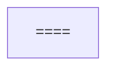
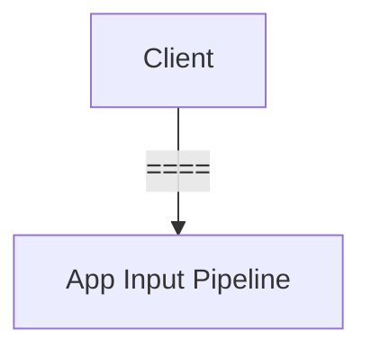
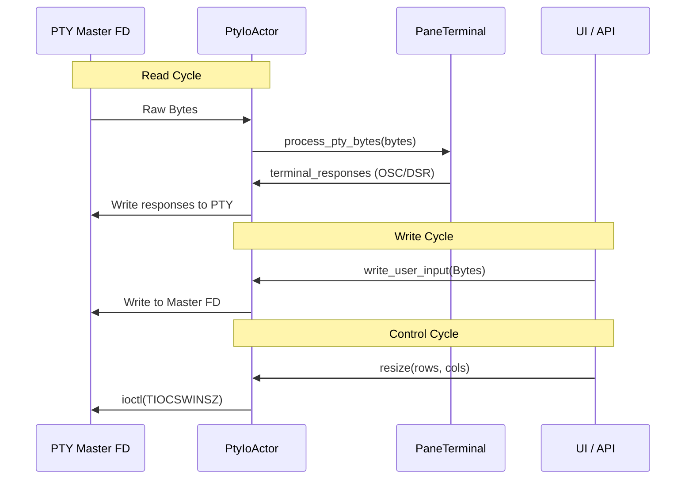

]
17:T14f9,
# Overview

<details>
<summary>Relevant source files</summary>

The following files were used as context for generating this wiki page:

- [CHANGELOG.md](CHANGELOG.md)
- [Cargo.lock](Cargo.lock)
- [Cargo.toml](Cargo.toml)
- [README.md](README.md)
- [docs/next/CHANGELOG.md](docs/next/CHANGELOG.md)
- [docs/next/README.md](docs/next/README.md)
- [docs/next/website/src/content/docs/agents.mdx](docs/next/website/src/content/docs/agents.mdx)
- [docs/next/website/src/content/docs/cli-reference.mdx](docs/next/website/src/content/docs/cli-reference.mdx)
- [src/app/mod.rs](src/app/mod.rs)
- [src/app/state.rs](src/app/state.rs)
- [src/cli/integration.rs](src/cli/integration.rs)
- [src/config.rs](src/config.rs)
- [src/config/model.rs](src/config/model.rs)
- [src/main.rs](src/main.rs)
- [src/ui.rs](src/ui.rs)

</details>


`herdr` is a terminal-based agent multiplexer and runtime designed specifically for AI coding agents. It provides a persistent environment where multiple agents can operate in parallel, allowing users to monitor their status at a glance and interact with them using both keyboard and mouse-driven interfaces.

Unlike traditional terminal multiplexers, `herdr` is built with a first-class awareness of agent lifecycles, offering a dedicated socket API that allows agents to spawn panes, read output, and coordinate with other agents.

## Key Features

*   **Agent Observability**: Real-time status indicators (blocked, working, done) for agents running in terminal panes [README.md:31-31]().
*   **Persistent Sessions**: Agents continue running after the client detaches. Sessions survive server restarts and can be accessed over SSH [README.md:32-32]().
*   **Agent-Aware API**: A JSON-RPC socket API that enables agents to programmatically control the workspace [README.md:33-33]().
*   **Hybrid Interaction**: Combines `tmux`-style prefix keybindings with modern mouse support (drag, split, click) [README.md:34-34]().
*   **Extensibility**: A plugin system to extend pane behavior and automate workflows [README.md:35-35]().
*   **Native Performance**: Written in Rust, compiled to a single binary without Electron or heavy dependencies [README.md:36-36]().

## System Architecture

`herdr` operates on a client/server model. The server manages the PTY (Pseudo-Terminal) lifecycles, agent detection, and session state, while the TUI (Terminal User Interface) acts as a specialized client.

### Natural Language to Code Entity Mapping

The following diagram illustrates how high-level system components map to specific modules and structs within the Rust codebase.

**Component Mapping Diagram**
```mermaid
graph TD
    subgraph 

====

]
    end

    A --> A1
    A --> A2
    B --> B1
    B --> B2
    C --> C1
    C --> C2
    D --> D1
    D --> D2
```
Sources: [src/app/mod.rs:97-156](), [src/app/state.rs:1-104](), [src/ui.rs:111-114](), [src/terminal/mod.rs](), [src/layout/mod.rs](), [src/persist/mod.rs](), [src/api/mod.rs]()

### Major Subsystems Interaction

This diagram shows how data flows from the PTY through the detection engine to the final UI render.

**Subsystem Data Flow**
```mermaid
graph LR
    subgraph 

====

 --> UI
```
Sources: [Cargo.toml:32-34](), [src/app/mod.rs:97-156](), [src/app/state.rs:1-104](), [src/ui.rs:111-114](), [src/detect/mod.rs](), [src/api/mod.rs]()

## Detailed Guides

For deeper technical information, refer to the following child pages:

### [Getting Started](#1.1)
Covers installation via `curl`, Homebrew, `mise`, or Nix, and the initial workflow for starting the server and attaching to sessions.
For details, see [Getting Started](#1.1).

### [Core Concepts](#1.2)
Defines the primary abstractions used in the codebase, including **Workspaces**, **Tabs**, **Panes**, and **Sessions**. It explains the lifecycle of a persistent session and how the client/server protocol maintains state.
For details, see [Core Concepts](#1.2).

### [Contributing and Development Workflow](#1.3)
Outlines the requirements for contributors, including the use of the `just` task runner, mandatory PR gate checks, and the Apache-2.0 licensing rules.
For details, see [Contributing and Development Workflow](#1.3).

---
Sources: [README.md:1-58](), [Cargo.toml:1-45](), [docs/next/README.md:1-58]()
18:T1f46,
# Getting Started

<details>
<summary>Relevant source files</summary>

The following files were used as context for generating this wiki page:

- [docs/next/product-announcement.json](docs/next/product-announcement.json)
- [docs/next/website/src/content/docs/index.mdx](docs/next/website/src/content/docs/index.mdx)
- [docs/next/website/src/content/docs/install.mdx](docs/next/website/src/content/docs/install.mdx)
- [docs/next/website/src/content/docs/ja/windows-beta.mdx](docs/next/website/src/content/docs/ja/windows-beta.mdx)
- [docs/next/website/src/content/docs/quick-start.mdx](docs/next/website/src/content/docs/quick-start.mdx)
- [docs/next/website/src/content/docs/windows-beta.mdx](docs/next/website/src/content/docs/windows-beta.mdx)
- [docs/next/website/src/content/docs/zh-cn/windows-beta.mdx](docs/next/website/src/content/docs/zh-cn/windows-beta.mdx)
- [scripts/changelog.py](scripts/changelog.py)
- [scripts/test_changelog.py](scripts/test_changelog.py)
- [scripts/test_unix_installer.py](scripts/test_unix_installer.py)
- [scripts/windows_install_conpty_package_test.ps1](scripts/windows_install_conpty_package_test.ps1)
- [src/remote/attach.rs](src/remote/attach.rs)
- [src/update.rs](src/update.rs)
- [website/install.ps1](website/install.ps1)
- [website/install.sh](website/install.sh)
- [website/latest.json](website/latest.json)

</details>


Herdr is an agent multiplexer that runs as a single Rust binary in your terminal. It allows you to manage multiple AI coding agents within persistent terminal sessions that survive detach/reattach cycles and server restarts.

## Installation Methods

Herdr provides several installation paths depending on your operating system and preferred package manager.

### Unix (Linux & macOS)
The primary installation method for Unix-like systems is the shell script, which detects the platform and architecture to download the appropriate binary. [docs/next/website/src/content/docs/install.mdx:10-14]()

```bash
curl -fsSL https://herdr.dev/install.sh | sh
```

### Windows (Beta)
Windows support is currently in preview beta. The PowerShell installer uses versioned install folders and updates a `current` junction to allow updates without overwriting a running `herdr.exe`. [docs/next/website/src/content/docs/install.mdx:16-22]()

```powershell
powershell -ExecutionPolicy Bypass -c 

====


```

### Package Managers
Herdr is available via several popular package managers:

| Manager | Command | Notes |
| :--- | :--- | :--- |
| **Homebrew** | `brew install herdr` | Updates managed via `brew upgrade`. [docs/next/website/src/content/docs/install.mdx:24-30]() |
| **mise** | `mise use -g herdr` | Uses the mise tool registry. [docs/next/website/src/content/docs/install.mdx:32-40]() |
| **Nix** | `nix profile install github:herdrdev/herdr/v0.x.y` | Provides a flake for source builds. Replace `v0.x.y` with the latest release tag. [docs/next/website/src/content/docs/install.mdx:42-52]() |

**Sources:** [docs/next/website/src/content/docs/install.mdx:1-52](), [website/install.ps1:1-22](), [website/install.sh:1-147]()

---

## First-Run Experience

When you first execute `herdr`, the system initializes a default background session. [docs/next/website/src/content/docs/quick-start.mdx:6-12]()

### Quick-Start Workflow
1.  **Launch**: Run `herdr` in your project directory. [docs/next/website/src/content/docs/quick-start.mdx:9-9]()
2.  **Workspace Creation**: If no workspace exists, Herdr automatically creates one to contain your tabs and panes. [docs/next/website/src/content/docs/quick-start.mdx:14-16]()
3.  **Run an Agent**: Start a supported agent (e.g., `claude`, `codex`) in a pane. Herdr's heuristics will detect the agent and display its status in the sidebar. [docs/next/website/src/content/docs/quick-start.mdx:26-34]()
4.  **Detach**: Press `prefix+q` (default `Ctrl+b q`) or close the terminal. The server and agents continue running in the background. [docs/next/website/src/content/docs/quick-start.mdx:54-56]()

### Data Flow: Installation to Execution
This diagram illustrates how the installer interacts with the OS and how the binary initiates the first session.

**Installer and Initialization Flow**
```mermaid
graph TD
    subgraph 

====


        H --> I[Default Workspace];
        I --> J[PaneRuntime (PTY)];
        J --> K[Agent Detection Heuristics];
    end
```
**Sources:** [src/update.rs:109-114](), [docs/next/website/src/content/docs/install.mdx:22-22](), [docs/next/website/src/content/docs/quick-start.mdx:6-16](), [website/install.ps1:146-194]()

---

## Update Channels

Herdr supports two primary update channels: `stable` and `preview`. The update mechanism uses `curl` as a subprocess to fetch manifests and binaries, avoiding extra Rust dependencies. [src/update.rs:1-7]()

### Stable vs. Preview
*   **Stable**: The default for Linux and macOS. Points to `https://herdr.dev/latest.json`. [src/update.rs:26-26]()
*   **Preview**: Default for Windows. Tracks the `master` branch and points to `https://herdr.dev/preview.json`. [src/update.rs:27-27]()

### Update Logic
When `herdr update` is called, the following logic is executed:
1.  **Manifest Check**: Fetches the `UpdateManifest` or `PreviewManifest` for the configured channel. [src/update.rs:165-175](), [src/update.rs:199-208]()
2.  **Version Comparison**: Compares the `Version::current()` with the manifest version. [src/update.rs:87-90]()
3.  **Download & Verify**: Downloads the asset and verifies its SHA-256 checksum. [src/update.rs:125-128]()
4.  **Handoff (Optional)**: If `--handoff` is used, the system attempts a live server handoff to preserve running sessions without restarting panes. [docs/next/website/src/content/docs/install.mdx:143-147]()

**Update Logic and Entities**
```mermaid
graph LR
    subgraph 

====

];
    end
```
**Sources:** [src/update.rs:26-27](), [src/update.rs:67-90](), [src/update.rs:103-122](), [src/update.rs:165-175](), [src/update.rs:199-208](), [docs/next/website/src/content/docs/install.mdx:143-147]()

---

## Platform-Specific Details

### Nix Integration
Herdr provides a native Nix package defined in `nix/package.nix`. It utilizes `rustPlatform.buildRustPackage` and incorporates `libghostty-vt` as a Zig dependency.

The Nix build environment sets specific variables for the Zig compiler to ensure the terminal emulator component is built correctly:
*   `LIBGHOSTTY_VT_OPTIMIZE = 

====

`
*   `ZIG = lib.getExe zig_0_15`

### Windows ConPTY
The Windows installer specifically handles the ConPTY runtime, which must remain app-local to `herdr.exe`. [docs/next/website/src/content/docs/install.mdx:99-101]() This is because the system ConPTY on older Windows 10 builds might drop Kitty keyboard protocol sequences. [docs/next/website/src/content/docs/windows-beta.mdx:82-84]()

**Sources:** [docs/next/website/src/content/docs/install.mdx:93-101](), [docs/next/website/src/content/docs/windows-beta.mdx:82-84]()
19:T1ec4,
# Core Concepts

<details>
<summary>Relevant source files</summary>

The following files were used as context for generating this wiki page:

- [CHANGELOG.md](CHANGELOG.md)
- [Cargo.lock](Cargo.lock)
- [Cargo.toml](Cargo.toml)
- [docs/next/CHANGELOG.md](docs/next/CHANGELOG.md)
- [src/app/api/panes.rs](src/app/api/panes.rs)
- [src/app/creation.rs](src/app/creation.rs)
- [src/app/mod.rs](src/app/mod.rs)
- [src/app/state.rs](src/app/state.rs)
- [src/config.rs](src/config.rs)
- [src/config/model.rs](src/config/model.rs)
- [src/main.rs](src/main.rs)
- [src/persist.rs](src/persist.rs)
- [src/ui.rs](src/ui.rs)
- [src/workspace.rs](src/workspace.rs)
- [src/workspace/tab.rs](src/workspace/tab.rs)

</details>


This section defines the fundamental abstractions used by Herdr to organize terminal environments and coding agents. It explains the relationship between the client/server architecture and the persistent session lifecycle.

## The Herdr Hierarchy

Herdr organizes terminal processes into a hierarchical structure that allows for high-level management of multiple concurrent coding agents.

| Entity | Description | Code Identifier |
| :--- | :--- | :--- |
| **Session** | The top-level persistence boundary. Contains all workspaces and settings. | `Session` |
| **Workspace** | A project-level container. Groups related tabs and panes. | `Workspace` |
| **Tab** | A single viewport layout within a workspace. | `Tab` |
| **Pane** | A terminal emulator instance running a PTY process. | `PaneId` |
| **Agent** | A logical state overlay detected within a pane. | `Agent` |

### Logical Composition Diagram
This diagram illustrates how these entities compose from the user's perspective down to the underlying PTY.

```mermaid
graph TD
    subgraph 

====

]
    end

    S --> App
    W --> WS
    T --> TL
    P --> PID
    PID --> PR
    A --> AM
    
    App --> WS
    WS --> TL
    TL --> PID
```
**Sources:** [src/layout.rs:10-11](), [src/workspace/tab.rs:10-11](), [src/app/mod.rs:97-156](), [src/workspace.rs:171-202](), [src/terminal/mod.rs:100-106](), [src/detect.rs:10-17]()

---

## Workspace, Tab, and Pane

### Workspace
A **Workspace** is the primary unit of project isolation. It typically maps to a single Git repository or a specific work context. The `Workspace` struct [src/workspace.rs:171-202]() holds its unique `id`, an optional `custom_name`, and various cached Git-related metadata like `cached_git_branch` and `cached_git_ahead_behind`. Workspaces are identified by a public ID, generated by `generate_workspace_id()` [src/workspace.rs:102-105](), which uses a base-32 encoding scheme [src/workspace.rs:107-119]().

### Tab
Each workspace contains one or more **Tabs**. A tab represents a specific arrangement of panes. The `Tab` struct [src/workspace/tab.rs:10-11]() manages the `TileLayout` which defines the visual arrangement of panes within that tab. Switching tabs changes the visible layout without affecting the processes running in other tabs of the same workspace.

### Pane and Layout
A **Pane** is the leaf node of the UI. It hosts a `TerminalRuntime` [src/terminal/mod.rs:100-106]() which manages the PTY and terminal emulation.
*   **Layout Engine**: Herdr uses a Binary Space Partitioning (BSP) tree to manage pane tiling. The `TileLayout` [src/workspace/tab.rs:10-11]() is a core component of this, representing the tree structure of panes.
*   **PaneId**: Every pane is assigned a globally unique `PaneId` [src/layout.rs:10-11](), which is a `u32` identifier used for targeting commands.
*   **Splitting**: The `TileLayout` allows splitting the focused pane horizontally or vertically. This operation, handled by `split_pane_with_ratio` or `split_pane` [src/app/api/panes.rs:70-98](), allocates a new `PaneId` and updates the `Node` tree. The new pane's `cwd` can be inherited or explicitly set [src/app/api/panes.rs:54-57]().

**Sources:** [src/layout.rs:10-11](), [src/workspace.rs:102-119](), [src/workspace.rs:171-202](), [src/workspace/tab.rs:10-11](), [src/terminal/mod.rs:100-106](), [src/app/api/panes.rs:54-98]()

---

## Agent Detection and State

An **Agent** is not a separate process, but a state machine that tracks the foreground process group within a Pane. Herdr uses 

====

 to determine an agent's current state (`idle`, `working`, `blocked`, or `done`). The `AgentState` enum [src/detect.rs:10-17]() defines these possible states.

### Status Authority Models
1.  **Lifecycle Authority**: Agents like Pi or OMP use official hooks to report state directly to the Herdr socket. This is often managed through `pane.report_agent` or `pane.report_agent_session` API calls [src/app/api/panes.rs:15-16]().
2.  **Screen Heuristics**: For agents without hooks (e.g., Claude Code, Codex), Herdr inspects the terminal buffer against TOML-based manifests to classify state. These manifests define `invariant_gates` and `spinner_patterns` [src/detect.rs:20-21]() to detect agent activity.

### Agent State Flow

**Sources:** [src/detect.rs:10-21](), [src/app/api/panes.rs:15-16]()

---

## Client/Server Model and Persistence

Herdr operates as a **Headless Server** that persists even when no UI is attached. The `App` struct [src/app/mod.rs:97-156]() encapsulates the entire application state and runtime concerns, including event channels and async I/O.

### The Lifecycle
*   **Startup**: Running `herdr` launches the background server if it is not already running. The `HERDR_ENV_VAR` [src/main.rs:11]() is set to `HERDR_ENV_VALUE` [src/main.rs:11]() to indicate a Herdr environment, preventing nested Herdr instances [src/main.rs:13-20]().
*   **Persistence**: PTY processes are owned by the server. Closing the terminal window or detaching (`prefix+q`) does not kill the running agents. The `session_save_deadline` [src/app/mod.rs:139]() and `session_save_thread` [src/app/mod.rs:140]() manage the periodic saving of the session state.
*   **Handoff**: Herdr supports 

====

 allowing a new server binary to take over PTY file descriptors from a running server with zero downtime. This feature was added in version 0.8.0 [CHANGELOG.md:5]().
*   **Remote Access**: `herdr --remote` establishes an SSH tunnel to the server, allowing the local client to interact with the remote session while using local keybindings.

### Session Restoration
Herdr saves the session state to `session.json` [src/persist.rs:10-11](). Upon restart, it can rehydrate the workspace/tab/pane topology. For supported agents, it uses native session IDs (e.g., `--resume=<id>`) to restore the agent's conversation context. The `agent_resume` module [src/app/agent_resume.rs:1-2]() handles the logic for resuming agent sessions. The `pending_agent_resume_deadline` [src/app/mod.rs:136]() tracks when agent resume operations should be processed.

**Sources:** [src/main.rs:11-20](), [src/app/mod.rs:97-156](), [src/app/mod.rs:136-140](), [src/app/agent_resume.rs:1-2](), [src/persist.rs:10-11](), [CHANGELOG.md:5]()
1a:T1cb1,
# Contributing and Development Workflow

<details>
<summary>Relevant source files</summary>

The following files were used as context for generating this wiki page:

- [.agents/skills/herdr-pre-release-audit/SKILL.md](.agents/skills/herdr-pre-release-audit/SKILL.md)
- [.agents/skills/herdr-throwaway-repro/SKILL.md](.agents/skills/herdr-throwaway-repro/SKILL.md)
- [.agents/skills/triage/SKILL.md](.agents/skills/triage/SKILL.md)
- [.githooks/commit-msg](.githooks/commit-msg)
- [.github/APPROVED_CONTRIBUTORS](.github/APPROVED_CONTRIBUTORS)
- [.github/ISSUE_TEMPLATE/bug.yml](.github/ISSUE_TEMPLATE/bug.yml)
- [.github/ISSUE_TEMPLATE/config.yml](.github/ISSUE_TEMPLATE/config.yml)
- [.github/MAINTAINERS](.github/MAINTAINERS)
- [.github/workflows/ci.yml](.github/workflows/ci.yml)
- [.github/workflows/issue-gate.yml](.github/workflows/issue-gate.yml)
- [.github/workflows/nix.yml](.github/workflows/nix.yml)
- [.github/workflows/pr-gate.yml](.github/workflows/pr-gate.yml)
- [.pi/prompts/pre-release-audit.md](.pi/prompts/pre-release-audit.md)
- [AGENTS.md](AGENTS.md)
- [CONTRIBUTING.md](CONTRIBUTING.md)
- [build.rs](build.rs)
- [docs/versions/0.5.11/website/src/content/docs/install.mdx](docs/versions/0.5.11/website/src/content/docs/install.mdx)
- [docs/versions/0.5.12/website/src/content/docs/agent-skill.mdx](docs/versions/0.5.12/website/src/content/docs/agent-skill.mdx)
- [docs/versions/0.5.12/website/src/content/docs/install.mdx](docs/versions/0.5.12/website/src/content/docs/install.mdx)
- [docs/versions/0.6.0/website/src/content/docs/agent-skill.mdx](docs/versions/0.6.0/website/src/content/docs/agent-skill.mdx)
- [docs/versions/0.6.0/website/src/content/docs/install.mdx](docs/versions/0.6.0/website/src/content/docs/install.mdx)
- [docs/versions/0.6.1/website/src/content/docs/agent-skill.mdx](docs/versions/0.6.1/website/src/content/docs/agent-skill.mdx)
- [docs/versions/0.6.1/website/src/content/docs/install.mdx](docs/versions/0.6.1/website/src/content/docs/install.mdx)
- [justfile](justfile)
- [nix/package.nix](nix/package.nix)
- [skills/herdr/SKILL.md](skills/herdr/SKILL.md)

</details>


This page outlines the standards and technical processes for contributing to the `herdr` codebase. As a high-performance terminal runtime and agent environment, the project maintains strict quality gates, automated verification, and specific isolation workflows for development.

## Core Development Principles

The codebase follows a set of architectural invariants to ensure maintainability and testability:

*   **State Separation**: `AppState` is pure data, decoupled from the PTY runtime. `PaneState` remains separate from `PaneRuntime` [AGENTS.md:30-30]().
*   **Pure Rendering**: The `compute_view()` function handles geometry and mutations, while `render()` is a pure function that takes `&AppState` and performs no mutations [AGENTS.md:31-31]().
*   **Platform Isolation**: OS-specific logic is confined to `src/platform/<os>.rs`. Core modules are forbidden from using `#[cfg(target_os)]` directly [AGENTS.md:33-33]().
*   **Evidence-Based Detection**: Agent detection manifests in `src/detect/manifests/` must be based on captured ANSI/text snapshots from `herdr agent read` [AGENTS.md:35-35]().

Sources: [AGENTS.md:30-37]()

## Task Runner: Justfile

Herdr uses `just` as its primary task runner to wrap complex Cargo and script invocations.

| Command | Description |
| :--- | :--- |
| `just check` | Comprehensive local check: `fmt`, `clippy`, `nextest`, and maintenance scripts [justfile:39-42](). |
| `just test` | Runs all Rust integration/unit tests and Python maintenance tests [justfile:4-8](). |
| `just lint` | Runs `cargo fmt` and `cargo clippy` with `-D warnings` [justfile:16-18](). |
| `just windows-lint` | Cross-compiles for Windows from Unix to catch `cfg(windows)` errors [justfile:34-36](). |
| `just install-hooks` | Configures local git hooks from `.githooks/` [justfile:50-54]().

Sources: [justfile:1-138]()

## PR Gate and Commit Conventions

The project employs an automated 

====

 to manage external contributions and ensure high standards.

### Commit Messages
Commits must follow the **Conventional Commits** specification. The `PR Gate` validates titles for external contributors, requiring `fix:` or `fix(scope):` prefixes for unapproved PRs [.github/workflows/ci.yml:39-42]().
*   **Issue References**: Use `refs #<id>` in the commit body to link issues without closing them prematurely [CONTRIBUTING.md:97-105]().
*   **Closing Keywords**: Avoid `fixes #<id>` in commit bodies; the release process handles issue closure after the binary is published [.pi/prompts/pre-release-audit.md:54-54]().

### Automated Gates
*   **External PR Limits**: Unsolicited implementation pull requests from contributors not listed in `.github/APPROVED_CONTRIBUTORS` are automatically closed [CONTRIBUTING.md:25-27]().
*   **Maintainer Overrides**: A verified maintainer may reopen a closed pull request as a one-off exception [CONTRIBUTING.md:28-30]().

Sources: [CONTRIBUTING.md:39-47](), [.github/workflows/pr-gate.yml:19-52](), [.github/workflows/ci.yml:22-42]()

## Worktree-Based Development

Maintainers use `git worktree` to isolate concurrent features and prevent 

====

 --> Origin
```

Maintainers are instructed to perform all edits, tests, and validation within these dedicated task worktrees [AGENTS.md:65-75]().

Sources: [AGENTS.md:61-90]()

## Pre-release Audit Process

Before a release is published, a multi-step audit ensures documentation, changelogs, and binaries are synchronized.

### Audit Data Flow
```mermaid
flowchart LR
    HEAD[

====

]
    end
    
    DocsCheck --> C1 & C2 & C3
```

### Release Checklist
1.  **Docs Parity**: `just release-docs-check` verifies that `docs/next/` contents match the root docs and that translations (JA, ZH-CN) are present [justfile:78-112]().
2.  **Changelog Extraction**: `scripts/changelog.py` extracts entries for the specific version to populate the GitHub Release body [justfile:131-132]().
3.  **Nix Refresh**: The `cargoHash` in `flake.nix` must be updated if `Cargo.lock` changed to pass `flake-check` [.pi/prompts/pre-release-audit.md:72-73]().
4.  **Release Preparation**: `just release-prepare <version>` automates the version bump and commit [justfile:116-139]().

Sources: [justfile:78-166](), [.pi/prompts/pre-release-audit.md:9-85]()
1b:T2143,
# Architecture

<details>
<summary>Relevant source files</summary>

The following files were used as context for generating this wiki page:

- [src/app/actions.rs](src/app/actions.rs)
- [src/app/api.rs](src/app/api.rs)
- [src/app/mod.rs](src/app/mod.rs)
- [src/app/state.rs](src/app/state.rs)
- [src/config.rs](src/config.rs)
- [src/config/model.rs](src/config/model.rs)
- [src/events.rs](src/events.rs)
- [src/main.rs](src/main.rs)
- [src/server/headless.rs](src/server/headless.rs)
- [src/server/render_stream.rs](src/server/render_stream.rs)
- [src/ui.rs](src/ui.rs)

</details>


Herdr utilizes a client/server architecture designed to provide persistent terminal sessions that survive client disconnects, remote SSH sessions, and even live handoffs between server processes. The system is built around a central event loop that orchestrates state mutations, PTY I/O, and a virtual rendering pipeline.

## System Overview

The following diagram illustrates the high-level relationship between the `HeadlessServer`, the `App` orchestration layer, and the external `Client` connections.

### Core Component Interaction
```mermaid
graph TD
    subgraph 

====

 --> ClientConn
```
**Sources:** [src/app/mod.rs:97-156](), [src/server/headless.rs:1-15](), [src/server/headless.rs:124-130]().

---

## App Orchestration and State Management

The `App` struct [src/app/mod.rs:97-156]() is the central orchestrator. It holds the `AppState` [src/app/state.rs:270-345](), which contains the pure data representation of workspaces, tabs, and panes. The `App` manages the main event loop using `tokio::select!`, which handles:
*   **Internal Events:** Delivered via `mpsc` channel (e.g., PTY exits, agent detection) [src/events.rs:56-162]().
*   **API Requests:** JSON-RPC calls from the CLI or plugins [src/app/mod.rs:105]().
*   **Raw Input:** Keyboard and mouse data from the connected client [src/app/mod.rs:108]().
*   **Timers:** Debounced session saving and git status refreshes [src/app/mod.rs:36-47]().

### App Event Loop
```mermaid
graph TD
    subgraph 

====

]
    end

    InternalEvents --> EventTx
    ApiRequests --> ApiRx
    RawInputEvents --> InputRx
    RenderRequests --> RenderDirty

    EventTx --> EventRx
    EventRx --> Loop
    ApiRx --> Loop
    InputRx --> Loop
    Timers --> Loop
    RenderDirty --> RenderRequests

    Loop -- 

====

 --> RenderDirty
```
**Sources:** [src/app/mod.rs:97-156](), [src/app/mod.rs:161-168](), [src/app/state.rs:270-345](), [src/events.rs:56-162]().

For details, see [App Orchestration and State Management](#2.1).

---

## Headless Server and Client Protocol

Herdr runs a `HeadlessServer` [src/server/headless.rs:1-15]() that maintains the session even when no UI is visible. It performs 

====

 into a memory buffer using Ratatui. When a client attaches via the Unix domain socket (`herdr-client.sock`), the server begins streaming frames.

The system supports two rendering modes:
1.  **SemanticFrame:** Sends the full logical grid state, allowing the client to handle rendering [src/server/render_stream.rs:14-15]().
2.  **TerminalAnsi:** Uses a `BlitEncoder` [src/server/render_stream.rs:17-21]() to calculate a diff between the current and previous frame, sending only the minimal ANSI escape sequences required to update the host terminal.

### Client-Server Rendering Pipeline
```mermaid
graph TD
    subgraph 

====

 --> ClientRenderer
```
**Sources:** [src/server/headless.rs:1-15](), [src/server/render_stream.rs:13-34](), [src/server/render_stream.rs:65-110](), [src/ui.rs:111-120]().

For details, see [Headless Server and Client Protocol](#2.2).

---

## PTY and Terminal Runtime

Each terminal pane in Herdr is backed by a `PaneRuntime`. This runtime manages the lifecycle of the PTY (Pseudo-Terminal) and the underlying shell process. The `TerminalRuntimeRegistry` [src/app/mod.rs:103]() tracks these runtimes, ensuring that I/O actors continue to process shell output and update the internal Ghostty-based VT engine even when the pane is not actively being viewed.

For details, see [PTY and Terminal Runtime](#2.3).

**Sources:** [src/app/mod.rs:103](), [src/terminal/mod.rs:1-20]().

---

## Layout Engine

Herdr uses a Binary Space Partitioning (BSP) tree to manage pane layouts within a tab. The layout is defined by `Node` structures that can be either a `Leaf` (containing a `PaneId`) or an `Internal` split (Horizontal or Vertical). The engine handles complex operations like:
*   **Splitting/Resizing:** Dynamically adjusting `Rect` geometries [src/ui.rs:111-120]().
*   **Zooming:** Temporarily expanding a single pane to fill the tab surface.
*   **Geometry Reconciliation:** Ensuring the PTY size matches the calculated UI `Rect` [src/ui.rs:158-172]().

For details, see [Layout Engine](#2.4).

**Sources:** [src/ui.rs:111-120](), [src/ui.rs:158-172](), [src/app/state.rs:8-9]().

---

## Session Persistence and Handoff

Persistence is handled through two primary mechanisms:
1.  **Snapshots:** The `AppState` is serialized to `session.json` [src/app/mod.rs:139](). On restart, Herdr 

====

 the session, recreating the workspace/tab/pane hierarchy.
2.  **Live Handoff:** During a server upgrade or restart, Herdr can perform a zero-downtime handoff. This involves passing open PTY file descriptors from the old process to the new one using `SCM_RIGHTS` [src/server/headless.rs:78-96](), allowing shell processes to remain alive and connected during the transition.

For details, see [Session Persistence and Handoff](#2.5).

**Sources:** [src/app/mod.rs:139](), [src/server/headless.rs:78-96]().
1c:T1abc,
# App Orchestration and State Management

<details>
<summary>Relevant source files</summary>

The following files were used as context for generating this wiki page:

- [src/app/agents.rs](src/app/agents.rs)
- [src/app/mod.rs](src/app/mod.rs)
- [src/app/state.rs](src/app/state.rs)
- [src/config.rs](src/config.rs)
- [src/config/model.rs](src/config/model.rs)
- [src/events.rs](src/events.rs)
- [src/main.rs](src/main.rs)
- [src/ui.rs](src/ui.rs)

</details>


This page details the central orchestration logic of `herdr`, focusing on the `App` struct, the asynchronous event loop, and the management of global application state via `AppState`.

## The App Struct and Event Loop

The `App` struct is the primary owner of the application lifecycle, bridging pure state data with runtime concerns such as async I/O, PTY management, and API communication [src/app/mod.rs:97-156]().

The core of `herdr` is an asynchronous event loop driven by `tokio::select!`. This loop multiplexes several event sources into a unified stream of `LoopEvent` variants [src/app/mod.rs:161-168]().

### Event Sources
| Event Source | Code Entity | Description |
| :--- | :--- | :--- |
| **Internal Events** | `AppEvent` | Signals from PTYs (exit, output), Git status updates, and internal timers [src/events.rs]() |
| **API Requests** | `ApiRequestMessage` | JSON-RPC requests arriving via the Unix domain socket [src/app/mod.rs:106]() |
| **Raw Input** | `RawInputEvent` | Keyboard and mouse events captured from the host terminal [src/app/mod.rs:109]() |
| **Render Signal** | `RenderRequested` | Triggered when state changes necessitate a UI redraw [src/app/mod.rs:167]() |

### The Drain-Handle-Render Cycle

`herdr` follows a 

====

 pattern to ensure state consistency and minimize redundant draws.

1.  **Drain**: The loop consumes a batch of events (up to `APP_EVENT_DRAIN_LIMIT`) before proceeding to render [src/app/mod.rs:159]().
2.  **Handle**: Events are dispatched to `handle_internal_event` or `handle_api_request`, which mutate the `AppState` [src/app/api.rs:99-200]().
3.  **Render**: If any event marked the state as dirty (`render_dirty`), the `compute_view` and `render` functions are called [src/ui.rs:111-128]().

```mermaid
graph TD
    subgraph 

====

]
    end

    PTY --> Drain
    Socket --> Drain
    Kbd --> Drain
    RenderNotify --> Drain
    Drain --> Handle
    Handle --> Mutation
    Mutation --> Geom
    Geom --> Draw
    Draw --> Drain
```
**Sources:** [src/app/mod.rs:97-168](), [src/app/api.rs:99-200](), [src/ui.rs:111-128]()

## State Management (`AppState`)

`AppState` is a tree of pure data structures representing the entire world-view of the application. It is designed to be serializable for session persistence [src/app/state.rs:227-380]().

### Data Hierarchy
*   **Workspaces**: The top-level containers (`Vec<Workspace>`) [src/app/state.rs:247]().
*   **Tabs**: Each workspace contains one or more tabs [src/workspace.rs:198]().
*   **Panes**: Tabs contain a `TileLayout` tree of `PaneId`s [src/workspace/tab.rs]().
*   **Terminals**: A global registry mapping `TerminalId` to `TerminalState` (screen buffers, history) [src/app/state.rs:248]().

### State Transitions
Mutations are handled in `src/app/actions.rs`. These functions are 

====

 in that they only modify `AppState` and return information about what changed (e.g., `EffectiveStateChange`), without performing I/O directly [src/app/actions.rs:1-23]().

**Sources:** [src/app/state.rs:227-380](), [src/workspace.rs:198](), [src/workspace/tab.rs](), [src/app/actions.rs:1-23]()

## Configuration and Hot-Reloading

`herdr` supports live configuration reloading without restarting the server process.

### Configuration Model
The `Config` struct (defined in `src/config/model.rs`) represents the `config.toml` structure. It includes sections for `keys`, `theme`, `terminal`, and `update` [src/config/model.rs:258-260]().

### Reload Mechanism
1.  **Trigger**: A user runs `herdr server reload-config` or selects 

====

 from the global menu. This action is mapped to `Action::ReloadConfig` [src/main.rs:179]().
2.  **IO**: `load_live_config` reads the file from `~/.config/herdr/config.toml` [src/config/io.rs:12]().
3.  **Application**: The `App` struct receives the new `Config`, updates its internal `state.config`, and re-validates keybindings [src/app/mod.rs:154]().
4.  **UI Sync**: Theme changes are immediately applied to the `Palette` in `AppState`, and a full redraw is triggered [src/app/state.rs:105-161]().

```mermaid
sequenceDiagram
    participant User
    participant CLI as 

====


```
**Sources:** [src/config/model.rs:258-260](), [src/config/io.rs:12](), [src/main.rs:179](), [src/app/mod.rs:154](), [src/app/state.rs:105-161]()

## Lifecycle Coordination

### Terminal Runtime Management
While `AppState` holds the *data* (buffers), the `TerminalRuntimeRegistry` holds the *active handles* to PTY actors and Ghostty VT instances [src/app/mod.rs:103](). When a pane is closed, the `App` ensures the corresponding runtime is terminated and the PTY file descriptors are closed [src/app/api.rs:175-200]().

### Git Status Refresh
The `App` manages a periodic refresh of Git metadata (branch names, ahead/behind counts) for all workspaces. This is throttled by `GIT_REMOTE_STATUS_REFRESH_INTERVAL` (1500ms) to prevent excessive disk I/O [src/app/mod.rs:39]().

### Agent Management
The `App` also orchestrates agent lifecycle, including starting agents, reconciling their state, and handling renaming. The `valid_agent_name` function enforces naming conventions [src/app/agents.rs:13-17](). Agent information is collected across all workspaces and panes [src/app/agents.rs:21-34]().

**Sources:** [src/app/mod.rs:39](), [src/app/mod.rs:103](), [src/app/api.rs:175-200](), [src/app/agents.rs:13-17](), [src/app/agents.rs:21-34]()
1d:T27ec,
# Headless Server and Client Protocol

<details>
<summary>Relevant source files</summary>

The following files were used as context for generating this wiki page:

- [src/app/actions.rs](src/app/actions.rs)
- [src/app/api.rs](src/app/api.rs)
- [src/app/runtime.rs](src/app/runtime.rs)
- [src/app/theme_sync.rs](src/app/theme_sync.rs)
- [src/client/input.rs](src/client/input.rs)
- [src/client/mod.rs](src/client/mod.rs)
- [src/protocol/render_ansi.rs](src/protocol/render_ansi.rs)
- [src/raw_input.rs](src/raw_input.rs)
- [src/server/clients.rs](src/server/clients.rs)
- [src/server/headless.rs](src/server/headless.rs)
- [src/server/headless/tests/pane_graphics.rs](src/server/headless/tests/pane_graphics.rs)
- [src/server/mod.rs](src/server/mod.rs)
- [src/server/render_stream.rs](src/server/render_stream.rs)
- [src/terminal_theme.rs](src/terminal_theme.rs)

</details>


The `HeadlessServer` enables `herdr` to run as a persistent background process without a direct terminal attachment. It manages virtual rendering, client connection lifecycles, and a specialized binary protocol for streaming terminal frames to thin clients.

## Headless Server Architecture

The headless server runs a specialized version of the `App` event loop [src/server/headless.rs:1-15](). Unlike the interactive TUI mode, the headless server does not enter raw mode or read from `stdin`. Instead, it listens on two distinct sockets:
1. `herdr.sock`: The JSON-RPC API for management and automation [src/server/headless.rs:5-6]().
2. `herdr-client.sock`: A binary protocol socket for thin-client attachments [src/server/headless.rs:6-6]().

### Core Event Loop
The `HeadlessServer` loop processes `LoopEvent` variants, including timers, internal `AppEvent` updates, JSON API requests, and binary protocol `ServerEvent` inputs [src/server/headless.rs:125-132]().

```mermaid
graph TD
    subgraph 

====

]
    end
```
**Sources:** [src/server/headless.rs:125-132](), [src/app/runtime.rs:50-56]()

## Client Connection Management

The server manages multiple concurrent clients using `ClientConnection` objects [src/server/clients.rs:54-57](). Clients are categorized by their `ClientConnectionMode` [src/server/clients.rs:9-12]():
- **App**: A full TUI client capable of navigating workspaces and tabs [src/server/clients.rs:10]().
- **TerminalAttach**: A direct attachment to a specific PTY, bypassing the standard TUI chrome [src/server/clients.rs:11]().
- **TerminalObserve**: A read-only attachment to a specific PTY [src/server/clients.rs:12]().

### The Foreground Client
While multiple clients can attach, the server tracks a 

====

 client to determine which client's terminal size should drive the virtual rendering engine [src/server/clients.rs:54-57](). This is determined by the `last_activity` timestamp on each `ClientConnection` [src/server/clients.rs:60](). If the latest client disconnects, the server may fallback to a default or previously active client size to maintain the layout [src/server/headless.rs:13-15]().

```mermaid
graph TD
    subgraph 

====


            direction LR
            id[Client ID]
            mode[ClientConnectionMode]
            keybindings[ClientKeybindings]
            term_size[terminal_size]
            cell_size[cell_size]
            host_theme[host_terminal_theme]
            host_appearance[host_terminal_appearance]
            outer_focus[outer_terminal_focus]
            raw_input[raw_input: RawInputFramer]
            last_activity[last_activity: u64]
            render_state[render_state: ClientRenderState]
            graphics_cache[graphics_cache: HostGraphicsCache]
            writer[writer: ClientWriter]
        end
        C --> id
        C --> mode
        C --> keybindings
        C --> term_size
        C --> cell_size
        C --> host_theme
        C --> host_appearance
        C --> outer_focus
        C --> raw_input
        C --> last_activity
        C --> render_state
        C --> graphics_cache
        C --> writer
    end
```
**Sources:** [src/server/headless.rs:1-15](), [src/server/clients.rs:9-12](), [src/server/clients.rs:54-76]()

## Binary Protocol and Framing

Communication over `herdr-client.sock` uses a binary format (via `bincode`) framed with a 4-byte little-endian length prefix [src/protocol/wire.rs:1-31]().

| Feature | Limit | File Reference |
| :--- | :--- | :--- |
| **Max Frame Size** | 2 MB | [src/protocol/wire.rs:20-20]() |
| **Max Graphics Frame** | 32 MB | [src/protocol/wire.rs:25-25]() |
| **Handshake Timeout** | 4 Seconds | [src/server/client_transport.rs:38-38]() |
| **Protocol Version** | 18 | [src/protocol/wire.rs:16-16]()

### Render Encodings
During the handshake, clients negotiate a `RenderEncoding` [src/protocol/wire.rs:38-44]():
1. **`SemanticFrame`**: The server sends full `FrameData` structures containing raw cell symbols and attributes. The client is responsible for rendering these to its local terminal [src/protocol/wire.rs:40-41]().
2. **`TerminalAnsi`**: The server computes a diff and sends raw ANSI escape sequences. The client simply blits these bytes to its `stdout` [src/protocol/wire.rs:42-43]().

**Sources:** [src/protocol/wire.rs:1-44](), [src/server/client_transport.rs:38-38]()

## Virtual Rendering Pipeline

The server renders to a virtual `ratatui` buffer in memory [src/server/headless.rs:9-9](). This buffer is then converted into the negotiated protocol format.

### BlitEncoder and Diffing
For `TerminalAnsi` clients, the `BlitEncoder` maintains a baseline of the last sent frame [src/server/render_stream.rs:17-21](). When a new frame is generated, `BlitEncoder::encode` performs a cell-by-cell comparison to generate a minimal patch of ANSI sequences [src/server/render_stream.rs:86-88]().

```mermaid
graph LR
    subgraph 

====

]
    end
```
**Sources:** [src/server/render_stream.rs:13-34](), [src/server/render_stream.rs:86-109](), [src/server/render_stream.rs:158-168]()

### Graphics Handling
Kitty graphics commands are handled specially. The server caches graphics placements and includes them in the `FrameData` [src/server/render_stream.rs:94-98](). For ANSI clients, graphics sequences are spliced into the byte stream before the final synchronization sequence [src/server/render_stream.rs:158-168]().

**Sources:** [src/server/render_stream.rs:13-34](), [src/server/render_stream.rs:86-109](), [src/server/render_stream.rs:158-168]()

## Implementation Details

### Handshake Sequence
1. **Client Connects**: Opens `herdr-client.sock`.
2. **`ClientMessage::Hello`**: Client sends version, terminal size, and requested encoding [src/client/mod.rs:4-5]().
3. **`ServerMessage::Welcome`**: Server validates version and accepts/rejects [src/server/client_transport.rs:2-5]().
4. **Stream**: Server begins sending `Frame` or `Terminal` messages.

### Input Routing
Client input (keystrokes, mouse, paste) is encapsulated in `ClientMessage::Input` [src/client/mod.rs:7-7](). The server receives these, translates them back into `crossterm` events, and injects them into the `App` input pipeline as if they were local [src/server/headless.rs:12-12](). The `RawInputFramer` [src/raw_input.rs:151-152]() is used by both the client [src/client/input.rs:86]() and server [src/server/clients.rs:59]() to parse raw input bytes into `RawInputEvent`s [src/raw_input.rs:127-149](). This ensures consistent input parsing logic.


**Sources:** [src/client/mod.rs:1-13](), [src/server/client_transport.rs:45-52](), [src/protocol/wire.rs:113-133](), [src/client/input.rs:38-47](), [src/raw_input.rs:151-152](), [src/client/input.rs:86](), [src/server/clients.rs:59](), [src/raw_input.rs:127-149](), [src/app/runtime.rs:102-120]()

### Transport Reliability
Reliable control messages (notifications, clipboard) use a `ClientControlWriter` queue, while render frames use a `ClientRenderWriter` with a capacity of one to prevent lag on slow connections [src/server/client_transport.rs:45-52]().

**Sources:** [src/client/mod.rs:1-13](), [src/server/client_transport.rs:45-52](), [src/protocol/wire.rs:113-133]()
1e:T1c38,
# PTY and Terminal Runtime

<details>
<summary>Relevant source files</summary>

The following files were used as context for generating this wiki page:

- [src/ghostty/mod.rs](src/ghostty/mod.rs)
- [src/kitty_graphics.rs](src/kitty_graphics.rs)
- [src/pane.rs](src/pane.rs)
- [src/pane/input.rs](src/pane/input.rs)
- [src/pane/osc.rs](src/pane/osc.rs)
- [src/pane/state.rs](src/pane/state.rs)
- [src/pane/terminal.rs](src/pane/terminal.rs)
- [src/persist/restore.rs](src/persist/restore.rs)
- [src/pty/actor.rs](src/pty/actor.rs)
- [src/pty/actor/unix.rs](src/pty/actor/unix.rs)
- [src/pty/backend.rs](src/pty/backend.rs)
- [src/pty/fd.rs](src/pty/fd.rs)
- [src/pty/mod.rs](src/pty/mod.rs)
- [src/server/client_transport.rs](src/server/client_transport.rs)
- [src/terminal/runtime.rs](src/terminal/runtime.rs)

</details>


The PTY and Terminal Runtime subsystem manages the lifecycle of pseudo-terminal (PTY) devices, the execution of child processes (shells and agents), and the bridge between raw I/O and the terminal emulation layer. It ensures that asynchronous data from the PTY is correctly routed to the virtual terminal core while providing a clean interface for the UI and API layers to interact with running sessions.

## Runtime Architecture

Herdr utilizes a multi-layered approach to manage terminal sessions. The `TerminalRuntime` serves as the primary public interface, while the internal logic is managed by `PaneRuntime` and the low-level I/O is handled by a dedicated `PtyIoActor`.

### Entity Relationship Mapping

The following diagram maps high-level system concepts to their specific code implementations and ownership structure.

```mermaid
graph TD
    subgraph 

====

]
    end

    style B stroke-width:2px
    style C stroke-width:2px
    style D stroke-width:2px
    style I stroke-width:2px
```
**Sources:** [src/terminal/runtime.rs:17-18](), [src/pane/terminal.rs:161-191](), [src/pty/actor/unix.rs:89-95]()

## TerminalRuntime and PaneRuntime

`TerminalRuntime` is a thin wrapper around `PaneRuntime` [src/terminal/runtime.rs:17-18](). It provides the methods necessary for the `App` state to spawn new processes, resize terminals, and handle session handoffs.

### Key Lifecycle Functions
*   **Spawn:** The `spawn` family of functions (`spawn_shell_command`, `spawn_argv_command`) initializes the PTY, sets up environment variables, and starts the `PtyIoActor` [src/terminal/runtime.rs:85-220]().
*   **Environment Setup:** `apply_pane_terminal_env` ensures that `TERM` is set to `xterm-256color` and `COLORTERM` to `truecolor` to ensure consistent rendering across different host terminals [src/pane.rs:57-64]().
*   **Identity Injection:** `apply_pane_launch_env` injects `HERDR_WORKSPACE_ID`, `HERDR_TAB_ID`, and `HERDR_PANE_ID` into the child process environment, allowing tools and agents to be 

====

 [src/pane.rs:112-134]().

**Sources:** [src/terminal/runtime.rs:85-220](), [src/pane.rs:57-64](), [src/pane.rs:112-134]()

## PTY I/O Actor

The `PtyIoActor` is a dedicated background task (or thread) that handles the blocking nature of PTY I/O. This prevents terminal I/O from stalling the main application event loop.

### I/O Data Flow


**Sources:** [src/pty/actor/unix.rs:101-184](), [src/pane/terminal.rs:204-213]()

### Implementation Details
*   **Unix Implementation:** Uses `poll` to monitor the PTY file descriptor and a `WakePipe` for command notifications [src/pty/fd.rs:137-217]().
*   **Windows Implementation:** Uses `portable_pty` and separate threads for reading and writing to handle ConPTY specifics [src/pty/actor.rs:139-177]().
*   **Quiescence:** The actor supports a 

====

 state used during session handoffs, where it stops reading from the PTY to ensure no data is lost while transferring the file descriptor [src/pty/actor/unix.rs:208-240]().

**Sources:** [src/pty/fd.rs:137-217](), [src/pty/actor.rs:139-177](), [src/pty/actor/unix.rs:208-240]()

## PaneTerminal Interface

The `PaneTerminal` struct acts as the bridge to the Ghostty VT engine. It processes incoming PTY bytes, handles terminal state (like cursor position and mouse modes), and provides methods for the UI to render the terminal grid.

### Key Components

| Component | Responsibility |
| :--- | :--- |
| `GhosttyPaneTerminal` | Manages the FFI lifecycle of the Ghostty C core [src/pane/terminal.rs:161-165](). |
| `GhosttyPaneCore` | Holds the mutable state including `render_state`, `kitty_keyboard` trackers, and OSC trackers [src/pane/terminal.rs:167-187](). |
| `process_pty_bytes` | The primary entry point for PTY data. It feeds bytes into Ghostty and handles side effects like CWD updates or clipboard writes [src/pane/terminal.rs:204-213](). |
| `InputState` | Tracks active terminal modes such as `alternate_screen`, `bracketed_paste`, and `mouse_protocol_mode` [src/pane/terminal.rs:117-127](). |

**Sources:** [src/pane/terminal.rs:117-213]()

### OSC and Metadata Tracking
The runtime actively parses Operating System Command (OSC) sequences to update pane metadata:
*   **OSC 7 / 9;9:** Tracked via `parse_reported_cwd` to keep the pane's Current Working Directory accurate [src/pane/terminal.rs:32-34]().
*   **OSC 10/11/12:** Tracked by `DefaultColorOscTracker` to synchronize terminal background/foreground colors with the child process [src/pane/osc.rs:42-64]().
*   **Agent Reporting:** Custom OSC sequences or `pane.report_agent` API calls are tracked to update `AgentState` (Idle, Working, Blocked) [src/pane.rs:170-201]().

**Sources:** [src/pane/terminal.rs:32-34](), [src/pane/osc.rs:42-64](), [src/pane.rs:170-201]()

## Kitty Graphics Support

The runtime integrates with `src/kitty_graphics.rs` to handle image rendering. When the child process sends Kitty graphics protocol commands, the `GhosttyPaneTerminal` identifies these placements [src/ghostty/mod.rs:201-214]().

The `HostGraphicsCache` manages the translation of these internal PTY placements to the host terminal's coordinate system, performing necessary clipping against the pane's visible boundaries [src/kitty_graphics.rs:133-139]().

**Sources:** [src/ghostty/mod.rs:201-214](), [src/kitty_graphics.rs:133-139]()
1f:T1d02,
# Layout Engine

<details>
<summary>Relevant source files</summary>

The following files were used as context for generating this wiki page:

- [src/app/api/layouts.rs](src/app/api/layouts.rs)
- [src/app/api/panes.rs](src/app/api/panes.rs)
- [src/app/api/tabs.rs](src/app/api/tabs.rs)
- [src/app/api/workspaces.rs](src/app/api/workspaces.rs)
- [src/app/creation.rs](src/app/creation.rs)
- [src/layout.rs](src/layout.rs)
- [src/persist.rs](src/persist.rs)
- [src/workspace.rs](src/workspace.rs)
- [src/workspace/tab.rs](src/workspace/tab.rs)

</details>


The Layout Engine manages the spatial organization of panes within a tab using a **Binary Space Partitioning (BSP)** tree. It provides the mathematical and structural foundation for tiling, resizing, and navigating between terminal panes.

## Core Data Structures

The layout is represented as a recursive tree where internal nodes define split boundaries and leaf nodes contain specific panes.

### Node and TileLayout
The `Node` enum is the fundamental building block of the tree [src/layout.rs:73-81](). It can either be a `Pane` (leaf) containing a `PaneId` or a `Split` (internal node) containing a direction, a ratio, and two child nodes.

The `TileLayout` struct [src/layout.rs:84-87]() tracks the root of this tree and the currently focused `PaneId`.

| Struct/Enum | Role |
| :--- | :--- |
| `PaneId` | A globally unique atomic `u32` identifier for a pane [src/layout.rs:10-14](). |
| `Node` | A recursive enum representing either a `Pane(PaneId)` or a `Split` with `Direction` and `ratio` [src/layout.rs:73-81](). |
| `TileLayout` | The container for the BSP tree and focus state [src/layout.rs:84-87](). |
| `PaneInfo` | A calculated snapshot of a pane's geometry (Rects) and focus status for the renderer [src/layout.rs:34-46](). |

### Layout Tree Representation
```mermaid
graph TD
    subgraph 

====

 --> L2
```
**Sources:** [src/layout.rs:73-87](), [src/layout.rs:98-107]()

---

## Geometry Computation

The rendering pipeline converts the abstract BSP tree into concrete pixel/cell coordinates using `TileLayout::panes(area: Rect)` [src/layout.rs:126-130]().

### Rect Calculation
The function `collect_panes` recursively traverses the tree [src/layout.rs:388-425]():
1.  **Leaf Node**: Assigns the current `Rect` to the `PaneId`.
2.  **Split Node**:
    *   Calculates the split point based on the `ratio` and the available `area` (width for Horizontal, height for Vertical) [src/layout.rs:400-410]().
    *   Divides the `Rect` into two smaller `Rect`s.
    *   Recursively calls itself for the `first` and `second` child nodes.

### Border and Inner Rects
For each pane, the engine computes:
*   **Outer Rect**: The total allocated area.
*   **Inner Rect**: The content area, excluding borders [src/layout.rs:39-40]().
*   **Scrollbar Rect**: The area reserved for the scrollbar gutter [src/layout.rs:42]().

**Sources:** [src/layout.rs:34-46](), [src/layout.rs:388-425]()

---

## Layout Operations

The engine supports dynamic modification of the tree through several key operations.

### Splitting
When a pane is split via `split_focused`, the engine replaces the leaf node of the focused pane with a new `Split` node [src/layout.rs:148-155](). The original pane becomes the `first` child, and a newly allocated `PaneId` becomes the `second` child. The `split_pane` function is used internally by `split_focused` [src/layout.rs:157-172]().

### Resizing
Resizing is performed by adjusting the `ratio` of a `Split` node.
*   **Manual Resize**: `resize_focused` finds the nearest split boundary in a `NavDirection` and applies a `delta` to the ratio [src/layout.rs:215-263]().
*   **Mouse Resize**: `splits(area)` returns `SplitBorder` objects [src/layout.rs:133-137](). When a user drags a border, the engine identifies the split's `path` in the tree and updates its ratio via `set_ratio_at` [src/layout.rs:209-211]().

### Swapping and Moving
*   **Swap**: `swap_panes` traverses the tree to find two `PaneId`s and exchanges their positions while keeping the split structure intact [src/layout.rs:196-206]().
*   **Insert**: `insert_pane_near` allows moving a pane from one location (or even another tab) to a specific position relative to a target pane [src/layout.rs:178-201]().

**Sources:** [src/layout.rs:148-155](), [src/layout.rs:157-172](), [src/layout.rs:178-201](), [src/layout.rs:196-211](), [src/layout.rs:215-263](), [src/app/api/panes.rs:31-95]()

---

## Zoom Mode

Zoom mode allows a single pane to temporarily occupy the entire tab area without destroying the underlying BSP tree.

*   **Activation**: When `Tab.zoomed` is true [src/workspace/tab.rs:48](), the layout engine ignores the BSP tree during rendering and returns a single `PaneInfo` covering the full area for the focused pane.
*   **State Persistence**: The BSP tree structure is preserved while zoomed, allowing the layout to be restored exactly as it was when zooming is toggled off.

**Sources:** [src/workspace/tab.rs:48](), [src/app/api/panes.rs:13-16]()

---

## Implementation Data Flow

The following diagram illustrates how a split request flows from the API through the Workspace and Tab layers into the Layout Engine.

```mermaid
sequenceDiagram
    participant API as 

====


    API->>WS: split_pane_with_ratio(target_id, direction, ratio, ...) [src/app/api/panes.rs:72-85]()
    WS->>TAB: split_pane_with_runtime(target_id, direction, ratio, ...) [src/workspace/tab.rs:221-234]()
    TAB->>LE: split_pane(target_id, direction, ratio) [src/layout.rs:157-172]()
    LE->>LE: PaneId::alloc() [src/layout.rs:168]()
    LE->>LE: split_at(old_node, target, direction, new_id, ratio) [src/layout.rs:171]()
    LE-->>TAB: new_pane_id
    TAB-->>WS: (tab_idx, NewPane { pane_id, terminal, runtime })
    WS-->>API: (target_tab_idx, new_pane)
```
**Sources:** [src/app/api/panes.rs:31-95](), [src/workspace/tab.rs:221-234](), [src/layout.rs:157-172](), [src/layout.rs:168](), [src/layout.rs:171]()

## Layout Serialization and Templates

Layouts can be exported and applied as templates using the `LayoutDescription` schema [src/app/api/layouts.rs:27-29]().

*   **Export**: `handle_layout_export` converts the current `TileLayout` tree into a `LayoutDescription` containing `LayoutNode`s (splits) and `LayoutPane`s (leaves) [src/app/api/layouts.rs:19-32]().
*   **Apply**: `handle_layout_apply` validates a tree [src/app/api/layouts.rs:68-70](), creates a new tab, and recursively reconstructs the BSP tree by performing splits and setting ratios to match the provided template [src/app/api/layouts.rs:145-149]().

**Sources:** [src/app/api/layouts.rs:19-32](), [src/app/api/layouts.rs:68-70](), [src/app/api/layouts.rs:145-149](), [src/api/schema.rs:1-16]()
20:T1e62,
# Session Persistence and Handoff

<details>
<summary>Relevant source files</summary>

The following files were used as context for generating this wiki page:

- [docs/next/website/src/content/docs/persistence-remote.mdx](docs/next/website/src/content/docs/persistence-remote.mdx)
- [src/app/api/agents.rs](src/app/api/agents.rs)
- [src/app/api_helpers.rs](src/app/api_helpers.rs)
- [src/cli/agent.rs](src/cli/agent.rs)
- [src/cli/protocol_guard.rs](src/cli/protocol_guard.rs)
- [src/cli/server.rs](src/cli/server.rs)
- [src/cli/server_not_running.rs](src/cli/server_not_running.rs)
- [src/cli/status.rs](src/cli/status.rs)
- [src/ghostty/mod.rs](src/ghostty/mod.rs)
- [src/kitty_graphics.rs](src/kitty_graphics.rs)
- [src/pane.rs](src/pane.rs)
- [src/pane/osc.rs](src/pane/osc.rs)
- [src/pane/terminal.rs](src/pane/terminal.rs)
- [src/pane/terminal/windows_recent_fallback.rs](src/pane/terminal/windows_recent_fallback.rs)
- [src/persist/restore.rs](src/persist/restore.rs)
- [src/persist/snapshot.rs](src/persist/snapshot.rs)
- [src/remote.rs](src/remote.rs)
- [src/server/autodetect.rs](src/server/autodetect.rs)
- [src/server/client_transport.rs](src/server/client_transport.rs)
- [src/server/handoff.rs](src/server/handoff.rs)
- [src/session.rs](src/session.rs)
- [src/terminal/runtime.rs](src/terminal/runtime.rs)
- [tests/cli/agents.rs](tests/cli/agents.rs)
- [tests/fixtures/session/current-herdr-dev-session.json](tests/fixtures/session/current-herdr-dev-session.json)
- [tests/fixtures/session/current-herdr-session.json](tests/fixtures/session/current-herdr-session.json)
- [tests/fixtures/session/legacy-pre-tabs-v2.json](tests/fixtures/session/legacy-pre-tabs-v2.json)
- [tests/live_handoff.rs](tests/live_handoff.rs)

</details>


Herdr provides three distinct mechanisms for maintaining session continuity: **Live Persistence** (PTYs survive client detachment), **Snapshot Restore** (reconstructing session state from disk after a server restart), and **Live Handoff** (zero-downtime PTY file descriptor transfer between server processes).

## Session Snapshots

Herdr periodically captures the state of all workspaces, tabs, and panes to enable recovery after a reboot or crash. This state is distributed across three primary files:
- `session.json`: Stores the structural hierarchy (Workspaces -> Tabs -> Layout Trees) and metadata (CWD, environment variables).
- `session-history.json`: Stores the terminal screen history for each pane to allow visual rehydration.
- `plugins.json`: Tracks installed plugins and their configurations.

### Data Capture and Storage
The `capture` function in `src/persist/snapshot.rs` traverses the `AppState` to create a `SessionSnapshot` [src/persist/snapshot.rs:16-19](). This snapshot includes:
1. **Layouts**: The BSP tree structure is serialized into `LayoutSnapshot` nodes [src/persist/snapshot.rs:17-18]().
2. **Metadata**: CWD, process information, and agent session IDs.
3. **Public IDs**: Stable identifiers for workspaces and panes to ensure consistency across restores [src/workspace.rs:171-199]().

### Restoration and Rehydration
When the server starts, it attempts to `load` the snapshot and call `restore` [src/persist/restore.rs:65-77]().

**Restoration Logic Flow:**
1. **ID Remapping**: Because raw `PaneId`s are internal memory addresses, the restorer maps old snapshot IDs to new runtime IDs [src/persist/restore.rs:121-138]().
2. **Public ID Reservation**: The system ensures that the `NEXT_WORKSPACE_ID` counter is advanced past the highest ID found in the snapshot to prevent collisions [src/persist/restore.rs:158-175]().
3. **PTY Respawning**: For each pane in the snapshot, a new shell is spawned in the recorded `cwd` [src/persist/restore.rs:64-65]().
4. **History Replay**: If `session-history.json` is present, the ANSI escape sequences are fed into the new PTY's virtual terminal to restore the visual state [src/persist/restore.rs:32-35]().

**Sources:** [src/persist/snapshot.rs:1-23](), [src/persist/restore.rs:65-118](), [src/workspace.rs:146-199](), [src/persist.rs:1-20]().

---

## Live Handoff

Live Handoff allows a running Herdr server to transfer its entire state—including active PTY file descriptors—to a new Herdr server process. This is primarily used for self-updating without killing active terminal sessions.

### The Handoff Protocol (Unix)
The handoff relies on `SCM_RIGHTS` to pass file descriptors over a Unix domain socket.

| Phase | Action | Code Entity |
| :--- | :--- | :--- |
| **Initiation** | Client sends `ServerLiveHandoff` API request. | `Method::ServerLiveHandoff` |
| **Preparation** | Old server stops accepting new clients and serializes state. | `HeadlessServer::handle_api_request` |
| **FD Passing** | Old server sends PTY master FDs to the new process via Unix socket. | `src/server/handoff.rs` |
| **Re-attachment** | New server adopts FDs and maps them to new `PaneRuntime` instances. | `restore_handoff` |

### Implementation Detail: `restore_handoff`
The `restore_handoff` function in `src/persist/restore.rs` differs from a standard restore because it does not spawn new shells. Instead, it uses an `imports` map of file descriptors provided by the old process [src/persist/restore.rs:95-118]().

```mermaid
graph TD
    A[

====

]
```
**Title: Live Handoff Process**
Sources: [src/persist/restore.rs:95-138](), [src/server/headless.rs:80-98](), [src/server/handoff.rs:1-50](), [tests/live_handoff.rs:50-96]()

---

## Data Flow: Persistence & Recovery

The following diagram illustrates how the `HeadlessServer` interacts with the persistence layer during the `LoopEvent` cycle.

```mermaid
sequenceDiagram
    participant LS as 

====


    LS->>AS: dispatch_api_request(Method::ServerStop)
    AS->>P: save(snapshot)
    P->>D: Write JSON
    Note over LS,D: Server Restart
    D->>P: load()
    P->>AS: restore(snapshot)
    AS->>AS: adopt_public_ids()
```
**Title: Session Persistence and Recovery Flow**
Sources: [src/server/headless.rs:126-132](), [src/app/runtime.rs:42-49](), [src/persist/io.rs:1-12](), [src/workspace.rs:102-136]()

---

## Key Persistence Entities

### `SessionSnapshot`
The root container for all persistent data. It contains a list of `WorkspaceSnapshot` objects.
[src/persist/snapshot.rs:16-23]()

### `ImportedHandoffRuntime`
A specialized runtime used during live handoff that wraps an existing PTY file descriptor instead of spawning a new process. This is represented by `crate::handoff_runtime::ImportedHandoffRuntime` [src/persist/restore.rs:100-113](). The `TerminalRuntime::from_handoff_fd` function is responsible for creating a new `TerminalRuntime` from an `ImportedHandoffRuntime` [src/terminal/runtime.rs:63-81]().

### `Public ID` System
To ensure that CLI commands like `herdr pane.send-keys w1:p2` work consistently after a server restart, Herdr uses 

====

.
- **Workspace ID**: e.g., `w1` [src/workspace.rs:102-105]()
- **Tab ID**: e.g., `w1:t1` [src/workspace.rs:144-144]()
- **Pane ID**: e.g., `w1:p1` [src/workspace.rs:138-140]()

These IDs are decoded using a base-32 alphabet (`123456789ABCDEFGHJKMNPQRSTVWXYZ0`) to remain URL-safe and human-readable [src/workspace.rs:100-100]().

**Sources:** [src/workspace.rs:100-145](), [src/persist/restore.rs:158-175](), [src/persist/snapshot.rs:1-23](), [src/terminal/runtime.rs:63-81]().
21:T1d6b,
# Terminal Emulation

<details>
<summary>Relevant source files</summary>

The following files were used as context for generating this wiki page:

- [scripts/test_vendor_libghostty_vt.py](scripts/test_vendor_libghostty_vt.py)
- [src/ghostty/mod.rs](src/ghostty/mod.rs)
- [src/kitty_graphics.rs](src/kitty_graphics.rs)
- [src/pane.rs](src/pane.rs)
- [src/pane/osc.rs](src/pane/osc.rs)
- [src/pane/terminal.rs](src/pane/terminal.rs)
- [src/persist/restore.rs](src/persist/restore.rs)
- [src/server/client_transport.rs](src/server/client_transport.rs)
- [src/terminal/runtime.rs](src/terminal/runtime.rs)
- [vendor/libghostty-vt/include/ghostty/vt/terminal.h](vendor/libghostty-vt/include/ghostty/vt/terminal.h)
- [vendor/libghostty-vt/src/lib_vt.zig](vendor/libghostty-vt/src/lib_vt.zig)
- [vendor/libghostty-vt/src/terminal/PageList.zig](vendor/libghostty-vt/src/terminal/PageList.zig)
- [vendor/libghostty-vt/src/terminal/c/main.zig](vendor/libghostty-vt/src/terminal/c/main.zig)
- [vendor/libghostty-vt/src/terminal/c/terminal.zig](vendor/libghostty-vt/src/terminal/c/terminal.zig)
- [vendor/libghostty-vt/src/terminal/c/types.zig](vendor/libghostty-vt/src/terminal/c/types.zig)

</details>


`herdr` implements a sophisticated terminal emulation stack designed to provide high-fidelity rendering, modern protocol support, and seamless session persistence. Rather than re-implementing a VT engine from scratch, `herdr` embeds the **Ghostty VT engine** (libghostty-vt) to handle core terminal state and ANSI/VT sequence parsing.

The emulation stack is composed of several layers that bridge raw PTY data to the TUI rendering pipeline:

1.  **VT Engine Integration**: Embedding `libghostty-vt` as the core state machine.
2.  **Metadata Handling**: Extracting semantic information (CWD, Title, Hyperlinks) via OSC sequences.
3.  **Graphics Protocol**: Native support for the Kitty graphics protocol, including virtual placement and host-terminal translation.
4.  **Input Pipeline**: A multi-stage encoding system that supports advanced keyboard protocols and mouse reporting.

### System Architecture Overview

The following diagram illustrates how the terminal emulation entities interact within the `Pane` lifecycle.

**Terminal Emulation Data Flow**
```mermaid
graph TD
    subgraph 

====

]
    end

    PtyIoActor:::code
    GhosttyPaneTerminal:::code
    GhosttyTerminal:::code
    GhosttyRenderState:::code
    HostGraphicsCache:::code
    KeyEncoder:::code

    classDef code font-family:monospace,font-weight:bold
```
Sources: [src/pane.rs:24-43](), [src/pane/terminal.rs:161-191](), [src/ghostty/mod.rs:27-105]()

---

### Ghostty VT Engine Integration
`herdr` leverages `libghostty-vt`, a Zig-based library, via FFI bindings. This engine maintains the terminal grid, scrollback buffer, and cursor state. The `GhosttyPaneTerminal` struct wraps the FFI calls, providing a thread-safe interface for processing PTY bytes and performing grid queries.

Key responsibilities of this layer include:
*   Managing `GhosttyTerminal` and `GhosttyRenderState` handles.
*   Synchronizing terminal themes between the guest PTY and the host `herdr` instance.
*   Providing `RowIterator` access for the `ratatui` rendering pipeline.

For details, see [Ghostty VT Engine Integration](#3.1).

Sources: [src/pane/terminal.rs:161-191](), [src/ghostty/mod.rs:1-105]()

---

### OSC Sequences and Terminal Metadata
Beyond simple character rendering, `herdr` monitors the PTY stream for **Operating System Command (OSC)** sequences. These sequences allow the shell or applications running inside a pane to communicate metadata to `herdr`.

Supported sequences include:
*   **OSC 0 / 2**: Window/Pane Title updates.
*   **OSC 7 / 9;9**: Current Working Directory (CWD) reporting for both Unix and Windows (ConPTY).
*   **OSC 8**: Hyperlink embedding.
*   **OSC 10 / 11 / 12**: Dynamic foreground, background, and cursor color queries/updates.

For details, see [OSC Sequences and Terminal Metadata](#3.2).

Sources: [src/pane/osc.rs:10-40](), [src/pane/terminal.rs:29-37]()

---

### Kitty Graphics Protocol
`herdr` provides native support for the Kitty graphics protocol, allowing terminal-based applications to render high-resolution images. Because `herdr` is a multiplexer, it must virtualize image IDs and placements to prevent collisions between different panes and translate these commands for the outer host terminal.

The `HostGraphicsCache` tracks:
*   **Image Signatures**: Fingerprints of image data to avoid redundant transmissions.
*   **Placement Virtualization**: Mapping inner-PTY image IDs to unique host-terminal IDs.
*   **Clipping**: Ensuring images are only rendered within the bounds of their respective `Pane` rects in the TUI.

For details, see [Kitty Graphics Protocol](#3.3).

Sources: [src/kitty_graphics.rs:133-143](), [src/ghostty/mod.rs:193-206]()

---

### Input Encoding and Keyboard Protocol
Handling input in a multiplexer requires a bidirectional pipeline. `herdr` captures host terminal events (via `crossterm`), translates them into a format understood by the guest application, and forwards them to the PTY.

The input stack supports:
*   **Kitty Keyboard Protocol**: Advanced key reporting (press/release, modifiers) via `KittyKeyboardTracker`.
*   **Mouse Reporting**: SGR-encoded mouse events (modes 1000, 1002, 1003, 1006).
*   **Bracketed Paste**: Safe handling of clipboard data.
*   **Windows VTI**: Specific input encoding adjustments for Windows environments.

For details, see [Input Encoding and Keyboard Protocol](#3.4).

Sources: [src/pane/input.rs:23-27](), [src/pane/terminal.rs:113-133](), [src/pane/kitty_keyboard.rs:1-10]()

---

### Code Entity Mapping

The following table bridges the high-level emulation concepts to the primary implementing structs in the codebase.

| Concept | Code Entity | Role |
| :--- | :--- | :--- |
| **VT Engine** | `ghostty::Terminal` | The opaque FFI handle to the Zig VT engine. |
| **Emulation Wrapper** | `pane::terminal::GhosttyPaneTerminal` | Rust wrapper managing PTY byte processing and FFI safety. |
| **Grid Snapshot** | `ghostty::RenderState` | Captures a point-in-time state of the terminal for rendering. |
| **OSC Tracking** | `pane::osc::DefaultColorOscTracker` | State machine for parsing color and metadata sequences. |
| **Graphics Logic** | `kitty_graphics::HostGraphicsCache` | Manages image ID virtualization and host-terminal blitting. |
| **Input Logic** | `ghostty::KeyEncoder` | Encodes `crossterm` events into VT-compatible escape sequences. |

Sources: [src/ghostty/mod.rs:101-136](), [src/pane/terminal.rs:161-191](), [src/pane/osc.rs:41-58](), [src/kitty_graphics.rs:133-143]()
22:T2516,
# Ghostty VT Engine Integration

<details>
<summary>Relevant source files</summary>

The following files were used as context for generating this wiki page:

- [.agents/skills/herdr-throwaway-repro/SKILL.md](.agents/skills/herdr-throwaway-repro/SKILL.md)
- [.github/APPROVED_CONTRIBUTORS](.github/APPROVED_CONTRIBUTORS)
- [.github/ISSUE_TEMPLATE/bug.yml](.github/ISSUE_TEMPLATE/bug.yml)
- [.github/ISSUE_TEMPLATE/config.yml](.github/ISSUE_TEMPLATE/config.yml)
- [.github/MAINTAINERS](.github/MAINTAINERS)
- [.github/workflows/issue-gate.yml](.github/workflows/issue-gate.yml)
- [.github/workflows/pr-gate.yml](.github/workflows/pr-gate.yml)
- [AGENTS.md](AGENTS.md)
- [CONTRIBUTING.md](CONTRIBUTING.md)
- [build.rs](build.rs)
- [scripts/test_vendor_libghostty_vt.py](scripts/test_vendor_libghostty_vt.py)
- [src/ghostty/bindings.rs](src/ghostty/bindings.rs)
- [src/ghostty/mod.rs](src/ghostty/mod.rs)
- [src/kitty_graphics.rs](src/kitty_graphics.rs)
- [src/pane.rs](src/pane.rs)
- [src/pane/osc.rs](src/pane/osc.rs)
- [src/pane/terminal.rs](src/pane/terminal.rs)
- [src/persist/restore.rs](src/persist/restore.rs)
- [src/server/client_transport.rs](src/server/client_transport.rs)
- [src/terminal/runtime.rs](src/terminal/runtime.rs)
- [vendor/libghostty-vt.patches.md](vendor/libghostty-vt.patches.md)
- [vendor/libghostty-vt/include/ghostty/vt/kitty_graphics.h](vendor/libghostty-vt/include/ghostty/vt/kitty_graphics.h)
- [vendor/libghostty-vt/include/ghostty/vt/terminal.h](vendor/libghostty-vt/include/ghostty/vt/terminal.h)
- [vendor/libghostty-vt/src/lib_vt.zig](vendor/libghostty-vt/src/lib_vt.zig)
- [vendor/libghostty-vt/src/terminal/PageList.zig](vendor/libghostty-vt/src/terminal/PageList.zig)
- [vendor/libghostty-vt/src/terminal/c/kitty_graphics.zig](vendor/libghostty-vt/src/terminal/c/kitty_graphics.zig)
- [vendor/libghostty-vt/src/terminal/c/main.zig](vendor/libghostty-vt/src/terminal/c/main.zig)
- [vendor/libghostty-vt/src/terminal/c/terminal.zig](vendor/libghostty-vt/src/terminal/c/terminal.zig)
- [vendor/libghostty-vt/src/terminal/c/types.zig](vendor/libghostty-vt/src/terminal/c/types.zig)

</details>


Herdr utilizes `libghostty-vt`, a high-performance terminal emulation engine extracted from the Ghostty terminal emulator, to provide robust VT emulation for every pane. This integration is handled via a vendored Zig library linked through FFI, wrapped in a thread-safe Rust interface.

## Build System and Zig Integration

The integration begins at the build level. Herdr vendors `libghostty-vt` in the `vendor/libghostty-vt` directory [build.rs:50](). The build process uses a custom `build.rs` script to invoke the Zig compiler, ensuring the C-compatible static library is generated with optimal settings for the target platform.

### Build Orchestration
The `build.rs` script performs the following key actions:
1.  **Target Mapping**: Translates Rust target triples into Zig-compatible target strings (e.g., `x86_64-pc-windows-msvc` to `x86_64-windows-msvc`) [build.rs:6-18]().
2.  **Zig Invocation**: Executes `zig build` within the vendored directory, passing flags for optimization levels (`ReleaseFast` by default) and SIMD support [build.rs:60-81]().
3.  **Static Linking**: Configures Cargo to link against the resulting `ghostty-vt` static library based on the operating system [build.rs:83-92]().

In development environments using Nix, `zig_0_15` is provided as a dependency to facilitate this process [flake.nix:96]().

**Sources:** [build.rs:6-93](), [flake.nix:87-103]()

## FFI Bindings and Ghostty Module

The Rust interface to the Zig engine is defined in the `src/ghostty` module. This module uses `rust-bindgen` generated headers to interact with the C API exposed by Ghostty [src/ghostty/mod.rs:11]().

### Data Structure Mapping
The engine uses several opaque handles and FFI-safe structs to manage state:
*   `GhosttyTerminal`: The primary handle to a terminal instance [src/ghostty/bindings.rs:101]().
*   `GhosttyRenderState`: A snapshot of the terminal's visual state, including the grid and cursor [src/ghostty/bindings.rs:136]().
*   `GhosttyRenderStateRowIterator`: A handle for efficient row-by-row grid access [src/ghostty/bindings.rs:143]().

### The `GhosttyPaneTerminal` Interface
The `GhosttyPaneTerminal` struct serves as the primary Rust wrapper, managing a `Mutex` protected `GhosttyPaneCore` which holds the actual `ffi::GhosttyTerminal` pointer [src/pane/terminal.rs:161-187]().

**Sources:** [src/ghostty/mod.rs:1-27](), [src/ghostty/bindings.rs:94-143](), [src/pane/terminal.rs:161-187]()

## Terminal Data Flow

Herdr implements a 

====

 model for terminal data. Bytes from the PTY are pushed into the engine, and the UI pulls renderable frames during the draw cycle.

### Data Flow Diagram
This diagram illustrates how raw PTY data flows into the Ghostty engine and is eventually transformed into Ratatui cells for display.

```mermaid
graph TD
    subgraph 

====

]
    end
```
**Sources:** [src/pane/terminal.rs:198-207](), [src/ghostty/bindings.rs:143](), [vendor/libghostty-vt/src/terminal/c/terminal.zig:37-42]()

## Grid Access and Row Iteration

To render the terminal efficiently, Herdr accesses the internal grid via a `RowIterator`. This avoids copying the entire grid every frame.

1.  **State Snapshot**: `ghostty_terminal_render_state` is called to get a consistent view of the terminal [src/ghostty/bindings.rs:136]().
2.  **Row Iteration**: The `GhosttyRenderStateRowIterator` is used to traverse rows. Each row provides access to `GhosttyCell` data, which includes the grapheme (UTF-8), foreground/background colors, and text attributes (bold, italic, etc.) [src/ghostty/bindings.rs:143]().
3.  **Ratatui Conversion**: The attributes are mapped to `ratatui::style::Style` and the text is placed into the `ratatui::Buffer` [src/pane/terminal.rs:8-9]().

**Sources:** [src/ghostty/bindings.rs:136-146](), [src/pane/terminal.rs:8-16]()

## Theme Synchronization and OSC Handling

Herdr ensures that the terminal engine's internal palette stays synchronized with the host terminal and the active Herdr theme.

### OSC Tracking
Herdr implements `DefaultColorOscTracker` and `DefaultColorEventTracker` to intercept Operating System Command (OSC) sequences that modify terminal colors [src/pane/osc.rs:41-157]().
*   **OSC 10/11/12**: Used for setting/querying foreground, background, and cursor colors [src/pane/osc.rs:11-25]().
*   **Theme Injection**: When a pane is initialized or a theme changes, Herdr writes the host terminal's theme into the Ghostty engine to ensure visual consistency [src/pane/terminal.rs:175](). The `write_host_terminal_theme_selective` function is responsible for this [src/pane/terminal.rs:33]().

### Color Event Handling
When the Ghostty engine processes a color change sequence (e.g., a shell script changing the background), the `DefaultColorEventTracker` records this. This allows Herdr to detect if a child process has overridden the default theme [src/pane/osc.rs:153-157]().

**Sources:** [src/pane/osc.rs:11-157](), [src/pane/terminal.rs:33](), [src/pane/terminal.rs:175]()

## Kitty Graphics Integration

The Ghostty engine provides native support for the Kitty Graphics Protocol. Herdr intercepts these placements to render images in the TUI.

### Placement Lifecycle
1.  **Detection**: The Ghostty engine parses Kitty APC (Application Program Command) sequences and stores image data [src/ghostty/mod.rs:188-190]().
2.  **Virtual Placements**: Images are identified as 

====

 if they are tied to specific grid coordinates [src/ghostty/mod.rs:194]().
3.  **Host Caching**: Herdr maintains a `HostGraphicsCache` to track which images have been uploaded to the outer host terminal [src/kitty_graphics.rs:129-135]().
4.  **Clipping**: The `ClippedPlacement` logic ensures that if a pane is partially obscured or resized, the Kitty image is correctly clipped against the pane's `Rect` [src/kitty_graphics.rs:115-126]().

```mermaid
sequenceDiagram
    participant PTY as 

====


```
**Sources:** [src/ghostty/mod.rs:188-194](), [src/kitty_graphics.rs:115-135](), [src/kitty_graphics.rs:209-234]()
23:T1e8f,
# OSC Sequences and Terminal Metadata

<details>
<summary>Relevant source files</summary>

The following files were used as context for generating this wiki page:

- [src/ghostty/mod.rs](src/ghostty/mod.rs)
- [src/kitty_graphics.rs](src/kitty_graphics.rs)
- [src/pane.rs](src/pane.rs)
- [src/pane/osc.rs](src/pane/osc.rs)
- [src/pane/terminal.rs](src/pane/terminal.rs)
- [src/persist/restore.rs](src/persist/restore.rs)
- [src/server/client_transport.rs](src/server/client_transport.rs)
- [src/terminal/runtime.rs](src/terminal/runtime.rs)
- [src/terminal_modes.rs](src/terminal_modes.rs)

</details>


This page details how `herdr` parses and utilizes Operating System Command (OSC) sequences to manage terminal metadata. These sequences allow the internal PTY processes to communicate state—such as window titles, current working directories (CWD), hyperlinks, and color preferences—to the `herdr` server and, subsequently, to the host terminal.

## Overview of OSC Handling

In `herdr`, OSC sequences are intercepted during the PTY byte-processing phase. While the core terminal emulation is handled by the Ghostty VT engine, `herdr` implements specialized trackers to extract metadata that drives UI features (like tab titles) and integration features (like agent CWD tracking).

### Key Metadata Types
*   **OSC 0 / 2**: Window and Icon Title updates.
*   **OSC 7**: Current Working Directory (CWD) reporting (Unix-style).
*   **OSC 9;9**: CWD reporting (Windows-style).
*   **OSC 8**: Terminal Hyperlinks.
*   **OSC 10/11/12**: Foreground, Background, and Cursor color queries/sets.

## Implementation Details

### Data Flow: PTY to Metadata
When bytes arrive from the PTY, they are passed through `GhosttyPaneTerminal::process_pty_bytes` [src/pane/terminal.rs:194-196](). This function invokes the Ghostty core, but also triggers `herdr`-specific logic to scan for sequences that Ghostty might consume silently or that `herdr` needs for its own state management.

#### Entity Mapping: OSC Processing
The following diagram illustrates how raw PTY data flows into specific code entities for metadata extraction.

**Diagram: PTY Metadata Extraction Flow**
```mermaid
graph TD
    subgraph 

====

]
        
        parse_default_color_events --> Colors
        parse_reported_cwd --> Metadata
    end
```
**Sources:** [src/pane/terminal.rs:150-176](), [src/pane/osc.rs:64-144](), [src/pane/terminal.rs:187-196]()

### CWD and Title Tracking
CWD tracking is critical for both the UI (showing the path in the sidebar) and for AI Agents to understand their context. 

1.  **OSC 7 / 9;9**: Handled via `parse_reported_cwd` [src/pane/osc.rs:330-340](). On Windows, `herdr` specifically supports the `OSC 9;9` sequence common in PowerShell and Windows Terminal [src/pane/terminal.rs:187](). The `windows_powershell_prompt_cwd_reporting` flag in `GhosttyPaneCore` enables this behavior [src/pane/terminal.rs:187]().
2.  **Window Titles**: Extracted via the Ghostty engine's title change callbacks and stored in `PaneState`.

### Color and Theme Synchronization (OSC 10/11/12)
`herdr` maintains a complex relationship between the host terminal's theme and the pane's requested theme.

*   **`DefaultColorOscTracker`**: This struct tracks the state machine for OSC 10 (Foreground), 11 (Background), and 12 (Cursor) [src/pane/osc.rs:41-45](). It identifies if a process is querying or setting these colors.
*   **`DefaultColorEventTracker`**: Specifically looks for `Query`, `Set`, and `Reset` events [src/pane/osc.rs:152-157]().
*   **Theme Restoration**: If a pane changes the background color via OSC 11, `herdr` uses `restore_host_terminal_theme_if_needed` to ensure the host terminal returns to the user's preferred theme when switching panes [src/pane/terminal.rs:33-34](). This is managed by `write_host_terminal_theme_selective` [src/pane/terminal.rs:34-34]() which writes the appropriate OSC sequences to the host terminal.

**Sources:** [src/pane/osc.rs:11-35](), [src/pane/osc.rs:64-144](), [src/pane/terminal.rs:162-172](), [src/pane/terminal.rs:31-34]()

### Hyperlink Handling (OSC 8)
Hyperlinks are parsed by the Ghostty engine. `herdr` accesses these via the grid rows. When a user interacts with the terminal, `herdr` can query the cell metadata to see if a `URI` is associated with the specific grid coordinate.

## State Machine for OSC Tracking

Because OSC sequences can be fragmented across multiple PTY read buffers, `herdr` uses a state machine to ensure complete sequences are captured. The `DefaultColorOscTracker` and `DefaultColorEventTracker` both implement this state machine logic [src/pane/osc.rs:47-58]().

**Diagram: OSC Tracker State Transitions**
```mermaid
graph TD
    state_ground[

====

 --> state_oversized
```
**Sources:** [src/pane/osc.rs:47-58](), [src/pane/osc.rs:65-143](), [src/pane/osc.rs:160-188]()

## Summary of OSC Metadata Mapping

| Sequence | Functionality | Primary Code Handler | Impact |
| :--- | :--- | :--- | :--- |
| **OSC 0 / 2** | Title Updates | `GhosttyPaneCore` | Updates Tab/Sidebar UI |
| **OSC 7** | Unix CWD | `parse_reported_cwd` | Agent context & Breadcrumbs |
| **OSC 8** | Hyperlinks | `Ghostty` Grid | Clickable links in TUI |
| **OSC 9;9** | Windows CWD | `parse_reported_cwd` | Windows-specific CWD support |
| **OSC 10/11** | FG/BG Colors | `DefaultColorOscTracker` | Pane-specific theme overrides |
| **OSC 12** | Cursor Color | `DefaultColorOscTracker` | Cursor styling |

**Sources:** [src/pane/osc.rs:11-35](), [src/pane/terminal.rs:156-176](), [src/pane/terminal.rs:28-37]()
24:T1ad9,
# Kitty Graphics Protocol

<details>
<summary>Relevant source files</summary>

The following files were used as context for generating this wiki page:

- [src/api/server/pane_graphics_stream.rs](src/api/server/pane_graphics_stream.rs)
- [src/app/api/pane_graphics.rs](src/app/api/pane_graphics.rs)
- [src/ghostty/mod.rs](src/ghostty/mod.rs)
- [src/kitty_graphics.rs](src/kitty_graphics.rs)
- [src/pane.rs](src/pane.rs)
- [src/pane/osc.rs](src/pane/osc.rs)
- [src/pane/terminal.rs](src/pane/terminal.rs)
- [src/persist/restore.rs](src/persist/restore.rs)
- [src/server/client_transport.rs](src/server/client_transport.rs)
- [src/terminal/runtime.rs](src/terminal/runtime.rs)

</details>


herdr implements the Kitty Graphics Protocol to enable high-performance image rendering within terminal panes. The system manages the lifecycle of images, handles virtual placements, clips images against pane boundaries, and translates internal PTY graphics commands to the host terminal.

## Overview

The graphics pipeline in herdr serves two primary purposes:
1.  **PTY Passthrough**: Intercepting Kitty graphics commands from processes running inside a pane (e.g., `icat`, `viu`) and re-encoding them for the host terminal.
2.  **Virtual Layers**: Allowing external API clients or plugins to 

====

 images over specific panes via the `PaneGraphicsStream` API.

### Core Data Structures

| Entity | Description | Code Reference |
| :--- | :--- | :--- |
| `HostGraphicsCache` | Maintains the state of images and placements currently known to the host terminal to avoid redundant transmissions. | [src/kitty_graphics.rs:133-143]() |
| `PlacementSignature` | A unique identifier for a specific image placement, including its geometry and scrollback offset. | [src/kitty_graphics.rs:103-116]() |
| `KittyImagePlacement` | The internal representation of a graphic placement, including raw pixel data and rendering metadata. | [src/ghostty/mod.rs:209-212]() |
| `HostCellSize` | The pixel dimensions of a single character cell in the host terminal, used for coordinate translation. | [src/kitty_graphics.rs:28-31]() |

**Sources:** [src/kitty_graphics.rs:1-143](), [src/ghostty/mod.rs:209-212]()

## Architecture and Data Flow

The graphics system operates as a diffing engine. It compares the desired visual state (what the PTYs and API layers want to show) against the `HostGraphicsCache` (what the host terminal currently displays).

### Rendering Pipeline Diagram

This diagram shows how internal PTY data and API commands flow into the host terminal.

```mermaid
graph TD
    subgraph 

====

]
```

**Sources:** [src/kitty_graphics.rs:215-245](), [src/app/api/pane_graphics.rs:109-120]()

## Implementation Details

### Host Graphics Cache
The `HostGraphicsCache` prevents herdr from re-sending large image data if the image is already stored in the host terminal's memory. It tracks:
*   **Images**: Identified by a signature of dimensions, format, and data fingerprint [src/kitty_graphics.rs:94-100]().
*   **Placements**: Identified by `PlacementSignature`, which includes the `z-index`, `scrollback_offset`, and clipping rects [src/kitty_graphics.rs:103-116]().

### Clipping and Geometry
Because panes in herdr are virtual windows into a larger tab surface, images must be clipped. The `ClippedPlacement` struct represents the portion of an image that is actually visible within the `PaneRect` [src/kitty_graphics.rs:119-130]().

The system uses `HostCellSize` to translate between terminal cell coordinates and pixel offsets required by the Kitty protocol. If the host terminal does not report its pixel size, herdr falls back to a standard 8x16 estimate [src/kitty_graphics.rs:55-61]().

### Image Identification
herdr uses a bitmask to distinguish between different image sources:
*   **Host Image IDs**: Start at `10,000` [src/kitty_graphics.rs:20]().
*   **Pane Layer Bit**: The `PANE_GRAPHICS_IMAGE_ID_BIT` (bit 31) is set for images originating from the virtual API layers rather than the PTY [src/kitty_graphics.rs:21]().

**Sources:** [src/kitty_graphics.rs:20-130]()

## Pane Graphics API

External tools can stream raw pixel data directly to a pane using the `PaneGraphicsStream` API.

### Stream Lifecycle
1.  **Open**: A client calls `PaneGraphicsStreamOpen`. herdr registers a new `owner` for the pane [src/api/server/pane_graphics_stream.rs:113-127]().
2.  **Frame Transmission**: The client sends JSON headers followed by raw binary data [src/api/server/pane_graphics_stream.rs:180-230]().
3.  **Layer Management**: Each frame updates a `PaneGraphicsLayer` in the `AppState` [src/app/api/pane_graphics.rs:109-117]().
4.  **Cleanup**: When the socket closes, herdr clears the layer and unregisters the owner [src/api/server/pane_graphics_stream.rs:163-165]().

### Data Flow: API to Host

```mermaid
graph LR
    subgraph 

====

]
    end
```

**Sources:** [src/api/server/pane_graphics_stream.rs:153-230](), [src/app/api/pane_graphics.rs:147-170]()

## Protocol Translation

When a process inside a pane issues a Kitty command, the `GhosttyPaneTerminal` processes the bytes. If the command involves graphics, it is stored in the `Ghostty` core state.

Key implementation points:
*   **Virtual Placements**: herdr detects if a placement is 

====

 (meaning it shouldn't be managed by the host's standard scrollback) via `KITTY_PLACEMENT_DATA_IS_VIRTUAL` [src/ghostty/mod.rs:194]().
*   **Unicode Placeholders**: herdr supports the Unicode placeholder method (U+EEEE) for positioning images within text grids [src/ghostty/mod.rs:191]().
*   **Redraw Settle**: To avoid flickering during rapid PTY output, a settle duration of 20ms is applied before re-rendering graphics [src/pane/terminal.rs:41]().

**Sources:** [src/ghostty/mod.rs:191-197](), [src/pane/terminal.rs:41](), [src/kitty_graphics.rs:156-187]()
25:T21d3,
# Input Encoding and Keyboard Protocol

<details>
<summary>Relevant source files</summary>

The following files were used as context for generating this wiki page:

- [src/app/runtime.rs](src/app/runtime.rs)
- [src/app/theme_sync.rs](src/app/theme_sync.rs)
- [src/client/input.rs](src/client/input.rs)
- [src/client/input/windows_vti.rs](src/client/input/windows_vti.rs)
- [src/client/mod.rs](src/client/mod.rs)
- [src/input/encode.rs](src/input/encode.rs)
- [src/input/mod.rs](src/input/mod.rs)
- [src/input/model.rs](src/input/model.rs)
- [src/input/parse.rs](src/input/parse.rs)
- [src/raw_input.rs](src/raw_input.rs)
- [src/server/clients.rs](src/server/clients.rs)
- [src/server/headless/tests/pane_graphics.rs](src/server/headless/tests/pane_graphics.rs)
- [src/terminal_theme.rs](src/terminal_theme.rs)
- [tests/fixtures/keyboard_protocol_corpus.tsv](tests/fixtures/keyboard_protocol_corpus.tsv)
- [tests/fixtures/macos_terminal_variants.tsv](tests/fixtures/macos_terminal_variants.tsv)

</details>


Herdr implements a sophisticated input pipeline designed to handle the complexities of modern terminal input, including high-fidelity keyboard protocols, mouse tracking, and cross-platform differences between Unix-like systems and Windows. The system is designed to parse raw terminal bytes into semantic events at the client or server level and then re-encode them for delivery to PTY-hosted child processes.

## Input Pipeline Overview

The input pipeline follows a path from the host terminal's raw byte stream to the semantic event handling in the server, and finally to the re-encoded byte stream sent to the PTY.

### Data Flow Diagram


====

]
    J --> C
```
**Sources:** [src/client/input.rs:38-57](), [src/server/clients.rs:32-52](), [src/input/encode.rs:18-58]()

## Raw Input Parsing

Herdr uses `RawInputFramer` to handle the fragmentation of escape sequences that occurs during network transport or high-load scenarios.

### Framing and Extraction
The `RawInputByteFramer` [src/raw_input.rs:205]() buffers incoming bytes and attempts to identify complete escape sequences or UTF-8 characters.
- **Timeouts:** If a lone `ESC` (0x1b) is received, the framer waits for `RAW_INPUT_IDLE_FLUSH_TIMEOUT_MS` (10ms) before treating it as a literal Escape keypress [src/raw_input.rs:104]().
- **Mouse Sequences:** SGR mouse sequences (`CSI < ...`) use a longer timeout of 150ms when mouse capture is active to ensure multi-byte sequences aren't truncated [src/raw_input.rs:105]().
- **Event Mapping:** Once a chunk is framed, `extract_one_event` converts it into a `RawInputEvent` [src/raw_input.rs:185-201]().

### Supported Event Types
| Event Type | Description |
| :--- | :--- |
| `Key(TerminalKey)` | Semantic key press/release with modifiers [src/raw_input.rs:128](). |
| `Text(TextCommit)` | Text input, potentially from bracketed paste [src/raw_input.rs:129](). |
| `Paste(String)` | Bracketed paste content [src/raw_input.rs:130](). |
| `Mouse(MouseEvent)` | SGR or legacy mouse coordinates and buttons [src/raw_input.rs:131](). |
| `OuterFocusGained`/`OuterFocusLost` | Focus events from the host terminal [src/raw_input.rs:132-133](). |
| `HostDefaultColor` | Report of default foreground/background colors [src/raw_input.rs:134-137](). |
| `HostPaletteColors` | Report of specific palette colors [src/raw_input.rs:138-139](). |
| `HostColorSchemeChanged` | Detection of host light/dark mode via Ghostty/OSC sequences [src/raw_input.rs:140](). |
| `HostCellSizeReport` | Report of host terminal cell dimensions in pixels [src/raw_input.rs:143-147](). |

**Sources:** [src/raw_input.rs:12-80](), [src/raw_input.rs:127-149]()

## Keyboard Protocols

Herdr supports multiple keyboard encoding standards to ensure that child processes receive the highest fidelity input possible based on their requested capabilities.

### 1. Kitty Keyboard Protocol
If a child process (like a text editor) enables the Kitty protocol via `CSI > u`, Herdr uses `try_encode_csi_u` to send extended key information [src/input/encode.rs:179]().
- **Event Types:** Supports Press, Repeat, and Release events [src/input/encode.rs:28-33]().
- **Modifiers:** Encodes Shift, Alt, Control, Super, Hyper, and Meta [src/input/encode.rs:130-139]().
- **Disambiguation:** Differentiates between `Tab` and `Ctrl+I`, or `Enter` and `Ctrl+M` [src/input/encode.rs:184-189]().
- **`KITTY_FLAG_REPORT_ALL_KEYS`**: When this flag is set, all key events, including simple character keys, are encoded using the Kitty protocol [src/input/model.rs:216](). This provides more detailed information to the application.

### 2. Legacy and Xterm Sequences
For standard shell environments, Herdr falls back to legacy encodings:
- **Control Characters:** Maps `Ctrl+A` to `0x01`, etc. [src/input/parse.rs:113-127]().
- **Alt-Prefixing:** Prepends `ESC` for Alt-modified keys [src/input/parse.rs:80-92]().
- **Special Keys:** Handles `CSI A` (Up), `CSI H` (Home), and others using a comprehensive lookup table [src/input/parse.rs:130-160]().

### 3. Windows Virtual Terminal Input (VTI)
On Windows, Herdr can bypass `crossterm`'s standard input handling in favor of a raw console reader loop that processes `INPUT_RECORD` structures directly [src/client/input/windows_vti.rs:14-40](). This allows for:
- Accurate detection of `KeyEvent` vs `MouseEvent` at the OS level [src/client/input/windows_vti.rs:129-158]().
- Handling of Windows-specific surrogate pairs for Unicode input [src/client/input/windows_vti.rs:187-192]().
- The `WindowsInputMapper` [src/client/input/windows_vti.rs:178]() translates raw Windows input records into `PlatformInputItem`s, which can be raw bytes, semantic events, or paste-aware bytes/keys.
- The `WindowsInputPump` [src/client/input/windows_vti.rs:185]() then processes these items, using a `RawInputFramer` to further parse bytes into `RawInputEvent`s.

**Sources:** [src/input/encode.rs:12-58](), [src/input/parse.rs:6-50](), [src/client/input/windows_vti.rs:70-77](), [src/input/model.rs:216]()

## PTY Encoding Logic

When the server receives a `TerminalKey`, it must decide how to write those bytes to the PTY file descriptor based on the `KeyboardProtocol` negotiated by the pane.

### Encoding Decision Tree


====

]
    
    Legacy --> Result
    EmptyBytes --> Result
```
**Sources:** [src/input/encode.rs:18-58](), [src/input/model.rs:120-141]()

### Mouse Encoding
Herdr supports three mouse encodings for PTY forwarding:
1.  **SGR (`CSI < ...`)**: The modern standard, supporting coordinates beyond 223 columns [src/input/encode.rs:144-150]().
2.  **Default (X10)**: Legacy 3-byte encoding [src/input/encode.rs:151-156]().
3.  **UTF-8**: An intermediate standard using multi-byte codepoints for coordinates [src/input/encode.rs:157-165]().

**Sources:** [src/input/encode.rs:76-114](), [src/input/model.rs:161-165]()
26:T1c50,
# Agent Detection and Integration

<details>
<summary>Relevant source files</summary>

The following files were used as context for generating this wiki page:

- [README.md](README.md)
- [docs/next/README.md](docs/next/README.md)
- [docs/next/website/src/content/docs/agents.mdx](docs/next/website/src/content/docs/agents.mdx)
- [docs/next/website/src/content/docs/cli-reference.mdx](docs/next/website/src/content/docs/cli-reference.mdx)
- [docs/next/website/src/content/docs/integrations.mdx](docs/next/website/src/content/docs/integrations.mdx)
- [docs/next/website/src/content/docs/session-state.mdx](docs/next/website/src/content/docs/session-state.mdx)
- [src/agent_resume.rs](src/agent_resume.rs)
- [src/api/schema/integrations.rs](src/api/schema/integrations.rs)
- [src/cli/integration.rs](src/cli/integration.rs)
- [src/detect/mod.rs](src/detect/mod.rs)
- [src/integration/actions.rs](src/integration/actions.rs)
- [src/integration/env.rs](src/integration/env.rs)
- [src/integration/mod.rs](src/integration/mod.rs)
- [src/integration/registry.rs](src/integration/registry.rs)
- [src/integration/targets.rs](src/integration/targets.rs)
- [src/integration/tests.rs](src/integration/tests.rs)
- [src/integration/types.rs](src/integration/types.rs)
- [src/terminal/state.rs](src/terminal/state.rs)

</details>


Herdr is designed to orchestrate multiple AI coding agents simultaneously by tracking their lifecycle and operational state directly within terminal panes. The system identifies which panes contain agents, monitors their status (idle, working, or blocked), and rolls this information up to the workspace level to facilitate efficient multi-agent workflows [docs/next/website/src/content/docs/agents.mdx:6-8]().

Detection and tracking are handled through two primary mechanisms: **Screen Heuristics** (pattern matching against the terminal buffer) and **Official Integrations** (lifecycle hooks and socket API reports) [docs/next/website/src/content/docs/agents.mdx:40-44]().

### Agent State Model
The core of agent tracking is the `AgentState` enum, which classifies the current activity of a process [src/detect/mod.rs:10-20]().

| State | Description |
| :--- | :--- |
| `Idle` | Agent is finished, prompt is visible, and no processing is occurring. |
| `Working` | Agent is actively processing or executing a task. |
| `Blocked` | Agent is waiting for human input (e.g., permission approvals). |
| `Unknown` | The pane contains a plain shell or an unrecognized program. |

**Sources:** [src/detect/mod.rs:10-20](), [docs/next/website/src/content/docs/agents.mdx:12-13]()

### Architecture of State Arbitration
Herdr centralizes state arbitration in `TerminalState`. While screen heuristics provide a robust fallback, official integrations are considered 

====

 when active [src/terminal/state.rs:5-8]().

#### Data Flow: Agent Detection to Terminal State
This diagram illustrates how raw process and buffer data are transformed into the `EffectiveState` managed by the `TerminalState` struct.

```mermaid
graph TD
    subgraph 

====

 --> TermState
    
    TermState --> Effective
```
**Sources:** [src/detect/mod.rs:24-39](), [src/terminal/state.rs:119-148](), [src/terminal/state.rs:15-25]()

---

### Screen Heuristics and Detection Manifests
For agents without complete lifecycle hooks, Herdr uses screen-derived detection. It periodically reads the bottom of the terminal buffer and matches it against TOML-based manifests [src/detect/mod.rs:1-4](). These manifests define rules for identifying agents and their states based on text patterns, spinner characters, and OSC sequences [docs/next/website/src/content/docs/agents.mdx:44-46]().

- **Manifest Hot-Reloading:** Manifests can be updated remotely from `herdr.dev` or overridden locally in `~/.config/herdr/agent-detection/` [docs/next/website/src/content/docs/agents.mdx:60-70]().
- **Explainability:** The `herdr agent explain` command provides transparency into why a specific state was detected [docs/next/website/src/content/docs/agents.mdx:76-83]().

For more details, see [Screen Heuristics and Detection Manifests](#4.1).

**Sources:** [src/detect/mod.rs:6-7](), [docs/next/website/src/content/docs/agents.mdx:40-49](), [docs/next/website/src/content/docs/cli-reference.mdx:89-94]()

---

### Official Agent Integrations
Official integrations provide a higher fidelity signal than screen heuristics. They are installed via the CLI (e.g., `herdr integration install claude`) and typically consist of shell hooks, JavaScript/TypeScript plugins, or direct API calls [docs/next/website/src/content/docs/integrations.mdx:10-30]().

- **Lifecycle Authority:** Agents like Pi, OMP, and Kimi use hooks to report `idle`/`working`/`blocked` transitions directly to the Herdr socket [docs/next/website/src/content/docs/integrations.mdx:56-59]().
- **Session Identity:** Agents like Claude Code and Codex use hooks primarily to report native session IDs, which Herdr uses for restoration [docs/next/website/src/content/docs/integrations.mdx:63-65]().

For more details, see [Official Agent Integrations](#4.2).

**Sources:** [src/cli/integration.rs:60-92](), [docs/next/website/src/content/docs/integrations.mdx:54-65]()

---

### Agent Session Resume
Herdr supports resuming agent conversations after a server restart by tracking `agent_session_id` and `agent_session_path` [src/agent_resume.rs:5-19](). When the server reboots, it generates an `AgentResumePlan` to re-execute the agent with the appropriate flags (e.g., `claude --resume <id>`) [src/agent_resume.rs:22-26]().

#### Session Persistence Mapping
This diagram maps the internal persistence structures to the CLI commands used to resume agents.

```mermaid
graph LR
    subgraph 

====

]
    end

    Plan -->|generates argv| Claude
    Plan -->|generates argv| Pi
    Plan -->|generates argv| Copilot
```

For more details, see [Agent Session Resume](#4.3).

**Sources:** [src/agent_resume.rs:29-33](), [src/agent_resume.rs:116-201](), [docs/next/website/src/content/docs/session-state.mdx:50-65]()
27:T284c,
# Screen Heuristics and Detection Manifests

<details>
<summary>Relevant source files</summary>

The following files were used as context for generating this wiki page:

- [scripts/agent_detection_manifest_check.py](scripts/agent_detection_manifest_check.py)
- [scripts/test_agent_detection_manifest_check.py](scripts/test_agent_detection_manifest_check.py)
- [src/api/schema/integrations.rs](src/api/schema/integrations.rs)
- [src/config/sound.rs](src/config/sound.rs)
- [src/detect/manifest.rs](src/detect/manifest.rs)
- [src/detect/manifest/tests.rs](src/detect/manifest/tests.rs)
- [src/detect/manifest_update.rs](src/detect/manifest_update.rs)
- [src/detect/manifests/amp.toml](src/detect/manifests/amp.toml)
- [src/detect/manifests/antigravity.toml](src/detect/manifests/antigravity.toml)
- [src/detect/manifests/claude.toml](src/detect/manifests/claude.toml)
- [src/detect/manifests/codex.toml](src/detect/manifests/codex.toml)
- [src/detect/manifests/cursor.toml](src/detect/manifests/cursor.toml)
- [src/detect/manifests/github-copilot.toml](src/detect/manifests/github-copilot.toml)
- [src/detect/manifests/grok.toml](src/detect/manifests/grok.toml)
- [src/detect/manifests/kiro.toml](src/detect/manifests/kiro.toml)
- [src/detect/mod.rs](src/detect/mod.rs)
- [src/integration/actions.rs](src/integration/actions.rs)
- [src/integration/env.rs](src/integration/env.rs)
- [src/integration/registry.rs](src/integration/registry.rs)
- [src/integration/targets.rs](src/integration/targets.rs)
- [src/integration/tests.rs](src/integration/tests.rs)
- [src/integration/types.rs](src/integration/types.rs)
- [src/pane/agent_detection.rs](src/pane/agent_detection.rs)
- [website/agent-detection/amp.toml](website/agent-detection/amp.toml)
- [website/agent-detection/antigravity.toml](website/agent-detection/antigravity.toml)
- [website/agent-detection/claude.toml](website/agent-detection/claude.toml)
- [website/agent-detection/cline.toml](website/agent-detection/cline.toml)
- [website/agent-detection/codex.toml](website/agent-detection/codex.toml)
- [website/agent-detection/cursor.toml](website/agent-detection/cursor.toml)
- [website/agent-detection/droid.toml](website/agent-detection/droid.toml)
- [website/agent-detection/gemini.toml](website/agent-detection/gemini.toml)
- [website/agent-detection/github-copilot.toml](website/agent-detection/github-copilot.toml)
- [website/agent-detection/grok.toml](website/agent-detection/grok.toml)
- [website/agent-detection/kiro.toml](website/agent-detection/kiro.toml)

</details>


Herdr employs a sophisticated heuristic engine to detect the state of AI coding agents (e.g., Claude, Grok, Copilot) running within terminal panes. Because most agents do not provide official lifecycle hooks, Herdr uses a combination of process tree analysis, terminal output pattern matching, and OSC sequence tracking to determine if an agent is `Idle`, `Working`, or `Blocked` (waiting for user input).

## Agent Identification and State

The system identifies agents primarily through the foreground process group and then refines the agent's internal state by scanning the terminal screen buffer against rules defined in TOML manifests.

### Agent States
The `AgentState` enum defines the four primary states tracked by the system:
*   **Idle**: The agent is finished, the prompt is visible, and no processing is occurring [src/detect/mod.rs:13]().
*   **Working**: The agent is actively processing or running a task [src/detect/mod.rs:15]().
*   **Blocked**: The agent requires human intervention (e.g., a permission prompt or a question) [src/detect/mod.rs:17]().
*   **Unknown**: The pane is running a plain shell or an unrecognized program [src/detect/mod.rs:19]().

### Identification Logic
1.  **Process Scanning**: The system identifies the foreground job using platform-specific APIs (e.g., `/proc` on Linux, `proc_pidinfo` on macOS) [src/detect/mod.rs:210-211]().
2.  **Label Mapping**: Process names are normalized and mapped to known agent types (e.g., `ghcs` maps to `Agent::GithubCopilot`) [src/detect/mod.rs:190]().
3.  **Heuristic Refinement**: Once an agent is identified, the screen buffer is analyzed using the corresponding manifest rules to determine the sub-state (Idle vs. Working vs. Blocked).

### Agent Detection Architecture
The following diagram bridges the high-level detection concepts to the internal Rust entities.

**Diagram: Detection Entity Mapping**
```mermaid
graph TD
    subgraph 

====

]
    end

    A --- A1
    B --- B1
    C --- C1
    A1 --- D1
    C1 --- D1
```
Sources: [src/detect/mod.rs:9-20](), [src/detect/mod.rs:206-210](), [src/detect/mod.rs:24-39]()

---

## Detection Manifests

Manifests are TOML files that define how to interpret terminal content for specific agents. They allow Herdr to support new agents or UI changes in existing agents without requiring a recompile of the core binary.

### Manifest Structure
Each manifest contains metadata and a list of `[[rules]]`. Rules are prioritized and can target specific 

====

) [src/detect/manifests/grok.toml:1]() |
| `priority` | Determines the order of rule evaluation; higher numbers win [src/detect/manifests/codex.toml:9]() |
| `region` | The area to scan: `osc_title`, `osc_progress`, `bottom_non_empty_lines(n)`, `whole_recent`, etc. [src/detect/manifests/grok.toml:10, 44, 52]() |
| `state` | The `AgentState` to assign if the rule matches [src/detect/manifests/codex.toml:8]() |
| `contains` | Simple substring matching [src/detect/manifests/codex.toml:12]() |
| `regex` | Regular expression matching [src/detect/manifests/codex.toml:20]() |
| `visible_blocker` | Boolean flag indicating the rule detects a UI element blocking the agent [src/detect/manifests/codex.toml:11]()
| `visible_idle` | Boolean flag indicating the rule detects a UI element showing the agent is idle [src/detect/manifests/codex.toml:73]()
| `visible_working` | Boolean flag indicating the rule detects a UI element showing the agent is working [src/detect/manifests/codex.toml:19]()
| `skip_state_update` | True when the current screen is an agent-owned viewer that shows transcript/history instead of the live prompt state [src/detect/manifests/codex.toml:27]()

### Logic Gates
Rules support complex boolean logic via `any`, `all`, and `not` gates:
*   **`any`**: Matches if any sub-condition is true [src/detect/manifests/claude.toml:33-39]().
*   **`all`**: Matches if all sub-conditions are true [src/detect/manifests/claude.toml:105-107]().
*   **`not`**: Inverts the match result, often used to exclude false positives like 

====

 messages [src/detect/manifests/codex.toml:66]().

### Manifest Evaluation Flow
The following diagram illustrates how the `TerminalState` uses manifests to resolve the effective agent state.

**Diagram: Manifest Evaluation Logic**
```mermaid
graph TD
    Start[

====

]
```
Sources: [src/detect/manifest/tests.rs:103-104](), [src/pane/agent_detection.rs:1-211](), [src/detect/manifests/codex.toml:6-79]()

---

## Manifest Management and Hot-Reload

Herdr supports a three-tier manifest loading system to ensure detection stays up-to-date with agent UI changes.

1.  **Bundled**: Manifests compiled directly into the `herdr` binary. These are located in `src/detect/manifests/` and are also mirrored in `website/agent-detection/` for documentation and remote catalog generation [src/detect/manifests/codex.toml](), [website/agent-detection/codex.toml]().
2.  **Remote**: Manifests downloaded from `herdr.dev` and cached in the user's state directory [src/detect/manifest_update.rs:16]().
3.  **Local Overrides**: User-provided manifests in `~/.config/herdr/agent-detection/` that shadow both bundled and remote versions [src/detect/manifest/tests.rs:217-218]().

### Update System
The `ManifestUpdateStatus` tracks the versioning and update history for each agent [src/detect/manifest_update.rs:124-130]().
*   **Engine Versioning**: Manifests specify a `min_engine_version` to ensure compatibility with the current `herdr` binary [src/detect/manifest_update.rs:15]().
*   **Auto-Update**: The system periodically checks `https://herdr.dev/agent-detection/index.toml` for new versions [src/detect/manifest_update.rs:16, 202-203]().
*   **Hot-Reload**: When a manifest is updated (either via auto-update or manual edit of a local override), the system calls `reload_manifests()`, which re-parses all rules and applies them to active panes without a server restart [src/detect/manifest/tests.rs:74, 173]().

### Hysteresis and Stability
To prevent UI flickering when an agent rapidly transitions states (e.g., a spinner appearing/disappearing), Herdr implements a confirmation window:
*   **`PendingIdleConfirmation`**: When an agent appears to move from `Working` to `Idle`, Herdr waits for a short period (`AGENT_PENDING_IDLE_CAP`, ~700ms) or multiple confirmations (`AGENT_PENDING_IDLE_CONFIRMATIONS`) before publishing the state change [src/pane/agent_detection.rs:7-9, 23-27, 65]().
*   **Signal Refresh**: If a `visible_blocker` remains stable on screen, the signal is refreshed every 800ms to ensure the UI remains reactive [src/pane/agent_detection.rs:10-11, 156-168]().

Sources: [src/detect/manifest_update.rs:1-200](), [src/pane/agent_detection.rs:1-211](), [src/detect/manifest/tests.rs:157-236](), [src/detect/manifests/codex.toml](), [website/agent-detection/codex.toml]()
28:T2ce2,
# Official Agent Integrations

<details>
<summary>Relevant source files</summary>

The following files were used as context for generating this wiki page:

- [docs/next/website/src/content/docs/integrations.mdx](docs/next/website/src/content/docs/integrations.mdx)
- [docs/next/website/src/content/docs/session-state.mdx](docs/next/website/src/content/docs/session-state.mdx)
- [scripts/test_hermes_integration_asset.py](scripts/test_hermes_integration_asset.py)
- [src/agent_resume.rs](src/agent_resume.rs)
- [src/api/schema/integrations.rs](src/api/schema/integrations.rs)
- [src/detect/mod.rs](src/detect/mod.rs)
- [src/integration/actions.rs](src/integration/actions.rs)
- [src/integration/assets/claude/herdr-agent-state.ps1](src/integration/assets/claude/herdr-agent-state.ps1)
- [src/integration/assets/claude/herdr-agent-state.sh](src/integration/assets/claude/herdr-agent-state.sh)
- [src/integration/assets/codex/herdr-agent-state.ps1](src/integration/assets/codex/herdr-agent-state.ps1)
- [src/integration/assets/codex/herdr-agent-state.sh](src/integration/assets/codex/herdr-agent-state.sh)
- [src/integration/assets/cursor/herdr-agent-state.ps1](src/integration/assets/cursor/herdr-agent-state.ps1)
- [src/integration/assets/devin/herdr-agent-state.ps1](src/integration/assets/devin/herdr-agent-state.ps1)
- [src/integration/assets/grok/herdr-agent-state.ps1](src/integration/assets/grok/herdr-agent-state.ps1)
- [src/integration/assets/herdr-agent-state.test.ts](src/integration/assets/herdr-agent-state.test.ts)
- [src/integration/assets/hermes/__init__.py](src/integration/assets/hermes/__init__.py)
- [src/integration/assets/kilo/herdr-agent-state.js](src/integration/assets/kilo/herdr-agent-state.js)
- [src/integration/assets/kimi/herdr-agent-state.ps1](src/integration/assets/kimi/herdr-agent-state.ps1)
- [src/integration/assets/kimi/herdr-agent-state.sh](src/integration/assets/kimi/herdr-agent-state.sh)
- [src/integration/assets/omp/herdr-agent-state.ts](src/integration/assets/omp/herdr-agent-state.ts)
- [src/integration/assets/opencode/herdr-agent-state.js](src/integration/assets/opencode/herdr-agent-state.js)
- [src/integration/assets/opencode/herdr-agent-state.test.ts](src/integration/assets/opencode/herdr-agent-state.test.ts)
- [src/integration/assets/pi/herdr-agent-state.ts](src/integration/assets/pi/herdr-agent-state.ts)
- [src/integration/env.rs](src/integration/env.rs)
- [src/integration/mod.rs](src/integration/mod.rs)
- [src/integration/registry.rs](src/integration/registry.rs)
- [src/integration/targets.rs](src/integration/targets.rs)
- [src/integration/tests.rs](src/integration/tests.rs)
- [src/integration/types.rs](src/integration/types.rs)
- [src/terminal/state.rs](src/terminal/state.rs)
- [tests/cli/hooks.rs](tests/cli/hooks.rs)

</details>


Herdr provides official integrations for high-profile AI coding agents to improve state detection accuracy and enable session persistence across server restarts. While Herdr uses screen heuristics for general detection, official integrations act as authoritative sources for lifecycle events (`idle`, `working`, `blocked`) and native session identity.

## Integration Architecture

Integrations function by injecting hooks or plugins into the agent's native environment. These hooks communicate back to the Herdr server via the JSON-RPC socket API using the `pane.report_agent` and `pane.report_agent_session` methods [src/integration/assets/pi/herdr-agent-state.ts:110-142]().

### Data Flow: Agent to Herdr

```mermaid
graph TD
    subgraph 

====

]
```

Sources: [src/integration/mod.rs:67-93](), [src/integration/assets/opencode/herdr-agent-state.js:105-123](), [src/integration/assets/pi/herdr-agent-state.ts:110-142](), [src/terminal/state.rs:126-130]()

## Integration Types

Herdr classifies integrations into two categories based on their authority level:

| Integration Type | Role | Supported Agents |
| :--- | :--- | :--- |
| **Lifecycle Authority** | Authoritative for `idle`, `working`, `blocked` states. Disables screen manifest fallback. | Pi, OMP, Kimi Code CLI, OpenCode, Kilo Code CLI, MastraCode |
| **Session Identity** | Provides session IDs for restore. State still uses screen manifest detection. | Claude Code, Codex, GitHub Copilot CLI, Devin CLI, Droid, Qoder CLI, Cursor Agent CLI, Hermes Agent, Antigravity CLI, Grok CLI |

Sources: [docs/next/website/src/content/docs/integrations.mdx:52-65](), [src/agent_resume.rs:81-93]()

## Implementation Mechanisms

### 1. Shell Hooks (.sh / .ps1)
Used for agents like **Claude**, **Codex**, **Kimi**, **Copilot**, **Devin**, **Droid**, **QoderCLI**, **Cursor**, **AntigravityCLI**, **Grok**, and **MastraCode**. Herdr installs these scripts into the agent's local config directory (e.g., `~/.claude/hooks/`) and updates the agent's configuration files to execute them on specific events [src/integration/mod.rs:29-61](), [src/integration/mod.rs:94-104](), [src/integration/mod.rs:117-127](), [src/integration/mod.rs:144-154](), [src/integration/mod.rs:179-189]().

*   **Claude:** Writes `herdr-agent-state.sh` (or `.ps1`) to the `hooks` directory and updates `settings.json` to include the hook [src/integration/targets.rs:114-147]().
*   **Codex:** Writes `herdr-agent-state.sh` (or `.ps1`) to the agent's config directory and updates `hooks.json` [src/integration/targets.rs:149-177]().
*   **Kimi:** Writes `herdr-agent-state.sh` (or `.ps1`) to the agent's config directory and injects a TOML config block into `config.toml` [src/integration/targets.rs:179-207](). The config block is delimited by `KIMI_CONFIG_BLOCK_BEGIN` and `KIMI_CONFIG_BLOCK_END` [src/integration/mod.rs:62-63]().

### 2. JavaScript Plugins
Used for **Pi**, **OMP**, **OpenCode**, and **Kilo**. These are typically `.ts` or `.js` files placed in an `extensions` or `plugins` directory [src/integration/mod.rs:23-28](), [src/integration/mod.rs:167-172]().

*   **OpenCode/Kilo:** The `HerdrAgentStatePlugin` listens for various agent events (`chat.message`, `event`) and reports state or session updates via `pane.report_agent` or `pane.report_agent_session` [src/integration/assets/opencode/herdr-agent-state.js:125-202]().
*   **Pi/OMP:** The plugin registers event handlers for `session_start`, `agent_start`, and `agent_settled` to manage the `agentActive` state and publish state changes [src/integration/assets/pi/herdr-agent-state.ts:225-255](), [src/integration/assets/omp/herdr-agent-state.ts:300-328]().

### 3. Python Plugins
**Hermes Agent** uses a Python-based plugin consisting of a `plugin.yaml` manifest and an `__init__.py` script [src/integration/mod.rs:173-178](). Herdr installs these files into the Hermes plugin directory [src/integration/targets.rs:360-374]().

## Session Restore Logic

When an integration reports a session via `pane.report_agent_session`, Herdr stores an `AgentSessionRef` [src/agent_resume.rs:9-12](). Upon server restart, if `resume_agents_on_restore` is enabled, Herdr generates an `AgentResumePlan` to restart the agent with its native resume flags [src/agent_resume.rs:116-201]().

### Natural Language to Code Entity Mapping

```mermaid
classDiagram
    direction LR
    class IntegrationTarget {
        <<enumeration>>
        Pi
        Claude
        Codex
        Kimi
        OpenCode
        Omp
        Hermes
        Qodercli
        Cursor
        AntigravityCli
        Grok
        Kilo
        Mastracode
        Devin
        Droid
        GithubCopilot
    }
    class AgentSessionRef {
        +AgentSessionRefKind kind
        +String value
    }
    class AgentResumePlan {
        +String agent
        +Vec~String~ argv
        +String dedupe_key
    }
    class TerminalState {
        +Option~HookAuthority~ hook_authority
        +Option~PersistedAgentSession~ persisted_agent_session
        +Option~AgentResumePlan~ pending_agent_resume_plan
    }
    class HookAuthority {
        +String source
        +String agent_label
        +AgentState state
        +Option~AgentSessionRef~ session_ref
    }
    class PersistedAgentSession {
        +String source
        +String agent
        +AgentSessionRef session_ref
    }

    IntegrationTarget --> AgentResumePlan : 

====


```

Sources: [src/agent_resume.rs:9-26](), [src/agent_resume.rs:116-201](), [src/terminal/state.rs:126-148]()

## Versioning and Compatibility

Each integration has a hardcoded `INTEGRATION_VERSION` [src/integration/mod.rs:25-51](). Herdr tracks the `installed_integration_statuses` and compares them against bundled assets to prompt for updates [src/integration/registry.rs:18-21]().

For certain agents like **Kimi**, Herdr enforces a minimum binary version (`KIMI_MIN_VERSION = 

====

`) before allowing integration installation [src/integration/mod.rs:64](), [src/integration/tests.rs:41-48]().

### Key Integration Versions for Restore
| Agent | Minimum Herdr integration version | Resume command |
| :--- | :--- | :--- |
| Pi | `8` | `pi --session <path-or-id>` |
| OMP | `8` | `omp --resume=<path-or-id>` |
| Claude Code | `7` | `claude --resume <id>` |
| Codex | `7` | `codex resume <id>` |
| GitHub Copilot CLI | `2` | `copilot --resume=<id>` |
| Devin CLI | `2` | `devin --resume <id>` |
| Droid | `2` | `droid --resume <id>` |
| Kimi Code CLI | `6` | `kimi --session <id>` |
| Qoder CLI | `2` | `qodercli --resume <id>` |
| Cursor Agent CLI | `1` | `cursor-agent --resume <id>` |
| Grok CLI | `1` | `grok --resume <id>` |
| OpenCode | `9` | `opencode --session <id>` |
| Kilo Code CLI | `4` | `kilo --session <id>` |
| Hermes Agent | `5` | `hermes --resume <id>` |
| MastraCode | `1` | `mastracode --thread <id>` |
| Antigravity CLI | `1` | `agy --conversation <id>` |

Sources: [docs/next/website/src/content/docs/session-state.mdx:67-83](), [src/agent_resume.rs:122-201](), [src/integration/mod.rs:25-29](), [src/integration/mod.rs:40-41](), [src/integration/mod.rs:51-52](), [src/integration/mod.rs:61-62](), [src/integration/mod.rs:104-105](), [src/integration/mod.rs:127-128](), [src/integration/mod.rs:154-155](), [src/integration/mod.rs:169-170](), [src/integration/mod.rs:172-173](), [src/integration/mod.rs:178-179](), [src/integration/mod.rs:189-190]()

## Environment Variables
Integrations rely on specific environment variables injected into the pane by `apply_pane_base_env` [src/integration/env.rs:16-20]():
*   `HERDR_PANE_ID_ENV_VAR`: The unique identifier for the terminal pane.
*   `HERDR_SOCKET_PATH_ENV_VAR`: The path to the Unix domain socket (or Windows named pipe).
*   `HERDR_ENV_VAR`: Set to `1` to signal the agent that it is running inside Herdr.

Sources: [src/integration/env.rs:16-20](), [src/integration/assets/pi/herdr-agent-state.ts:10-15]()
29:T1ee0,
# Agent Session Resume

<details>
<summary>Relevant source files</summary>

The following files were used as context for generating this wiki page:

- [docs/next/website/src/content/docs/integrations.mdx](docs/next/website/src/content/docs/integrations.mdx)
- [docs/next/website/src/content/docs/session-state.mdx](docs/next/website/src/content/docs/session-state.mdx)
- [src/agent_resume.rs](src/agent_resume.rs)
- [src/app/agent_resume.rs](src/app/agent_resume.rs)
- [src/app/api/agents.rs](src/app/api/agents.rs)
- [src/app/api_helpers.rs](src/app/api_helpers.rs)
- [src/cli/agent.rs](src/cli/agent.rs)
- [src/cli/server_not_running.rs](src/cli/server_not_running.rs)
- [src/cli/status.rs](src/cli/status.rs)
- [src/integration/mod.rs](src/integration/mod.rs)
- [src/pane/terminal/windows_recent_fallback.rs](src/pane/terminal/windows_recent_fallback.rs)
- [src/server/handoff.rs](src/server/handoff.rs)
- [src/terminal/state.rs](src/terminal/state.rs)
- [tests/cli/agents.rs](tests/cli/agents.rs)
- [tests/live_handoff.rs](tests/live_handoff.rs)

</details>


Agent Session Resume is the mechanism by which `herdr` restores AI coding agent conversations across server restarts. Unlike standard terminal panes which return as fresh shells, agent-aware panes can re-invoke the agent process with specific flags to continue a previous session, provided a native session reference was captured before the server stopped [docs/next/website/src/content/docs/session-state.mdx:50-52]().

## Core Mechanisms

`herdr` differentiates between standard snapshot restoration and native agent resume. While a snapshot restores the layout and working directory, the Agent Session Resume path specifically targets the re-execution of the agent binary with session-persisting arguments [docs/next/website/src/content/docs/session-state.mdx:31-35]().

### Agent Session Identifiers
The system tracks two primary types of session references defined in the `AgentSessionRef` struct [src/agent_resume.rs:9-12]():
1.  **`Id`**: A string-based unique identifier (e.g., a UUID or hash) [src/agent_resume.rs:17]().
2.  **`Path`**: A file system path pointing to a session database or state file [src/agent_resume.rs:18]().

These references are validated against length constraints (`MAX_SESSION_ID_LEN` = 512, `MAX_SESSION_PATH_LEN` = 4096) before being accepted [src/agent_resume.rs:5-6]().

### The Resume Plan
When a session is restored, the `App` generates an `AgentResumePlan` [src/agent_resume.rs:22-26](). This plan contains the specific command-line arguments (`argv`) required to resume the agent. For example:
*   **Claude Code**: `claude --resume <id>` [src/agent_resume.rs:122-127]().
*   **GitHub Copilot CLI**: `copilot --resume=<id>` [src/agent_resume.rs:132-134]().
*   **Pi**: `pi --session <path-or-id>` [src/agent_resume.rs:151-153]().

### Code Entity Space: Resume Logic Flow

The following diagram illustrates how the `App` transitions from a persisted session to a running agent process.

| Entity | Role |
| :--- | :--- |
| `PersistedAgentSession` | Data structure containing the `agent_session_id` or `path` from `session.json`. |
| `AgentResumePlan` | The calculated `argv` used to spawn the new process. |
| `start_pending_agent_resume` | The `App` method that executes the plan. |

```mermaid
graph TD
    subgraph 

====

 integration sources [src/agent_resume.rs:59-61](). This ensures that the resume commands are well-formed and supported by the specific agent version.

### Integration Version Requirements
Native session restore requires specific minimum integration versions [docs/next/website/src/content/docs/session-state.mdx:67-83]():

| Agent | Minimum Herdr integration version | Resume command |
| :--- | :--- | :--- |
| Pi | `2` | `pi --session <path-or-id>` |
| Antigravity CLI | `1` | `agy --conversation <id>` |
| OMP | `3` | `omp --resume=<path-or-id>` |
| Claude Code | `6` | `claude --resume <id>` |
| Codex | `5` | `codex resume <id>` |
| Cursor Agent CLI | `1` | `cursor-agent --resume <id>` |
| Grok CLI | `1` | `grok --resume <id>` |
| GitHub Copilot CLI | `2` | `copilot --resume=<id>` |
| Devin CLI | `2` | `devin --resume <id>` |
| Droid | `2` | `droid --resume <id>` |
| Kimi Code CLI | `3` | `kimi --session <id>` |
| Qoder CLI | `2` | `qodercli --resume <id>` |
| OpenCode | `5` | `opencode --session <id>` |
| Kilo Code CLI | `1` | `kilo --session <id>` |
| Hermes Agent | `2` | `hermes --resume <id>` |
| MastraCode | `1` | `mastracode --thread <id>` |

**Sources:** [docs/next/website/src/content/docs/session-state.mdx:67-83](), [src/agent_resume.rs:121-204]()

## Data Flow: Session Capture to Restore

The lifecycle of an agent session reference involves capture via hooks and restoration via the `App` event loop.

```mermaid
sequenceDiagram
    participant A as 

====


    end
```
**Sources:** [docs/next/website/src/content/docs/integrations.mdx:109-111](), [src/app/agent_resume.rs:25-36](), [src/app/agent_resume.rs:157-163](), [src/terminal/state.rs:129](), [src/agent_resume.rs:53-70]()

## Configuration and Constraints

### Enabling/Disabling
Agent resume is enabled by default. It can be disabled in `config.toml` [docs/next/website/src/content/docs/session-state.mdx:54-59]():

```toml
[session]
resume_agents_on_restore = false
```

### The Theme Wait Period
Because agents often render rich UI, `herdr` waits for a client to attach and provide terminal dimensions and theme information before resuming. This is managed by `PENDING_AGENT_RESUME_THEME_WAIT` [src/app/agent_resume.rs:35]().

### Deduplication
To prevent multiple panes from resuming the same agent session (which could lead to state corruption), `herdr` uses a `dedupe_key` generated from the source, agent name, and session reference [src/agent_resume.rs:203-208]().

### Target Resolution
The `App` uses `resolve_agent_target` to map CLI or API requests to specific workspace and pane indices before performing resume or rename operations [src/app/api/agents.rs:38-40](), [src/app/api/agents.rs:93-95]().

**Sources:** [docs/next/website/src/content/docs/session-state.mdx:54-59](), [src/app/agent_resume.rs:34-36](), [src/agent_resume.rs:203-208](), [src/app/api/agents.rs:38-40]()
2a:T1627,
# User Interface

<details>
<summary>Relevant source files</summary>

The following files were used as context for generating this wiki page:

- [src/app/mod.rs](src/app/mod.rs)
- [src/app/state.rs](src/app/state.rs)
- [src/config.rs](src/config.rs)
- [src/config/model.rs](src/config/model.rs)
- [src/main.rs](src/main.rs)
- [src/ui.rs](src/ui.rs)
- [src/ui/panes.rs](src/ui/panes.rs)
- [src/ui/tabs.rs](src/ui/tabs.rs)

</details>


Herdr provides a high-performance, responsive Terminal User Interface (TUI) built on the `ratatui` library [src/ui.rs:1-6](). The UI is designed to accommodate both desktop and mobile layouts, featuring a persistent sidebar, a tabbed workspace system, and a sophisticated modal overlay system for complex interactions.

The UI is driven by a stateless rendering pattern where `AppState` [src/app/state.rs:276-378]() is transformed into visual components during each frame.

## UI Architecture Overview

The interface is structured as a hierarchy of components managed within `src/ui.rs`. The rendering pipeline is split into two distinct phases: **Geometry Calculation** and **Drawing**.

1.  **Geometry Calculation (`compute_view`)**: Calculates the `Rect` areas for every UI element (sidebar, tabs, panes) based on the current terminal size and configuration [src/ui.rs:111-156]().
2.  **Drawing (`render`)**: The `ratatui::Frame` is populated with widgets using the pre-calculated geometry [src/ui.rs:252-404]().

### System Component Map

The following diagram maps high-level UI concepts to their underlying code entities and state management.

```mermaid
graph TD
    subgraph 

====

]
    end

    A --- A1 --- A2
    B --- B1 --- B2
    C --- C1 --- C2
    D --- D1 --- D2
```
Sources: [src/ui.rs:8-23](), [src/app/state.rs:276-378](), [src/layout/mod.rs:14-25]()

## View Geometry and Rendering

Herdr supports two primary layout modes: **Desktop** and **Mobile**. The transition is determined by `ui.mobile_width_threshold` in the configuration [src/config.model.rs:9]().

*   **Desktop Mode**: Features a side-by-side layout with an optional sidebar (collapsed or expanded) and a top tab bar [src/ui.rs:191-209]().
*   **Mobile Mode**: Optimized for narrow widths, hiding the sidebar in favor of a 

====

 overlay and a condensed header [src/ui.rs:34-38]().

The rendering pipeline utilizes a `TabSurface` abstraction to handle the complex rendering of terminal grids, including scrollbars and hit-area detection for mouse interactions [src/ui/tab_surface.rs:62-64]().

For details, see [View Geometry and Rendering Pipeline](#5.1).

Sources: [src/ui.rs:111-156](), [src/ui/mobile.rs:34-38](), [src/config/model.rs:9]()

## Input and Modal System

The UI behavior is governed by a `Mode` state machine [src/app/state.rs:256-274]():

| Mode | Description |
| :--- | :--- |
| `Terminal` | Raw input is forwarded directly to the active PTY. |
| `Prefix` | Triggered by `ctrl+b` (default), waiting for a command shortcut. |
| `Navigate` | Modal navigation for workspaces and panes using arrow/vim keys. |
| `Copy` | Scrollback exploration and text selection mode. |

When in non-terminal modes, Herdr renders **Modal Overlays** such as the `Global Launcher`, `Navigator`, or `Settings` dialogs [src/ui/menus.rs:30-33]().

For details, see [Input Handling and Modal System](#5.2).

Sources: [src/app/state.rs:256-274](), [src/ui/menus.rs:30-33]()

## Sidebar and Panels

The sidebar is the primary navigation hub, divided into two main panels:
1.  **Spaces**: Lists all active `Workspace` entities, their associated Git branches, and worktrees [src/ui/sidebar.rs:82-87]().
2.  **Agents**: Displays detected AI coding agents, showing their status (Idle/Working), token usage, and session metadata [src/ui/sidebar.rs:79-81]().

The sidebar supports manual resizing via mouse drag and can be toggled between `Expanded`, `Collapsed`, and `Hidden` states [src/config/model.rs:144-148]().

For details, see [Sidebar, Navigator, and Agent Panel](#5.3).

Sources: [src/ui/sidebar.rs:78-89](), [src/app/state.rs:305-315](), [src/config/model.rs:144-148]()

## Theming and Visuals

Herdr implements a centralized `Palette` system [src/app/state.rs:103-138](). Themes are not just static color sets; they can be automatically switched based on the host terminal's appearance (Light/Dark mode) using OSC queries [src/app/theme_sync.rs:25]().

### UI Element Relationship Diagram

```mermaid
graph TD
    App[

====

]
    end
```
Sources: [src/ui.rs:252-404](), [src/ui/widgets.rs:100]()

For details, see [Theming System](#5.4).

Sources: [src/app/state.rs:103-138](), [src/app/theme_sync.rs:25]()
2b:T1c68,
# View Geometry and Rendering Pipeline

<details>
<summary>Relevant source files</summary>

The following files were used as context for generating this wiki page:

- [src/app/mod.rs](src/app/mod.rs)
- [src/app/state.rs](src/app/state.rs)
- [src/config.rs](src/config.rs)
- [src/config/model.rs](src/config/model.rs)
- [src/main.rs](src/main.rs)
- [src/ui.rs](src/ui.rs)
- [src/ui/dialogs.rs](src/ui/dialogs.rs)
- [src/ui/panes.rs](src/ui/panes.rs)
- [src/ui/tabs.rs](src/ui/tabs.rs)

</details>


The rendering pipeline in `herdr` follows a stateless 

====

 cycle. To ensure consistency between the visual display and mouse interaction, the system uses a two-stage approach: **Geometry Computation** (`compute_view`) and **Drawing** (`render`). This separation allows the application to calculate hit areas for mouse events and resize terminal runtimes before any pixels are drawn to the screen.

## Rendering Lifecycle

The `App` struct manages the main event loop, which triggers a render when the `render_dirty` signal is set [src/app/mod.rs:146](). The pipeline operates as follows:

1.  **Drain**: Events (Input, API, Internal) are consumed and applied to `AppState`.
2.  **Compute**: `compute_view_internal` calculates the `Rect` for every UI element (panes, sidebars, tabs) based on the current terminal size.
3.  **Resize**: Pane runtimes (PTYs) are resized to match their calculated geometry [src/ui/panes.rs:197-202]().
4.  **Render**: The `ratatui` frame is drawn using the pre-computed `ViewState`.

### Rendering Data Flow

Title: UI Geometry and Rendering Flow
```mermaid
graph TD
    subgraph 

====

]
```
Sources: [src/app/mod.rs:97-168](), [src/ui.rs:111-157](), [src/ui/panes.rs:197-202]()

## View Geometry Computation

The core of the layout logic resides in `compute_view_internal`. It determines whether to use a **Desktop** or **Mobile** layout based on the terminal width [src/ui/mobile.rs:32-34]().

### Desktop vs Mobile Layouts

| Feature | Desktop Layout | Mobile Layout |
| :--- | :--- | :--- |
| **Trigger** | Width > `config.ui.mobile_width_threshold` | Width <= threshold |
| **Sidebar** | Persistent (Expanded or Collapsed) | Overlay Panel (Hidden by default) |
| **Tab Bar** | Top-aligned, scrollable | Header with 

====

 overlay |
| **Source** | [src/ui.rs:191-230]() | [src/ui.rs:248-283]() |

### Sidebar Scaling
The sidebar width is determined by `SidebarConfig`. It can be `Expanded` (user-defined width), `Collapsed` (fixed width of 4), or `Hidden` [src/config/sidebar.rs:10-12]().
*   **Collapsed**: Fixed at `COLLAPSED_WIDTH` (4 cells) to show workspace numbers and status dots [src/ui.rs:106]().
*   **Expanded**: Constraints are applied based on `sidebar_min_width` and `sidebar_max_width` from `config.toml` [src/config.rs:81-88]().

Sources: [src/ui.rs:106](), [src/ui.mobile.rs:32-34](), [src/config/sidebar.rs:10-12](), [src/config.rs:81-88]()

## Tab Surface and Pane Layout

The `TabSurfaceLayout` struct caches the results of the layout engine for a specific tab. This includes the geometry for every pane in the BSP (Binary Space Partitioning) tree [src/ui/tab_surface.rs:62-64]().

### Hit Area Calculation
For mouse support, `herdr` calculates 

====

 during the compute phase. These are stored in `ViewState` and used during input handling to map a screen coordinate to a specific action:
*   **Tab Hit Areas**: Calculated in `compute_tab_bar_view` to handle tab switching and 

====

 button clicks [src/ui/tabs.rs:110-135]().
*   **Sidebar Hit Areas**: Tracks workspace cards and agent entries for scrolling and selection [src/ui/sidebar.rs:78-88]().
*   **Pane Hit Areas**: Derived from `apply_pane_chrome`, which accounts for borders and gaps [src/ui/panes.rs:90-155]().

Title: Geometry to Code Entity Mapping
```mermaid
classDiagram
    class AppState {
        +ViewState view
        +Option~usize~ active_workspace
    }
    class ViewState {
        +Rect sidebar_rect
        +TabSurfaceLayout tab_surface
        +TabBarView tab_bar
        +Vec~Rect~ tab_hit_areas
    }
    class TabSurfaceLayout {
        +Rect area
        +Vec~PaneInfo~ panes
    }
    class PaneInfo {
        +PaneId id
        +Rect rect
        +Borders borders
    }

    AppState *-- ViewState
    ViewState *-- TabSurfaceLayout
    TabSurfaceLayout *-- PaneInfo
```
Sources: [src/app/state.rs:1-104](), [src/ui.rs:62-65](), [src/ui/panes.rs:16-18](), [src/ui/tabs.rs:110-135](), [src/ui/sidebar.rs:78-88]()

## The Stateless Render Pattern

The `render` function in `src/ui.rs` is essentially a pure function of `AppState`. It does not perform I/O or mutate the application state; it only reads the pre-computed `ViewState` to draw widgets to the `ratatui::Frame`.

### Pane Rendering and Chrome
`apply_pane_chrome` is responsible for calculating how borders and gaps are distributed between adjacent panes [src/ui/panes.rs:90-155]():
1.  **Gaps**: If `pane_gaps` is enabled, it shrinks the `Rect` of panes that have neighbors to the right or below [src/ui/panes.rs:117-122]().
2.  **Borders**: If `pane_borders` is enabled, it calculates which sides of the pane should have borders based on proximity to other panes [src/ui/panes.rs:125-151]().

### Scrollbar Logic
Scrollbars are rendered conditionally based on `ScrollMetrics`. The gutter is 

====

 meaning the terminal content width is reduced by 1 cell if a scrollbar is possible, preventing the text from reflowing when the user scrolls back into history [src/ui/panes.rs:173-194]().

Title: Pane Chrome Calculation
```mermaid
flowchart TD
    A[

====

]
    E --> I
    C --> I
    H --> I
```
Sources: [src/ui/panes.rs:90-155](), [src/ui/panes.rs:117-122](), [src/ui/panes.rs:125-151]()

## Summary of Key Functions

| Function | File | Purpose |
| :--- | :--- | :--- |
| `compute_view_internal` | `src/ui.rs` | Orchestrates the entire geometry calculation phase. |
| `resize_tab_panes` | `src/ui/panes.rs` | Propagates calculated geometry to the underlying PTY runtimes. |
| `apply_pane_chrome` | `src/ui/panes.rs` | Adjusts pane `Rects` for borders and spacing. |
| `compute_tab_bar_view` | `src/ui/tabs.rs` | Calculates hit areas for the scrollable tab bar. |
| `render` | `src/ui.rs` | The top-level drawing function. |

Sources: [src/ui.rs:111-157](), [src/ui/panes.rs:197-202](), [src/ui/panes.rs:90-155](), [src/ui/tabs.rs:110-205]()
2c:T3103,
# Input Handling and Modal System

<details>
<summary>Relevant source files</summary>

The following files were used as context for generating this wiki page:

- [docs/next/website/src/content/docs/ja/keyboard.mdx](docs/next/website/src/content/docs/ja/keyboard.mdx)
- [docs/next/website/src/content/docs/keyboard.mdx](docs/next/website/src/content/docs/keyboard.mdx)
- [docs/next/website/src/content/docs/zh-cn/keyboard.mdx](docs/next/website/src/content/docs/zh-cn/keyboard.mdx)
- [src/app/input/copy_mode.rs](src/app/input/copy_mode.rs)
- [src/app/input/mod.rs](src/app/input/mod.rs)
- [src/app/input/modal.rs](src/app/input/modal.rs)
- [src/app/input/mouse.rs](src/app/input/mouse.rs)
- [src/app/input/navigate.rs](src/app/input/navigate.rs)
- [src/app/input/overlays.rs](src/app/input/overlays.rs)
- [src/app/input/sidebar.rs](src/app/input/sidebar.rs)
- [src/app/input/terminal.rs](src/app/input/terminal.rs)
- [src/config/keybinds.rs](src/config/keybinds.rs)
- [src/selection.rs](src/selection.rs)
- [src/ui/keybind_help.rs](src/ui/keybind_help.rs)
- [src/ui/menus.rs](src/ui/menus.rs)
- [src/ui/release_notes.rs](src/ui/release_notes.rs)

</details>


The herdr input system is a hierarchical state machine that routes terminal events (keyboard and mouse) through various layers of interception before they reach the underlying PTY. This system manages the transition between terminal interaction, command modes, and complex TUI overlays.

## Overview of the Mode State Machine

The application state (`AppState`) maintains a `Mode` enum that determines how input is routed. While the default mode is `Terminal` (pass-through), several other modes intercept keys to provide window management, navigation, and text manipulation features.

| Mode | Purpose |
| :--- | :--- |
| `Terminal` | Default state; keys are forwarded to the focused PTY unless they match a 

====

 keybinding. |
| `Prefix` | Entered via the prefix key (e.g., `Ctrl+b`). The next key is interpreted as a command. |
| `Navigate` | Entered via `prefix+g`. Provides a modal interface for workspace/tab/pane selection. |
| `Copy` | A Vi-like scrollback buffer exploration and selection mode. |
| `KeybindHelp` | A searchable overlay showing all active keybindings. |

Sources: [src/app/state.rs](), [src/app/input/mod.rs:91-122]()

## Input Routing Hierarchy

Input flows through the `App::handle_key` function, which acts as the primary router. The routing priority is as follows:

1.  **Popup Interception**: If a popup pane is active, all keyboard input is forwarded directly to it [src/app/input/terminal.rs:80-82]().
2.  **Modal Shortcut Interception**: Specific global shortcuts (like paste into text inputs) are handled [src/app/input/mod.rs:84-89]().
3.  **Mode-Specific Dispatch**: The event is handed to a handler corresponding to the current `Mode` [src/app/input/mod.rs:91-120]().
4.  **Terminal Direct Interception**: In `Terminal` mode, keys are checked against 

====

 keybindings (e.g., `Alt+Left` to switch panes) before being sent to the PTY [src/app/input/terminal.rs:77-120]().

### Keyboard Event Data Flow

The following diagram illustrates how a raw `TerminalKey` (parsed from crossterm) is processed:

```mermaid
graph TD
    A[

====

]
    end
```
Sources: [src/app/input/mod.rs:76-122](), [src/app/input/terminal.rs:39-61](), [src/app/input/navigate.rs:60-104]()

## Keybinding Resolution and Conflict Detection

Keybindings are defined in `Config` and resolved into `LiveKeybindConfig`. The resolution logic handles three distinct contexts, represented by the `ActionContext` enum [src/app/input/navigate.rs:47-51]():

*   **Direct**: Executed immediately from `Terminal` mode. Handled by `terminal_direct_non_indexed_navigation_action` [src/app/input/navigate.rs:33-37]() and `terminal_direct_indexed_navigation_action` [src/app/input/navigate.rs:39-43]().
*   **Prefix**: Executed after pressing the prefix key. Handled by `App::handle_prefix_key` [src/app/input/navigate.rs:60-104]().
*   **Navigate**: Executed while in the Navigator overlay. Handled by `App::handle_navigate_key` [src/app/input/navigate.rs:127-180]().

Keybindings are parsed from `BindingConfig` [src/config/keybinds.rs:20-24]() into `ResolvedBinding` structs, which contain a `BindingTrigger` indicating whether it's a `Direct` or `Prefix` binding [src/config/keybinds.rs:128-153]().

### Keybinding Resolution Flow

```mermaid
graph TD
    A[TerminalKey] --> B{Current Mode?}
    B -- 

====

 bindings that override terminal input, but herdr generally prioritizes terminal pass-through for standard keys. The `docs/next/website/src/content/docs/keyboard.mdx` documentation provides guidance on choosing 

====

 direct chords to avoid conflicts with OS, terminal, and shell shortcuts [docs/next/website/src/content/docs/keyboard.mdx:79-111]().

Sources: [src/config/keybinds.rs:128-153](), [src/app/input/navigate.rs:25-44](), [docs/next/website/src/content/docs/keyboard.mdx:79-111]()

## Modal Systems

### The Navigator (`Mode::Navigator`)
The Navigator is a searchable overlay (`src/ui/navigator.rs`) that allows users to fuzzy-find and jump to any Workspace, Tab, or Pane. It uses a tree-like structure to represent the session hierarchy.

*   **Search**: Filters results based on name or agent state (Working, Idle, Blocked) [src/ui/navigator.rs:64-92](). The `insert_navigator_search_text` function handles text input for the search query [src/app/input/modal.rs:193-197]().
*   **Selection**: Handled by `handle_navigator_key`, supporting arrow keys, Emacs-style `Ctrl+n/p`, and `Enter` to jump [src/app/input/modal.rs:162-200](). Mouse interaction is also supported for selection and expanding/collapsing workspace entries [src/app/input/overlays.rs:126-161]().

Sources: [src/app/input/modal.rs:162-200](), [src/app/input/overlays.rs:126-161]()

### Copy Mode and Selection
`Mode::Copy` allows navigating the pane's scrollback buffer using Vi-like motions (`h`, `j`, `k`, `l`, `g`, `G`). It is entered via `prefix+[` [docs/next/website/src/content/docs/keyboard.mdx:66-67]().

*   **Selection Lifecycle**: Starts with an `Anchor`, moves to `Dragging` phase as the cursor moves, and ends in `Done` phase [src/selection.rs:20-31](). The `Selection` struct manages this state [src/selection.rs:34-44]().
*   **Implementation**: Selection rows are stored in **absolute screen-buffer coordinates** rather than viewport-relative coordinates. This ensures the selection remains stable even if the underlying PTY produces new output and scrolls the buffer [src/selection.rs:12-13]().
*   **Key Handling**: `AppState::handle_copy_mode_key` processes input, including movement, selection (`v`, `V`), search (`/`, `?`), and exit (`q`, `Esc`, `Enter`) [src/app/input/copy_mode.rs:78-185]().

Sources: [src/app/input/copy_mode.rs:29-76](), [src/selection.rs:34-44](), [src/app/input/copy_mode.rs:78-185](), [docs/next/website/src/content/docs/keyboard.mdx:66-67]()

## Custom Commands

Users can define custom actions in `config.toml` that trigger shell commands or UI actions. These are configured using `CommandKeybindConfig` [src/config/keybinds.rs:89-104]().

| Type | Execution Environment |
| :--- | :--- |
| `Shell` | Runs in the background; output is discarded or logged. |
| `Pane` | Spawns a new pane in the current tab to run the command. |
| `Popup` | Spawns a floating modal pane of a specific size to run the command. |
| `PluginAction` | Triggers a plugin-defined action. |

The `App::launch_custom_command` function handles the creation of the necessary `PaneRuntime` or background task based on the `action_type` defined in `CommandKeybindConfig` [src/app/input/navigate.rs:90-94](). Custom commands are also listed in the keybind help [src/ui/keybind_help.rs:162-179]().

Sources: [src/config/keybinds.rs:80-104](), [src/app/input/navigate.rs:90-94](), [src/ui/keybind_help.rs:162-179]()

## EditScrollback Feature

The `EditScrollback` action (`NavigateAction::EditScrollback`) is a specialized input handler that:
1.  Captures the entire scrollback buffer of the focused pane.
2.  Writes it to a temporary file.
3.  Spawns a new pane running the user's `$EDITOR` (defaulting to `vi`) pointing at that file.

This allows for complex searching and text manipulation using standard text editors rather than a limited TUI implementation. This action is triggered from `Prefix` mode [src/app/input/navigate.rs:107-111]() or `Navigate` mode [src/app/input/navigate.rs:163-164]().

```mermaid
sequenceDiagram
    participant U as User
    participant A as App
    participant P as PaneRuntime
    participant E as Editor (New Pane)

    U->>A: Press prefix + [e]
    A->>P: Request Scrollback Buffer
    P-->>A: Bytes (ANSI)
    A->>A: Write to /tmp/herdr-scrollback-XXX
    A->>A: Create New Pane (Split)
    A->>E: Spawn $EDITOR /tmp/herdr-scrollback-XXX
    E-->>U: Interactive Editor
```
Sources: [src/app/input/navigate.rs:107-111](), [src/app/input/terminal.rs:86-91](), [src/app/input/navigate.rs:163-164]()

## Mouse Handling

Mouse events are routed similarly to keyboard events but involve coordinate translation. The `AppState::handle_mouse` function is the entry point for mouse events [src/app/input/mouse.rs:101-104]().

1.  **Hit Area Detection**: The system determines if the click occurred in the Sidebar, a specific Pane, or a Modal overlay. For example, `AppState::workspace_list_rect` [src/app/input/sidebar.rs:8-14]() and `AppState::agent_panel_rect` [src/app/input/sidebar.rs:24-30]() define sidebar areas.
2.  **Coordinate Mapping**: Clicks inside a pane are translated from global screen coordinates to pane-relative coordinates before being forwarded to the PTY or the selection engine [src/app/input/mouse.rs:73-83]().
3.  **Drag Handling**: The `DragState` tracks active drags for scrollbars (Sidebar, Release Notes) and pane resizing [src/app/input/mouse.8-11](). Examples include `ScrollbarClickTarget::Thumb` and `ScrollbarClickTarget::Track` for scrollbar interactions [src/app/input/mod.rs:12-15](), and `DragTarget::ReleaseNotesScrollbar` for release notes scrolling [src/app/input/overlays.rs:39-41]().

Sources: [src/app/input/mouse.rs](), [src/app/input/overlays.rs](), [src/app/input/mouse.rs:101-104](), [src/app/input/sidebar.rs:8-14](), [src/app/input/sidebar.rs:24-30](), [src/app/input/mouse.rs:73-83](), [src/app/input/mouse.rs:8-11](), [src/app/input/mod.rs:12-15](), [src/app/input/overlays.rs:39-41]()
2d:T3095,
# Sidebar, Navigator, and Agent Panel

<details>
<summary>Relevant source files</summary>

The following files were used as context for generating this wiki page:

- [src/app/input/sidebar.rs](src/app/input/sidebar.rs)
- [src/app/terminal_titles.rs](src/app/terminal_titles.rs)
- [src/config/sidebar.rs](src/config/sidebar.rs)
- [src/ui/mobile.rs](src/ui/mobile.rs)
- [src/ui/navigator.rs](src/ui/navigator.rs)
- [src/ui/sidebar.rs](src/ui/sidebar.rs)
- [src/ui/sidebar/tokens.rs](src/ui/sidebar/tokens.rs)
- [src/ui/status.rs](src/ui/status.rs)

</details>


This section covers the primary navigation and monitoring interfaces of the `herdr` TUI. These components allow users to manage multiple workspaces, track AI agent status across panes, and quickly search for specific sessions or commands.

## Sidebar Overview

The sidebar is a persistent vertical panel (in Desktop layout) that provides a high-level view of the entire application state. It is divided into two primary sections: **Spaces** and **Agents**.

### Workspace and Tab List (Spaces)
The top section of the sidebar lists all active workspaces and their constituent tabs. 
- **Ordering**: Workspaces are ordered based on their `WorktreeSpaceMembership` if they belong to a Git worktree group, otherwise by their creation order [src/workspace.rs:34-41]().
- **Git Integration**: Workspace labels are often auto-derived from the CWD or Git branch name [src/workspace.rs:63-76]().
- **State Aggregation**: Workspaces display a 

====

 that aggregates the status of all agents within that workspace [src/ui/sidebar.rs:197-200]().
- **Customizable Tokens**: The display of workspace entries can be customized using `SpaceSidebarToken`s defined in `config.toml`. These tokens can include `StateIcon`, `StateText`, `Workspace` name, `Branch` name, `GitStatus` (ahead/behind), and custom tokens [src/config/sidebar.rs:121-132](), [src/ui/sidebar/tokens.rs:100-142]().

### Agent Panel
The bottom section, the **Agent Panel**, tracks all panes where an AI agent has been detected.
- **Agent Detection**: Entries are populated by `collect_agent_panel_entries_with_runtimes`, which iterates through all workspaces and panes to identify those with active `Agent` metadata [src/ui/sidebar.rs:136-184]().
- **State Labels and Tokens**: Agents can report arbitrary `state_labels` (e.g., 

====

) and `tokens` (e.g., usage counts) which are rendered inline in the sidebar [src/ui/sidebar.rs:23-40]().
- **Customizable Tokens**: Similar to spaces, agent panel entries can be customized using `AgentSidebarToken`s. These include `StateIcon`, `StateText`, `Workspace`, `Tab`, `Pane`, `Agent` label, `TerminalTitle`, `TerminalTitleStripped`, and custom tokens [src/config/sidebar.rs:104-118](), [src/ui/sidebar/tokens.rs:38-89](). The `terminal_title_sidebar_configured` function checks if any sidebar configuration uses terminal title tokens, which can trigger additional redraws [src/app/terminal_titles.rs:4-17]().
- **Sorting**: Users can toggle between `Spaces` (grouped by workspace) and `Priority` (grouped by activity/state) [src/ui/sidebar.rs:81-86]().

### Sidebar Layout Logic
The split between the Spaces section and the Agent Panel is controlled by a `split_ratio` (default 0.5), which can be adjusted via mouse dragging [src/ui/sidebar.rs:42-57](). The `expanded_sidebar_sections` function calculates the `Rect` for both sections based on the total area and split ratio [src/ui/sidebar.rs:59-69]().

```mermaid
graph TD
    subgraph 

====

 --> D
```
**Sources:** [src/ui/sidebar.rs:23-69](), [src/workspace.rs:171-202](), [src/app/state.rs:149-184](), [src/config/sidebar.rs:104-132](), [src/ui/sidebar/tokens.rs:38-142](), [src/app/terminal_titles.rs:4-17]()

---

## Session Navigator (prefix+g)

The Navigator is a modal overlay that provides a fuzzy-search interface for all workspaces, tabs, and panes. It is triggered by the `Navigator` mode [src/app/input/modal.rs:162-166]().

### Implementation and Filtering
The Navigator uses a `NavigatorStateFilter` to narrow down results based on:
- **Query String**: Text-based fuzzy matching against workspace and tab names [src/ui/navigator.rs:63-98]().
- **State Filter**: Quick filters for 

====

 agents, implemented by `push_state_chip` [src/ui/navigator.rs:65-91](), [src/ui/navigator.rs:109-125]().
- **Row Rendering**: `render_rows` iterates through `NavigatorDisplayLine`s, which are derived from `NavigatorRow`s, to display the filtered and sorted entries [src/ui/navigator.rs:145-156](). `render_row` applies styling based on selection, context, and agent state [src/ui/navigator.rs:158-211]().

### Navigation Logic
Key presses in `Mode::Navigator` are handled by `handle_navigator_key` [src/app/input/modal.rs:162-166]().
- **Movement**: `Up`/`Down` or `Ctrl+n`/`Ctrl+p` move the selection [src/app/input/modal.rs:180-187]().
- **Execution**: `Enter` calls `accept_navigator_selection_from`, which updates `AppState.active` and the focused pane within the target workspace [src/app/input/modal.rs:172-174]().

```mermaid
graph TD
    subgraph 

====

]
```
**Sources:** [src/app/input/modal.rs:162-201](), [src/app/actions.rs:18-23](), [src/ui/navigator.rs:21-47](), [src/ui/navigator.rs:49-107](), [src/ui/navigator.rs:109-125](), [src/ui/navigator.rs:145-156](), [src/ui/navigator.rs:158-211]()

---

## Agent Panel Entries and State

Agent entries are the core of the monitoring experience. Each entry in the sidebar or mobile switcher represents a `PaneId` associated with an `AgentState`. The `AgentPanelEntry` struct holds all relevant information for rendering, including labels, terminal titles, agent kind, and state [src/ui/sidebar.rs:23-40]().

| State | Sidebar Label | Description |
| :--- | :--- | :--- |
| `Idle` (unseen) | `done` | Agent finished a task and the user hasn't viewed the pane yet [src/ui/sidebar.rs:188](). |
| `Idle` (seen) | `idle` | Agent is waiting for input [src/ui/sidebar.rs:189](). |
| `Working` | `working` | Agent is currently processing/typing [src/ui/sidebar.rs:190](). |
| `Blocked` | `blocked` | Agent requires user intervention/approval [src/ui/sidebar.rs:191](). |
| `Unknown` | `unknown` | Agent state could not be determined [src/ui/sidebar.rs:192](). |

The `agent_panel_status_key` function maps the `AgentState` and `seen` status to a string key for display [src/ui/sidebar.rs:186-195](). The `state_icon` and `state_label_color` functions (from `src/ui/status.rs`) are used to render the visual indicators for these states [src/ui/status.rs:196-211]().

### Notification Flow
When an agent transitions to `Blocked` or `Idle` (completion), the system generates:
1.  **Sound**: Triggered by `notification_sound_for_effective_state_change` [src/app/actions.rs:115-132]().
2.  **Toast**: A temporary TUI notification via `notification_toast_for_pane_state_update` [src/app/actions.rs:176-191]().

**Sources:** [src/ui/sidebar.rs:186-195](), [src/app/actions.rs:115-191](), [src/ui/sidebar.rs:23-40](), [src/ui/status.rs:196-211]()

---

## Mobile Switcher Overlay

In `ViewLayout::Mobile`, the sidebar is hidden to save horizontal space. Instead, a `MobileSwitcher` overlay is used to change contexts.

### Mobile Interaction
- **Trigger**: Tapping the top-right header area, which is defined by `MobileHeaderHitAreas.menu` [src/ui/mobile.rs:53-67](), [src/ui/mobile.rs:204-218]().
- **Hit Detection**: The `mobile_switcher_target_at` function maps screen coordinates to a `MobileSwitcherTarget` (Workspace, Tab, Agent, or Menu). It calculates the document row based on scroll position and then identifies the corresponding target [src/ui/mobile.rs:127-201]().
- **Rendering**: The switcher renders a full-screen list with specialized 

====

 row heights (usually 2 rows per entry). `mobile_agents_block_height` determines the height needed for the agents section, and `mobile_switcher_workspace_doc_range` calculates the document row range for workspaces [src/ui/mobile.rs:98-122]().

```mermaid
sequenceDiagram
    participant U as User (Mouse/Touch)
    participant A as App::handle_mouse
    participant S as AppState::handle_mobile_mouse
    participant T as mobile_switcher_target_at
    participant M as AppState Mutations
    participant R as render_mobile_switcher_overlay

    U->>A: Click(x, y)
    A->>S: Dispatch to Mobile Handler
    S->>T: Determine Target at (x, y)
    T-->>S: Return MobileSwitcherTarget::Agent(ws, tab, pane) or Workspace(idx) etc.
    S->>M: Update AppState.active_workspace_idx, active_tab_idx, focused_pane_id
    S->>M: Set mode to Mode::Terminal
    M-->>A: Render Dirty

    A->>R: Render Mobile Switcher
    R->>mobile_switcher_areas: Get layout areas
    R->>agent_panel_entries: Collect agent data
    R->>workspace_list_entries_expanded: Collect workspace data
    R->>mobile_agents_block_height: Calculate agent block height
    R->>mobile_switcher_workspace_doc_range: Calculate workspace doc range
    R-->>A: Rendered Overlay
```
**Sources:** [src/ui/mobile.rs:127-201](), [src/app/input/mouse.rs:179-185](), [src/ui/mobile.rs:53-67](), [src/ui/mobile.rs:204-218](), [src/ui/mobile.rs:98-122]()

---

## Workspace List Ordering

Workspace ordering is not purely chronological. The system attempts to group related workspaces:

1.  **Worktree Groups**: Workspaces belonging to the same Git repository via `WorktreeSpaceMembership` are grouped together [src/workspace.rs:34-41]().
2.  **Pinned/Active**: The active workspace is highlighted, but the list order remains stable to maintain muscle memory during `Navigate` mode [src/app/input/navigate.rs:142-155]().
3.  **Manual Reordering**: Users can move workspaces up or down in the list, which updates the `workspaces` vector in `AppState` [src/app/input/mouse.rs:42-48]().

**Sources:** [src/workspace.rs:34-41](), [src/app/input/navigate.rs:142-155](), [src/app/input/mouse.rs:42-48]()
2e:T1efa,
# Theming System

<details>
<summary>Relevant source files</summary>

The following files were used as context for generating this wiki page:

- [src/app/mod.rs](src/app/mod.rs)
- [src/app/runtime.rs](src/app/runtime.rs)
- [src/app/state.rs](src/app/state.rs)
- [src/app/theme_sync.rs](src/app/theme_sync.rs)
- [src/client/input.rs](src/client/input.rs)
- [src/client/mod.rs](src/client/mod.rs)
- [src/config.rs](src/config.rs)
- [src/config/io.rs](src/config/io.rs)
- [src/config/model.rs](src/config/model.rs)
- [src/config/theme.rs](src/config/theme.rs)
- [src/main.rs](src/main.rs)
- [src/raw_input.rs](src/raw_input.rs)
- [src/server/clients.rs](src/server/clients.rs)
- [src/server/headless/tests/pane_graphics.rs](src/server/headless/tests/pane_graphics.rs)
- [src/terminal_theme.rs](src/terminal_theme.rs)
- [src/ui.rs](src/ui.rs)
- [tests/cli/workspace.rs](tests/cli/workspace.rs)

</details>


The herdr theming system provides a centralized way to define, apply, and synchronize UI aesthetics across the entire application. It supports built-in palettes (such as Catppuccin, Tokyo Night, and Nord), custom color overrides, and automatic switching based on the host terminal's light/dark appearance.

## Palette Definition

The core of the system is the `Palette` struct, which serves as the single source of truth for all UI colors [src/app/state.rs:67-104](). It abstracts color tokens like `accent`, `panel_bg`, and `surface0` into a format that the Ratatui-based UI can consume.

### Key Palette Tokens
| Token | Purpose |
| :--- | :--- |
| `accent` | Primary highlight color for active borders and focus indicators [src/app/state.rs:71](). |
| `panel_bg` | Background for the tab bar, floating panels, overlays, and modals [src/app/state.rs:73](). |
| `surface0/1` | Subtle surface background for selected/focused items and slightly lighter for hover/active states [src/app/state.rs:77-79](). |
| `text` | Main text color — soft white [src/app/state.rs:83](). |
| `mauve/green/red` | Semantic colors for branches, success states, and errors [src/app/state.rs:91-95](). |

### Built-in Themes
Herdr includes several pre-defined palettes:
- **Catppuccin Mocha** (Default) [src/app/state.rs:108-127]().
- **Catppuccin Latte** (Light variant) [src/app/state.rs:130-149]().
- **Terminal** (Uses host ANSI colors) [src/app/state.rs:152-171]().
- **Other flavors**: Tokyo Night, Dracula, Nord, Gruvbox, One Dark, Solarized, Kanagawa, Rose Pine, and Vesper [src/main.rs:118-121]().

Sources: [src/app/state.rs:67-205](), [src/main.rs:116-135]()

## Host Appearance Detection

Herdr can detect whether the host terminal is in light or dark mode and switch the UI theme accordingly. This is controlled via the `theme.auto_switch` configuration [src/main.rs:124]().

### The Detection Flow
1. **Query**: The app sends an ANSI escape sequence to the host terminal to query its background color [src/terminal_theme.rs:100-102](). This sequence is defined as `HOST_COLOR_SCHEME_REPORT_ENABLE_SEQUENCE` [src/terminal_theme.rs:100]().
2. **Response**: The terminal responds with an OSC sequence containing RGB values or a specific code for light/dark [src/raw_input.rs:139-141]().
3. **Parsing**: The `RawInputFramer` parses the incoming bytes into `RawInputEvent::HostColorSchemeChanged` or `RawInputEvent::HostDefaultColor` [src/raw_input.rs:141]().
4. **Inference**: `RgbColor::inferred_appearance()` determines if the color is light or dark [src/terminal_theme.rs:49-52]().
5. **Application**: The `AppState` is updated with the `HostAppearance` [src/app/theme_sync.rs:51-54]().

### Data Flow: Host to UI Palette
This diagram shows how host terminal signals are transformed into the `Palette` used for rendering.

```mermaid
graph TD
    subgraph 

====


```

Sources: [src/app/theme_sync.rs:4-25](), [src/app/theme_sync.rs:83-96](), [src/terminal_theme.rs:49-52](), [src/main.rs:45-55](), [src/raw_input.rs:139-141]()

## Theme Application and Synchronization

Once a palette is resolved, it must be applied to two distinct areas: the **Application UI** (sidebar, tabs, borders) and the **Terminal Panes** (internal PTY colors).

### UI Rendering
The `AppState` holds the current `Palette` [src/app/state.rs:92](). During the render cycle, UI components (like `render_sidebar` or `render_tab_bar`) access this palette to generate `ratatui::style::Style` objects [src/ui.rs:57-65]().

### PTY Synchronization
For consistency, Herdr forwards host terminal theme information to the underlying terminal runtimes.
- `App::set_host_terminal_theme` updates the global host theme state [src/app/theme_sync.rs:78]().
- `App::apply_host_terminal_theme_to_panes` iterates through all active `TerminalRuntime` instances and notifies them of the change [src/app/theme_sync.rs:98-105]().

```mermaid
graph TD
    subgraph 

====


```

Sources: [src/app/mod.rs:95-152](), [src/app/theme_sync.rs:71-106](), [src/ui.rs:111-120]()

## Configuration and Customization

Users can customize themes in `config.toml` under the `[theme]` section.

### Manual Overrides
The `[theme.custom]` table allows overriding specific palette tokens. For example, setting `panel_bg = 

====

` allows the terminal's true background to show through in the UI panels [src/main.rs:130-135]().

### Config Model
The `ThemeConfig` struct handles the deserialization of these settings [src/config.rs:32]().
- `name`: The primary theme name [src/config/theme.rs:16]().
- `auto_switch`: Boolean toggle for host-based switching [src/config/theme.rs:20]().
- `light_name` / `dark_name`: Specific themes to use for each mode [src/config/theme.rs:26-35]().

Sources: [src/main.rs:116-135](), [src/config/theme.rs:1-35](), [src/config.rs:32]()
2f:T1e1e,
# API and CLI Reference

<details>
<summary>Relevant source files</summary>

The following files were used as context for generating this wiki page:

- [docs/next/api/herdr-api.schema.json](docs/next/api/herdr-api.schema.json)
- [docs/next/website/src/content/docs/ja/cli-reference.mdx](docs/next/website/src/content/docs/ja/cli-reference.mdx)
- [docs/next/website/src/content/docs/ja/socket-api.mdx](docs/next/website/src/content/docs/ja/socket-api.mdx)
- [docs/next/website/src/content/docs/socket-api.mdx](docs/next/website/src/content/docs/socket-api.mdx)
- [docs/next/website/src/content/docs/zh-cn/cli-reference.mdx](docs/next/website/src/content/docs/zh-cn/cli-reference.mdx)
- [docs/next/website/src/content/docs/zh-cn/socket-api.mdx](docs/next/website/src/content/docs/zh-cn/socket-api.mdx)
- [src/api/mod.rs](src/api/mod.rs)
- [src/api/schema.rs](src/api/schema.rs)
- [src/api/schema/panes.rs](src/api/schema/panes.rs)
- [src/api/server.rs](src/api/server.rs)
- [src/cli.rs](src/cli.rs)
- [src/cli/spec.rs](src/cli/spec.rs)
- [src/protocol/wire.rs](src/protocol/wire.rs)
- [tests/api_ping.rs](tests/api_ping.rs)

</details>


Herdr provides a robust set of external interfaces designed for both interactive use and programmatic automation. The system follows a client/server architecture where the CLI communicates with a background server process via a Unix domain socket using a JSON-RPC 2.0-inspired protocol.

### Interface Architecture

The primary entry point for all external interaction is the `herdr` binary. Depending on the arguments provided, it either starts a session server or acts as a client that dispatches requests to an existing server [src/cli.rs:71-106]().

```mermaid
graph TD
    subgraph 

====

]
    end

    CLI -->|JSON-RPC| UDS
    Scripts -->|JSON-RPC| UDS
    UDS --> Dispatcher
    Dispatcher --> AppState
    AppState --> EH
    EH -->|Events| UDS
```
**Diagram Title: Herdr Client-Server Communication Flow**
Sources: [src/api/mod.rs:20-22](), [src/api/server.rs:1-50](), [src/cli.rs:71-106]()

---

### Socket API (JSON-RPC)

The Socket API is the low-level foundation for all Herdr communication. It utilizes line-delimited JSON objects sent over a Unix domain socket [tests/api_ping.rs:162-213](). The location of this socket is typically determined by the `HERDR_SOCKET_PATH` environment variable [src/api/mod.rs:20-21]().

Key characteristics include:
*   **Request/Response Framing**: Every request includes a unique `id` and a `method` with associated `params` [src/api/schema.rs:34-45](). The server responds with either a `SuccessResponse` or `ErrorResponse` [src/api/schema.rs:16-27]().
*   **Method Dispatch**: The server handles a wide variety of methods ranging from simple `ping` to complex workspace management and agent control [src/api/schema.rs:46-202](). The `Method` enum in `src/api/schema.rs` defines all available API calls.
*   **Event Subscription**: Clients can subscribe to server-side events (e.g., pane updates, agent state changes) via the `EventHub` [src/api/event_hub.rs:1-10](). This allows for real-time updates and reactive automation.
*   **Protocol Versioning**: The API includes a `PROTOCOL_VERSION` [src/protocol/wire.rs:16]() to ensure compatibility between clients and servers. The `herdr api schema` command can be used to inspect the bundled schema [docs/next/website/src/content/docs/socket-api.mdx:22-29]().

For detailed protocol specifications, request schemas, and subscription models, see **[Socket API (#6.1)]**.

**Sources:** [src/api/schema.rs:16-202](), [src/api/mod.rs:20-21](), [tests/api_ping.rs:162-213](), [src/protocol/wire.rs:16](), [docs/next/website/src/content/docs/socket-api.mdx:22-29]()

---

### CLI Command Hierarchy

The `herdr` CLI provides a user-friendly wrapper around the JSON-RPC API. It is structured into several subcommands that reflect the internal state hierarchy (Workspaces -> Tabs -> Panes) [src/cli.rs:80-101](). The `clap` crate is used to define the command-line interface structure [src/cli/spec.rs:1-47]().

```mermaid
graph TD
    herdr[

====

]
```
**Diagram Title: Herdr CLI Command Hierarchy (Partial)**
Sources: [src/cli.rs:80-101](), [src/cli/spec.rs:1-47]()

The CLI uses an `ApiClient` to handle socket connection, protocol version guarding, and request serialization [src/api/client.rs:5-10](). This client ensures that CLI commands are properly formatted and sent to the running Herdr server.

For a full reference of commands, flags, and usage examples, see **[CLI Commands (#6.2)]**.

**Sources:** [src/cli.rs:80-101](), [src/api/client.rs:5-10](), [src/cli/spec.rs:1-47]()

---

### Agent Automation API

A specialized subset of the CLI and Socket API is dedicated to 

====

 This allows external scripts to treat Herdr panes as programmable entities, enabling AI coding agents to interact with the terminal environment.

The automation API bridges the gap between raw terminal PTYs and AI logic by providing:
*   **State Observation**: Reading pane contents or waiting for specific output patterns using `pane.read` [src/api/schema.rs:173]() or `agent.wait` [src/api/schema.rs:129]().
*   **Input Injection**: Sending keys or text to agents precisely via `agent.send_keys` [src/api/schema.rs:115]() or `pane.send_text` [src/api/schema.rs:169]().
*   **Metadata Reporting**: Allowing agents to report their own status (e.g., 

====

) back to the Herdr UI using `pane.report_agent` [src/api/schema.rs:198]() and `pane.report_agent_session` [src/api/schema.rs:199]().
*   **Agent View Management**: Agents can control their dedicated view area within a pane using `agent.view.set` and `agent.view.clear` [src/api/schema.rs:119-121]().

These capabilities are exposed through the `agent` subcommand group in the CLI and corresponding methods in the Socket API.

For details on scripting workflows and the `agent` subcommand group, see **[Agent Automation API (#6.3)]**.

**Sources:** [src/api/schema.rs:106-129](), [src/api/schema.rs:169](), [src/api/schema.rs:173](), [src/api/schema.rs:198-199]()
30:T21c4,
# Socket API

<details>
<summary>Relevant source files</summary>

The following files were used as context for generating this wiki page:

- [docs/next/api/herdr-api.schema.json](docs/next/api/herdr-api.schema.json)
- [docs/next/website/src/content/docs/agent-automation.mdx](docs/next/website/src/content/docs/agent-automation.mdx)
- [docs/next/website/src/content/docs/ja/agent-automation.mdx](docs/next/website/src/content/docs/ja/agent-automation.mdx)
- [docs/next/website/src/content/docs/socket-api.mdx](docs/next/website/src/content/docs/socket-api.mdx)
- [docs/next/website/src/content/docs/zh-cn/agent-automation.mdx](docs/next/website/src/content/docs/zh-cn/agent-automation.mdx)
- [src/api/mod.rs](src/api/mod.rs)
- [src/api/schema.rs](src/api/schema.rs)
- [src/api/schema/agents.rs](src/api/schema/agents.rs)
- [src/api/schema/common.rs](src/api/schema/common.rs)
- [src/api/schema/events.rs](src/api/schema/events.rs)
- [src/api/schema/panes.rs](src/api/schema/panes.rs)
- [src/api/schema/response.rs](src/api/schema/response.rs)
- [src/api/schema/tabs.rs](src/api/schema/tabs.rs)
- [src/api/schema/tests.rs](src/api/schema/tests.rs)
- [src/api/schema/workspaces.rs](src/api/schema/workspaces.rs)
- [src/api/server.rs](src/api/server.rs)
- [src/api/subscriptions.rs](src/api/subscriptions.rs)
- [src/api/wait.rs](src/api/wait.rs)
- [src/app/api/plugins/context.rs](src/app/api/plugins/context.rs)
- [src/cli.rs](src/cli.rs)
- [src/protocol/wire.rs](src/protocol/wire.rs)
- [tests/api_ping.rs](tests/api_ping.rs)

</details>


The Herdr Socket API is a local Unix domain socket (or Named Pipe on Windows) interface that allows external scripts, tools, and coding agents to inspect and control a running Herdr server. It uses JSON-RPC 2.0-style framing over a line-delimited stream.

## Protocol Framing and Lifecycle

The API operates over a local socket identified by the `HERDR_SOCKET_PATH` environment variable [src/api/mod.rs:19-19](). If this variable is unset, the system defaults to a path based on the active session [src/api/mod.rs:93-95]().

### Request/Response Flow
1.  **Connection**: A client connects to the Unix domain socket (Unix) or Named Pipe (Windows) [src/api/server.rs:89-90]().
2.  **Request**: The client sends a single JSON object followed by a newline `\n` [tests/api_ping.rs:176-178]().
3.  **Validation**: The server validates the JSON against the `Request` struct [src/api/server.rs:158-173]().
4.  **Execution**: The server dispatches the `Method` to the internal `App` event loop [src/api/server.rs:218-223]().
5.  **Response**: The server writes a `SuccessResponse` or `ErrorResponse` followed by a newline back to the stream [src/api/server.rs:224-227]().

### Protocol Versioning and Guard
The API includes a **Protocol Guard** to ensure compatibility between the CLI and the running server [src/cli/protocol_guard.rs]().
*   **Protocol Version**: The current protocol version is defined as `PROTOCOL_VERSION` [src/protocol/wire.rs:16-16]().
*   **Version Check**: Every connection is checked against the server's supported version. If a mismatch is detected, the server rejects the request to prevent state corruption.
*   **Capabilities**: The server reports its `ServerCapabilities` (e.g., if `live_handoff` is supported) during the handshake or in snapshots [src/api/server.rs:66-71]().

Sources: [src/api/server.rs:1-200](), [tests/api_ping.rs:162-213](), [src/api/mod.rs:19-19](), [src/api/mod.rs:93-95](), [src/api/server.rs:89-90](), [tests/api_ping.rs:176-178](), [src/api/server.rs:158-173](), [src/api/server.rs:218-223](), [src/api/server.rs:224-227](), [src/cli/protocol_guard.rs](), [src/protocol/wire.rs:16-16](), [src/api/server.rs:66-71]()

## Method Dispatch and Data Flow

The `Method` enum defines all available actions. Methods are categorized by the subsystem they control (e.g., `workspace.*`, `pane.*`, `agent.*`) [src/api/schema.rs:45-210]().

### Request Dispatch Diagram
This diagram maps the natural language request to the internal code entities that process it.

```mermaid
graph TD
    subgraph 

====

 --> Socket
    end
```
Sources: [src/api/server.rs:98-174](), [src/api/mod.rs:21-80](), [src/api/schema.rs:34-45](), [src/api/server.rs:158-173](), [src/api/server.rs:218-223](), [src/api/server.rs:224-227]()

## Event Subscription Model (EventHub)

Herdr uses a pub/sub model for real-time updates. Clients can subscribe to specific event types using the `events.subscribe` method [src/api/schema/events.rs:12-14]().

### Subscription Types
*   **Resource Events**: `workspace.created`, `tab.focused`, `pane.closed`, etc. [src/api/schema/events.rs:18-62]().
*   **Output Matching**: `pane.output_matched` allows clients to wait for specific substrings or regex patterns in a pane's output stream [src/api/schema/events.rs:65-74]().
*   **Agent Status**: `pane.agent_status_changed` tracks the lifecycle of AI agents (e.g., `working` -> `done`) [src/api/schema/events.rs:75-80]().

### Event Subscription Flow
Subscriptions are managed by the `EventHub` [src/api/event_hub.rs](). When a client subscribes, the connection remains open, and the server pushes `SubscriptionEventEnvelope` objects down the socket whenever a matching event occurs [src/api/server.rs:198-216]().

```mermaid
sequenceDiagram
    participant Client
    participant Server as ApiServer (src/api/server.rs)
    participant Hub as EventHub (src/api/event_hub.rs)
    participant App as AppState

    Client->>Server: Method::EventsSubscribe { subscriptions: [

====

] }
    Server->>Hub: Register ActiveSubscription (src/api/subscriptions.rs)
    Note over Client, Server: Connection remains OPEN
    App->>Hub: Broadcast Event (e.g. New Output)
    Hub->>Server: Match Subscription
    Server->>Client: {

====

: {...}}
```
Sources: [src/api/subscriptions.rs:99-180](), [src/api/server.rs:198-216](), [src/api/schema/events.rs:11-85](), [src/api/event_hub.rs]()

## OpenAPI and JSON Schema

Herdr generates a comprehensive JSON Schema that describes the entire Socket API. This is used for generating documentation and providing type safety for external tools.

### Schema Structure
The schema is bundled into a single document containing:
*   **Request**: All `Method` variants and their parameters [src/api/schema/tests.rs:39-39]().
*   **SuccessResponse**: The shape of successful results [src/api/schema/tests.rs:40-40]().
*   **ErrorResponse**: Standardized error codes (e.g., `invalid_request`, `pane_not_found`) [src/api/schema/tests.rs:41-41]().
*   **Event**: The envelope for server-initiated notifications [src/api/schema/tests.rs:42-42]().

### Exporting the Schema
Users can export the schema via the CLI:
```bash
herdr api schema --json --output herdr-api.schema.json
```
This triggers `protocol_schema_document()` which uses `schemars` to reflect on the Rust types [src/api/schema/tests.rs:32-46]().

Sources: [docs/next/api/herdr-api.schema.json:1-100](), [src/api/schema/tests.rs:32-46](), [docs/next/website/src/content/docs/socket-api.mdx:20-34]()

## Key API Areas

| Area | Key Methods | Description |
| :--- | :--- | :--- |
| **Server** | `ping`, `server.stop`, `server.reload_config` | Basic lifecycle and health checks. |
| **Workspace** | `workspace.create`, `workspace.focus`, `workspace.close` | Manage high-level groupings of tabs. |
| **Tab** | `tab.create`, `tab.rename`, `tab.move` | Manage tab lifecycle within a workspace. |
| **Pane** | `pane.split`, `pane.send_keys`, `pane.read` | The core interaction layer for terminal panes. |
| **Agent** | `agent.start`, `agent.prompt`, `agent.wait` | Orchestrate AI coding agents. |
| **Graphics** | `pane.graphics.set`, `pane.graphics.stream` | Control Kitty-protocol image rendering in panes. |

Sources: [src/api/schema.rs:45-210](), [docs/next/website/src/content/docs/socket-api.mdx:93-112]()
31:T2cb9,
# CLI Commands

<details>
<summary>Relevant source files</summary>

The following files were used as context for generating this wiki page:

- [README.md](README.md)
- [docs/next/README.md](docs/next/README.md)
- [docs/next/website/src/content/docs/agents.mdx](docs/next/website/src/content/docs/agents.mdx)
- [docs/next/website/src/content/docs/cli-reference.mdx](docs/next/website/src/content/docs/cli-reference.mdx)
- [docs/next/website/src/content/docs/ja/cli-reference.mdx](docs/next/website/src/content/docs/ja/cli-reference.mdx)
- [docs/next/website/src/content/docs/ja/socket-api.mdx](docs/next/website/src/content/docs/ja/socket-api.mdx)
- [docs/next/website/src/content/docs/zh-cn/cli-reference.mdx](docs/next/website/src/content/docs/zh-cn/cli-reference.mdx)
- [docs/next/website/src/content/docs/zh-cn/socket-api.mdx](docs/next/website/src/content/docs/zh-cn/socket-api.mdx)
- [src/cli/integration.rs](src/cli/integration.rs)
- [src/cli/pane.rs](src/cli/pane.rs)
- [src/cli/spec.rs](src/cli/spec.rs)
- [src/cli/tab.rs](src/cli/tab.rs)
- [src/cli/workspace.rs](src/cli/workspace.rs)
- [src/cli/worktree.rs](src/cli/worktree.rs)

</details>


The `herdr` CLI acts as the primary interface for users and scripts to interact with the persistent headless server. It leverages a local Unix domain socket (or Named Pipes on Windows) to transmit JSON-RPC requests. The CLI is responsible for session management, server orchestration, and providing a deterministic scripting interface for agent automation.

## Command Dispatch and Execution

The CLI entry point is `maybe_run`, which identifies the subcommand and routes execution to specialized modules within the `src/cli/` directory [src/cli.rs:71-106](). Subcommands are defined using `clap` in `src/cli/spec.rs` [src/cli/spec.rs:5-47]().

### ApiClient and Protocol Guard

Most subcommands rely on `ApiClient` to communicate with the server [src/api/client.rs:35-37](). Before any request is sent, the CLI performs a **Protocol Guard** check to ensure the client binary is compatible with the running server's protocol version [src/server/autodetect.rs:150-173]().

- **Protocol Versioning**: Defined by `PROTOCOL_VERSION` [src/server/autodetect.rs:170]().
- **Compatibility Check**: The client fetches the server's `RuntimeStatus` [src/api/status.rs:24-30](). If versions mismatch, the client provides guidance on restarting the server to match the updated binary [src/server/autodetect.rs:162-172]().

### CLI Command Flow
The following diagram illustrates how a CLI command like `herdr pane list` traverses the system.

**Diagram: CLI Request Flow**
```mermaid
sequenceDiagram
    participant U as User/Shell
    participant C as herdr CLI (src/cli.rs)
    participant G as ProtocolGuard
    participant A as ApiClient
    participant S as HeadlessServer (Socket)

    U->>C: herdr pane list
    C->>G: validate_running_server_compatibility()
    G->>S: GET /status (RuntimeStatus)
    S-->>G: Protocol Version X
    G-->>C: Compatibility OK
    C->>A: request(Method::PaneList)
    A->>S: JSON-RPC over Domain Socket
    S-->>A: { 

====

: [...] } }
    A-->>C: Result<Value>
    C->>U: JSON Output to Stdout
```
Sources: [src/cli.rs:71-106](), [src/api/client.rs:35-37](), [src/server/autodetect.rs:150-173]()

---

## Core Subcommands

### Server and Session Management
The `server` and `session` commands manage the lifecycle of the background process and its persistent data.

| Command | Function | Key File |
| :--- | :--- | :--- |
| `herdr server` | Runs the headless server process. | `src/cli/server.rs` |
| `herdr server stop` | Sends `Method::ServerStop` to the active socket. | `src/api/schema.rs:48-49` |
| `herdr session list` | Lists directories in `~/.config/herdr/sessions`. | `src/session.rs:187-212` |
| `herdr session attach` | Connects the TUI client to a named session socket. | `src/session.rs:35-52` |

**Session Persistence**: Sessions are isolated by directory. The `default` session resides in the base config directory, while named sessions reside in `sessions/<name>/` [src/session.rs:161-167](). Each session maintains its own `herdr.sock` for API calls [src/session.rs:169-171]().

Sources: [src/cli/server.rs:1-20](), [src/session.rs:11-27](), [src/session.rs:157-181]()

### Workspace, Tab, and Pane
These commands manipulate the internal layout tree. They translate CLI arguments into JSON-RPC `Method` variants.

*   **Workspace**: Top-level containers. `workspace create` accepts `--cwd`, `--label`, and `--env` [src/cli/spec.rs:196-203]().
*   **Tab**: Layouts within a workspace. `tab create` allows targeting a specific workspace ID [src/cli/spec.rs:232-243]().
*   **Pane**: Individual terminal instances. Commands include `split`, `resize`, `focus`, and `send-keys` [src/cli/spec.rs:326-440]().

**Diagram: Workspace Creation Command to API Method**
```mermaid
graph TD
    subgraph 

====


        N[ApiClient::request]
    end

    B & C & D & E & F --> G
    K --> L
    L --> N
    N --> O[Server]
```
Sources: [src/cli/spec.rs:191-225](), [src/cli/workspace.rs:1-25](), [src/api/schema.rs:66-67]()

### Agent and Integration
Herdr provides deep integration for AI coding agents.

*   **Agent Detection**: `server agent-manifests` displays the status of TOML-based detection rules [src/cli/spec.rs:164-167]().
*   **Integration Management**: `integration install <agent>` sets up shell hooks or plugins for supported agents like Claude, Pi, or OMP [src/cli/integration.rs:10-11](), [src/cli/integration.rs:117-140]().
*   **Automation**: The `agent` subcommand group (e.g., `agent wait`, `agent prompt`) allows for scripted interaction with agents by monitoring their lifecycle state (`idle`, `working`, `blocked`) [docs/next/website/src/content/docs/agents.mdx:12-34]().

**Agent Session Resume**: When a server restarts, Herdr uses `AgentResumePlan` to re-execute agent processes with their native session IDs (e.g., `claude --resume <id>`) if an official integration is present [src/agent_resume.rs:22-26](), [src/agent_resume.rs:116-194]().

Sources: [src/agent_resume.rs:116-194](), [src/cli/integration.rs:1-15](), [docs/next/website/src/content/docs/agents.mdx:38-60]()

### Worktree
The `worktree` subcommand group manages Git worktrees as Herdr workspaces.

*   `herdr worktree list [--workspace ID | --cwd PATH]`: Lists worktrees, optionally filtered by workspace ID or current working directory [src/cli/worktree.rs:27-62]().
*   `herdr worktree create [--workspace ID | --cwd PATH] [--branch NAME] [--base REF] [--path PATH] [--label TEXT] [--focus] [--no-focus]`: Creates a new Git worktree, opens it as a Herdr workspace, and groups it with the parent repository [src/cli/worktree.rs:66-157]().
*   `herdr worktree open [--workspace ID | --cwd PATH] (--path PATH | --branch NAME) [--label TEXT] [--focus] [--no-focus]`: Opens an existing Git worktree as a Herdr workspace [src/cli/worktree.rs:159-239]().
*   `herdr worktree remove --workspace ID [--force]`: Removes a Git worktree and closes its associated Herdr workspace [src/cli/worktree.rs:241-279]().

Worktrees are normal Herdr workspaces but carry Git checkout provenance. `worktree create` will create the checkout under `<worktrees.directory>/<repo>/<branch-slug>` if `--path` is not specified [docs/next/website/src/content/docs/cli-reference.mdx:144](). The `remove` command runs `git worktree remove` and requires `--force` if the checkout is dirty [docs/next/website/src/content/docs/cli-reference.mdx:147]().

Sources: [src/cli/worktree.rs:1-25](), [src/cli/worktree.rs:27-62](), [src/cli/worktree.rs:66-157](), [src/cli/worktree.rs:159-239](), [src/cli/worktree.rs:241-279](), [docs/next/website/src/content/docs/cli-reference.mdx:144](), [docs/next/website/src/content/docs/cli-reference.mdx:147]()

### Terminal
The `terminal` subcommand provides utilities related to the terminal environment.

*   `herdr terminal show-colors`: Displays the terminal's color capabilities.
*   `herdr terminal show-character-sets`: Displays supported character sets.
*   `herdr terminal show-fonts`: Displays available fonts.

These commands are primarily for diagnostic and informational purposes, helping users understand their terminal's capabilities within the Herdr environment.

Sources: [src/cli/spec.rs:442-450]()

### Plugin
The `plugin` subcommand manages Herdr plugins.

*   `herdr plugin link <path>`: Links a local plugin directory for development.
*   `herdr plugin unlink <name>`: Unlinks a previously linked plugin.
*   `herdr plugin list`: Lists installed and linked plugins.
*   `herdr plugin enable <name>`: Enables a plugin.
*   `herdr plugin disable <name>`: Disables a plugin.
*   `herdr plugin action invoke <plugin_name> <action_name> [--pane ID] [--payload JSON]`: Invokes a specific action defined by a plugin.

Plugins extend Herdr's functionality, allowing custom actions, pane placements, and event handling.

Sources: [src/cli/spec.rs:452-473]()

### Update
The `update` command handles Herdr's self-update mechanism.

*   `herdr update`: Downloads and installs the latest version from the configured channel (stable or preview) [src/cli/spec.rs:116-119]().
*   `herdr update --handoff`: Attempts a live handoff after installing, allowing the new binary to take over the running session without interruption [src/cli/spec.rs:118]().

The update process involves fetching manifests, verifying checksums, and atomically replacing the binary.

Sources: [src/cli/spec.rs:116-119]()

## Technical Implementation Details

### API Request Handling
Requests are mapped to the `Method` enum in `src/api/schema.rs`. The CLI uses `ApiClient::request` which handles:
1.  **Serialization**: Converting the `Method` and its parameters to JSON [src/api/client.rs:65-70]().
2.  **Framing**: Appending a newline for the line-delimited JSON protocol [src/api/client.rs:72-75]().
3.  **Timeout**: Enforcing response deadlines (defaulting to 5 seconds for standard requests) [src/api/client.rs:80-85]().

### Environment Variables
The CLI behavior is heavily influenced by environment variables:
*   `HERDR_SESSION`: Sets the active session name [src/session.rs:10]().
*   `HERDR_SOCKET_PATH`: Overrides the Unix domain socket location [src/api/mod.rs:20]().
*   `HERDR_STARTUP_CWD`: Used by the daemon spawner to set the initial working directory of a new server [src/server/autodetect.rs:33]().

### Update and Handoff
The `update` command manages binary replacement. If the `--handoff` flag is used, the CLI attempts a **Live Handoff**, where the old server process passes open PTY file descriptors to the new server process via `SCM_RIGHTS` [docs/next/website/src/content/docs/cli-reference.mdx:21]().

Sources: [src/api/client.rs:35-100](), [src/session.rs:82-91](), [src/server/autodetect.rs:150-173](), [docs/next/website/src/content/docs/cli-reference.mdx:21]()
32:T2565,
# Agent Automation API

<details>
<summary>Relevant source files</summary>

The following files were used as context for generating this wiki page:

- [README.md](README.md)
- [docs/next/README.md](docs/next/README.md)
- [docs/next/website/src/content/docs/agent-automation.mdx](docs/next/website/src/content/docs/agent-automation.mdx)
- [docs/next/website/src/content/docs/agents.mdx](docs/next/website/src/content/docs/agents.mdx)
- [docs/next/website/src/content/docs/cli-reference.mdx](docs/next/website/src/content/docs/cli-reference.mdx)
- [docs/next/website/src/content/docs/ja/agent-automation.mdx](docs/next/website/src/content/docs/ja/agent-automation.mdx)
- [docs/next/website/src/content/docs/zh-cn/agent-automation.mdx](docs/next/website/src/content/docs/zh-cn/agent-automation.mdx)
- [src/api/schema/events.rs](src/api/schema/events.rs)
- [src/api/schema/tests.rs](src/api/schema/tests.rs)
- [src/api/subscriptions.rs](src/api/subscriptions.rs)
- [src/api/wait.rs](src/api/wait.rs)
- [src/app/api/agents.rs](src/app/api/agents.rs)
- [src/app/api/plugins/context.rs](src/app/api/plugins/context.rs)
- [src/app/api_helpers.rs](src/app/api_helpers.rs)
- [src/cli/agent.rs](src/cli/agent.rs)
- [src/cli/integration.rs](src/cli/integration.rs)
- [src/cli/server_not_running.rs](src/cli/server_not_running.rs)
- [src/cli/status.rs](src/cli/status.rs)
- [src/pane/terminal/windows_recent_fallback.rs](src/pane/terminal/windows_recent_fallback.rs)
- [src/server/handoff.rs](src/server/handoff.rs)
- [tests/cli/agents.rs](tests/cli/agents.rs)
- [tests/live_handoff.rs](tests/live_handoff.rs)

</details>


The Agent Automation API provides a structured interface for controlling, monitoring, and orchestrating AI coding agents within `herdr`. It abstracts raw terminal interactions into higher-level primitives like 

====

 allowing scripts and other agents to coordinate complex workflows.

## Architecture and Data Flow

The automation layer bridges the gap between the TUI's terminal emulation and the external JSON-RPC socket API. When an automation command is issued, it flows from the CLI or a socket client through the `App`'s API handlers, eventually interacting with the `TerminalRuntime`.

### Agent Automation Flow
The following diagram illustrates how a natural language request (e.g., 

====

]
    end

    User --> CLI
    CLI --> Socket
    Socket --> App
    App --> Target
    App --> Helpers
    Helpers --> Runtime
    Runtime --> PTY
```
**Sources:** [src/app/api/agents.rs:62-111](), [src/app/api_helpers.rs:51-61](), [src/terminal/runtime.rs:17-19]()

## Core Automation Primitives

Herdr distinguishes between three primary levels of automation responsibility:

| Primitive | Responsibility | Code Entity |
| :--- | :--- | :--- |
| **Layout** | Managing workspaces, tabs, and pane topology. | `crate::layout::TileLayout` |
| **Pane** | Raw terminal control: run, send-text, wait-output. | `crate::pane::PaneRuntime` |
| **Agent** | Lifecycle-aware control: start, prompt, wait. | `crate::detect::AgentState` |

**Sources:** [docs/next/website/src/content/docs/agent-automation.mdx:8-14]()

## The Agent Subcommand Group

The `agent` subcommand group is the primary interface for scripting agent workflows. Unlike `pane` commands, `agent` commands are lifecycle-aware and will reject operations if the targeted agent is no longer the foreground process.

### 1. Starting Agents (`agent start`)
Starts a recognized coding agent in an existing pane. It supports various 

====

 (e.g., `pi`, `claude`, `codex`) and waits for the agent to reach an interactive state before returning.
*   **Implementation:** `App::handle_agent_start` in [src/app/api/agents.rs:53-60]().
*   **Timeout:** Defaults to 30s; configurable via `--timeout` (3,000ms to 300,000ms).

### 2. Prompting and Input (`agent prompt` / `agent send-keys`)
*   **`agent prompt`**: Encodes text and an `Enter` key event. It automatically respects the terminal's **Bracketed Paste Mode** if active [src/app/api_helpers.rs:25-35](). The `App::handle_agent_prompt` method uses `encode_api_submission_parts` to send the text and then the enter key with a delay [src/app/api/agents.rs:101-106]().
*   **`agent send-keys`**: Sends specific terminal sequences or modifier chords (e.g., `ctrl+c`, `esc`). The `encode_api_keys` function handles the conversion of key strings to terminal-compatible byte sequences [src/app/api_helpers.rs:37-49]().
*   **Submission Delay:** A 300ms delay is enforced after the text but before the `Enter` key to ensure the agent process processes the buffer correctly [src/app/api/agents.rs:13]().

### 3. Lifecycle Waiting (`agent wait`)
Allows scripts to block until an agent reaches a specific state (e.g., `idle`, `working`, `blocked`).
*   **States:**
    *   `idle`: Ready for input and seen in UI.
    *   `done`: Background work finished but not yet seen.
    *   `blocked`: Waiting for user approval/input.
*   **Mechanism:** Uses the `EventHub` to monitor state transitions and blocks the JSON-RPC response until the condition is met [src/api/wait.rs:131-174](). The `AgentPromptWaitOptions` struct defines the `until` states and `timeout_ms` for waiting [src/api/schema/tests.rs:104-107]().

## Terminal Inspection (ReadSource & Format)

The `agent read` and `pane read` commands allow inspecting terminal content. The API provides several sources for this data. The `App::handle_agent_read` method is responsible for processing `agent read` requests [src/app/api/agents.rs:113-152]().

### Read Source Options
| Source | Description | Implementation |
| :--- | :--- | :--- |
| `visible` | Currently rendered terminal grid. | `terminal.visible_text()` |
| `recent` | Last N rows (default 80) including history. | `terminal.recent_text_snapshot()` |
| `recent-unwrapped` | Recent rows with hard-wraps removed. | `terminal.recent_unwrapped_text_snapshot()` |
| `detection` | Plain text used for agent state heuristics. | `terminal.detection_text()` |

**Sources:** [src/app/api_helpers.rs:112-144](), [docs/next/website/src/content/docs/agent-automation.mdx:82-82]()

### Read Formats
*   **`text`**: UTF-8 text with ANSI escapes stripped.
*   **`ansi`**: Raw terminal output including color and styling sequences.

## Wait for Output Implementation

The `pane.wait_for_output` method implements a polling loop that snapshots the terminal and applies either a substring match or a regular expression. The `match_output` function in `src/api/subscriptions.rs` handles the actual matching logic [src/api/subscriptions.rs:20-35]().

```mermaid
sequenceDiagram
    participant C as Client (CLI/Socket)
    participant S as API Server (src/api/wait.rs)
    participant A as App State (src/app/api/agents.rs)
    participant R as TerminalRuntime
    participant Sub as ActiveOutputMatchedSubscription (src/api/subscriptions.rs)

    C->>S: pane.wait_for_output(regex=

====

)
    S->>Sub: Create ActiveOutputMatchedSubscription
    loop Every 50ms (CONNECTION_POLL_INTERVAL)
        S->>A: Method::PaneRead(source=recent)
        A->>R: Get snapshot
        R-->>A: Text Buffer
        A-->>S: PaneReadResult
        S->>Sub: match_output(buffer, regex)
        alt Match Found
            Sub-->>S: Matched Line
            S-->>C: ResponseResult::OutputMatched
            break
        else Timeout Reached
            S-->>C: ErrorResponse(code=

====

)
            break
        end
    end
```
**Sources:** [src/api/wait.rs:22-129](), [src/api/wait.rs:13-14](), [src/api/subscriptions.rs:38-46]()

## Key Functions and Classes

### `TerminalRuntime`
The core wrapper around the PTY and terminal emulator. It provides the methods for input encoding and buffer snapshots.
*   **Location:** [src/terminal/runtime.rs:17-19]()
*   **Key Method:** `encode_terminal_key` used by `api_helpers` to generate PTY-compatible bytes from abstract key names [src/app/api_helpers.rs:46]().

### `api_helpers`
A utility module that translates high-level API parameters into PTY-level data.
*   **`encode_api_submission`**: Combines text and `Enter` with proper bracketed paste wrapping [src/app/api_helpers.rs:63-70]().
*   **`read_terminal_snapshot`**: Dispatches to the correct `TerminalRuntime` method based on `ReadSource` [src/app/api_helpers.rs:112-144]().

### `ResolvedAgentWait`
A struct used by the `wait` logic to track the target agent and the desired state sequence.
*   **Location:** [src/api/wait.rs:155-164]()
*   **Logic:** It tracks `last_event_sequence` to ensure it doesn't miss transitions that occur immediately after a prompt [src/api/wait.rs:195]().

## Sources
*   [src/terminal/runtime.rs:1-109]()
*   [src/app/api/agents.rs:1-179]()
*   [src/app/api_helpers.rs:1-201]()
*   [src/api/wait.rs:1-200]()
*   [src/api/subscriptions.rs:1-300]()
*   [src/api/schema/tests.rs:1-210]()
*   [docs/next/website/src/content/docs/agent-automation.mdx:1-83]()
33:T1e0d,
# Plugin System

<details>
<summary>Relevant source files</summary>

The following files were used as context for generating this wiki page:

- [.gitignore](.gitignore)
- [docs/next/website/src/content/docs/marketplace.mdx](docs/next/website/src/content/docs/marketplace.mdx)
- [docs/next/website/src/content/docs/plugins.mdx](docs/next/website/src/content/docs/plugins.mdx)
- [src/api/schema/plugins.rs](src/api/schema/plugins.rs)
- [src/app/api/plugins/manifest.rs](src/app/api/plugins/manifest.rs)
- [src/app/api/plugins/mod.rs](src/app/api/plugins/mod.rs)
- [src/app/api/plugins/panes.rs](src/app/api/plugins/panes.rs)
- [src/app/api/plugins/runtime.rs](src/app/api/plugins/runtime.rs)
- [src/cli/plugin.rs](src/cli/plugin.rs)
- [src/noninteractive_process.rs](src/noninteractive_process.rs)
- [src/persist/plugin_registry.rs](src/persist/plugin_registry.rs)
- [src/plugin_command.rs](src/plugin_command.rs)
- [src/plugin_paths.rs](src/plugin_paths.rs)
- [tests/cli/plugins.rs](tests/cli/plugins.rs)
- [workers/plugin-marketplace/package.json](workers/plugin-marketplace/package.json)
- [workers/plugin-marketplace/src/index.test.ts](workers/plugin-marketplace/src/index.test.ts)
- [workers/plugin-marketplace/src/index.ts](workers/plugin-marketplace/src/index.ts)
- [workers/plugin-marketplace/wrangler.toml](workers/plugin-marketplace/wrangler.toml)

</details>


The herdr plugin system provides a framework for extending the application's functionality through shareable, executable workflow packages [docs/next/website/src/content/docs/plugins.mdx:6-11](). Unlike traditional SDKs, herdr plugins are language-agnostic; they can be written in Bash, JavaScript, Python, Rust, or any other language that can be executed as a command [docs/next/website/src/content/docs/plugins.mdx:125-133]().

The system is designed to keep the core `herdr` binary lean by moving specialized workflows—such as custom layout managers, notification hooks, or project boards—into external plugins [docs/next/website/src/content/docs/plugins.mdx:13-17]().

### System Architecture

The plugin system bridges the `App` state with external processes using a manifest-driven approach.

Plugin System Overview
```mermaid
graph TD
    subgraph 

====

]
```
**Sources:** [src/app/api/plugins/manifest.rs:12-34](), [src/app/api/plugins/mod.rs:68-88](), [src/app/api/plugins/runtime.rs:16-24](), [src/cli/plugin.rs:159-165]()

### Core Components

#### 1. Manifest Format (`herdr-plugin.toml`)
The manifest serves as the contract between `herdr` and the plugin [docs/next/website/src/content/docs/plugins.mdx:55-59](). It defines:
*   **Metadata**: `id`, `name`, `version`, and `min_herdr_version` [src/app/api/plugins/manifest.rs:144-152]().
*   **Actions**: Executable commands registered to specific UI contexts (e.g., `workspace`) [src/app/api/plugins/manifest.rs:51-61]().
*   **Panes**: Custom terminal UI components with specific placements like `overlay`, `popup`, or `tab` [src/api/schema/plugins.rs:300-306]().
*   **Events**: Hooks that trigger commands based on system events like `worktree.created` [src/app/api/plugins/manifest.rs:64-69]().
*   **Link Handlers**: Regex patterns for intercepting terminal hyperlinks and routing them to plugin actions [src/app/api/plugins/manifest.rs:89-96]().

For detailed schema information and authoring guides, see **[Plugin Authoring and Manifest](#7.1)**.

#### 2. Installation and Persistence
Plugins can be installed via GitHub shorthand (`owner/repo/subdir`) or linked from a local directory for development [src/cli/plugin.rs:48-86](), [src/cli/plugin.rs:154-192]().
*   **Registry**: Installed plugins are persisted in `plugins.json` within the herdr configuration directory [src/persist/plugin_registry.rs:11-13]().
*   **Locking**: A file-based lock (`.plugins.lock`) ensures atomic updates to the registry across multiple `herdr` sessions [src/persist/plugin_registry.rs:9-32]().
*   **Discovery**: The marketplace at `herdr.dev/plugins` indexes repositories tagged with `herdr-plugin` on GitHub [docs/next/website/src/content/docs/marketplace.mdx:6-15]().

For details on the installation pipeline and discovery, see **[Plugin Runtime and Marketplace](#7.2)**.

#### 3. Runtime Environment
When a plugin command is executed, `herdr` injects a rich execution environment via environment variables [src/app/api/plugins/runtime.rs:39-81]():
*   `HERDR_BIN_PATH`: Path to the current `herdr` binary for calling back into the CLI [src/app/api/plugins/runtime.rs:49-54]().
*   `HERDR_PLUGIN_CONTEXT_JSON`: A serialized `PluginInvocationContext` containing the active workspace, tab, and pane IDs [src/app/api/plugins/runtime.rs:47]().
*   `HERDR_PLUGIN_ID`: The unique identifier of the executing plugin [src/app/api/plugins/runtime.rs:46]().

Plugin Execution Flow
```mermaid
sequenceDiagram
    participant CLI as 

====


    CLI->>App: Method::PluginActionInvoke(PluginActionInvokeParams)
    App->>Registry: load_plugin_manifest(path, enabled)
    App->>App: start_plugin_command(plugin, action_id, event, command, context, event_json)
    App->>Proc: spawn(program, args, cwd) with injected environment variables
    Proc->>CLI: call back via HERDR_BIN_PATH
    Proc->>App: socket JSON-RPC
    App->>App: push_plugin_command_log(PluginCommandLogInfo)
```
**Sources:** [src/app/api/plugins/mod.rs:177-186](), [src/app/api/plugins/runtime.rs:16-81](), [src/plugin_command.rs:7-12](), [docs/next/website/src/content/docs/plugins.mdx:24-31]()

### Command Lifecycle
The system manages the lifecycle of plugin commands with strict resource limits:
*   **Output Capping**: Standard output and error are capped at 64 KB to prevent memory exhaustion [src/app/api/plugins/runtime.rs:11]().
*   **Concurrency**: A maximum of 32 plugin commands can run in flight simultaneously [src/app/api/plugins/runtime.rs:12]().
*   **Logging**: Execution results, including exit codes and capped output, are stored in a circular log buffer for debugging [src/app/api/plugins/runtime.rs:13-100]().

| Feature | Code Entity | Role |
| :--- | :--- | :--- |
| **Manifest Loading** | `load_plugin_manifest` | Parses TOML and canonicalizes paths [src/app/api/plugins/manifest.rs:118-131]() |
| **Command Spawning** | `command_for_argv_in_dir` | Handles OS-specific argv execution (e.g., Windows batch files) [src/plugin_command.rs:7-12]() |
| **Registry Updates** | `plugin_registry::update` | Thread-safe mutation of the global plugin list [src/persist/plugin_registry.rs:59-69]() |
| **UI Integration** | `open_plugin_pane` | Integrates plugin commands into the TUI layout engine [src/app/api/plugins/panes.rs:44-50]() |

**Sources:** [src/app/api/plugins/runtime.rs:11-13](), [src/app/api/plugins/mod.rs:28-37](), [src/persist/plugin_registry.rs:112-132]()

---
**Child Pages:**
*   **[Plugin Authoring and Manifest](#7.1)**: Manifest schema, placement strategies, and invocation context.
*   **[Plugin Runtime and Marketplace](#7.2)**: Installation workflows, environment injection, and marketplace discovery.
34:T1d75,
# Plugin Authoring and Manifest

<details>
<summary>Relevant source files</summary>

The following files were used as context for generating this wiki page:

- [docs/next/website/src/content/docs/plugins.mdx](docs/next/website/src/content/docs/plugins.mdx)
- [src/api/schema/plugins.rs](src/api/schema/plugins.rs)
- [src/app/api/plugins/manifest.rs](src/app/api/plugins/manifest.rs)
- [src/app/api/plugins/mod.rs](src/app/api/plugins/mod.rs)
- [src/app/api/plugins/panes.rs](src/app/api/plugins/panes.rs)
- [src/app/api/plugins/runtime.rs](src/app/api/plugins/runtime.rs)
- [src/cli/plugin.rs](src/cli/plugin.rs)
- [src/ipc.rs](src/ipc.rs)
- [src/noninteractive_process.rs](src/noninteractive_process.rs)
- [src/persist/plugin_registry.rs](src/persist/plugin_registry.rs)
- [src/plugin_command.rs](src/plugin_command.rs)
- [src/plugin_paths.rs](src/plugin_paths.rs)
- [tests/cli/plugins.rs](tests/cli/plugins.rs)

</details>


Herdr plugins are shareable, executable workflow packages that extend the terminal workspace. A plugin can be any executable (Bash script, JavaScript app, Rust binary, etc.) that interacts with Herdr via the CLI or JSON-RPC socket. The core of a plugin is its `herdr-plugin.toml` manifest, which defines how it integrates with the UI and event loop.

## Plugin Manifest Schema

The `herdr-plugin.toml` file is the contract between Herdr and the plugin. It is parsed into the `RawPluginManifest` struct during loading [src/app/api/plugins/manifest.rs:12-34]().

### Metadata Fields
- `id`: Globally unique identifier (e.g., `example.layout`). Local IDs (actions, panes) are qualified as `plugin.id.action` [docs/next/website/src/content/docs/plugins.mdx:106-113]().
- `min_herdr_version`: Minimum version of Herdr required to run the plugin [src/app/api/plugins/manifest.rs:152]().
- `platforms`: List of supported OSs (`linux`, `macos`, `windows`) [src/app/api/plugins/manifest.rs:107-115]().

### Entrypoints
The manifest supports several entrypoint types:

| Type | Key | Purpose |
| :--- | :--- | :--- |
| **Build** | `[[build]]` | Commands run during installation (e.g., `npm install`) [src/app/api/plugins/manifest.rs:37-41](). |
| **Startup** | `[[startup]]` | Commands run when the Herdr server starts [src/app/api/plugins/manifest.rs:44-48](). |
| **Actions** | `[[actions]]` | User-invocable commands, often bound to keys or context menus [src/app/api/plugins/manifest.rs:51-61](). |
| **Events** | `[[events]]` | Hooks that trigger on system events (e.g., `worktree.created`) [src/app/api/plugins/manifest.rs:64-69](). |
| **Panes** | `[[panes]]` | Declarations for custom terminal panes [src/app/api/plugins/manifest.rs:72-86](). |
| **Link Handlers** | `[[link_handlers]]` | Regex patterns to intercept URL clicks [src/app/api/plugins/manifest.rs:89-96](). |

**Sources:** [src/app/api/plugins/manifest.rs:12-96](), [docs/next/website/src/content/docs/plugins.mdx:61-100]()

---

## Placement Strategies and Panes

Plugins can define panes that are rendered within the Herdr TUI. The `placement` field in the manifest determines how the pane is integrated into the layout.

### Placement Modes
- **Overlay**: A modal-like pane that covers a portion of the screen [src/app/api/plugins/panes.rs:45-75]().
- **Popup**: A floating window with specific `width` and `height` (defined via `PopupSize`) [src/app/api/plugins/panes.rs:11-41]().
- **Split**: Divides an existing pane horizontally or vertically [src/app/api/plugins/panes.rs:79-167]().
- **Tab**: Opens the plugin in a new dedicated tab [src/app/api/plugins/panes.rs:170-200]().
- **Zoomed**: Occupies the full workspace area [src/app/api/plugins/panes.rs:149-158]().

### Pane Data Flow
When a plugin pane is opened, Herdr spawns the command in a PTY and manages its lifecycle.

**Plugin Pane Invocation Logic**
```mermaid
graph TD
    A[PluginPaneOpenParams] --> B{App::handle_plugin_pane_open}
    B --> C{find_plugin_pane_manifest}
    C --> D{App::start_plugin_command}
    D --> E[command_for_argv_in_dir]
    E --> F[Spawn PTY / PaneRuntime]
    F --> G[Update AppState.plugin_panes]
```
Sources: [src/app/api/plugins/panes.rs](), [src/app/api/plugins/runtime.rs:121-127](), [src/plugin_command.rs:7-12]()

---

## PluginInvocationContext

Whenever Herdr executes a plugin command (Action, Event, or Pane), it injects a `PluginInvocationContext`. This context provides the plugin with environmental data about where it was triggered.

### Environment Variables
The context is serialized and passed via `HERDR_PLUGIN_CONTEXT_JSON`, but key fields are also flattened into individual environment variables for easy access in shell scripts [src/app/api/plugins/runtime.rs:40-81]():

- `HERDR_BIN_PATH`: Path to the current `herdr` binary [src/app/api/plugins/runtime.rs:50-53]().
- `HERDR_WORKSPACE_ID`: The ID of the active workspace [src/app/api/plugins/runtime.rs:64-66]().
- `HERDR_TAB_ID`: The ID of the active tab [src/app/api/plugins/runtime.rs:67-69]().
- `HERDR_PANE_ID`: The ID of the focused pane [src/app/api/plugins/runtime.rs:70-72]().
- `HERDR_PLUGIN_CLICKED_URL`: The URL that triggered a `link_handler` [src/app/api/plugins/runtime.rs:73-75]().
- `HERDR_PLUGIN_ACTION_ID`: The ID of the invoked action [src/app/api/plugins/runtime.rs:55-57]().
- `HERDR_PLUGIN_EVENT`: The name of the event that triggered the hook [src/app/api/plugins/runtime.rs:58-60]().
- `HERDR_PLUGIN_EVENT_JSON`: The JSON payload of the event [src/app/api/plugins/runtime.rs:61-63]().
- `HERDR_PLUGIN_LINK_HANDLER_ID`: The ID of the link handler that was invoked [src/app/api/plugins/runtime.rs:76-80]().

**Sources:** [src/app/api/plugins/runtime.rs:32-81](), [docs/next/website/src/content/docs/plugins.mdx:150-164]()

---

## Execution Runtime and Security

Plugin commands are executed as non-interactive processes. Herdr captures `stdout` and `stderr`, capping them at 64KB to prevent memory exhaustion [src/app/api/plugins/runtime.rs:11-13]().

### Command Lifecycle
1. **Validation**: Herdr ensures the platform is supported and the command exists [src/app/api/plugins/runtime.rs:25-30]().
2. **Environment Setup**: Injects `HERDR_ENV=1` and socket paths [src/app/api/plugins/runtime.rs:45-48]().
3. **Execution**: Uses `std::thread::spawn` to run the process without blocking the main TUI event loop [src/app/api/plugins/runtime.rs:121-127]().
4. **Logging**: Results are stored in `AppState.plugin_command_logs` (limited to the last 200 entries) [src/app/api/plugins/runtime.rs:13-100]().

**Runtime Process Architecture**
```mermaid
graph TD
    subgraph 

====

 --> AppState
```
Sources: [src/app/api/plugins/runtime.rs:15-163](), [src/plugin_command.rs:25-50](), [src/ipc.rs:35-52]()

### Security Model
Plugins run with the user's permissions. There is no sandbox; however, Herdr provides a 

====

 during `herdr plugin install` so users can inspect the manifest and build commands before execution [docs/next/website/src/content/docs/plugins.mdx:38-53]().

**Sources:** [src/app/api/plugins/runtime.rs:15-163](), [src/plugin_command.rs:25-50](), [docs/next/website/src/content/docs/plugins.mdx:36-54]()
35:T21a4,
# Plugin Runtime and Marketplace

<details>
<summary>Relevant source files</summary>

The following files were used as context for generating this wiki page:

- [.gitignore](.gitignore)
- [docs/next/website/src/content/docs/marketplace.mdx](docs/next/website/src/content/docs/marketplace.mdx)
- [docs/next/website/src/content/docs/plugins.mdx](docs/next/website/src/content/docs/plugins.mdx)
- [src/api/schema/plugins.rs](src/api/schema/plugins.rs)
- [src/app/api/plugins/manifest.rs](src/app/api/plugins/manifest.rs)
- [src/app/api/plugins/mod.rs](src/app/api/plugins/mod.rs)
- [src/app/api/plugins/panes.rs](src/app/api/plugins/panes.rs)
- [src/app/api/plugins/runtime.rs](src/app/api/plugins/runtime.rs)
- [src/cli/plugin.rs](src/cli/plugin.rs)
- [src/noninteractive_process.rs](src/noninteractive_process.rs)
- [src/persist/plugin_registry.rs](src/persist/plugin_registry.rs)
- [src/plugin_command.rs](src/plugin_command.rs)
- [src/plugin_paths.rs](src/plugin_paths.rs)
- [tests/cli/plugins.rs](tests/cli/plugins.rs)
- [website/src/data/plugins-fixture.json](website/src/data/plugins-fixture.json)
- [website/src/pages/plugins.astro](website/src/pages/plugins.astro)
- [workers/plugin-marketplace/package.json](workers/plugin-marketplace/package.json)
- [workers/plugin-marketplace/src/index.test.ts](workers/plugin-marketplace/src/index.test.ts)
- [workers/plugin-marketplace/src/index.ts](workers/plugin-marketplace/src/index.ts)
- [workers/plugin-marketplace/wrangler.toml](workers/plugin-marketplace/wrangler.toml)

</details>


The herdr plugin system allows extending the terminal workspace with custom actions, event hooks, and dedicated UI panes. Plugins are executable packages that interact with herdr via the CLI or JSON-RPC socket. The system handles lifecycle management, including installation from GitHub, local development linking, and secure execution with environment injection and output management.

## Plugin Discovery and Marketplace

Plugins are discovered via the **Plugin Marketplace**, which is implemented as a Cloudflare Worker that indexes GitHub repositories.

*   **Discovery Mechanism**: The marketplace identifies plugins by searching for public repositories tagged with the `herdr-plugin` GitHub topic [docs/next/website/src/content/docs/marketplace.mdx:37-39]().
*   **Indexing**: The index refreshes every 30 minutes, capturing repository metadata such as name, description, stars, and primary language [docs/next/website/src/content/docs/marketplace.mdx:39-49]().
*   **Installation**: Users install plugins using the GitHub shorthand `owner/repo/subdir`. The CLI clones the repository using `git`, validates the `herdr-plugin.toml` manifest, and runs any declared `[[build]]` commands [src/cli/plugin.rs:154-205]().

### Plugin Discovery Data Flow

Title: Plugin Marketplace Discovery Flow
```mermaid
graph TD
    subgraph 

====

 --> Repo
    end
```
Sources: [docs/next/website/src/content/docs/marketplace.mdx:6-54](), [src/cli/plugin.rs:154-205](), [workers/plugin-marketplace/src/index.ts:218-250](), [workers/plugin-marketplace/wrangler.toml:9-22]()

## Plugin Installation and Persistence

Herdr supports two primary methods for adding plugins: `install` (managed copies) and `link` (local development paths).

*   **Registry Persistence**: Installed plugins are recorded in `plugins.json` within the herdr config directory [src/persist/plugin_registry.rs:11-13]().
*   **Concurrency Control**: Access to the registry is guarded by a file lock (`.plugins.lock`) to prevent corruption when multiple herdr sessions (e.g., named sessions `alpha` and `beta`) modify the registry simultaneously [src/persist/plugin_registry.rs:15-32]().
*   **Registry Syncing**: The `App` struct synchronizes its in-memory `InstalledPluginRegistry` with the disk using `refresh_installed_plugins` and `update_installed_plugins` [src/app/api/plugins/mod.rs:39-66]().

### Persistence Entities

| Entity | Code Reference | Purpose |
| :--- | :--- | :--- |
| `InstalledPluginInfo` | [src/api/schema/plugins.rs:37-68]() | Data structure for a registered plugin, including its manifest and source. |
| `plugins.json` | [src/persist/plugin_registry.rs:11-13]() | Persistent JSON store for all registered plugins. |
| `plugin_registry::update` | [src/persist/plugin_registry.rs:59-69]() | Function for atomic, locked mutations of the plugin list. |
| `reload_manifests` | [src/persist/plugin_registry.rs:112-132]() | Re-validates plugin manifests from disk during registry load. |

Sources: [src/persist/plugin_registry.rs:8-132](), [src/app/api/plugins/mod.rs:27-66](), [src/api/schema/plugins.rs:37-68]()

## Execution Runtime

Plugins are executed as non-interactive child processes. The runtime injects context via environment variables and captures output with size limits.

### Environment Injection
When a plugin command (Action, Event, or Pane) is executed, `start_plugin_command` populates the environment with:
*   `HERDR_BIN_PATH`: Path to the current herdr binary [src/app/api/plugins/runtime.rs:49-54]().
*   `HERDR_PLUGIN_ID`: The unique ID of the plugin [src/app/api/plugins/runtime.rs:46]().
*   `HERDR_PLUGIN_CONTEXT_JSON`: A serialized `PluginInvocationContext` [src/app/api/plugins/runtime.rs:47]().
*   **Scoped IDs**: `HERDR_WORKSPACE_ID`, `HERDR_TAB_ID`, and `HERDR_PANE_ID` based on where the plugin was triggered [src/app/api/plugins/runtime.rs:64-72]().

### Resource Constraints and Logging
*   **Output Capping**: `stdout` and `stderr` are capped at 64 KB (`PLUGIN_COMMAND_OUTPUT_MAX_BYTES`) to prevent memory exhaustion [src/app/api/plugins/runtime.rs:11-12]().
*   **Concurrency Limit**: A maximum of 32 plugin commands can run in flight simultaneously (`MAX_PLUGIN_COMMANDS_IN_FLIGHT`) [src/app/api/plugins/runtime.rs:12]().
*   **Log Persistence**: Command results (exit code, output, timing) are stored in the `App` state and can be queried via `PluginLogList` [src/app/api/plugins/runtime.rs:86-118]().

### Runtime Process Architecture

Title: Plugin Command Execution Architecture
```mermaid
graph TD
    App[

====

]
```
Sources: [src/app/api/plugins/runtime.rs:16-154](), [src/plugin_command.rs:7-12]()

## Plugin Panes

Plugins can define custom UI entrypoints in their manifest. These are launched as PTY-backed terminal panes running the plugin's command.

*   **Placement Strategies**: Plugins support `Overlay`, `Popup`, `Split`, `Tab`, and `Zoomed` placements [src/app/api/plugins/panes.rs:5-7]().
*   **Geometry**: Popup panes can specify `width` and `height` using `PopupSize` (percentage or fixed cells) [src/app/api/plugins/panes.rs:25-31]().
*   **Integration**: Plugin panes are tracked in `self.state.plugin_panes`, associating a specific `PaneId` with a `plugin_id` and its manifest entrypoint [src/app/api/plugins/panes.rs:63-75]().

### Key Functions
*   `open_plugin_popup_pane`: Spawns a floating modal pane [src/app/api/plugins/panes.rs:11-42]().
*   `open_plugin_split_pane`: Splits an existing pane to insert the plugin UI [src/app/api/plugins/panes.rs:78-167]().
*   `plugin_pane_launch_env`: Generates the specific environment for a pane, including `HERDR_PANE_ID` [src/app/api/plugins/panes.rs:19-23]().

Sources: [src/app/api/plugins/panes.rs:1-187](), [src/api/schema/plugins.rs:72-86]()
36:T1909,
# Remote Access and SSH

<details>
<summary>Relevant source files</summary>

The following files were used as context for generating this wiki page:

- [docs/next/website/src/content/docs/persistence-remote.mdx](docs/next/website/src/content/docs/persistence-remote.mdx)
- [src/app/runtime.rs](src/app/runtime.rs)
- [src/app/theme_sync.rs](src/app/theme_sync.rs)
- [src/cli/protocol_guard.rs](src/cli/protocol_guard.rs)
- [src/cli/server.rs](src/cli/server.rs)
- [src/client/input.rs](src/client/input.rs)
- [src/client/mod.rs](src/client/mod.rs)
- [src/raw_input.rs](src/raw_input.rs)
- [src/remote.rs](src/remote.rs)
- [src/server/autodetect.rs](src/server/autodetect.rs)
- [src/server/clients.rs](src/server/clients.rs)
- [src/server/headless/tests/pane_graphics.rs](src/server/headless/tests/pane_graphics.rs)
- [src/session.rs](src/session.rs)
- [src/terminal_theme.rs](src/terminal_theme.rs)

</details>


Herdr provides a robust remote access system that allows users to treat a remote server as a local development environment. By using the `herdr --remote <target>` command, the local Herdr binary acts as a **thin client**, bridging local UI and keyboard input to a remote **headless server** over an SSH tunnel. This system handles automated binary provisioning, platform detection, and persistent session management.

## Thin Client Architecture

When running in remote mode, the local process does not manage any PTYs or agent state. Instead, it establishes an `SshStdioBridge` to facilitate communication between the local terminal and the remote `HeadlessServer`.

*   **Local Thin Client**: Responsible for rendering the TUI using `ratatui`, capturing local keybindings, and handling local desktop integration (e.g., clipboard bridging) [docs/next/website/src/content/docs/persistence-remote.mdx:43-49](). The client connects to the server's client socket, sets up the terminal, receives frames, and sends input [src/client/mod.rs:1-8]().
*   **Remote Headless Server**: Manages the actual workspaces, tabs, and panes on the remote host. It persists even if the SSH connection is severed [docs/next/website/src/content/docs/persistence-remote.mdx:6-7]().
*   **SshStdioBridge**: An IPC tunnel that wraps the standard Herdr socket protocol over SSH `stdin`/`stdout` [src/remote/attach.rs:1-2]().

### Code Entity Mapping: Remote Launch

The following diagram illustrates how CLI arguments are transformed into a remote session.

```mermaid
graph TD
    subgraph 

====

]
    end

    A --> B
    B --> C
    C --> D
    D --> E
```
**Sources:** [src/remote/attach.rs:61-143](), [src/remote/attach.rs:155-192]()

## SSH Bootstrap and Provisioning

Herdr automates the lifecycle of the remote environment. When a user connects to a new host, Herdr performs several 

====

 steps:

1.  **Platform Detection**: It queries the remote OS and architecture (e.g., Linux aarch64 vs macOS x86_64) [docs/next/website/src/content/docs/persistence-remote.mdx:66-67]().
2.  **Binary Discovery**: It looks for an existing `herdr` binary on the remote `$PATH`, Homebrew, mise, or Nix paths [docs/next/website/src/content/docs/persistence-remote.mdx:66-67]().
3.  **Automated Provisioning**: If no binary is found, it can download the matching release from `herdr.dev` or copy the local binary if the platforms match [docs/next/website/src/content/docs/persistence-remote.mdx:89-91]().
4.  **SSH Configuration**: By default, Herdr manages a temporary SSH config with `ControlMaster` settings for connection reuse and keepalives [docs/next/website/src/content/docs/persistence-remote.mdx:70-71]().

For details on the step-by-step connection process, see [Remote Session Lifecycle](#8.1).

**Sources:** [src/remote/attach.rs:174-181](), [src/remote/attach.rs:23-26]()

## Session Persistence and Handoff

Persistence is a core feature of the remote experience. Herdr supports three tiers of state recovery to ensure work is never lost:

| Tier | Mechanism | Result |
| :--- | :--- | :--- |
| **Live Persistence** | Background Server | Processes keep running after SSH disconnect [docs/next/website/src/content/docs/persistence-remote.mdx:6-7](). |
| **Snapshot Restore** | `session.json` | Reconstructs layout/CWD after a full server reboot [docs/next/website/src/content/docs/persistence-remote.mdx:14](). |
| **Live Handoff** | `SCM_RIGHTS` | Zero-downtime transfer of PTY file descriptors to a new server process [src/cli/server.rs:196-207](). |

### Code Entity Mapping: Persistence Layers

This diagram maps the persistence concepts to the files and structs that implement them.

```mermaid
graph LR
    subgraph 

====

]
    end

    Live --- Handoff
    Snap --- SJson
    Agent --- AResume
```
**Sources:** [src/cli/server.rs:196-207](), [src/session.rs:158-167](), [src/session.rs:173-181]()

For details on how PTYs are transferred or how agents are resumed using `AgentResumePlan`, see [Persistence Modes](#8.2).

## Keybindings and Muscle Memory

A unique feature of `herdr --remote` is the handling of keybindings. By default, the thin client uses **local keybindings** [docs/next/website/src/content/docs/persistence-remote.mdx:49](). This means your local `config.toml` shortcuts work even if the remote server has a different configuration.

Users can override this behavior using:
*   `--remote-keybindings server`: Use the remote server's configuration instead [src/remote/attach.rs:32-35]().

**Sources:** [src/remote/attach.rs:29-52](), [docs/next/website/src/content/docs/persistence-remote.mdx:49-50]()

## Child Pages

*   [Remote Session Lifecycle](#8.1) — Detailed walkthrough of platform detection, `ControlMaster` setup, and the `SshStdioBridge` handshake.
*   [Persistence Modes](#8.2) — Deep dive into `session.json` rehydration, `session-history.json` replay, and the `SCM_RIGHTS` mechanism for live handoff.
37:T1ca6,
# Remote Session Lifecycle

<details>
<summary>Relevant source files</summary>

The following files were used as context for generating this wiki page:

- [docs/next/website/src/content/docs/persistence-remote.mdx](docs/next/website/src/content/docs/persistence-remote.mdx)
- [src/cli/protocol_guard.rs](src/cli/protocol_guard.rs)
- [src/cli/server.rs](src/cli/server.rs)
- [src/ipc.rs](src/ipc.rs)
- [src/remote.rs](src/remote.rs)
- [src/server/autodetect.rs](src/server/autodetect.rs)
- [src/session.rs](src/session.rs)

</details>


The `herdr --remote` workflow enables a 

====

 mode where the local `herdr` binary acts as a UI frontend, connecting over SSH to a remote `herdr` server. This lifecycle manages automated platform detection, binary provisioning, and the establishment of a specialized IPC tunnel.

## Remote Launch Sequence

When a user executes `herdr --remote <target>`, the application transitions through several phases to ensure the remote environment is compatible and the server is operational.

### 1. Argument Extraction and Validation
The CLI first separates local flags from remote-specific instructions.
*   **Target Parsing**: Validates the SSH destination (e.g., `user@host` or `ssh://host:port`) [src/remote/attach.rs:145-153]().
*   **Keybinding Policy**: Determines if the session should use the local client's keybindings (`RemoteKeybindings::Local`) or the remote server's configuration (`RemoteKeybindings::Server`) [src/remote/attach.rs:31-52]().
*   **Handoff Opt-in**: Checks for the `--handoff` flag to determine if an existing remote server should be replaced via live PTY transfer [src/remote/attach.rs:80-84]().

### 2. Remote Platform Discovery
Herdr executes a series of discovery commands over SSH to identify the remote operating system and architecture.
*   **Binary Search**: It searches the remote `PATH` and common installation directories (Homebrew, mise, Nix, `~/.local/bin`) for an existing `herdr` binary [docs/next/website/src/content/docs/persistence-remote.mdx:66-66]().
*   **Version Check**: If a binary is found, it verifies the `PROTOCOL_VERSION` to ensure compatibility with the local client [src/remote/attach.rs:22-22]().

### 3. Automated Provisioning
If no compatible binary is found, Herdr initiates an automated install:
*   **Binary Source**: If local and remote platforms match, it can copy the local binary. Otherwise, it fetches the appropriate release asset for the current client version from `https://herdr.dev/latest.json` [docs/next/website/src/content/docs/persistence-remote.mdx:89-91]().
*   **Custom Binaries**: Users can override this by setting the `HERDR_REMOTE_BINARY` environment variable [src/remote/attach.rs:25-25]().
*   **Installation Path**: Binaries are typically installed to `~/.local/bin/herdr` on the remote host [docs/next/website/src/content/docs/persistence-remote.mdx:66-66]().

### 4. Server Readiness
Before attaching the client, the lifecycle ensures the background server is running:
*   **Start/Attach**: If no server is running for the specified session, it starts one.
*   **Protocol Compatibility**: If a running server has an incompatible protocol, Herdr prompts to stop the old server or performs a `--handoff` if requested [src/remote/attach.rs:175-181]().

Sources: [src/remote/attach.rs:31-181](), [docs/next/website/src/content/docs/persistence-remote.mdx:40-96]()

---

## SSH Infrastructure and ControlMaster

Herdr optimizes the remote connection by managing a temporary SSH configuration and connection multiplexing.

| Feature | Implementation Detail |
| :--- | :--- |
| **Generated Config** | Creates a temporary config including fallback keepalives [docs/next/website/src/content/docs/persistence-remote.mdx:70-70](). |
| **ControlMaster** | Uses a private control socket (named `ctl`) for connection reuse [src/remote/attach.rs:26-26](). |
| **Authentication** | Leverages `ssh-agent`. If authentication fails, it provides hints to run `ssh-add` [src/remote.rs:18-25](). |
| **User Override** | Can be disabled via `[remote].manage_ssh_config = false` [docs/next/website/src/content/docs/persistence-remote.mdx:70-70](). |

Sources: [src/remote.rs:18-25](), [src/remote/attach.rs:26-26](), [docs/next/website/src/content/docs/persistence-remote.mdx:70-72]()

---

## SshStdioBridge and IPC Tunneling

The `SshStdioBridge` is the core component that tunnels the JSON-RPC protocol from the remote Unix domain socket to the local client's virtual socket.

### Data Flow: Remote to Local

The bridge functions as a bidirectional proxy between a remote Unix socket and the local stdio of the SSH process.

Title: Remote Session IPC Bridge
```mermaid
graph TD
    subgraph 

====

]
    end

    style B stroke-width:2px
    style E stroke-width:2px
```

### Key Components

*   **`run_remote_client_bridge`**: A specialized mode of the `herdr` binary executed on the remote host. It connects to the local Unix socket of the `HeadlessServer` and proxies bytes to its own `stdout` [src/remote/host_unix.rs:194-210](). This function is conditionally compiled for Unix systems [src/remote.rs:6-7]().
*   **`SshStdioBridge`**: Manages the local side of the tunnel. It creates a local Unix socket (path generated by `local_forward_socket_path`) and spawns the SSH command that invokes the remote bridge [src/remote/attach.rs:183-192]().
*   **`run_client_process`**: The final step where the local UI process connects to the local bridge socket, unaware that the server is actually remote [src/remote/attach.rs:191-192]().

Sources: [src/remote/host_unix.rs:194-210](), [src/remote/attach.rs:183-192](), [src/remote/attach.rs:158-168](), [src/remote.rs:6-7]()

---

## Technical Entity Mapping

The following diagram maps the logical lifecycle stages to the specific functions and structs in the codebase.

Title: Remote Lifecycle Code Entities
```mermaid
sequenceDiagram
    participant CLI as 

====


```

Sources: [src/remote/attach.rs:61-63](), [src/remote/attach.rs:155-192](), [src/remote/attach.rs:194-206](), [src/remote/host_unix.rs:194-206](), [src/ipc.rs:35-52]()
38:T206d,
# Persistence Modes

<details>
<summary>Relevant source files</summary>

The following files were used as context for generating this wiki page:

- [docs/next/website/src/content/docs/persistence-remote.mdx](docs/next/website/src/content/docs/persistence-remote.mdx)
- [src/app/api/agents.rs](src/app/api/agents.rs)
- [src/app/api_helpers.rs](src/app/api_helpers.rs)
- [src/cli/agent.rs](src/cli/agent.rs)
- [src/cli/protocol_guard.rs](src/cli/protocol_guard.rs)
- [src/cli/server.rs](src/cli/server.rs)
- [src/cli/server_not_running.rs](src/cli/server_not_running.rs)
- [src/cli/status.rs](src/cli/status.rs)
- [src/pane/terminal/windows_recent_fallback.rs](src/pane/terminal/windows_recent_fallback.rs)
- [src/persist/snapshot.rs](src/persist/snapshot.rs)
- [src/remote.rs](src/remote.rs)
- [src/server/autodetect.rs](src/server/autodetect.rs)
- [src/server/handoff.rs](src/server/handoff.rs)
- [src/session.rs](src/session.rs)
- [tests/cli/agents.rs](tests/cli/agents.rs)
- [tests/live_handoff.rs](tests/live_handoff.rs)

</details>


Herdr implements three distinct tiers of persistence to ensure that user sessions, terminal state, and process lifecycles are preserved across different scenarios ranging from simple client detachment to full server binary upgrades.

## Persistence Tiers Overview

The system distinguishes between preserving the UI state, the PTY process lifecycle, and the active socket connections.

| Tier | Name | Mechanism | Scope |
| :--- | :--- | :--- | :--- |
| **Tier 1** | **Live Persistence** | Background Server | PTY survives client `detach`. |
| **Tier 2** | **Snapshot Restore** | `session.json` | Reconstructs UI shape after server stop/crash. |
| **Tier 3** | **Live Handoff** | `SCM_RIGHTS` | Zero-downtime transfer of PTY FDs to a new server process. |

Sources: [src/server/autodetect.rs:1-10](), [docs/next/website/src/content/docs/persistence-remote.mdx:10-14]()

---

## 1. Live Persistence (Background Server)

Herdr operates on a client/server model where the `HeadlessServer` maintains the `AppState` independently of any connected TUI clients [src/server/autodetect.rs:1-10]().

### Behavior
- **Detach:** When a client sends a detach command (default `Ctrl+b q`), the server remains running in the background [docs/next/website/src/content/docs/persistence-remote.mdx:10-12]().
- **PTY Survival:** The `PaneRuntime` and `TerminalRuntime` instances are owned by the `App` struct. Since the server process does not exit, the PTY file descriptors remain open and the child processes continue execution [src/app/mod.rs:1-10]().
- **Reattach:** New clients connect to the Unix domain socket (`herdr-client.sock`), perform a handshake, and receive the current `FrameData` to synchronize the UI [src/server/autodetect.rs:19-20]().

Sources: [src/server/autodetect.rs:1-10](), [src/app/mod.rs:1-10](), [src/server/autodetect.rs:19-20]()

---

## 2. Snapshot Restore

When the server process is stopped (e.g., via `herdr server stop` or a system reboot), live PTY processes are terminated. Herdr uses a snapshotting mechanism to reconstruct the session's 

====

 upon the next start.

### Data Structures
The session state is serialized into `~/.config/herdr/session.json` using the following hierarchy:
- `SessionSnapshot`: The root container for the entire server state [src/persist/snapshot.rs:15-29]().
- `WorkspaceSnapshot`: Contains tabs and layout trees [src/persist/snapshot.rs:50-69]().
- `TabSnapshot`: Captures the BSP (Binary Space Partitioning) tree of panes [src/persist/snapshot.rs:85-95]().
- `LayoutSnapshot`: Encodes the specific `TileLayout` for the tab [src/persist/snapshot.rs:127-135]().

### Rehydration Logic
1. **Capture:** The `capture` function traverses the `AppState` and generates a `SessionSnapshot` [src/persist/snapshot.rs:240-242]().
2. **Restore:** The `restore` function reads the JSON, maps old IDs to new runtime IDs, and spawns new PTYs in the previously recorded working directories [src/persist/restore.rs:13-15]().
3. **History Replay:** To provide visual continuity, pane screen history is stored in `session-history.json` and replayed into the new PTY buffer [src/persist/snapshot.rs:32-37]().

### Persistence Logic Flow
The following diagram illustrates how the `AppState` is translated into a persistent `SessionSnapshot`.

**Diagram: State to Snapshot Mapping**
```mermaid
graph TD
    subgraph 

====

 --> I
```
Sources: [src/persist/snapshot.rs:15-29](), [src/persist/snapshot.rs:50-69](), [src/persist/snapshot.rs:85-95](), [src/persist/snapshot.rs:127-135](), [src/persist/snapshot.rs:240-242](), [src/persist/restore.rs:13-15](), [src/persist/snapshot.rs:32-37]()

---

## 3. Live Handoff (Zero-Downtime Transfer)

Live Handoff is an experimental feature (Unix-only) that allows a running Herdr server to transfer its active PTY file descriptors to a new server process (typically a newer version) without killing the child processes.

### The Handoff Protocol
1. **Initiation:** The old server spawns a new server process with the `--handoff-import` flag [src/server/handoff.rs:57-82](). This is triggered by the `herdr server live-handoff` CLI command [src/cli/server.rs:10]().
2. **Manifest Exchange:** The old server sends a `HandoffManifest` containing the `SessionSnapshot` and metadata for every active pane [src/server/handoff.rs:33-42]().
3. **FD Passing:** Using `SCM_RIGHTS` over a Unix socket, the old server sends the actual file descriptors of the PTY masters to the new process [src/server/handoff.rs:171-178]().
4. **Validation & Ownership:** The new server validates the manifest, adopts the FDs into new `TerminalRuntime` instances, and sends an `owned` acknowledgement [src/server/handoff.rs:139-168]().
5. **Atomic Switch:** Once the new server is ready, the old server closes its sockets and exits.

### Data Flow and Coordination
The `SshStdioBridge` and `HeadlessServer` coordinate to ensure clients are migrated to the new listener.

**Diagram: Handoff Sequence**
```mermaid
sequenceDiagram
    participant OS as 

====


    Note over OS: herdr server live-handoff
    OS->>NS: spawn_handoff_import()
    NS->>OS: Connect to handoff-ID.sock
    OS->>NS: Send HandoffManifest (JSON)
    Note right of NS: validate_manifest()
    OS->>NS: send_fds (SCM_RIGHTS)
    Note over NS: Reconstruct TerminalRuntime(fd)
    NS->>P: I/O resumes (Zero downtime)
    NS->>OS: 

====


    Note over OS: Exit process
```
Sources: [src/server/handoff.rs:1-50](), [src/server/handoff.rs:130-204](), [tests/live_handoff.rs:1-20](), [src/cli/server.rs:10]()

---

## Screen History Replay

When a pane is restored via **Snapshot Restore** or **Live Handoff**, Herdr attempts to fill the initial terminal buffer so the user doesn't see a blank screen.

- **Storage:** Pane history is capped at `MAX_REPLAY_BYTES_PER_PANE` (8 KB) [src/server/handoff.rs:27-28]().
- **Capture:** The `capture_history` function extracts the current visible grid from the `GhosttyVT` engine [src/persist/snapshot.rs:32-37](). This involves iterating through `RenderedLine`s [src/pane/terminal/windows_recent_fallback.rs:161-184]().
- **Replay:** During `restore_handoff`, these bytes are written directly to the new PTY's master FD before the process is resumed, effectively 

====

 the last known state onto the new terminal [src/persist/restore.rs:14-15](). The `recent_text_snapshot` and `recent_ansi_snapshot` methods on `TerminalRuntime` are used to retrieve this history [src/app/api_helpers.rs:127-143]().

Sources: [src/server/handoff.rs:27-28](), [src/persist/snapshot.rs:32-37](), [src/persist/restore.rs:14-15](), [src/pane/terminal/windows_recent_fallback.rs:161-184](), [src/app/api_helpers.rs:127-143]()
39:T1641,
# Platform Abstraction Layer

<details>
<summary>Relevant source files</summary>

The following files were used as context for generating this wiki page:

- [src/platform/fallback.rs](src/platform/fallback.rs)
- [src/platform/linux.rs](src/platform/linux.rs)
- [src/platform/macos.rs](src/platform/macos.rs)
- [src/platform/mod.rs](src/platform/mod.rs)
- [src/platform/windows.rs](src/platform/windows.rs)
- [src/sound.rs](src/sound.rs)

</details>


The **Platform Abstraction Layer (PAL)** isolates herdr's core logic from the specificities of Windows, macOS, and Linux. It provides a unified interface for process discovery, clipboard management, terminal resizing, and audio playback, ensuring that features like AI agent tracking and session management remain consistent across different operating systems.

The PAL is primarily defined in `src/platform/mod.rs` [src/platform/mod.rs:1-216](), which dispatches to platform-specific modules:
*   `src/platform/macos.rs` [src/platform/macos.rs:1-213]()
*   `src/platform/linux.rs` [src/platform/linux.rs:1-228]()
*   `src/platform/windows.rs` [src/platform/windows.rs:1-190]()

### Platform Capabilities

Herdr uses a `PlatformCapabilities` struct to communicate which features are supported by the current host environment [src/platform/mod.rs:53-57](). This allows the UI and server logic to gracefully degrade or hide options that are unavailable (e.g., live handoff is currently Unix-only).

| Capability | Unix (Linux/macOS) | Windows |
| :--- | :--- | :--- |
| `live_handoff` | Supported [src/platform/mod.rs:61-61]() | Unsupported [src/platform/mod.rs:61-61]() |
| `direct_terminal_attach` | Supported [src/platform/mod.rs:62-62]() | Unsupported [src/platform/mod.rs:62-62]() |
| `preserve_legacy_doubled_escape_input` | Supported (macOS only) [src/platform/mod.rs:63-63]() | Unsupported [src/platform/mod.rs:63-63]() |

**Sources:** [src/platform/mod.rs:53-65]()

### Foreground Process Discovery

A key feature of herdr is its ability to identify what is running inside a terminal pane to provide context for AI agents. The PAL provides abstractions to crawl process trees and identify the 

====


*   **Unix:** Uses `/proc` crawling on Linux [src/platform/linux.rs:136-146]() and `proc_pidinfo` on macOS [src/platform/macos.rs:21-22]() to find the Terminal Process Group ID (`tpgid`).
*   **Windows:** Relies on `CreateToolhelp32Snapshot` [src/platform/windows.rs:36-38]() to cache process entries and identifies descendants of the pane shell.

#### Entity Mapping: Process Discovery
```mermaid
graph TD
    subgraph 

====

]
```
**Sources:** [src/platform/mod.rs:7-19](), [src/platform/linux.rs:136-146](), [src/platform/macos.rs:21-22](), [src/platform/windows.rs:36-38]()

### Clipboard and Desktop Integration

Herdr bridges the terminal's clipboard to the host OS, supporting both text and images (where available).

*   **Clipboard:** Implemented via `read_clipboard_text` and `write_clipboard`. On Linux, this may call `wl-copy` or `xclip` [src/platform/linux.rs:389-400](), while Windows uses native Win32 APIs like `OpenClipboard` [src/platform/windows.rs:30-30]().
*   **Notifications:** The `show_desktop_notification` function triggers system-level alerts [src/platform/windows.rs:11590-11592]().
*   **IME Management:** On macOS, herdr can automatically switch the Input Method Editor (IME) to an ASCII-capable source when entering 

====

 to ensure keybindings work reliably [src/platform/macos.rs:192-207](). On Windows, IME toggling is handled via `WM_IME_CONTROL` messages [src/platform/windows.rs:11570-11570]().

### Sound Playback

Herdr provides audio feedback for agent state changes (e.g., 

====

). The `src/sound.rs` module manages this without external Rust audio dependencies by invoking system-native players [src/sound.rs:1-5]().

| Platform | Audio Backend |
| :--- | :--- |
| **macOS** | `afplay` [src/sound.rs:120-124]() |
| **Windows** | `System.Windows.Media.MediaPlayer` via PowerShell [src/sound.rs:132-167]() |
| **Linux** | `paplay`, `aplay`, or `ffplay` [src/sound.rs:219-221]() |

#### Entity Mapping: Sound System
```mermaid
graph TD
    subgraph 

====

]
```
**Sources:** [src/sound.rs:26-66](), [src/sound.rs:113-129](), [src/sound.rs:219-221]()

### OS-Specific Implementations

For deep technical details on how these abstractions are implemented for specific kernels and windowing systems, see the child pages:

*   **[macOS and Linux Platform Implementations](#9.1)**: Covers Carbon TIS for IMEs, `/proc` crawling, and Unix signal handling (like `SIGWINCH` for terminal resizing [src/platform/mod.rs:91-112]()).
*   **[Windows Platform and ConPTY](#9.2)**: Covers the experimental Windows beta, ConPTY integration, and the use of Named Pipes for IPC.

**Sources:** [src/platform/mod.rs:200-210](), [src/platform/windows.rs:11570-11570]()
3a:T1ba0,
# macOS and Linux Platform Implementations

<details>
<summary>Relevant source files</summary>

The following files were used as context for generating this wiki page:

- [src/platform/fallback.rs](src/platform/fallback.rs)
- [src/platform/linux.rs](src/platform/linux.rs)
- [src/platform/macos.rs](src/platform/macos.rs)
- [src/platform/mod.rs](src/platform/mod.rs)
- [src/platform/windows.rs](src/platform/windows.rs)
- [src/sound.rs](src/sound.rs)

</details>


The herdr platform abstraction layer isolates OS-specific behaviors such as process discovery, clipboard interaction, and system notifications. This allows the core application logic to remain platform-agnostic while leveraging native capabilities for performance and deep system integration.

## Platform Capabilities and Traits

Herdr defines a set of capabilities that are enabled or disabled based on the target operating system. These are centralized in the `PlatformCapabilities` struct.

| Capability | macOS | Linux | Windows |
| :--- | :--- | :--- | :--- |
| `live_handoff` | Yes | Yes | No |
| `remote_attach` | Yes | Yes | No |
| `direct_terminal_attach` | Yes | Yes | No |
| `preserve_legacy_doubled_escape_input` | Yes | No | No |

**Sources:** [src/platform/mod.rs:54-60]()

## macOS Implementation

The macOS implementation (`src/platform/macos.rs`) focuses on deep integration with the Carbon framework for input management and efficient process introspection via `libproc`.

### Input Method Editor (IME) Switching
Herdr automatically switches the system input source to an ASCII-capable layout when entering 

====

 (and restores it afterward). This prevents non-Latin characters from interfering with command shortcuts.

*   **`switch_to_ascii_input_source`**: Uses `TISCopyCurrentKeyboardInputSource` and `TISSelectInputSource` to swap layouts [src/platform/macos.rs:192-213]().
*   **`pump_input_source_runloop`**: Because the headless server does not typically run a UI loop, it must manually pump the `CFRunLoop` to receive `kTISNotifySelectedKeyboardInputSourceChanged` notifications, ensuring the process-local cache of the current input source is fresh [src/platform/macos.rs:129-140]().

### Process and Environment Management
*   **Process Info**: Uses `proc_pidinfo` and `proc_pidpath` to resolve process names and current working directories (CWD) [src/platform/macos.rs:266-316]().
*   **File Limits**: Automatically raises the `NOFILE` limit to `8192` for the server process using `setrlimit` [src/platform/macos.rs:215-230]().
*   **Clipboard**: Implements clipboard access by piping data to `pbcopy` and reading from `pbpaste` [src/platform/macos.rs:451-486]().

### macOS Data Flow: IME Switching
This diagram shows how the TUI mode change triggers a platform-specific call to the Carbon framework.

Title: macOS IME Source Switching Flow
```mermaid
graph TD
    subgraph 

====

]
    end

    A --- C
    B --- G
```
**Sources:** [src/platform/macos.rs:129-213]()

---

## Linux Implementation

The Linux implementation (`src/platform/linux.rs`) relies heavily on the `/proc` filesystem for process introspection and standard command-line utilities for desktop features.

### Process Discovery and Foreground Jobs
Herdr identifies which process is currently 

====

 in a pane by crawling the process tree.
*   **`foreground_job`**: Determines the Terminal Process Group ID (`tpgid`) for a PTY and identifies all members of that group [src/platform/linux.rs:136-146]().
*   **`/proc` Crawling**:
    *   `process_task_ids`: Reads `/proc/{pid}/task` to find all threads [src/platform/linux.rs:180-187]().
    *   `process_task_children`: Reads `/proc/{pid}/task/{tid}/children` to find child processes [src/platform/linux.rs:189-198]().
*   **WSL Detection**: Specifically checks `/proc/sys/kernel/osrelease` and environment variables like `WSL_DISTRO_NAME` to adjust cursor drawing behavior [src/platform/linux.rs:40-50]().

### Clipboard and Sound
*   **Clipboard**: Supports `wl-copy`/`wl-paste` (Wayland) and `xclip`/`xsel` (X11). It iterates through available binaries until one succeeds [src/platform/linux.rs:480-530]().
*   **Sound Playback**: Uses a prioritized list of players: `paplay` (PulseAudio), `pw-play` (PipeWire), `aplay` (ALSA), or `ffplay` [src/sound.rs:208-220]().

### Linux Data Flow: Process Tree Discovery
This diagram illustrates the relationship between PTY management and the `/proc` filesystem crawler.

Title: Linux Foreground Process Detection
```mermaid
graph TD
    subgraph 

====

]
    end

    A --- C
    B --- F
```
**Sources:** [src/platform/linux.rs:136-198]()

---

## Shared Unix Behaviors

Both macOS and Linux share implementations for daemonization and signal handling.

### Daemonization
When the server is detached, herdr uses `libc::setsid()` to create a new session, ensuring the server process is not killed when the parent terminal session ends.
*   **`detach_server_daemon_command`**: Uses `pre_exec` to call `setsid` before the child process starts [src/platform/mod.rs:74-85]().
*   **`current_process_is_detached_server_daemon`**: Checks if the current Session ID matches the PID [src/platform/mod.rs:88-90]().

### Terminal Resizing
Herdr captures `SIGWINCH` signals to handle terminal window resizing.
*   **`watch_terminal_resize_signal`**: Sets up a `sigaction` handler with `SA_RESTART` to prevent interrupting system calls [src/platform/mod.rs:104-114]().
*   **`TERMINAL_RESIZE_SIGNALLED`**: An `AtomicBool` used to communicate the signal from the low-level handler to the application event loop [src/platform/mod.rs:94-100]().

## Sound Notification System

The `src/sound.rs` module provides a cross-platform wrapper for playing notification sounds (e.g., when an AI agent finishes a task). It embeds MP3 assets directly into the binary.

| OS | Primary Tool | Fallback |
| :--- | :--- | :--- |
| macOS | `afplay` | None |
| Linux | `paplay` | `pw-play`, `aplay`, `ffplay` |
| Windows | `powershell.exe` | `System.Windows.Media.MediaPlayer` |

**Sources:** [src/sound.rs:118-125](), [src/sound.rs:194-220]()
3b:T21eb,
# Windows Platform and ConPTY

<details>
<summary>Relevant source files</summary>

The following files were used as context for generating this wiki page:

- [scripts/windows_smoke_conpty_path.ps1](scripts/windows_smoke_conpty_path.ps1)
- [src/client/input/windows_vti.rs](src/client/input/windows_vti.rs)
- [src/platform/fallback.rs](src/platform/fallback.rs)
- [src/platform/linux.rs](src/platform/linux.rs)
- [src/platform/macos.rs](src/platform/macos.rs)
- [src/platform/mod.rs](src/platform/mod.rs)
- [src/platform/windows.rs](src/platform/windows.rs)
- [src/sound.rs](src/sound.rs)
- [vendor/portable-pty/Cargo.toml](vendor/portable-pty/Cargo.toml)
- [vendor/portable-pty/Cargo.toml.orig](vendor/portable-pty/Cargo.toml.orig)
- [vendor/portable-pty/src/win/psuedocon.rs](vendor/portable-pty/src/win/psuedocon.rs)

</details>


Native Windows support in `herdr` is currently in an experimental beta status. Unlike the Unix-based implementations that rely on PTY file descriptors and process groups, the Windows platform abstraction utilizes the **Windows Pseudo Console (ConPTY)** API and specific Win32/WDK system calls to manage process lifecycles and terminal I/O [docs/next/website/src/content/docs/windows-beta.mdx:6-10]().

## Process Management and Caching

Because Windows lacks a native `/proc` filesystem or process group signals equivalent to Unix, `herdr` implements a custom process discovery and caching mechanism.

### CreateToolhelp32Snapshot Cache
To identify foreground processes and build process trees for agent detection, `herdr` uses `CreateToolhelp32Snapshot` [src/platform/windows.rs:36-38](). To avoid the performance overhead of frequent snapshots, results are stored in a `FOREGROUND_PROCESS_SNAPSHOT_CACHE` with a Time-To-Live (TTL) of 250ms [src/platform/windows.rs:79]().

### CWD Detection via NtQueryInformationProcess
While Unix platforms can easily read a process's current working directory (CWD), Windows requires querying internal process structures. `herdr` uses `NtQueryInformationProcess` to retrieve `ProcessBasicInformation` [src/platform/windows.rs:18-20](). This allows the server to track the CWD of shell panes, which is essential for workspace labeling and agent context [docs/next/website/src/content/docs/windows-beta.mdx:24-35]().

### Process Hierarchy Diagram
This diagram illustrates how code entities interact with Windows system APIs to resolve process metadata.

**Title: Windows Process Metadata Resolution**
```mermaid
graph TD
    subgraph 

====

 --> D
```
Sources: [src/platform/windows.rs:18-20](), [src/platform/windows.rs:36-38](), [src/platform/windows.rs:79](), [src/platform/windows.rs:88-90]()

## ConPTY Integration

`herdr` integrates with ConPTY to provide native terminal panes. On Windows, `herdr` bundles a specific version of `conpty.dll` and `OpenConsole.exe` to ensure compatibility with features like the Kitty keyboard protocol, which may be missing in older system-provided ConPTY versions [docs/next/website/src/content/docs/windows-beta.mdx:80-83]().

The `portable-pty` crate, used by `herdr`, attempts to load a bundled `conpty.dll` first. If `HERDR_WINDOWS_CONPTY=system` is set, or if the bundled version is invalid, it falls back to the system-provided `kernel32.dll` version [vendor/portable-pty/src/win/psuedocon.rs:138-140](). The bundled `conpty.dll` and `OpenConsole.exe` files are verified against SHA256 hashes to ensure integrity [vendor/portable-pty/src/win/psuedocon.rs:158-171]().

### Data Flow and Named Pipes
Since Windows does not use Unix domain sockets for PTY I/O, `herdr` utilizes **Named Pipes** for IPC between the server and the terminal panes.

| Component | Windows Implementation |
| :--- | :--- |
| **PTY Backend** | ConPTY (`CreatePseudoConsole`) |
| **Shell Spawning** | `portable_pty::CommandBuilder` with `cmd.exe` or `powershell.exe` |
| **Input Encoding** | Custom Shift+Enter handling for ConPTY |

Sources: [src/platform/windows.rs:62-71](), [src/platform/windows.rs:189-204](), [docs/next/website/src/content/docs/windows-beta.mdx:24-30](), [vendor/portable-pty/src/win/psuedocon.rs:138-140](), [vendor/portable-pty/src/win/psuedocon.rs:158-171]()

## Input and IME Handling

Windows input handling differs significantly from Unix due to how modified keys and IMEs (Input Method Editors) are processed.

### VK_HANGUL and IME Toggling
To support CJK (Chinese, Japanese, Korean) users, `herdr` manages IME states. In specific modes, it may trigger `VK_HANGUL` or use `ImmGetDefaultIMEWnd` to interact with the IME window [src/platform/windows.rs:58-63](). The `send_key_event` function is responsible for sending keyboard input, including `VK_HANGUL` toggles [src/platform/windows.rs:1000-1002]().

### Shift+Enter Encoding
ConPTY requires specific escape sequences for modified keys that aren't standard in raw VT. `herdr` explicitly encodes `Shift+Enter` using the sequence `\x1b[13;28;13;...` to ensure it is recognized by the underlying shell or agent [src/client/input/windows_vti.rs:200-213](). This is handled within the `WindowsInputMapper` and `WindowsInputPump` components [src/client/input/windows_vti.rs:178-197]().

### Input Handling Diagram
This diagram bridges the physical key events to the internal encoding logic.

**Title: Windows Input Processing Pipeline**
```mermaid
graph LR
    subgraph 

====

 --> P
```
Sources: [src/platform/windows.rs:58-63](), [src/platform/windows.rs:1000-1002](), [src/client/input/windows_vti.rs:178-197](), [src/client/input/windows_vti.rs:200-213]()

## Sound and Notifications

`herdr` provides audio feedback for agent state changes (e.g., when an agent finishes a task). On Windows, this is implemented by spawning a hidden **PowerShell** process that utilizes the `System.Windows.Media.MediaPlayer` class [src/sound.rs:132-167]().

1.  The sound data is embedded in the binary as MP3 bytes [src/sound.rs:27-28]().
2.  At runtime, these bytes are written to a temporary file in `%TEMP%` [src/sound.rs:108-111]().
3.  `run_windows_player` executes a PowerShell script that loads `PresentationCore` and plays the file [src/sound.rs:132-142]().

Sources: [src/sound.rs:27-28](), [src/sound.rs:132-167](), [src/sound.rs:187-192]()

## Windows Beta Status and Limitations

The Windows implementation is currently in **Beta** with several known architectural differences from the Unix version:

*   **No Live Handoff:** Unix-specific `SCM_RIGHTS` for file descriptor passing is not available on Windows [docs/next/website/src/content/docs/windows-beta.mdx:90-97](). The `PlatformCapabilities` struct explicitly sets `live_handoff` to `false` for non-Unix platforms [src/platform/mod.rs:61]().
*   **Host Cursor Rendering:** By default, `herdr` draws its own cursor as terminal cell content (`host_cursor = 

====

`) to avoid flicker caused by ConPTY's intermediate repaint states [docs/next/website/src/content/docs/windows-beta.mdx:63-68]().
*   **Named Session Persistence:** Local persistent sessions are supported, but server-client communication uses Named Pipes instead of Unix Sockets [docs/next/website/src/content/docs/windows-beta.mdx:24-26]().

Sources: [docs/next/website/src/content/docs/windows-beta.mdx:6-10](), [docs/next/website/src/content/docs/windows-beta.mdx:63-76](), [docs/next/website/src/content/docs/windows-beta.mdx:90-101](), [src/platform/mod.rs:61]()
3c:T2425,
# Configuration Reference

<details>
<summary>Relevant source files</summary>

The following files were used as context for generating this wiki page:

- [docs/next/website/src/content/docs/configuration.mdx](docs/next/website/src/content/docs/configuration.mdx)
- [docs/next/website/src/content/docs/ja/configuration.mdx](docs/next/website/src/content/docs/ja/configuration.mdx)
- [docs/next/website/src/content/docs/zh-cn/configuration.mdx](docs/next/website/src/content/docs/zh-cn/configuration.mdx)
- [docs/next/website/src/data/config-reference.json](docs/next/website/src/data/config-reference.json)
- [src/app/mod.rs](src/app/mod.rs)
- [src/app/state.rs](src/app/state.rs)
- [src/config.rs](src/config.rs)
- [src/config/model.rs](src/config/model.rs)
- [src/main.rs](src/main.rs)
- [src/ui.rs](src/ui.rs)

</details>


Herdr is designed to be functional out-of-the-box without a configuration file, but it provides a comprehensive `config.toml` for users who want to customize keybindings, UI themes, sidebar behavior, and advanced terminal settings [docs/next/website/src/content/docs/configuration.mdx:6-8]().

The configuration system supports **hot-reloading**, allowing most changes to take effect immediately without restarting the server or active terminal panes [docs/next/website/src/content/docs/configuration.mdx:41-52]().

### Configuration Locations
Herdr searches for `config.toml` in the following platform-specific directories:
- **Linux/macOS**: `~/.config/herdr/config.toml` [docs/next/website/src/content/docs/configuration.mdx:15-15]()
- **Windows**: `%APPDATA%\herdr\config.toml` [docs/next/website/src/content/docs/configuration.mdx:16-16]()

### Configuration Data Flow
The following diagram illustrates how the `Config` struct is loaded, validated, and applied to the `AppState`.

**Diagram: Configuration Loading and Application**
```mermaid
graph TD
    subgraph 

====

 --> EventLoop
```
Sources: [src/config/io.rs:11-16](), [src/app/mod.rs:150-152](), [src/config/model.rs:22-26]()

---

## Configuration Sections

### [keys] — Keybindings
This section defines the interaction model for Herdr. It supports a `prefix` key (defaulting to `ctrl+b`) and various action contexts.
- **Direct Bindings**: Keys that trigger actions immediately (e.g., `ctrl+alt+n`).
- **Prefix Bindings**: Keys that require the prefix first (e.g., `prefix+c` for `new_tab`).
- **Navigate Mode**: Context-specific keys for moving between panes and workspaces.

For details on binding syntax and custom command types (shell, popup, pane), see [Keybindings Configuration](#10.1).
Sources: [src/main.rs:162-215](), [src/config/keybinds.rs:16-20]()

### [theme] — UI Appearance
Herdr includes several built-in themes like `catppuccin`, `tokyo-night`, and `nord`. It also supports automatic switching based on the host terminal's light/dark mode [src/main.rs:116-135]().

| Key | Type | Description |
| :--- | :--- | :--- |
| `name` | String | The base theme name. |
| `auto_switch` | Boolean | Enable theme switching based on host appearance. |
| `custom` | Table | Override individual colors (e.g., `panel_bg`, `accent`). |

Sources: [src/app/state.rs:105-138](), [src/main.rs:116-127]()

### [sidebar] — Sidebar Behavior
This section controls the appearance and behavior of the Herdr sidebar, including its width, collapsed state, and how agent and workspace information is displayed.

| Key | Type | Description |
| :--- | :--- | :--- |
| `sidebar_min_width` | Integer | Minimum width of the sidebar in terminal columns. |
| `sidebar_max_width` | Integer | Maximum width of the sidebar in terminal columns. |
| `collapsed_mode` | Enum | How the sidebar behaves when collapsed (`Compact`, `Hidden`). |
| `agents.sort` | Enum | Sorting order for agents in the sidebar (`Spaces`, `Priority`). |
| `agents.status_indicator_style` | Enum | Style of status indicators for agents (`Dots`, `Symbols`). |
| `spaces.show_workspace_name` | Boolean | Whether to show the full workspace name in the sidebar. |

Sources: [src/config/model.rs:145-148](), [src/config/model.rs:93-96](), [src/config/model.rs:118-122]()

### [sound] — Audio Notifications
Configures sound notifications for various events within Herdr.

| Key | Type | Description |
| :--- | :--- | :--- |
| `enable_bell` | Boolean | Enable audible bell for terminal events. |
| `enable_copy_feedback` | Boolean | Play a sound when text is copied. |
| `enable_notification_sound` | Boolean | Play a sound for system notifications. |
| `bell_path` | String | Path to a custom sound file for the bell. |

Sources: [src/config/sound.rs:10-15]()

### [session] — Session Management
Settings related to session persistence and behavior.

| Key | Type | Description |
| :--- | :--- | :--- |
| `persist_pane_history` | Boolean | Whether to save pane scrollback history across sessions. |
| `resume_agents_on_restore` | Boolean | Attempt to resume agent conversations when restoring a session. |

Sources: [src/app/mod.rs:142-142]()

### [update] — Self-Updates
Controls background version and manifest checks.
- `channel`: `stable` or `preview` [src/config/model.rs:14-20]().
- `version_check`: Toggle background checks for new Herdr binaries.
- `manifest_check`: Toggle background checks for agent detection rule updates.

Sources: [src/config/model.rs:31-37](), [src/main.rs:150-161]()

### [experimental] — Advanced Features
This section contains settings for experimental features that may change or be removed in future versions.

| Key | Type | Description |
| :--- | :--- | :--- |
| `host_cursor_mode` | Enum | Controls how the host terminal cursor is rendered (`Auto`, `Native`, `Drawn`). |
| `right_click_passthrough_modifier` | String | Modifier key to pass right-clicks through to the terminal. |
| `mouse_scroll_lines` | Integer | Number of lines to scroll per mouse wheel tick. |
| `scrollback_limit_bytes` | Integer | Maximum size of the scrollback buffer in bytes. |
| `mobile_width_threshold` | Integer | Terminal width below which Herdr switches to mobile UI layout. |

Sources: [src/config/model.rs:133-136](), [src/config/model.rs:151-154](), [src/config.rs:40-42]()

---

## Technical Schema Reference

Herdr maintains a `config-reference.json` schema used for validation and documentation generation. This schema bridges the natural language configuration keys to the internal Rust types.

**Diagram: Schema Mapping (Natural Language to Code Entities)**
```mermaid
graph LR
    subgraph 

====

]
    end

    K_Prefix --> M_Keys
    T_Name --> M_Theme
    U_Chan --> M_UpdateChannelEnum
    S_MinW --> M_UI
    S_AgentSort --> M_AgentsSidebar
    Exp_Cursor --> M_HostCursorModeEnum

    M_Keys --> M_Config
    M_Theme --> M_Config
    M_UpdateChannelEnum --> M_Update
    M_Update --> M_Config
    M_UI --> M_Config
    M_Sidebar --> M_UI
    M_AgentsSidebar --> M_Sidebar
    M_AgentPanelSortEnum --> M_AgentsSidebar
    M_Experimental --> M_Config
    M_HostCursorModeEnum --> M_Experimental
```
Sources: [src/config/model.rs:14-47](), [src/config/model.rs:233-242](), [src/config/model.rs:93-96](), [src/config/model.rs:133-136](), [docs/next/website/src/data/config-reference.json:1-37468]()

### Hot-Reload Behavior
When `herdr server reload-config` is called, or the 

====

 menu item is selected, the `App` instance triggers a reload [docs/next/website/src/content/docs/configuration.mdx:41-52]().
1. The file is re-read from disk.
2. If valid, the new `Config` is stored in `AppState`.
3. UI-only settings (themes, sidebar visibility, keybindings) are applied immediately [src/app/mod.rs:150-151]().
4. **Note**: `terminal` settings (like `default_shell`) only apply to *new* panes created after the reload [docs/next/website/src/content/docs/configuration.mdx:62-63]().

Sources: [src/app/mod.rs:150-152](), [docs/next/website/src/content/docs/configuration.mdx:41-52]()
3d:T2dab,
# Keybindings Configuration

<details>
<summary>Relevant source files</summary>

The following files were used as context for generating this wiki page:

- [docs/next/website/src/content/docs/configuration.mdx](docs/next/website/src/content/docs/configuration.mdx)
- [docs/next/website/src/content/docs/ja/configuration.mdx](docs/next/website/src/content/docs/ja/configuration.mdx)
- [docs/next/website/src/content/docs/ja/keyboard.mdx](docs/next/website/src/content/docs/ja/keyboard.mdx)
- [docs/next/website/src/content/docs/keyboard.mdx](docs/next/website/src/content/docs/keyboard.mdx)
- [docs/next/website/src/content/docs/zh-cn/configuration.mdx](docs/next/website/src/content/docs/zh-cn/configuration.mdx)
- [docs/next/website/src/content/docs/zh-cn/keyboard.mdx](docs/next/website/src/content/docs/zh-cn/keyboard.mdx)
- [docs/next/website/src/data/config-reference.json](docs/next/website/src/data/config-reference.json)
- [src/app/input/copy_mode.rs](src/app/input/copy_mode.rs)
- [src/app/input/mod.rs](src/app/input/mod.rs)
- [src/app/input/modal.rs](src/app/input/modal.rs)
- [src/app/input/mouse.rs](src/app/input/mouse.rs)
- [src/app/input/navigate.rs](src/app/input/navigate.rs)
- [src/app/input/terminal.rs](src/app/input/terminal.rs)
- [src/config/keybinds.rs](src/config/keybinds.rs)
- [src/selection.rs](src/selection.rs)
- [src/ui/keybind_help.rs](src/ui/keybind_help.rs)
- [src/ui/menus.rs](src/ui/menus.rs)

</details>


Herdr provides a multi-layered input handling system that allows for global shortcuts, modal navigation, and custom command execution. Keybindings are resolved through a hierarchy that prioritizes internal TUI modes before falling back to forwarding input to terminal panes.

## BindingConfig Syntax

The configuration for keybindings is defined in the `config.toml` file and parsed into the `BindingConfig` enum [src/config/keybinds.rs:21-26](). It supports two formats:
- **Single String**: A single key combo (e.g., `key = 

====

]`).

### Parsing and Modifiers
Key strings are parsed into `KeyCombo` tuples containing a `KeyCode` and `KeyModifiers` [src/config/keybinds.rs:13-13](). Supported modifiers include `ctrl`, `shift`, `alt`, and `cmd` (for `super` on macOS). Named punctuation like `minus`, `comma`, `ampersand`, `plus`, and `backtick` are also accepted [docs/next/website/src/content/docs/configuration.mdx:142-142]().

Sources: [src/config/keybinds.rs:13-13](), [src/config/keybinds.rs:21-26](), [docs/next/website/src/content/docs/configuration.mdx:142-142]()

## ActionContext and Dispatch

Herdr categorizes key resolution into three primary contexts via the `ActionContext` enum [src/app/input/navigate.rs:47-52]():

| Context | Description |
| :--- | :--- |
| `Direct` | Keys processed immediately in `Mode::Terminal` before being sent to the PTY [src/app/input/terminal.rs:78-121](). |
| `Prefix` | Keys processed after the global prefix (default `ctrl+b`) is pressed [src/app/input/navigate.rs:61-105](). |
| `Navigate` | Keys processed while the UI is in `Mode::Navigate` (Navigator or Sidebar focus) [src/app/input/navigate.rs:128-182](). |

### Binding Dispatch
The system uses `BindingDispatch` (an internal enum not directly exposed in `ActionContext`) to determine how to match a key against the configuration. This ensures that a key like `1` can mean 

====

 in `Prefix` mode.

Sources: [src/app/input/navigate.rs:47-52](), [src/app/input/terminal.rs:78-121](), [src/app/input/navigate.rs:61-105]()

## Indexed Bindings (1-9)

Actions like switching workspaces, tabs, or agents support indexed ranges. In the configuration, these are often defined as `prefix+1..9` [docs/next/website/src/content/docs/configuration.mdx:152-154]().

The `indexed_navigation_action` function resolves these keys by checking if the input matches a digit `1` through `9` and mapping it to the corresponding entity index [src/app/input/navigate.rs:40-45](). The `BindingConfig::indexed_labels` method can extract labels for indexed bindings [src/config/keybinds.rs:52-75]().

Sources: [src/app/input/navigate.rs:40-45](), [src/config/keybinds.rs:52-75](), [docs/next/website/src/content/docs/configuration.mdx:152-154]()

## Conflict Detection

Herdr performs conflict detection during configuration loading and UI rendering.
1.  **Unsafe Binding Rules**: Certain keys are protected to prevent locking users out of the PTY. For example, modifier-only events are dropped [src/app/input/terminal.rs:128-136](). Plain direct printable keys are considered unsafe as they intercept typing [docs/next/website/src/content/docs/configuration.mdx:142-142]().
2.  **Priority Hierarchy**: The `handle_key` function in `App` routes input based on the current `AppState.mode` [src/app/input/mod.rs:78-123](). If a modal (like `RenameWorkspace`) is active, it intercepts keys before they reach the navigation or terminal handlers.

### Input Routing Flow
The following diagram illustrates how a raw key event is dispatched through the system:

**Key Event Dispatch Pipeline**
```mermaid
graph TD
    A[

====

]
```
Sources: [src/app/input/mod.rs:78-123](), [src/app/input/terminal.rs:39-61](), [src/app/input/navigate.rs:61-105](), [src/app/input/navigate.rs:128-182](), [src/app/input/terminal.rs:128-136](), [docs/next/website/src/content/docs/configuration.mdx:142-142]()

## Custom Commands

Users can define arbitrary commands in `config.toml` using the `[[keys.command]]` array [docs/next/website/src/content/docs/configuration.mdx:161-171](). These are represented by the `CommandKeybindConfig` struct [src/config/keybinds.rs:90-104]().

### Command Types (`CommandKeybindType`)
-   **Shell**: Runs a command in the background using the user's default shell [src/config/keybinds.rs:82-82](). On Unix, commands run via `/bin/sh -c` for pane commands and `/bin/sh -lc` for detached commands; on Windows, they run via `cmd.exe /d /c` [docs/next/website/src/content/docs/configuration.mdx:62-62]().
-   **Pane**: Opens a new temporary terminal pane to run the command, which closes when the command exits [src/config/keybinds.rs:83-83]().
-   **Popup**: Opens a floating modal terminal of a specific size (`width`/`height`) to run the command [src/config/keybinds.rs:84-84](). Popup commands do not receive `HERDR_PANE_ID` but can use `HERDR_ACTIVE_PANE_ID` [docs/next/website/src/content/docs/configuration.mdx:177-178]().
-   **PluginAction**: Triggers a specific action defined by an installed plugin [src/config/keybinds.rs:85-85]().

### Implementation
When a custom command key is matched, `App::launch_custom_command` is called [src/app/input/navigate.rs:92-93](). This function uses the `CommandKeybindConfig` to determine the execution strategy. Custom commands receive environment variables like `HERDR_SOCKET_PATH`, `HERDR_BIN_PATH`, `HERDR_ACTIVE_WORKSPACE_ID`, `HERDR_ACTIVE_TAB_ID`, `HERDR_ACTIVE_PANE_ID`, and `HERDR_ACTIVE_PANE_CWD` [docs/next/website/src/content/docs/configuration.mdx:210-211]().

Sources: [src/config/keybinds.rs:80-104](), [src/app/input/navigate.rs:90-94](), [docs/next/website/src/content/docs/configuration.mdx:62-62](), [docs/next/website/src/content/docs/configuration.mdx:161-171](), [docs/next/website/src/content/docs/configuration.mdx:177-178](), [docs/next/website/src/content/docs/configuration.mdx:210-211]()

## Keybinding Resolution Logic

The resolution logic bridges the gap between the configuration (Natural Language/TOML) and the internal application logic (Code Entities).

**Configuration to Execution Mapping**
```mermaid
graph LR
    subgraph 

====

]
    end

    T1 --> C1
    T2 --> C2
    T3 --> C3
    T4 --> C4

    C1 -- parses --> RB1
    C2 -- parses --> RB2
    C3 -- parses --> RB3
    C4 -- parses --> RB4

    RB1 -- matches in Prefix mode --> A1
    RB2 -- matches in Prefix mode --> A1
    RB3 -- matches in Navigate mode --> A2
    RB4 -- matches in Prefix mode --> A1

    A1 -- dispatches --> A3
    A1 -- dispatches --> A5
    A2 -- dispatches --> NA3
    A2 -- dispatches --> A4

    A3 -- triggers --> NA1
    A3 -- triggers --> NA2
```

### Key Functions
-   `non_indexed_action_for_key`: Checks standard navigation actions (splits, focus, etc.) [src/app/input/navigate.rs:32-37]().
-   `command_for_key`: Specifically looks for user-defined custom commands [src/app/input/navigate.rs:90-94]().
-   `matches_direct_key` / `matches_prefix_key`: Helper methods on `ActionKeybinds` to validate if a `TerminalKey` matches a configured trigger [src/config/keybinds.rs:211-221]().

Sources: [src/app/input/navigate.rs:32-37](), [src/app/input/navigate.rs:90-94](), [src/config/keybinds.rs:211-221]()
3e:T1f40,
# Git Worktree Integration

<details>
<summary>Relevant source files</summary>

The following files were used as context for generating this wiki page:

- [src/app/api/panes.rs](src/app/api/panes.rs)
- [src/app/api/worktrees.rs](src/app/api/worktrees.rs)
- [src/app/api/worktrees/deferred.rs](src/app/api/worktrees/deferred.rs)
- [src/app/creation.rs](src/app/creation.rs)
- [src/app/runtime_mutations.rs](src/app/runtime_mutations.rs)
- [src/app/worktrees.rs](src/app/worktrees.rs)
- [src/logging.rs](src/logging.rs)
- [src/persist.rs](src/persist.rs)
- [src/workspace.rs](src/workspace.rs)
- [src/workspace/git/discovery.rs](src/workspace/git/discovery.rs)
- [src/workspace/git/mod.rs](src/workspace/git/mod.rs)
- [src/workspace/git/status.rs](src/workspace/git/status.rs)
- [src/workspace/git/test_support.rs](src/workspace/git/test_support.rs)
- [src/workspace/tab.rs](src/workspace/tab.rs)
- [src/worktree.rs](src/worktree.rs)

</details>


Herdr provides deep integration with `git worktree`, treating worktrees as a primary mechanism for managing concurrent development contexts. Instead of switching branches within a single directory, Herdr encourages a workflow where each branch or task lives in its own dedicated workspace. This integration includes automated worktree lifecycle management, specialized UI grouping, and optimized metadata caching.

## WorktreeSpace and Grouping

Herdr organizes workspaces using the concept of a `WorktreeSpace`. When multiple workspaces belong to the same Git repository (either as the main checkout or linked worktrees), they are grouped together in the sidebar.

### Metadata Discovery
The system identifies Git repositories and worktrees by traversing the filesystem from a pane's current working directory (CWD). The `git_worktree_info` function [src/workspace/git/discovery.rs:42-56]() extracts the `repo_root`, `git_dir`, and `git_common_dir`.
- **Main Checkout:** `git_dir` and `git_common_dir` are identical.
- **Linked Worktree:** `git_dir` points to the worktree-specific metadata, while `git_common_dir` points back to the parent repository's objects and config [src/workspace/git/discovery.rs:46-46]().

The `GitSpaceMetadata` struct [src/workspace/git/discovery.rs:4-10]() serves as the unique identifier for a repository group, using the canonicalized `git_common_dir` as the `key` [src/workspace/git/discovery.rs:72-74]().

### Data Flow: Git Discovery to UI
The following diagram illustrates how raw filesystem data is transformed into the `WorktreeSpace` entities used by the UI.

**Git Metadata Resolution Pipeline**
```mermaid
graph TD
    subgraph 

====

]
```
Sources: [src/workspace/git/discovery.rs:4-10](), [src/workspace/git/discovery.rs:42-56](), [src/workspace/git/discovery.rs:58-61]()

## Git Status Caching

To maintain UI responsiveness while displaying branch names and ahead/behind counts across many workspaces, Herdr implements a fingerprint-based caching layer in `src/workspace/git/status.rs`.

### Fingerprinting Logic
A `GitStatusFingerprint` [src/workspace/git/status.rs:41-46]() is generated to determine if a cache entry is still valid. It includes:
1. **HEAD Identity:** The current branch OID or detached commit hash [src/workspace/git/status.rs:49-58]().
2. **Upstream Identity:** The OID of the tracked remote branch [src/workspace/git/status.rs:61-66]().
3. **Paths:** Canonicalized `git_dir` and `git_common_dir` [src/workspace/git/status.rs:42-43]().

The `git_status_snapshot_for_cwd_with_demand` function [src/workspace/git/status.rs:84-186]() checks the `GitStatusCacheEntry`. If the fingerprint matches, it returns the cached `ahead_behind` data; otherwise, it executes a background `git rev-list --count --left-right` to recalculate the delta [src/workspace/git/status.rs:168-171]().

Sources: [src/workspace/git/status.rs:34-38](), [src/workspace/git/status.rs:41-46](), [src/workspace/git/status.rs:84-186]()

## Sidebar Interactions

The TUI sidebar provides interactive management of worktrees via the `App` state machine.

### Creating Worktrees
Users can initiate a new worktree from a 

====

 workspace (the main repo checkout).
1. **Dialog Initialization:** `open_new_linked_worktree_dialog` [src/app/worktrees.rs:80-125]() generates a random branch slug using `generated_branch_slug` [src/worktree.rs:21-32]() and calculates a default path in the configured worktree directory.
2. **Execution:** The UI collects the branch name and path. When confirmed, it transitions to `Mode::NewLinkedWorktree` [src/app/worktrees.rs:124-124]().

### Removing Worktrees
Worktrees can be removed directly from the sidebar:
1. **Confirmation:** `open_remove_linked_worktree_confirmation` [src/app/worktrees.rs:127-152]() validates that the workspace is a Herdr-managed worktree.
2. **Dirty Check:** If the worktree has uncommitted changes, the system detects this via `checkout_has_dirty_files` [src/worktree.rs:200-226]() and requires a 

====

 confirmation.

Sources: [src/app/worktrees.rs:80-125](), [src/worktree.rs:21-32](), [src/worktree.rs:200-226]()

## Deferred Worktree API

For programmatic control (e.g., via the JSON-RPC API or CLI), Herdr implements a deferred execution model for worktree operations. This is necessary because `git worktree` commands are I/O bound and should not block the main application event loop.

### Request Handling
API requests for `WorktreeCreate` or `WorktreeRemove` are intercepted by `handle_deferred_worktree_api_request` [src/app/api/worktrees/deferred.rs:15-31]().

### Process Flow
1. **Start Operation:** The app generates a unique `operation_id` and marks the path as pending in `pending_api_worktree_creates` [src/app/api/worktrees/deferred.rs:158-160]().
2. **Async Execution:** The operation is offloaded to a background task.
3. **Event Completion:** Once the `git` process exits, the result is sent back to the main loop as a `WorktreeAddResult` or `WorktreeRemoveResult` [src/events.rs]().

**Deferred API Execution Model**
```mermaid
sequenceDiagram
    participant Client as JSON-RPC Client
    participant App as App::handle_deferred_worktree_api_request
    participant Task as Background Task (Tokio)
    participant Git as Git Binary

    Client->>App: Method::WorktreeCreate(params)
    App->>App: Insert into pending_api_worktree_creates
    App->>Task: Spawn worktree add command
    App-->>Client: Success (Operation Queued)

    Task->>Git: git worktree add <path> <branch>
    Git-->>Task: ExitCode
    Task->>App: AppEvent::WorktreeAddResult(operation_id, result)

    App->>App: Remove from pending map
    App->>App: Create Workspace & Tab for new path
```
Sources: [src/app/api/worktrees/deferred.rs:15-31](), [src/app/api/worktrees/deferred.rs:158-160](), [src/events.rs](), [src/worktree.rs:228-245]()

## Key Implementation Entities

| Struct / Function | File | Description |
| :--- | :--- | :--- |
| `GitSpaceMetadata` | `src/workspace/git/discovery.rs` | Defines the identity of a repository group. |
| `GitStatusFingerprint` | `src/workspace/git/status.rs` | Used to invalidate cached git status (branch/ahead/behind). |
| `WorktreeCommand` | `src/worktree.rs` | Encapsulates the `git` binary and arguments for worktree ops. |
| `WorktreeCreateState` | `src/app/state.rs` | Holds transient state for the TUI worktree creation dialog. |
| `handle_worktree_open` | `src/app/api/worktrees.rs` | Logic for attaching a workspace to an existing worktree path. |

Sources: [src/workspace/git/discovery.rs:4-10](), [src/workspace/git/status.rs:41-46](), [src/worktree.rs:7-10](), [src/app/api/worktrees.rs:75-172]()
3f:T1e98,
# Self-Update System

<details>
<summary>Relevant source files</summary>

The following files were used as context for generating this wiki page:

- [.github/workflows/build-artifacts-manual.yml](.github/workflows/build-artifacts-manual.yml)
- [.github/workflows/label-next-release-issues.yml](.github/workflows/label-next-release-issues.yml)
- [.github/workflows/preview.yml](.github/workflows/preview.yml)
- [.github/workflows/release.yml](.github/workflows/release.yml)
- [docs/next/product-announcement.json](docs/next/product-announcement.json)
- [scripts/changelog.py](scripts/changelog.py)
- [scripts/test_changelog.py](scripts/test_changelog.py)
- [scripts/test_unix_installer.py](scripts/test_unix_installer.py)
- [scripts/windows_install_conpty_package_test.ps1](scripts/windows_install_conpty_package_test.ps1)
- [src/remote/attach.rs](src/remote/attach.rs)
- [src/update.rs](src/update.rs)
- [website/install.ps1](website/install.ps1)
- [website/install.sh](website/install.sh)
- [website/latest.json](website/latest.json)
- [website/preview.json](website/preview.json)

</details>


The self-update system allows `herdr` to discover, verify, and install new versions of itself. It supports multiple distribution channels (stable and preview), detects the host platform and package manager, and provides an experimental 

====

 mechanism to update running servers without losing session state.

## Update Manifests and Channels

`herdr` fetches update metadata from JSON manifests hosted on `herdr.dev`. These manifests define the latest available version, release notes, protocol version, and platform-specific asset URLs with SHA-256 checksums.

| Channel | Manifest URL | Purpose |
| :--- | :--- | :--- |
| **Stable** | `https://herdr.dev/latest.json` | Official production releases. |
| **Preview** | `https://herdr.dev/preview.json` | Automated builds from the `master` branch. |

The update logic is primarily contained within `src/update.rs` [src/update.rs:1-10](). It uses `curl` as a subprocess to fetch manifests, avoiding heavy Rust HTTP dependencies [src/update.rs:6-7]().

### Manifest Structure
The `UpdateManifest` and `PreviewManifest` structs handle the deserialization of these files [src/update.rs:165-210]().
- **Protocol Version**: Used to determine if a client-server mismatch will occur after update [src/update.rs:168-169]().
- **Assets**: A map of platform strings (e.g., `linux-x86_64`) to `AssetRef` objects containing the download URL and checksum [src/update.rs:125-162]().

### Update Data Flow

```mermaid
graph TD
    subgraph 

====

]
    end

    M_STABLE -.-> FETCH
    M_PREVIEW -.-> FETCH
```
Sources: [src/update.rs:26-32](), [src/update.rs:102-122](), [src/update.rs:165-175]()

## Platform and Package Manager Detection

Before attempting a self-update, `herdr` detects how it was installed. If a package manager is managing the binary, `herdr` directs the user to use that manager's update command instead of performing an atomic binary replacement.

| Detection Method | Package Manager | Update Command |
| :--- | :--- | :--- |
| `brew` in path + formula match | **Homebrew** | `brew update && brew upgrade herdr` [src/update.rs:30]() |
| `MISE_INSTALLS_DIR` env | **mise** | `mise upgrade herdr` [src/update.rs:31]() |
| Binary path in `/nix/store` | **Nix** | `update through Nix` [src/update.rs:32]() |
| Standard filesystem | **Standalone** | `herdr update` [src/update.rs:29]() |

Detection constants are defined in `src/update.rs` [src/update.rs:28-33](). For Nix, the system specifically checks if the current executable path contains the Nix store prefix.

Sources: [src/update.rs:28-33]()

## Atomic Binary Replacement

For standalone installations, `herdr` performs a 

====

 update by downloading the new binary to a temporary location, verifying its integrity, and then moving it to the destination path.

1.  **Download**: The binary is fetched using `curl` to a temporary file.
2.  **Verification**: The SHA-256 hash of the downloaded file is compared against the `sha256` field in the manifest [src/update.rs:127-127]().
3.  **Permissions**: On Unix-like systems, the executable bit is set via `chmod`.
4.  **Replacement**:
    *   **Unix**: The new binary is moved over the old one. Because the old binary's file descriptor is held by the running process, the file is unlinked from the directory entry but remains on disk until the process exits.
    *   **Windows**: Windows prevents overwriting a running `.exe`. The `install.ps1` script uses versioned folders and updates a `current` junction/symlink to point to the new version [website/install.ps1:300-304]().

Sources: [src/update.rs:125-162](), [website/install.ps1:300-304]()

## Live Server Handoff

When the `--handoff` flag is used with `herdr update`, the system attempts to transfer running PTY sessions from the old server process to the new one without termination [src/remote/attach.rs:87-88]().

### Handoff Process
1.  **Protocol Guard**: The system checks the `protocol` version in the new binary's manifest [website/latest.json:3](). If the protocol has changed, a standard restart is usually required.
2.  **Socket Communication**: The update process communicates with the running server via the Unix Domain Socket (UDS).
3.  **FD Passing**: On supported Unix platforms, `SCM_RIGHTS` is used to pass PTY file descriptors from the old server to the new one.
4.  **State Rehydration**: The new server process loads the latest `session.json` to reconstruct the workspace and tab layout, then re-attaches to the passed PTY descriptors.

### Code Entity Map: Update and Handoff

```mermaid
graph LR
    subgraph 

====

 --> UM
```
Sources: [src/update.rs:67-90](), [src/update.rs:102-122](), [src/update.rs:37-44](), [website/latest.json:2-3]()

## Preview Build Pipeline

The preview channel is populated by a GitHub Action (`.github/workflows/preview.yml`) that triggers on master branch updates [ .github/workflows/preview.yml:1-10]().

1.  **Build**: Binaries are built for `x86_64-unknown-linux-musl`, `aarch64-unknown-linux-musl`, `x86_64-apple-darwin`, `aarch64-apple-darwin`, and `x86_64-pc-windows-msvc` [ .github/workflows/preview.yml:126-142]().
2.  **Manifest Generation**: The `scripts/preview.py` script generates the `preview.json` manifest [ .github/workflows/preview.yml:57-59]().
3.  **Notes Extraction**: Conventional commits are parsed to generate 

====

 release notes (e.g., `feat:` becomes `Added`) [website/preview.json:9]().
4.  **Deployment**: Assets are uploaded to GitHub Releases and the manifest is published to `herdr.dev`.

Sources: [ .github/workflows/preview.yml:126-142](), [website/preview.json:9](), [ .github/workflows/preview.yml:57-59]()
40:T1a09,
# Testing Infrastructure

<details>
<summary>Relevant source files</summary>

The following files were used as context for generating this wiki page:

- [src/api/mod.rs](src/api/mod.rs)
- [src/api/schema.rs](src/api/schema.rs)
- [src/cli.rs](src/cli.rs)
- [tests/api_ping.rs](tests/api_ping.rs)
- [tests/client_mode.rs](tests/client_mode.rs)
- [tests/cross_area.rs](tests/cross_area.rs)
- [tests/detach_reattach.rs](tests/detach_reattach.rs)
- [tests/multi_client.rs](tests/multi_client.rs)
- [tests/server_headless.rs](tests/server_headless.rs)
- [tests/support/mod.rs](tests/support/mod.rs)

</details>


Herdr's testing infrastructure is designed to verify the integrity of the client-server boundary, the JSON-RPC API, and the persistence of terminal sessions across restarts and live handoffs. The test suite combines unit tests with extensive integration tests that spawn real `herdr` binaries in isolated environments.

## Overview of the Test Suite

The test suite is located in the `tests/` directory and utilizes a custom support harness to manage the lifecycle of spawned server and client processes. Tests are generally categorized by the subsystem or flow they exercise:

*   **API Integration:** Verifies every JSON-RPC method, event subscription, and protocol versioning.
*   **Client/Server Interaction:** Tests the binary protocol between the thin client and the headless server, including rendering and input.
*   **Session Lifecycle:** Validates detaching, reattaching, and the complex 

====

 process where PTY file descriptors are passed between processes.
*   **CLI and Headless Behavior:** Ensures the server operates correctly without a TUI and that CLI commands correctly interface with the socket API.

### Test Support Harness
The `tests/support/mod.rs` file provides the foundation for all integration tests. It manages:
*   **Process Registry:** Tracking spawned PIDs to ensure they are killed even if a test panics [tests/support/mod.rs:12-28]().
*   **Isolated Environments:** Creating unique `XDG_RUNTIME_DIR` and `XDG_CONFIG_HOME` directories for every test to prevent interference [tests/support/mod.rs:43-54]().
*   **Protocol Helpers:** Utilities for manual binary handshakes and framing messages [tests/support/mod.rs:135-140]().

Sources: [tests/support/mod.rs:1-180](), [tests/api_ping.rs:1-60]()

## Integration and API Tests

The API test suite ensures that the `herdr` server correctly implements the JSON-RPC interface defined in `src/api/schema.rs`. These tests spin up a server and connect via Unix Domain Sockets to send requests and assert on responses.

*   **Method Validation:** Every variant of the `Method` enum [src/api/schema.rs:45-201]() is exercised, including workspace management, tab operations, and agent automation.
*   **Event Subscriptions:** Tests verify that clients can subscribe to the `EventHub` [src/api/mod.rs:9]() and receive asynchronous notifications like `pane.output` or `workspace.updated`.
*   **Protocol Guard:** Ensures that clients with incompatible protocol versions are rejected with a clear error message [src/cli/protocol_guard.rs:1-50]().

For details, see [Integration and API Tests](#12.1).

Sources: [tests/api_ping.rs:215-235](), [src/api/schema.rs:33-205](), [src/api/mod.rs:22-80]()

## Client and Server Tests

These tests focus on the interaction between the `herdr client` and `herdr server`. Unlike API tests which use JSON, these tests often exercise the binary `bincode` protocol used for high-performance terminal synchronization.

*   **Multi-Client Behavior:** Verifies that multiple clients can attach to the same session, receive synchronized updates, and that the 

====

 logic correctly handles input [tests/multi_client.rs:143-176]().
*   **Live Handoff:** A critical test suite that verifies the `server.live_handoff` method. It ensures that PTY file descriptors are successfully passed from an old server process to a new one using `SCM_RIGHTS` [src/server/handoff.rs:171-188](), resulting in zero-downtime updates for running shell processes.
*   **Headless Mode:** Confirms the server can maintain state and PTY processes even when no clients are attached [tests/server_headless.rs:99-140]().

For details, see [Client and Server Tests](#12.2).

Sources: [tests/client_mode.rs:79-112](), [tests/live_handoff.rs:50-96](), [src/server/handoff.rs:32-49]()

## Testing Architecture

The following diagrams illustrate how the test infrastructure bridges natural language concepts (like 

====

]
```
Sources: [tests/api_ping.rs:25-50](), [tests/support/mod.rs:20-54]()

### API Request Flow in Tests
This diagram tracks a JSON-RPC request from a test file through the socket to the server's schema handling.

```mermaid
graph LR
    subgraph 

====

 --> HUB
```
Sources: [tests/api_ping.rs:162-213](), [src/api/schema.rs:33-45](), [src/api/mod.rs:82-93]()

## Test Fixtures

Herdr uses JSON fixtures to test session restoration and compatibility with older versions. These are located in `tests/fixtures/session/`.

| Fixture Name | Purpose |
| :--- | :--- |
| `current-herdr-session.json` | Validates the current schema for `SessionSnapshot`. |
| `legacy-pre-tabs-v2.json` | Ensures backward compatibility for sessions created before the Tab V2 refactor. |
| `config.toml` | Standardized test configuration to disable onboarding and sound [tests/api_ping.rs:126-130]().

Sources: [tests/api_ping.rs:126-130](), [src/server/handoff.rs:40-42]()
41:T1a15,
# Integration and API Tests

<details>
<summary>Relevant source files</summary>

The following files were used as context for generating this wiki page:

- [docs/next/website/src/content/docs/agent-automation.mdx](docs/next/website/src/content/docs/agent-automation.mdx)
- [docs/next/website/src/content/docs/ja/agent-automation.mdx](docs/next/website/src/content/docs/ja/agent-automation.mdx)
- [docs/next/website/src/content/docs/zh-cn/agent-automation.mdx](docs/next/website/src/content/docs/zh-cn/agent-automation.mdx)
- [src/api/mod.rs](src/api/mod.rs)
- [src/api/schema.rs](src/api/schema.rs)
- [src/api/schema/events.rs](src/api/schema/events.rs)
- [src/api/schema/tests.rs](src/api/schema/tests.rs)
- [src/api/subscriptions.rs](src/api/subscriptions.rs)
- [src/api/wait.rs](src/api/wait.rs)
- [src/app/api/plugins/context.rs](src/app/api/plugins/context.rs)
- [src/cli.rs](src/cli.rs)
- [tests/api_ping.rs](tests/api_ping.rs)
- [tests/cli/sessions.rs](tests/cli/sessions.rs)

</details>


The `api_ping` test suite serves as the primary integration layer for verifying the `herdr` server's JSON-RPC interface. Unlike unit tests, these tests exercise the full system lifecycle: spawning a real server process, establishing Unix domain socket connections, and performing end-to-end request/response validation across the entire `Method` schema.

## Test Harness Architecture

The integration suite utilizes a custom harness defined in `tests/api_ping.rs` to manage the lifecycle of the `herdr` binary during testing. It ensures that each test runs in an isolated environment with its own temporary `XDG_CONFIG_HOME` and `XDG_RUNTIME_DIR`.

### Key Components

| Component | Code Entity | Responsibility |
| :--- | :--- | :--- |
| **Server Process** | `SpawnedHerdr` | Manages the `portable_pty` child process, ensuring the server is killed and reaped on test completion [tests/api_ping.rs:25-50](). |
| **IPC Reader** | `JsonLineReader` | A stateful wrapper around `UnixStream` that handles line-buffered JSON parsing and non-blocking reads with timeouts [tests/api_ping.rs:162-213](). |
| **Test Isolation** | `unique_test_dir` | Generates a unique path in `/tmp` using the process ID and current nanoseconds to prevent socket collisions [tests/api_ping.rs:17-23](). |
| **Global Lock** | `test_lock` | A static `Mutex` used to prevent concurrent execution of tests that might conflict on shared resources [tests/api_ping.rs:57-62](). |

### Server Spawning Flow
The harness uses the `CARGO_BIN_EXE_herdr` environment variable to locate the compiled binary and starts it in `server` mode.

```mermaid
graph TD
    subgraph 

====

]
```
**Sources:** [tests/api_ping.rs:87-160](), [tests/api_ping.rs:64-73]()

## API Protocol Verification

The test suite exercises the `Method` enum defined in `src/api/schema.rs`. This ensures that every variant can be serialized, transmitted, and handled by the server.

### Request/Response Lifecycle
1. **Connection**: A `UnixStream` connects to the path specified by `HERDR_SOCKET_PATH` [tests/api_ping.rs:168-173]().
2. **Transmission**: The `JsonLineReader` sends a JSON string followed by a newline [tests/api_ping.rs:175-180]().
3. **Validation**: The test waits for a response and verifies the `id` matches the request and the `result` or `error` fields are present [tests/api_ping.rs:215-219]().

### Protocol Guard Behavior
The `herdr` CLI and server implement a protocol guard to ensure compatibility between different versions of the binary. The integration tests verify that:
- Clients with matching versions can communicate.
- The `ping` method returns valid server metadata, including version and capabilities.

**Sources:** [src/api/schema.rs:45-202](), [src/cli.rs:18-19]()

## Event Subscriptions and Hubs

Testing asynchronous events (e.g., agent state changes or workspace updates) requires a subscription model. The `EventHub` in the server broadcasts these to connected clients.

### Event Verification Logic
The test suite uses `wait_for_event` to filter the stream of JSON messages for specific event types.

```mermaid
sequenceDiagram
    participant T as api_ping Test
    participant R as JsonLineReader
    participant S as herdr Server (EventHub)

    T->>R: open_subscription(socket_path, subscribe_json)
    R->>S: Write JSON + \n
    loop Event Loop
        S-->>R: {

====

, ...}
        R->>R: try_read_json_line()
        alt matches expected
            R-->>T: Return serde_json::Value
        else mismatch
            R->>R: continue
        end
    end
```
**Sources:** [tests/api_ping.rs:221-226](), [src/api/event_hub.rs:9-11]()

## Integration Coverage

The suite specifically targets high-risk areas where client/server synchronization is critical:

1. **Workspace/Tab Management**: Creating, focusing, and closing entities via `WorkspaceCreate` and `TabFocus` [src/api/schema.rs:66-105]().
2. **Agent Automation**: Testing the `agent.start`, `agent.prompt`, and `agent.wait` methods which orchestrate complex PTY interactions [src/api/schema.rs:124-129](), [src/api/wait.rs:132-175](), [src/api/wait.rs:177-194](). These methods are crucial for scripting agent workflows, as detailed in the agent automation documentation [docs/next/website/src/content/docs/agent-automation.mdx:67-70]().
3. **Pane Manipulation**: Splitting panes (`PaneSplit`), resizing, and moving focus between them [src/api/schema.rs:130-155]().
4. **Integration Hooks**: Verifying that `pane.report_agent` correctly updates the internal state used by the UI [src/api/schema.rs:192-195]().

### Data Flow: API Request to State Update
The following diagram bridges the JSON-RPC request to the internal `herdr` state changes.

```mermaid
graph LR
    subgraph 

====

]
    end
```
**Sources:** [src/api/mod.rs:22-80](), [src/api/mod.rs:82-86]()
42:T244c,
# Client and Server Tests

<details>
<summary>Relevant source files</summary>

The following files were used as context for generating this wiki page:

- [src/app/api/agents.rs](src/app/api/agents.rs)
- [src/app/api_helpers.rs](src/app/api_helpers.rs)
- [src/cli/agent.rs](src/cli/agent.rs)
- [src/cli/server_not_running.rs](src/cli/server_not_running.rs)
- [src/cli/status.rs](src/cli/status.rs)
- [src/pane/terminal/windows_recent_fallback.rs](src/pane/terminal/windows_recent_fallback.rs)
- [src/server/handoff.rs](src/server/handoff.rs)
- [tests/cli/agents.rs](tests/cli/agents.rs)
- [tests/client_mode.rs](tests/client_mode.rs)
- [tests/cross_area.rs](tests/cross_area.rs)
- [tests/detach_reattach.rs](tests/detach_reattach.rs)
- [tests/fixtures/session/current-herdr-dev-session.json](tests/fixtures/session/current-herdr-dev-session.json)
- [tests/fixtures/session/current-herdr-session.json](tests/fixtures/session/current-herdr-session.json)
- [tests/fixtures/session/legacy-pre-tabs-v2.json](tests/fixtures/session/legacy-pre-tabs-v2.json)
- [tests/live_handoff.rs](tests/live_handoff.rs)
- [tests/multi_client.rs](tests/multi_client.rs)
- [tests/server_headless.rs](tests/server_headless.rs)
- [tests/support/mod.rs](tests/support/mod.rs)

</details>


This section details the integration testing infrastructure used to verify the `herdr` client/server protocol, multi-client synchronization, session persistence, and zero-downtime live handoffs. These tests exercise the full binary by spawning real server and client processes, often within virtual PTYs, to simulate realistic terminal environments.

## Shared Test Support Module

The `support` module ([tests/support/mod.rs]()) provides the fundamental primitives for interacting with the `herdr` binary in a test environment. It manages process lifecycles, socket communication, and manual protocol handshaking.

### Process and Directory Management
To ensure test isolation and prevent resource leaks, the support module implements a global registry for PIDs and runtime directories.

*   **PID Registry**: Tracks spawned `herdr` processes to ensure they are killed even if a test panics [tests/support/mod.rs:20-41]().
*   **Runtime Isolation**: Each test generates a `unique_test_dir` [tests/client_mode.rs:22-31]() and registers it. A `CleanupGuard` (via `ensure_cleanup_hooks`) handles recursive deletion of these directories and termination of associated servers [tests/support/mod.rs:43-87]().

### Protocol Utilities
Since integration tests often act as a 

====

 the support module implements the low-level `bincode` v2 framing and varint encoding required by the `herdr` protocol [tests/support/mod.rs:111-221]().

*   `client_handshake`: Performs the initial `Hello` -> `Welcome` exchange, verifying protocol versions [tests/support/mod.rs:223-270]().
*   `frame_message`: Prepends a 4-byte little-endian length to payloads [tests/support/mod.rs:135-140]().
*   `read_server_message`: Reads and decodes framed messages from the Unix socket [tests/support/mod.rs:334-358]().

Sources: [tests/support/mod.rs:1-358](), [tests/client_mode.rs:22-31]()

## Headless Server Tests

The headless server tests verify that `herdr server` can operate without a local TUI, correctly managing its Unix Domain Socket (UDS) and responding to JSON-RPC requests.

### Server Lifecycle Flow
The diagram below illustrates how the test harness validates a headless server instance.

```mermaid
sequenceDiagram
    participant T as Test Harness
    participant S as herdr server
    participant FS as Filesystem

    T->>FS: Create unique XDG_RUNTIME_DIR
    T->>S: Spawn process (herdr server)
    S->>FS: Create api.sock
    T->>T: wait_for_socket()
    T->>S: UnixStream::connect(api.sock)
    T->>S: Send {

====

}
    T->>S: Process::kill()
    S->>FS: Remove api.sock (Cleanup)
```

**Key Verification Points:**
*   **Socket Creation**: Ensures the server correctly respects `HERDR_SOCKET_PATH` or defaults to the runtime directory [tests/server_headless.rs:127-128]().
*   **API Responsiveness**: Validates the JSON-RPC interface using `ping_socket` [tests/server_headless.rs:142-152]().
*   **Binary Compatibility**: Uses `CURRENT_PROTOCOL` to ensure the test harness matches the server's expected version [tests/server_headless.rs:17-18]().

Sources: [tests/server_headless.rs:1-204](), [tests/support/mod.rs:89-98]()

## Multi-Client and Detach/Reattach Tests

These tests verify the core value proposition of `herdr`: persistent sessions that survive client disconnection and support multiple simultaneous observers.

### Multi-Client Synchronization
The `multi_client.rs` suite ensures that actions taken by one client are reflected across all others.
*   **Attach/Detach**: Spawns multiple clients and verifies the server's log for 

====

 events [tests/multi_client.rs:187-222]().
*   **State Consistency**: Verifies that creating a workspace in Client A results in that workspace appearing in Client B's `workspace.list` [tests/multi_client.rs:238-260]().

### Detach and Reattach Workflow
The `detach_reattach.rs` suite focuses on PTY persistence.

1.  **Spawn Server**: Starts a server and attaches a client.
2.  **Trigger Work**: Sends text to a pane (e.g., `echo 

====

`) [tests/detach_reattach.rs:178-186]().
3.  **Detach**: Sends a `ClientMessage::Detach` and waits for the client process to exit [tests/detach_reattach.rs:16-20]().
4.  **Reattach**: Spawns a new client and uses `pane.read` to verify the output from the previous session is still present in the screen buffer [tests/detach_reattach.rs:162-176]().

Sources: [tests/multi_client.rs:1-260](), [tests/detach_reattach.rs:1-223]()

## Live Handoff Tests

Live handoff is the most complex subsystem, involving the transfer of open file descriptors (PTYs) between two running server processes via `SCM_RIGHTS`.

### Handoff Execution Logic
The `live_handoff.rs` suite simulates a server upgrade or restart where the old process hands off state to a new process.

```mermaid
graph TD
    subgraph 

====

 --> B_Import
    
    style A_PTY stroke-dasharray: 5 5
```

**Key Functions Tested:**
*   **`spawn_handoff_import`**: Spawns the successor process with the `--handoff-import` flag [src/server/handoff.rs:57-100]().
*   **`send_fds_and_wait_restored`**: Transfers the PTY file descriptors across the Unix socket [src/server/handoff.rs:171-188]().
*   **Ownership Transfer**: Verifies the `wait_owned_ack` cycle to ensure the old server does not exit until the new server has successfully re-polled the PTYs [src/server/handoff.rs:207-222]().

Sources: [tests/live_handoff.rs:1-233](), [src/server/handoff.rs:1-222]()

## Cross-Area Navigation Tests

`cross_area.rs` validates interactions between different subsystems, specifically focusing on how CLI commands affect the internal state of a running server.

### Pane Navigation and State Persistence
These tests ensure that pane-related operations, such as creating new panes or sending input, correctly update the server's state and are reflected in subsequent API calls.

```mermaid
sequenceDiagram
    participant C1 as Client 1
    participant S as herdr Server
    participant P1 as Pane 1
    participant P2 as Pane 2

    C1->>S: 

====


```

*   **Workspace Persistence**: Creates workspaces via the API and verifies they persist after a server restart by checking the `session.json` rehydration [tests/cross_area.rs:194-223]().
*   **Path/Environment Propagation**: Ensures that the `PATH` and other environment variables provided to the server are correctly inherited by new panes spawned within that server [tests/cross_area.rs:93-137]().
*   **Pane Read Operations**: Tests the `pane.read` API method with various `ReadSource` and `ReadFormat` options, including `Recent` and `RecentUnwrapped` [src/app/api_helpers.rs:112-143](). This ensures that the terminal's scrollback buffer and visible content can be accurately retrieved. The `windows_recent_fallback.rs` module provides the underlying logic for caching and retrieving recent terminal output, especially for scenarios where direct scrollback access might be limited [src/pane/terminal/windows_recent_fallback.rs:1-207]().

Sources: [tests/cross_area.rs:1-223](), [src/app/api_helpers.rs:112-143](), [src/pane/terminal/windows_recent_fallback.rs:1-207]()
43:T1583,
# Website and Documentation

<details>
<summary>Relevant source files</summary>

The following files were used as context for generating this wiki page:

- [.agents/skills/herdr-pre-release-audit/references/pre-release-audit.md](.agents/skills/herdr-pre-release-audit/references/pre-release-audit.md)
- [.github/workflows/website.yml](.github/workflows/website.yml)
- [docs/versions/README.md](docs/versions/README.md)
- [website/README.md](website/README.md)
- [website/astro.config.mjs](website/astro.config.mjs)
- [website/css/style.css](website/css/style.css)
- [website/index.html](website/index.html)
- [website/scripts/check-built-docs.mjs](website/scripts/check-built-docs.mjs)
- [website/scripts/docs-snapshot.mjs](website/scripts/docs-snapshot.mjs)
- [website/scripts/docs-versions.integration.test.ts](website/scripts/docs-versions.integration.test.ts)
- [website/scripts/docs-versions.mjs](website/scripts/docs-versions.mjs)
- [website/src/components/MarketingLayout.astro](website/src/components/MarketingLayout.astro)
- [website/src/pages/compare.astro](website/src/pages/compare.astro)

</details>


The `herdr` project maintains a public presence through a marketing website and a comprehensive documentation system, both hosted at [herdr.dev](https://herdr.dev). The infrastructure is built on **Astro** and **Starlight**, providing a terminal-native aesthetic that mirrors the application's TUI.

## Marketing Website

The marketing site serves as the landing page and feature showcase for `herdr`. It is built using **Astro** and custom CSS to simulate a terminal user interface (TUI) environment directly in the browser.

### Key Features
*   **TUI Simulation:** The site uses a custom CSS framework to replicate the look and feel of the `herdr` application, including simulated panes, status dots, and agent state labels [website/index.html:96-119]().
*   **Theme Switcher:** A client-side theme switcher allows users to preview `herdr` palettes (e.g., Catppuccin, Tokyo Night, Gruvbox) by updating the `data-palette` attribute on the document root [website/index.html:70-90](), [website/css/style.css:55-145]().
*   **Comparison Matrix:** A dedicated page compares `herdr` against other multiplexers and agent terminals like `tmux`, `Zellij`, and `Warp` [website/src/pages/compare.astro:30-121]().
*   **Live Stats Dashboard:** The site displays real-time data, including GitHub star counts in the navigation bar [website/index.html:107](). The `/stats` page, which previously displayed usage metrics, has been redirected to the homepage [website/astro.config.mjs:60]().

For implementation details on the marketing site, see [Marketing Website](#13.1).

### Website Structure
```mermaid
graph TD
    subgraph 

====

]
    end
```
Sources: [website/index.html:1-121](), [website/css/style.css:1-145](), [website/astro.config.mjs:8-44]()

---

## Documentation System

The documentation is powered by **Starlight**, an Astro-based documentation framework. It is designed to be versioned, localized, and easily maintainable through Markdown/MDX files.

### Key Features
*   **Starlight Integration:** Provides the core documentation structure, search, and sidebar navigation [website/astro.config.mjs:70-94]().
*   **Localization:** Supports English (root), Japanese (`ja`), and Simplified Chinese (`zh-cn`) with automatic browser language detection and redirection [website/astro.config.mjs:76-79](), [website/astro.config.mjs:115-139]().
*   **Remark Link Rewriting:** A custom plugin, `rewriteHerdrLinks`, automatically maps internal repository Markdown links (like `README.md`) to their corresponding web documentation URLs (like `/docs/`) and routes code references to the GitHub blob view [website/astro.config.mjs:8-44]().
*   **Version Management:** The system handles multiple versions of documentation, including `preview` and specific release tags, ensuring users can access docs relevant to their installed binary version [website/README.md:16-20](). The `docs/versions/manifest.json` file tracks the current stable version and available archived versions [website/scripts/docs-versions.mjs:18-19]().

For details on the documentation build and versioning, see [Documentation Pipeline](#13.2).

### Documentation Architecture
| Component | Role | Code Entity |
| :--- | :--- | :--- |
| **Content Store** | Source MDX files for docs | `website/src/content/docs/` |
| **Config** | Starlight and i18n setup | [website/astro.config.mjs:52-183]() |
| **Link Plugin** | Repository to URL mapping | [website/astro.config.mjs:8-44]() |
| **Redirects** | Locale and version routing | [website/astro.config.mjs:54-61]() |

```mermaid
graph LR
    subgraph 

====

]
    end
```
Sources: [website/astro.config.mjs:1-51](), [website/README.md:16-20](), [website/scripts/docs-versions.mjs:18-19]()
44:T20b5,
# Marketing Website

<details>
<summary>Relevant source files</summary>

The following files were used as context for generating this wiki page:

- [website/.gitignore](website/.gitignore)
- [website/assets/og-blog-yc-v1.png](website/assets/og-blog-yc-v1.png)
- [website/assets/where-do-agents-run-while-you-sleep.png](website/assets/where-do-agents-run-while-you-sleep.png)
- [website/assets/yc-logo.svg](website/assets/yc-logo.svg)
- [website/astro.config.mjs](website/astro.config.mjs)
- [website/css/site.css](website/css/site.css)
- [website/css/style.css](website/css/style.css)
- [website/index.html](website/index.html)
- [website/package.json](website/package.json)
- [website/src/components/Head.astro](website/src/components/Head.astro)
- [website/src/components/MarketingLayout.astro](website/src/components/MarketingLayout.astro)
- [website/src/components/Search.astro](website/src/components/Search.astro)
- [website/src/components/Sidebar.astro](website/src/components/Sidebar.astro)
- [website/src/components/SiteLayout.astro](website/src/components/SiteLayout.astro)
- [website/src/components/SiteTitle.astro](website/src/components/SiteTitle.astro)
- [website/src/content/blog/herdr-is-joining-y-combinator.md](website/src/content/blog/herdr-is-joining-y-combinator.md)
- [website/src/docs-path.test.ts](website/src/docs-path.test.ts)
- [website/src/docs-path.ts](website/src/docs-path.ts)
- [website/src/pages/compare.astro](website/src/pages/compare.astro)
- [website/src/pages/og/card-yc.html](website/src/pages/og/card-yc.html)
- [website/src/styles/starlight.css](website/src/styles/starlight.css)

</details>


The herdr marketing website (`herdr.dev`) is a high-performance static site built with **Astro** and **Starlight**. It serves as the primary acquisition channel, documentation hub, and live status dashboard for the herdr ecosystem [website/astro.config.mjs:52-53]().

## System Architecture and Data Flow

The website combines static generation for content (blog, docs, landing pages) with client-side hydration for dynamic data like GitHub stars and usage statistics [website/index.html:107-107](), [website/src/components/SiteLayout.astro:111-111]().

### Website Component Hierarchy
The following diagram maps the high-level site structure to the Astro components and layouts that define them.

**Site Component Mapping**
```mermaid
graph TD
    subgraph 

====

]
    end

    Index --> SL
    Compare --> SL
    Blog --> SL
    Docs --> Starlight

    SL --> Nav
    SL --> ThemeSwitcher
    SL --> GroundScript
    SL --> SiteData

    Starlight --> RewriteLinks
```
**Sources:** [website/src/components/MarketingLayout.astro:1-115](), [website/src/pages/compare.astro:50-100](), [website/src/content/docs/index.mdx:1-5](), [website/index.html:98-120](), [website/index.html:70-90](), [website/src/components/SiteLayout.astro:23-33](), [website/astro.config.mjs:8-44]()

## Key Features

### 1. CSS TUI Simulation
The landing page and compare pages utilize a sophisticated CSS-based terminal simulation to demonstrate herdr's interface without requiring a live backend.
*   **Theme Engine:** The site supports multiple terminal palettes (e.g., Catppuccin, Tokyo Night, Nord) defined in `style.css` [website/css/style.css:55-150]().
*   **Theme Switcher:** A client-side script in `index.html` and `SiteLayout.astro` manages the `data-palette` and `data-mode` attributes on the `<html>` element, persisting user preference in `localStorage` via `window.herdrGround` [website/index.html:70-90](), [website/src/components/SiteLayout.astro:71-96](). This ensures theme consistency between the marketing site and the Starlight documentation.

### 2. Live GitHub Stars and Cloudflare R2 Data
The website displays live GitHub star counts and other statistics.
*   **GitHub Stars:** The star count is fetched at build time via `siteStats()` [website/src/components/SiteLayout.astro:31-31]() and displayed in the navigation bar [website/index.html:107-107](), [website/src/components/SiteLayout.astro:111-111]().
*   **Cloudflare R2 Data:** While a dedicated `/stats` page is mentioned in the `redirects` [website/astro.config.mjs:58-61](), the current implementation integrates these statistics directly into the main site, such as the hero strip and navigation count. The `siteStats` function is responsible for retrieving this data.

**Stats Data Flow**
```mermaid
graph TD
    A[GitHub API] --> B(Cloudflare Worker / Build Process)
    B --> C[site-data.ts]
    C --> D[SiteLayout.astro]
    D --> E[HTML DOM (data-stars)]
```
**Sources:** [website/src/components/SiteLayout.astro:31-31](), [website/index.html:107-107](), [website/src/components/SiteLayout.astro:111-111]()

### 3. Documentation Pipeline
Documentation is powered by **Starlight**, integrating local Markdown/MDX files with the main site branding.
*   **Multi-language Support:** Configured for English, Japanese, and Simplified Chinese [website/astro.config.mjs:71-75]().
*   **Automatic Redirects:** A specialized script in the `<head>` of documentation pages detects browser language and redirects first-time visitors to their preferred locale [website/astro.config.mjs:97-121]().
*   **Custom Components:** Starlight's default components are overridden with custom Astro components like `Banner.astro`, `Head.astro`, `Header.astro`, `Search.astro`, `Sidebar.astro`, and `SiteTitle.astro` to maintain consistent branding and functionality [website/astro.config.mjs:87-94](). For example, `SiteTitle.astro` customizes the site title display and navigation within the docs [website/src/components/SiteTitle.astro:11-20]().

### 4. `rewriteHerdrLinks` Remark Plugin
To maintain consistency between the GitHub repository's `README.md` files and the hosted documentation, a custom Remark plugin is used during the build process [website/astro.config.mjs:8-44]().

*   **Functionality:** It intercepts Markdown links and rewrites them based on a mapping [website/astro.config.mjs:22-32]().
*   **Logic:**
    *   Converts relative file links (e.g., `CONFIGURATION.md`) to internal documentation paths (e.g., `/docs/configuration/`) [website/astro.config.mjs:12-13]().
    *   Rewrites source code references (starting with `src/`, `scripts/`, etc.) to point directly to the GitHub blob storage [website/astro.config.mjs:35-41]().

**Sources:** [website/astro.config.mjs:8-44]()

## Implementation Details

### Theme Palettes
The site mirrors the herdr application's theming system using CSS variables. Each palette defines colors for the UI background (`--bg`) and terminal-specific elements like prompts (`--term-prompt`) and commands (`--term-cmd`) [website/css/style.css:55-65](). The `data-palette` attribute on the `<html>` element controls which set of CSS variables is active [website/index.html:2]().

| Palette | Variable Example | Value (Dark) |
| :--- | :--- | :--- |
| Tokyo Night | `--bg` | `#1a1b26` [website/css/style.css:111-111]() |
| Catppuccin | `--accent` | `#89b4fa` [website/css/style.css:80-80]() |
| Dracula | `--green` | `#50fa7b` [website/css/style.css:136-136]() |
| Nord | `--red` | `#bf616a` [website/css/style.css:144-144]() |

**Sources:** [website/css/style.css:77-87](), [website/css/style.css:110-120](), [website/css/style.css:143-150]()

### Compare Matrix
The `/compare` page provides a technical breakdown of herdr vs. alternatives like `tmux`, `Zellij`, and `Warp` [website/src/pages/compare.astro:8-10](). It highlights herdr's unique positioning as an 

====

 that combines PTY persistence with agent-aware state tracking [website/src/pages/compare.astro:115-124](). The comparison is presented in a table format, detailing capabilities across different tools [website/src/pages/compare.astro:37-121]().

**Sources:** [website/src/pages/compare.astro:101-124]()
45:T2333,
# Documentation Pipeline

<details>
<summary>Relevant source files</summary>

The following files were used as context for generating this wiki page:

- [.agents/skills/herdr-pre-release-audit/references/pre-release-audit.md](.agents/skills/herdr-pre-release-audit/references/pre-release-audit.md)
- [.github/workflows/build-artifacts-manual.yml](.github/workflows/build-artifacts-manual.yml)
- [.github/workflows/label-next-release-issues.yml](.github/workflows/label-next-release-issues.yml)
- [.github/workflows/preview.yml](.github/workflows/preview.yml)
- [.github/workflows/release.yml](.github/workflows/release.yml)
- [.github/workflows/website.yml](.github/workflows/website.yml)
- [docs/versions/README.md](docs/versions/README.md)
- [scripts/preview.py](scripts/preview.py)
- [scripts/test_preview.py](scripts/test_preview.py)
- [website/README.md](website/README.md)
- [website/scripts/check-built-docs.mjs](website/scripts/check-built-docs.mjs)
- [website/scripts/docs-snapshot.mjs](website/scripts/docs-snapshot.mjs)
- [website/scripts/docs-versions.integration.test.ts](website/scripts/docs-versions.integration.test.ts)
- [website/scripts/docs-versions.mjs](website/scripts/docs-versions.mjs)
- [website/scripts/prepare-docs.mjs](website/scripts/prepare-docs.mjs)

</details>


The documentation pipeline manages the lifecycle of herdr's technical content, ensuring that documentation remains synchronized with software releases. It handles the staging of upcoming changes in a 

====

 directory, the promotion of these changes to the live site upon release, multi-language localization (English, Japanese, and Simplified Chinese), and the archival of versioned documentation snapshots.

## Documentation Staging and Promotion

Herdr employs a 

====

 pattern where all documentation updates for the upcoming release are authored within the `docs/next/` directory. This allows the main `website/src/content/docs/` directory to remain a reflection of the current stable release.

### Staging Area (`docs/next/`)
New features, API changes, and guides are developed in `docs/next/website/src/content/docs/` [website/scripts/prepare-docs.mjs:10-10](). This directory mirrors the structure of the production Astro/Starlight site.

### Promotion Mechanism
When a new version is tagged (e.g., `v0.7.5`), the `docs-versions.mjs` script facilitates the promotion of staged content.
1.  **Snapshotting**: The script captures the state of the documentation at the specific git tag and saves it into `docs/versions/<version>/` [website/scripts/docs-versions.mjs:78-80]().
2.  **Manifest Update**: The `docs/versions/manifest.json` is updated to include the new version, ensuring it is sorted newest-first [website/scripts/docs-versions.mjs:56-66]().
3.  **Content Promotion**: The contents of `docs/next/` are moved to the active `website/src/content/docs/` directory during the release process [website/scripts/docs-versions.integration.test.ts:35-41]().

### Natural Language to Code Entity Mapping: Release Promotion
The following diagram illustrates how human-readable release actions map to specific script executions and file system changes.

```mermaid
graph TD
    subgraph 

====

]
        
        DV_Script -->|reads version| Latest_JSON
        Release --> PromoteDocs
        PromoteDocs --> SnapshotTag
        SnapshotTag -->|writes| Versions_Manifest
    end

    style Release stroke-dasharray: 5 5
    style Archive stroke-dasharray: 5 5
```
**Sources:** [website/scripts/docs-versions.mjs:68-90](), [website/scripts/docs-versions.integration.test.ts:15-53]()

## The Documentation Preparation Pipeline

The `prepare-docs.mjs` script is the primary engine for transforming raw markdown files into the final structure consumed by the Astro-based website.

### Key Functions
*   **`prepareDocs()`**: Orchestrates the cleaning of old preview/version directories and triggers the copying of new content [website/scripts/prepare-docs.mjs:89-134]().
*   **`copyPreparedDocs()`**: Recursively walks documentation directories, applying content rewrites to markdown files while copying assets like images directly [website/scripts/prepare-docs.mjs:200-219]().
*   **`collectDocsScope()`**: Scans the documentation tree to build a map of available pages for each locale (`root`, `ja`, `zh-cn`). This data is used to generate the version switcher and localization UI [website/scripts/prepare-docs.mjs:221-248]().

### Content Transformation
During the copy process, the pipeline performs several automated rewrites:
*   **Path Correction**: Adjusts internal links to point to the correct `/docs/preview/` or `/docs/v<version>/` subdirectories [website/scripts/prepare-docs.mjs:250-254]().
*   **Edit Links**: Injects a `setGeneratedEditUrl` to ensure the 

====

 button on the website points to the correct source file in the `master` branch or the specific versioned tag [website/scripts/prepare-docs.mjs:255-258]().

**Sources:** [website/scripts/prepare-docs.mjs:89-219](), [website/scripts/prepare-docs.mjs:250-258]()

## Version Archiving and Localization

Herdr maintains a historical record of documentation for every major/minor release, allowing users on older versions to access relevant information.

### Version Snapshots
Snapshots are stored in `docs/versions/`. Each version directory contains a full copy of the documentation as it existed at the time of the release tag [website/scripts/docs-versions.mjs:78-80](). The `docs/versions/manifest.json` acts as the single source of truth for the version switcher [website/scripts/prepare-docs.mjs:87-90]().

### Localization Strategy
The pipeline supports three primary locales:
*   **English (`root`)**: The default source of truth.
*   **Japanese (`ja`)**: Located in `.../docs/ja/`.
*   **Simplified Chinese (`zh-cn`)**: Located in `.../docs/zh-cn/`.

If a specific page is not translated in a localized directory, the `collectDocsScope` function falls back to the `root` (English) page list to ensure the site structure remains consistent across languages [website/scripts/prepare-docs.mjs:244-246]().

### Data Flow: Content to Public Site
This diagram shows the flow of documentation data from the repository source to the final public assets.

```mermaid
graph LR
    subgraph 

====

]
    end

    NextDocs --> PD_Exec
    StableDocs --> PD_Exec
    VerManifest --> PD_Exec
    PD_Exec --> Rewrite
    Rewrite --> PublicDocs
    PD_Exec --> Collect
    Collect --> VerData
```
**Sources:** [website/scripts/prepare-docs.mjs:7-27](), [website/scripts/prepare-docs.mjs:89-134]()

## Release Metadata and Changelogs

The documentation pipeline integrates with the release system to generate machine-readable manifests used by the herdr client for self-updates and in-app announcements.

### Manifest Generation
The `changelog.py` script parses the `CHANGELOG.md` to extract release notes and protocol versions.
*   **`build_latest_json()`**: Constructs the `website/latest.json` file, which includes the version string, protocol version, release notes, and download URLs for various platforms [scripts/changelog.py:228-261]().
*   **`infer_protocol_from_notes()`**: Automatically detects protocol version bumps by searching release notes for specific keywords [scripts/changelog.py:165-169]().

### Preview Channel
A separate `preview.json` manifest is maintained for the preview update channel. The `scripts/preview.py` script generates this by aggregating commit subjects since the last stable tag and grouping them into categories like 

====

 [scripts/preview.py:134-164]().

| File | Purpose |
| :--- | :--- |
| `website/latest.json` | Metadata for the current stable release, including `protocol` and `assets` [website/latest.json:1-10](). |
| `website/preview.json` | Metadata for the latest preview build, including the `build_id` and `commit` SHA [website/preview.json:1-9](). |
| `docs/next/product-announcement.json` | Optional metadata for highlighting specific new features in the TUI upon update. |

**Sources:** [scripts/changelog.py:228-261](), [scripts/preview.py:134-164](), [website/latest.json:1-10](), [website/preview.json:1-9]()
46:T216c,
# Glossary

<details>
<summary>Relevant source files</summary>

The following files were used as context for generating this wiki page:

- [CHANGELOG.md](CHANGELOG.md)
- [Cargo.lock](Cargo.lock)
- [Cargo.toml](Cargo.toml)
- [README.md](README.md)
- [docs/next/CHANGELOG.md](docs/next/CHANGELOG.md)
- [docs/next/README.md](docs/next/README.md)
- [docs/next/website/src/content/docs/agents.mdx](docs/next/website/src/content/docs/agents.mdx)
- [docs/next/website/src/content/docs/cli-reference.mdx](docs/next/website/src/content/docs/cli-reference.mdx)
- [docs/next/website/src/content/docs/integrations.mdx](docs/next/website/src/content/docs/integrations.mdx)
- [docs/next/website/src/content/docs/session-state.mdx](docs/next/website/src/content/docs/session-state.mdx)
- [src/agent_resume.rs](src/agent_resume.rs)
- [src/app/actions.rs](src/app/actions.rs)
- [src/app/api.rs](src/app/api.rs)
- [src/app/mod.rs](src/app/mod.rs)
- [src/app/state.rs](src/app/state.rs)
- [src/cli/integration.rs](src/cli/integration.rs)
- [src/config.rs](src/config.rs)
- [src/config/model.rs](src/config/model.rs)
- [src/ghostty/mod.rs](src/ghostty/mod.rs)
- [src/integration/mod.rs](src/integration/mod.rs)
- [src/kitty_graphics.rs](src/kitty_graphics.rs)
- [src/main.rs](src/main.rs)
- [src/pane.rs](src/pane.rs)
- [src/pane/osc.rs](src/pane/osc.rs)
- [src/pane/terminal.rs](src/pane/terminal.rs)
- [src/persist/restore.rs](src/persist/restore.rs)
- [src/server/client_transport.rs](src/server/client_transport.rs)
- [src/server/headless.rs](src/server/headless.rs)
- [src/server/render_stream.rs](src/server/render_stream.rs)
- [src/terminal/runtime.rs](src/terminal/runtime.rs)
- [src/terminal/state.rs](src/terminal/state.rs)
- [src/ui.rs](src/ui.rs)

</details>


This glossary defines technical terms, domain concepts, and implementation-specific jargon used within the `herdr` codebase. It serves as a reference for engineers to map natural language descriptions to specific code entities and data structures.

## Core Domain Entities

The following terms describe the primary abstractions used to organize the user interface and persistent state.

| Term | Definition | Primary Code Entity |
| :--- | :--- | :--- |
| **Workspace** | The top-level container for a collection of tabs. Workspaces can be named and are often associated with a specific Git worktree. | `Workspace` [src/workspace.rs:1-10]() |
| **Tab** | A logical grouping of panes within a workspace. Only one tab is visible at a time per workspace. | `Tab` [src/layout.rs:1-10]() |
| **Pane** | An individual terminal instance or plugin view. Panes are arranged within a tab using a BSP (Binary Space Partitioning) tree. | `PaneState` [src/pane/state.rs:1-10]() |
| **Agent** | An AI coding assistant (e.g., Claude, Codex, OpenCode) running inside a pane. `herdr` tracks their lifecycle state (idle, working, blocked). | `Agent` [src/detect/mod.rs:1-20]() |
| **Session** | The entire state of the application, including all workspaces, tabs, and panes, which can be persisted to disk. | `AppState` [src/app/state.rs:1-100]() |

**Sources:** [src/workspace.rs:1-10](), [src/layout.rs:1-10](), [src/pane/state.rs:1-10](), [src/detect/mod.rs:1-20](), [src/app/state.rs:1-100]()

## System Architecture Mapping

The following diagram maps high-level system components to their corresponding modules and structs in the codebase.

### Natural Language to Code Entity Space: Core Orchestration
```mermaid
graph TD
    subgraph 

====

]
    end
```
**Sources:** [src/app/mod.rs:95-164](), [src/app/state.rs:1-50](), [src/pane/terminal.rs:190-196](), [src/events.rs:1-50](), [src/terminal/runtime.rs:1-10]()

## Technical Terms & Jargon

### Headless Server & Client Protocol
*   **Headless Server**: A mode where `herdr` runs without a physical TUI, listening on a Unix domain socket for client connections. [src/server/headless.rs:1-15]()
*   **BlitEncoder**: The diffing algorithm used to send only changed terminal cells from the server to the client. This is implicitly handled by the `apply_terminal_dirty_patch` function in the headless server. [src/server/headless.rs:198-214]()
*   **SemanticFrame**: A high-level render frame that includes UI metadata, as opposed to raw ANSI escape sequences. This is part of the `protocol` module. [src/protocol.rs:1-50]()
*   **Live Handoff**: The process of transferring a running PTY file descriptor from one server instance to another using `SCM_RIGHTS`. The `wait_for_live_handoff_response_write` function is part of this process. [src/server/headless.rs:80-96]()

**Sources:** [src/server/headless.rs:1-15](), [src/server/headless.rs:198-214](), [src/protocol.rs:1-50](), [src/server/headless.rs:80-96]()

### Terminal & Graphics
*   **Ghostty VT**: The underlying terminal emulation engine, integrated via FFI from the Zig-based Ghostty project. The `GhosttyPaneTerminal` struct wraps this core. [src/pane/terminal.rs:161-165]()
*   **Kitty Graphics Protocol**: A protocol for rendering images in the terminal. `herdr` intercepts these to manage virtual placements. The `pane_graphics` module handles this. [src/app/pane_graphics.rs:1-10](), [src/kitty_graphics.rs:1-50]()
*   **OSC (Operating System Command)**: Escape sequences used for metadata like window titles (OSC 0/2) and working directory (OSC 7). Handled by the `osc` module within `pane`. [src/pane/osc.rs:1-100]()
*   **PTY (Pseudo-Terminal)**: The kernel abstraction for a terminal device, managed via the `portable-pty` crate. The `PtyIoActor` handles I/O for PTYs. [src/pane.rs:24-30]()

**Sources:** [src/pane/terminal.rs:161-165](), [src/app/pane_graphics.rs:1-10](), [src/kitty_graphics.rs:1-50](), [src/pane/osc.rs:1-100](), [src/pane.rs:24-30]()

### Agent Integration
*   **Screen Heuristics**: Patterns used to detect agent activity by scanning terminal output when official hooks are missing. Functions like `decide_detection_screen_read` are key. [src/pane/agent_detection.rs:36-42]()
*   **Manifest**: A TOML file defining detection rules for specific agents. The plugin marketplace discovers these manifests. [docs/next/CHANGELOG.md:10-10]()
*   **Agent Skill**: A set of scripts or configurations installed into an agent's environment to allow it to communicate with `herdr`. The `herdr --skill` command prints this. [docs/next/CHANGELOG.md:31-31]()

**Sources:** [src/pane/agent_detection.rs:36-42](), [docs/next/CHANGELOG.md:10-10](), [docs/next/CHANGELOG.md:31-31]()

### Natural Language to Code Entity Space: Agent Lifecycle
```mermaid
graph TD
    subgraph 

====

]
    end
```
**Sources:** [src/pane/agent_detection.rs:36-42](), [src/detect/mod.rs:1-50](), [src/integration/mod.rs:1-20](), [src/pane.rs:170-201](), [src/app/agent_view.rs:1-10](), [src/ui/sidebar.rs:86-87]()

## Abbreviations Reference

| Abbreviation | Full Term | Context |
| :--- | :--- | :--- |
| **BSP** | Binary Space Partitioning | Layout engine strategy for tiling panes. |
| **CWD** | Current Working Directory | Tracked per pane to support `new_cwd = 

====

`. [src/config/model.rs:147-150]() |
| **FFI** | Foreign Function Interface | Used to communicate with the `libghostty` Zig library. |
| **IPC** | Inter-Process Communication | The JSON-RPC and binary protocol over Unix sockets. |
| **TUI** | Text User Interface | The `ratatui`-based visual interface. |
| **VT** | Virtual Terminal | Emulation logic for handling ANSI/xterm sequences. |

**Sources:** [src/layout.rs:1-50](), [src/pane/terminal.rs:150-160](), [src/server/headless.rs:1-15](), [src/ui.rs:1-20](), [src/config/model.rs:147-150]()
5:[

====

{"@context":"https://schema.org","@type":"TechArticle","headline":"Overview","description":"`herdr` is a terminal-based agent multiplexer and runtime designed specifically for AI coding agents. It provides a persistent environment where multiple agents can operate in parallel, allowing users","image":"https://deepwiki.com/herdrdev/herdr/og-image.png","datePublished":"2026-08-09T15:43:40.935017","dateModified":"2026-08-09T15:43:40.935017","author":{"@type":"Organization","name":"DeepWiki","url":"https://deepwiki.com"},"publisher":{"@type":"Organization","name":"DeepWiki","logo":{"@type":"ImageObject","url":"https://deepwiki.com/icon.png"}},"mainEntityOfPage":{"@type":"WebPage","@id":"https://deepwiki.com/herdrdev/herdr"}}

====

`herdr` is a terminal-based agent multiplexer and runtime designed specifically for AI coding agents. It provides a persistent environment where multiple agents can operate in parallel, allowing users